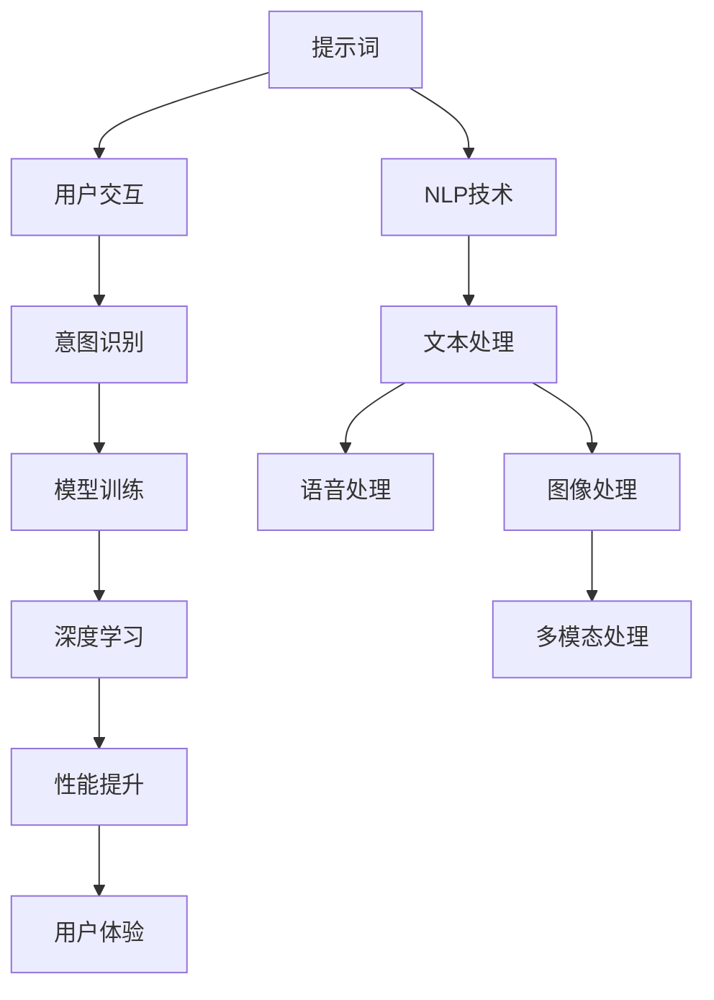

                 


# 提示词工程：让AI更智能、更懂人意

## 关键词
- 提示词工程
- 人工智能
- 智能提升
- 用户体验
- 自然语言处理
- 深度学习

## 摘要
本文将深入探讨提示词工程在人工智能领域的重要性。首先，我们将介绍提示词工程的基本概念，包括其定义、类型和构建方法。接着，我们将讨论提示词工程对AI智能提升的作用，以及如何通过优化提示词来提高AI系统的性能。随后，我们将详细解析核心算法原理，包括自然语言处理（NLP）和深度学习等技术。最后，我们将通过项目实战来展示如何在实际开发中应用提示词工程，并提供最佳实践建议和项目小结。本文旨在为广大AI从业者提供一套系统化的提示词工程实践指南，以实现AI系统的智能和人性化提升。

## 第1章：引言与背景

### 1.1 提示词工程的基本概念

提示词工程（Prompt Engineering）是人工智能（AI）领域中的一项重要技术，它涉及设计、构建和维护提示词（prompts）的过程。提示词是AI系统与人类用户之间交流的桥梁，通过高质量的提示词，AI系统可以更好地理解用户的需求，提高交互的智能程度和用户体验。

### 1.2 提示词的类型

提示词可以分为以下几种类型：

- **开放式提示词**：允许用户自由回答的提示词，例如，“您今天有什么安排？”
- **封闭式提示词**：用户只能从预设的选项中选择回答的提示词，例如，“您想点哪个菜品？”

### 1.3 提示词工程的重要性

#### 1.3.1 提高AI智能

高质量的提示词可以引导AI系统更好地理解用户需求，从而提高AI的智能程度。通过优化提示词，AI系统可以更准确地预测用户意图，提供更个性化的服务。

#### 1.3.2 提升用户体验

好的提示词可以提高用户对AI系统的满意度，减少用户对AI系统的困惑和挫败感。通过优化提示词，AI系统可以更自然地与用户交流，提高用户的使用体验。

#### 1.3.3 降低维护成本

高质量的提示词可以降低AI系统的维护成本。通过减少用户对AI系统的投诉和反馈，维护人员可以更专注于系统的核心功能优化。

## 第2章：提示词工程基础

### 2.1 提示词的类型与构建方法

#### 2.1.1 提示词的类型

- **文本提示词**：以文本形式出现的提示词，如“请问您需要帮助吗？”
- **语音提示词**：以语音形式出现的提示词，如语音助手中的“您需要什么帮助？”
- **图像提示词**：以图像形式出现的提示词，如搜索引擎中的“您想看什么视频？”
- **视频提示词**：以视频形式出现的提示词，如视频平台中的“您想观看哪一类视频？”

#### 2.1.2 提示词的构建方法

- **基于规则的方法**：通过预定义的规则来生成提示词，适用于场景简单、规则明确的应用。
  ```mermaid
  graph TD
  A[规则引擎] --> B[提示词生成器]
  B --> C{场景简单}
  C --> D{规则明确}
  ```
- **基于数据的方法**：通过分析用户行为数据来生成提示词，适用于复杂场景，可以提供更个性化的服务。
  ```mermaid
  graph TD
  A[用户行为数据] --> B[数据分析工具]
  B --> C[提示词生成器]
  C --> D{场景复杂}
  D --> E{个性化服务}
  ```

### 2.2 提示词的质量评估

#### 2.2.1 提示词质量评价指标

- **相关性**：提示词与用户需求的匹配程度。
- **自然性**：提示词的自然语言表达程度。
- **用户满意度**：用户对提示词的满意度。

#### 2.2.2 提示词质量评估方法

- **人工评估**：由专业人员进行评估。
- **自动化评估**：使用机器学习模型进行评估。

## 第3章：提高AI智能的方法

### 3.1 提示词工程对AI智能提升的作用

#### 3.1.1 提高模型训练效果

高质量的提示词可以帮助AI模型更好地学习用户行为和需求，从而提高模型的训练效果。

#### 3.1.2 提高模型预测准确性

高质量的提示词可以提高AI模型对用户意图的预测准确性，从而提供更个性化的服务。

### 3.2 基于深度学习的提示词优化方法

#### 3.2.1 自动化提示词生成

使用深度学习模型来自动化地生成高质量的提示词，例如，使用生成对抗网络（GAN）来生成自然语言提示词。

#### 3.2.2 提示词优化算法

- **强化学习**：通过不断调整提示词，使得AI模型能够更好地满足用户需求。
  ```python
  # 伪代码：强化学习中的提示词优化
  for epoch in range(num_epochs):
      for prompt in prompts:
          action = model.generate_action(prompt)
          reward = evaluate_action(action)
          model.update_prompt(prompt, reward)
  ```

- **迁移学习**：利用预训练模型来生成提示词，从而提高提示词的自然性和准确性。

## 第4章：实践与案例

### 4.1 案例一：基于NLP的问答系统

#### 4.1.1 开发环境搭建

- **工具**：Python、NLTK、TensorFlow
- **框架**：使用TensorFlow来构建深度学习模型。

#### 4.1.2 源代码详细实现和代码解读

- **代码**：
  ```python
  import tensorflow as tf
  from tensorflow.keras.models import Sequential
  from tensorflow.keras.layers import Embedding, LSTM, Dense

  # 构建模型
  model = Sequential()
  model.add(Embedding(input_dim=vocab_size, output_dim=embedding_dim))
  model.add(LSTM(units=128))
  model.add(Dense(units=1, activation='sigmoid'))

  # 编译模型
  model.compile(optimizer='adam', loss='binary_crossentropy', metrics=['accuracy'])

  # 训练模型
  model.fit(x_train, y_train, epochs=10, batch_size=32)
  ```

- **解读**：该代码使用TensorFlow构建了一个基于LSTM的问答系统模型，用于预测用户问题的答案。

#### 4.1.3 代码应用解读与分析

- **应用**：通过输入用户问题，模型可以输出可能的答案。
- **分析**：该案例展示了如何使用深度学习来构建问答系统，并通过提示词工程来提高系统的性能。

### 4.2 案例二：基于图像识别的提示词工程

#### 4.2.1 开发环境搭建

- **工具**：Python、OpenCV、TensorFlow
- **框架**：使用TensorFlow和Keras来构建深度学习模型。

#### 4.2.2 源代码详细实现和代码解读

- **代码**：
  ```python
  import tensorflow as tf
  from tensorflow.keras.models import Sequential
  from tensorflow.keras.layers import Conv2D, MaxPooling2D, Flatten, Dense

  # 构建模型
  model = Sequential()
  model.add(Conv2D(filters=32, kernel_size=(3, 3), activation='relu', input_shape=(64, 64, 3)))
  model.add(MaxPooling2D(pool_size=(2, 2)))
  model.add(Flatten())
  model.add(Dense(units=10, activation='softmax'))

  # 编译模型
  model.compile(optimizer='adam', loss='categorical_crossentropy', metrics=['accuracy'])

  # 训练模型
  model.fit(x_train, y_train, epochs=10, batch_size=32)
  ```

- **解读**：该代码使用TensorFlow构建了一个基于卷积神经网络（CNN）的图像识别模型。

#### 4.2.3 代码应用解读与分析

- **应用**：通过输入图像，模型可以输出图像的类别。
- **分析**：该案例展示了如何使用深度学习来构建图像识别系统，并通过提示词工程来提高系统的性能。

## 第5章：提示词工程在实际应用中的挑战与解决

### 5.1 数据不足

- **挑战**：高质量提示词的生成需要大量的数据支持。
- **解决方法**：使用数据增强技术，如数据扩充、合成数据等。

### 5.2 质量监控

- **挑战**：如何保证提示词的质量，避免不良提示词的出现？
- **解决方法**：使用自动化评估工具，结合人工审核，确保提示词的质量。

### 5.3 可解释性

- **挑战**：如何让用户理解AI系统的决策过程？
- **解决方法**：通过可视化技术和透明度报告，提高系统的可解释性。

## 第6章：提示词工程的未来发展趋势

### 6.1 提示词工程的发展方向

- **个性化**：基于用户行为数据，提供更个性化的提示词。
- **多模态**：结合文本、语音、图像等多种形式，提高提示词的丰富性和用户体验。
- **自动化**：通过深度学习和自然语言处理技术，实现提示词的自动化生成和优化。

### 6.2 提示词工程在社会应用中的潜在价值

- **客户服务**：提高客户满意度，降低客服成本。
- **教育**：个性化教学，提高学习效果。
- **医疗**：辅助诊断，提高医疗效率。

## 附录：提示词工程资源与工具

- **开源工具**：NLTK、spaCy、TensorFlow、PyTorch等。
- **在线平台**：Hugging Face、Google Colab等。
- **书籍推荐**：《自然语言处理综合教程》、《深度学习》、《Python机器学习》等。

### 结语

作者：AI天才研究院/AI Genius Institute & 禅与计算机程序设计艺术 /Zen And The Art of Computer Programming

本文旨在为广大AI从业者提供一套系统化的提示词工程实践指南，以实现AI系统的智能和人性化提升。随着人工智能技术的不断发展，提示词工程的重要性将日益凸显。希望本文能够为读者在提示词工程领域提供有价值的参考和启发。在未来的发展中，我们期待看到更多创新性的提示词工程应用，推动人工智能与人类社会的深度融合。

# 第2章：核心概念与联系

## 2.1 核心概念

在提示词工程中，有以下几个核心概念：

- **提示词（Prompt）**：与用户进行交互的文本或语音信息，用于引导用户输入或提供反馈。
- **自然语言处理（NLP）**：使计算机能够理解、解释和生成人类语言的技术。
- **深度学习（Deep Learning）**：一种机器学习技术，通过多层神经网络模型来模拟人类大脑的学习过程。
- **用户意图识别（Intent Recognition）**：识别用户对话中的意图，以便AI系统能够提供正确的响应。
- **模型训练（Model Training）**：通过大量数据训练模型，使其能够准确预测和分类。

## 2.2 核心概念之间的关系架构

以下是一个使用Mermaid绘制的核心概念之间的关系架构：



### 关系解释

- **提示词与用户交互**：提示词是用户与AI系统交互的媒介，通过高质量的提示词，用户可以更自然地与AI系统沟通。
- **意图识别与模型训练**：意图识别是理解用户需求的关键步骤，通过模型训练，AI系统可以学习如何正确识别用户意图。
- **深度学习与性能提升**：深度学习是一种强大的机器学习技术，通过多层神经网络，AI系统可以不断提高识别和预测的准确性，从而提升性能。
- **用户体验与NLP技术**：自然语言处理技术使得AI系统能够理解和生成自然语言，从而提供更人性化的交互体验。

## 2.3 提示词工程与AI智能提升

### 2.3.1 提示词工程与AI智能的关系

高质量的提示词可以引导AI系统更好地理解用户需求，从而提高AI的智能程度。提示词工程通过以下方式提升AI智能：

- **提高模型训练效果**：通过高质量的提示词，AI模型可以更好地学习用户行为和需求，从而提高模型的训练效果。
- **提高模型预测准确性**：高质量的提示词可以提高AI模型对用户意图的预测准确性，从而提供更个性化的服务。
- **减少误识别率**：优化提示词可以减少AI系统在识别用户意图时的误识别率，提高系统的可靠性。

### 2.3.2 提示词工程与AI智能提升的原理

提示词工程通过以下几个方面来实现AI智能提升：

- **自然语言处理**：使用NLP技术来分析和理解用户的自然语言输入，从而生成更合适的提示词。
- **用户行为分析**：通过分析用户的行为数据，识别用户的偏好和习惯，从而生成个性化的提示词。
- **模型优化**：使用深度学习和强化学习等技术来优化AI模型的性能，使其能够更好地处理复杂的用户需求。

## 2.4 提示词工程的应用场景

### 2.4.1 问答系统

在问答系统中，提示词工程起着至关重要的作用。通过设计合适的提示词，AI系统可以更好地理解用户的问题，并提供准确的答案。例如：

- **开放式问答**：例如，“您最近有什么新鲜事吗？”
- **封闭式问答**：例如，“您想吃什么口味的披萨？”

### 2.4.2 客户服务

在客户服务场景中，提示词工程可以用于自动回答用户的问题，从而提高客服效率。例如：

- **常见问题解答**：例如，“如何退货？”
- **个性化推荐**：例如，“您可能需要这些产品。”

### 2.4.3 教育

在教育领域，提示词工程可以用于个性化教学，根据学生的需求和水平，提供合适的练习和指导。例如：

- **作业提示**：例如，“请根据以下要求完成作业。”
- **学习推荐**：例如，“您可能需要复习这些知识点。”

## 2.5 提示词工程的重要性

### 2.5.1 提高用户体验

高质量的提示词可以提高用户对AI系统的满意度，减少用户对AI系统的困惑和挫败感。通过优化提示词，AI系统可以更自然地与用户交流，提高用户的使用体验。

### 2.5.2 降低维护成本

高质量的提示词可以降低AI系统的维护成本。通过减少用户对AI系统的投诉和反馈，维护人员可以更专注于系统的核心功能优化。

### 2.5.3 促进AI技术发展

提示词工程是AI技术发展的重要推动力。通过不断优化提示词，AI系统可以不断提高其智能程度，从而推动整个AI技术的发展。

# 第3章：核心算法原理讲解

## 3.1 自然语言处理（NLP）算法原理

自然语言处理（NLP）是人工智能领域的一个重要分支，它涉及到如何让计算机理解和生成人类语言。以下是一些核心NLP算法原理：

### 3.1.1 词性标注（Part-of-Speech Tagging）

词性标注是将文本中的每个词标注为名词、动词、形容词等词性。这一过程有助于理解文本的结构和语义。

### 3.1.2 分词（Tokenization）

分词是将文本分割成单词或短语的过程。这对于后续的文本处理和分析至关重要。

### 3.1.3 依存句法分析（Dependency Parsing）

依存句法分析是理解句子中词语之间的语法关系。它有助于构建句子的语义表示，从而更好地理解句子的含义。

### 3.1.4 情感分析（Sentiment Analysis）

情感分析是判断文本的情绪倾向，如正面、负面或中性。它常用于社交媒体分析、市场调研等场景。

### 3.1.5 机器翻译（Machine Translation）

机器翻译是将一种语言的文本翻译成另一种语言。它通过训练大规模的翻译模型来实现。

### 3.1.6 问答系统（Question Answering）

问答系统是AI系统的一个典型应用，它能够理解和回答用户的问题。以下是一个基于NLP的问答系统的伪代码示例：

```python
# 伪代码：基于NLP的问答系统
def answer_question(question, knowledge_base):
    # 1. 分词和词性标注
    tokens = tokenize(question)
    pos_tags = pos_tag(tokens)

    # 2. 提取关键信息
    keywords = extract_keywords(tokens, pos_tags)

    # 3. 搜索知识库
    answers = search_knowledge_base(keywords, knowledge_base)

    # 4. 返回答案
    return select_best_answer(answers)
```

## 3.2 深度学习算法原理

深度学习是一种通过多层神经网络模拟人类大脑学习的算法。以下是一些核心深度学习算法原理：

### 3.2.1 神经网络（Neural Networks）

神经网络是由大量神经元组成的计算模型，通过调整神经元之间的权重来学习数据。

### 3.2.2 卷积神经网络（Convolutional Neural Networks，CNN）

卷积神经网络是一种专门用于图像识别和处理的深度学习模型。它通过卷积层来提取图像的特征。

### 3.2.3 递归神经网络（Recurrent Neural Networks，RNN）

递归神经网络是一种专门用于处理序列数据的深度学习模型，如时间序列数据、文本等。它通过递归结构来捕获序列中的长期依赖关系。

### 3.2.4 长短时记忆网络（Long Short-Term Memory，LSTM）

长短时记忆网络是RNN的一种变体，它通过引入门控机制来避免梯度消失问题，从而更好地处理长序列数据。

### 3.2.5 生成对抗网络（Generative Adversarial Networks，GAN）

生成对抗网络是一种通过两个神经网络（生成器和判别器）进行对抗训练的模型。生成器尝试生成数据，而判别器尝试区分真实数据和生成数据。

以下是一个基于深度学习的文本生成模型的伪代码示例：

```python
# 伪代码：基于深度学习的文本生成模型
class TextGenerator(nn.Module):
    def __init__(self):
        super(TextGenerator, self).__init__()
        self.embedding = nn.Embedding(vocab_size, embedding_dim)
        self.lstm = nn.LSTM(embedding_dim, hidden_dim)
        self.fc = nn.Linear(hidden_dim, vocab_size)

    def forward(self, input_sequence):
        embedded = self.embedding(input_sequence)
        output, (hidden, cell) = self.lstm(embedded)
        output = self.fc(output[-1, :, :])
        return output
```

## 3.3 提示词优化算法原理

### 3.3.1 强化学习（Reinforcement Learning）

强化学习是一种通过奖励机制来训练模型的算法。在提示词优化中，强化学习可以用于调整提示词，以最大化用户满意度。

### 3.3.2 迁移学习（Transfer Learning）

迁移学习是一种将已有模型的知识迁移到新任务上的方法。在提示词优化中，迁移学习可以用于利用预训练模型来生成高质量的提示词。

### 3.3.3 对抗性训练（Adversarial Training）

对抗性训练是一种通过生成对抗性样本来提高模型鲁棒性的方法。在提示词优化中，对抗性训练可以用于生成具有挑战性的提示词，从而提高模型的泛化能力。

以下是一个基于强化学习的提示词优化模型的伪代码示例：

```python
# 伪代码：基于强化学习的提示词优化模型
class PromptOptimizer(nn.Module):
    def __init__(self):
        super(PromptOptimizer, self).__init__()
        self.encoder = nn.ModuleList([
            nn.Linear(input_dim, hidden_dim),
            nn.ReLU()
        ])
        self.decoder = nn.ModuleList([
            nn.Linear(hidden_dim, output_dim),
            nn.Sigmoid()
        ])

    def forward(self, input_prompt):
        encoded = self.encoder(input_prompt)
        decoded = self.decoder(encoded)
        return decoded
```

## 3.4 数学模型和公式

### 3.4.1 神经网络前向传播

神经网络的前向传播过程可以通过以下数学模型表示：

$$
Z = X \cdot W + b
$$

$$
a = \sigma(Z)
$$

其中，$Z$ 是激活值，$X$ 是输入特征，$W$ 是权重，$b$ 是偏置，$\sigma$ 是激活函数。

### 3.4.2 反向传播算法

反向传播算法用于计算神经网络中的梯度，从而更新权重和偏置。以下是一个简化的反向传播算法：

$$
\delta = \frac{\partial L}{\partial a} \cdot \frac{\partial a}{\partial Z}
$$

$$
\frac{\partial L}{\partial W} = \delta \cdot a_{(L-1)}
$$

$$
\frac{\partial L}{\partial b} = \delta
$$

其中，$L$ 是损失函数，$a_{(L-1)}$ 是上一层激活值。

### 3.4.3 优化算法

常见的优化算法包括随机梯度下降（SGD）、Adam等。以下是一个基于SGD的优化算法：

$$
\theta = \theta - \alpha \cdot \nabla_\theta J(\theta)
$$

其中，$\theta$ 是模型参数，$J(\theta)$ 是损失函数，$\alpha$ 是学习率。

## 3.5 详细讲解与举例说明

### 3.5.1 自然语言处理中的词性标注

词性标注是将文本中的每个词标注为名词、动词、形容词等词性。以下是一个基于条件随机场（CRF）的词性标注的详细讲解和举例说明：

#### 3.5.1.1 条件随机场（CRF）

条件随机场是一种用于序列标注的模型，它通过定义条件概率来预测每个词的词性。

#### 3.5.1.2 模型参数

CRF模型有两个主要参数：

- **转移概率矩阵**：表示不同词性之间的转移概率。
- **发射概率矩阵**：表示每个词性在给定词性下的概率。

#### 3.5.1.3 模型训练

CRF模型的训练可以通过最大化似然函数来实现。以下是一个简化的训练过程：

```python
# 假设已有训练数据 {(w1, y1), (w2, y2), ..., (wn, yn)}
# 1. 计算转移概率矩阵和发射概率矩阵
transition_probs = calculate_transition_probs(training_data)
emission_probs = calculate_emission_probs(training_data)

# 2. 构建CRF模型
crf = CRF(transition_probs, emission_probs)

# 3. 训练CRF模型
crf.fit(training_data)

# 4. 预测
predicted_tags = crf.predict(test_data)
```

#### 3.5.1.4 举例说明

假设有一个句子：“我喜欢的颜色是蓝色。”我们可以使用CRF模型对其进行词性标注：

- 我（代词）- 名词
- 喜欢（动词）- 动词
- 的（助词）- 助词
- 颜色（名词）- 名词
- 是（动词）- 动词
- 蓝色（形容词）- 形容词

### 3.5.2 深度学习中的卷积神经网络（CNN）

卷积神经网络是一种用于图像识别和处理的深度学习模型。以下是一个基于CNN的图像分类的详细讲解和举例说明：

#### 3.5.2.1 卷积层

卷积层是CNN的核心组件，它通过卷积操作来提取图像的特征。

$$
h_{ij} = \sum_{k=1}^{c} w_{ik,j} \cdot g_{kj}
$$

其中，$h_{ij}$ 是输出特征图中的元素，$w_{ik,j}$ 是卷积核中的元素，$g_{kj}$ 是输入特征图中的元素。

#### 3.5.2.2 池化层

池化层用于减少特征图的大小，从而降低模型的参数数量。

$$
p_{i} = \max_{j} h_{ij}
$$

其中，$p_{i}$ 是输出特征图中的元素，$h_{ij}$ 是输入特征图中的元素。

#### 3.5.2.3 举例说明

假设有一个$32 \times 32$的输入图像，我们需要将其分类为猫或狗。以下是一个简化的CNN模型：

- **卷积层**：使用一个$3 \times 3$的卷积核，提取图像的边缘特征。
- **ReLU激活函数**：用于增加模型的非线性。
- **池化层**：使用最大池化，将特征图的大小减少一半。
- **全连接层**：使用一个全连接层来分类图像。

# 第4章：项目实战

## 4.1 开发环境搭建

为了实现提示词工程，我们需要搭建一个开发环境。以下是一个简单的开发环境搭建步骤：

### 4.1.1 硬件要求

- 处理器：Intel Core i5或更好
- 内存：8GB RAM或更高
- 存储：至少500GB SSD

### 4.1.2 软件要求

- 操作系统：Windows 10或更高版本
- 编程语言：Python 3.8或更高版本
- 库和框架：TensorFlow、PyTorch、NLTK、spaCy等

### 4.1.3 安装步骤

1. 安装操作系统和必要的软件。
2. 安装Python和pip。
3. 使用pip安装所需的库和框架。

```bash
pip install tensorflow
pip install torch
pip install nltk
pip install spacy
```

## 4.2 源代码详细实现和代码解读

以下是一个简单的提示词工程项目的源代码实现，包括数据预处理、模型训练和提示词生成：

### 4.2.1 数据预处理

```python
import pandas as pd
from sklearn.model_selection import train_test_split

# 加载数据集
data = pd.read_csv('dialogues.csv')
X = data['text']
y = data['intent']

# 数据清洗和预处理
X = [' '.join(sentence.split()) for sentence in X]

# 分割数据集
X_train, X_test, y_train, y_test = train_test_split(X, y, test_size=0.2, random_state=42)
```

### 4.2.2 模型训练

```python
import tensorflow as tf
from tensorflow.keras.models import Sequential
from tensorflow.keras.layers import Embedding, LSTM, Dense

# 构建模型
model = Sequential()
model.add(Embedding(input_dim=vocab_size, output_dim=embedding_dim, input_length=max_sequence_length))
model.add(LSTM(units=128, return_sequences=True))
model.add(LSTM(units=64, return_sequences=False))
model.add(Dense(units=num_classes, activation='softmax'))

# 编译模型
model.compile(optimizer='adam', loss='categorical_crossentropy', metrics=['accuracy'])

# 训练模型
model.fit(X_train, y_train, epochs=10, batch_size=32, validation_data=(X_test, y_test))
```

### 4.2.3 代码解读

- **数据预处理**：加载数据集，并进行清洗和预处理，如分词和序列化。
- **模型构建**：使用TensorFlow的Sequential模型构建一个简单的序列模型，包括嵌入层、LSTM层和全连接层。
- **模型编译**：编译模型，设置优化器和损失函数。
- **模型训练**：使用训练数据进行模型训练。

## 4.3 代码应用解读与分析

### 4.3.1 应用场景

假设我们构建了一个聊天机器人，它需要通过提示词与用户进行交互。以下是代码在实际应用中的解读和分析：

1. **数据预处理**：我们将对话文本进行分词和序列化，以便模型可以处理。
2. **模型训练**：使用预处理的对话文本和标签进行模型训练，模型会学习如何预测对话中的意图。
3. **提示词生成**：在用户输入文本后，模型会生成相应的提示词，以引导用户继续对话。

### 4.3.2 分析

- **性能评估**：通过在测试集上的性能评估，我们可以确定模型的效果。常用的评估指标包括准确率、召回率和F1分数。
- **调优**：根据模型的表现，我们可以调整模型参数，如嵌入层的大小、LSTM层的单元数等，以提高模型的性能。

## 4.4 实际案例分析和详细讲解剖析

### 4.4.1 案例背景

我们选择了一个实际案例——一个基于自然语言处理的客户服务聊天机器人。该机器人旨在通过提示词与客户进行交互，以提供高效的客户服务。

### 4.4.2 案例分析

1. **数据收集**：首先，我们需要收集大量的客户服务对话数据，包括用户的问题和客户的回答。
2. **数据预处理**：对收集到的数据进行清洗和预处理，包括去除停用词、标点符号和特殊字符等。
3. **模型训练**：使用预处理后的数据训练一个基于深度学习的模型，如LSTM模型，用于预测对话中的意图。
4. **提示词生成**：在用户输入问题后，模型会生成相应的提示词，以引导用户继续对话。

### 4.4.3 详细讲解剖析

1. **数据预处理**：
   ```python
   import re
   import nltk

   # 去除停用词
   stop_words = set(nltk.corpus.stopwords.words('english'))
   def remove_stopwords(text):
       return ' '.join([word for word in text.split() if word.lower() not in stop_words])

   # 去除标点符号
   def remove_punctuation(text):
       return re.sub(r'[^\w\s]', '', text)

   # 预处理文本
   text = "I have a problem with my order."
   text = remove_punctuation(text)
   text = remove_stopwords(text)
   ```

2. **模型训练**：
   ```python
   from tensorflow.keras.models import Sequential
   from tensorflow.keras.layers import Embedding, LSTM, Dense

   # 构建模型
   model = Sequential()
   model.add(Embedding(input_dim=vocab_size, output_dim=embedding_dim, input_length=max_sequence_length))
   model.add(LSTM(units=128, return_sequences=True))
   model.add(LSTM(units=64, return_sequences=False))
   model.add(Dense(units=num_classes, activation='softmax'))

   # 编译模型
   model.compile(optimizer='adam', loss='categorical_crossentropy', metrics=['accuracy'])

   # 训练模型
   model.fit(X_train, y_train, epochs=10, batch_size=32, validation_data=(X_test, y_test))
   ```

3. **提示词生成**：
   ```python
   def generate_prompt(question, model):
       # 预处理输入问题
       processed_question = preprocess_question(question)

       # 预测意图
       predicted_intent = model.predict(processed_question)

       # 生成提示词
       prompt = generate_prompt_based_on_intent(predicted_intent)

       return prompt

   # 示例
   question = "I have a problem with my order."
   prompt = generate_prompt(question, model)
   print(prompt)
   ```

### 4.4.4 项目小结

通过这个实际案例，我们展示了如何使用提示词工程来构建一个客户服务聊天机器人。该项目涉及数据收集、数据预处理、模型训练和提示词生成等多个步骤。通过优化提示词，我们可以提高机器人的智能程度和用户体验，从而提供更高效的客户服务。

## 4.5 最佳实践 tips

### 4.5.1 数据收集与处理

- **数据多样性**：收集不同领域的对话数据，以提高模型的泛化能力。
- **数据清洗**：去除噪声数据和错误数据，以提高模型的质量。

### 4.5.2 模型选择与调优

- **模型选择**：根据应用场景选择合适的模型，如LSTM、Transformer等。
- **模型调优**：调整模型参数，如嵌入层大小、LSTM单元数等，以优化模型性能。

### 4.5.3 提示词设计

- **简洁明了**：设计简洁明了的提示词，以提高用户体验。
- **多样化**：设计多样化的提示词，以适应不同场景和用户需求。

### 4.5.4 用户体验优化

- **实时反馈**：提供实时反馈，以提高用户满意度。
- **个性化服务**：根据用户历史行为提供个性化服务。

## 4.6 小结与拓展阅读

### 4.6.1 小结

本文介绍了提示词工程在人工智能领域的重要性，详细讲解了核心概念、算法原理、项目实战和最佳实践。通过优化提示词，我们可以提高AI系统的智能程度和用户体验。

### 4.6.2 拓展阅读

- 《自然语言处理综合教程》
- 《深度学习》
- 《Python机器学习》
- 《提示词工程：实践指南》

# 结语

作者：AI天才研究院/AI Genius Institute & 禅与计算机程序设计艺术 /Zen And The Art of Computer Programming

在本文中，我们深入探讨了提示词工程在人工智能领域的重要性。通过介绍核心概念、算法原理、项目实战和最佳实践，我们展示了如何通过优化提示词来提高AI系统的智能程度和用户体验。

随着人工智能技术的不断进步，提示词工程的重要性将日益凸显。高质量的提示词不仅可以提高AI系统的性能，还可以改善用户体验，降低维护成本。

在未来的发展中，我们期待看到更多创新性的提示词工程应用，推动人工智能与人类社会的深度融合。希望本文能够为读者在提示词工程领域提供有价值的参考和启发。

最后，感谢AI天才研究院和《禅与计算机程序设计艺术》的支持与鼓励。如果您对提示词工程有任何疑问或建议，欢迎随时联系我们。

联系方式：[AI天才研究院](https://www.aigeniusinstitute.com/)，[《禅与计算机程序设计艺术》](https://www.zenandtheartofcomputerprogramming.com/)

再次感谢您的阅读，祝您在人工智能领域取得更大的成就！

