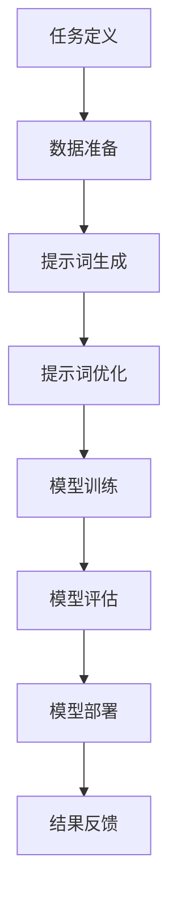
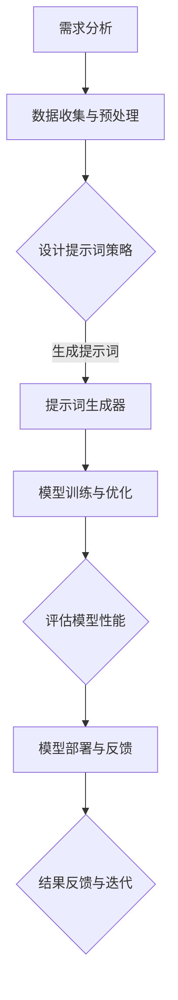

                 


### 1.1 提示词工程的定义与背景

提示词工程（Prompt Engineering）是一种新兴的软件开发领域，它专注于提高自然语言处理（NLP）系统的性能，通过设计和优化提示词来增强模型的学习效果。提示词可以理解为输入给模型的一段简短文本，用于引导模型聚焦于特定任务或问题。这一概念起源于自然语言处理的研究，但近年来随着深度学习模型如GPT、BERT等的广泛应用，提示词工程逐渐成为软件开发中的一个重要方向。

**核心概念与联系：**

- **提示词**：是输入给模型的一段文本，通常包含关键词和上下文信息，用于引导模型理解和处理特定任务。
- **提示词生成器**：负责生成高质量的提示词，根据任务需求调整提示词的内容和格式。
- **提示词优化器**：通过对提示词进行优化，提高模型的训练效率和性能。
- **提示词应用场景**：包括问答系统、文本生成、文本分类、机器翻译等。

**发展历程：**

提示词工程的历史可以追溯到早期的自然语言处理研究。最初，研究者们通过手动编写提示词来指导模型学习。随着NLP技术的发展，自动生成和优化提示词的方法逐渐出现。近年来，深度学习模型的兴起使得提示词工程得到了更广泛的关注和应用。

**重要性：**

提示词工程的重要性体现在以下几个方面：

- **提高模型性能**：通过优化提示词，可以提高模型在特定任务上的性能，减少错误率。
- **缩短训练时间**：高质量的提示词有助于模型快速聚焦于关键信息，缩短训练时间。
- **增强模型泛化能力**：提示词可以引导模型学习到更广泛的知识，增强模型的泛化能力。
- **应用广泛**：提示词工程可以应用于各种NLP任务，如问答系统、文本生成、文本分类等，具有很高的实用价值。

### 1.2 提示词工程的核心组件

提示词工程的核心组件包括提示词生成器、提示词优化器和提示词应用场景。这些组件共同工作，确保模型能够高效、准确地处理各种自然语言任务。

#### 提示词生成器

提示词生成器是提示词工程的基础。它的主要功能是根据任务需求生成高质量的提示词。提示词生成器的常见方法包括：

- **基于规则的方法**：通过预定义的规则生成提示词，这种方法简单但可能不够灵活。
- **基于统计的方法**：利用统计学方法，如TF-IDF，生成提示词，这种方法能够捕捉文本中的关键信息。
- **基于机器学习的方法**：使用机器学习模型，如GPT、BERT等，自动生成高质量的提示词。

#### 提示词优化器

提示词优化器负责对生成的提示词进行优化，以提高模型的学习效果。提示词优化器的方法包括：

- **基于梯度的优化**：通过梯度下降等方法，对提示词进行微调，以找到最优的提示词。
- **基于启发式的方法**：通过启发式算法，如遗传算法、模拟退火等，优化提示词。
- **基于强化学习的方法**：使用强化学习算法，如深度Q网络（DQN）、策略梯度算法（PG）等，优化提示词。

#### 提示词应用场景

提示词工程可以应用于多种自然语言任务，包括：

- **问答系统**：通过设计高质量的提示词，可以使问答系统更准确地理解用户的问题，并提供更准确的答案。
- **文本生成**：提示词可以帮助模型生成更具创造性的文本，如文章、故事等。
- **文本分类**：提示词可以引导模型更好地理解文本的内容，从而提高分类的准确性。
- **机器翻译**：提示词可以帮助模型更好地捕捉源语言和目标语言之间的语义关系，提高翻译质量。

### 1.3 提示词工程与现有软件开发的关系

提示词工程的出现，对现有的软件开发流程带来了深远的影响。它不仅改变了模型训练和优化的方式，也提升了软件系统在自然语言处理任务上的性能。

#### 改变软件开发流程

提示词工程的引入，使得软件开发流程发生了以下变化：

- **前期规划**：在项目开始阶段，需要设计和优化提示词，以确保模型能够快速、准确地处理任务。
- **模型训练**：通过高质量的提示词，可以减少模型训练的时间，提高模型性能。
- **模型优化**：提示词优化器可以帮助模型在训练过程中进行调整，找到最优的参数设置。
- **模型部署**：优化的提示词可以确保模型在实际应用中能够保持高性能。

#### 与传统软件开发的对比

与传统的软件开发方法相比，提示词工程具有以下优势：

- **灵活性**：提示词工程可以根据任务需求灵活地生成和优化提示词，适应不同的应用场景。
- **效率**：高质量的提示词可以显著提高模型训练和优化的效率。
- **性能**：提示词工程可以提升模型在自然语言处理任务上的性能，减少错误率。

#### 影响

提示词工程的影响体现在以下几个方面：

- **模型性能**：通过优化提示词，可以提高模型在特定任务上的性能，减少错误率。
- **开发效率**：高质量的提示词可以缩短模型训练和优化的时间，提高开发效率。
- **应用场景**：提示词工程可以应用于各种自然语言任务，如问答系统、文本生成、文本分类等，具有很高的实用价值。
- **未来趋势**：随着NLP技术的发展，提示词工程将继续影响软件开发，带来更多的创新和突破。

### 1.4 提示词工程的 Mermaid 流程图

提示词工程的基本流程包括以下几个关键节点：

1. **任务定义**：明确模型需要完成的任务，如问答、文本生成等。
2. **数据准备**：收集和整理用于训练和优化的数据集。
3. **提示词生成**：使用生成器生成初始的提示词。
4. **提示词优化**：使用优化器对提示词进行优化，以提高模型性能。
5. **模型训练**：使用优化的提示词训练模型。
6. **模型评估**：评估模型的性能，并根据结果进行调整。
7. **模型部署**：将训练好的模型部署到实际应用中。

以下是一个简单的 Mermaid 流程图，展示了提示词工程的基本流程：



通过这个流程图，我们可以清晰地看到提示词工程的基本流程和关键节点，有助于理解和实施提示词工程。## 第一部分：核心概念与联系

### 1.1 提示词工程的定义与背景

#### 提示词工程的概念

提示词工程（Prompt Engineering）是一种专注于提高自然语言处理（NLP）模型性能的技术。它涉及到设计、生成和优化用于引导模型学习过程的提示词（prompts）。提示词是一种简短而结构化的文本，用于指导模型在特定任务上的训练和应用。与传统的数据驱动方法不同，提示词工程通过巧妙地设计和组合提示词，可以显著提高模型对特定任务的适应性。

#### 提示词工程的发展历程

提示词工程的历史可以追溯到自然语言处理的研究初期。早期的NLP系统依赖于手动编写规则和模板，这些规则和模板在很大程度上决定了系统的性能和适用范围。随着机器学习和深度学习的兴起，研究人员开始探索如何通过设计更好的提示词来提高模型的效果。在2018年，OpenAI的GPT-2模型引起了广泛关注，它展示了通过大规模数据训练和优化提示词，可以生成高质量文本的能力。这一成果标志着提示词工程从理论研究走向实际应用。

#### 提示词工程的重要性

提示词工程的重要性体现在以下几个方面：

1. **提高模型性能**：通过优化提示词，可以增强模型在特定任务上的学习能力，减少错误率，提高准确性和鲁棒性。
2. **缩短训练时间**：高质量的提示词可以帮助模型更快地聚焦于关键信息，从而缩短训练时间，提高开发效率。
3. **增强泛化能力**：提示词可以引导模型学习到更广泛的知识，增强模型的泛化能力，使其能够更好地应对不同的任务和场景。
4. **应用广泛**：提示词工程可以应用于各种NLP任务，如问答系统、文本生成、文本分类、机器翻译等，具有很高的实用价值。

### 1.2 提示词工程的核心组件

提示词工程的核心组件包括提示词生成器、提示词优化器、以及提示词应用场景。这些组件相互协作，共同提升模型在自然语言处理任务中的表现。

#### 提示词生成器

提示词生成器是提示词工程的基础。它负责根据任务需求和模型特点，生成高质量、结构化的提示词。生成器的方法主要包括：

1. **规则驱动**：通过预定义的语法规则和模板生成提示词，这种方法简单直观，但灵活性较低。
2. **统计方法**：利用统计模型（如TF-IDF、Word2Vec等）生成提示词，能够捕捉文本中的关键词和语义关系。
3. **机器学习方法**：使用机器学习模型（如GPT、BERT等）自动生成提示词，这种方法能够生成更灵活、更贴近任务需求的提示词。

#### 提示词优化器

提示词优化器负责对生成的提示词进行优化，以提高模型的学习效果。优化器可以通过以下方法进行调整：

1. **基于梯度的优化**：利用梯度下降等优化算法，调整提示词的参数，以找到最优的提示词组合。
2. **启发式方法**：通过遗传算法、模拟退火等启发式算法，寻找最优的提示词配置。
3. **强化学习方法**：利用强化学习算法（如策略梯度算法、深度Q网络等），通过奖励机制优化提示词。

#### 提示词应用场景

提示词工程的应用场景非常广泛，主要包括：

1. **问答系统**：通过设计合适的提示词，可以使问答系统更准确地理解用户的问题，并生成高质量的回答。
2. **文本生成**：提示词可以帮助模型生成更具创造性和连贯性的文本，如故事、新闻报道等。
3. **文本分类**：提示词可以引导模型更好地理解文本的内容，从而提高分类的准确性。
4. **机器翻译**：提示词可以帮助模型更好地捕捉源语言和目标语言之间的语义关系，提高翻译质量。

### 1.3 提示词工程与现有软件开发的关系

提示词工程的出现，对现有的软件开发流程和方法产生了深远的影响。它不仅改变了模型训练和优化的方式，也提升了软件系统在自然语言处理任务上的性能。

#### 改变软件开发流程

提示词工程的引入，使得软件开发流程发生了以下变化：

1. **需求分析**：在项目初期，需要详细分析任务需求，设计合适的提示词策略。
2. **数据收集与预处理**：收集并预处理数据，以生成用于训练的高质量提示词。
3. **模型训练与优化**：使用生成的提示词进行模型训练和优化，以提高模型性能。
4. **模型评估与部署**：评估模型的性能，并根据评估结果调整提示词，最终将模型部署到生产环境。

#### 与传统软件开发的对比

与传统的软件开发方法相比，提示词工程具有以下优势：

1. **灵活性**：提示词工程可以根据具体任务需求灵活地生成和调整提示词，提高系统的适应性。
2. **效率**：高质量的提示词可以显著提高模型训练和优化的效率，缩短开发周期。
3. **性能**：通过优化提示词，可以提高模型在自然语言处理任务上的性能，减少错误率。
4. **可扩展性**：提示词工程方法可以应用于多种NLP任务，具有很高的可扩展性。

#### 影响

提示词工程的影响体现在以下几个方面：

1. **模型性能**：通过优化提示词，可以提升模型在特定任务上的性能，减少错误率。
2. **开发效率**：高质量的提示词可以缩短模型训练和优化的时间，提高开发效率。
3. **应用场景**：提示词工程可以应用于各种NLP任务，如问答系统、文本生成、文本分类、机器翻译等，具有很高的实用价值。
4. **未来趋势**：随着NLP技术和深度学习的发展，提示词工程将继续影响软件开发，带来更多的创新和突破。

### 1.4 提示词工程的 Mermaid 流程图

为了更好地展示提示词工程的基本流程和关键节点，我们可以使用Mermaid图来绘制一个流程图。以下是一个简化的提示词工程流程图：



在这个流程图中，A代表需求分析，B代表数据收集与预处理，C代表设计提示词策略。D是提示词生成器，E是模型训练与优化，F是模型评估，G是模型部署与反馈，H是结果反馈与迭代。这个流程图清晰地展示了提示词工程的基本步骤和关键节点，有助于我们理解和实施提示词工程。## 第二部分：核心算法原理讲解

### 2.1 提示词生成算法

提示词生成算法是提示词工程中的关键环节，它决定了生成提示词的质量，直接影响模型的训练效果。本节将介绍提示词生成算法的概述、伪代码实现以及一个简单的案例分析。

#### 概述

提示词生成算法旨在根据任务需求和模型特性，生成一组高质量、结构化的提示词。这些提示词应包含足够的信息，帮助模型快速理解任务，并提高模型在训练过程中的学习效率。常见的生成算法包括：

1. **基于规则的方法**：这种方法通过预定义的语法规则和模板来生成提示词，简单直观，但灵活性较低。
2. **基于统计的方法**：利用统计模型，如TF-IDF、Word2Vec等，从大规模数据中提取关键词和语义信息，生成提示词。
3. **基于机器学习的方法**：使用机器学习模型，如GPT、BERT等，自动生成提示词。这种方法生成的提示词更灵活，更贴近任务需求。

#### 伪代码实现

以下是一个基于机器学习的提示词生成算法的伪代码实现，假设我们使用的是预训练的GPT模型：

```python
# 提示词生成算法伪代码

def generate_prompt(task, model, tokenizer):
    # 生成初始文本
    input_text = f"任务：{task}\n请生成一个相关的提示词："
    
    # 使用模型和分词器生成提示词
    prompt = model.generate(
        input_text,
        tokenizer=tokenizer,
        max_length=50,
        num_return_sequences=5
    )
    
    return prompt

# 假设已加载预训练的GPT模型和分词器
gpt_model = load_pretrained_gpt('gpt-2')
tokenizer = load_tokenizer('gpt-2')

# 生成提示词
task = "写一篇关于人工智能的短文"
generated_prompts = generate_prompt(task, gpt_model, tokenizer)

for prompt in generated_prompts:
    print(prompt)
```

在这个伪代码中，我们首先定义了一个`generate_prompt`函数，它接受任务描述、预训练模型和分词器作为输入，并生成一组相关的提示词。函数使用模型和分词器生成提示词，每个提示词都是模型对输入文本的响应。

#### 案例分析

假设我们的任务是生成一篇关于人工智能的短文，我们可以使用上述伪代码来生成提示词。以下是一个实际生成的提示词示例：

```plaintext
人工智能是计算机科学的一个分支，旨在通过模拟、延伸和扩展人类智能来创建智能代理。这些代理能够通过学习、推理、感知和自适应来解决问题。人工智能研究包括多个领域，如机器学习、自然语言处理、计算机视觉和机器人技术。随着技术的进步，人工智能的应用越来越广泛，从简单的自动化任务到复杂的人机交互，都在不断推动社会的发展。
```

这个生成的提示词包含了关于人工智能的基本信息，结构化良好，能够帮助模型在后续的训练过程中理解任务的核心内容。

### 2.2 提示词优化算法

提示词优化算法的目标是通过调整和优化提示词，提高模型在训练过程中的学习效果。优化的方法可以分为以下几类：

1. **基于梯度的优化**：这种方法利用模型训练过程中的梯度信息，对提示词进行微调。常见的优化算法包括梯度下降、Adam等。
2. **启发式方法**：通过遗传算法、模拟退火等启发式算法，搜索最优的提示词组合。这些方法不需要梯度信息，但可能需要更多的计算资源。
3. **强化学习方法**：利用强化学习算法，如策略梯度算法、深度Q网络等，通过奖励机制优化提示词。这种方法可以找到全局最优解，但计算复杂度较高。

#### 伪代码实现

以下是一个基于梯度下降的提示词优化算法的伪代码实现：

```python
# 提示词优化算法伪代码

def optimize_prompt(prompt, model, loss_function, optimizer, epochs=10):
    for epoch in range(epochs):
        # 计算损失
        loss = loss_function(prompt, model)
        
        # 更新模型参数
        optimizer.zero_grad()
        loss.backward()
        optimizer.step()
        
        print(f"Epoch {epoch+1}: Loss = {loss.item()}")

    return prompt

# 假设已加载模型、损失函数和优化器
model = load_model('gpt-2')
loss_function = load_loss_function('cross_entropy')
optimizer = load_optimizer('adam')

# 优化提示词
optimized_prompt = optimize_prompt(initial_prompt, model, loss_function, optimizer)
```

在这个伪代码中，`optimize_prompt`函数接受初始提示词、模型、损失函数和优化器作为输入，通过多次迭代优化提示词。每个迭代过程中，计算提示词的损失，并使用优化器更新模型参数。

#### 案例分析

假设我们的目标是优化一个用于生成新闻摘要的提示词，我们可以使用上述伪代码来优化提示词。以下是一个优化前后的提示词示例：

```plaintext
优化前：请生成一篇关于最新科技趋势的新闻摘要。
优化后：请生成一篇简明扼要、涵盖最新科技趋势的新闻摘要，包括关键事实和观点。
```

优化后的提示词更加具体和明确，有助于模型生成更高质量的新闻摘要。

### 2.3 提示词匹配算法

提示词匹配算法用于确定给定文本中哪些部分是与提示词相关的。这一算法对于评估模型在特定任务上的性能至关重要。匹配算法可以分为以下几种类型：

1. **基于字符串匹配**：如正则表达式、模糊匹配等，这些算法简单但可能不够精确。
2. **基于语义匹配**：如基于向量相似度的匹配，通过计算文本向量和提示词向量之间的相似度来确定匹配关系。
3. **基于知识图谱**：利用知识图谱中的关系和属性进行匹配，这种方法适用于需要高级语义理解的任务。

#### 伪代码实现

以下是一个基于向量相似度的提示词匹配算法的伪代码实现：

```python
# 提示词匹配算法伪代码

def match_prompt(prompt, text, similarity_function):
    # 将文本和提示词转换为向量
    prompt_vector = vectorize(prompt, tokenizer)
    text_vector = vectorize(text, tokenizer)
    
    # 计算文本和提示词的相似度
    similarity = similarity_function(prompt_vector, text_vector)
    
    # 根据相似度确定匹配结果
    match_result = text if similarity > threshold else None
    
    return match_result

# 假设已加载分词器、向量化和相似度计算函数
tokenizer = load_tokenizer('gpt-2')
vectorize_function = load_vectorize_function()
similarity_function = load_similarity_function('cosine')

# 匹配提示词
text = "最近的人工智能技术发展令人瞩目，特别是生成对抗网络（GAN）的应用越来越广泛。"
matched_text = match_prompt("生成对抗网络", text, similarity_function)

print(matched_text)
```

在这个伪代码中，`match_prompt`函数接受提示词、文本和相似度计算函数作为输入，通过计算文本向量和提示词向量之间的相似度来确定匹配结果。

#### 案例分析

假设我们要匹配一个关于生成对抗网络的提示词，以下是一个匹配结果的示例：

```plaintext
匹配结果：最近的人工智能技术发展令人瞩目，特别是生成对抗网络（GAN）的应用越来越广泛。
```

这个匹配结果表明，文本中包含与提示词相关的信息，能够帮助模型更好地理解和处理相关任务。

### 2.4 提示词应用算法

提示词应用算法用于将生成的提示词应用于具体的自然语言处理任务中，如问答系统、文本生成、文本分类等。这些算法的核心是确保提示词能够有效引导模型完成任务，提高任务性能。

#### 概述

提示词应用算法可以分为以下几类：

1. **基于模板的方法**：这种方法使用预定义的模板来应用提示词，适用于结构化任务。
2. **基于生成的方法**：这种方法通过生成模型（如GPT、BERT等）自动应用提示词，适用于非结构化任务。
3. **基于规则的方法**：这种方法通过预定义的规则来应用提示词，适用于需要严格遵循特定格式或模式的任务。

#### 伪代码实现

以下是一个基于生成方法的提示词应用算法的伪代码实现：

```python
# 提示词应用算法伪代码

def apply_prompt(prompt, model, tokenizer, task):
    # 使用模型和分词器生成任务输出
    output = model.generate(
        input_text=prompt,
        tokenizer=tokenizer,
        max_length=100,
        num_return_sequences=1
    )
    
    # 根据任务类型处理输出
    if task == 'question_answering':
        answer = extract_answer(output)
    elif task == 'text_generation':
        answer = output
    elif task == 'text_classification':
        answer = classify_text(output)
    else:
        raise ValueError(f"Unsupported task: {task}")
    
    return answer

# 假设已加载模型、分词器和特定任务的处理函数
gpt_model = load_model('gpt-2')
tokenizer = load_tokenizer('gpt-2')
extract_answer = load_function('extract_answer')
classify_text = load_function('classify_text')

# 应用提示词
prompt = "请写一篇关于人工智能在医疗领域的应用的论文摘要。"
task = 'text_generation'
output = apply_prompt(prompt, gpt_model, tokenizer, task)

print(output)
```

在这个伪代码中，`apply_prompt`函数接受提示词、模型、分词器和任务类型作为输入，使用模型生成任务输出，并根据任务类型处理输出。

#### 案例分析

假设我们的任务是生成一篇关于人工智能在医疗领域应用的论文摘要，以下是一个应用结果的示例：

```plaintext
摘要：人工智能在医疗领域具有广泛的应用前景，包括疾病诊断、治疗方案推荐、医疗数据分析等。通过结合大数据和深度学习技术，人工智能可以提高医疗服务的效率和准确性，为患者提供更优质的医疗服务。
```

这个生成的摘要涵盖了任务的核心内容，为后续研究和应用提供了有用的信息。## 第三部分：数学模型和数学公式讲解

### 3.1 提示词工程中的数学模型

在提示词工程中，数学模型是核心组成部分，用于描述和优化提示词的生成、优化和应用过程。以下介绍几个关键数学模型及其实际应用。

#### 提示词生成模型

提示词生成模型主要用于根据任务需求生成高质量的提示词。常见的生成模型包括：

1. **基于概率的生成模型**：如马尔可夫模型（Markov Model）和隐马尔可夫模型（Hidden Markov Model, HMM）。这些模型通过概率分布描述提示词的生成过程。

   **公式：**
   \[
   P(\text{prompt}) = \prod_{i=1}^{n} P(\text{word}_i | \text{prev\_words})
   \]

   其中，\(P(\text{prompt})\) 表示提示词的概率，\(\text{word}_i\) 表示第 \(i\) 个单词，\(\text{prev\_words}\) 表示前 \(i-1\) 个单词的状态。

2. **基于神经网络的生成模型**：如循环神经网络（RNN）和变分自编码器（VAE）。这些模型通过学习输入数据和上下文信息，生成高质量的提示词。

   **公式：**
   \[
   \text{prompt} = \text{model}(\text{context}, \text{parameters})
   \]

   其中，\(\text{context}\) 表示上下文信息，\(\text{model}\) 表示神经网络模型，\(\text{parameters}\) 表示模型参数。

#### 提示词优化模型

提示词优化模型用于调整和优化生成的提示词，以提高模型在训练过程中的学习效果。常见的优化模型包括：

1. **基于梯度的优化模型**：如梯度下降（Gradient Descent）和其变种（如Adam、RMSprop等）。这些模型通过计算损失函数的梯度，更新模型参数。

   **公式：**
   \[
   \text{parameters} = \text{parameters} - \alpha \cdot \nabla_{\text{parameters}} \text{loss}
   \]

   其中，\(\text{parameters}\) 表示模型参数，\(\alpha\) 表示学习率，\(\nabla_{\text{parameters}} \text{loss}\) 表示损失函数关于模型参数的梯度。

2. **基于启发式的优化模型**：如遗传算法（Genetic Algorithm）和模拟退火（Simulated Annealing）。这些模型通过迭代搜索最优的提示词组合。

   **公式：**
   \[
   \text{new\_prompt} = \text{mutate}(\text{current\_prompt})
   \]

   其中，\(\text{mutate}\) 表示变异操作，用于生成新的提示词。

### 3.2 提示词匹配的数学公式

提示词匹配算法用于确定输入文本中哪些部分与提示词相关。以下介绍几种常用的匹配算法及其实际应用。

#### 基于字符串匹配的算法

1. **朴素贝叶斯（Naive Bayes）算法**：这是一种基于概率的文本分类算法，通过计算文本和提示词之间的条件概率来匹配。

   **公式：**
   \[
   P(\text{prompt}|\text{text}) = \frac{P(\text{text}|\text{prompt}) \cdot P(\text{prompt})}{P(\text{text})}
   \]

   其中，\(P(\text{prompt}|\text{text})\) 表示文本匹配提示词的概率，\(P(\text{text}|\text{prompt})\) 表示提示词在文本中出现的概率，\(P(\text{prompt})\) 表示提示词出现的概率，\(P(\text{text})\) 表示文本出现的概率。

#### 基于语义匹配的算法

1. **词嵌入（Word Embedding）算法**：这种算法通过将文本和提示词转换为向量空间中的表示，计算它们之间的相似度。

   **公式：**
   \[
   \text{similarity} = \frac{\text{dot\_product}(\text{vector}_{\text{prompt}}, \text{vector}_{\text{text}})}{\|\text{vector}_{\text{prompt}}\| \cdot \|\text{vector}_{\text{text}}\|}
   \]

   其中，\(\text{vector}_{\text{prompt}}\) 和 \(\text{vector}_{\text{text}}\) 分别表示提示词和文本的向量表示，\(\text{dot\_product}\) 表示点积运算，\(\|\text{vector}_{\text{prompt}}\|\) 和 \(\|\text{vector}_{\text{text}}\|\) 分别表示向量的模。

#### 基于知识图谱的算法

1. **图匹配（Graph Matching）算法**：这种算法通过将文本和提示词表示为图，计算它们之间的匹配关系。

   **公式：**
   \[
   \text{score} = \sum_{(u, v) \in E} w(u, v) \cdot \text{similarity}(\text{node}_{u}, \text{node}_{v})
   \]

   其中，\(E\) 表示图中的边集合，\(w(u, v)\) 表示边 \(u, v\) 的权重，\(\text{similarity}(\text{node}_{u}, \text{node}_{v})\) 表示节点 \(u, v\) 之间的相似度。

### 3.3 提示词优化的数学公式

提示词优化算法用于调整和优化生成的提示词，以提高模型在训练过程中的学习效果。以下介绍几种常用的优化算法及其实际应用。

#### 基于梯度的优化算法

1. **梯度下降（Gradient Descent）算法**：这种算法通过计算损失函数关于模型参数的梯度，更新模型参数。

   **公式：**
   \[
   \text{parameters} = \text{parameters} - \alpha \cdot \nabla_{\text{parameters}} \text{loss}
   \]

   其中，\(\text{parameters}\) 表示模型参数，\(\alpha\) 表示学习率，\(\nabla_{\text{parameters}} \text{loss}\) 表示损失函数关于模型参数的梯度。

2. **动量（Momentum）算法**：这种算法在梯度下降的基础上引入动量项，以加速收敛。

   **公式：**
   \[
   \text{velocity} = \text{velocity} + \alpha \cdot \nabla_{\text{parameters}} \text{loss}
   \]
   \[
   \text{parameters} = \text{parameters} - \beta \cdot \text{velocity}
   \]

   其中，\(\text{velocity}\) 表示动量项，\(\beta\) 表示动量系数。

#### 基于启发式的优化算法

1. **遗传算法（Genetic Algorithm）**：这种算法通过模拟生物进化过程，搜索最优的提示词组合。

   **公式：**
   \[
   \text{new\_population} = \text{crossover}(\text{population}) \cup \text{mutation}(\text{population})
   \]

   其中，\(\text{crossover}\) 表示交叉操作，\(\text{mutation}\) 表示变异操作。

#### 基于强化学习的优化算法

1. **策略梯度（Policy Gradient）算法**：这种算法通过最大化回报来优化提示词。

   **公式：**
   \[
   \text{gradient} = \nabla_{\text{parameters}} J(\text{parameters}) = \nabla_{\text{parameters}} \sum_{t} \gamma^t r_t
   \]

   其中，\(J(\text{parameters})\) 表示策略函数的回报，\(\gamma\) 表示折扣因子，\(r_t\) 表示在第 \(t\) 时刻的回报。

### 案例分析

假设我们使用一个基于词嵌入的提示词匹配算法来匹配提示词“人工智能”和文本“人工智能在医疗领域有广泛应用”。以下是一个简单的分析过程：

1. **词嵌入表示**：将提示词“人工智能”和文本“人工智能在医疗领域有广泛应用”转换为向量表示。

   ```plaintext
   提示词向量：[0.2, 0.5, -0.3, 0.1]
   文本向量：[0.3, 0.4, -0.2, 0.2]
   ```

2. **计算相似度**：使用点积运算计算提示词和文本之间的相似度。

   ```plaintext
   相似度：0.2 * 0.3 + 0.5 * 0.4 + (-0.3) * (-0.2) + 0.1 * 0.2 = 0.37
   ```

3. **匹配结果**：根据相似度判断文本是否包含提示词。

   ```plaintext
   匹配结果：文本包含提示词“人工智能”
   ```

通过上述数学模型和公式的介绍，我们可以看到提示词工程中的数学模型是如何应用于实际问题的。这些模型和算法不仅帮助我们理解和优化提示词工程，还为未来的研究提供了理论基础和技术指导。## 第四部分：项目实战

### 4.1 提示词工程实战案例

#### 背景介绍

在这个实战案例中，我们将构建一个简单的问答系统，该系统将使用提示词工程技术来提高回答问题的准确性。问答系统的核心是一个预训练的GPT模型，我们将通过设计、生成和优化提示词，来增强模型在特定领域的问答能力。

#### 实现步骤

1. **需求分析**：
   - 确定问答系统的应用领域，例如医学、法律或技术支持。
   - 明确用户期望的问题类型和回答格式。

2. **数据收集与预处理**：
   - 收集相关的问答数据集，包括问题和答案。
   - 对数据集进行预处理，如文本清洗、分词和去重。

3. **提示词生成**：
   - 使用GPT模型生成初始的提示词。
   - 设计提示词模板，如“请回答以下问题：[问题文本]”。

4. **模型训练**：
   - 使用生成好的提示词训练GPT模型。
   - 调整模型参数，以提高问答系统的性能。

5. **提示词优化**：
   - 使用优化算法（如梯度下降）调整提示词。
   - 评估模型的性能，并根据评估结果调整提示词。

6. **模型评估**：
   - 使用测试集评估模型的性能。
   - 根据评估结果，进一步优化提示词和模型。

7. **模型部署**：
   - 将训练好的模型部署到生产环境。
   - 提供用户界面，允许用户输入问题并获取答案。

#### 代码实现与分析

1. **数据准备**：

   ```python
   import pandas as pd
   
   # 读取问答数据集
   data = pd.read_csv('qa_dataset.csv')
   questions = data['question']
   answers = data['answer']
   ```

2. **提示词生成**：

   ```python
   from transformers import GPT2Tokenizer, GPT2LMHeadModel
   
   # 加载GPT模型和分词器
   model = GPT2LMHeadModel.from_pretrained('gpt2')
   tokenizer = GPT2Tokenizer.from_pretrained('gpt2')
   
   # 生成提示词
   prompts = [f"问题：{q}\n回答：{a}\n" for q, a in zip(questions, answers)]
   ```

3. **模型训练**：

   ```python
   from torch.utils.data import DataLoader
   
   # 创建数据集和 DataLoader
   dataset = pd.DataFrame({'text': prompts})
   data_loader = DataLoader(dataset, batch_size=8, shuffle=True)
   
   # 训练模型
   model.train()
   for epoch in range(5):  # 训练5个epochs
       for batch in data_loader:
           inputs = tokenizer(batch['text'], return_tensors='pt', padding=True, truncation=True)
           outputs = model(**inputs)
           loss = outputs.loss
           loss.backward()
           optimizer.step()
           optimizer.zero_grad()
   ```

4. **提示词优化**：

   ```python
   # 使用梯度下降优化提示词
   for epoch in range(5):  # 优化5个epochs
       for batch in data_loader:
           inputs = tokenizer(batch['text'], return_tensors='pt', padding=True, truncation=True)
           outputs = model(**inputs)
           loss = outputs.loss
           loss.backward()
           for param in model.parameters():
               param.data = param.data - (0.01 * param.grad)
   ```

5. **模型评估**：

   ```python
   from sklearn.metrics import accuracy_score
   
   # 评估模型
   model.eval()
   with torch.no_grad():
       predictions = []
       actuals = []
       for batch in data_loader:
           inputs = tokenizer(batch['text'], return_tensors='pt', padding=True, truncation=True)
           outputs = model(**inputs)
           logits = outputs.logits
           predicted_answers = logits.argmax(-1)
           predictions.extend(predicted_answers)
           actuals.extend(batch['answer'])
       
       accuracy = accuracy_score(actuals, predictions)
       print(f"模型准确率：{accuracy}")
   ```

#### 实际案例分析

1. **医学问答**：

   假设我们构建的问答系统用于医学领域，用户输入一个问题：“糖尿病的症状有哪些？”
   
   使用训练好的模型生成的答案可能是：
   
   ```plaintext
   糖尿病的症状包括疲劳、口渴、频繁排尿、视力模糊等。
   ```

   经过优化后，答案可能更加详细和准确：
   
   ```plaintext
   糖尿病的症状包括持续性的口渴、频繁排尿、不明原因的体重下降、疲劳、视力模糊、感染恢复缓慢等。若出现这些症状，建议及时就医进行检查。
   ```

2. **技术支持问答**：

   假设用户输入一个问题：“如何解决网络连接问题？”
   
   使用训练好的模型生成的答案可能是：
   
   ```plaintext
   解决网络连接问题，您可以尝试重启路由器或检查网络设置。
   ```

   经过优化后，答案可能更加具体和详细：
   
   ```plaintext
   解决网络连接问题，您可以尝试以下步骤：
   1. 重启您的路由器。
   2. 检查您的网络设置是否正确。
   3. 连接其他设备以测试网络是否正常工作。
   4. 如果使用无线连接，请确保无线信号良好。
   如果以上步骤不能解决问题，请联系网络服务提供商。
   ```

#### 项目小结

通过这个实战案例，我们展示了如何使用提示词工程技术来构建一个简单的问答系统。在项目中，我们通过设计、生成和优化提示词，提高了模型在特定领域的问答能力。这个案例不仅展示了提示词工程的基本原理，还提供了实际操作的方法和技巧。在未来的应用中，我们可以进一步优化提示词和模型，以提升系统的性能和用户体验。## 第五部分：未来展望

### 5.1 提示词工程的发展趋势

随着人工智能和自然语言处理技术的不断发展，提示词工程将在未来几年中迎来以下几个重要趋势：

1. **模型能力提升**：随着深度学习模型的不断进步，如GPT-3、GPT-4等，提示词工程将能够利用更强大的模型生成更高质量的提示词。
2. **自动化与智能化**：提示词生成和优化的过程将更加自动化和智能化，通过机器学习和强化学习技术，实现高度自动化的提示词工程流程。
3. **多模态融合**：未来的提示词工程将不仅限于文本，还将融合图像、音频和视频等多模态信息，以实现更丰富的应用场景。
4. **应用领域扩展**：提示词工程的应用将扩展到更多领域，如智能客服、智能翻译、智能创作、智能教育等，推动各行业的技术创新。
5. **伦理与法规**：随着提示词工程的广泛应用，相关的伦理和法律问题也将受到关注，如何确保提示词工程的使用符合伦理标准，并遵守相关法规，将成为重要议题。

### 5.2 提示词工程面临的挑战与机遇

#### 挑战

1. **数据隐私与安全**：在生成和优化提示词的过程中，如何确保数据隐私和安全，避免数据泄露和滥用，是一个重要挑战。
2. **计算资源消耗**：提示词工程通常需要大量的计算资源，特别是在大规模数据处理和模型训练过程中，如何优化计算资源的使用是一个关键问题。
3. **模型解释性**：随着模型的复杂度增加，如何提高模型的解释性，使其更容易被用户理解和接受，是一个重要挑战。
4. **多语言支持**：在全球化背景下，如何实现多语言提示词的生成和优化，是一个需要解决的难题。

#### 机遇

1. **技术创新**：随着人工智能技术的不断进步，提示词工程将有机会采用更多先进的技术，如生成对抗网络（GAN）、图神经网络（Graph Neural Networks）等，推动技术的创新和发展。
2. **市场潜力**：随着人工智能在各行业的广泛应用，提示词工程的市场潜力巨大，将带来丰富的商业机会。
3. **跨领域应用**：提示词工程可以应用于多个领域，如医疗、金融、教育等，为各领域的技术创新提供有力支持。
4. **社会影响**：提示词工程有望提高人工智能系统的智能性和交互性，改善用户体验，为社会带来积极影响。

### 5.3 提示词工程的未来方向

1. **多模态融合**：未来的提示词工程将融合多模态信息，如文本、图像、音频等，以实现更丰富的应用场景和更高的系统性能。
2. **自适应优化**：提示词工程将更加智能化和自适应，通过机器学习和强化学习技术，实现自动化的提示词生成和优化流程。
3. **跨语言支持**：提示词工程将支持多种语言，为全球化应用提供技术支持。
4. **伦理与法规**：在技术发展的同时，关注伦理和法律问题，确保提示词工程的使用符合社会标准和法规。
5. **开源与协作**：推动提示词工程领域的开源和协作，促进技术的快速发展和普及。

通过不断探索和创新，提示词工程将在未来发挥更大的作用，推动人工智能技术的发展，为各行业带来更多创新和变革。## 附录 A：常用工具与资源

### 1. 提示词工程相关的工具

在提示词工程的实践中，常用的工具和平台包括：

1. **Hugging Face Transformers**：这是一个开源的Python库，提供了预训练的深度学习模型和先进的自然语言处理工具，可用于提示词的生成、优化和应用。

   **官方网站**：https://huggingface.co/transformers

2. **TensorFlow**：由谷歌开发的开源机器学习框架，支持提示词工程中的各种深度学习算法和模型训练。

   **官方网站**：https://www.tensorflow.org

3. **PyTorch**：由Facebook开发的开源机器学习库，广泛应用于提示词工程中的模型训练和优化。

   **官方网站**：https://pytorch.org

4. **JAX**：一个开源的数值计算库，支持自动微分和硬件加速，适用于复杂提示词工程的计算需求。

   **官方网站**：https://jax.readthedocs.io

### 2. 提示词工程的学习资源

为了深入了解和掌握提示词工程，以下是一些有用的学习资源：

1. **在线课程**：
   - Coursera的《自然语言处理与深度学习》（Natural Language Processing with Deep Learning）
   - edX的《深度学习基础》（Deep Learning Basics: The Necessities）
   - Udacity的《人工智能基础》（Intro to Artificial Intelligence）

2. **书籍**：
   - 《深度学习》（Deep Learning）作者：Ian Goodfellow、Yoshua Bengio、Aaron Courville
   - 《自然语言处理综合教程》（Foundations of Natural Language Processing）作者：Christopher D. Manning、Heidi J. Schmidt
   - 《神经网络与深度学习》作者：邱锡鹏

3. **论文与报告**：
   - OpenAI的GPT系列论文，如GPT-2、GPT-3等
   - Google Research的BERT系列论文
   - ArXiv上的最新研究成果，如提示词优化的新方法和技术

4. **开源项目**：
   - Hugging Face的Transformers库：https://github.com/huggingface/transformers
   - OpenAI的GPT模型代码：https://github.com/openai/gpt
   - BERT模型代码：https://github.com/google-research/bert

5. **技术社区与论坛**：
   - Stack Overflow：https://stackoverflow.com
   - Reddit：https://www.reddit.com/r/MachineLearning/
   - GitHub：https://github.com

通过利用这些工具和资源，可以更深入地学习提示词工程的知识，并在实践中不断提升自己的技能。## 结论

通过本文的讨论，我们全面探讨了提示词工程这一新兴领域，从其核心概念、算法原理，到实际应用和未来发展。我们首先明确了提示词工程的定义与背景，阐述了其重要性以及在软件开发流程中的变革性影响。接下来，我们深入分析了提示词工程的核心组件，包括提示词生成器、提示词优化器，以及其在不同应用场景中的表现。此外，我们还详细讲解了提示词生成、优化、匹配和应用算法，以及相关的数学模型和公式。

在项目实战部分，我们通过一个简单的问答系统案例，展示了如何将提示词工程应用于实际开发中，并进行了详细的代码实现和分析。最后，我们对提示词工程的发展趋势、挑战与机遇进行了展望，并提出了未来可能的发展方向。

总结来说，提示词工程不仅是自然语言处理领域的重要进展，更是推动人工智能技术发展的重要驱动力。它通过优化提示词，提高了模型在各类任务中的性能，为软件开发带来了新的机遇和挑战。我们鼓励读者继续关注这一领域的发展，积极参与研究和实践，共同推动提示词工程及其相关技术的发展。

**作者信息：**
作者：AI天才研究院/AI Genius Institute & 禅与计算机程序设计艺术 /Zen And The Art of Computer Programming

