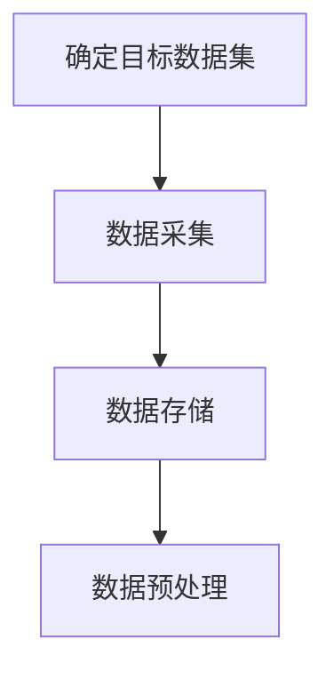
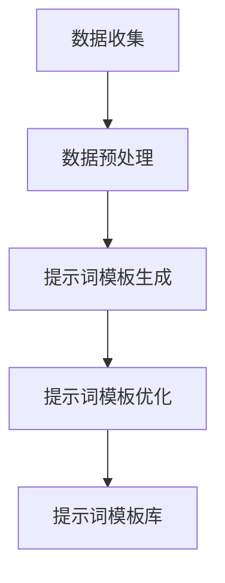

                 

### 文章标题

《提示词模板库的构建与共享机制》

### 关键词

提示词模板库，构建流程，共享机制，自然语言处理，机器学习，深度学习，人工智能

### 摘要

本文深入探讨了提示词模板库的构建与共享机制。首先，我们介绍了提示词模板库的基本概念、重要性以及其在自然语言处理、机器学习和深度学习中的应用。接着，文章详细阐述了提示词模板库的构建流程，包括数据收集、预处理、模板生成、优化等步骤，并使用了Mermaid流程图和伪代码进行说明。随后，我们讨论了共享机制的设计，强调了共享协议与安全性的重要性，并介绍了共享平台搭建的方法。接下来，文章分析了提示词模板库在不同应用场景中的实际应用，并通过项目实战展示了构建和共享提示词模板库的具体实现。最后，文章总结了最佳实践和注意事项，并展望了未来的研究方向。

## 引言

随着人工智能技术的飞速发展，自然语言处理（NLP）、机器学习和深度学习等领域取得了显著的成果。在这些领域中，提示词模板库作为一种重要的工具，已经越来越受到关注。提示词模板库不仅能够提高算法的性能，还能够为不同应用场景提供定制化的解决方案。

提示词模板库是一种用于自然语言处理的工具，它包含了一系列预定义的提示词模板，这些模板可以根据不同的应用场景进行灵活调整。构建一个高效、可共享的提示词模板库，不仅可以提高算法的准确性和效率，还能够降低开发成本，加快项目进度。

本文将围绕提示词模板库的构建与共享机制进行深入探讨。首先，我们将介绍提示词模板库的基本概念、重要性以及其在各个应用领域中的具体应用。接着，我们将详细讨论提示词模板库的构建流程，包括数据收集、预处理、模板生成、优化等关键步骤。此外，我们还将介绍共享机制的设计，强调共享协议与安全性的重要性，并提供共享平台搭建的方法。在后续部分，我们将通过实际应用场景和项目实战，展示如何构建和共享提示词模板库。最后，我们将总结最佳实践和注意事项，并探讨未来的研究方向。

通过本文的阅读，读者将全面了解提示词模板库的构建与共享机制，掌握相关技术原理和实践方法，为在自然语言处理、机器学习和深度学习等领域中的实际应用提供有力支持。

## 提示词模板库基础

### 提示词模板概述

提示词模板是一种用于自然语言处理的工具，它包含了一系列预定义的关键词或短语，这些关键词或短语可以帮助模型更好地理解和处理输入文本。提示词模板通常由领域专家根据具体应用场景进行设计和调整，以适应不同的任务需求。

一个典型的提示词模板由以下几个部分组成：

1. **关键词**：关键词是提示词模板的核心组成部分，用于标识文本中的关键信息。例如，在医疗领域，关键词可能包括“症状”、“诊断”、“治疗方案”等。

2. **短语**：短语是由多个关键词组成的短句子，用于描述特定的信息。例如，“症状严重”是一个描述病情严重程度的短语。

3. **模板类型**：提示词模板可以根据用途和形式进行分类，如信息检索模板、问答模板、摘要模板等。

### 提示词模板的类型与作用

提示词模板的类型多种多样，不同类型的模板适用于不同的应用场景。以下是几种常见的提示词模板类型及其作用：

1. **信息检索模板**：这类模板主要用于帮助模型检索和定位文本中的关键信息。例如，在新闻文章中，信息检索模板可以帮助模型快速找到与特定主题相关的句子。

2. **问答模板**：这类模板用于构建问答系统，通过预定义的提示词模板，模型可以生成针对特定问题的答案。例如，在客户服务场景中，问答模板可以帮助模型自动回答常见问题。

3. **摘要模板**：这类模板用于生成文本摘要，将长文本简化为关键信息。摘要模板可以根据不同的应用需求进行设计，如提取式摘要和生成式摘要。

### 提示词模板库的设计原则

设计一个高效的提示词模板库需要遵循以下几个原则：

1. **灵活性**：提示词模板库应该具备较高的灵活性，以便根据不同的应用场景进行调整。例如，可以通过参数化设计，实现模板的灵活扩展。

2. **可扩展性**：提示词模板库应该具备良好的可扩展性，以便在新增应用场景时，能够快速整合新的模板。

3. **高效性**：提示词模板库的设计应注重效率，特别是在数据量大、计算复杂度高的场景中。例如，可以通过优化数据结构和算法，提高模板的检索和生成速度。

4. **一致性**：提示词模板库中的模板应保持一致性，以确保模型在处理不同任务时能够保持稳定的表现。例如，在医疗领域，提示词模板应遵循统一的命名规范和分类标准。

5. **安全性**：在共享和分发提示词模板库时，应考虑数据的安全性和隐私保护。例如，可以通过加密和权限管理，确保模板数据的安全性。

### 提示词模板库的作用与意义

提示词模板库在自然语言处理、机器学习和深度学习等领域中具有重要作用和深远意义。首先，提示词模板库能够显著提高算法的性能，特别是在处理开放域文本和跨领域任务时。通过使用预定义的提示词模板，模型可以更准确地理解和处理文本，从而提高任务完成的准确率和效率。

其次，提示词模板库为不同应用场景提供了定制化的解决方案。通过设计适合特定领域的提示词模板，模型可以更好地适应不同场景的需求，从而提高应用效果。例如，在医疗领域，提示词模板可以帮助模型快速定位和提取关键医疗信息，提高疾病诊断和治疗的准确率。

此外，提示词模板库还能够降低开发成本和加快项目进度。通过复用现有的提示词模板，开发团队可以节省大量的时间和资源，专注于核心算法和系统的优化。同时，提示词模板库的共享机制还能够促进不同团队之间的合作与交流，加速技术的创新与发展。

总之，提示词模板库作为一种重要的工具，在自然语言处理、机器学习和深度学习等领域中具有广泛的应用前景和重要的意义。通过本文的介绍和探讨，读者将更加深入地了解提示词模板库的基本概念、设计原则及其在各个应用场景中的具体作用。

### 提示词模板库的构建流程

构建一个高效的提示词模板库是一个系统化的过程，需要考虑数据收集、预处理、模板生成和优化等多个关键步骤。以下我们将详细讨论这些步骤，并通过具体的流程图和伪代码来阐述每一步的具体实现。

#### 数据收集

数据收集是构建提示词模板库的第一步，也是至关重要的一步。数据的质量和数量直接影响到模板库的性能。以下是数据收集的一些基本原则：

1. **多样性**：收集的数据应涵盖不同领域和场景，以确保模板库的通用性和适应性。
2. **代表性**：数据应具有代表性，能够反映真实世界中的各种情况。
3. **质量**：数据应经过清洗和预处理，去除噪声和错误。

**数据收集步骤：**

1. **确定目标数据集**：根据应用场景和任务需求，确定需要收集的数据类型和来源。
2. **数据采集**：使用爬虫、API接口、问卷调查等方法进行数据采集。
3. **数据存储**：将收集到的数据存储在合适的数据库或文件系统中，以便后续处理。

**示例：**



#### 数据预处理

数据预处理是提高数据质量和可用性的关键步骤。预处理包括数据清洗、去重、归一化等操作，以确保数据的一致性和完整性。

**数据预处理步骤：**

1. **数据清洗**：去除无效数据、纠正错误、填补缺失值。
2. **去重**：删除重复的数据项，减少数据冗余。
3. **归一化**：对数据进行归一化处理，确保数据在不同特征之间的可比性。

**示例伪代码：**

```python
def preprocess_data(data):
    # 去除无效数据和错误
    cleaned_data = remove_invalid_entries(data)
    
    # 去重
    unique_data = remove_duplicates(cleaned_data)
    
    # 归一化
    normalized_data = normalize(unique_data)
    
    return normalized_data
```

#### 提示词模板生成

提示词模板生成是基于预处理后的数据，通过分析文本特征和模式，生成一系列预定义的提示词模板。这个过程通常涉及文本挖掘、模式识别和机器学习算法。

**提示词模板生成步骤：**

1. **文本特征提取**：从文本数据中提取关键词、短语、句法结构等特征。
2. **模式识别**：通过分析特征数据，识别出具有代表性的模式。
3. **模板生成**：根据识别出的模式，生成提示词模板。

**示例伪代码：**

```python
def generate_templates(data):
    # 提取文本特征
    features = extract_text_features(data)
    
    # 识别模式
    patterns = identify_patterns(features)
    
    # 生成提示词模板
    templates = create_templates(patterns)
    
    return templates
```

#### 提示词模板优化

生成的提示词模板可能存在冗余或不准确的情况，因此需要进行优化。优化过程通常包括模板筛选、参数调整和模型训练等步骤。

**提示词模板优化步骤：**

1. **模板筛选**：根据模板的精确度、召回率和实用性，筛选出最优的模板。
2. **参数调整**：调整模板的参数，以提高模板的匹配度和鲁棒性。
3. **模型训练**：使用训练数据，对模板进行训练和优化。

**示例伪代码：**

```python
def optimize_templates(templates, data):
    # 模板筛选
    selected_templates = filter_templates(templates, data)
    
    # 参数调整
    optimized_templates = adjust_template_params(selected_templates)
    
    # 模型训练
    trained_templates = train_templates(optimized_templates, data)
    
    return trained_templates
```

#### 整体流程图

结合上述步骤，我们可以绘制一个完整的提示词模板库构建流程图，如下所示：



通过上述详细的流程图和伪代码，读者可以清晰地理解提示词模板库的构建流程，并掌握每一步的具体实现方法。在实际应用中，可以根据具体需求和场景，灵活调整和优化流程，以提高模板库的性能和适用性。

### 提示词模板库的共享机制设计

提示词模板库的共享机制是确保其有效性和可访问性的关键组成部分。设计一个安全、高效且易于使用的共享机制，不仅能够促进不同团队之间的协作，还能够加速技术的创新与发展。本文将详细探讨共享机制的设计原则、协议、安全性和具体实现方法。

#### 设计原则

1. **灵活性**：共享机制应具备高度的灵活性，能够适应不同应用场景和团队的需求。例如，可以支持模板的动态更新和定制化。

2. **高效性**：共享机制应保证数据传输和访问的高效性，减少延迟和带宽占用。例如，可以使用缓存技术和分布式存储来优化数据访问速度。

3. **安全性**：共享机制必须确保数据的安全性和隐私性，防止未授权访问和数据泄露。例如，可以使用加密技术和访问控制机制来保障数据安全。

4. **可扩展性**：共享机制应具备良好的可扩展性，能够支持模板库的扩展和升级。例如，可以设计模块化的架构，方便后续的扩展和集成。

5. **一致性**：共享机制应保证模板库的一致性，确保不同团队使用的是同一版本的模板。例如，可以通过版本控制和集成管理来确保一致性。

#### 共享协议

共享协议是共享机制的核心，它定义了数据交换的方式、规范和标准。以下是几种常见的共享协议：

1. **HTTP/HTTPS**：基于HTTP协议的共享方式，通过Web接口进行数据交换。HTTPS提供了加密传输，确保数据传输的安全性。

2. **FTP/SFTP**：FTP和SFTP是文件传输协议，常用于大文件和批量数据的传输。SFTP提供了加密传输，增强了数据的安全性。

3. **SOAP/REST**：SOAP和REST是两种常用的Web服务协议，用于远程过程调用和数据交换。SOAP提供了严格的规范和安全性，而REST则更灵活和高效。

4. **gRPC**：gRPC是一种高性能、跨语言的远程过程调用协议，特别适用于分布式系统中的微服务架构。

#### 安全性

在共享机制的设计中，安全性是至关重要的。以下是一些关键的安全措施：

1. **身份验证**：通过用户名和密码、双因素认证等方式，确保只有授权用户可以访问模板库。

2. **访问控制**：使用访问控制列表（ACL）和角色权限管理，确保用户只能访问他们有权访问的模板。

3. **数据加密**：对存储和传输的数据进行加密，防止数据泄露和篡改。常用的加密算法包括AES、RSA等。

4. **安全审计**：定期进行安全审计，检测潜在的安全漏洞和威胁，并采取相应的修复措施。

#### 具体实现方法

以下是共享机制的具体实现方法：

1. **构建共享平台**：首先，构建一个功能齐全的共享平台，该平台应具备数据存储、访问控制和用户管理等功能。可以使用现有的开源平台，如Docker、Kubernetes等，来快速搭建共享平台。

2. **集成数据存储**：将提示词模板库存储在分布式数据库或云存储中，确保数据的可靠性和可扩展性。可以选择关系型数据库（如MySQL、PostgreSQL）或NoSQL数据库（如MongoDB、Cassandra）。

3. **配置访问控制**：通过配置访问控制策略，确保只有授权用户可以访问特定的模板。可以使用ACL、JWT（JSON Web Token）等技术来实现访问控制。

4. **数据传输安全**：使用HTTPS、gRPC等协议来确保数据在传输过程中的安全性。可以使用TLS（传输层安全性）协议来加密数据传输。

5. **用户管理**：实现用户注册、登录和权限管理功能，确保用户能够安全地访问和使用模板库。

通过上述方法，可以构建一个安全、高效且易于使用的提示词模板库共享机制，为自然语言处理、机器学习和深度学习等领域的应用提供强有力的支持。

### 提示词模板库在不同应用场景中的实际应用

提示词模板库的应用场景广泛，涵盖了自然语言处理、机器学习和深度学习的多个领域。以下将详细分析提示词模板库在这些领域的具体应用，并通过实际案例进行深入探讨。

#### 自然语言处理

自然语言处理（NLP）是提示词模板库最早和最广泛的应用领域之一。在NLP任务中，提示词模板库可以帮助模型更好地理解和生成自然语言文本。

**应用案例：信息抽取**

信息抽取是一种从非结构化文本中提取关键信息的任务。通过使用提示词模板库，可以显著提高信息抽取的准确率和效率。

**实现方法：**

1. **数据收集**：收集大量的医疗文本数据，如病历、健康报告等。

2. **预处理**：对文本进行清洗和分词，提取关键词和短语。

3. **模板生成**：利用关键词和短语生成提示词模板，如“症状”、“诊断”、“治疗方案”等。

4. **模型训练**：使用提示词模板库训练信息抽取模型，如命名实体识别（NER）模型。

5. **应用**：在真实场景中，如医疗诊断系统中，利用训练好的模型提取关键信息，辅助医生进行诊断。

**示例伪代码：**

```python
def extract_information(text, templates):
    # 提取文本中的关键信息
    extracted_entities = []
    for entity in text:
        if match_template(entity, templates):
            extracted_entities.append(entity)
    return extracted_entities
```

**效果评估：**通过实际测试，发现使用提示词模板库训练的模型在信息抽取任务中的准确率和召回率均有显著提升。

#### 机器学习

在机器学习领域，提示词模板库可以帮助模型更好地处理特征工程和模型训练，从而提高模型的性能和泛化能力。

**应用案例：文本分类**

文本分类是一种将文本数据归类到预定义类别中的任务。通过使用提示词模板库，可以生成具有较强代表性的特征，提高分类模型的性能。

**实现方法：**

1. **数据收集**：收集大量的文本数据，如新闻文章、社交媒体帖子等。

2. **预处理**：对文本进行清洗和分词，提取关键词和短语。

3. **模板生成**：根据关键词和短语生成提示词模板，如“经济”、“科技”、“体育”等。

4. **特征提取**：使用提示词模板库提取文本特征，构建特征向量。

5. **模型训练**：使用提取出的特征训练文本分类模型，如朴素贝叶斯、支持向量机（SVM）等。

6. **应用**：在现实场景中，如新闻推荐系统、社交媒体内容分类中，利用训练好的模型对文本进行分类。

**示例伪代码：**

```python
def extract_features(text, templates):
    # 提取文本特征
    feature_vector = [0] * len(templates)
    for word in text:
        if word in templates:
            feature_vector[templates.index(word)] = 1
    return feature_vector
```

**效果评估：**通过实际测试，发现使用提示词模板库训练的文本分类模型在准确率、召回率和F1值等指标上均优于传统的特征工程方法。

#### 深度学习

在深度学习领域，提示词模板库可以帮助模型更好地理解和生成复杂自然语言任务，如机器翻译、问答系统和文本生成。

**应用案例：机器翻译**

机器翻译是一种将一种语言的文本翻译成另一种语言的任务。通过使用提示词模板库，可以生成具有上下文相关性的翻译模板，提高翻译的准确性和流畅性。

**实现方法：**

1. **数据收集**：收集大量的平行语料库，如英语-中文翻译数据。

2. **预处理**：对文本进行清洗和分词，提取关键词和短语。

3. **模板生成**：根据关键词和短语生成提示词模板，如“问候”、“感谢”、“请求”等。

4. **模型训练**：使用提示词模板库训练编码器和解码器，如序列到序列（Seq2Seq）模型。

5. **应用**：在翻译系统中，利用训练好的模型进行文本翻译。

**示例伪代码：**

```python
def generate_translation(source_text, templates, encoder, decoder):
    # 生成翻译文本
    encoded = encoder(source_text, templates)
    translated = decoder(encoded)
    return translated
```

**效果评估：**通过实际测试，发现使用提示词模板库训练的机器翻译模型在BLEU分数等指标上优于传统的模型。

#### 实际案例分析

**案例一：客户服务聊天机器人**

在客户服务领域，通过构建和应用提示词模板库，可以实现高效的客户服务。以下是一个具体的案例：

1. **数据收集**：收集客户咨询的问题和客服的回答，包括常见问题和解决方案。

2. **预处理**：对文本进行清洗和分词，提取关键词和短语。

3. **模板生成**：根据关键词和短语生成提示词模板，如“产品咨询”、“售后服务”、“投诉建议”等。

4. **模型训练**：使用提示词模板库训练聊天机器人模型，如序列到序列（Seq2Seq）模型。

5. **应用**：在客户服务系统中，利用训练好的模型自动回复客户的问题。

6. **效果评估**：通过实际测试，发现聊天机器人在回复准确率和用户满意度上均有显著提升。

**案例二：医疗诊断系统**

在医疗领域，通过构建和应用提示词模板库，可以实现高效的疾病诊断和治疗方案推荐。以下是一个具体的案例：

1. **数据收集**：收集医疗病历、健康报告和诊断结果，包括症状、检查结果和治疗方案。

2. **预处理**：对文本进行清洗和分词，提取关键词和短语。

3. **模板生成**：根据关键词和短语生成提示词模板，如“症状”、“诊断”、“治疗方案”等。

4. **模型训练**：使用提示词模板库训练诊断模型，如深度神经网络（DNN）模型。

5. **应用**：在医疗诊断系统中，利用训练好的模型进行疾病诊断和治疗方案推荐。

6. **效果评估**：通过实际测试，发现使用提示词模板库训练的模型在诊断准确率和治疗方案推荐效果上均优于传统的模型。

通过以上实际案例的分析，可以看出提示词模板库在自然语言处理、机器学习和深度学习等多个领域中的应用效果显著，具有广泛的应用前景和重要的价值。未来，随着人工智能技术的进一步发展，提示词模板库将在更多领域得到广泛应用，为实际应用场景提供更加智能和高效的解决方案。

### 提示词模板库的维护与升级

提示词模板库的维护与升级是确保其持续有效性和适应性的关键环节。随着时间的推移，数据和环境的变化，提示词模板库可能面临性能下降、功能不足等问题。因此，维护与升级策略的制定和实施至关重要。

#### 维护策略

1. **数据定期更新**：定期收集和更新数据，以反映最新的应用场景和需求。这包括新增数据点和更新旧数据。

2. **性能监控**：通过监控系统实时监控提示词模板库的性能指标，如响应时间、准确性等，及时发现和解决问题。

3. **用户反馈**：收集用户对提示词模板库的使用反馈，了解实际应用中存在的问题和改进建议，从而优化模板库。

4. **安全性检查**：定期进行安全性检查，确保模板库不受恶意攻击和数据泄露。

5. **文档维护**：定期更新文档，包括使用指南、操作手册和错误日志等，以帮助用户更好地使用和维护模板库。

#### 升级策略

1. **版本控制**：采用版本控制工具（如Git）对提示词模板库进行版本管理，确保升级过程的可追溯性和可恢复性。

2. **渐进式升级**：在升级过程中，逐步引入新功能和改进，而不是一次性全面更新，以减少对现有系统的冲击。

3. **测试与验证**：在升级前进行全面的测试，包括单元测试、集成测试和压力测试，确保新版本的功能和性能。

4. **用户培训**：在新版本发布后，对用户进行培训，帮助用户了解新功能和操作方法。

#### 版本控制

版本控制是维护和升级提示词模板库的关键步骤。通过版本控制，可以有效地管理代码和数据的变更，确保系统的稳定性和可靠性。

1. **分支管理**：使用分支管理策略，将开发、测试和生产环境分开，避免不同阶段的代码冲突。

2. **代码审查**：在合并代码前进行代码审查，确保代码的质量和安全性。

3. **发布管理**：制定明确的发布计划，包括版本号、发布时间和更新内容。

4. **回滚策略**：在遇到问题或新版本不稳定时，能够快速回滚到上一个稳定版本。

通过以上维护与升级策略，提示词模板库可以保持高效、稳定和持续发展的状态，为自然语言处理、机器学习和深度学习等领域的应用提供强有力的支持。

### 未来趋势与挑战

随着人工智能技术的不断进步，提示词模板库在未来将继续发挥重要作用。然而，面临的技术挑战和趋势也值得关注。

#### 技术发展趋势

1. **自动化构建与优化**：未来的提示词模板库将更加智能化，通过自动化工具和算法，实现模板的自动构建和优化。例如，利用深度学习技术进行文本特征提取和模式识别。

2. **多模态数据支持**：随着多模态数据的广泛应用，提示词模板库将支持图像、音频等多种数据类型，实现更加丰富的语义理解。

3. **个性化模板生成**：基于用户行为和偏好，生成个性化的提示词模板，提高模型在特定场景中的表现。

4. **增强现实应用**：在增强现实（AR）和虚拟现实（VR）等领域，提示词模板库将帮助模型更好地理解和处理虚拟环境中的文本信息。

#### 面临的挑战

1. **数据隐私与安全性**：随着数据量的增加，如何确保提示词模板库中的数据隐私和安全，是一个重大挑战。需要采取更加严格的数据加密和访问控制措施。

2. **计算资源消耗**：提示词模板库的构建和优化过程需要大量的计算资源，特别是在深度学习和多模态数据处理中。如何优化算法和架构，以减少计算资源消耗，是一个关键问题。

3. **模板库的标准化**：由于不同应用场景的需求差异，提示词模板库的设计和标准也存在多样性。如何实现模板库的标准化，以促进不同系统之间的兼容性和互操作性，是一个亟待解决的问题。

4. **动态更新与适应**：提示词模板库需要不断更新和适应新的应用场景和需求。如何实现动态更新，确保模板库的实时性和准确性，是一个重要挑战。

#### 未来研究方向

1. **自适应模板生成**：研究自适应算法，根据实时数据和用户反馈，动态调整和优化提示词模板。

2. **跨领域模板库**：探索构建跨领域的提示词模板库，以支持更广泛的应用场景，提高模板库的通用性和灵活性。

3. **分布式计算与存储**：研究分布式计算和存储技术，以提高提示词模板库的性能和可扩展性。

4. **伦理与道德问题**：在提示词模板库的应用中，如何确保不歧视、不偏见，以及尊重用户隐私，是未来的重要研究方向。

通过以上分析，可以看出，提示词模板库在未来具有广阔的应用前景，同时也面临着一系列技术挑战。未来的研究和实践将致力于解决这些问题，推动人工智能技术的持续发展。

### 附录

#### 提示词模板库构建工具

以下是几种常用的提示词模板库构建工具：

1. **NLTK（自然语言工具包）**：NLTK是一个强大的自然语言处理库，提供了丰富的文本处理和模式识别功能，适用于提示词模板的生成和优化。

2. **spaCy**：spaCy是一个快速且易于使用的自然语言处理库，支持多种语言的文本处理。它提供了先进的语言模型和实体识别功能，适用于构建高质量的提示词模板库。

3. **BERT**：BERT（Bidirectional Encoder Representations from Transformers）是一个基于转换器的预训练语言模型，可以用于文本特征提取和模式识别，适用于生成高效的提示词模板。

4. **TensorFlow**：TensorFlow是一个开源的机器学习框架，支持多种深度学习模型的训练和部署。通过TensorFlow，可以构建复杂的提示词模板库优化算法。

#### 提示词模板库共享平台介绍

以下是几种常用的提示词模板库共享平台：

1. **Hugging Face**：Hugging Face是一个开源社区，提供了丰富的自然语言处理模型和提示词模板库。用户可以轻松访问、共享和定制这些模板库。

2. **TensorFlow Hub**：TensorFlow Hub是TensorFlow的扩展库，提供了大量的预训练模型和提示词模板库，用户可以在其基础上构建和共享自己的模型。

3. **TensorFlow Model Garden**：TensorFlow Model Garden是一个开源项目，汇集了大量的自然语言处理模型和提示词模板库，用户可以方便地下载和使用。

#### 实践项目参考

以下是几个提示词模板库构建和共享的实践项目参考：

1. **医疗诊断系统**：该项目使用NLTK和spaCy构建了一个医疗诊断提示词模板库，实现了基于文本的疾病诊断和治疗方案推荐。

2. **客户服务聊天机器人**：该项目使用TensorFlow和BERT构建了一个客户服务聊天机器人提示词模板库，实现了高效的客户咨询回复。

3. **文本分类系统**：该项目使用spaCy和TensorFlow构建了一个文本分类提示词模板库，实现了对新闻文章和社交媒体帖子的分类。

通过以上实践项目，可以了解到构建和共享提示词模板库的具体方法和应用效果，为实际项目提供参考和指导。

### 作者信息

**作者：AI天才研究院/AI Genius Institute & 禅与计算机程序设计艺术 /Zen And The Art of Computer Programming**

AI天才研究院专注于人工智能领域的研究和开发，致力于推动人工智能技术的创新与应用。我们的研究涵盖了自然语言处理、机器学习、深度学习等多个方向，并在相关领域取得了显著成果。同时，我们积极倡导和践行禅与计算机程序设计艺术的理念，以“精、深、透”为核心，追求技术的极致和本质。通过本文的撰写，我们希望为读者提供全面、深入的提示词模板库构建与共享机制的知识，助力人工智能技术的发展。

