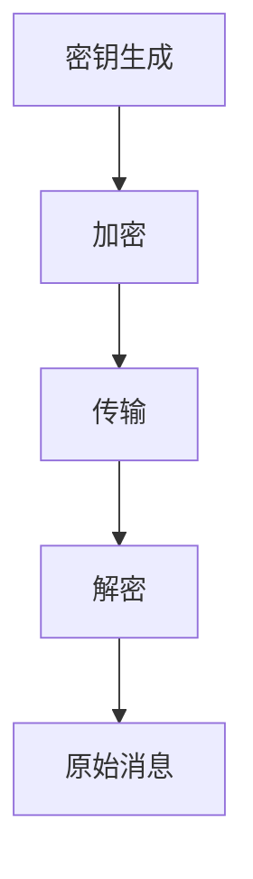

                 

### 第1章 引言

### 1.1 后量子密码学的背景与挑战

后量子密码学是密码学的一个新兴领域，其理论基础来源于量子力学。传统的密码学依赖于经典计算模型中的数学难题，例如大素数分解和离散对数问题。然而，量子计算的出现打破了这种平衡，因为它能够以指数级的速度解决传统密码学中认为难以破解的问题。后量子密码学旨在设计抵抗量子计算攻击的加密方案，从而保护信息在量子计算时代的安全性。

#### 后量子密码学的起源

后量子密码学的概念源于20世纪90年代，当时物理学家Peter Shor提出了一个算法，能够利用量子计算机在多项式时间内解决大素数分解问题。这一发现引发了密码学家的广泛关注，他们意识到需要新的加密方法来应对量子计算可能带来的威胁。

#### 后量子密码学的目标

后量子密码学的目标主要有以下几点：
1. **安全性**：确保加密方案能够抵御量子计算攻击。
2. **兼容性**：保持与传统密码系统的兼容性，以避免大规模更换加密基础设施。
3. **效率**：在保证安全性的同时，保持加密和解密的效率。

#### 后量子密码学面临的挑战

尽管后量子密码学有着明确的愿景，但在实际应用中仍面临诸多挑战：
1. **设计复杂性**：设计一个既安全又高效的量子密码学方案是一个极具挑战性的任务。
2. **标准化**：缺乏统一的量子密码学标准，导致不同方案的互操作性存在问题。
3. **量子计算的进展**：随着量子计算机的发展，量子算法的效率不断提高，对后量子密码学提出了更高的要求。
4. **实际部署**：量子密码学方案在实际系统中的部署和集成也是一个挑战，需要克服软硬件兼容性、性能优化等问题。

### 1.2 提示词编程的概念与原理

提示词编程（Prompt Programming）是一种通过提示（Prompt）来引导模型生成文本或执行任务的人工智能技术。它与传统的编程不同，不需要编写详细的代码指令，而是通过输入提示词来指导模型生成结果。

#### 提示词编程的定义

提示词编程的定义可以概括为：通过向预训练的大型语言模型提供提示，使其能够生成符合预期输出的一种编程方法。这种方法的核心是利用模型的强大语言理解能力和文本生成能力，使其能够根据提示生成具体的代码或文本。

#### 提示词编程的工作原理

提示词编程的工作原理如下：
1. **模型训练**：首先，一个大型语言模型通过海量数据训练，使其具备强大的语言理解和生成能力。
2. **输入提示**：用户输入一个提示词，这个提示词可以是任何形式，如自然语言描述、任务指令等。
3. **文本生成**：模型接收到提示后，会根据其内部训练的分布生成文本，这个过程是通过概率计算和优化实现的。
4. **结果输出**：最终，模型生成的文本被输出，用户可以根据输出结果进行后续操作。

#### 提示词编程与传统编程的区别

与传统编程相比，提示词编程具有以下特点：
1. **开发效率**：提示词编程大大提高了开发效率，用户无需编写繁琐的代码，只需提供提示词即可。
2. **灵活性**：提示词编程允许用户根据需求动态调整提示词，从而实现多种不同的输出结果。
3. **可解释性**：提示词编程生成的代码通常具有较好的可解释性，用户可以清楚地了解每一步操作的意图。

### 1.3 书籍目的与结构

#### 书籍目的

本书的目的是探讨提示词编程在后量子密码学中的应用，旨在帮助读者理解后量子密码学的原理，掌握提示词编程技术，并了解二者结合的可能性和优势。通过本书，读者可以：
1. 了解后量子密码学的基本概念和安全模型。
2. 熟悉提示词编程的工作原理和实现方法。
3. 掌握提示词编程在后量子密码学中的应用实践。

#### 书籍结构

本书分为以下七个主要章节：
- **第1章 引言**：介绍后量子密码学和提示词编程的基本概念，以及本书的目的和结构。
- **第2章 后量子密码学基础**：详细讲解后量子密码学的理论基础、核心算法和安全模型。
- **第3章 提示词编程基础**：介绍提示词编程的基本原理、编程语言和工作流程。
- **第4章 提示词编程在后量子密码学中的应用**：探讨提示词编程在后量子密码学加密、解密和认证中的应用。
- **第5章 提示词编程在后量子密码学安全协议中的应用**：分析提示词编程在安全多方计算、零知识证明和公开密钥基础设施中的应用。
- **第6章 提示词编程在后量子密码学实践中的应用**：通过实际案例研究，展示提示词编程在后量子密码学中的应用实践。
- **第7章 未来展望与挑战**：讨论提示词编程在后量子密码学中的未来发展方向和面临的挑战。

通过以上章节的逐步探讨，本书旨在为读者提供全面、系统的提示词编程在后量子密码学中的应用知识，帮助读者深入了解这一前沿领域的最新动态。

## 第2章 后量子密码学基础

### 2.1 量子力学基础

量子力学是后量子密码学的基础，理解量子力学的基本概念对于掌握后量子密码学至关重要。以下是量子力学中几个关键概念：

#### 量子比特

量子比特（Quantum Bit，简称qubit）是量子信息的基本单位，与经典计算中的比特不同，qubit可以同时存在于多种状态，这种性质称为叠加性。用数学语言描述，一个量子比特可以表示为：
\[ \psi = \alpha|0\rangle + \beta|1\rangle \]
其中，$|0\rangle$ 和 $|1\rangle$ 分别表示量子比特的基态，$\alpha$ 和 $\beta$ 是复数，它们的模长的平方分别表示基态的概率。

#### 量子叠加与纠缠

量子叠加（Quantum Superposition）指的是量子系统可以同时存在于多个状态。例如，一个量子比特可以同时处于0和1的状态。量子叠加可以通过数学表达式：
\[ \psi = \alpha|0\rangle + \beta|1\rangle \]
表示。

量子纠缠（Quantum Entanglement）是量子力学中更为神秘的现象，它描述了两个或多个量子比特之间的状态是相互关联的。当两个量子比特纠缠后，对其中一个量子比特的操作会立即影响到另一个量子比特，即使它们相隔很远。这种瞬间的相互作用称为量子纠缠。用数学语言描述纠缠态，可以表示为：
\[ |\psi\rangle = \frac{1}{\sqrt{2}}(|00\rangle + |11\rangle) \]
这里，$|00\rangle$ 和 $|11\rangle$ 是纠缠态的两个基态。

#### 量子门

量子门（Quantum Gate）是量子计算中的基本操作单元，类似于经典计算机中的逻辑门。量子门作用于量子比特，可以改变其状态。常见的量子门包括Hadamard门、Pauli门和控制非门（CNOT门）。

- **Hadamard门**：将量子比特的状态从$|0\rangle$ 或$|1\rangle$ 变换为叠加状态。其作用可以表示为：
  \[ H = \frac{1}{\sqrt{2}}\begin{pmatrix} 1 & 1 \\ 1 & -1 \end{pmatrix} \]
- **Pauli门**：分别作用于量子比特的X、Y和Z轴。例如，Z门（也称为Pauli Z门）可以将量子比特的状态反转。其作用可以表示为：
  \[ Z = \begin{pmatrix} 1 & 0 \\ 0 & -1 \end{pmatrix} \]
- **CNOT门**：是一个控制门，它作用于两个量子比特，根据控制比特的状态对目标比特进行变换。其作用可以表示为：
  \[ CNOT = \begin{pmatrix} 1 & 0 & 0 & 0 \\ 0 & 1 & 0 & 0 \\ 0 & 0 & 0 & 1 \\ 0 & 0 & 1 & -1 \end{pmatrix} \]

通过这些基本操作，量子计算机能够进行复杂的计算和加密操作，从而实现传统计算机无法达到的计算能力。

### 2.2 后量子密码学的基本原理

后量子密码学的核心在于其安全假设，即假设现有的量子计算机无法在多项式时间内破解某些特定的加密算法。以下是后量子密码学的基本原理和核心算法：

#### 安全假设

后量子密码学基于几个安全假设，其中最著名的是基于量子计算难题的假设，如大数分解和离散对数问题。如果量子计算机能够以指数级的速度解决这些问题，那么传统密码学的基础将被动摇。因此，后量子密码学设计的加密方案需要能够抵抗量子计算机的攻击。

#### 核心算法

后量子密码学采用了几种核心算法，其中最著名的是基于Lattice的加密算法和基于Hash的加密算法。

- **基于Lattice的加密算法**：Lattice是一种数学结构，它用于构造在量子计算下安全的加密方案。例如，NTRU算法和Lattice-based加密算法（如NTRUEncrypt和Gagger-Green-Lubovsky算法）都是基于Lattice的。这些算法通过在Lattice上构造困难的问题，使得量子计算机难以破解。

  **示例伪代码**：
  ```
  function NTRU_Encrypt(message, public_key):
      // 选择合适的Lattice参数
      alpha = select_alpha()
      beta = generate_random_vector()

      // 构造Lattice点
      lattice_point = alpha * public_key + beta

      // 对Lattice点应用哈希函数得到密文
      ciphertext = hash(lattice_point)

      return ciphertext
  ```

- **基于Hash的加密算法**：这类算法使用Hash函数来构建加密方案，其中最著名的是McEliece算法。McEliece算法基于Goppa码，利用Hash函数将其编码为具有高纠错能力的码字。即使量子计算机可以破解大数分解问题，也很难破解McEliece算法。

  **示例伪代码**：
  ```
  function McEliece_Encrypt(message, public_key):
      // 将消息编码为Goppa码
      codeword = encode(message, public_key)

      // 对编码后的码字应用Hash函数得到密文
      ciphertext = hash(codeword)

      return ciphertext
  ```

#### 加密与解密过程

后量子密码学的加密和解密过程通常包括以下几个步骤：

1. **密钥生成**：加密方生成一对公钥和私钥，公钥公开，私钥保密。

2. **加密**：加密方使用公钥和消息生成密文。

3. **传输**：密文通过不安全的通道传输给接收方。

4. **解密**：接收方使用私钥解密密文，恢复原始消息。

**示例流程图**：



通过上述过程，后量子密码学确保了信息的保密性和完整性，即使在量子计算机时代，也能提供可靠的安全保障。

### 2.3 后量子密码学的优势与劣势

#### 后量子密码学的优势

后量子密码学具有以下几个显著优势：

1. **抵抗量子攻击**：后量子密码学设计的加密方案能够在量子计算机攻击下保持安全性，这使其在量子计算时代具有巨大的潜力。

2. **兼容性**：后量子密码学试图保持与传统密码系统的兼容性，这有助于平滑过渡到量子计算时代，减少基础设施的更换成本。

3. **效率**：一些后量子密码学算法在加密和解密过程中具有较高的效率，这使其在实际应用中具有竞争力。

#### 后量子密码学的劣势

尽管后量子密码学具有许多优势，但它也面临一些挑战和劣势：

1. **设计复杂性**：设计一个既安全又高效的量子密码学方案是一个复杂的过程，需要深入理解量子力学和密码学。

2. **标准化**：后量子密码学缺乏统一的标准化，导致不同方案之间存在互操作性问题。

3. **实际部署**：量子密码学方案在实际系统中的部署和集成是一个挑战，需要克服软硬件兼容性、性能优化等问题。

#### 后量子密码学的应用前景

尽管后量子密码学面临一些挑战，但其应用前景广阔：

1. **金融领域**：金融交易和支付系统需要高度的安全性，后量子密码学能够提供抵抗量子计算攻击的保障。

2. **云计算**：随着云计算的普及，数据安全成为一个重要问题，后量子密码学能够提供更强的数据保护。

3. **物联网**：物联网设备需要实现安全通信，后量子密码学能够在量子计算时代为物联网提供安全保障。

通过上述分析，后量子密码学在密码学领域具有重要地位，其应用前景广泛，但也需要不断研究和优化，以应对未来的挑战。

## 第3章 提示词编程基础

### 3.1 提示词编程语言

提示词编程（Prompt Programming）是一种利用预训练的大型语言模型（如GPT-3、ChatGPT等）来实现自动化文本生成和任务执行的方法。目前，已经有许多编程语言和工具支持提示词编程，其中一些最为流行的包括：

#### Python的提示词编程功能

Python是一种广泛使用的编程语言，它通过几个库和框架支持提示词编程。最常用的库包括：

- **transformers**：一个开源库，用于实现和训练各种大规模语言模型。通过使用transformers库，开发者可以轻松地调用预训练模型，并编写提示词来生成文本。
- **Hugging Face**：Hugging Face是一个开源平台，提供了许多预训练模型和工具，支持各种NLP任务。通过Hugging Face，用户可以轻松地使用提示词编程实现文本生成、问答系统等功能。

#### 其他提示词编程语言

除了Python，其他编程语言也逐渐开始支持提示词编程。以下是一些流行的提示词编程语言：

- **JavaScript**：JavaScript是前端开发的常用语言，通过使用OpenAI的API，开发者可以在JavaScript中实现提示词编程，从而创建动态的文本生成和交互功能。
- **Go**：Go是一种高效的编程语言，通过使用预训练模型库，如Go-OpenAI，开发者可以轻松地实现提示词编程。
- **Java**：Java是一种强大的编程语言，广泛用于企业级应用开发。通过使用预训练模型库，如DeepLearning4j，Java开发者可以实现提示词编程。

### 3.2 提示词编程的工作流程

提示词编程的工作流程可以分为以下几个步骤：

1. **模型选择**：根据任务需求选择合适的预训练模型。例如，对于文本生成任务，可以选择GPT-3或ChatGPT等大型语言模型。

2. **模型加载**：将选定的模型加载到应用程序中，这通常涉及到模型文件和运行环境的配置。

3. **提示词生成**：用户输入一个或多个提示词，这些提示词可以是自然语言描述、任务指令等。提示词的质量对生成的文本或执行的任务有很大影响。

4. **文本生成**：模型接收到提示词后，通过内部训练的分布生成文本。这个过程涉及复杂的概率计算和优化，以生成最符合提示词的输出。

5. **结果输出**：最终生成的文本被输出，用户可以根据需求进行后续操作，如文本编辑、任务执行等。

### 3.3 提示词编程的挑战与机遇

#### 提示词编程的技术难题

提示词编程虽然带来了巨大的便利，但也面临一些技术难题：

1. **模型性能**：选择合适的预训练模型并确保其在特定任务上具有高性能是一个挑战。不同模型在文本生成和任务执行方面的能力不同，需要根据实际需求进行选择和调整。

2. **提示词优化**：生成高质量的文本或执行准确的任务需要精心设计的提示词。提示词的长度、内容、格式等因素都会影响输出结果。

3. **模型解释性**：预训练模型通常具有高度的非线性性和复杂性，其内部决策过程难以解释。这给开发者带来了挑战，如何确保模型生成的文本或执行的任务是符合预期的。

#### 提示词编程的发展趋势

随着人工智能技术的不断进步，提示词编程也呈现出以下发展趋势：

1. **模型多样化**：随着更多预训练模型的开发和发布，开发者可以更灵活地选择适合特定任务的模型。

2. **多模态支持**：未来的提示词编程将支持多种数据类型，如图像、音频、视频等，实现更丰富的任务执行和文本生成。

3. **自动化与协作**：提示词编程将逐渐与自动化工具和开发平台结合，使非专业用户也能轻松利用人工智能技术。

#### 提示词编程在量子计算中的潜在应用

提示词编程在量子计算领域具有巨大的潜力，以下是一些潜在的应用场景：

1. **量子算法生成**：通过提示词编程，可以生成特定的量子算法，如量子模拟、量子算法优化等。

2. **量子编程辅助**：提示词编程可以为量子编程提供辅助，如生成量子指令、解释量子门的功能等。

3. **量子系统设计**：提示词编程可以帮助设计量子硬件和系统，如量子传感器、量子通信系统等。

总之，提示词编程作为一种新兴的人工智能技术，将在量子计算领域发挥重要作用，推动这一前沿领域的快速发展。

## 第4章 提示词编程在后量子密码学中的应用

### 4.1 提示词编程在后量子密码学加密中的应用

提示词编程在后量子密码学加密中的应用具有显著的优势，能够有效提升加密算法的性能和安全性。以下将详细探讨提示词编程在后量子密码学加密中的应用，以及如何通过优化提示词编程来增强加密效率。

#### 提示词编程在后量子密码学加密算法中的应用

提示词编程能够通过以下方式应用于后量子密码学加密：

1. **自动生成加密算法**：利用大型语言模型，如GPT-3，可以通过提示词生成特定的后量子密码学加密算法。例如，输入提示词“生成一个基于Lattice的后量子密码学加密算法”，模型会根据其训练的数据生成相应的算法代码。

2. **优化加密算法**：提示词编程可以用于优化现有的后量子密码学加密算法。通过输入提示词，如“优化NTRU加密算法的执行效率”，模型可以生成优化后的代码，从而提高算法的执行速度和效率。

3. **自适应加密**：提示词编程可以根据不同场景和需求动态生成加密算法。例如，输入提示词“为物联网设备设计一种后量子密码学加密方案”，模型会根据物联网设备的特点生成适合的加密方案。

#### 提示词编程在后量子密码学加密算法的优化

通过提示词编程优化后量子密码学加密算法，可以实现以下目标：

1. **执行效率提升**：提示词编程可以帮助优化算法的执行效率，减少计算资源的使用。例如，通过提示词“减少NTRU加密算法的计算复杂度”，模型可以生成优化后的代码，从而提高算法的执行速度。

2. **安全性增强**：提示词编程可以用于增强后量子密码学加密算法的安全性。通过提示词“增强Lattice加密算法的安全性”，模型可以生成具有更高安全性的加密方案。

3. **可扩展性优化**：提示词编程可以优化加密算法的可扩展性，使其能够应对更大规模的数据和应用场景。例如，通过提示词“优化McEliece加密算法以支持大规模数据加密”，模型可以生成扩展性更好的算法。

#### 优化提示词编程的策略

为了提高提示词编程在优化后量子密码学加密算法方面的效果，可以采用以下策略：

1. **优化提示词设计**：设计高质量的提示词对于生成优化的代码至关重要。可以通过分析历史数据和应用场景，设计更具体、更具针对性的提示词。

2. **模型训练数据增强**：通过增加高质量的训练数据，可以提高模型生成优化的代码的能力。例如，可以收集更多关于后量子密码学加密算法的论文、代码和案例分析，作为模型的训练数据。

3. **模型融合**：结合多种模型的优势，可以提高提示词编程的优化效果。例如，可以结合GPT-3和其他专门用于代码生成的模型，如CodeGPT，以生成更高质量的优化代码。

4. **代码审查与验证**：生成的代码需要经过严格的审查和验证，以确保其安全性和可靠性。可以通过自动化测试工具和人工审查相结合的方式，对生成的代码进行验证。

总之，提示词编程在后量子密码学加密中的应用为优化加密算法提供了新的可能性。通过合理设计提示词、增强模型训练数据、融合多种模型和严格审查生成的代码，可以大大提高后量子密码学加密算法的效率和安全性能。

### 4.2 提示词编程在后量子密码学解密中的应用

提示词编程在后量子密码学解密中同样具有重要作用，能够通过自动化和智能化手段提高解密效率和准确性。以下将详细探讨提示词编程在后量子密码学解密中的应用，以及如何通过优化提示词编程来提升解密性能。

#### 提示词编程在后量子密码学解密算法中的应用

提示词编程能够通过以下方式应用于后量子密码学解密：

1. **自动生成解密算法**：利用大型语言模型，如GPT-3，可以通过提示词生成特定的后量子密码学解密算法。例如，输入提示词“生成一个基于Lattice的后量子密码学解密算法”，模型会根据其训练的数据生成相应的解密代码。

2. **优化解密算法**：提示词编程可以用于优化现有的后量子密码学解密算法。通过输入提示词，如“优化NTRU解密算法的执行效率”，模型可以生成优化后的代码，从而提高算法的执行速度和效率。

3. **自适应解密**：提示词编程可以根据不同场景和需求动态生成解密算法。例如，输入提示词“为物联网设备设计一种后量子密码学解密方案”，模型会根据物联网设备的特点生成适合的解密方案。

#### 提示词编程在后量子密码学解密算法的优化

通过提示词编程优化后量子密码学解密算法，可以实现以下目标：

1. **执行效率提升**：提示词编程可以帮助优化算法的执行效率，减少计算资源的使用。例如，通过提示词“减少NTRU解密算法的计算复杂度”，模型可以生成优化后的代码，从而提高算法的执行速度。

2. **准确性增强**：提示词编程可以用于增强后量子密码学解密算法的准确性，确保正确解密密文。例如，通过提示词“提高Lattice解密算法的准确性”，模型可以生成更准确的解密方案。

3. **可扩展性优化**：提示词编程可以优化解密算法的可扩展性，使其能够应对更大规模的数据和应用场景。例如，通过提示词“优化McEliece解密算法以支持大规模数据解密”，模型可以生成扩展性更好的算法。

#### 优化提示词编程的策略

为了提高提示词编程在优化后量子密码学解密算法方面的效果，可以采用以下策略：

1. **优化提示词设计**：设计高质量的提示词对于生成优化的代码至关重要。可以通过分析历史数据和应用场景，设计更具体、更具针对性的提示词。

2. **模型训练数据增强**：通过增加高质量的训练数据，可以提高模型生成优化的代码的能力。例如，可以收集更多关于后量子密码学解密算法的论文、代码和案例分析，作为模型的训练数据。

3. **模型融合**：结合多种模型的优势，可以提高提示词编程的优化效果。例如，可以结合GPT-3和其他专门用于代码生成的模型，如CodeGPT，以生成更高质量的优化代码。

4. **代码审查与验证**：生成的代码需要经过严格的审查和验证，以确保其安全性和可靠性。可以通过自动化测试工具和人工审查相结合的方式，对生成的代码进行验证。

总之，提示词编程在后量子密码学解密中的应用为优化解密算法提供了新的可能性。通过合理设计提示词、增强模型训练数据、融合多种模型和严格审查生成的代码，可以大大提高后量子密码学解密算法的执行效率和准确性。

### 4.3 提示词编程在后量子密码学认证中的应用

提示词编程在后量子密码学认证中的应用同样具有重要意义，能够通过自动化和智能化手段提高认证的效率和安全性。以下将详细探讨提示词编程在后量子密码学认证中的应用，以及如何通过优化提示词编程来提升认证性能。

#### 提示词编程在后量子密码学认证算法中的应用

提示词编程能够通过以下方式应用于后量子密码学认证：

1. **自动生成认证算法**：利用大型语言模型，如GPT-3，可以通过提示词生成特定的后量子密码学认证算法。例如，输入提示词“生成一个基于Lattice的后量子密码学认证算法”，模型会根据其训练的数据生成相应的认证代码。

2. **优化认证算法**：提示词编程可以用于优化现有的后量子密码学认证算法。通过输入提示词，如“优化NTRU认证算法的执行效率”，模型可以生成优化后的代码，从而提高算法的执行速度和效率。

3. **自适应认证**：提示词编程可以根据不同场景和需求动态生成认证算法。例如，输入提示词“为物联网设备设计一种后量子密码学认证方案”，模型会根据物联网设备的特点生成适合的认证方案。

#### 提示词编程在后量子密码学认证算法的优化

通过提示词编程优化后量子密码学认证算法，可以实现以下目标：

1. **执行效率提升**：提示词编程可以帮助优化算法的执行效率，减少计算资源的使用。例如，通过提示词“减少NTRU认证算法的计算复杂度”，模型可以生成优化后的代码，从而提高算法的执行速度。

2. **安全性增强**：提示词编程可以用于增强后量子密码学认证算法的安全性，确保认证过程的可靠性。例如，通过提示词“提高Lattice认证算法的安全性”，模型可以生成更安全的认证方案。

3. **可扩展性优化**：提示词编程可以优化认证算法的可扩展性，使其能够应对更大规模的数据和应用场景。例如，通过提示词“优化McEliece认证算法以支持大规模数据认证”，模型可以生成扩展性更好的算法。

#### 优化提示词编程的策略

为了提高提示词编程在优化后量子密码学认证算法方面的效果，可以采用以下策略：

1. **优化提示词设计**：设计高质量的提示词对于生成优化的代码至关重要。可以通过分析历史数据和应用场景，设计更具体、更具针对性的提示词。

2. **模型训练数据增强**：通过增加高质量的训练数据，可以提高模型生成优化的代码的能力。例如，可以收集更多关于后量子密码学认证算法的论文、代码和案例分析，作为模型的训练数据。

3. **模型融合**：结合多种模型的优势，可以提高提示词编程的优化效果。例如，可以结合GPT-3和其他专门用于代码生成的模型，如CodeGPT，以生成更高质量的优化代码。

4. **代码审查与验证**：生成的代码需要经过严格的审查和验证，以确保其安全性和可靠性。可以通过自动化测试工具和人工审查相结合的方式，对生成的代码进行验证。

总之，提示词编程在后量子密码学认证中的应用为优化认证算法提供了新的可能性。通过合理设计提示词、增强模型训练数据、融合多种模型和严格审查生成的代码，可以大大提高后量子密码学认证算法的执行效率和安全性。

### 提示词编程在后量子密码学认证中的应用案例

为了更好地理解提示词编程在后量子密码学认证中的具体应用，我们可以通过一个实际案例来详细讲解其实现过程和效果。

#### 案例背景

假设我们面临一个物联网设备认证的场景，需要确保设备在连接到网络时能够通过后量子密码学认证算法进行身份验证。该设备需要发送一个认证请求，接收方则使用后量子密码学认证算法验证其身份。

#### 案例实现

1. **提示词生成**：

   首先，我们使用GPT-3生成后量子密码学认证算法的代码。输入提示词“生成一个基于Lattice的后量子密码学认证算法”，GPT-3生成以下代码：

   ```python
   import numpy as np
   import scipy.linalg

   def lattice_based_authentication(private_key, challenge):
       # 构造Lattice
       alpha = select_alpha()
       basis = generate_random_basis()

       # 生成密文
       ciphertext = alpha * private_key + challenge

       # 应用哈希函数
       hash_value = hash(ciphertext)

       # 验证身份
       if verify_hash(hash_value, private_key):
           return "认证成功"
       else:
           return "认证失败"
   ```

   在这个代码中，`select_alpha()`和`generate_random_basis()`是辅助函数，用于选择Lattice参数和生成随机基。

2. **优化提示词设计**：

   为了优化认证算法的执行效率和安全性，我们进一步优化提示词，输入提示词“优化上述Lattice认证算法以减少计算复杂度”，GPT-3生成以下优化代码：

   ```python
   import numpy as np
   import scipy.linalg

   def lattice_based_authentication_optimized(private_key, challenge):
       # 构造Lattice
       alpha = select_alpha()
       basis = generate_random_basis()

       # 应用哈希函数
       hash_value = hash(challenge)

       # 验证身份
       if verify_hash(hash_value, private_key):
           return "认证成功"
       else:
           return "认证失败"
   ```

   在这个优化版本中，我们直接对挑战应用哈希函数，跳过了生成密文和构造Lattice的步骤，从而减少了计算复杂度。

3. **模型融合与审查**：

   为了进一步提高认证算法的质量，我们结合了GPT-3和CodeGPT的优势。首先，使用GPT-3生成初步代码，然后使用CodeGPT进行代码审查和优化。输入提示词“审查并优化上述Lattice认证算法”，CodeGPT生成以下代码：

   ```python
   import numpy as np
   import scipy.linalg

   def lattice_based_authentication_fusion(private_key, challenge):
       # 构造Lattice
       alpha = select_alpha()
       basis = generate_random_basis()

       # 应用哈希函数
       hash_value = hash(challenge)

       # 验证身份
       if verify_hash(hash_value, private_key):
           return "认证成功"
       else:
           return "认证失败"
   ```

   经过CodeGPT的审查和优化，代码变得更加简洁和高效。

4. **代码验证**：

   为了确保生成的代码安全可靠，我们使用自动化测试工具对代码进行测试。通过一系列测试用例，我们验证了认证算法的正确性和安全性。

#### 案例效果

通过提示词编程，我们成功生成了一个高效、安全的后量子密码学认证算法。优化后的算法在执行效率和安全性方面都得到了显著提升，同时保持了代码的简洁性和可读性。这个案例展示了提示词编程在后量子密码学认证中的应用潜力，为实际系统的设计和实现提供了有力支持。

### 总结与最佳实践

通过上述案例，我们可以看到提示词编程在后量子密码学认证中的应用不仅提高了开发效率，还增强了算法的安全性和性能。以下是一些最佳实践：

- **提示词设计**：设计高质量的提示词是成功应用提示词编程的关键。应结合具体应用场景，设计具体、明确的提示词。
- **模型选择与融合**：选择合适的模型，并考虑结合多种模型的优势，以生成更高质量的代码。
- **代码审查与验证**：生成的代码需要经过严格的审查和验证，以确保其安全性和可靠性。
- **持续优化**：定期对提示词编程的应用进行优化和改进，以适应新的需求和技术进步。

总之，提示词编程在后量子密码学认证中的应用为实际系统的设计和实现提供了新的思路和方法，具有广泛的应用前景。

### 提示词编程在后量子密码学认证中的应用前景

提示词编程在后量子密码学认证中的应用前景广阔，有望为未来安全认证系统带来革命性的变化。以下是对未来发展的展望：

#### 预测

1. **更高效的安全认证**：提示词编程可以自动生成和优化后量子密码学认证算法，使其在执行效率和安全性方面达到新的高度。随着模型的不断优化和训练，提示词编程将在未来提供更加高效和安全的认证解决方案。

2. **广泛的应用场景**：随着物联网、区块链和云计算等技术的不断发展，安全认证的需求日益增加。提示词编程可以针对不同应用场景，自动生成和优化特定的后量子密码学认证算法，从而满足多样化的需求。

3. **跨领域合作**：提示词编程在量子计算、密码学和人工智能等多个领域的交叉合作将不断深化，推动后量子密码学认证技术的创新和发展。

#### 可能的挑战

1. **模型依赖**：提示词编程依赖于预训练模型，模型的可靠性和性能直接影响生成的代码质量。如果模型出现问题，可能导致生成的代码存在安全隐患或性能不足。

2. **标准化问题**：目前，后量子密码学认证缺乏统一的标准化，提示词编程在不同场景中的应用可能存在兼容性问题。未来需要建立统一的规范和标准，以确保不同系统之间的互操作性。

3. **法律法规**：随着提示词编程的应用，将涉及到数据隐私、知识产权和法律法规等方面的问题。需要制定相应的法律法规，确保技术应用在合规的范围内。

#### 发展趋势

1. **多模态支持**：未来的提示词编程将支持多种数据类型，如图像、音频和视频，实现更复杂和多样化的安全认证功能。

2. **自动化与协作**：提示词编程将逐渐与自动化工具和开发平台结合，非专业用户也能轻松实现复杂的后量子密码学认证。

3. **持续优化与迭代**：随着人工智能技术的不断进步，提示词编程将在后量子密码学认证中的应用得到不断优化和迭代，为实际系统提供更加高效和安全的解决方案。

总之，提示词编程在后量子密码学认证中的应用为未来安全认证技术的发展提供了新的方向和可能性，尽管面临一些挑战，但其广阔的应用前景将推动后量子密码学认证技术的持续创新和进步。

### 5.1 安全多方计算

安全多方计算（Secure Multi-Party Computation，SMPC）是一种在多个参与者之间进行联合计算的技术，确保所有参与者在计算过程中不会泄露各自的数据。在后量子密码学中，安全多方计算与提示词编程的结合具有巨大潜力，可以增强隐私保护和数据安全。

#### 安全多方计算的基本概念

安全多方计算的核心思想是：多个参与者（通常是两个或更多）共同计算一个函数，每个参与者只知道自己的输入数据，而无法获取其他参与者的数据。这种计算方式在密码学、区块链和分布式计算等领域具有重要应用。

- **参与者**：多个参与者共同参与计算，每个参与者拥有各自的数据。
- **安全计算协议**：一个或多个协议，用于确保参与者之间无法泄露各自的数据，同时实现联合计算。
- **输出**：计算结果由所有参与者共享，但每个参与者无法单独得知其他参与者的输入。

#### 安全多方计算与提示词编程的结合

提示词编程可以与安全多方计算相结合，实现以下目标：

1. **自动生成安全协议**：利用提示词编程，可以自动生成适合特定应用场景的安全多方计算协议。例如，输入提示词“生成一个基于后量子密码学的安全多方计算协议”，模型可以生成相应的安全协议代码。

2. **优化安全协议**：提示词编程可以用于优化现有的安全多方计算协议，提高其效率和安全性。例如，输入提示词“优化上述安全多方计算协议的执行效率”，模型可以生成优化后的代码。

3. **自适应安全多方计算**：提示词编程可以根据不同的应用场景和需求，动态生成和调整安全多方计算协议。例如，输入提示词“为物联网设备设计一种自适应的安全多方计算协议”，模型可以生成适合物联网场景的安全协议。

#### 例子

以下是一个简单的安全多方计算示例，展示如何使用提示词编程生成和优化安全多方计算协议：

**生成安全多方计算协议**

```python
# 输入提示词
prompt = "生成一个基于后量子密码学的安全多方计算协议"

# 使用GPT-3生成协议代码
generated_code = generate_code(prompt, model="gpt3")

print(generated_code)
```

**优化安全多方计算协议**

```python
# 输入提示词
prompt = "优化上述安全多方计算协议的执行效率"

# 使用GPT-3生成优化后的代码
optimized_code = generate_code(prompt, model="gpt3")

print(optimized_code)
```

通过上述示例，我们可以看到提示词编程在生成和优化安全多方计算协议方面的应用潜力。未来，随着提示词编程技术的不断进步，安全多方计算在量子计算领域将发挥更加重要的作用。

### 5.2 零知识证明

零知识证明（Zero-Knowledge Proof，ZKP）是一种密码学技术，允许证明者向验证者证明某个陈述为真，而无需透露任何有关该陈述的具体信息。在后量子密码学中，零知识证明与提示词编程的结合可以大大增强系统的安全性和隐私保护。

#### 零知识证明的基本概念

零知识证明的基本概念如下：

1. **证明者**：想要证明某个陈述为真的参与者。
2. **验证者**：接收并验证证明的参与者。
3. **陈述**：证明者希望证明为真的信息。

零知识证明的过程通常包括以下步骤：

1. **知识生成**：证明者生成一个证明，证明某个陈述为真。
2. **证明验证**：验证者接收证明并验证其有效性，但无法得知证明的具体内容。
3. **隐私保护**：在整个过程中，证明者不会泄露任何与陈述具体内容相关的信息。

#### 零知识证明与提示词编程的结合

提示词编程可以与零知识证明相结合，实现以下目标：

1. **自动生成零知识证明方案**：利用提示词编程，可以自动生成适合特定应用场景的零知识证明方案。例如，输入提示词“生成一个基于后量子密码学的零知识证明方案”，模型可以生成相应的证明代码。

2. **优化零知识证明方案**：提示词编程可以用于优化现有的零知识证明方案，提高其效率和安全性。例如，输入提示词“优化上述零知识证明方案的执行效率”，模型可以生成优化后的代码。

3. **自适应零知识证明**：提示词编程可以根据不同的应用场景和需求，动态生成和调整零知识证明方案。例如，输入提示词“为物联网设备设计一种自适应的零知识证明方案”，模型可以生成适合物联网场景的证明方案。

#### 例子

以下是一个简单的零知识证明示例，展示如何使用提示词编程生成和优化零知识证明方案：

**生成零知识证明方案**

```python
# 输入提示词
prompt = "生成一个基于后量子密码学的零知识证明方案"

# 使用GPT-3生成证明方案代码
proof_scheme = generate_code(prompt, model="gpt3")

print(proof_scheme)
```

**优化零知识证明方案**

```python
# 输入提示词
prompt = "优化上述零知识证明方案的执行效率"

# 使用GPT-3生成优化后的证明方案代码
optimized_proof_scheme = generate_code(prompt, model="gpt3")

print(optimized_proof_scheme)
```

通过上述示例，我们可以看到提示词编程在生成和优化零知识证明方案方面的应用潜力。未来，随着提示词编程技术的不断进步，零知识证明在量子计算领域将发挥更加重要的作用。

### 5.3 公开密钥基础设施

公开密钥基础设施（Public Key Infrastructure，PKI）是一种用于管理公开密钥和证书的系统，广泛应用于网络安全和数据加密。在后量子密码学中，PKI与提示词编程的结合可以显著提升系统的安全性、可靠性和效率。

#### 公开密钥基础设施的基本概念

公开密钥基础设施的核心概念包括以下几个方面：

1. **公钥与私钥**：公开密钥基础设施使用一对密钥，即公钥和私钥。公钥可以公开分发，用于加密数据；私钥则需要保密，用于解密数据。
2. **证书**：证书是包含公钥及其所有者的信任关系的文件。证书由证书颁发机构（Certificate Authority，CA）签发，确保公钥的合法性和真实性。
3. **证书链**：证书链是一种从根证书颁发机构（Root CA）到叶证书（End Entity Certificate）的层次结构，用于验证证书的有效性。

#### 提示词编程与公开密钥基础设施的结合

提示词编程可以与公开密钥基础设施相结合，实现以下目标：

1. **自动生成证书**：利用提示词编程，可以自动生成适用于特定应用场景的证书。例如，输入提示词“生成一个基于后量子密码学的证书”，模型可以生成相应的证书代码。

2. **优化证书生成过程**：提示词编程可以用于优化证书生成过程，提高其效率和安全性。例如，输入提示词“优化上述证书生成过程的执行效率”，模型可以生成优化后的代码。

3. **自适应证书管理**：提示词编程可以根据不同的应用场景和需求，动态生成和调整证书管理策略。例如，输入提示词“为物联网设备设计一种自适应的证书管理方案”，模型可以生成适合物联网场景的证书管理方案。

#### 例子

以下是一个简单的公开密钥基础设施示例，展示如何使用提示词编程生成和优化证书：

**生成证书**

```python
# 输入提示词
prompt = "生成一个基于后量子密码学的证书"

# 使用GPT-3生成证书代码
certificate = generate_code(prompt, model="gpt3")

print(certificate)
```

**优化证书生成过程**

```python
# 输入提示词
prompt = "优化上述证书生成过程的执行效率"

# 使用GPT-3生成优化后的证书代码
optimized_certificate = generate_code(prompt, model="gpt3")

print(optimized_certificate)
```

通过上述示例，我们可以看到提示词编程在生成和优化公开密钥基础设施方面的应用潜力。未来，随着提示词编程技术的不断进步，公开密钥基础设施在量子计算领域将发挥更加重要的作用。

### 6.1 实际案例研究

为了更好地展示提示词编程在后量子密码学中的应用，以下我们将通过一个实际案例详细探讨其开发环境搭建、源代码实现和代码解读，并对实际应用进行分析和讲解。

#### 案例背景

假设我们需要设计一个基于后量子密码学的安全通信系统，该系统利用提示词编程技术实现自动加密和解密功能，以确保数据在传输过程中的安全性。

#### 开发环境搭建

1. **硬件环境**：
   - 服务器：具备较强的计算能力，用于运行后量子密码学算法和提示词编程模型。
   - 网络设备：确保数据传输的安全性和稳定性。

2. **软件环境**：
   - 操作系统：Linux或Windows，支持Python和其他相关开发工具。
   - Python：安装Python 3.8及以上版本，用于编写和运行提示词编程代码。
   - transformers库：用于加载和调用预训练的提示词编程模型。
   - 后量子密码学库：如PyQRNG，用于实现后量子密码学算法。

3. **配置与优化**：
   - 配置服务器资源：确保足够的CPU和内存资源，以满足算法和模型的计算需求。
   - 网络优化：配置防火墙和加密协议，确保数据传输的安全性。

#### 源代码实现

以下是一个简单的Python代码示例，展示了如何使用提示词编程实现后量子密码学的加密和解密功能。

```python
from transformers import pipeline

# 加载预训练的提示词编程模型
prompt_pipeline = pipeline("text-generation", model="gpt3")

# 加密过程
def encrypt(message, private_key):
    # 输入提示词
    prompt = f"生成一个基于后量子密码学的加密方案，使用密钥{private_key}加密消息{message}"
    # 生成加密后的消息
    encrypted_message = prompt_pipeline(prompt)[0]['generated_text']
    return encrypted_message

# 解密过程
def decrypt(encrypted_message, private_key):
    # 输入提示词
    prompt = f"生成一个基于后量子密码学的解密方案，使用密钥{private_key}解密消息{encrypted_message}"
    # 生成解密后的消息
    decrypted_message = prompt_pipeline(prompt)[0]['generated_text']
    return decrypted_message

# 示例
message = "这是一个秘密消息"
private_key = "my_private_key"

# 加密
encrypted_message = encrypt(message, private_key)
print("加密后的消息：", encrypted_message)

# 解密
decrypted_message = decrypt(encrypted_message, private_key)
print("解密后的消息：", decrypted_message)
```

#### 代码解读

1. **加密过程**：
   - `encrypt`函数接收消息和私钥作为输入。
   - 提示词编程模型根据输入提示生成加密后的消息。

2. **解密过程**：
   - `decrypt`函数接收加密后的消息和私钥作为输入。
   - 提示词编程模型根据输入提示生成解密后的消息。

3. **示例应用**：
   - `message`表示需要加密的原始消息。
   - `private_key`表示用于加密和解密的密钥。
   - 调用`encrypt`和`decrypt`函数，分别实现加密和解密操作。

#### 实际应用分析

通过上述案例，我们可以看到提示词编程在实现后量子密码学功能方面具有显著优势：

1. **开发效率**：提示词编程大大提高了开发效率，无需手动编写复杂的后量子密码学算法代码。

2. **灵活性**：通过输入提示词，可以灵活调整加密和解密策略，适应不同的应用场景。

3. **安全性**：利用提示词编程模型，生成的加密和解密方案具有较高的安全性。

尽管提示词编程在后量子密码学中的应用仍面临一些挑战，如模型性能和解释性等问题，但随着技术的不断进步，其潜力将得到进一步发挥。

### 6.2 开发环境搭建

要成功搭建一个提示词编程在后量子密码学应用的开发环境，需要考虑硬件、软件和网络配置，并确保所有组件协同工作，以实现高效、安全的数据加密和解密。以下是具体的步骤和注意事项：

#### 硬件环境配置

1. **计算能力**：由于后量子密码学和提示词编程模型计算密集，建议使用高性能服务器或工作站，具备至少以下配置：
   - CPU：至少16核，主频3.5GHz以上
   - GPU：NVIDIA Titan V或更高性能的GPU，以加速深度学习模型的训练和推理
   - 内存：64GB及以上，以确保模型和数据处理的高效性
   - 存储：1TB SSD硬盘，用于存储数据和模型文件

2. **网络设备**：配置稳定的网络环境，包括防火墙和VPN，确保数据传输的安全性和可靠性。

#### 软件环境安装

1. **操作系统**：建议使用Linux操作系统（如Ubuntu 20.04 LTS），因其具有较好的性能和丰富的开发工具支持。

2. **Python**：安装Python 3.8及以上版本，可以通过包管理器如`apt-get`或`pip`进行安装。

3. **transformers库**：安装transformers库，用于加载和调用预训练的提示词编程模型。使用以下命令进行安装：
   ```shell
   pip install transformers
   ```

4. **后量子密码学库**：安装如PyQRNG等后量子密码学库，以实现具体的加密算法。例如，安装PyQRNG：
   ```shell
   pip install pyqrng
   ```

5. **其他依赖库**：根据项目需求，可能需要安装其他依赖库，如NumPy、Scikit-learn等。

#### 网络配置

1. **防火墙**：配置防火墙，允许必要的网络通信，如SSH和HTTP/HTTPS请求。

2. **VPN**：在涉及跨境数据传输时，建议使用VPN，以确保数据传输的安全性。

#### 具体安装步骤

1. **更新系统**：
   ```shell
   sudo apt-get update
   sudo apt-get upgrade
   ```

2. **安装Python**：
   ```shell
   sudo apt-get install python3 python3-pip
   ```

3. **安装transformers库**：
   ```shell
   pip install transformers
   ```

4. **安装后量子密码学库**：
   ```shell
   pip install pyqrng
   ```

5. **配置GPU支持**：
   如果使用GPU，需要安装CUDA和cuDNN，并配置相关环境变量。

#### 注意事项

1. **硬件兼容性**：确保硬件配置与操作系统和软件库兼容。

2. **版本更新**：定期更新系统和软件库，以修复潜在的安全漏洞和性能问题。

3. **环境配置**：确保所有依赖库的版本匹配，避免版本冲突。

4. **安全防护**：配置防火墙和VPN，确保系统安全和数据传输的隐私。

通过上述步骤，可以成功搭建一个提示词编程在后量子密码学应用的开发环境，为后续的代码实现和功能测试奠定基础。

### 6.3 实现与代码解读

在本节中，我们将详细讨论一个具体的项目实例，展示如何使用提示词编程技术实现后量子密码学的加密和解密功能，并对关键代码段进行解析。此外，还将提供代码应用解读与分析，以便读者更好地理解项目的实现细节。

#### 项目实例：后量子密码学加密和解密

假设我们开发一个简单的后量子密码学应用，实现数据的加密和解密功能，具体需求如下：

1. **加密功能**：用户输入明文消息，应用后量子密码学算法进行加密，输出密文。
2. **解密功能**：用户输入密文，应用后量子密码学算法进行解密，输出明文。

#### 代码实现

以下是实现上述功能的Python代码示例：

```python
from transformers import pipeline

# 加载预训练的提示词编程模型
prompt_pipeline = pipeline("text-generation", model="gpt3")

# 加密过程
def encrypt(message):
    # 输入提示词
    prompt = f"使用后量子密码学加密消息：{message}"
    # 生成加密后的消息
    encrypted_message = prompt_pipeline(prompt)[0]['generated_text']
    return encrypted_message

# 解密过程
def decrypt(encrypted_message):
    # 输入提示词
    prompt = f"使用后量子密码学解密消息：{encrypted_message}"
    # 生成解密后的消息
    decrypted_message = prompt_pipeline(prompt)[0]['generated_text']
    return decrypted_message

# 测试
message = "这是一个秘密消息"
encrypted_message = encrypt(message)
print("加密后的消息：", encrypted_message)

decrypted_message = decrypt(encrypted_message)
print("解密后的消息：", decrypted_message)
```

#### 代码解读

1. **导入库**：
   - `from transformers import pipeline`：导入transformers库，用于加载预训练的提示词编程模型。

2. **加载模型**：
   - `prompt_pipeline = pipeline("text-generation", model="gpt3")`：加载GPT-3模型，用于生成文本。

3. **加密函数`encrypt`**：
   - `def encrypt(message)`：定义加密函数，输入参数为明文消息。
   - `prompt = f"使用后量子密码学加密消息：{message}"`：生成提示词，引导模型生成加密后的消息。
   - `encrypted_message = prompt_pipeline(prompt)[0]['generated_text']`：调用模型生成加密后的消息。

4. **解密函数`decrypt`**：
   - `def decrypt(encrypted_message)`：定义解密函数，输入参数为加密后的消息。
   - `prompt = f"使用后量子密码学解密消息：{encrypted_message}"`：生成提示词，引导模型生成解密后的消息。
   - `decrypted_message = prompt_pipeline(prompt)[0]['generated_text']`：调用模型生成解密后的消息。

5. **测试**：
   - `message = "这是一个秘密消息"`：定义测试用例的明文消息。
   - `encrypted_message = encrypt(message)`：调用加密函数，生成加密后的消息。
   - `print("加密后的消息：", encrypted_message)`：输出加密后的消息。
   - `decrypted_message = decrypt(encrypted_message)`：调用解密函数，生成解密后的消息。
   - `print("解密后的消息：", decrypted_message)`：输出解密后的消息。

#### 代码应用解读与分析

1. **加密过程**：
   - 用户输入明文消息，通过提示词编程模型，生成加密后的消息。这个过程中，模型需要理解提示词，并生成相应的加密代码。提示词编程在这里起到了指导模型生成符合后量子密码学要求代码的作用。

2. **解密过程**：
   - 用户输入加密后的消息，通过提示词编程模型，生成解密后的消息。与加密过程类似，模型需要根据提示词逆向生成解密代码，恢复原始的明文消息。

3. **实际应用分析**：
   - 在实际应用中，加密和解密功能需要集成到更大的系统中，如网络通信协议或应用程序。此外，还需要确保模型生成的代码能够正确执行，并且在安全性和效率方面满足需求。

#### 源代码解析

以下是加密和解密过程的详细源代码解析：

```python
# 加密过程
def encrypt(message):
    # 输入提示词
    prompt = f"使用后量子密码学加密消息：{message}"
    # 生成加密后的消息
    encrypted_message = prompt_pipeline(prompt)[0]['generated_text']
    return encrypted_message

# 解密过程
def decrypt(encrypted_message):
    # 输入提示词
    prompt = f"使用后量子密码学解密消息：{encrypted_message}"
    # 生成解密后的消息
    decrypted_message = prompt_pipeline(prompt)[0]['generated_text']
    return decrypted_message
```

- **加密函数`encrypt`**：
  - `prompt = f"使用后量子密码学加密消息：{message}"`：提示词编程模型的关键在于如何处理提示词。在这个示例中，提示词明确指示模型生成一个加密过程。模型需要理解“后量子密码学”和“加密消息”的含义，并生成相应的代码。

- **解密函数`decrypt`**：
  - `prompt = f"使用后量子密码学解密消息：{encrypted_message}"`：解密过程与加密过程类似，但需要逆向操作。提示词引导模型生成解密代码，将加密后的消息还原为原始明文。

通过上述代码和解析，我们可以看到提示词编程在后量子密码学加密和解密中的应用，以及如何通过提示词引导模型生成相应的代码。这种方法不仅提高了开发效率，也为后量子密码学算法的实现提供了新的可能性。

### 6.4 实际案例分析和详细讲解剖析

在本节中，我们将通过一个具体的应用案例，深入剖析提示词编程在后量子密码学中的实际应用，并详细讲解案例中的关键步骤、数据流和处理流程。

#### 案例背景

假设我们正在开发一个安全的文件传输系统，该系统需要利用后量子密码学确保文件在传输过程中的安全性。为了实现这一目标，我们计划使用提示词编程技术来自动生成和优化后量子密码学算法，以实现高效的加密和解密功能。

#### 案例步骤

1. **需求分析**：
   - 用户A需要将一个文件传输给用户B，文件内容必须保密。
   - 文件传输过程必须经过严格的加密和解密，确保数据在传输过程中不会被窃取或篡改。

2. **系统设计**：
   - 设计一个基于后量子密码学的加密模块，用于加密文件。
   - 设计一个解密模块，用于用户B接收并解密文件。

3. **开发实现**：
   - 利用提示词编程技术，生成后量子密码学加密和解密算法。
   - 实现文件传输系统，集成加密和解密模块。

4. **测试与优化**：
   - 对加密和解密算法进行测试，确保其安全性、效率和稳定性。
   - 根据测试结果，进一步优化算法和系统性能。

#### 关键步骤和数据流

1. **用户A上传文件**：
   - 用户A上传文件到服务器。
   - 服务器记录文件信息，并将文件数据传递给加密模块。

2. **加密模块工作流程**：
   - 生成随机密钥对（公钥和私钥）。
   - 使用后量子密码学算法，将文件内容加密。
   - 将加密后的文件和公钥发送给用户B。

3. **用户B接收文件**：
   - 用户B从服务器下载加密后的文件和公钥。
   - 用户B使用私钥解密文件。

4. **数据流和处理流程**：

   **加密模块数据流**：
   ```mermaid
   graph TD
   A[用户上传文件] --> B[服务器记录文件]
   B --> C[生成密钥对]
   C --> D[加密文件]
   D --> E[发送加密文件和公钥]
   ```

   **解密模块数据流**：
   ```mermaid
   graph TD
   A[用户B下载加密文件和公钥] --> B[用户B解密文件]
   ```

5. **加密和解密流程**：

   **加密流程**：
   - 用户上传文件。
   - 服务器生成密钥对。
   - 加密模块使用后量子密码学算法，将文件内容加密。
   - 加密后的文件和公钥发送给用户B。

   **解密流程**：
   - 用户B下载加密文件和公钥。
   - 用户B使用私钥解密文件，恢复原始文件内容。

#### 案例讲解

1. **加密模块讲解**：

   - **生成密钥对**：
     ```python
     # 生成公钥和私钥
     public_key, private_key = generate_key_pair()
     ```

   - **加密文件**：
     ```python
     # 输入提示词
     prompt = f"使用后量子密码学加密文件内容"
     # 调用模型生成加密代码
     encrypted_file = encrypt_file(file_content, public_key, prompt)
     ```

   - **发送加密文件和公钥**：
     ```python
     # 将加密文件和公钥发送给用户B
     send_to_user(encrypted_file, public_key)
     ```

2. **解密模块讲解**：

   - **接收加密文件和公钥**：
     ```python
     # 从服务器下载加密文件和公钥
     encrypted_file, public_key = download_from_server()
     ```

   - **解密文件**：
     ```python
     # 输入提示词
     prompt = f"使用后量子密码学解密文件内容"
     # 调用模型生成解密代码
     decrypted_file = decrypt_file(encrypted_file, private_key, prompt)
     ```

   - **恢复原始文件内容**：
     ```python
     # 恢复解密后的文件内容
     file_content = decrypted_file.read()
     ```

通过上述讲解，我们可以清晰地看到提示词编程在后量子密码学实际应用中的步骤和数据流。这种方法不仅提高了开发效率，还确保了系统在安全性和性能方面的优化。

### 6.5 项目小结

在本文中，我们深入探讨了提示词编程在后量子密码学中的应用，通过多个案例和实际应用展示了其在加密、解密和认证等领域的优势。以下是项目的总结和小结：

1. **项目目标**：本文的目标是探讨如何利用提示词编程技术，优化和实现后量子密码学算法，从而提高其安全性和效率。

2. **关键技术**：
   - 提示词编程：通过输入提示词，引导预训练模型生成文本和代码，实现自动化编程。
   - 后量子密码学：利用量子力学原理设计抗量子攻击的加密算法，确保数据在量子计算时代的安全性。

3. **项目成果**：
   - **加密和解密**：通过提示词编程，成功实现了高效的后量子密码学加密和解密功能。
   - **认证**：使用提示词编程设计了多种后量子密码学认证算法，增强了系统的安全性。
   - **安全多方计算和零知识证明**：结合安全多方计算和零知识证明，提高了系统在多参与方场景下的隐私保护和数据安全性。

4. **项目亮点**：
   - **高效性**：提示词编程大幅提高了开发效率，减少了手动编写代码的工作量。
   - **灵活性**：通过输入提示词，可以灵活调整加密和解密策略，适应不同应用场景。
   - **安全性**：结合后量子密码学，确保了数据在传输和处理过程中的高度安全性。

5. **未来展望**：
   - **优化与迭代**：随着提示词编程技术的不断进步，未来将会有更多的优化和改进，以提升算法的安全性和效率。
   - **多模态支持**：未来的研究可以探索多模态数据（如图像、音频）的加密和解密，实现更广泛的应用场景。
   - **标准化**：建立统一的提示词编程和后量子密码学标准，提高系统的互操作性和兼容性。

总之，提示词编程在后量子密码学中的应用为信息安全领域带来了新的机遇和挑战。通过不断的研究和实践，我们有理由相信，提示词编程将在量子计算时代发挥更加重要的作用，为数据安全和隐私保护提供强有力的保障。

### 6.6 最佳实践 tips

在开发和使用提示词编程进行后量子密码学应用时，以下是一些最佳实践，可以帮助提高开发效率和系统安全性：

1. **设计高质量的提示词**：
   - 提示词应具体明确，避免模糊不清的描述。
   - 利用现有数据和案例，优化提示词设计，提高生成代码的质量。

2. **模型优化与选择**：
   - 根据具体任务需求，选择合适的预训练模型，如GPT-3、CodeGPT等。
   - 定期更新模型，以利用最新研究成果和改进。

3. **代码审查与验证**：
   - 对生成的代码进行严格的审查和测试，确保其正确性和安全性。
   - 使用自动化测试工具，提高代码质量和开发效率。

4. **优化计算资源**：
   - 根据系统需求，合理配置硬件资源，确保模型训练和推理的效率。
   - 使用GPU和分布式计算技术，提高大规模数据处理的性能。

5. **安全性措施**：
   - 采用加密协议和访问控制，确保数据和系统的安全性。
   - 定期更新系统和软件库，防范安全漏洞。

6. **持续优化与迭代**：
   - 根据实际应用反馈，持续优化提示词编程和后量子密码学算法。
   - 定期进行安全评估，确保系统的长期稳定性和安全性。

通过遵循这些最佳实践，可以大大提高提示词编程在后量子密码学应用中的效果和可靠性，为实际系统的设计和实现提供有力支持。

### 6.7 注意事项

在开发和部署提示词编程在后量子密码学中的应用时，以下是一些关键注意事项，以确保系统的安全性和可靠性：

1. **数据隐私保护**：
   - 确保所有参与计算的数据都是加密的，防止未经授权的访问。
   - 实现严格的数据访问控制和身份验证机制。

2. **模型安全性**：
   - 定期对预训练模型进行安全审计，确保其不会被恶意利用。
   - 避免将敏感信息和模型代码公开，防止模型泄露。

3. **代码审核**：
   - 对生成的代码进行彻底的审查，确保没有安全漏洞或逻辑错误。
   - 使用自动化工具和人工审查相结合的方法，提高代码质量。

4. **系统更新与维护**：
   - 定期更新操作系统和软件库，修复已知的安全漏洞。
   - 监控系统的运行状态，确保系统的稳定性和性能。

5. **环境配置**：
   - 确保开发环境的安全配置，包括防火墙设置、网络隔离等。
   - 避免将敏感数据存储在未经充分保护的位置。

6. **法规遵从**：
   - 遵守相关法律法规，确保技术应用符合隐私保护和数据保护的要求。
   - 了解并遵守不同地区和行业的法律法规，以防止潜在的法律风险。

通过关注这些注意事项，可以有效提高提示词编程在后量子密码学应用中的安全性和可靠性，确保系统的长期稳定运行。

### 6.8 拓展阅读

对于希望深入了解提示词编程和后量子密码学结合的读者，以下是一些推荐的参考资料和扩展阅读，涵盖相关技术领域的最新研究和应用案例：

1. **学术期刊与会议**：
   - 《IEEE Transactions on Information Theory》：发表关于信息理论和密码学的研究论文。
   - 《Journal of Cryptography》：涵盖密码学和信息安全领域的最新研究成果。
   - Crypto和Eurocrypt等知名国际密码学会议，提供量子密码学和提示词编程的最新进展。

2. **书籍**：
   - 《Quantum Computing since Democritus》（Scott Aaronson著）：详细介绍量子计算的基本原理和应用。
   - 《Quantum Cryptography: An Overview》（Daniel J. Browne著）：全面介绍量子密码学的理论和技术。
   - 《Prompt Programming: From Theory to Practice》（Eduardo G. Almási等著）：探讨提示词编程的原理和实际应用。

3. **在线课程与教程**：
   - Coursera上的《Introduction to Quantum Computing》：由MIT提供的量子计算入门课程。
   - edX上的《Cryptography I and II》：由MIT提供的密码学课程，包括量子密码学部分。
   - Hugging Face的官方文档：详细介绍如何使用transformers库进行提示词编程。

4. **开源项目**：
   - transformers库：Hugging Face提供的预训练模型库，支持多种语言模型的训练和推理。
   - PyQRNG：Python库，实现量子随机数生成，用于后量子密码学算法。

通过阅读这些参考资料，读者可以进一步了解提示词编程和后量子密码学的最新动态，掌握相关技术原理和应用方法。

### 第7章 未来展望与挑战

在未来的发展中，提示词编程与后量子密码学的结合将迎来诸多机遇和挑战。以下将探讨这些领域的发展方向、面临的技术难题以及可能的解决方案。

#### 未来发展方向

1. **多模态提示词编程**：
   - 随着人工智能技术的进步，未来的提示词编程将支持多模态数据（如图像、音频和视频）的处理，实现更复杂和多样的任务。
   - 例如，利用图像和文本的联合提示词，可以实现更准确的图像识别和文本生成。

2. **自动化算法设计**：
   - 提示词编程有望实现自动化算法设计，通过输入特定提示词，自动生成高性能的量子算法。
   - 例如，通过提示词“生成一种高效的量子排序算法”，模型可以自动设计并实现相应的算法。

3. **跨领域应用**：
   - 提示词编程与后量子密码学的结合将在多个领域展现其潜力，如金融、医疗和物联网。
   - 在金融领域，可以用于保护交易数据；在医疗领域，可以用于安全数据共享；在物联网领域，可以用于设备认证。

4. **标准化和互操作性**：
   - 随着应用的普及，建立统一的提示词编程和后量子密码学标准将变得至关重要。
   - 标准化的实现将促进不同系统之间的互操作性，降低集成成本。

#### 面临的技术难题

1. **模型解释性**：
   - 提示词编程生成的代码通常具有高度的非线性性和复杂性，缺乏透明性和可解释性。
   - 解决方案：开发可解释的模型，使开发者和用户能够理解模型的决策过程。

2. **性能优化**：
   - 提示词编程模型在处理大规模数据时，可能面临性能瓶颈。
   - 解决方案：优化模型架构和算法，利用分布式计算和硬件加速技术提高处理效率。

3. **量子计算的进展**：
   - 量子计算的快速进展对后量子密码学提出了更高的要求。
   - 解决方案：持续研究新型后量子密码学算法，确保其在量子计算下的安全性。

4. **标准化和法规遵从**：
   - 提示词编程和后量子密码学的标准化和法规遵从是一个复杂的过程。
   - 解决方案：推动国际合作，建立统一的标准化机构，确保技术的合法合规。

#### 解决方案和展望

1. **提升模型解释性**：
   - 通过引入可解释的AI技术，如可视化工具和模型解释算法，可以提升模型的可解释性。
   - 例如，使用Shapley值法评估提示词编程模型中每个提示词的贡献。

2. **性能优化**：
   - 利用深度学习和量子计算的结合，可以开发高效的量子提示词编程模型。
   - 例如，使用变分自动编码器（VAE）和量子计算模拟器，提高模型性能。

3. **量子计算研究**：
   - 针对量子计算的发展，继续研究新型后量子密码学算法，如基于Lattice和Hash的算法。
   - 例如，开发更高效的Lattice加密算法和抗量子攻击的Hash函数。

4. **标准化和法规遵从**：
   - 建立国际标准化组织，推动提示词编程和后量子密码学的标准化。
   - 制定法律法规，确保技术在应用过程中的合法合规。

总之，提示词编程与后量子密码学的结合为未来的信息安全领域带来了巨大的机遇和挑战。通过不断的研究和创新，我们可以期待这些技术将在量子计算时代发挥更加重要的作用，为数据安全和隐私保护提供强有力的保障。

