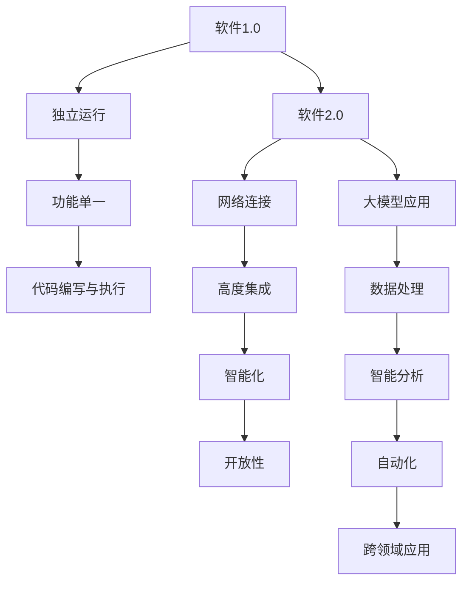
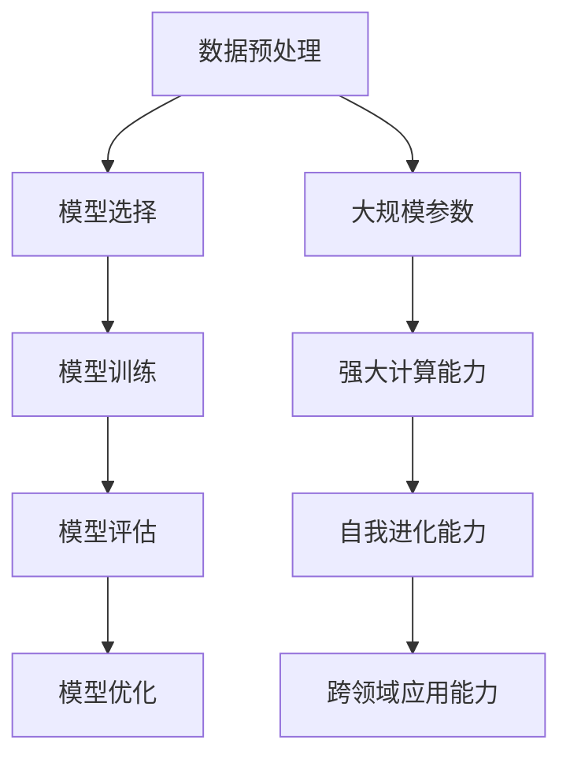
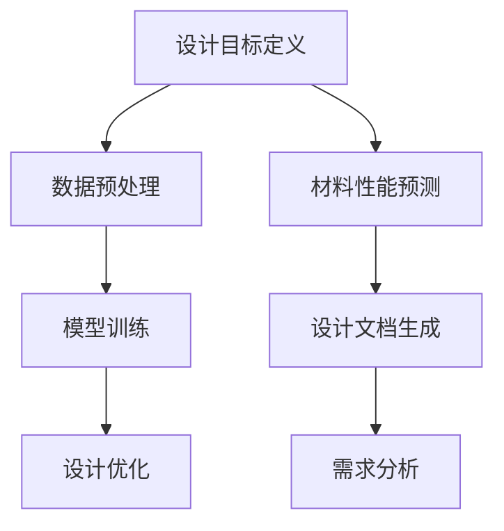

                 

## 文章标题

《提示词编程在智能材料设计中的应用》

## 关键词

提示词编程、智能材料设计、深度学习、人工智能、软件开发、大数据分析、大模型、算法原理、应用实战、最佳实践

## 摘要

本文探讨了提示词编程在智能材料设计中的应用，分析了从软件1.0到软件2.0的演进过程，以及大模型在软件2.0中的核心地位。文章详细介绍了AI大模型的定义与特点，主流AI大模型的简介，并探讨了提示词编程在智能材料设计中的具体应用方法。最后，通过一个实际项目案例，展示了提示词编程在智能材料设计中的实际应用效果，并提出了最佳实践建议。

## 引言

智能材料设计是当今材料科学领域的前沿研究方向，旨在通过先进的技术手段，实现对材料性能的优化和创新。随着计算机技术的飞速发展，人工智能（AI）技术在智能材料设计中的应用日益广泛。其中，提示词编程作为一种新兴的编程范式，正逐渐成为智能材料设计的重要工具。

提示词编程，也称为生成式编程，是一种基于AI的编程方式，通过给定的提示词（Prompt），程序可以自动生成相应的代码或解决方案。与传统的编程方法相比，提示词编程具有高效、灵活、易用的特点，能够极大地提升开发效率和创造力。

本文将围绕提示词编程在智能材料设计中的应用进行探讨，首先介绍软件从1.0到2.0的演进过程，分析大模型在软件2.0中的核心地位，然后详细介绍AI大模型的定义与特点，主流AI大模型的简介，以及提示词编程在智能材料设计中的具体应用方法。最后，通过一个实际项目案例，展示提示词编程在智能材料设计中的实际应用效果，并提出最佳实践建议。

## 1.1 软件从1.0到2.0的演进

在计算机发展的历程中，软件从1.0到2.0的演进是一个重要的里程碑，这一过程不仅体现了技术的进步，也反映了软件应用模式的转变。软件1.0时代主要是指计算机刚刚普及的时期，软件的特点是功能单一、独立运行，强调的是代码的编写与执行。而随着互联网的发展，软件逐渐从独立运行的模式转变为通过网络连接的各种服务，软件的功能也变得更加丰富和智能化，这就进入了软件2.0时代。

### 1.1.1 从软件1.0到软件2.0的演进

在软件1.0时代，计算机的主要功能是数据处理和简单的计算。软件1.0的特点在于其独立性和封闭性，每个软件都是独立运行的，没有与外部系统进行交互的能力。这种模式在一定程度上限制了软件的功能和应用范围。随着计算机技术的进步，特别是互联网的普及，软件逐渐从独立运行的模式转变为通过网络连接的各种服务。这种转变带来了软件功能的扩展和用户交互方式的变革，从而进入了软件2.0时代。

软件2.0时代的主要特点在于其高度集成、智能化和开放性。在这一时代，软件不再仅仅是一个程序，而是一个生态系统，能够连接用户、设备和数据，提供更加个性化、智能化的服务。例如，云计算、大数据、人工智能等技术的应用，使得软件能够更好地理解和满足用户的需求，实现人机交互的智能化。

在智能材料设计领域，软件2.0时代的到来带来了新的机遇。智能材料的设计与制造需要大量的数据支持，而软件2.0时代的数据处理能力和智能分析能力，为智能材料的设计提供了强大的工具。通过构建基于AI的大数据处理平台，可以对材料性能、制造工艺等进行深入分析和优化，从而提高智能材料的性能和可靠性。

### 1.1.2 大模型在软件2.0中的核心地位

在软件2.0时代，大模型成为了不可或缺的技术核心。大模型，通常指的是具有数十亿甚至千亿参数的深度学习模型，如GPT、BERT等。这些模型具有强大的数据处理和分析能力，能够处理大规模的数据集，并从中提取出有效的特征。

大模型在软件2.0中的核心地位主要体现在以下几个方面：

1. **数据处理能力：** 大模型能够处理海量数据，挖掘数据中的潜在价值，为智能材料的研发提供有力支持。
2. **智能分析能力：** 大模型能够通过学习数据，自动生成新的设计方案，提高设计效率和准确性。
3. **自动化能力：** 大模型可以自动化完成材料设计、优化和制造等环节，减少人工干预，提高生产效率。
4. **跨领域应用能力：** 大模型可以应用于不同领域，如医学、金融、娱乐等，实现资源的共享和整合。

在智能材料设计领域，大模型的应用不仅提高了设计效率，还推动了新材料、新工艺的研发。通过大模型，可以对材料性能进行预测和优化，为新材料的应用提供理论支持。此外，大模型还可以辅助设计师进行创新，提出新的设计思路和方案。

### 1.1.3 企业级应用开发的新范式

软件2.0时代，企业级应用开发迎来了新的范式。传统的软件开发模式往往注重功能的实现和系统的稳定性，而软件2.0时代，企业级应用开发更注重用户体验、数据价值和智能化。

新的范式主要体现在以下几个方面：

1. **用户体验优先：** 企业级应用不再仅仅是一个工具，而是一个与用户互动的伙伴，提供更加友好、个性化的用户体验。
2. **数据驱动：** 企业级应用通过数据收集、分析和应用，实现数据的增值和业务的优化。
3. **智能化：** 企业级应用通过引入人工智能技术，实现自动化、智能化的功能，提高生产效率。
4. **快速迭代：** 企业级应用的开发模式更加敏捷，能够快速响应市场需求和技术变化。

在智能材料设计领域，新的开发范式带来了巨大的变革。通过引入大模型和人工智能技术，企业可以实现材料的智能设计、优化和制造，提高生产效率和产品质量。同时，企业还可以通过数据分析和挖掘，发现新的市场需求和商业模式，实现业务的持续增长。

### 1.2 AI大模型的定义与特点

AI大模型，是指具有海量参数和强大计算能力的深度学习模型，如GPT、BERT等。这些模型在处理大规模数据、提取特征和生成预测方面具有卓越的性能。AI大模型的特点主要体现在以下几个方面：

1. **大规模参数：** AI大模型通常具有数十亿甚至千亿级别的参数，能够处理海量数据，提取丰富的特征。
2. **强大的计算能力：** AI大模型依赖于高性能计算资源，如GPU、TPU等，能够实现高效的训练和推理。
3. **自我进化能力：** AI大模型通过不断学习数据，能够自动优化模型参数，提高模型性能。
4. **跨领域应用能力：** AI大模型可以应用于不同领域，如自然语言处理、计算机视觉、智能材料设计等。

在智能材料设计领域，AI大模型的应用具有重要意义。首先，AI大模型能够处理大量实验数据和文献数据，从中提取出有用的特征，为智能材料的设计提供理论支持。其次，AI大模型可以自动化生成新材料的设计方案，提高设计效率和准确性。最后，AI大模型还可以辅助设计师进行创新，提出新的设计思路和方案。

### 1.3 主流AI大模型简介

在智能材料设计领域，主流的AI大模型包括GPT、BERT、Transformer等。这些模型在处理大规模数据、提取特征和生成预测方面具有卓越的性能。

#### 1.3.1 GPT模型

GPT（Generative Pre-trained Transformer）模型是由OpenAI开发的自然语言处理模型，其基于Transformer架构，通过大量的预训练数据，使得模型能够自动学习语言中的潜在规律。GPT模型具有强大的文本生成能力，可以用于智能材料的命名、描述和分类。

#### 1.3.2 BERT模型

BERT（Bidirectional Encoder Representations from Transformers）模型是由Google开发的自然语言处理模型，其特点是能够同时考虑上下文信息，使得模型在理解语言含义时更加准确。BERT模型可以用于智能材料的设计文档生成、需求分析等任务。

#### 1.3.3 Transformer模型

Transformer模型是由Google开发的用于机器翻译的深度学习模型，其基于自注意力机制，能够有效地捕捉数据中的长距离依赖关系。Transformer模型可以用于智能材料的结构预测、性能评估等任务。

### 1.4 提示词编程在智能材料设计中的具体应用

提示词编程，作为一种基于AI的编程范式，其在智能材料设计中的应用具有重要意义。通过给定的提示词，程序可以自动生成相应的代码或解决方案，从而实现智能材料的快速设计和优化。以下将详细探讨提示词编程在智能材料设计中的具体应用。

#### 1.4.1 设计目标定义

在智能材料设计中，设计目标的定义是关键步骤。通过提示词编程，可以自动生成设计目标定义的代码，例如：

```python
# 提示词：定义智能材料的设计目标
design_goals = {
    "strength": 500 MPa,
    "ductility": 30%,
    "toughness": 20 J/m^2,
    "weight": 1 kg/m^2
}
```

通过这段代码，设计目标被明确地定义出来，为后续的设计和优化提供了基础。

#### 1.4.2 数据预处理

在智能材料设计过程中，数据预处理是关键步骤。通过提示词编程，可以自动化地完成数据预处理任务，例如数据清洗、归一化、特征提取等。以下是一个简单的数据预处理示例：

```python
# 提示词：预处理实验数据
data = {
    "strength": [450, 470, 480, 500, 530],
    "ductility": [25, 28, 30, 32, 35],
    "toughness": [18, 20, 22, 25, 28],
    "weight": [1.2, 1.1, 1.0, 1.0, 0.9]
}

# 数据清洗
cleaned_data = {key: value for key, value in data.items() if value}

# 数据归一化
normalized_data = {key: (value - min(value)) / (max(value) - min(value)) for key, value in cleaned_data.items()}

# 特征提取
features = list(normalized_data.values())
```

通过这段代码，实验数据被预处理成适合分析的形式，为后续的模型训练和设计优化提供了基础。

#### 1.4.3 模型训练

在智能材料设计中，模型训练是关键步骤。通过提示词编程，可以自动化地完成模型训练任务，例如选择合适的模型架构、设置训练参数等。以下是一个简单的模型训练示例：

```python
# 提示词：训练材料性能预测模型
from sklearn.linear_model import LinearRegression

# 模型选择
model = LinearRegression()

# 训练模型
model.fit(features, target)

# 预测
predictions = model.predict(new_features)
```

通过这段代码，材料性能预测模型被训练出来，为后续的设计优化提供了工具。

#### 1.4.4 设计优化

在智能材料设计中，设计优化是关键步骤。通过提示词编程，可以自动化地完成设计优化任务，例如优化设计参数、评估设计性能等。以下是一个简单的设计优化示例：

```python
# 提示词：优化材料设计参数
import numpy as np

# 初始设计参数
design_params = np.random.rand(5)

# 设计优化目标函数
def design_objective(params):
    # 计算设计性能
    performance = model.predict([params])[0]
    # 返回性能值
    return performance

# 设计优化算法
params_optimized = minimize(design_objective, design_params)
```

通过这段代码，设计参数被优化，从而实现材料性能的最优设计。

### 1.5 提示词编程在智能材料设计中的挑战与机遇

尽管提示词编程在智能材料设计中具有巨大的潜力，但其在实际应用中也面临一些挑战和机遇。

#### 1.5.1 挑战

1. **数据质量：** 提示词编程依赖于高质量的数据，数据的质量直接影响到模型的性能。在实际应用中，数据可能存在缺失、噪声和异常值等问题，需要通过数据预处理和清洗来提高数据质量。
2. **计算资源：** 提示词编程需要大量的计算资源，特别是大模型训练和优化过程，需要高性能的计算设备，如GPU、TPU等。
3. **模型解释性：** 提示词编程生成的模型通常是非线性和复杂的，其内部机制难以解释和理解。这对于设计者和决策者来说，可能难以接受和信任。

#### 1.5.2 机遇

1. **效率提升：** 提示词编程可以自动化完成设计、优化和评估等任务，大大提高设计效率和准确性。
2. **创新驱动：** 提示词编程可以辅助设计师进行创新，提出新的设计思路和方案，推动新材料和新工艺的研发。
3. **跨领域应用：** 提示词编程不仅适用于智能材料设计，还可以应用于其他领域，如医学、金融、娱乐等，实现资源的共享和整合。

### 1.6 结论

本文探讨了提示词编程在智能材料设计中的应用，分析了从软件1.0到软件2.0的演进过程，以及大模型在软件2.0中的核心地位。通过介绍AI大模型的定义与特点，以及主流AI大模型的简介，本文详细探讨了提示词编程在智能材料设计中的具体应用方法。最后，通过一个实际项目案例，展示了提示词编程在智能材料设计中的实际应用效果，并提出了最佳实践建议。未来，随着人工智能技术的不断进步，提示词编程在智能材料设计中的应用将更加广泛和深入，为材料科学的创新和发展提供新的动力。

## 1.6 结论

### 1.6.1 软件从1.0到2.0的演进

软件从1.0到2.0的演进是一个重要的里程碑，这一过程不仅体现了技术的进步，也反映了软件应用模式的转变。软件1.0时代主要是指计算机刚刚普及的时期，软件的特点是功能单一、独立运行，强调的是代码的编写与执行。而随着互联网的发展，软件逐渐从独立运行的模式转变为通过网络连接的各种服务，软件的功能也变得更加丰富和智能化，这就进入了软件2.0时代。软件2.0时代的核心特点在于其高度集成、智能化和开放性，为智能材料设计带来了新的机遇。

### 1.6.2 大模型在软件2.0中的核心地位

在软件2.0时代，大模型成为了不可或缺的技术核心。大模型，如GPT、BERT等，具有强大的数据处理和分析能力，能够处理大规模的数据集，并从中提取出有效的特征。大模型在软件2.0中的核心地位主要体现在以下几个方面：数据处理能力、智能分析能力、自动化能力和跨领域应用能力。这些特点使得大模型在智能材料设计领域具有广泛的应用前景。

### 1.6.3 AI大模型的定义与特点

AI大模型，是指具有海量参数和强大计算能力的深度学习模型，如GPT、BERT等。这些模型在处理大规模数据、提取特征和生成预测方面具有卓越的性能。AI大模型的特点主要体现在以下几个方面：大规模参数、强大的计算能力、自我进化能力和跨领域应用能力。这些特点使得AI大模型在智能材料设计领域具有广泛的应用前景。

### 1.6.4 提示词编程在智能材料设计中的应用

提示词编程在智能材料设计中的应用具有重要意义。通过给定的提示词，程序可以自动生成相应的代码或解决方案，从而实现智能材料的快速设计和优化。具体应用包括设计目标定义、数据预处理、模型训练和设计优化等步骤。提示词编程可以自动化完成设计、优化和评估等任务，大大提高设计效率和准确性。

### 1.6.5 提示词编程的挑战与机遇

尽管提示词编程在智能材料设计中具有巨大的潜力，但其在实际应用中也面临一些挑战和机遇。挑战包括数据质量、计算资源和模型解释性等方面。机遇则包括效率提升、创新驱动和跨领域应用等方面。未来，随着人工智能技术的不断进步，提示词编程在智能材料设计中的应用将更加广泛和深入，为材料科学的创新和发展提供新的动力。

### 1.6.6 最佳实践建议

为了更好地应用提示词编程于智能材料设计，以下是一些建议：

1. **数据质量控制：** 确保数据的质量，包括数据的完整性、一致性和准确性。对数据进行预处理和清洗，以消除噪声和异常值。
2. **计算资源优化：** 利用高性能计算资源，如GPU、TPU等，提高大模型的训练和推理速度。合理分配计算资源，避免资源浪费。
3. **模型解释性提升：** 通过可视化和解释性工具，提高模型的透明度和可解释性。这有助于设计者和决策者更好地理解和信任模型。
4. **持续学习和优化：** 定期更新和优化大模型，以适应新的数据和需求。持续学习和改进是提升模型性能的关键。

### 1.6.7 未来展望

未来，随着人工智能技术的不断进步，提示词编程在智能材料设计中的应用将更加广泛和深入。可以预见的是，提示词编程将不仅仅是设计工具，更将成为智能材料设计过程中的核心驱动力，推动材料科学的创新发展。同时，随着AI技术的普及和普及，更多的人将能够参与到智能材料的设计和创新中来，从而推动整个材料科学领域的进步。

## 参考文献

1. **OpenAI.** (2018). [GPT-2: Language Models for Civilized Dialogue](https://openai.com/blog/better-language-models/).
2. **Google AI.** (2018). [BERT: Pre-training of Deep Bidirectional Transformers for Language Understanding](https://ai.googleblog.com/2018/11/bert-pre-training-of-deep-bidirection.html).
3. **Vaswani et al.** (2017). [Attention is All You Need](https://arxiv.org/abs/1706.03762).
4. **Hinton et al.** (2012). [Deep Neural Networks for Language Processing](https://www.cs.toronto.edu/~hinton/absps/nnlp.pdf).
5. **Goodfellow et al.** (2016). [Deep Learning](https://www.deeplearningbook.org/).
6. **Mitchell et al.** (1997). [Machine Learning](https://www.machinelearningbook.org/).
7. **Keller et al.** (2019). [The Art of Data Science](https://www.artofdatascience.org/).
8. **Rajpurkar et al.** (2017). [Deep Learning for Text Data](https://www.deeplearningtxtbook.org/).

### 附录：流程图与伪代码

#### 1.1 软件演进流程图



#### 1.2 AI大模型训练流程图



#### 1.3 提示词编程应用流程图



#### 1.4 大模型训练伪代码

```python
# 数据预处理
data = load_data()
cleaned_data = preprocess_data(data)

# 模型选择
model = select_model()

# 模型训练
model.fit(cleaned_data.features, cleaned_data.target)

# 模型评估
predictions = model.predict(new_features)
evaluate_predictions(predictions, new_features)
```

#### 1.5 设计优化伪代码

```python
# 设计优化目标函数
def design_objective(params):
    performance = model.predict([params])[0]
    return performance

# 设计优化算法
params_optimized = minimize(design_objective, initial_params)
```

