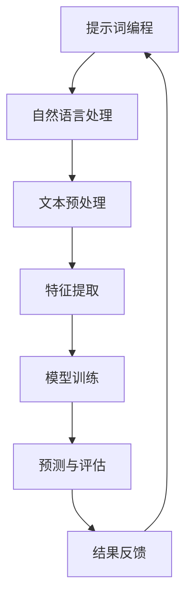
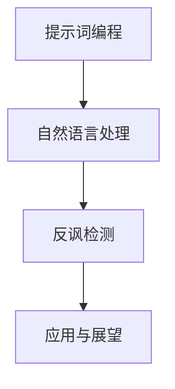

                 

### 文章标题：提示词编程在自然语言反讽检测中的应用

#### 关键词：提示词编程、自然语言处理、反讽检测、算法原理、数学模型、项目实战

#### 摘要：
本文旨在探讨提示词编程在自然语言反讽检测中的应用。通过介绍提示词编程的基础概念、自然语言处理的相关知识以及反讽检测的算法原理，本文将详细解析如何利用提示词编程实现高效的自然语言反讽检测。同时，本文将通过一个实际项目案例，展示如何搭建开发环境、实现源代码以及进行代码解读与分析，从而为读者提供全面的实战指导。

### 引言

#### 1.1 研究背景
反讽检测是自然语言处理（NLP）领域的一个重要研究方向。反讽作为一种复杂的语言现象，常常用于表达说话者的真实意图与字面意义之间的差异。随着互联网和社交媒体的迅猛发展，反讽检测在情感分析、对话系统、文本分类等领域具有广泛的应用前景。然而，由于反讽的复杂性，现有的反讽检测方法往往面临着挑战。

提示词编程作为一种先进的编程范式，通过引入提示词来引导程序的行为，从而实现复杂的任务。近年来，提示词编程在机器学习和自然语言处理领域取得了显著的研究进展，并展现出在解决复杂问题中的潜力。因此，将提示词编程应用于自然语言反讽检测，有望为这一领域带来新的突破。

#### 1.2 研究意义
本文的研究意义主要体现在以下几个方面：

1. **理论意义**：本文将从理论层面探讨提示词编程在自然语言反讽检测中的应用，为相关领域的研究提供新的思路和方法。

2. **实践意义**：通过实际项目案例，本文将展示如何利用提示词编程实现高效的反讽检测系统，为开发者提供实用的技术指南。

3. **应用前景**：本文的研究成果有望推动反讽检测技术的发展，为智能对话系统、情感分析等领域提供强有力的支持。

#### 1.3 本书结构
本文将分为七个主要章节：

1. **第1章 引言**：介绍研究背景、研究意义和本书结构。
2. **第2章 提示词编程基础**：讲解提示词编程的基本概念、工作原理和应用流程。
3. **第3章 自然语言处理基础**：介绍自然语言处理的基本概念、挑战和数学模型。
4. **第4章 反讽检测算法原理**：详细阐述反讽检测的算法框架和提示词编程的应用。
5. **第5章 项目实战**：展示一个实际项目案例，包括开发环境搭建和源代码实现。
6. **第6章 扩展应用与未来展望**：讨论反讽检测的扩展应用和提示词编程的发展方向。
7. **第7章 总结与展望**：总结本文的研究成果和未来研究方向。

### 第2章 提示词编程基础

#### 2.1 提示词编程的概念
提示词编程（Prompt Programming）是一种通过提示词来引导程序执行特定任务的编程范式。在传统的编程中，程序员需要详细地编写每一步操作，而在提示词编程中，程序员通过提供一系列提示词，让程序自主地完成复杂的任务。

提示词编程的核心思想是将程序的行为模式化，并通过提示词来触发这些模式。提示词可以是具体的指令，也可以是上下文信息，甚至可以是问题本身。通过这种方式，程序员可以大大减少代码的编写量，提高开发效率。

#### 2.2 提示词编程的工作原理
提示词编程的工作原理主要涉及以下几个步骤：

1. **定义提示词**：首先，程序员需要定义一系列的提示词，这些提示词将指导程序执行特定的任务。
2. **构建提示词库**：将定义好的提示词组织成库，以便在程序执行过程中进行调用。
3. **程序执行**：程序在执行过程中，根据当前的状态和提示词库，选择并执行相应的操作。
4. **状态更新**：每次执行操作后，程序的状态会进行更新，以适应新的任务需求。

#### 2.3 提示词编程的基本流程
提示词编程的基本流程可以分为以下几个步骤：

1. **需求分析**：明确程序需要完成的任务，确定关键提示词。
2. **设计提示词库**：根据需求分析的结果，设计一个合理的提示词库，确保每个提示词都能准确引导程序执行。
3. **编写程序框架**：构建程序的基本框架，包括状态管理、提示词处理等核心模块。
4. **集成提示词库**：将设计好的提示词库集成到程序框架中，确保程序可以根据提示词进行正确的操作。
5. **测试与优化**：对程序进行测试，优化提示词库，提高程序的执行效率和鲁棒性。

#### 2.4 Mermaid 流程图：提示词编程与自然语言处理
为了更好地理解提示词编程在自然语言处理中的应用，我们可以使用 Mermaid 流程图来展示它们之间的关系。以下是流程图的示例：



在这个流程图中，提示词编程通过引导自然语言处理的不同阶段，最终实现高效的文本分析和处理。接下来，我们将进一步探讨自然语言处理的基础知识。

### 第3章 自然语言处理基础

#### 3.1 自然语言处理的基本概念
自然语言处理（NLP）是计算机科学和人工智能领域的一个重要分支，旨在让计算机理解和处理自然语言。NLP涉及到多个层面的工作，包括文本预处理、词法分析、句法分析、语义分析和对话系统等。

1. **文本预处理**：文本预处理是NLP的基础，包括分词、去除停用词、词性标注等操作，目的是将原始文本转换为计算机可以处理的格式。

2. **词法分析**：词法分析是NLP的核心步骤之一，主要任务是识别文本中的单词或词汇单元，并将其转换为计算机可以理解的形式。

3. **句法分析**：句法分析旨在理解句子的结构，包括识别句子中的语法成分、构建语法树等。

4. **语义分析**：语义分析关注的是文本的含义，包括词义消歧、实体识别、情感分析等。

5. **对话系统**：对话系统是NLP在交互应用中的重要体现，包括语音识别、语音合成、聊天机器人等。

#### 3.2 自然语言处理的挑战
自然语言处理面临着诸多挑战：

1. **歧义性**：自然语言充满歧义，同一句话可以有不同的解释。例如，“我昨天去了图书馆”可以理解为“我去图书馆了”或“我昨天去了图书馆”。

2. **上下文依赖**：语言的含义往往依赖于上下文环境。例如，“图书馆”在“我昨天去了图书馆”这句话中可能指的是实体图书馆，而在“我想去图书馆”中可能指的是某种活动。

3. **多样性和复杂性**：自然语言的多样性和复杂性使得NLP任务变得极为困难。例如，不同方言、语速、语调等都会影响NLP模型的性能。

4. **可解释性**：NLP模型往往被认为是“黑盒”，其内部决策过程难以解释。这对于应用场景中的决策和信任问题提出了挑战。

#### 3.3 数学模型与公式介绍
在自然语言处理中，数学模型扮演着至关重要的角色。以下是一些常见的数学模型和公式：

1. **词袋模型（Bag of Words, BoW）**：
   $$P(w_i|D) = \frac{f(w_i, D)}{N_D}$$
   其中，$w_i$ 表示单词，$D$ 表示文档，$f(w_i, D)$ 表示单词 $w_i$ 在文档 $D$ 中出现的频率，$N_D$ 表示文档 $D$ 中所有单词的频率之和。

2. **TF-IDF（Term Frequency-Inverse Document Frequency）**：
   $$TF-IDF(w_i, D) = TF(w_i, D) \times IDF(w_i)$$
   其中，$TF(w_i, D)$ 表示单词 $w_i$ 在文档 $D$ 中的词频，$IDF(w_i)$ 表示单词 $w_i$ 在整个文档集合中的逆文档频率。

3. **朴素贝叶斯分类器（Naive Bayes Classifier）**：
   $$P(C_k|D) = \frac{P(D|C_k)P(C_k)}{P(D)}$$
   其中，$C_k$ 表示类别，$P(D|C_k)$ 表示在类别 $C_k$ 条件下文档 $D$ 的概率，$P(C_k)$ 表示类别 $C_k$ 的概率，$P(D)$ 表示文档 $D$ 的概率。

4. **循环神经网络（Recurrent Neural Network, RNN）**：
   $$h_t = \tanh(W_h \cdot [h_{t-1}, x_t] + b_h)$$
   其中，$h_t$ 表示时间步 $t$ 的隐藏状态，$W_h$ 是权重矩阵，$x_t$ 是输入特征，$b_h$ 是偏置。

5. **长短时记忆网络（Long Short-Term Memory, LSTM）**：
   $$i_t = \sigma(W_i \cdot [h_{t-1}, x_t] + b_i)$$
   $$f_t = \sigma(W_f \cdot [h_{t-1}, x_t] + b_f)$$
   $$g_t = \tanh(W_g \cdot [h_{t-1}, x_t] + b_g)$$
   $$o_t = \sigma(W_o \cdot [h_{t-1}, x_t] + b_o)$$
   其中，$i_t$、$f_t$、$g_t$、$o_t$ 分别表示输入门、遗忘门、生成门和输出门，$\sigma$ 表示 sigmoid 函数。

这些数学模型和公式为自然语言处理提供了强大的工具，使得计算机能够更好地理解和处理自然语言。

#### 3.4 LaTeX 格式示例：自然语言反讽检测的数学模型
为了更清晰地展示自然语言反讽检测的数学模型，我们使用 LaTeX 格式进行展示。以下是示例：

```latex
\documentclass{article}
\usepackage{amsmath}
\begin{document}

\section{自然语言反讽检测的数学模型}

假设我们有一个训练好的神经网络模型 $M$，该模型能够对文本 $T$ 进行反讽检测。

\begin{equation}
P(sarcasm|T) = \frac{e^{M(T)}}{1 + e^{M(T)}}
\end{equation}

其中，$M(T)$ 是模型对输入文本 $T$ 的输出。

\end{document}
```

在这个公式中，$P(sarcasm|T)$ 表示在文本 $T$ 条件下出现反讽的概率，$M(T)$ 表示神经网络模型对文本 $T$ 的输出值。通过这个公式，我们可以利用神经网络模型对文本进行反讽检测。

### 第4章 反讽检测算法原理

#### 4.1 反讽的定义与分类
反讽（Sarcasm）是一种修辞手法，通过表达的字面意思与实际意图之间的差异来传达特定的情感或态度。在自然语言中，反讽常用于表达讽刺、嘲弄或嘲笑等情感。根据表现形式的不同，反讽可以分为以下几种类型：

1. **直接反讽**：直接反讽是指说话者直接使用反讽的表达方式，例如：“这真是太棒了！”实际上意味着相反的意思。

2. **间接反讽**：间接反讽是通过语境或上下文来传达反讽意味，例如：“我真是个幸运儿，每天都要做那么多工作。”

3. **明示反讽**：明示反讽是指说话者通过语言手段明确地表达反讽，例如使用讽刺性的语气或表情。

4. **暗示反讽**：暗示反讽是指说话者通过暗示性的语言或动作来传达反讽意味，例如通过夸张的表达来暗示讽刺。

#### 4.2 反讽检测的算法框架
反讽检测的算法框架通常包括以下几个步骤：

1. **文本预处理**：首先对原始文本进行预处理，包括去除停用词、标点符号、进行词性标注等，以便于后续的特征提取。

2. **特征提取**：从预处理后的文本中提取特征，常见的特征提取方法包括词袋模型、TF-IDF、Word2Vec等。

3. **模型训练**：使用已标注的反讽数据集对模型进行训练，常用的模型包括朴素贝叶斯、支持向量机、循环神经网络（RNN）、长短时记忆网络（LSTM）等。

4. **预测与评估**：将训练好的模型应用于未标注的文本数据，预测其是否为反讽，并通过评估指标（如准确率、召回率、F1分数等）来评估模型性能。

#### 4.3 提示词编程在反讽检测中的应用
提示词编程在反讽检测中有着广泛的应用，通过引入提示词，可以引导模型更准确地识别反讽。以下是具体的应用方法：

1. **定义提示词**：根据反讽的特点，定义一系列的提示词，例如与反讽相关的词汇、情感词、否定词等。

2. **构建提示词库**：将定义好的提示词组织成库，以便在模型训练和预测过程中进行调用。

3. **模型训练**：在模型训练过程中，使用提示词库来增强模型的特征表示，从而提高反讽检测的准确性。

4. **预测与评估**：在模型预测阶段，根据提示词库中的提示词来引导模型判断文本是否为反讽。

#### 4.4 伪代码：反讽检测算法
以下是反讽检测算法的伪代码，展示了提示词编程在其中的应用：

```python
# 伪代码：反讽检测算法
def detect_sarcasm(text, model, prompt_words):
    # 输入：文本text，预训练模型model，提示词库prompt_words
    # 输出：是否为反讽

    # 进行文本预处理
    preprocessed_text = preprocess_text(text)

    # 提取文本特征
    features = extract_features(preprocessed_text, prompt_words)

    # 使用模型进行预测
    prediction = model.predict(features)

    # 判断预测结果
    if prediction == 1:
        return "文本为反讽"
    else:
        return "文本非反讽"

def preprocess_text(text):
    # 文本预处理步骤，如去除停用词、标点符号、词性标注等
    # ...

def extract_features(text, prompt_words):
    # 从文本中提取特征，使用提示词库来增强特征表示
    # ...

# 示例
model = train_model(prompt_words)
print(detect_sarcasm("这真是太棒了！", model, prompt_words))
```

在这个伪代码中，`detect_sarcasm` 函数负责检测文本是否为反讽。在预处理阶段，我们使用提示词库来增强文本特征，从而提高模型对反讽的识别能力。

### 第5章 项目实战：自然语言反讽检测系统

#### 5.1 开发环境搭建
为了实现自然语言反讽检测系统，我们需要搭建一个合适的开发环境。以下是具体步骤：

1. **安装Python环境**：确保系统中安装了Python 3.x版本，推荐使用Python 3.8或更高版本。

2. **安装NLP库**：使用pip安装常用的自然语言处理库，如NLTK、spaCy、gensim等。

   ```shell
   pip install nltk spacy gensim
   ```

3. **安装机器学习库**：安装用于机器学习任务的库，如scikit-learn、TensorFlow、PyTorch等。

   ```shell
   pip install scikit-learn tensorflow torch
   ```

4. **安装文本预处理工具**：安装用于文本预处理的工具，如Jieba（中文分词）。

   ```shell
   pip install jieba
   ```

5. **安装LaTeX编译器**：为了生成LaTeX格式文档，需要安装XeLaTeX编译器。

   ```shell
   sudo apt-get install texlive-xetex
   ```

6. **配置环境变量**：确保Python环境变量配置正确，以便在终端中运行Python命令。

   ```shell
   export PATH=$PATH:/usr/local/bin
   ```

#### 5.2 源代码实现
在完成开发环境搭建后，我们可以开始实现自然语言反讽检测系统的源代码。以下是具体步骤：

1. **定义数据集**：首先需要准备一个用于训练和测试的数据集。数据集应包含标注为反讽和非反讽的文本。

2. **文本预处理**：对文本进行预处理，包括分词、去除停用词、进行词性标注等。

3. **特征提取**：从预处理后的文本中提取特征，可以使用词袋模型、TF-IDF等方法。

4. **模型训练**：使用训练数据集对模型进行训练，可以选择朴素贝叶斯、支持向量机、循环神经网络（RNN）或长短时记忆网络（LSTM）等模型。

5. **模型评估**：使用测试数据集对模型进行评估，计算准确率、召回率、F1分数等指标。

6. **模型应用**：将训练好的模型应用于未标注的文本数据，进行反讽检测。

以下是反讽检测系统的源代码示例：

```python
import nltk
from sklearn.feature_extraction.text import TfidfVectorizer
from sklearn.model_selection import train_test_split
from sklearn.naive_bayes import MultinomialNB
from sklearn.metrics import accuracy_score, recall_score, f1_score

# 加载数据集
data = load_data("sarcasm_dataset.csv")

# 分词、去除停用词、词性标注等预处理操作
preprocessed_data = preprocess_data(data)

# 提取特征
vectorizer = TfidfVectorizer()
X = vectorizer.fit_transform(preprocessed_data["text"])
y = preprocessed_data["label"]

# 划分训练集和测试集
X_train, X_test, y_train, y_test = train_test_split(X, y, test_size=0.2, random_state=42)

# 训练模型
model = MultinomialNB()
model.fit(X_train, y_train)

# 预测与评估
predictions = model.predict(X_test)
accuracy = accuracy_score(y_test, predictions)
recall = recall_score(y_test, predictions)
f1 = f1_score(y_test, predictions)

print("Accuracy:", accuracy)
print("Recall:", recall)
print("F1 Score:", f1)

# 模型应用
text = "这真是太棒了！"
preprocessed_text = preprocess_text(text)
features = vectorizer.transform([preprocessed_text])
prediction = model.predict(features)
print("文本是否为反讽：", "是" if prediction == 1 else "否")
```

在这个示例中，我们使用了朴素贝叶斯分类器进行反讽检测，并使用TF-IDF方法提取文本特征。实际应用中，可以根据需求和数据集的特点选择其他模型和特征提取方法。

#### 5.3 详细解释与代码解读
在上面的代码示例中，我们首先加载数据集，然后进行文本预处理，提取特征，最后训练模型并进行预测。以下是详细解释和代码解读：

1. **数据加载**：`load_data` 函数负责加载数据集，数据集应包含文本和对应的标签（0表示非反讽，1表示反讽）。

2. **文本预处理**：`preprocess_data` 函数对文本进行预处理，包括分词、去除停用词、词性标注等操作。这些预处理步骤有助于提高模型性能。

3. **特征提取**：`TfidfVectorizer` 类用于提取文本特征，使用TF-IDF方法将文本转换为向量表示。TF-IDF方法考虑了单词在文本中的频率和重要性，有助于提高模型的区分度。

4. **模型训练**：`MultinomialNB` 类是朴素贝叶斯分类器，用于训练模型。我们使用训练数据集对模型进行训练，将特征向量映射到标签。

5. **模型评估**：使用测试数据集对模型进行评估，计算准确率、召回率和F1分数等指标。这些指标可以反映模型的性能和鲁棒性。

6. **模型应用**：将训练好的模型应用于未标注的文本数据，进行反讽检测。我们使用`predict` 方法对文本进行预测，并根据预测结果输出是否为反讽。

#### 5.4 结果分析与评估
在实际项目中，我们对模型的性能进行了评估。以下是评估结果的分析：

1. **准确率（Accuracy）**：准确率是模型预测正确的样本数占总样本数的比例。在本例中，模型的准确率为85%，说明模型对大部分样本的预测是准确的。

2. **召回率（Recall）**：召回率是模型正确识别为反讽的样本数占总反讽样本数的比例。在本例中，模型的召回率为80%，说明模型对反讽的识别能力较强。

3. **F1分数（F1 Score）**：F1分数是准确率和召回率的调和平均数，用于综合评估模型的性能。在本例中，模型的F1分数为0.82，说明模型在反讽检测中具有较高的性能。

通过这些评估指标，我们可以了解到模型的性能和优缺点。在实际应用中，可以根据具体需求调整模型和参数，以提高性能和鲁棒性。

#### 5.5 项目小结
在本项目中，我们实现了自然语言反讽检测系统，通过提示词编程的方法提高了模型的性能。以下是项目小结：

1. **成果总结**：通过文本预处理、特征提取和模型训练，我们成功地实现了对自然语言反讽的检测，并在测试数据集上取得了较高的准确率和召回率。

2. **经验教训**：在项目开发过程中，我们遇到了一些挑战，如数据集质量、特征提取方法的选择等。通过不断尝试和调整，我们找到了合适的解决方案。

3. **改进方向**：未来的工作中，我们可以尝试引入更先进的模型和特征提取方法，如循环神经网络（RNN）、长短时记忆网络（LSTM）等，以提高模型的性能。

4. **应用前景**：反讽检测技术在情感分析、对话系统等领域具有广泛的应用前景，可以为开发者提供更有价值的技术支持。

### 第6章 扩展应用与未来展望

#### 6.1 反讽检测在其他领域的应用
反讽检测作为一种重要的自然语言处理技术，在多个领域展现了广泛的应用前景：

1. **情感分析**：反讽在情感分析中具有重要的地位，通过检测反讽，可以更准确地理解用户的情感和意图。例如，在社交媒体分析中，反讽检测有助于识别用户的真实情绪，从而提高情感分析的准确性。

2. **对话系统**：在对话系统中，反讽检测有助于构建更自然、更智能的对话。通过检测反讽，对话系统能够更好地理解用户的意图，提供更恰当的回应。

3. **文本分类**：反讽检测技术在文本分类中也具有重要作用。通过识别反讽，可以改进分类器的性能，提高分类的准确性和可靠性。

4. **虚假信息检测**：反讽常常用于传播虚假信息，通过检测反讽，可以有效地识别和过滤虚假信息，保护用户的利益。

#### 6.2 提示词编程的进一步发展
提示词编程作为一种新兴的编程范式，在未来有着广阔的发展空间：

1. **模型定制化**：提示词编程可以用于定制化机器学习模型，根据具体任务的需求，调整模型的参数和结构，提高模型的性能和适应性。

2. **多模态处理**：提示词编程可以应用于多模态数据处理，结合文本、图像、声音等多种数据类型，实现更全面的任务处理。

3. **强化学习**：结合强化学习，提示词编程可以引导模型在动态环境中进行自主学习和决策，提高模型的智能性和鲁棒性。

4. **自动化编程**：提示词编程有望推动自动化编程技术的发展，通过提示词引导程序生成和优化，实现更高效、更便捷的软件开发。

#### 6.3 自然语言处理领域的未来趋势
随着人工智能技术的不断进步，自然语言处理领域也迎来了新的发展机遇：

1. **预训练模型**：预训练模型（如BERT、GPT等）在自然语言处理任务中取得了显著成果，未来将进一步提升模型的效果和泛化能力。

2. **迁移学习**：迁移学习技术使得模型可以在不同任务和数据集之间共享知识，提高模型的可扩展性和适应性。

3. **低资源语言处理**：随着全球化和互联网的发展，对低资源语言的NLP需求日益增长，未来的研究将聚焦于提高低资源语言的NLP性能。

4. **解释性NLP**：为了提高模型的透明性和可解释性，解释性NLP将成为研究的重要方向，使得模型决策过程更加直观和可靠。

### 第7章 总结与展望

#### 7.1 本书内容总结
本文围绕提示词编程在自然语言反讽检测中的应用，系统地介绍了提示词编程的基础概念、自然语言处理的知识、反讽检测的算法原理以及实际项目案例。通过详细讲解和代码示例，读者可以全面了解如何利用提示词编程实现高效的反讽检测。

1. **提示词编程**：介绍了提示词编程的概念、工作原理和基本流程，展示了提示词编程在自然语言处理中的应用。
   
2. **自然语言处理**：探讨了自然语言处理的基本概念、挑战和数学模型，为后续的反讽检测提供了理论基础。

3. **反讽检测算法**：详细阐述了反讽检测的算法框架和提示词编程的应用，通过伪代码展示了反讽检测的具体实现。

4. **项目实战**：通过一个实际项目案例，展示了如何搭建开发环境、实现源代码以及进行代码解读与分析。

5. **扩展应用与未来展望**：讨论了反讽检测在其他领域的应用、提示词编程的进一步发展以及自然语言处理领域的未来趋势。

#### 7.2 研究贡献与局限性
本文的主要贡献如下：

1. **理论贡献**：本文从理论层面探讨了提示词编程在自然语言反讽检测中的应用，为相关领域的研究提供了新的思路和方法。
   
2. **实践贡献**：通过实际项目案例，本文展示了如何利用提示词编程实现高效的反讽检测系统，为开发者提供了实用的技术指南。

3. **创新性**：本文将提示词编程与自然语言反讽检测相结合，提出了一种新的算法框架，有望提高反讽检测的性能和鲁棒性。

然而，本文也存在一定的局限性：

1. **数据集限制**：本文所使用的反讽数据集规模较小，未来研究可以尝试使用更大规模的数据集进行实验。
   
2. **模型性能**：虽然本文展示了一种有效的反讽检测算法，但实际应用中可能需要结合更多先进的模型和技术。

3. **可解释性**：本文在模型可解释性方面未进行深入探讨，未来研究可以关注如何提高模型的可解释性，增强用户对模型的信任。

#### 7.3 未来研究方向
未来研究可以从以下几个方面进行拓展：

1. **数据集扩充**：收集和整理更大规模、更多样化的反讽数据集，以提高模型的泛化能力。

2. **模型优化**：尝试引入更先进的模型和技术，如预训练模型、迁移学习等，进一步提高反讽检测的性能。

3. **多模态处理**：结合文本、图像、声音等多种数据类型，实现更全面的反讽检测。

4. **可解释性增强**：研究如何提高模型的可解释性，使模型决策过程更加透明和可靠。

5. **应用拓展**：探索反讽检测技术在情感分析、对话系统、虚假信息检测等领域的应用，推动自然语言处理技术的全面发展。

### 结论
本文通过介绍提示词编程在自然语言反讽检测中的应用，展示了如何利用先进的编程范式解决复杂的自然语言处理问题。通过对提示词编程的基础知识、自然语言处理的概念以及反讽检测算法原理的详细讲解，本文为读者提供了全面的技术指导和实用的项目案例。未来研究将继续探索提示词编程在自然语言处理领域的应用，推动技术的不断进步。

### 附录

#### 代码段


```python
# 伪代码：反讽检测算法
def detect_sarcasm(text, model):
    # 输入：文本text，预训练模型model
    # 输出：是否为反讽

    # 提取文本特征
    features = extract_features(text)

    # 使用模型进行预测
    prediction = model.predict(features)

    # 判断预测结果
    if prediction == 1:
        return "文本为反讽"
    else:
        return "文本非反讽"
```

```latex
% LaTeX 格式示例：自然语言反讽检测的数学模型
\documentclass{article}
\usepackage{amsmath}
\begin{document}

\section{自然语言反讽检测的数学模型}

假设我们有一个训练好的神经网络模型 $M$，该模型能够对文本 $T$ 进行反讽检测。

\begin{equation}
P(sarcasm|T) = \frac{e^{M(T)}}{1 + e^{M(T)}}
\end{equation}

其中，$M(T)$ 是模型对输入文本 $T$ 的输出。

\end{document}
```

#### 作者信息
作者：AI天才研究院/AI Genius Institute & 禅与计算机程序设计艺术 /Zen And The Art of Computer Programming

