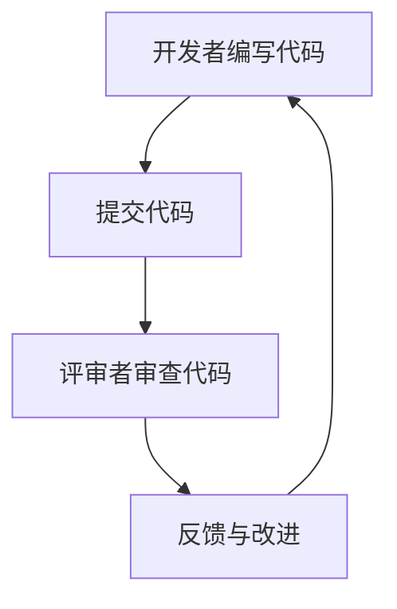
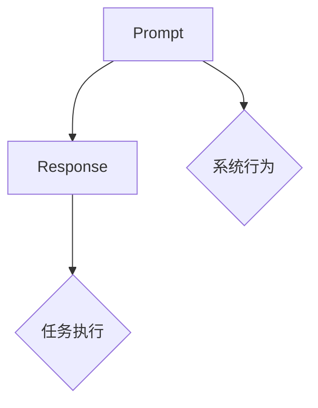

                 


## 《提示词编程的代码审查最佳实践》

### 文章关键词

代码审查，提示词编程，最佳实践，代码质量，软件开发流程

### 摘要

随着提示词编程（Prompt-Response Programming）的兴起，代码审查成为软件开发过程中至关重要的一环。本文旨在探讨提示词编程环境下代码审查的最佳实践，从基础理论到实际操作，为开发团队提供一套完整的审查指南。本文首先介绍了代码审查的基本概念和流程，接着分析了提示词编程的特点及其对代码审查的挑战，最后提出了一系列具体而实用的代码审查技巧和工具推荐，旨在提高代码质量和项目成功率。

---

## 第一部分：代码审查基础

### 第1章：代码审查概述

#### 1.1 代码审查的定义和重要性

代码审查（Code Review）是一种系统性的检查和评估代码质量的过程。它不仅包括对代码正确性的检查，还涉及到代码的可读性、可维护性和健壮性。代码审查的重要性在于，它可以提前发现和修复潜在的问题，从而避免在后续的开发和维护过程中产生更大的成本和风险。

**核心概念与联系**

代码审查可以看作是一个反馈和改进的闭环过程。开发者编写代码后，提交给评审者进行审查，评审者根据预定的标准进行评估，并提出改进建议。这一过程不仅有助于提升代码质量，还可以加强团队之间的沟通和协作。



**核心算法原理讲解**

代码审查的原理可以类比于编译过程中的错误检查。在编译过程中，编译器会检测源代码中的语法错误、类型错误等，并报告给开发者。代码审查则是在源代码层面进行的，通过人工或工具检查代码的逻辑错误、潜在问题等。

```pseudo
function codeReview(sourceCode) {
    // 检查语法错误
    if (hasSyntaxError(sourceCode)) {
        return "存在语法错误，请修改";
    }
    
    // 检查逻辑错误
    if (hasLogicalError(sourceCode)) {
        return "存在逻辑错误，请修改";
    }
    
    // 检查代码质量
    if (!isCodeOfGoodQuality(sourceCode)) {
        return "代码质量不高，请改进";
    }
    
    return "代码审查通过";
}
```

**详细讲解与举例说明**

代码审查的目标是确保代码的质量，提高项目的可维护性和可靠性。以下是一个具体的例子：

- **目标：** 提高代码的可读性、可维护性和可靠性。

- **益处：** 通过代码审查，可以发现代码中的潜在问题，避免在后续开发过程中出现更大的问题，提高开发效率。

#### 1.2 代码审查的类型和方法

代码审查主要分为三种类型：人工审查、工具辅助审查和自动化审查。

- **人工审查：** 由开发者或评审者手动检查代码。优点在于能够发现工具难以捕捉的逻辑错误和设计问题，缺点在于效率低且主观性较强。

- **工具辅助审查：** 利用代码审查工具自动检查代码。优点在于高效且能够发现常见的编码错误，缺点在于难以发现复杂的逻辑错误和设计问题。

- **自动化审查：** 通过编写脚本或使用现有工具进行自动化检查。优点在于高效且能够覆盖广泛的代码范围，缺点在于可能引入误报和漏报。

**核心算法原理讲解**

每种类型的代码审查都有其独特的原理和应用场景。人工审查依赖于人的经验和判断，工具辅助审查依赖于工具的规则和算法，自动化审查则依赖于脚本或工具的执行和输出。

```pseudo
// 人工审查
function manualReview(code) {
    // 人肉检查代码
    if (hasError(code)) {
        return "存在错误，请修改";
    }
    return "代码审查通过";
}

// 工具辅助审查
function toolAssistedReview(code) {
    // 使用工具检查代码
    if (tool.hasError(code)) {
        return "存在错误，请修改";
    }
    return "代码审查通过";
}

// 自动化审查
function automatedReview(code) {
    // 使用脚本或工具检查代码
    if (script.hasError(code)) {
        return "存在错误，请修改";
    }
    return "代码审查通过";
}
```

**详细讲解与举例说明**

不同类型的代码审查适用于不同的场景。例如，在早期开发阶段，人工审查可能更合适，因为此时代码结构和功能相对简单。而在后期维护阶段，自动化审查可能更有效，因为它可以快速地发现常见的问题。

#### 1.3 代码审查的目标和益处

代码审查的主要目标是确保代码的质量，提高项目的可维护性和可靠性。以下是一些具体的目标和益处：

- **确保代码质量：** 通过代码审查，可以确保代码符合预定的质量标准，减少缺陷和错误。

- **提高可维护性：** 通过代码审查，可以识别出潜在的维护问题，从而提高代码的可维护性。

- **减少bug数量：** 通过代码审查，可以提前发现和修复问题，从而减少bug的数量。

- **提高开发效率：** 通过代码审查，可以确保代码质量，减少后续修复问题的成本。

**详细讲解与举例说明**

以下是一个具体的例子：

- **目标：** 提高代码的可读性、可维护性和可靠性。

- **益处：** 通过代码审查，可以发现代码中的潜在问题，避免在后续开发过程中出现更大的问题，提高开发效率。

### 第2章：代码审查流程

#### 2.1 代码审查的准备工作

在开始代码审查之前，需要做好一系列准备工作，以确保审查过程的顺利进行。

**详细讲解与举例说明**

准备工作包括以下几个方面：

- **选择合适的审查工具：** 根据项目需求和团队规模，选择适合的工具，如SonarQube、Phabricator、Gerrit等。

- **制定审查标准和流程：** 制定明确的审查标准和流程，确保审查过程规范、高效。

- **分配审查任务：** 根据团队成员的能力和经验，合理分配审查任务。

**最佳实践 tips**

- 确保审查标准和流程的公开和透明，让所有团队成员都能理解和遵守。

- 定期更新审查工具和规则，以适应不断变化的开发需求。

#### 2.2 代码审查的实施步骤

代码审查的实施通常包括以下步骤：

- **提交代码：** 开发者将代码提交到代码仓库，准备进行审查。

- **进行审查：** 评审者根据审查标准和流程，对代码进行详细检查。

- **反馈与改进：** 评审者向开发者提供反馈，开发者根据反馈进行代码改进。

- **再次审查：** 开发者完成改进后，提交修改后的代码，评审者进行再次审查。

**详细讲解与举例说明**

以下是一个具体的例子：

- **提交代码：** 开发者A将代码提交到Git仓库。

- **进行审查：** 评审者B对代码进行详细检查，发现了一些语法错误和潜在的问题。

- **反馈与改进：** 评审者B向开发者A提供了详细的反馈，A根据反馈进行了代码改进。

- **再次审查：** 评审者B对改进后的代码进行了再次审查，确认问题已解决。

**最佳实践 tips**

- 确保审查过程中及时沟通和反馈，避免信息滞后。

- 定期进行审查流程的评估和优化，以提高审查效率。

#### 2.3 代码审查中的沟通与协作

代码审查不仅仅是技术层面的工作，更是一个团队协作和沟通的过程。有效的沟通和协作可以大大提高代码审查的效果。

**详细讲解与举例说明**

以下是一些有效的沟通和协作技巧：

- **定期会议：** 定期组织代码审查会议，讨论审查过程中遇到的问题和挑战。

- **即时反馈：** 审查者应即时提供反馈，避免延迟，让开发者能够快速响应。

- **共同参与：** 鼓励团队成员共同参与代码审查，提高团队的凝聚力和技术水平。

**最佳实践 tips**

- 建立开放的沟通渠道，确保团队成员之间的信息畅通。

- 鼓励团队成员分享审查经验，相互学习和提高。

### 第3章：代码质量标准

#### 3.1 编码规范与最佳实践

为了确保代码的质量，制定一套统一的编码规范和最佳实践是非常重要的。

**详细讲解与举例说明**

以下是一些常见的编码规范和最佳实践：

- **命名规范：** 变量、函数、类的命名应具有描述性和一致性。

- **代码格式：** 保持代码的格式整齐，包括缩进、空格、注释等。

- **代码复用：** 避免重复代码，通过函数、模块等方式进行复用。

- **注释：** 为关键代码添加注释，解释代码的作用和意图。

**最佳实践 tips**

- 定期更新和审查编码规范，以适应技术发展。

- 建立编码规范文档，让所有团队成员都能参考和学习。

#### 3.2 设计模式与代码结构

设计模式是解决常见软件设计问题的经验总结。合理的代码结构能够提高代码的可读性、可维护性和扩展性。

**详细讲解与举例说明**

以下是一些常用的设计模式和代码结构：

- **单一职责原则：** 一个类或函数只负责一项功能。

- **开放封闭原则：** 代码应易于扩展，但不宜修改。

- **依赖倒置原则：** 高层次模块不应依赖于低层次模块，二者应依赖抽象。

**最佳实践 tips**

- 学习和掌握常用的设计模式，提高代码设计的质量。

- 定期重构代码，优化代码结构，提高代码的可维护性。

#### 3.3 测试覆盖率与代码质量

测试覆盖率是衡量代码质量的重要指标。高测试覆盖率意味着代码经过了充分的测试，减少了潜在的缺陷。

**详细讲解与举例说明**

以下是一些提高测试覆盖率的方法：

- **单元测试：** 对每个函数或方法进行单元测试，确保其功能的正确性。

- **集成测试：** 对模块或组件进行集成测试，验证它们之间的交互和依赖。

- **性能测试：** 对系统的性能进行测试，确保其在不同负载下的稳定性。

**最佳实践 tips**

- 制定合理的测试策略，确保测试覆盖全面。

- 定期进行代码审查，结合测试结果优化代码质量。

## 第二部分：提示词编程与代码审查

### 第4章：提示词编程概述

#### 4.1 提示词编程的概念和原理

提示词编程（Prompt-Response Programming）是一种基于用户输入提示（Prompt）和系统响应（Response）的编程范式。在这种模式下，开发者通过提供提示词来引导系统的行为，系统根据提示词生成相应的响应。

**核心概念与联系**

提示词编程的核心概念包括提示词（Prompt）和响应（Response）。提示词是开发者提供的输入，用于引导系统执行特定任务或生成特定结果。响应是系统根据提示词生成的输出，可以是文本、代码、图像等多种形式。



**核心算法原理讲解**

提示词编程的原理可以类比为自然语言处理（NLP）中的问答系统。开发者提供的提示词相当于问题，系统生成的响应相当于答案。这一过程涉及到自然语言理解、语言生成、逻辑推理等多个算法组件。

```pseudo
function promptResponseProgramming(prompt) {
    // 自然语言理解
    question = understandPrompt(prompt)
    
    // 逻辑推理
    answer = generateAnswer(question)
    
    // 语言生成
    response = formatResponse(answer)
    
    return response
}
```

**详细讲解与举例说明**

提示词编程的应用场景广泛，包括自动化脚本编写、智能问答系统、自然语言生成等。以下是一个具体的例子：

- **应用场景：** 自动化脚本编写。

- **例子：** 开发者提供提示词“编写一个登录功能”，系统生成相应的代码。

**数学模型和公式**

提示词编程涉及到的数学模型和公式主要包括自然语言处理中的词向量表示、语言模型、生成模型等。这些模型通过复杂的算法将提示词转换为相应的响应。

$$
\text{prompt} \rightarrow \text{word\_vector} \rightarrow \text{language\_model} \rightarrow \text{response}
$$

**最佳实践 tips**

- 提供清晰的提示词，避免模糊和不明确的需求。

- 定期评估和优化系统的响应质量，提高系统的智能程度。

#### 4.2 提示词编程的优势和局限性

提示词编程具有许多优势，但也存在一些局限性。以下是对其优势和局限性的详细分析。

**优势**

- **灵活性：** 提示词编程允许开发者根据需求灵活地调整系统行为，提高开发效率。

- **用户友好：** 通过自然语言交互，降低了用户学习和使用系统的门槛。

- **快速迭代：** 提示词编程支持快速原型开发和迭代，有助于缩短开发周期。

**详细讲解与举例说明**

以下是一些具体例子：

- **优势：** 灵活性。

- **例子：** 开发者可以通过简单的提示词快速实现新功能，而无需大规模修改代码。

**劣势**

- **准确性：** 提示词编程依赖于自然语言理解，可能导致理解偏差或生成错误。

- **可维护性：** 随着提示词和响应的增多，系统的复杂度也会增加，降低可维护性。

- **可扩展性：** 随着系统的扩大，提示词和响应的数量可能会迅速增加，增加系统的扩展难度。

**详细讲解与举例说明**

以下是一些具体例子：

- **劣势：** 准确性。

- **例子：** 系统可能无法正确理解模糊或不明确的提示词。

**最佳实践 tips**

- 提高系统的自然语言处理能力，减少理解偏差。

- 设计模块化代码，提高系统的可维护性和可扩展性。

#### 4.3 提示词编程的应用场景

提示词编程的应用场景非常广泛，以下列举了一些常见的应用场景。

**详细讲解与举例说明**

以下是一些具体的应用场景：

- **自动化脚本编写：** 开发者可以通过简单的提示词生成自动化脚本，提高工作效率。

- **智能问答系统：** 提示词编程可以用于构建智能问答系统，提供即时响应。

- **自然语言生成：** 提示词编程可以用于生成自然语言文本，如文章、报告等。

**最佳实践 tips**

- 根据具体需求选择合适的提示词编程框架和工具。

- 定期更新和优化系统，提高其响应质量和用户体验。

### 第5章：提示词编程中的代码审查

#### 5.1 提示词编程的特点对代码审查的影响

提示词编程的特点对代码审查产生了一系列影响，这些影响包括审查难度、审查重点以及审查流程的调整。

**详细讲解与举例说明**

以下是对这些影响的具体分析：

- **审查难度：** 提示词编程引入了自然语言交互，增加了代码审查的复杂性。评审者不仅需要关注代码的正确性，还需要理解提示词和响应的逻辑关系。

- **审查重点：** 提示词编程使得代码审查的重点从单一的代码质量转变为提示词的设计和响应的准确性。

- **审查流程：** 提示词编程要求审查过程更加灵活和迭代，需要评审者和开发者之间的紧密沟通和协作。

**最佳实践 tips**

- 增强评审者的自然语言处理能力，提高审查效果。

- 在审查过程中注重提示词和响应的匹配度。

#### 5.2 提示词编程代码审查的难点和解决方案

提示词编程在代码审查过程中面临一些特殊的难点，以下是对这些难点及其解决方案的详细分析。

**详细讲解与举例说明**

以下是一些具体难点和解决方案：

- **自然语言理解偏差：** 提示词可能存在歧义或不完整，导致系统理解偏差。解决方案包括明确提示词、增加上下文信息。

- **响应准确性：** 系统生成的响应可能不准确或不完整。解决方案包括优化自然语言处理算法、增加测试用例。

- **可维护性和可扩展性：** 随着提示词和响应的增多，系统复杂度增加，降低可维护性和可扩展性。解决方案包括模块化设计、代码复用。

**最佳实践 tips**

- 定期评估和优化自然语言处理算法，提高系统性能。

- 设计灵活的代码架构，提高系统的可维护性和可扩展性。

#### 5.3 提示词编程代码审查的最佳实践

为了提高提示词编程代码审查的效果，以下是一些最佳实践。

**详细讲解与举例说明**

以下是一些具体实践：

- **明确的审查标准和流程：** 制定明确的审查标准和流程，确保审查过程规范、高效。

- **分阶段审查：** 将审查分为多个阶段，如需求分析、代码实现、测试等，每个阶段有明确的审查重点。

- **团队协作：** 鼓励团队成员之间的协作和沟通，确保审查过程顺利进行。

**最佳实践 tips**

- 定期培训评审者，提高其自然语言处理能力和审查技巧。

- 建立反馈机制，及时收集和解决问题。

## 第三部分：代码审查工具与技术

### 第6章：代码审查工具介绍

#### 6.1 代码审查工具的分类和特点

代码审查工具根据功能和应用范围可以分为以下几类：

- **集成开发环境（IDE）插件：** 如Visual Studio Code的Git插件，提供代码审查和协作功能。

- **独立审查工具：** 如Gerrit、Phabricator等，专门用于代码审查和管理。

- **自动化审查工具：** 如SonarQube、Checkstyle等，用于自动化检测代码质量和潜在问题。

**详细讲解与举例说明**

以下是一些具体工具的特点：

- **Gerrit：** 适用于大型团队和开源项目，支持多种代码库格式，提供版本控制和审查功能。

- **Phabricator：** 适用于复杂项目，提供代码审查、任务管理、漏洞跟踪等功能。

- **SonarQube：** 强大的自动化审查工具，支持多种编程语言，提供代码质量分析、漏洞检测等功能。

**最佳实践 tips**

- 根据项目需求和团队规模选择合适的代码审查工具。

- 定期更新和维护审查工具，确保其性能和安全性。

#### 6.2 使用代码审查工具的流程和技巧

使用代码审查工具的流程通常包括以下步骤：

- **设置审查工具：** 根据项目需求配置审查工具，如配置代码库、用户权限等。

- **提交代码：** 开发者将代码提交到代码库，准备进行审查。

- **进行审查：** 评审者根据审查标准和流程，对代码进行详细检查。

- **反馈与改进：** 评审者向开发者提供反馈，开发者根据反馈进行代码改进。

- **再次审查：** 开发者提交修改后的代码，评审者进行再次审查。

**详细讲解与举例说明**

以下是一个具体的例子：

- **设置审查工具：** 项目团队选择使用Gerrit作为代码审查工具，并配置了代码库和用户权限。

- **提交代码：** 开发者A将代码提交到Gerrit，并标记为“Review Request”。

- **进行审查：** 评审者B对代码进行了详细审查，并给出了反馈。

- **反馈与改进：** 开发者A根据反馈进行了代码改进，并重新提交到Gerrit。

- **再次审查：** 评审者B对改进后的代码进行了再次审查，确认问题已解决。

**最佳实践 tips**

- 确保审查工具的配置和流程清晰明了，方便团队成员理解和操作。

- 定期培训和更新团队成员的审查工具使用技能。

#### 6.3 开源代码审查工具推荐

以下是一些开源代码审查工具的推荐：

- **Gerrit：** 适用于大型团队和开源项目，功能强大，支持多种代码库格式。

- **Phabricator：** 适用于复杂项目，提供代码审查、任务管理、漏洞跟踪等功能。

- **Review Board：** 适用于小型团队，界面简洁，易于使用。

- **GitLab：** 结合Git版本控制和代码审查功能，适用于多种开发环境。

**详细讲解与举例说明**

以下是对这些工具的简要介绍：

- **Gerrit：** Gerrit是基于Git的代码审查平台，支持多人协作审查。开发者可以通过Web界面提交代码并进行审查。

- **Phabricator：** Phabricator是一个开源的软件平台，提供代码审查、任务管理、漏洞跟踪等功能。它通过Phabricator Daemon进行代码审查，支持多种编程语言。

- **Review Board：** Review Board是一个轻量级的代码审查工具，适用于小型团队。它通过Web界面提供代码审查功能，易于集成到现有的开发流程中。

- **GitLab：** GitLab是一个基于Git的代码仓库平台，提供代码审查、持续集成等功能。它通过Web界面提供代码审查功能，支持多种开发语言。

**最佳实践 tips**

- 根据项目需求和团队规模选择合适的开源代码审查工具。

- 定期评估和优化开源代码审查工具的性能和安全性。

### 第7章：代码审查技术的应用

#### 7.1 自动化代码审查技术

自动化代码审查技术通过工具或脚本自动检测代码质量和潜在问题，提高审查效率和准确性。

**详细讲解与举例说明**

以下是一些自动化代码审查技术的应用：

- **静态代码分析：** 静态代码分析工具（如SonarQube、Checkstyle）自动扫描代码，检测语法错误、潜在漏洞等。

- **动态代码分析：** 动态代码分析工具（如JaCoCo）在程序运行时收集代码覆盖率数据，分析代码的质量和测试覆盖率。

- **代码格式化工具：** 如Prettier、ESLint等，自动格式化代码，确保代码风格统一。

**最佳实践 tips**

- 结合静态和动态代码分析，全面评估代码质量。

- 定期更新和配置自动化审查工具，确保其有效性。

#### 7.2 代码审查在敏捷开发中的应用

在敏捷开发中，代码审查是确保代码质量和项目进度的重要手段。

**详细讲解与举例说明**

以下是在敏捷开发中应用代码审查的一些最佳实践：

- **迭代内审查：** 在每个迭代周期内进行代码审查，确保代码及时得到评估和改进。

- **频繁的代码提交：** 鼓励开发者频繁提交代码，以便及时进行审查和反馈。

- **团队协作：** 加强团队成员之间的沟通和协作，确保代码审查过程高效、顺畅。

**最佳实践 tips**

- 建立敏捷开发的代码审查流程，确保审查过程与敏捷开发节奏相匹配。

- 定期评估和优化代码审查流程，提高开发效率。

#### 7.3 代码审查在持续集成和持续交付中的应用

持续集成（CI）和持续交付（CD）过程中，代码审查是确保代码质量和项目稳定性的关键环节。

**详细讲解与举例说明**

以下是在CI/CD中应用代码审查的一些最佳实践：

- **集成代码审查：** 在每次代码集成时进行审查，确保集成代码的质量和兼容性。

- **自动化触发审查：** 通过CI工具自动化触发代码审查，确保审查过程高效、及时。

- **反馈和修复：** 审查过程中发现的问题应及时反馈给开发者，并要求修复。

**最佳实践 tips**

- 确保CI/CD流程与代码审查工具紧密集成，提高审查效率。

- 定期评估和优化CI/CD流程，确保代码质量和项目稳定性。

## 第四部分：实战案例与经验分享

### 第8章：代码审查实战案例

#### 8.1 案例一：提升代码质量的实战经验

在一个大型电商项目中，团队通过实施代码审查，显著提升了代码质量。以下是具体经验分享：

- **审查流程：** 团队制定了详细的审查流程，包括审查标准、流程步骤和反馈机制。

- **审查重点：** 重点关注代码的可读性、可维护性和健壮性。

- **团队协作：** 鼓励团队成员积极参与审查，共同提高代码质量。

- **效果评估：** 通过定期统计代码缺陷数量和质量指标，评估审查效果。

**最佳实践 tips**

- 制定明确的审查目标和流程，确保审查过程规范、高效。

- 鼓励团队成员积极参与审查，提高团队协作效率。

#### 8.2 案例二：解决代码审查中的冲突和问题

在一个开源项目中，团队在代码审查过程中遇到了一些冲突和问题。以下是解决方法：

- **冲突解决：** 通过沟通和讨论，找到双方都能接受的解决方案。

- **问题定位：** 定位代码审查中的问题，分析原因，制定改进措施。

- **反馈机制：** 建立有效的反馈机制，确保问题得到及时解决。

**最佳实践 tips**

- 建立开放的沟通渠道，确保团队成员之间的信息畅通。

- 定期总结和分享代码审查经验，提高团队整体水平。

#### 8.3 案例三：通过代码审查优化项目进度

在一个复杂的项目中，团队通过实施代码审查，优化了项目进度。以下是具体经验分享：

- **审查及时性：** 确保代码审查及时进行，避免问题积累。

- **审查效率：** 通过自动化工具提高审查效率，减少人工工作量。

- **改进措施：** 根据审查结果，及时调整开发计划和策略。

**最佳实践 tips**

- 确保审查及时性，避免问题积累影响项目进度。

- 结合自动化工具，提高审查效率和准确性。

### 第9章：代码审查经验分享

#### 9.1 代码审查团队建设与沟通技巧

代码审查团队的建设和沟通技巧对代码审查效果至关重要。以下是经验分享：

- **团队建设：** 建立一支专业、协作的代码审查团队，确保团队成员具备相关技能和经验。

- **沟通技巧：** 提高团队成员的沟通能力，确保审查过程中的信息畅通。

- **培训与学习：** 定期组织培训和分享，提高团队成员的审查能力和技能。

**最佳实践 tips**

- 建立明确的团队目标和沟通机制，确保团队协作高效。

- 鼓励团队成员参与培训和交流，提高整体水平。

#### 9.2 代码审查中的常见误区与解决策略

在代码审查过程中，常见的一些误区会影响审查效果。以下是解决策略：

- **误区：** 过于关注细节，忽视整体质量。

- **解决策略：** 制定明确的审查标准，确保审查重点和目标清晰。

- **误区：** 过于依赖工具，忽视人工审查。

- **解决策略：** 结合自动化和人工审查，发挥各自优势。

- **误区：** 审查过程中缺乏沟通和协作。

- **解决策略：** 建立有效的沟通渠道，确保团队成员之间的信息畅通。

**最佳实践 tips**

- 制定明确的审查标准和流程，确保审查过程规范、高效。

- 结合自动化和人工审查，发挥各自优势，提高审查效果。

#### 9.3 面向未来的代码审查发展趋势

随着技术的不断进步，代码审查也在不断发展和创新。以下是未来代码审查的发展趋势：

- **智能化：** 利用人工智能和机器学习技术，提高代码审查的智能化程度。

- **自动化：** 进一步自动化代码审查流程，减少人工工作量。

- **持续集成：** 将代码审查与持续集成（CI）和持续交付（CD）相结合，提高代码质量和项目稳定性。

**最佳实践 tips**

- 关注新技术和新趋势，及时引入和优化代码审查工具。

- 建立灵活、高效的代码审查流程，适应不断变化的技术环境。

---

## 总结与展望

本文系统地探讨了提示词编程的代码审查最佳实践，从基础理论到实际操作，为开发团队提供了一套完整的审查指南。通过深入分析提示词编程的特点和挑战，本文提出了一系列具体而实用的代码审查技巧和工具推荐，旨在提高代码质量和项目成功率。

展望未来，代码审查将继续向智能化、自动化和持续集成的方向发展。开发团队应关注新技术和新趋势，不断优化代码审查流程和工具，以提高审查效率和准确性。同时，加强团队协作和沟通，建立高效的代码审查文化，将有助于推动软件项目的成功。

在软件开发过程中，代码审查是不可或缺的一环。通过本文的探讨和实践，希望读者能够更好地理解和应用代码审查技术，为提升代码质量和项目成功率贡献力量。

### 作者信息

**作者：AI天才研究院/AI Genius Institute & 禅与计算机程序设计艺术 /Zen And The Art of Computer Programming**

AI天才研究院致力于探索人工智能领域的深度学习和自然语言处理技术。在禅与计算机程序设计艺术一书中，作者详细阐述了代码审查的最佳实践，为软件开发提供了宝贵的指导。

