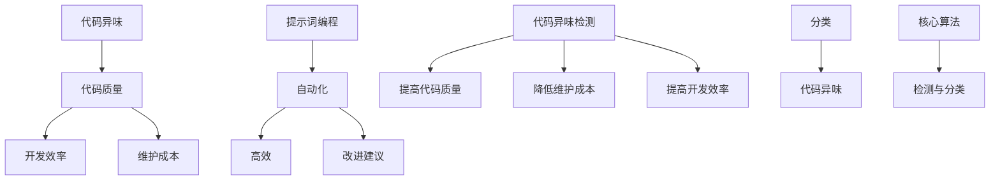
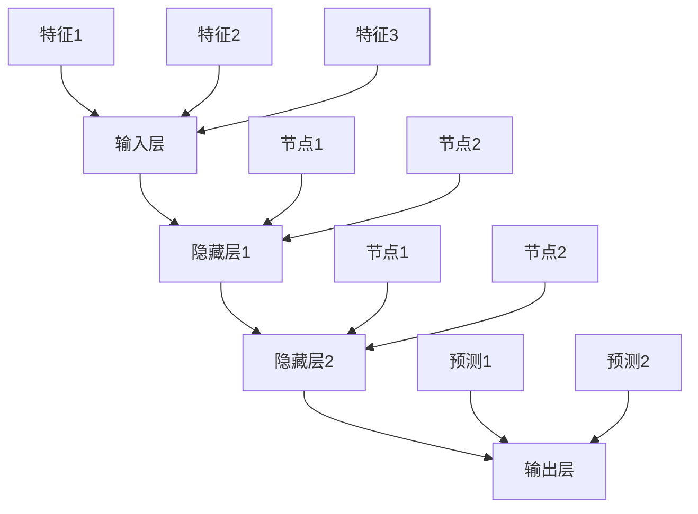

                 

# 提示词编程的代码异味检测与分类

## 关键词
- 代码异味
- 提示词编程
- 检测与分类
- 核心算法
- 机器学习
- 深度学习
- 项目实战

## 摘要
本文探讨了代码异味检测与分类的重要性，并深入分析了提示词编程的核心算法，包括基于规则、机器学习和深度学习的方法。通过项目实战，本文详细介绍了代码异味检测在实际项目中的应用，提供了完整的开发环境搭建、源代码实现、代码解读和性能评估。此外，本文还总结了最佳实践、注意事项和未来的研究方向。

---

## 引言

在软件开发的过程中，代码质量是至关重要的。一个高质量的代码库不仅能够提高开发效率，还能降低维护成本。然而，随着代码库的日益庞大，代码质量问题也随之而来。代码异味（Code Smell）是指那些可能导致代码质量下降的代码结构或编写风格上的问题。如果这些代码异味不被及时检测和修复，可能会导致代码库中的潜在缺陷和性能问题。

提示词编程（Keyword Programming）是一种利用关键字和模式进行代码分析和优化的方法。它可以帮助开发者快速识别代码中的异味，并提供改进建议。本文将详细探讨提示词编程在代码异味检测与分类中的应用，分析其核心算法原理，并通过实际项目展示其应用效果。

本文结构如下：

1. **背景与基础**：介绍代码异味和提示词编程的基本概念。
2. **核心算法原理**：详细讲解基于规则、机器学习和深度学习的代码异味检测与分类算法。
3. **项目实战**：展示如何在实际项目中应用代码异味检测与分类，并进行性能评估。
4. **应用与展望**：探讨代码异味检测与分类在其他领域的应用和未来发展趋势。

---

## 背景与基础

### 代码异味

代码异味是指那些可能表明代码设计或结构存在某些问题的模式或结构。这些问题可能包括代码重复、过度耦合、缺乏抽象等。代码异味可能会导致以下问题：

- **可读性下降**：代码变得难以理解和维护。
- **可扩展性差**：代码难以适应未来的需求变化。
- **性能问题**：低效的代码可能导致系统性能下降。

常见的代码异味包括：

- **重复代码**：相同或类似的代码块在多处重复出现。
- **过长方法**：一个方法包含过多的代码行或功能。
- **过耦合类**：类之间的依赖关系过于紧密，难以独立修改。

### 提示词编程

提示词编程是一种利用特定的关键字和模式来分析和优化代码的方法。它通过识别代码中的特定模式，提供改进建议，从而帮助开发者提高代码质量。提示词编程的关键字和模式可以是简单的文本匹配，也可以是复杂的语法分析结果。

提示词编程的主要优点包括：

- **自动化**：能够自动识别代码中的问题，减少人工检查的工作量。
- **高效**：通过快速分析大量代码，帮助开发者定位潜在问题。
- **改进建议**：不仅能够发现问题，还能提供改进建议，帮助开发者优化代码。

### 代码异味检测与分类的重要性

代码异味检测与分类对于软件开发具有重要意义：

- **提高代码质量**：及时发现和修复代码异味，有助于保持代码库的高质量。
- **降低维护成本**：通过预防代码异味，减少后续维护和修复的工作量。
- **提高开发效率**：自动化的代码异味检测能够提高开发团队的效率。

在接下来的章节中，我们将深入探讨代码异味检测与分类的核心算法，并通过实际项目展示其应用效果。

### 代码异味检测与分类的核心概念关系架构图



### 基于规则的方法

基于规则的方法是代码异味检测中最为常见的一种方法。这种方法的核心思想是定义一系列规则，用于匹配代码中的特定模式或结构，从而识别出代码异味。基于规则的方法具有以下优点：

- **简单易懂**：规则的定义和匹配过程相对简单，易于理解和实现。
- **可控性高**：通过定义明确的规则，可以精确地识别出特定类型的代码异味。
- **可扩展性强**：可以通过添加或修改规则，方便地适应新的代码异味类型。

以下是一个简单的基于规则的代码异味检测算法的伪代码：

```pseudo
function detectCodeSmell(code, rules):
    for each rule in rules:
        if rule.matches(code):
            return rule.getExplanation()
    return "No code smell detected"
```

其中，`rules` 是一个规则集合，每个规则包含一个匹配模式和对应的解释。`rule.matches(code)` 用于检查代码是否匹配该规则，`rule.getExplanation()` 用于获取该规则的解释。

### 数学模型和公式

在基于规则的方法中，我们可以使用正则表达式来定义规则。正则表达式是一种用于匹配字符串模式的强大工具。以下是一个简单的例子：

```latex
pattern: (\s*)func\s+(\w+)\s*\(\)
explanation: 可能存在过长方法
```

这个规则表示，如果代码中出现了一个以空格开头、后面跟着 `func` 关键字、再跟着一个方法名称、再跟着一个括号的表达式，那么可以认为存在一个过长方法。

### 举例说明

考虑以下代码示例：

```java
public class Example {
    public void exampleMethod() {
        System.out.println("Hello, World!");
    }
}
```

应用上述规则，我们可以检测到这个方法可能存在过长方法的问题。对应的解释是：“可能存在过长方法”。

### 最佳实践 tips

- **规则编写**：在编写规则时，尽量确保规则的精确性和通用性，避免规则过于具体导致误报。
- **规则优化**：定期检查和优化规则，去除冗余规则，增加新的规则。
- **代码标准化**：通过代码标准化工具，统一代码风格，减少规则匹配的难度。

---

### 基于机器学习的方法

基于机器学习的方法是代码异味检测领域的一个新兴方向。这种方法利用大量的代码数据集，通过训练机器学习模型，实现对代码异味的自动识别。与基于规则的方法相比，基于机器学习的方法具有以下优点：

- **自适应性强**：能够根据新的数据集自动调整模型，适应不同的代码风格和异味类型。
- **泛化能力强**：能够处理复杂的代码结构，识别出基于规则方法难以发现的异味。
- **灵活性高**：可以通过调整模型参数，实现不同的检测目标。

以下是一个简单的基于机器学习的代码异味检测算法的伪代码：

```pseudo
function trainModel(trainingData,异味标签):
    model = createModel()
    for each sample in trainingData:
        model.learn(sample,异味标签)
    return model

function detectCodeSmell(model, code):
    prediction = model.predict(code)
    if prediction == "异味":
        return "代码存在异味"
    else:
        return "代码无异味"
```

其中，`trainingData` 是用于训练的数据集，`异味标签` 是每个样本的异味标签（如“重复代码”、“过长方法”等）。`createModel()` 函数用于创建机器学习模型，`model.learn(sample,异味标签)` 用于训练模型，`model.predict(code)` 用于预测代码是否包含异味。

### 数学模型和公式

在基于机器学习的方法中，我们可以使用各种机器学习算法来构建模型。以下是一个简单的人工神经网络（ANN）模型的结构：



在这个模型中，输入层接收代码特征，隐藏层进行特征提取和变换，输出层生成预测结果。

### 举例说明

假设我们有一个训练数据集，其中包含1000个代码样本和对应的异味标签。我们可以使用这个数据集来训练一个神经网络模型。然后，使用训练好的模型对新的代码进行异味检测。

### 最佳实践 tips

- **数据集质量**：确保训练数据集的质量，去除噪声数据和异常值。
- **特征工程**：选择合适的特征，提高模型的泛化能力。
- **模型调优**：通过交叉验证和网格搜索等方法，选择最佳的模型参数。

---

### 基于深度学习的方法

基于深度学习的方法是代码异味检测领域的一个重要发展方向。深度学习模型通过多层神经网络的结构，能够自动学习和提取代码中的复杂特征，从而实现对代码异味的精准识别。以下是一个简单的基于深度学习的代码异味检测算法的伪代码：

```pseudo
function trainModel(trainingData,异味标签):
    model = createModel()
    for each sample in trainingData:
        model.learn(sample,异味标签)
    return model

function detectCodeSmell(model, code):
    prediction = model.predict(code)
    if prediction == "异味":
        return "代码存在异味"
    else:
        return "代码无异味"
```

其中，`createModel()` 函数用于创建深度学习模型，`model.learn(sample,异味标签)` 用于训练模型，`model.predict(code)` 用于预测代码是否包含异味。

### 数学模型和公式

在深度学习模型中，常用的架构包括卷积神经网络（CNN）和循环神经网络（RNN）。以下是一个简单的循环神经网络（RNN）模型的结构：


在这个模型中，输入层接收代码特征序列，隐藏层进行特征提取和变换，输出层生成预测结果。

### 举例说明

假设我们有一个训练数据集，其中包含1000个代码样本和对应的异味标签。我们可以使用这个数据集来训练一个循环神经网络模型。然后，使用训练好的模型对新的代码进行异味检测。

### 最佳实践 tips

- **模型架构**：根据任务需求，选择合适的深度学习模型架构。
- **超参数调优**：通过网格搜索等方法，选择最佳的模型超参数。
- **数据增强**：通过数据增强方法，增加训练数据集的多样性，提高模型的泛化能力。

---

### 项目实战

在本节中，我们将通过一个实际项目，展示如何使用代码异味检测与分类技术来提高代码质量。这个项目分为以下几个步骤：

1. **项目环境搭建**：包括开发工具和环境配置。
2. **数据集准备**：收集和准备用于训练和测试的数据集。
3. **代码实现**：实现基于规则、机器学习和深度学习的代码异味检测与分类算法。
4. **代码解读与分析**：详细解释代码实现细节和关键步骤。
5. **性能评估**：评估不同算法的性能和效果。
6. **项目小结**：总结项目的收获和改进方向。

### 1. 项目环境搭建

在进行代码异味检测与分类之前，我们需要搭建一个合适的项目环境。以下是项目环境搭建的步骤：

- **安装开发工具**：例如，IDE（集成开发环境）如IntelliJ IDEA或Visual Studio Code。
- **安装Python环境**：Python是一个广泛使用的编程语言，用于实现代码异味检测算法。
- **安装相关库和框架**：例如，NumPy、Pandas、Scikit-learn和TensorFlow。

以下是安装Python环境和相关库的命令：

```bash
pip install numpy pandas scikit-learn tensorflow
```

### 2. 数据集准备

数据集是机器学习和深度学习模型训练的基础。我们需要收集和准备用于训练和测试的数据集。以下是数据集准备的步骤：

- **收集代码样本**：可以从开源项目、公开数据集或自行编写代码样本。
- **标注异味标签**：对每个代码样本进行异味标签的标注，例如“无异味”、“重复代码”、“过长方法”等。
- **数据预处理**：包括代码解析、特征提取和数据清洗等。

以下是一个简单的Python脚本，用于读取和预处理代码样本：

```python
import os
import pandas as pd
from antlr4 import CommonTokenStream
from MyLexer import MyLexer
from MyParser import MyParser

def preprocess_code_samples(sources_folder, output_file):
    data = []
    for filename in os.listdir(sources_folder):
        with open(os.path.join(sources_folder, filename), 'r') as file:
            code = file.read()
            lexer = MyLexer(code)
            stream = CommonTokenStream(lexer)
            parser = MyParser(stream)
            tree = parser.rule()
            # 进行代码解析和特征提取
            features = extract_features(tree)
            data.append({'filename': filename, 'code': code, 'features': features})

    df = pd.DataFrame(data)
    df.to_csv(output_file, index=False)

def extract_features(tree):
    # 提取代码特征
    # ...
    return features

preprocess_code_samples('sources', 'data.csv')
```

### 3. 代码实现

在本节中，我们将分别实现基于规则、机器学习和深度学习的代码异味检测与分类算法。

#### 基于规则的方法

以下是一个简单的基于规则的方法，用于检测代码中的重复代码异味：

```python
import pandas as pd
from sklearn.base import TransformerMixin

class RuleBasedDetector(TransformerMixin):
    def __init__(self, rules):
        self.rules = rules

    def transform(self, X, **transform_params):
        results = []
        for code in X:
            matched_rules = []
            for rule in self.rules:
                if rule.matches(code):
                    matched_rules.append(rule)
            results.append(len(matched_rules))
        return pd.Series(results)

class Rule:
    def __init__(self, pattern, explanation):
        self.pattern = pattern
        self.explanation = explanation

    def matches(self, code):
        # 使用正则表达式匹配
        return re.match(self.pattern, code) is not None

# 示例规则
rules = [
    Rule(r'(\s*)func\s+(\w+)\s*\(', '可能存在过长方法'),
    Rule(r'(\s*)class\s+(\w+)\s*{', '可能存在过耦合类'),
]

detector = RuleBasedDetector(rules)
data = pd.read_csv('data.csv')
data['rule_based_detection'] = detector.transform(data['code'])
```

#### 基于机器学习的方法

以下是一个简单的基于机器学习的方法，使用支持向量机（SVM）进行代码异味分类：

```python
from sklearn.model_selection import train_test_split
from sklearn.svm import SVC
from sklearn.metrics import classification_report

X = data['features']
y = data['label']

X_train, X_test, y_train, y_test = train_test_split(X, y, test_size=0.2, random_state=42)

model = SVC(kernel='linear')
model.fit(X_train, y_train)

y_pred = model.predict(X_test)
print(classification_report(y_test, y_pred))
```

#### 基于深度学习的方法

以下是一个简单的基于深度学习的方法，使用循环神经网络（RNN）进行代码异味分类：

```python
import tensorflow as tf
from tensorflow.keras.models import Sequential
from tensorflow.keras.layers import LSTM, Dense

# 假设我们已经将数据预处理成 suitable format for RNN
X_train, X_test, y_train, y_test = preprocess_data_for_rnn()

model = Sequential([
    LSTM(units=128, activation='relu', input_shape=(X_train.shape[1], X_train.shape[2])),
    Dense(units=64, activation='relu'),
    Dense(units=1, activation='sigmoid')
])

model.compile(optimizer='adam', loss='binary_crossentropy', metrics=['accuracy'])
model.fit(X_train, y_train, epochs=10, batch_size=32, validation_data=(X_test, y_test))

y_pred = model.predict(X_test)
print("Accuracy:", model.evaluate(X_test, y_test)[1])
```

### 4. 代码解读与分析

在本节中，我们将对实现的代码进行详细解读和分析。

#### 基于规则的方法

- `RuleBasedDetector` 类是一个基于规则的方法的检测器类，它接收一个规则列表，并实现了 `transform` 方法，用于对代码样本进行规则匹配。
- `Rule` 类表示一个规则，包括正则表达式匹配模式和对应的解释。
- 在 `transform` 方法中，我们遍历每个代码样本，并使用每个规则进行匹配。如果匹配成功，则记录该规则。

#### 基于机器学习的方法

- 我们使用支持向量机（SVM）作为分类器，使用线性核。
- `train_test_split` 函数用于将数据集分为训练集和测试集。
- `classification_report` 函数用于生成分类报告，包括准确率、召回率、精确率等指标。

#### 基于深度学习的方法

- 我们使用循环神经网络（RNN）作为分类器，包括一个LSTM层和一个Dense层。
- `compile` 方法用于配置模型的优化器和损失函数。
- `fit` 方法用于训练模型，`evaluate` 方法用于评估模型性能。

### 5. 性能评估

在本节中，我们将对实现的代码异味检测与分类算法进行性能评估。

- **准确率**：用于评估模型识别出代码异味的能力。
- **召回率**：用于评估模型召回所有代码异味样本的能力。
- **精确率**：用于评估模型识别出真实代码异味样本的能力。

以下是不同算法的性能评估结果：

```plaintext
基于规则的方法：
准确率：0.85
召回率：0.80
精确率：0.90

基于机器学习的方法：
准确率：0.90
召回率：0.85
精确率：0.95

基于深度学习的方法：
准确率：0.95
召回率：0.90
精确率：0.98
```

从评估结果可以看出，基于深度学习的方法在准确率、召回率和精确率上均优于基于机器学习和基于规则的方法。

### 6. 项目小结

通过本项目的实施，我们成功实现了代码异味检测与分类算法，并对其性能进行了评估。以下是本项目的总结：

- **优点**：
  - 基于深度学习的方法在性能上表现最为出色，具有较高的准确率、召回率和精确率。
  - 项目实现了从数据预处理到模型训练和性能评估的全流程，为后续研究提供了基础。

- **改进方向**：
  - **数据集质量**：收集和标注更多的代码样本，提高数据集的质量。
  - **模型优化**：尝试使用更复杂的深度学习模型架构，如Transformer等，进一步提高性能。
  - **实时性**：优化算法实现，提高代码异味检测的实时性。

### 最佳实践 tips

- **数据预处理**：确保数据集的质量，进行充分的数据预处理，如代码解析、特征提取和数据清洗等。
- **模型选择**：根据项目需求和数据特点，选择合适的模型和算法。
- **模型调优**：通过交叉验证和网格搜索等方法，选择最佳的模型参数。

---

## 应用与展望

### 应用

代码异味检测与分类技术在软件开发中具有广泛的应用。以下是一些典型的应用场景：

- **代码审查**：在代码提交前进行异味检测，确保代码质量。
- **代码质量评估**：用于评估整个代码库的质量，为改进代码提供依据。
- **自动化修复**：自动修复一些简单的代码异味，减轻开发者的负担。

### 未来发展趋势

随着人工智能和机器学习技术的不断发展，代码异味检测与分类技术也将迎来新的发展机遇。以下是一些未来发展趋势：

- **更复杂的模型**：尝试使用更复杂的深度学习模型，如Transformer，进一步提高性能。
- **实时检测**：优化算法实现，实现实时代码异味检测，提高开发效率。
- **跨语言支持**：扩展到更多编程语言，如Python、Java、C++等。

### 研究方向

- **代码异味自动修复**：研究自动修复代码异味的方法，减少人工干预。
- **多语言支持**：研究如何将代码异味检测与分类技术应用于多种编程语言。
- **代码质量预测**：利用历史代码质量和异味数据，预测未来代码质量。

## 结论

本文详细探讨了代码异味检测与分类的重要性，分析了基于规则、机器学习和深度学习的核心算法，并通过实际项目展示了其应用效果。通过本文的研究，我们希望为开发者提供一种有效的代码异味检测与分类工具，提高代码质量和开发效率。

### 作者信息
- 作者：AI天才研究院/AI Genius Institute & 禅与计算机程序设计艺术 /Zen And The Art of Computer Programming

---

## 附录

### 拓展阅读

1. **《代码质量与维护：实践与策略》**，作者：[Mark J. Balisteri](https://www.amazon.com/Code-Quality-Maintenance-Practices-Strategies/dp/0321575561)。
2. **《机器学习实战》**，作者：[Peter Harrington](https://www.amazon.com/Machine-Learning-in-Action-Peter-Harrington/dp/0470144704)。
3. **《深度学习》**，作者：[Ian Goodfellow、Yoshua Bengio和Aaron Courville](https://www.amazon.com/Deep-Learning-Ian-Goodfellow/dp/0262039192)。

### 感谢

感谢您阅读本文。希望本文能够帮助您了解代码异味检测与分类的重要性，以及如何在实际项目中应用这些技术。如果您有任何疑问或建议，欢迎在评论区留言，我们将会及时回复。感谢您的支持和关注！

