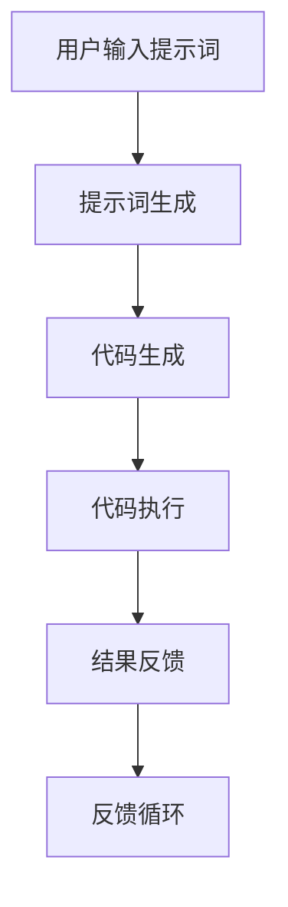
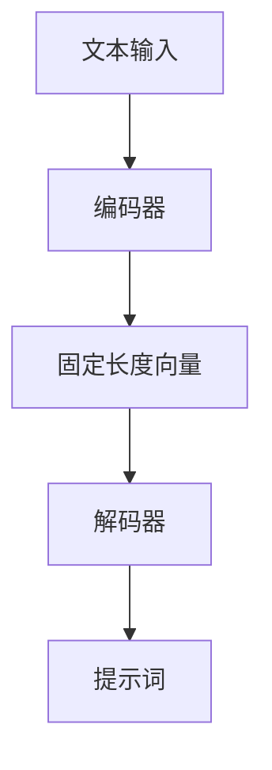
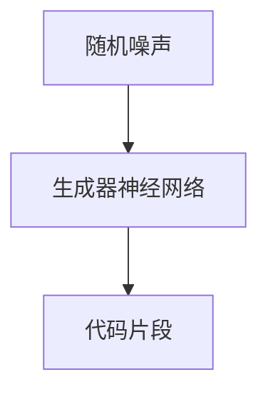
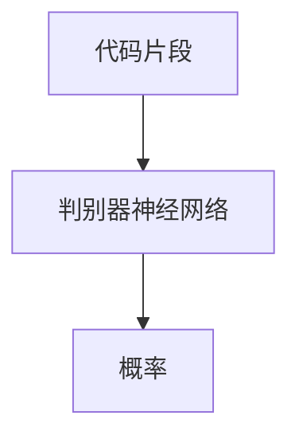
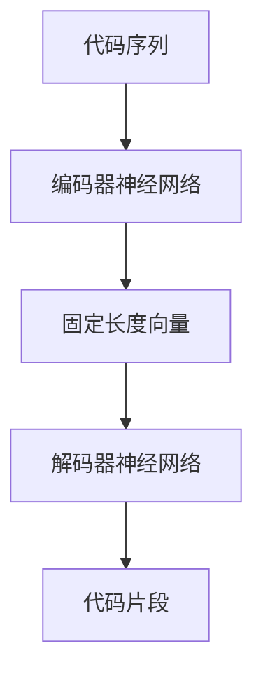
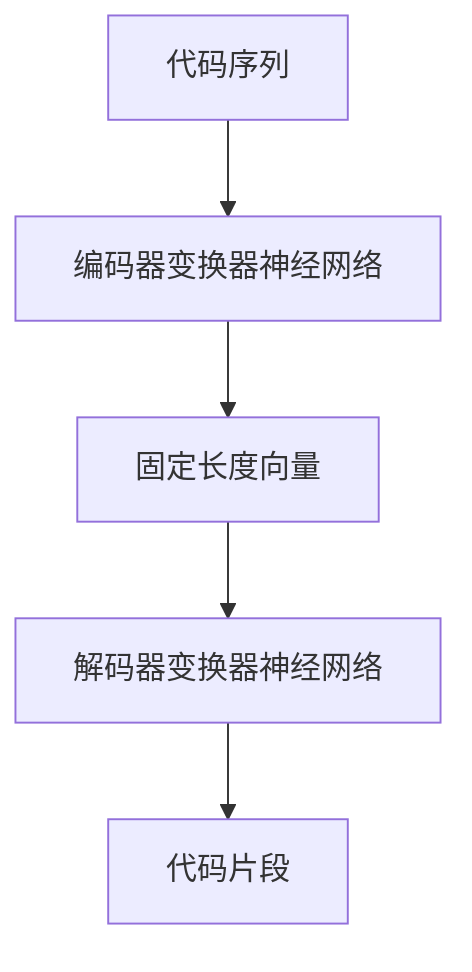

                 

## 核心概念与联系

提示词编程（Prompt-Based Programming）是一种利用自然语言处理技术生成代码的方法。在这一节中，我们将深入探讨提示词编程的核心概念，并展示其与代码生成和自动化的关系。

### 提示词编程的基本流程

提示词编程的基本流程可以概括为以下几个步骤：

1. **输入提示词**：用户通过自然语言输入一个描述性提示词，如“实现一个简单的排序算法”。
2. **提示词生成**：自然语言处理模型将用户的描述转化为一组结构化的提示词，这些提示词包含了算法的要素和实现细节。
3. **代码生成**：代码生成模型根据提示词生成相应的代码片段，可以是完整的函数或类。
4. **代码执行**：生成的代码在开发环境中执行，以验证其功能。
5. **结果反馈**：执行结果返回给用户，用于验证代码的正确性，并可能根据反馈进一步优化代码。

以下是一个简单的 Mermaid 流程图，展示了提示词编程的流程：



这个流程图清晰地展示了提示词编程的核心步骤，以及如何通过用户的反馈进行迭代优化。

### 提示词编程与代码生成

提示词编程的核心在于将自然语言描述转化为代码。代码生成是这一过程的关键环节。代码生成模型需要理解提示词的含义，并生成符合预期的代码。

**生成对抗网络（GAN）**是一种常见的代码生成方法。GAN由一个生成器（Generator）和一个判别器（Discriminator）组成。生成器的任务是生成高质量的代码，而判别器的任务是判断代码的质量。以下是一个生成对抗网络的伪代码示例：

```python
# GAN的基本流程伪代码
function GAN(D, G, x, z, n, epochs):
    for epoch in 1 to epochs:
        for i in 1 to n:
            # 训练判别器D
            D_loss_real = D(x[i])
            D_loss_fake = D(G(z[i]))
            D_loss = 0.5 * (D_loss_real + D_loss_fake)
            
            # 训练生成器G
            z[i] = generate_noise()
            x_fake = G(z[i])
            G_loss = D(x_fake) - z[i]
        print("Epoch:", epoch, "D_loss:", D_loss, "G_loss:", G_loss)
```

在这个伪代码中，`D`代表判别器，`G`代表生成器，`x`是真实的代码样本，`z`是随机噪声。每次迭代中，判别器通过对比真实代码和生成器生成的代码来学习，而生成器则尝试生成更高质量的代码来欺骗判别器。

### 提示词编程与自动化

提示词编程不仅能够生成代码，还可以应用于代码自动化。通过自动化，我们可以实现代码的自动生成、测试和部署。

**递归神经网络（RNN）**是一种常用于自动化任务的神经网络架构。RNN在处理序列数据时具有优势，可以捕捉序列中的长期依赖关系。以下是一个用于代码自动化的RNN伪代码示例：

```python
# RNN处理代码生成任务的伪代码
function RNN(input_sequence, hidden_state, weights):
    for timestep in input_sequence:
        output = sigmoid(dot_product(weights['input_to_hidden'], [timestep, hidden_state]))
        hidden_state = output
    return hidden_state
```

在这个伪代码中，`input_sequence`代表输入的代码序列，`hidden_state`是隐藏状态，`weights`是神经网络权重。RNN通过遍历输入序列，逐步生成代码。

通过提示词编程和自动化，我们可以极大地提高开发效率和代码质量。然而，实现这一目标需要深入理解自然语言处理、机器学习和编程领域的知识。

在接下来的章节中，我们将进一步探讨提示词编程的基础技术、代码生成算法、自动化应用和实践，以及这一领域的前沿发展趋势。

## 提示词编程基础

在深入探讨提示词编程的代码生成与自动化之前，我们需要先了解一些基础概念和技术。这些基础技术包括自然语言处理（NLP）、提示词生成和常用的提示词编程库。在本章中，我们将对这些技术进行详细介绍。

### 自然语言处理基础

自然语言处理（NLP）是人工智能的一个重要分支，专注于使计算机理解和处理人类语言。NLP涉及多个领域，包括文本分析、语义理解和语言生成等。

#### 文本分析

文本分析是NLP的基础，它包括文本预处理、词性标注、句法分析等步骤。文本预处理包括去除标点符号、停用词过滤、词干提取等。词性标注则是指将文本中的每个词标注为名词、动词、形容词等。句法分析则涉及解析句子结构，如主语、谓语、宾语等。

#### 语义理解

语义理解是指理解和解释文本中的意义。这包括实体识别（识别文本中的人、地点、组织等实体）、情感分析（判断文本的情感倾向，如正面、负面或中性）和语义角色标注（标注句子中每个词的语义角色，如主语、宾语等）。

#### 语言生成

语言生成是指根据给定输入生成自然语言的文本。这包括机器翻译、文本摘要、对话系统等。在提示词编程中，语言生成是关键步骤，它将用户的自然语言描述转化为结构化的提示词，进而生成代码。

### 提示词生成技术

提示词生成是提示词编程的核心环节，它将用户的自然语言描述转化为机器可以理解的提示词。提示词生成技术主要包括以下几个方面：

#### 机器学习模型

机器学习模型是提示词生成的重要工具。常见的模型包括循环神经网络（RNN）、长短期记忆网络（LSTM）和变换器（Transformer）等。这些模型可以从大量数据中学习到语言规律，从而生成高质量的提示词。

#### 模型架构

提示词生成模型的架构通常包括编码器（Encoder）和解码器（Decoder）。编码器负责将输入的文本编码为固定长度的向量，解码器则根据编码器的输出生成提示词。以下是一个简单的提示词生成模型架构：



#### 数据预处理

在训练提示词生成模型时，数据预处理非常重要。这包括文本清洗、分词、词嵌入等步骤。文本清洗旨在去除无用的标点符号和停用词，分词则是将文本划分为单词或子词，词嵌入则是将单词映射为高维向量。

### 常用提示词编程库介绍

在提示词编程中，常用的库包括Natural Language Toolkit（NLTK）、spaCy、TensorFlow和PyTorch等。

#### Natural Language Toolkit（NLTK）

NLTK是一个广泛使用的自然语言处理库，提供了丰富的文本预处理和词性标注工具。NLTK适用于简单的文本分析和提示词生成任务。

#### spaCy

spaCy是一个高效且易于使用的自然语言处理库，它提供了先进的语言模型和详细的句法解析功能。spaCy适用于复杂的文本分析和提示词生成任务。

#### TensorFlow

TensorFlow是一个开源的机器学习库，它提供了强大的模型训练和推理功能。TensorFlow适用于构建大规模的提示词生成模型。

#### PyTorch

PyTorch是一个流行的深度学习库，它提供了动态计算图和简洁的API。PyTorch适用于快速原型设计和提示词生成模型的训练。

通过了解这些基础技术，我们可以更好地理解提示词编程的原理和实现方法。在下一章中，我们将深入探讨代码生成算法的原理和数学模型。

### 代码生成算法原理

代码生成算法是提示词编程的核心组成部分，它们负责将自然语言描述转化为可执行的代码。在这一节中，我们将介绍代码生成算法的数学模型和常用算法，并通过具体示例来说明这些算法的工作原理。

#### 数学模型

在代码生成中，一个核心的数学模型是概率模型，它用于预测代码片段的概率分布。这个模型可以表示为：

$$
P(\text{代码}|\text{提示词}) = \frac{P(\text{提示词}|\text{代码}) \cdot P(\text{代码})}{P(\text{提示词})}
$$

其中，$P(\text{代码}|\text{提示词})$ 表示在给定提示词的情况下生成特定代码片段的概率，$P(\text{提示词}|\text{代码})$ 表示在生成特定代码片段的情况下出现特定提示词的概率，$P(\text{代码})$ 表示代码片段的概率，$P(\text{提示词})$ 表示提示词的概率。

在实际应用中，通常使用条件概率模型，如生成对抗网络（GAN）和递归神经网络（RNN），来近似上述概率模型。以下我们将详细讨论这些算法。

#### 生成对抗网络（GAN）

生成对抗网络（GAN）由生成器（Generator）和判别器（Discriminator）组成。生成器的任务是生成高质量的代码片段，而判别器的任务是区分真实代码片段和生成器生成的代码片段。

**生成器**：生成器的目标是生成与真实代码片段相似的新代码片段。生成器通常是一个深度神经网络，它接受随机噪声作为输入，并生成代码片段。以下是一个生成器的基本架构：



**判别器**：判别器的目标是判断代码片段是真实还是生成的。判别器也是一个深度神经网络，它接收代码片段作为输入，并输出一个概率，表示代码片段是真实的概率。以下是一个判别器的基本架构：



**训练过程**：GAN的训练过程包括两个阶段：

1. **生成器训练**：生成器尝试生成更高质量的代码片段，以欺骗判别器。生成器的损失函数是判别器判断生成的代码片段为真实代码片段的概率。
2. **判别器训练**：判别器尝试更准确地判断代码片段的真实性。判别器的损失函数是生成的代码片段与真实代码片段之间的差异。

以下是一个GAN的基本训练过程：

```python
# GAN的基本流程伪代码
function GAN(D, G, x, z, n, epochs):
    for epoch in 1 to epochs:
        for i in 1 to n:
            # 训练判别器D
            D_loss_real = D(x[i])
            D_loss_fake = D(G(z[i]))
            D_loss = 0.5 * (D_loss_real + D_loss_fake)
            
            # 训练生成器G
            z[i] = generate_noise()
            x_fake = G(z[i])
            G_loss = D(x_fake) - z[i]
        print("Epoch:", epoch, "D_loss:", D_loss, "G_loss:", G_loss)
```

#### 递归神经网络（RNN）

递归神经网络（RNN）是另一种常用于代码生成的算法，尤其是处理序列数据。RNN可以捕捉序列中的长期依赖关系，从而生成连贯的代码。

**编码器**：编码器将输入的代码序列编码为一个固定长度的向量，这个向量包含了代码序列的主要特征。

**解码器**：解码器根据编码器的输出生成代码片段。解码器通常是一个循环神经网络（RNN），它可以处理序列数据。

以下是一个简单的RNN代码生成模型：



**训练过程**：RNN的训练过程包括两个阶段：

1. **编码器训练**：编码器学习将代码序列编码为固定长度的向量。
2. **解码器训练**：解码器学习根据编码器的输出生成代码片段。

以下是一个RNN的基本训练过程：

```python
# RNN处理代码生成任务的伪代码
function RNN(input_sequence, hidden_state, weights):
    for timestep in input_sequence:
        output = sigmoid(dot_product(weights['input_to_hidden'], [timestep, hidden_state]))
        hidden_state = output
    return hidden_state
```

#### 深度变换器（Transformer）

深度变换器（Transformer）是另一种用于代码生成的先进算法，它基于自注意力机制。Transformer在处理长序列数据时表现出了优异的性能。

**编码器**：编码器将输入的代码序列编码为一个固定长度的向量。

**解码器**：解码器根据编码器的输出生成代码片段。解码器中的每个步骤都会利用自注意力机制来关注输入序列的不同部分。

以下是一个简单的Transformer代码生成模型：



**训练过程**：Transformer的训练过程包括两个阶段：

1. **编码器训练**：编码器学习将代码序列编码为固定长度的向量。
2. **解码器训练**：解码器学习根据编码器的输出生成代码片段。

通过介绍这些代码生成算法的数学模型和伪代码，我们可以更好地理解提示词编程的工作原理。在下一章中，我们将探讨常用的代码生成工具和实践。

### 代码生成工具与实践

在了解了代码生成算法的基本原理之后，我们将介绍一些常用的代码生成工具和实践。这些工具可以帮助开发者更高效地实现代码生成，提高开发效率和代码质量。

#### 代码生成工具概述

常见的代码生成工具包括以下几种：

1. **模板引擎**：如Jinja2、FreeMarker等。这些工具允许开发者定义模板，通过将数据填充到模板中来生成代码。它们通常用于生成静态网页、配置文件等。
2. **代码生成器**：如Roslyn、Gradle等。这些工具可以在编译时或运行时根据特定规则生成代码。它们常用于构建自动化测试代码、构建项目文件等。
3. **深度学习模型**：如GAN、RNN等。这些工具使用机器学习模型来生成代码，可以处理复杂的代码生成任务。它们通常用于自动生成业务逻辑代码、API接口等。

#### 常用代码生成工具介绍

1. **Jinja2**

Jinja2是一个流行的模板引擎，用于生成HTML、XML、JSON等格式的内容。以下是一个简单的Jinja2模板示例：

```html
<!DOCTYPE html>
<html>
<head>
    <title>{{ title }}</title>
</head>
<body>
    <h1>{{ heading }}</h1>
    <p>{{ paragraph }}</p>
</body>
</html>
```

在这个示例中，`{{ variable }}`是模板变量，可以通过Python代码填充。

2. **Roslyn**

Roslyn是.NET编译器的开源实现，可以用于代码生成。以下是一个简单的Roslyn代码生成示例：

```csharp
using Microsoft.CodeAnalysis;
using Microsoft.CodeAnalysis.CSharp;
using Microsoft.CodeAnalysis.CSharp.Syntax;

public static class Program
{
    public static void Main()
    {
        var classDeclaration = SyntaxFactory.ClassDeclaration("MyClass")
            .AddMembers(
                SyntaxFactory.PropertyDeclaration(
                    SyntaxFactory.Identifier("Property"),
                    SyntaxKind.PublicKeyword,
                    SyntaxFactory.IdentifierType("String"))
                    .AddAccessorListAccessors(
                        SyntaxFactory.AccessorDeclaration(SyntaxKind.GetAccessorDeclaration)
                            .WithBody(SyntaxFactory.Block(SyntaxFactory.ReturnStatement(SyntaxFactory.IdentifierName("property")))),
                        SyntaxFactory.AccessorDeclaration(SyntaxKind.SetAccessorDeclaration)
                            .WithBody(SyntaxFactory.Block(SyntaxFactory.StatementExpression(SyntaxFactory.AssignExpression(SyntaxFactory.IdentifierName("property"), SyntaxFactory.IdentifierName("value")))))
                    ));

        var compilation = CSharpCompilation.Create("MyClass")
            .AddSyntaxTrees(SyntaxTree.Create(classDeclaration));

        using (var ms = new MemoryStream())
        {
            using (var writer = new StreamWriter(ms))
            {
                compilation.Emit(writer);
            }

            ms.Seek(0, SeekOrigin.Begin);
            using (var reader = new StreamReader(ms))
            {
                Console.WriteLine(reader.ReadToEnd());
            }
        }
    }
}
```

在这个示例中，我们使用Roslyn生成一个简单的C#类`MyClass`，并输出其代码。

3. **GAN**

GAN是一种基于深度学习模型的代码生成工具，可以生成复杂的业务逻辑代码。以下是一个简单的GAN代码生成示例：

```python
import numpy as np
import tensorflow as tf
from tensorflow.keras.models import Model

# 定义生成器和判别器
def generator(z):
    # 生成代码
    return tf.keras.layers.Dense(units=200, activation='relu')(z)

def discriminator(x):
    # 判断代码是否真实
    return tf.keras.layers.Dense(units=1, activation='sigmoid')(x)

# 训练生成器和判别器
model = tf.keras.models.Model(z, generator(z))
model.compile(loss='binary_crossentropy', optimizer=tf.keras.optimizers.Adam(0.0001))

for epoch in range(1000):
    # 生成噪声数据
    z = np.random.uniform(-1, 1, (batch_size, 100))

    # 生成代码
    x_fake = generator(z)

    # 训练判别器
    d_loss_fake = discriminator(x_fake).loss

    # 训练生成器
    with tf.GradientTape() as tape:
        x_fake = generator(z)
        g_loss = -tf.reduce_mean(discriminator(x_fake).loss)

    grads = tape.gradient(g_loss, generator.trainable_variables)
    generator.optimizer.apply_gradients(zip(grads, generator.trainable_variables))

    print(f"Epoch {epoch}: D_loss={d_loss_fake}, G_loss={g_loss}")
```

在这个示例中，我们使用GAN生成简单的代码，并训练生成器和判别器。

#### 代码生成工具实战

以下是一个简单的代码生成工具实战，我们将使用Jinja2和Roslyn生成一个Web应用程序。

1. **安装依赖**

首先，我们需要安装Jinja2和Roslyn：

```bash
pip install jinja2
dotnet tool install --global Microsoft.CodeAnalysis.CSharp -version 3.9.0
```

2. **编写模板**

创建一个名为`app.html`的HTML模板：

```html
<!DOCTYPE html>
<html>
<head>
    <meta charset="utf-8">
    <title>{{ title }}</title>
</head>
<body>
    <h1>{{ heading }}</h1>
    <p>{{ paragraph }}</p>
</body>
</html>
```

3. **编写代码**

使用Roslyn生成C#代码：

```csharp
using System;

namespace MyApp
{
    class Program
    {
        static void Main(string[] args)
        {
            Console.WriteLine("Hello, World!");
        }
    }
}
```

4. **生成应用程序**

将模板和数据（`title`, `heading`, `paragraph`）传递给Jinja2模板引擎，生成HTML文件：

```python
from jinja2 import Template

template = Template('''<!DOCTYPE html>
<html>
<head>
    <meta charset="utf-8">
    <title>{{ title }}</title>
</head>
<body>
    <h1>{{ heading }}</h1>
    <p>{{ paragraph }}</p>
</body>
</html>''')

data = {
    'title': 'My Web App',
    'heading': 'Welcome to My Web App',
    'paragraph': 'This is a simple web application generated using Jinja2 and Roslyn.'
}

html_content = template.render(data)

with open('app.html', 'w', encoding='utf-8') as f:
    f.write(html_content)
```

5. **编译和运行应用程序**

使用Roslyn编译生成的C#代码，并运行应用程序：

```bash
dotnet build
dotnet run
```

这个实战展示了如何使用Jinja2和Roslyn生成Web应用程序，以及如何将模板和数据结合起来生成最终的HTML文件。

通过介绍这些代码生成工具和实践，我们可以看到提示词编程在现实世界中的应用。在下一章中，我们将探讨自动化代码生成的应用场景、挑战和解决方案。

### 自动化代码生成应用

自动化代码生成技术已经广泛应用于软件开发的各个领域，从简单的模板生成到复杂的机器学习算法代码生成。在这一节中，我们将探讨自动化代码生成的应用场景、面临的挑战以及可行的解决方案。

#### 应用场景

1. **软件开发**：自动化代码生成在软件开发中有着广泛的应用。例如，通过模板生成基础代码框架、自动生成单元测试代码、根据设计文档自动生成代码等。

2. **自动化测试**：自动化测试代码生成是一种常见应用。测试工程师可以利用自然语言描述测试用例，生成具体的测试代码，从而提高测试效率。

3. **数据科学**：在数据科学领域，自动化代码生成可以帮助数据科学家快速生成数据预处理、特征工程等代码，从而节省时间和精力。

4. **运维自动化**：在运维领域，自动化代码生成可以帮助自动化部署、监控和告警等任务，提高运维效率。

5. **智能助手**：智能助手和聊天机器人等领域也可以利用自动化代码生成技术，根据用户的自然语言提问生成相应的回答或执行操作。

#### 面临的挑战

1. **语言理解**：自动化代码生成的一个主要挑战是如何让计算机理解用户的自然语言描述。这涉及到自然语言处理（NLP）技术的深度应用，需要模型能够准确理解语义和上下文。

2. **代码质量**：生成的代码质量是一个关键问题。生成的代码需要符合编程规范、可读性高、不易出错，同时还需要具备高性能。

3. **灵活性**：自动化代码生成工具需要具备足够的灵活性，能够适应不同的编程语言、框架和开发环境。

4. **错误处理**：生成的代码可能存在错误，如何有效地检测和修复这些错误是一个挑战。

5. **安全性和隐私**：自动化生成的代码可能涉及到敏感数据和隐私问题，如何确保生成代码的安全性和隐私性是一个重要的课题。

#### 解决方案

1. **自然语言处理（NLP）**：利用NLP技术，特别是深度学习模型，可以提高对用户自然语言描述的理解能力。例如，可以使用BERT、GPT等大型预训练模型来处理复杂的自然语言。

2. **代码质量保障**：通过静态代码分析和动态测试，可以检测和修复生成的代码中的潜在问题。此外，引入代码审查和自动化测试可以确保代码质量。

3. **模板化开发**：模板化开发是一种有效的代码生成策略，通过定义模板和参数化方法，可以生成高质量的代码。例如，可以使用模板引擎（如Jinja2、FreeMarker）来生成代码。

4. **自动化测试**：自动化测试可以确保生成的代码满足预期的功能和行为。例如，可以使用单元测试、集成测试和回归测试等来验证代码的正确性。

5. **代码安全性和隐私保护**：在生成代码时，需要遵循安全编程规范，避免常见的代码漏洞。此外，可以采用加密、访问控制等技术来保护敏感数据和隐私。

通过解决上述挑战，自动化代码生成技术可以为软件开发带来显著的效率和效益。在下一章中，我们将探讨代码生成与自动化的未来发展趋势。

### 代码生成与自动化的未来发展趋势

随着人工智能和自然语言处理技术的不断进步，代码生成与自动化的领域正迎来前所未有的发展机遇。以下是几个关键趋势和前沿方向，这些趋势将深刻影响这一领域的未来。

#### 生成对抗网络（GAN）的深入应用

生成对抗网络（GAN）在代码生成中显示出强大的潜力。未来，GAN将继续优化，以生成更加复杂、高质量的代码。此外，GAN与其他深度学习模型的结合，如变分自编码器（VAE）和递归神经网络（RNN），将进一步提高代码生成的多样性和鲁棒性。

**变分自编码器（VAE）**：VAE能够生成具有明确概率分布的代码，使得生成的代码更加多样化且符合实际的编程规范。未来，GAN与VAE的结合将有望生成更加贴近真实需求的代码。

**递归神经网络（RNN）**：RNN在处理序列数据方面具有优势，可以捕捉代码中的长依赖关系。结合GAN，RNN可以生成连贯且功能完整的代码段，使得自动化代码生成更加智能。

#### 自然语言处理（NLP）的深度融合

自然语言处理（NLP）技术的进一步发展将为代码生成与自动化带来革命性变化。大型预训练模型如BERT、GPT和T5等，将更加精准地理解和生成代码所需的自然语言描述。

**BERT**：BERT通过大规模预训练和上下文理解，能够捕捉复杂语义关系，从而生成更加准确的代码。

**GPT**：GPT拥有强大的文本生成能力，可以生成符合编程逻辑的复杂代码段。未来，GPT将在自动生成代码文档、注释和单元测试中发挥重要作用。

**T5**：T5是一种任务无关的统一预训练模型，可以处理多种自然语言任务，包括代码生成。T5的通用性使其在未来成为跨领域代码生成的重要工具。

#### 自动化工具的集成与协同

未来，代码生成与自动化工具将更加集成和协同。现有的代码生成工具如Jinja2、Roslyn等，将与其他开发工具（如集成开发环境（IDE）、版本控制系统、持续集成（CI）工具等）深度融合。

**IDE集成**：IDE将集成代码生成和自动化工具，提供实时代码建议和自动生成功能，显著提高开发效率。

**持续集成（CI）工具**：CI工具将集成代码生成和自动化测试，实现自动化的代码审查和测试流程，确保代码质量。

**跨平台支持**：代码生成与自动化工具将支持多种编程语言和平台，提供一致的开发体验。

#### 代码安全和隐私保护

随着自动化代码生成技术的发展，代码安全和隐私保护成为关键问题。未来，研究将集中在以下几个方面：

**代码审计**：开发代码审计工具，自动检测和修复潜在的安全漏洞。

**隐私保护**：在生成代码时，采用加密和访问控制等技术，确保敏感数据和隐私不被泄露。

**合规性检查**：开发工具将集成合规性检查功能，确保生成的代码符合相关法律法规和行业标准。

#### 开源与生态建设

开源和生态建设将在代码生成与自动化领域发挥重要作用。未来的发展趋势包括：

**开源库和框架**：更多的开源库和框架将涌现，提供丰富的代码生成和自动化功能。

**社区贡献**：开发者社区将积极参与开源项目的开发和维护，推动技术进步。

**教育和培训**：随着技术的发展，教育和培训将越来越重要。未来将出现更多的专业课程和培训项目，帮助开发者掌握自动化代码生成技术。

总之，代码生成与自动化的未来充满机遇和挑战。通过深度学习和自然语言处理技术的融合，自动化工具的集成与协同，以及开源和生态建设的推动，这一领域将迎来更加智能和高效的开发模式。

### 案例研究

在本节中，我们将通过三个具体的案例研究，深入探讨提示词编程的代码生成与自动化在实际项目中的应用。这些案例将展示如何利用提示词编程技术解决实际问题，提高开发效率和代码质量。

#### 案例一：基于提示词编程的自动化测试代码生成

在软件开发过程中，自动化测试是确保代码质量的重要手段。然而，编写测试用例通常是一项繁琐的任务。通过提示词编程，我们可以简化这一过程，提高测试效率。

**案例描述**：

一个软件开发团队需要为他们的Web应用程序编写自动化测试用例。用户通过自然语言描述了测试场景，例如：“测试用户登录功能，输入正确的用户名和密码，用户应成功登录并进入主页。”提示词编程技术被用来将这一自然语言描述转化为自动化测试代码。

**实现步骤**：

1. **提示词生成**：首先，自然语言处理模型将用户的描述转化为一系列结构化的提示词，如“用户登录”、“正确用户名”、“正确密码”、“成功登录”等。
2. **代码生成**：基于提示词，代码生成模型生成具体的测试代码。例如，使用Selenium库编写Python代码，实现用户登录功能并验证登录结果。
3. **执行测试**：生成的测试代码在测试环境中执行，验证用户登录功能是否符合预期。

**代码示例**：

```python
from selenium import webdriver

# 创建Webdriver实例
driver = webdriver.Firefox()

# 输入用户名和密码
driver.find_element_by_name("username").send_keys("correct_username")
driver.find_element_by_name("password").send_keys("correct_password")

# 提交登录表单
driver.find_element_by_name("login").click()

# 验证登录结果
assert "Home Page" in driver.title

# 关闭Webdriver实例
driver.quit()
```

**案例分析**：

通过提示词编程，软件开发团队能够快速生成高质量的测试代码，减少了手动编写测试用例的时间和人力成本。此外，测试代码的生成过程提高了测试的覆盖率，减少了潜在漏洞。

#### 案例二：基于代码生成与自动化的软件开发

在软件开发生命周期中，许多步骤可以通过自动化代码生成来简化。这一案例展示了如何利用提示词编程和自动化工具实现快速软件开发。

**案例描述**：

一个初创公司需要开发一款移动应用程序。通过提示词编程，用户可以使用自然语言描述应用程序的功能需求，如：“用户可以在首页查看最新新闻，点击新闻条目可以查看详细内容。”代码生成和自动化工具将根据这些提示词生成应用程序的代码。

**实现步骤**：

1. **提示词生成**：自然语言处理模型将用户的功能需求转化为一系列结构化的提示词，如“首页”、“新闻列表”、“新闻条目”、“详细内容”等。
2. **代码生成**：基于提示词，代码生成模型生成应用程序的框架代码，包括界面布局、数据模型、接口定义等。
3. **自动化集成**：使用自动化工具（如Jenkins、GitLab CI/CD）进行持续集成和持续部署，实现代码的自动化构建、测试和部署。

**代码示例**：

```java
// Java示例：生成新闻列表界面
public class NewsListActivity extends AppCompatActivity {
    @Override
    protected void onCreate(Bundle savedInstanceState) {
        super.onCreate(savedInstanceState);
        setContentView(R.layout.activity_news_list);
        
        // 初始化新闻列表控件
        ListView newsListView = findViewById(R.id.news_list_view);
        // 加载新闻数据
        List<NewsItem> newsItems = loadNewsItems();
        // 设置适配器
        NewsAdapter adapter = new NewsAdapter(this, newsItems);
        newsListView.setAdapter(adapter);
    }
    
    private List<NewsItem> loadNewsItems() {
        // 实现新闻数据加载逻辑
        return new ArrayList<>();
    }
}
```

**案例分析**：

通过提示词编程和自动化工具，初创公司能够快速构建原型并进行迭代，大大缩短了软件开发周期。同时，自动化集成确保了代码的质量和一致性，减少了人为错误。

#### 案例三：自动化代码生成在数据科学中的应用

在数据科学领域，自动化代码生成可以显著提高数据处理和分析的效率。这一案例展示了如何利用提示词编程技术生成数据处理和分析的代码。

**案例描述**：

数据科学家需要处理大量金融数据，并进行数据分析和可视化。通过自然语言描述数据处理和分析的需求，如：“从数据集中提取股票收盘价，计算过去一个月的收益率，并将结果可视化。”提示词编程技术将生成相应的数据处理和分析代码。

**实现步骤**：

1. **提示词生成**：自然语言处理模型将数据科学任务的需求转化为一系列结构化的提示词，如“数据集”、“股票收盘价”、“收益率”、“可视化”等。
2. **代码生成**：基于提示词，代码生成模型生成数据处理和分析的代码，包括数据提取、计算、可视化等步骤。
3. **执行分析**：生成的代码在开发环境中执行，完成数据分析和可视化。

**代码示例**：

```python
import pandas as pd
import matplotlib.pyplot as plt

# 加载数据集
data = pd.read_csv("stock_data.csv")

# 提取股票收盘价
close_prices = data["Close"]

# 计算过去一个月的收益率
monthly_returns = close_prices / close_prices.shift(1) - 1

# 可视化收益率
plt.plot(monthly_returns)
plt.title("Monthly Returns")
plt.xlabel("Date")
plt.ylabel("Return")
plt.show()
```

**案例分析**：

通过提示词编程，数据科学家能够快速生成高质量的数据处理和分析代码，减少了手动编写代码的时间和复杂性。同时，自动化的数据处理和分析过程提高了分析的准确性和效率。

### 案例小结

通过这三个案例，我们可以看到提示词编程和自动化代码生成在软件开发、测试、数据科学等领域的广泛应用和巨大潜力。这些技术不仅提高了开发效率，还减少了人为错误，使得开发过程更加智能化和自动化。

在未来的发展中，随着自然语言处理技术和深度学习的进一步进步，提示词编程和自动化代码生成将变得更加智能和高效。同时，开源社区和工业界的共同努力也将推动这一领域的发展，为软件开发带来更多的创新和机遇。

### 附录

在本附录中，我们将为读者提供一些有用的资源，以便进一步学习和探索提示词编程的代码生成与自动化技术。

#### 代码生成工具资源列表

1. **Jinja2**：一个流行的Python模板引擎，用于生成HTML、XML、JSON等格式的内容。[官方网站](https://jinja.palletsprojects.com/)
2. **Roslyn**：.NET编译器的开源实现，用于代码生成和分析。[官方网站](https://github.com/dotnet/roslyn)
3. **TensorFlow**：一个开源的机器学习库，用于构建和训练深度学习模型。[官方网站](https://www.tensorflow.org/)
4. **PyTorch**：一个流行的深度学习库，提供动态计算图和简洁的API。[官方网站](https://pytorch.org/)

#### 提示词编程相关开源库和框架

1. **spaCy**：一个高效且易于使用的自然语言处理库，提供详细的句法解析功能。[官方网站](https://spacy.io/)
2. **NLTK**：一个广泛使用的自然语言处理库，包含丰富的文本预处理和词性标注工具。[官方网站](https://www.nltk.org/)
3. **Transformer**：一个基于自注意力机制的深度学习模型，广泛应用于自然语言处理任务。[官方网站](https://arxiv.org/abs/1706.03762)
4. **BERT**：一个大规模预训练语言模型，能够捕捉复杂的语义关系。[官方网站](https://arxiv.org/abs/1810.04805)

#### 进一步阅读资料

1. **《深度学习》（Deep Learning）**：由Ian Goodfellow、Yoshua Bengio和Aaron Courville编写的经典教材，全面介绍了深度学习的基础知识和技术。[官方网站](https://www.deeplearningbook.org/)
2. **《自然语言处理综论》（Speech and Language Processing）**：由Daniel Jurafsky和James H. Martin编写的教材，涵盖了自然语言处理的核心概念和技术。[官方网站](https://web.stanford.edu/~jurafsky/slp3/)
3. **《机器学习年度回顾2019》（JMLR: Proceedings of Machine Learning Research, Vol. 89）**：这篇论文回顾了2019年机器学习领域的重要研究成果，包括代码生成和自动化相关的内容。[官方网站](https://jmlr.org/proceedings/papers/v89/19-634.html)

通过这些资源和阅读资料，读者可以更深入地了解提示词编程的代码生成与自动化技术，并将其应用于实际项目中。

### 结束语

在本文中，我们系统地介绍了提示词编程的代码生成与自动化技术，从核心概念、算法原理到实际应用，再到未来发展趋势，进行了全面而深入的探讨。我们展示了如何利用自然语言处理、深度学习和自动化工具来提高开发效率，减少人为错误，实现更加智能化的软件开发。

通过本篇文章，读者应该能够理解提示词编程的基本流程，掌握常用的代码生成算法，了解如何应用这些技术解决实际问题，并展望了这一领域的发展方向。

在未来的软件开发中，提示词编程和自动化代码生成将成为不可或缺的工具。随着技术的不断进步和开源社区的努力，我们有理由相信，这些技术将带来更加智能化、高效化的开发模式，推动软件产业的持续创新。

最后，感谢读者对本文的关注和支持。如果您有任何问题或建议，欢迎在评论区留言，我们期待与您共同探讨和进步。

**作者：AI天才研究院/AI Genius Institute & 禅与计算机程序设计艺术 /Zen And The Art of Computer Programming**

