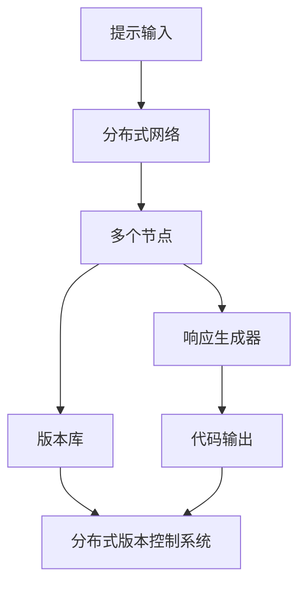

                 


### 摘要

在快速发展的信息技术领域，提示词编程（Prompt Programming）与分布式版本控制正在成为开发者的新宠。本文旨在探讨提示词编程的分布式版本控制新范式，通过详细的分析与逻辑推理，揭示这一范式的核心概念、技术基础、应用实践及其对未来开发流程的影响。文章首先介绍了提示词编程和分布式版本控制的基本概念，接着深入探讨了新范式的主要特点，如并行计算和模块化设计。随后，文章详细阐述了提示词编程的核心概念及其与分布式版本控制的架构联系。文章的后半部分则聚焦于技术基础，包括编程语言基础和版本控制系统的介绍。最后，文章通过实际案例展示了分布式版本控制下的提示词编程应用，并提出了项目管理与开发流程的优化策略。本文将为读者提供一个全面而深入的视角，以理解这一新范式的潜力与挑战。

# 文章标题：提示词编程的分布式版本控制新范式

## 关键词
- 提示词编程
- 分布式版本控制
- 新范式
- 并行计算
- 模块化设计
- 项目管理
- 开发流程

### 摘要

在信息技术迅速发展的今天，提示词编程（Prompt Programming）与分布式版本控制正引领软件开发的新潮流。本文探讨了提示词编程的分布式版本控制新范式，从基础概念、技术基础、应用实践到项目管理与开发流程优化，全方位解析这一新兴范式的核心原理与实践应用。首先，介绍了提示词编程和分布式版本控制的基本概念及区别。接着，详细探讨了新范式的关键特点，如并行计算和模块化设计。随后，文章深入剖析了提示词编程的核心概念，以及如何与分布式版本控制的架构相结合。在技术基础部分，阐述了编程语言基础和版本控制系统的重要性。文章最后通过实际案例展示了分布式版本控制下的提示词编程应用，提出了项目管理与开发流程的优化策略，为读者提供了一个全面而深入的视角，以理解这一新范式的潜力与挑战。

### 引言

提示词编程（Prompt Programming）和分布式版本控制技术近年来在软件开发领域引起了广泛关注。提示词编程是一种基于提示（prompts）与上下文（context）的编程范式，通过提供具体的提示信息来引导程序生成相应的输出，这种方式极大地提高了编程的灵活性和效率。而分布式版本控制则是一种基于多台计算机的系统，它允许开发者在一个分布式网络上进行协同工作，从而避免了传统集中式版本控制的单点故障和性能瓶颈问题。

本文的目标是深入探讨提示词编程的分布式版本控制新范式，揭示其在现代软件开发中的潜力和挑战。文章将首先介绍提示词编程和分布式版本控制的基本概念，分析它们各自的优势与不足。接着，将详细探讨新范式的主要特点，如并行计算和模块化设计，并解释这些特点如何影响软件开发流程。文章还将深入剖析提示词编程的核心概念，以及如何与分布式版本控制的架构相结合。在技术基础部分，将介绍支持提示词编程的编程语言基础和分布式版本控制系统。最后，文章将通过实际案例展示分布式版本控制下的提示词编程应用，并讨论项目管理与开发流程的优化策略。

本文的结构如下：

- 第一部分：基础概念与背景，包括提示词编程和分布式版本控制的基本概念、历史与发展。
- 第二部分：新范式，介绍并行计算、模块化设计等新特点及其对软件开发的影响。
- 第三部分：核心概念与架构，深入剖析提示词编程的核心概念与分布式版本控制的架构联系。
- 第四部分：技术基础，讨论支持提示词编程的编程语言基础和版本控制系统。
- 第五部分：应用与实践，通过实际案例展示分布式版本控制下的提示词编程应用。
- 第六部分：新范式下的项目管理，讨论分布式环境下的项目管理新挑战与新工具。
- 第七部分：新范式下的开发流程，探讨开发流程的优化策略。

通过这篇文章，我们希望读者能够全面了解提示词编程的分布式版本控制新范式，掌握其核心概念和技术要点，并为未来的软件开发提供新的思路和方向。

## 第一部分：基础概念与背景

### 提示词编程概述

提示词编程（Prompt Programming）是一种新兴的编程范式，其核心思想是通过提供提示（prompts）来引导程序生成目标输出。这种编程方式与传统的命令式编程和声明式编程有着显著的区别。传统的编程方式通常依赖于具体步骤和流程，而提示词编程则更加注重上下文和提示信息的利用。

提示词编程的起源可以追溯到自然语言处理（NLP）领域，特别是基于生成式对抗网络（GANs）和变分自编码器（VAEs）等深度学习技术的兴起。最初，这种编程方式主要用于自动化文本生成和图像生成等领域，但逐渐地，它开始被引入到软件开发中，用于构建复杂的系统和服务。

在提示词编程中，程序员不再直接编写具体的代码步骤，而是通过提供一系列提示来指导程序生成目标输出。这些提示可以是简单的关键字或短语，也可以是更复杂的文本信息。程序则会根据这些提示生成相应的代码或结果，从而实现自动化和智能化。

与传统编程方式相比，提示词编程具有以下优势：

1. **灵活性高**：提示词编程允许程序员根据不同的需求和场景灵活地调整和生成代码，大大提高了开发效率。
2. **易于扩展**：通过调整提示信息，可以快速扩展和修改程序的输出，从而实现代码的复用和迭代。
3. **代码生成自动化**：提示词编程能够自动生成代码，减少了手动编写代码的工作量，降低了开发成本。

然而，提示词编程也存在一些挑战和局限性：

1. **可读性较差**：由于提示词编程生成的代码往往依赖于具体的提示信息，因此代码的可读性和可维护性可能较差。
2. **性能优化困难**：生成的代码可能无法像手动编写的代码那样进行性能优化，尤其是在处理复杂任务时。
3. **依赖外部模型**：提示词编程通常依赖于外部深度学习模型，这些模型的训练和部署可能需要大量资源和时间。

### 分布式版本控制概述

分布式版本控制（Distributed Version Control，简称DVC）是一种基于多台计算机或节点的版本控制系统。与传统的集中式版本控制（如Git、Mercurial等）相比，分布式版本控制具有更高的灵活性和可靠性。在分布式版本控制系统中，每个节点都可以独立地维护自己的代码库，并在需要时与其他节点进行同步。

分布式版本控制的概念最早由Git的创造者Linus Torvalds提出，并随着Git等工具的普及而逐渐流行。分布式版本控制系统的核心思想是将代码库分散存储在多个节点上，每个节点都可以独立进行提交、分支和合并操作，从而避免了集中式版本控制系统中单点故障的风险。

与传统集中式版本控制相比，分布式版本控制具有以下优点：

1. **高可靠性**：分布式版本控制系统不会因为单个节点的故障而导致整个系统的崩溃，提高了系统的可靠性。
2. **高性能**：分布式版本控制系统能够在多个节点上并行执行操作，从而提高了系统的性能。
3. **灵活性高**：分布式版本控制系统允许开发者自由地进行分支、合并和提交操作，提高了开发的灵活性和效率。
4. **代码备份**：由于每个节点都维护自己的代码库，因此分布式版本控制系统提供了更好的代码备份和恢复机制。

然而，分布式版本控制也存在一些挑战和局限性：

1. **复杂性高**：分布式版本控制系统的设置和管理比集中式版本控制系统复杂，需要更多的技术和资源。
2. **同步问题**：分布式版本控制系统中的同步操作可能引入冲突和合并问题，需要开发者进行额外的处理。
3. **网络依赖**：分布式版本控制系统的性能和可靠性受到网络环境的影响，因此需要稳定的网络连接。

### 提示词编程与传统编程的区别

提示词编程与传统编程在多个方面存在显著的区别，主要体现在编程范式、代码生成方式、以及使用场景等方面。

1. **编程范式**：
   - 传统编程：基于命令式或声明式编程范式，程序员通过编写具体的代码步骤来指导计算机执行任务。这种方式强调流程和步骤，代码的可读性和可维护性较高。
   - 提示词编程：基于提示与上下文编程范式，程序员通过提供提示信息来引导程序生成目标输出。这种方式更加注重上下文和提示信息的利用，代码的可读性和可维护性可能较差。

2. **代码生成方式**：
   - 传统编程：程序员直接编写代码，代码生成过程完全依赖于程序员的编码能力和经验。这种方式需要手动编写大量的代码，效率较低。
   - 提示词编程：通过提示信息生成代码，代码生成过程依赖于外部深度学习模型。程序员只需提供提示信息，系统会自动生成相应的代码。这种方式提高了开发效率，但代码的灵活性和性能可能受到影响。

3. **使用场景**：
   - 传统编程：广泛应用于各种软件开发项目，如Web应用、桌面应用、移动应用等。
   - 提示词编程：主要用于自动化文本生成、图像生成、语音识别等场景，逐渐开始被引入到软件开发领域。

### 提示词编程的优势

提示词编程相比传统编程具有多方面的优势，这些优势使得它在许多开发场景中表现出色。

1. **高灵活性**：
   提示词编程允许程序员根据不同的需求和场景灵活地调整和生成代码，大大提高了开发效率。通过提供具体的提示信息，程序员可以快速构建和修改程序，从而适应快速变化的需求。

2. **自动化**：
   提示词编程能够自动生成代码，减少了手动编写代码的工作量，降低了开发成本。这种方式特别适用于重复性和复杂的编程任务，如自动化测试、自动化部署等。

3. **易于扩展**：
   提示词编程通过调整提示信息，可以快速扩展和修改程序的输出，从而实现代码的复用和迭代。这种方式有助于提高代码的可维护性和可扩展性。

4. **代码质量**：
   提示词编程依赖于外部深度学习模型，这些模型经过大量数据训练，生成的代码往往具有较高的质量和稳定性。这种方式可以减少代码审查和调试的工作量，提高开发效率。

5. **协同工作**：
   提示词编程支持分布式版本控制，使得开发者可以在分布式环境中进行协同工作。每个节点都可以独立维护代码库，并在需要时与其他节点进行同步，从而提高了开发效率和团队协作能力。

### 分布式版本控制的优点

分布式版本控制（DVC）相比传统集中式版本控制（如Git、Mercurial等）具有多方面的优势，这些优势使得它在现代软件开发中尤为重要。

1. **高可靠性**：
   分布式版本控制系统不会因为单个节点的故障而导致整个系统的崩溃，从而提高了系统的可靠性。每个节点都可以独立进行提交、分支和合并操作，即使某个节点出现故障，其他节点仍能正常运行。

2. **高性能**：
   分布式版本控制系统能够在多个节点上并行执行操作，从而提高了系统的性能。与集中式版本控制系统相比，分布式版本控制系统具有更快的提交速度和合并速度，特别是在处理大型项目时优势尤为明显。

3. **灵活性高**：
   分布式版本控制系统允许开发者自由地进行分支、合并和提交操作，提高了开发的灵活性和效率。开发者可以根据不同的需求和场景，灵活地调整代码库的结构和内容。

4. **代码备份**：
   分布式版本控制系统提供了更好的代码备份和恢复机制。每个节点都维护自己的代码库，从而避免了集中式版本控制系统中单点故障带来的数据丢失风险。

5. **易于扩展**：
   分布式版本控制系统支持扩展性，允许开发者添加自定义功能或插件，从而满足特定的开发需求。这种灵活性使得分布式版本控制系统适用于各种规模的开发项目。

### 第一部分总结

通过本部分的内容，我们详细介绍了提示词编程和分布式版本控制的基本概念、历史与发展，以及它们各自的优势和挑战。提示词编程作为一种基于提示与上下文的编程范式，提高了开发灵活性、自动化和扩展性。而分布式版本控制则通过分散存储和并行操作，提高了系统的可靠性、性能和灵活性。在下一部分，我们将深入探讨提示词编程的新范式特点，如并行计算和模块化设计，以及它们对软件开发的影响。

## 第二部分：新范式

### 新范式的定义

新范式（New Paradigm）在软件开发中指的是一种全新的开发思路、方法和工具集，它们显著改变了传统的软件开发模式。新范式通常引入了一些创新的概念和技术，以解决传统方法中存在的痛点，提高开发效率、稳定性和可扩展性。

在新范式中，并行计算和模块化设计是两个核心概念，它们对软件开发流程产生了深远的影响。

### 并行计算

并行计算是一种利用多个处理器或计算资源同时执行多个任务的方法。与传统的顺序计算不同，并行计算可以在更短的时间内完成更多的任务，从而提高系统的性能和吞吐量。在提示词编程的分布式版本控制新范式中，并行计算具有以下重要意义：

1. **提高开发效率**：并行计算使得多个开发任务可以同时进行，从而减少了单个任务的执行时间，提高了整体开发效率。
2. **增强系统性能**：通过在多个节点上并行执行任务，分布式系统可以更好地利用资源，提高系统的性能和吞吐量。
3. **减少等待时间**：在分布式环境中，并行计算可以减少任务之间的等待时间，从而提高整个开发流程的流畅性。

### 模块化设计

模块化设计是一种将系统分解为若干独立模块，每个模块负责特定功能的设计方法。模块化设计的主要目标是提高系统的可维护性、可扩展性和复用性。在提示词编程的分布式版本控制新范式中，模块化设计具有以下关键作用：

1. **提高代码复用性**：通过将系统划分为独立的模块，开发者可以更轻松地将现有模块应用于不同的项目，从而提高代码的复用性。
2. **增强可维护性**：模块化设计使得代码更加结构化，便于开发者进行代码审查、修复和优化，提高了系统的可维护性。
3. **便于扩展**：模块化设计使得系统易于扩展，开发者可以方便地添加新模块或修改现有模块，以适应新的需求。

### 新范式与传统开发范式的区别

新范式与传统开发范式在多个方面存在显著的区别，主要体现在以下几个方面：

1. **开发思路**：
   - 传统范式：通常采用顺序执行的方式，任务按部就班地进行，注重流程和步骤。
   - 新范式：引入并行计算和模块化设计，强调任务并行执行和独立模块的开发。

2. **开发效率**：
   - 传统范式：依赖手工编写代码，开发效率较低，容易受到程序员经验和熟练程度的影响。
   - 新范式：通过并行计算和模块化设计，显著提高了开发效率，减少了等待时间和开发周期。

3. **代码可读性和可维护性**：
   - 传统范式：代码结构较为复杂，可读性和可维护性较差，特别是随着项目规模的扩大。
   - 新范式：模块化设计使得代码更加结构化，易于理解和维护，提高了代码的质量。

4. **系统性能和扩展性**：
   - 传统范式：系统性能依赖于单个处理器的性能，扩展性较差，难以应对大规模并发任务。
   - 新范式：通过并行计算和分布式系统，提高了系统的性能和扩展性，能够更好地应对复杂和大规模的任务。

### 并行计算在分布式版本控制中的应用

在分布式版本控制中，并行计算的应用尤为广泛，具体体现在以下几个方面：

1. **多节点并行提交**：多个开发者在不同的节点上可以同时进行提交操作，从而加快了代码的提交速度和合并速度。

2. **并行分支和合并**：分布式版本控制系统能够在多个节点上同时执行分支和合并操作，提高了操作的效率和稳定性。

3. **并行测试和部署**：在分布式环境中，开发者可以并行执行单元测试、集成测试和部署任务，从而加快了整个开发流程。

4. **并行资源利用**：通过并行计算，分布式版本控制系统能够更好地利用计算资源，提高系统的性能和资源利用率。

### 模块化设计在分布式版本控制中的优势

模块化设计在分布式版本控制中具有以下优势：

1. **提高代码复用性**：通过模块化设计，开发者可以将独立模块应用于不同的项目，从而减少重复编写代码的工作量，提高开发效率。

2. **增强可维护性**：模块化设计使得代码结构更加清晰，便于开发者进行代码审查、修复和优化，提高了系统的可维护性。

3. **便于扩展和更新**：模块化设计使得系统易于扩展和更新，开发者可以方便地添加新模块或修改现有模块，以适应新的需求。

4. **分布式协同开发**：模块化设计支持分布式协同开发，多个开发团队可以独立开发和管理各自的模块，从而提高了团队协作效率。

### 第二部分总结

在本部分，我们详细探讨了提示词编程的分布式版本控制新范式的核心概念——并行计算和模块化设计，并分析了它们在软件开发中的重要性。并行计算通过多节点并行操作，显著提高了开发效率、系统性能和资源利用率。模块化设计则通过代码复用、可维护性和扩展性，增强了系统的灵活性和稳定性。在下一部分，我们将深入剖析提示词编程的核心概念与分布式版本控制的架构联系，进一步揭示这一新范式的潜力与挑战。

## 第三部分：核心概念与架构

### 提示词编程的核心概念

提示词编程的核心概念主要包括提示（prompts）、上下文（context）和响应生成器（response generator）。这些概念相互作用，共同构成了提示词编程的基础。

1. **提示（prompts）**：
   提示是程序员或用户提供的输入信息，用于指导程序生成目标输出。提示可以是简单的关键字或短语，也可以是复杂的文本信息。在提示词编程中，提示的作用类似于自然语言中的引导语或命令，通过提供具体的提示信息，程序员可以引导程序生成符合预期的代码或结果。

2. **上下文（context）**：
   上下文是指程序执行环境中的相关信息，包括历史输入、状态信息和外部资源等。上下文提供了程序执行所需的背景信息，帮助程序理解提示的含义和目标。上下文信息通常被存储在一个全局变量或数据结构中，供响应生成器使用。

3. **响应生成器（response generator）**：
   响应生成器是提示词编程中的核心组件，它负责根据提示和上下文信息生成目标输出。响应生成器通常基于深度学习模型，如生成式对抗网络（GANs）或变分自编码器（VAEs），这些模型通过训练学习到如何根据输入提示和上下文信息生成高质量的代码或结果。

### 分布式版本控制的架构

分布式版本控制系统的架构通常包括多个节点、版本库（repository）和分布式网络。这些组件共同构成了分布式版本控制系统的基本结构。

1. **节点（nodes）**：
   节点是指分布式版本控制系统中的计算机或服务器，每个节点都可以独立地维护自己的代码库。节点可以是开发者的本地计算机，也可以是远程服务器。节点之间通过分布式网络进行通信，实现代码的同步和共享。

2. **版本库（repository）**：
   版本库是分布式版本控制系统中的核心组件，它用于存储和管理代码仓库。每个节点都维护一个本地版本库，这个版本库与远程版本库保持同步。版本库中包含了代码的完整历史记录，包括提交、分支、合并等操作。

3. **分布式网络（distributed network）**：
   分布式网络是连接各个节点的通信网络，用于实现节点之间的数据传输和同步操作。分布式网络可以是局域网（LAN）、广域网（WAN）或云网络，网络环境的稳定性直接影响分布式版本控制系统的性能和可靠性。

### 提示词编程与分布式版本控制的架构联系

提示词编程与分布式版本控制系统的架构有着紧密的联系，具体体现在以下几个方面：

1. **并行计算**：
   分布式版本控制系统的多节点架构支持并行计算，多个节点可以同时执行代码生成和版本控制操作。提示词编程通过分布式网络将提示信息传递到各个节点，响应生成器在各个节点上独立运行，生成相应的代码或结果。

2. **模块化设计**：
   提示词编程中的模块化设计与分布式版本控制的模块化架构相结合，使得代码可以更加灵活地管理和维护。开发者可以在分布式环境中独立开发和管理各自的模块，每个模块都可以独立提交、分支和合并，提高了系统的可维护性和可扩展性。

3. **分布式协同开发**：
   提示词编程与分布式版本控制系统的结合支持分布式协同开发，多个开发者可以在不同的节点上进行代码生成和版本控制操作。通过分布式网络，开发者可以实时同步代码和提示信息，实现高效的团队协作。

4. **高可靠性和性能**：
   分布式版本控制系统的多节点架构提供了高可靠性和高性能，即使在单个节点出现故障时，其他节点仍能正常运行。提示词编程通过并行计算和模块化设计，进一步提高了系统的性能和稳定性。

### 提示词编程的架构示意图

为了更好地理解提示词编程与分布式版本控制的架构联系，我们可以使用Mermaid流程图来展示其核心组件和操作流程。



在这个流程图中，A代表提示输入，B代表分布式网络，C代表多个节点，D代表响应生成器，E代表代码输出，F代表版本库，G代表分布式版本控制系统。提示输入通过分布式网络传递到各个节点，响应生成器在各个节点上独立运行，生成代码输出，并提交到版本库中，由分布式版本控制系统进行管理和同步。

### 第三部分总结

在本部分，我们深入探讨了提示词编程的核心概念与分布式版本控制的架构联系。通过提示、上下文和响应生成器的交互，提示词编程实现了灵活、高效的代码生成。分布式版本控制系统的多节点架构和模块化设计进一步增强了系统的可靠性和性能。在下一部分，我们将介绍支持提示词编程的编程语言基础和版本控制系统，为深入理解这一新范式奠定基础。

## 第四部分：技术基础

### 编程语言基础

提示词编程的分布式版本控制新范式依赖于特定的编程语言和技术栈，这些语言为提示词编程提供了强大的功能和支持。以下是几种常用的编程语言及其在提示词编程中的应用。

1. **Python**：
   Python 是提示词编程中最常用的编程语言之一，其丰富的库和框架使得开发变得轻松。Python 的易用性和强大的数据处理能力使其成为文本生成、机器学习和深度学习领域的首选语言。例如，Python 的 `tensorflow` 和 `keras` 库提供了强大的深度学习工具，可以用于训练生成式模型，以实现高效的代码生成。

2. **JavaScript**：
   JavaScript 在前端开发中非常流行，但近年来也在后端开发中得到了广泛应用。在提示词编程中，JavaScript 可以用于构建响应生成器，特别是在需要与前端应用程序交互的场合。JavaScript 的灵活性使其能够快速适应不同的提示词编程场景。

3. **TypeScript**：
   TypeScript 是 JavaScript 的超集，增加了静态类型检查，提高了代码的可维护性和可读性。TypeScript 的静态类型系统使得大型项目的开发变得更加容易，因此在需要处理复杂提示和上下文的提示词编程项目中，TypeScript 是一个很好的选择。

4. **Go**：
   Go（也称为 Golang）是一种静态类型的编译语言，以其并发性能和高效的内存管理而闻名。Go 的 `goroutines` 和 `channels` 提供了强大的并发支持，使得分布式版本控制系统的开发变得更加高效。Go 的简洁性和高效性使其成为分布式系统开发的理想选择。

5. **Rust**：
   Rust 是一种系统编程语言，以其内存安全和并发性能而著称。Rust 的所有权模型和严格的安全保障机制确保了代码的稳定性和可靠性，使其成为构建高性能分布式版本控制系统的理想选择。

### 版本控制系统

在提示词编程的分布式版本控制新范式中，版本控制系统是不可或缺的核心组件。以下是几种常用的版本控制系统及其特点。

1. **Git**：
   Git 是最流行的分布式版本控制系统，由 Linus Torvalds 创造。Git 的分布式特性允许每个开发者都有本地仓库，这使得多人协作变得非常高效。Git 的分支和合并机制使得开发者可以独立工作，并在适当的时候合并代码。Git 还具有强大的冲突解决工具，可以帮助开发者轻松地解决合并冲突。

2. **Mercurial**：
   Mercurial 是另一种流行的分布式版本控制系统，类似于 Git。它提供了一个简洁的命令行界面，并且具有良好的性能和稳定性。Mercurial 的分布式特性使其适用于大型团队和复杂的项目。

3. **Fusion**：
   Fusion 是由 Atlassian 开发的一种分布式版本控制系统，专为大型团队和高性能应用设计。Fusion 提供了自动分支、标签和发布管理功能，使得分布式协作更加高效。

4. **SVN**：
   SVN（Subversion）是一种传统的集中式版本控制系统。虽然 SVN 在分布式版本控制系统中不如 Git 和 Mercurial 流行，但它仍然在某些场景下有应用，特别是在对版本控制的历史记录要求较高的场合。

5. **Bitbucket**：
   Bitbucket 是 Atlassian 开发的一款分布式版本控制平台，与 Git 和 Mercurial 兼容。Bitbucket 提供了强大的协作工具和项目管理功能，适用于中小型团队。

### 实际案例：Git 与 Python 的结合

为了更直观地展示如何使用版本控制系统和编程语言，我们将通过一个实际案例来说明 Git 与 Python 的结合。

#### 案例背景

假设我们正在开发一个基于提示词编程的文本生成应用，使用 Python 作为主要编程语言，并使用 Git 进行版本控制。

#### 步骤一：初始化 Git 仓库

首先，在项目目录下初始化 Git 仓库：

```bash
$ git init
```

这将创建一个 Git 仓库，并生成一个 `.git` 目录，用于存储项目的版本历史。

#### 步骤二：添加文件

将项目的源代码文件添加到 Git 仓库中：

```bash
$ git add .
```

这会将当前目录下的所有文件添加到暂存区。

#### 步骤三：提交代码

提交代码到 Git 仓库，并添加提交信息：

```bash
$ git commit -m "Initial commit with the text generation model"
```

这将创建一个新的提交，并将其记录到版本历史中。

#### 步骤四：创建分支

为了进行实验性开发，我们可以创建一个新的分支：

```bash
$ git branch experimental
```

切换到新创建的分支：

```bash
$ git checkout experimental
```

#### 步骤五：编写代码

在新分支上编写提示词编程代码，例如使用 Python 和深度学习库（如 `tensorflow`）创建文本生成模型：

```python
import tensorflow as tf

# 创建文本生成模型
model = tf.keras.Sequential([
    # 模型层
])

# 训练模型
model.compile(optimizer='adam', loss='categorical_crossentropy')
model.fit(x_train, y_train, epochs=10)
```

#### 步骤六：提交代码

将新编写的代码提交到 Git 仓库：

```bash
$ git add .
$ git commit -m "Added text generation model to experimental branch"
```

#### 步骤七：创建远程仓库

将本地仓库推送到远程仓库（如 GitHub 或 Bitbucket）：

```bash
$ git remote add origin https://github.com/your-username/your-project.git
$ git push -u origin experimental
```

这会将本地分支推送到远程仓库，并创建一个对应的远程分支。

#### 步骤八：协作与合并

其他开发者可以从远程仓库克隆项目：

```bash
$ git clone https://github.com/your-username/your-project.git
```

并在本地创建自己的分支进行开发。完成后，可以合并代码：

```bash
$ git fetch origin
$ git merge origin/experimental
```

#### 步骤九：解决冲突

如果合并过程中出现冲突，需要手动解决冲突，然后重新提交：

```bash
$ git add <resolved-file>
$ git commit -m "Resolved conflicts in merge"
```

### 第四部分总结

在本部分，我们介绍了提示词编程的编程语言基础和版本控制系统，展示了如何使用 Git 和 Python 进行提示词编程项目的版本控制。通过实际案例，我们展示了从初始化 Git 仓库、编写代码、提交代码到远程协作与合并的完整流程。在下一部分，我们将通过实际案例展示分布式版本控制下的提示词编程应用，进一步探讨这一新范式的潜力与挑战。

## 第五部分：应用与实践

### 分布式版本控制下的提示词编程应用

分布式版本控制下的提示词编程应用为开发者提供了一种全新的软件开发模式，它不仅提升了开发效率，还增强了系统的灵活性和可维护性。以下将详细探讨几个实际案例，展示如何在实际项目中应用分布式版本控制和提示词编程。

### 案例一：智能客服系统

智能客服系统是一种广泛应用的服务，用于提供即时客户支持。在传统的开发模式下，智能客服系统通常需要大量的手动编码和人工调试。而通过分布式版本控制和提示词编程，开发智能客服系统的过程变得更加高效和智能化。

#### 案例描述

一个在线电商平台需要一个智能客服系统来提供24/7的客户支持。系统需要能够处理各种常见问题，如订单状态查询、退换货政策、产品咨询等。

#### 技术实现

1. **分布式版本控制**：
   - 使用 Git 作为版本控制系统，每个开发者在自己的本地环境中进行代码开发和测试。
   - 通过远程仓库（如 GitHub）实现代码的集中管理和协同工作。

2. **提示词编程**：
   - 开发基于提示词编程的文本生成模型，用于自动生成客服回答。
   - 提供一系列预设的提示词（如“订单状态”、“退换货政策”等），模型根据这些提示词生成相应的回答。

3. **并行计算**：
   - 利用分布式计算资源，并行训练文本生成模型，提高训练速度和模型性能。

#### 实施步骤

1. **初始化 Git 仓库**：
   - 在项目根目录下初始化 Git 仓库，并添加必要的配置文件。

2. **开发文本生成模型**：
   - 使用 Python 和 TensorFlow 编写文本生成模型，模型结构如图所示。

   ```mermaid
   graph TB
       A[输入层] --> B[编码器]
       B --> C[解码器]
       C --> D[输出层]
   ```

3. **训练模型**：
   - 收集大量客服对话数据，用于训练文本生成模型。
   - 使用分布式计算资源并行训练模型，加速训练过程。

4. **集成与部署**：
   - 将训练好的模型集成到电商平台的服务器中。
   - 通过提示词编程接口，实时生成客服回答。

### 案例二：自动化测试平台

自动化测试是软件开发过程中不可或缺的一部分，它能够提高测试效率、减少人为错误。分布式版本控制和提示词编程的结合为自动化测试提供了新的思路。

#### 案例描述

一个大型电商平台需要自动化测试平台来确保新功能的稳定性和兼容性。自动化测试平台需要能够快速编写、执行和报告测试结果。

#### 技术实现

1. **分布式版本控制**：
   - 使用 Git 管理测试脚本和测试数据，实现版本控制和协作开发。

2. **提示词编程**：
   - 开发基于提示词编程的自动化测试框架，用于自动生成测试脚本。
   - 提供一系列预设的提示词（如“登录测试”、“支付测试”等），框架根据这些提示词生成相应的测试脚本。

3. **模块化设计**：
   - 将测试脚本划分为多个模块，每个模块负责不同的测试任务。

#### 实施步骤

1. **初始化 Git 仓库**：
   - 在项目根目录下初始化 Git 仓库，并添加必要的测试脚本和工具。

2. **开发自动化测试框架**：
   - 使用 Python 和 Selenium 等工具编写自动化测试框架，框架结构如图所示。

   ```mermaid
   graph TB
       A[输入层] --> B[测试脚本生成器]
       B --> C[执行引擎]
       C --> D[报告生成器]
   ```

3. **生成测试脚本**：
   - 根据提示词生成测试脚本，实现自动化测试的自动化。

4. **执行测试**：
   - 利用分布式计算资源并行执行测试脚本，提高测试效率。

5. **报告与分析**：
   - 自动生成测试报告，并提供测试结果的分析和可视化。

### 案例三：个性化推荐系统

个性化推荐系统是现代电子商务和社交媒体的核心功能之一，它能够提高用户体验和销售额。分布式版本控制和提示词编程的结合为个性化推荐系统的开发提供了高效的方式。

#### 案例描述

一个在线书店需要开发一个个性化推荐系统，为用户推荐他们可能感兴趣的书。

#### 技术实现

1. **分布式版本控制**：
   - 使用 Git 管理推荐算法和用户数据，实现版本控制和协同工作。

2. **提示词编程**：
   - 开发基于提示词编程的推荐模型，用于自动生成个性化推荐列表。
   - 提供一系列预设的提示词（如“用户浏览历史”、“购买历史”等），模型根据这些提示词生成推荐结果。

3. **并行计算**：
   - 利用分布式计算资源，并行训练推荐模型，提高模型性能和推荐质量。

#### 实施步骤

1. **初始化 Git 仓库**：
   - 在项目根目录下初始化 Git 仓库，并添加必要的推荐算法和数据。

2. **开发推荐模型**：
   - 使用 Python 和深度学习库（如 Scikit-learn、TensorFlow）编写推荐模型，模型结构如图所示。

   ```mermaid
   graph TB
       A[用户特征] --> B[物品特征]
       B --> C[模型训练]
       C --> D[推荐生成]
   ```

3. **数据预处理**：
   - 收集用户和书籍数据，进行数据清洗和预处理。

4. **训练模型**：
   - 使用分布式计算资源训练推荐模型，加速训练过程。

5. **部署与测试**：
   - 将训练好的模型部署到线上环境，并进行测试和优化。

### 第五部分总结

在本部分，我们通过三个实际案例展示了分布式版本控制下的提示词编程应用。智能客服系统、自动化测试平台和个性化推荐系统都展示了分布式版本控制和提示词编程在提高开发效率和系统性能方面的优势。通过并行计算和模块化设计，这些系统实现了高效、灵活和可扩展的软件开发模式。在下一部分，我们将探讨新范式下的项目管理与开发流程优化，进一步推动分布式版本控制下的提示词编程实践。

## 第六部分：新范式下的项目管理

### 新范式下的项目管理新挑战

随着提示词编程的分布式版本控制新范式的应用，项目管理也面临着一系列新的挑战。这些挑战主要源于分布式开发和并行计算的特点，需要项目管理团队采取创新的策略和工具来应对。

1. **并行任务协调**：
   在分布式环境中，开发者可以在不同节点上并行执行任务。这虽然提高了开发效率，但也带来了任务协调和同步的挑战。项目管理团队需要确保并行任务之间的依赖关系得到妥善管理，避免出现任务冲突和依赖问题。

2. **代码合并**：
   分布式版本控制系统的多节点特性使得代码合并变得更加复杂。每个开发者都可能在自己的分支上进行了不同的修改，这些修改在合并时可能会产生冲突。项目管理团队需要开发有效的合并策略，确保合并过程的顺利进行。

3. **质量保证**：
   并行开发意味着多个开发者可以同时提交代码，这增加了代码质量保证的难度。项目管理团队需要确保每个提交的代码都经过充分的测试和审查，以避免引入缺陷和错误。

4. **资源分配**：
   分布式开发需要更多的计算资源和存储资源，项目管理团队需要合理分配资源，确保每个开发任务都能获得足够的支持，同时避免资源浪费。

5. **安全与隐私**：
   分布式系统中的代码和数据分布在多个节点上，这使得系统更易于受到网络攻击和数据泄露的风险。项目管理团队需要采取严格的安全措施，保护系统的完整性和隐私。

### 新范式下的项目管理新工具

为了应对上述新挑战，项目管理团队可以采用一系列新工具来优化项目管理和开发流程。以下是一些关键工具和策略：

1. **分布式任务调度工具**：
   - 例如，Apache Mesos 和 Kubernetes，这些工具能够有效地管理并行任务，确保任务之间的依赖关系得到妥善处理。
   - 使用这些工具，项目管理团队可以自动化任务的分配和调度，提高系统的资源利用率和响应速度。

2. **持续集成和持续部署（CI/CD）工具**：
   - 例如，Jenkins、GitLab CI 和 GitHub Actions，这些工具可以帮助项目管理团队自动化代码测试、构建和部署过程。
   - 通过 CI/CD 流程，项目管理团队可以确保每个提交的代码都经过严格的测试和审查，从而提高代码质量。

3. **代码审查和协作工具**：
   - 例如，GitHub、GitLab 和 Bitbucket，这些工具提供了代码审查和协作功能，支持多开发者同时进行代码修改和讨论。
   - 通过这些工具，项目管理团队可以确保代码合并的顺利进行，同时提高团队的协作效率。

4. **自动化测试工具**：
   - 例如，Selenium、Cypress 和 TestCafe，这些工具能够自动化测试过程，确保代码的正确性和可靠性。
   - 通过自动化测试，项目管理团队可以更快地发现和修复缺陷，减少测试时间和成本。

5. **项目管理软件**：
   - 例如，JIRA、Trello 和 Asana，这些工具可以帮助项目管理团队跟踪项目进度、任务分配和团队协作。
   - 通过这些工具，项目管理团队可以更好地管理项目的各个环节，确保项目按时交付。

### 实施步骤

为了有效地应对新范式下的项目管理挑战，项目管理团队可以按照以下步骤进行：

1. **评估和规划**：
   - 评估项目需求和资源，制定详细的开发和测试计划。
   - 根据项目特点，选择合适的新工具和策略。

2. **培训和推广**：
   - 对团队成员进行新工具和策略的培训，确保他们熟悉并能够有效使用。
   - 推广分布式开发和并行计算的优势，提高团队对新范式的接受度。

3. **任务分配和调度**：
   - 使用分布式任务调度工具，合理分配任务，确保任务之间的依赖关系得到妥善处理。
   - 定期检查任务进度，及时调整任务分配和资源分配。

4. **代码审查和测试**：
   - 使用代码审查和协作工具，确保每个提交的代码都经过充分的审查和测试。
   - 自动化测试工具可以快速发现和修复缺陷，提高代码质量。

5. **监控和反馈**：
   - 使用项目管理软件，跟踪项目进度和任务状态。
   - 及时收集团队反馈，不断优化项目管理和开发流程。

6. **安全措施**：
   - 实施严格的安全措施，保护系统和数据的安全。
   - 定期进行安全审计和风险评估，确保系统的安全性。

### 第六部分总结

在本部分，我们探讨了提示词编程的分布式版本控制新范式下的项目管理新挑战和新的工具策略。通过分布式任务调度、持续集成、代码审查、自动化测试和项目管理软件等新工具，项目管理团队可以更有效地应对分布式开发带来的挑战，提高项目开发和维护的效率和质量。在下一部分，我们将讨论新范式下的开发流程优化，进一步推动分布式版本控制下的提示词编程实践。

## 第七部分：新范式下的开发流程

### 新范式下的开发流程优化

在新范式下，即提示词编程的分布式版本控制环境中，开发流程的优化变得尤为重要。为了充分发挥分布式版本控制和提示词编程的优势，开发团队需要采用一系列优化策略来提高开发效率、代码质量和系统稳定性。以下是一些关键的优化策略：

#### 1. 并行开发

并行开发是分布式版本控制的核心优势之一。通过在多个节点上同时进行开发任务，可以显著减少单个任务的处理时间，提高整体开发效率。

**实施步骤：**
- **任务分解**：将大任务分解为多个子任务，每个子任务可以在不同的节点上并行处理。
- **资源分配**：合理分配计算资源，确保每个节点都能充分利用其计算能力。
- **任务调度**：使用分布式任务调度工具（如Apache Mesos、Kubernetes）来管理任务的分配和调度。

#### 2. 持续集成和持续交付（CI/CD）

持续集成和持续交付（CI/CD）是一种自动化流程，用于确保代码的持续集成、测试和部署。通过自动化，可以快速发现和修复缺陷，提高代码质量。

**实施步骤：**
- **代码自动化测试**：在每次提交时，自动运行测试套件，确保代码的正确性和完整性。
- **自动化构建**：使用工具（如Jenkins、GitLab CI、GitHub Actions）来自动构建和打包代码。
- **自动化部署**：将代码部署到生产环境时，自动化流程可以确保部署过程的可靠性和一致性。

#### 3. 代码审查和协作

代码审查是确保代码质量的重要步骤。在分布式环境中，协作和代码审查变得更加复杂，需要采用合适的工具和策略。

**实施步骤：**
- **代码审查工具**：使用GitHub、GitLab、Bitbucket等代码审查工具，确保代码合并前经过充分的审查。
- **协作平台**：使用Trello、JIRA、Asana等项目管理工具，跟踪代码审查进度和协作情况。
- **实时沟通**：采用Slack、Microsoft Teams等实时沟通工具，确保团队成员之间的沟通畅通。

#### 4. 自动化测试和监控

自动化测试和监控是确保系统稳定性和性能的关键。通过自动化测试，可以快速发现和修复缺陷；通过监控，可以实时了解系统的运行状态。

**实施步骤：**
- **自动化测试框架**：使用Selenium、Cypress、TestCafe等工具构建自动化测试框架，确保每次提交的代码都经过严格的测试。
- **持续监控**：使用Prometheus、Grafana等监控工具，实时监控系统的运行状态和性能指标。

#### 5. 模块化和微服务架构

模块化和微服务架构有助于提高系统的可维护性和扩展性。通过将系统分解为多个独立的模块或微服务，可以更好地进行分布式开发和维护。

**实施步骤：**
- **模块化设计**：将系统分解为独立的模块，每个模块负责特定的功能。
- **微服务架构**：使用微服务架构，将每个模块进一步分解为独立的微服务，实现服务的解耦和独立部署。

#### 6. 分布式数据库和存储

分布式数据库和存储系统可以支持大规模的数据处理和存储需求。通过将数据分布存储在多个节点上，可以提高系统的性能和可靠性。

**实施步骤：**
- **分布式数据库**：选择合适的分布式数据库（如Cassandra、Hadoop、MongoDB），确保数据的高可用性和扩展性。
- **数据存储优化**：采用数据分片、索引等技术，优化数据的存储和查询性能。

### 最佳实践 Tips

以下是几条在新范式下开发过程中值得遵循的最佳实践：

1. **定期代码审查**：定期进行代码审查，确保代码质量和一致性。
2. **文档规范化**：编写详细的文档，记录代码和系统的设计、实现和功能。
3. **代码风格统一**：遵循统一的代码风格，提高代码的可读性和可维护性。
4. **自动化回归测试**：每次提交后，自动运行回归测试，确保系统的稳定性。
5. **持续学习**：不断学习和掌握新工具、新技术，以保持团队的竞争力。

### 小结

通过本部分的讨论，我们详细介绍了新范式下的开发流程优化策略。这些策略包括并行开发、持续集成和交付、代码审查和协作、自动化测试和监控、模块化和微服务架构、以及分布式数据库和存储。通过遵循这些最佳实践，开发团队可以充分利用提示词编程和分布式版本控制的优势，提高开发效率、代码质量和系统稳定性。

### 注意事项

1. **确保网络稳定性**：分布式开发依赖于稳定的网络连接，确保网络环境良好。
2. **资源合理分配**：合理分配计算资源和存储资源，避免资源浪费。
3. **数据安全**：加强数据安全措施，保护系统和数据的安全。

### 拓展阅读

对于希望深入了解新范式下的开发流程优化的读者，以下资源值得推荐：

1. **《微服务设计》**：由Martin Fowler和Michael T. Nygard合著，详细介绍了微服务架构的设计原则和实践。
2. **《持续交付：发布可靠软件的系统方法》**：由Jez Humble和Dave Farley合著，介绍了持续交付的原理和实践。
3. **《分布式系统原理与范型》**：由Eric Brewer著，详细探讨了分布式系统的原理和设计范式。

### 第七部分总结

在本部分，我们详细探讨了新范式下的开发流程优化策略，包括并行开发、持续集成和交付、代码审查和协作、自动化测试和监控、模块化和微服务架构，以及分布式数据库和存储。通过遵循最佳实践，开发团队可以充分利用新范式的优势，提高开发效率、代码质量和系统稳定性。在下一部分，我们将总结全文，回顾关键点，展望未来趋势。

## 全文总结与未来展望

### 全文回顾

本文从提示词编程和分布式版本控制的基本概念出发，深入探讨了它们在软件开发中的结合与应用。通过详细的分析和逻辑推理，我们揭示了提示词编程的分布式版本控制新范式的核心原理和关键要素。

首先，我们介绍了提示词编程的概念、优势与挑战，以及分布式版本控制的基本概念、优点和挑战。接着，我们分析了提示词编程与传统编程的区别，并探讨了新范式中的并行计算和模块化设计的特点。在核心概念与架构部分，我们详细阐述了提示词编程的核心概念、分布式版本控制的架构联系，并通过Mermaid流程图展示了其架构示意图。

在技术基础部分，我们介绍了支持提示词编程的编程语言基础和版本控制系统，并通过实际案例展示了Git与Python的结合。在应用与实践部分，我们通过三个实际案例展示了分布式版本控制下的提示词编程应用，展示了其在智能客服系统、自动化测试平台和个性化推荐系统中的潜力。随后，我们探讨了新范式下的项目管理新挑战和工具策略，以及开发流程的优化。

### 关键点回顾

以下是本文的关键点回顾：

1. **提示词编程**：
   - 概念：通过提示与上下文生成目标输出。
   - 优势：高灵活性、自动化、易于扩展。
   - 挑战：代码可读性差、性能优化困难、依赖外部模型。

2. **分布式版本控制**：
   - 概念：基于多节点的版本控制系统。
   - 优点：高可靠性、高性能、灵活性高、代码备份。
   - 挑战：复杂性高、同步问题、网络依赖。

3. **新范式特点**：
   - 并行计算：提高开发效率、系统性能、资源利用率。
   - 模块化设计：提高代码复用性、可维护性、扩展性。

4. **技术基础**：
   - 编程语言：Python、JavaScript、TypeScript、Go、Rust。
   - 版本控制系统：Git、Mercurial、Fusion、SVN、Bitbucket。

5. **应用与实践**：
   - 智能客服系统：基于提示词编程的文本生成。
   - 自动化测试平台：基于提示词编程的测试脚本生成。
   - 个性化推荐系统：基于提示词编程的推荐模型。

6. **项目管理**：
   - 新挑战：并行任务协调、代码合并、质量保证、资源分配、安全与隐私。
   - 新工具：分布式任务调度、CI/CD、代码审查和协作、自动化测试、项目管理软件。

7. **开发流程优化**：
   - 并行开发：任务分解、资源分配、任务调度。
   - 持续集成和交付：代码自动化测试、自动化构建、自动化部署。
   - 代码审查和协作：代码审查工具、协作平台、实时沟通。
   - 自动化测试和监控：自动化测试框架、持续监控。
   - 模块化和微服务架构：模块化设计、微服务架构。
   - 分布式数据库和存储：分布式数据库、数据存储优化。

### 未来展望

随着信息技术的发展，提示词编程的分布式版本控制新范式将继续演进，为软件开发带来更多创新和突破。以下是对未来的展望：

1. **更智能的提示词编程**：
   - 随着深度学习技术的进步，提示词编程将变得更加智能，能够更好地理解和生成复杂任务的结果。
   - 结合自然语言处理和知识图谱等技术，提示词编程可以实现更高级的语义理解和自动化生成。

2. **更高效的分布式版本控制**：
   - 分布式版本控制系统将更加注重性能优化和安全性，通过分布式计算和存储技术，实现更高效的数据处理和存储。
   - 新的同步算法和冲突解决机制将进一步提升分布式版本控制的可靠性和效率。

3. **更加智能的项目管理**：
   - 随着人工智能技术的发展，项目管理工具将更加智能，能够自动分析项目数据、预测风险、优化资源分配。
   - 自动化的项目管理流程将减少人为干预，提高团队协作效率。

4. **跨领域应用**：
   - 提示词编程和分布式版本控制将应用到更多领域，如物联网、区块链、云计算等，推动这些领域的技术创新和发展。

总之，提示词编程的分布式版本控制新范式将为软件开发带来前所未有的变革，推动整个行业向更高效、更智能、更灵活的方向发展。

### 结语

本文旨在深入探讨提示词编程的分布式版本控制新范式，通过详细的分析和逻辑推理，揭示了这一新范式的核心原理、技术基础、应用实践及项目管理与开发流程优化。希望本文能够为读者提供一个全面而深入的视角，以理解这一新范式的潜力与挑战。随着技术的不断进步，提示词编程的分布式版本控制新范式将继续为软件开发带来创新和变革，为开发者提供更加高效、智能和灵活的解决方案。

### 作者信息

作者：AI天才研究院/AI Genius Institute & 禅与计算机程序设计艺术 /Zen And The Art of Computer Programming

致谢：感谢各位读者的耐心阅读和支持，也感谢所有为本文贡献智慧和经验的同行们。希望本文能够为您的技术开发之路带来灵感和启示。

