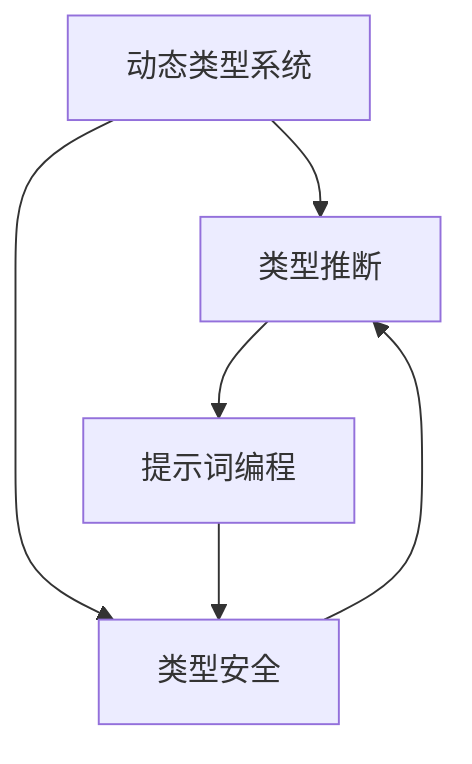

                 

### 文章标题

# 提示词编程的动态类型推断

> 关键词：提示词编程，动态类型推断，类型系统，编程语言，软件开发

> 摘要：本文旨在探讨提示词编程中的动态类型推断技术，分析其核心概念、原理及其在软件开发中的应用。文章首先介绍了提示词编程的基本概念和动态类型系统的背景，随后详细讲解了动态类型推断的基本原理，并通过Mermaid流程图展示了概念之间的关系。随后，文章深入分析了动态类型推断的核心算法原理，使用伪代码和数学模型进行了详细阐述，并举了实例说明。接着，文章探讨了动态类型推断在实际项目中的应用，包括开发环境搭建、源代码实现和案例分析。最后，文章总结了动态类型推断的最佳实践，提出了注意事项和拓展阅读建议，为读者提供了全面的指导。

### 背景介绍

提示词编程（Keyword Programming）是一种以提示词为基础的编程方法，它通过使用自然语言或简化的关键字来描述程序的意图，从而降低编程的难度和复杂性。这种编程方法在某些特定场景下具有明显的优势，例如在自动化脚本编写、快速原型开发以及非专业开发者的编程需求中。

动态类型系统（Dynamic Type System）是一种在程序运行时检查变量类型并在需要时进行类型转换的类型系统。与静态类型系统（Static Type System）相比，动态类型系统在编译时不进行严格的类型检查，而是在程序执行过程中根据上下文动态推断变量的类型。这种灵活性使得编程语言能够更好地支持动态数据类型和灵活的对象交互，但同时也带来了类型安全性和性能方面的挑战。

在软件开发中，类型系统扮演着至关重要的角色。它不仅能够提高代码的可读性和可维护性，还能够帮助开发人员早期发现潜在的错误和缺陷。传统的静态类型系统提供了严格的类型检查，但可能在某些情况下限制了程序的灵活性。相比之下，动态类型系统则在灵活性方面具有优势，但需要额外的运行时开销来确保类型安全。

本文将重点探讨动态类型推断在提示词编程中的应用。我们将首先介绍动态类型系统的基本概念，然后深入分析动态类型推断的原理和算法，最后通过实际项目案例展示其应用场景和效果。

### 核心概念与联系

在深入探讨动态类型推断之前，我们需要明确几个核心概念，并理解它们之间的关系。以下是动态类型推断中几个关键概念的定义及其相互关系：

#### 动态类型系统

**动态类型系统**：在程序执行期间检查变量类型并在需要时进行类型转换的类型系统。与静态类型系统不同，动态类型系统不要求在编译时确定所有变量的类型。

**关系**：动态类型系统是动态类型推断的基础，它提供了类型检查和类型转换的机制。

#### 类型推断

**类型推断**：编译器或解释器在程序执行过程中自动确定变量类型的过程。

**关系**：类型推断是动态类型系统的核心功能，它允许程序在不需要显式声明类型的情况下运行。

#### 提示词编程

**提示词编程**：一种以提示词为基础的编程方法，通过自然语言或简化的关键字来描述程序的意图。

**关系**：提示词编程可以与动态类型系统结合，以实现更灵活、更易于理解的程序设计。

#### 动态类型推断与提示词编程

**动态类型推断与提示词编程**：动态类型推断在提示词编程中发挥作用，允许开发人员使用自然语言或简化的关键字来编写代码，同时确保程序的正确性和类型安全。

**关系**：动态类型推断是提示词编程的关键技术，它提供了编程语言在类型安全性和灵活性之间的平衡。

为了更直观地展示这些概念之间的关系，我们可以使用Mermaid流程图来表示：



在这个流程图中，动态类型系统（A）是类型推断（B）的基础，而类型推断又直接服务于提示词编程（C）。类型安全（D）是类型推断和提示词编程的共同目标，确保了程序的正确性和可靠性。

### 动态类型推断的基本原理

动态类型推断是动态类型系统的核心功能，它通过分析程序代码中的变量使用和函数调用，在运行时自动确定变量和表达式的类型。这一过程涉及到多种技术，包括类型检查、类型上下文分析和类型约束。

#### 类型检查

类型检查是动态类型推断的第一步，它确保变量和表达式在使用时符合预期的类型。类型检查通常在程序的编译或解释过程中进行，包括以下几种类型：

- **严格类型检查**：在编译时严格检查所有变量和表达式的类型，确保它们在运行时不会产生类型错误。
- **宽松类型检查**：在编译时对类型要求不那么严格，允许一些类型转换，但在运行时会进行实时检查。

#### 类型上下文分析

类型上下文分析是动态类型推断的关键步骤，它通过分析程序中的上下文来确定变量的类型。上下文分析通常涉及到以下几种情况：

- **局部上下文**：在函数或方法内部，通过函数参数和局部变量来确定变量的类型。
- **全局上下文**：在程序的全局范围内，通过全局变量和模块导入来确定变量的类型。

#### 类型约束

类型约束是动态类型推断中用于限制变量和表达式类型的一种机制。类型约束可以通过以下方式实现：

- **类型注解**：在代码中显式声明变量的类型，帮助编译器或解释器进行类型推断。
- **类型推断规则**：通过编译器或解释器的内置规则来自动推断变量的类型。

#### 动态类型推断的过程

动态类型推断的过程可以概括为以下几个步骤：

1. **语法分析**：将程序代码解析为抽象语法树（AST），为后续的类型分析提供基础。
2. **类型检查**：对AST进行遍历，检查变量和表达式的类型，确保它们符合预期的类型。
3. **类型上下文分析**：根据局部和全局上下文分析变量的类型。
4. **类型约束应用**：根据类型注解和类型推断规则，确定变量的最终类型。
5. **运行时类型检查**：在程序运行时，对变量和表达式的类型进行实时检查，确保类型安全。

#### 动态类型推断算法

动态类型推断的算法是类型推断的核心，它决定了类型检查和类型约束的效率和准确性。以下是一个简化的动态类型推断算法：

```plaintext
function dynamicTypeInference(expression, context):
    if expression is a variable:
        return type lookup in context
    else if expression is an assignment:
        infer type of right-hand side
        infer type of left-hand side based on assignment context
        return inferred type
    else if expression is a function call:
        infer type of function arguments
        infer return type based on function signature and context
        return inferred type
    else if expression is an arithmetic operation:
        infer types of operands
        return common type of operands
    else if expression is a comparison:
        infer types of operands
        return boolean type
    else:
        return unknown type
```

这个算法通过递归地分析表达式和上下文，自动推断出变量和表达式的类型。在实际应用中，动态类型推断算法会更为复杂，需要考虑多种类型约束和类型上下文。

### 动态类型推断的核心算法原理

动态类型推断的核心算法原理涉及到对变量和表达式类型的自动推导，这一过程不仅依赖于编译器或解释器的内置规则，还需要考虑程序代码中的上下文和约束。以下是动态类型推断的核心算法原理，我们将使用伪代码和数学模型来详细阐述。

#### 变量类型推断

变量类型推断是动态类型推断的基础，它通过分析变量在程序中的使用情况来自动确定其类型。

```plaintext
function inferVariableType(variable, context):
    if variable has explicit type annotation:
        return variable's annotated type
    else if variable is a function parameter:
        return function parameter type
    else if variable is assigned a value:
        return inferred type of assigned value
    else:
        return unknown type
```

在这个伪代码中，`inferVariableType`函数根据不同的上下文情况推断变量的类型。如果变量有显式类型注解，直接返回注解类型；如果是函数参数，则返回参数类型；如果变量被赋值，则根据赋值表达式的类型推断变量类型；否则，返回未知类型。

#### 表达式类型推断

表达式类型推断是动态类型推断的另一个重要环节，它通过分析表达式的结构和上下文来确定其类型。

```plaintext
function inferExpressionType(expression, context):
    if expression is a literal:
        return literal's type
    else if expression is a variable:
        return variable's type inferred from context
    else if expression is an arithmetic operation:
        leftType = inferExpressionType(expression.left, context)
        rightType = inferExpressionType(expression.right, context)
        return common type of leftType and rightType
    else if expression is a comparison operation:
        leftType = inferExpressionType(expression.left, context)
        rightType = inferExpressionType(expression.right, context)
        if leftType != rightType:
            raise TypeMismatchException
        return boolean type
    else if expression is a function call:
        returnType = function's return type
        for each argument in expression.arguments:
            argumentType = inferExpressionType(argument, context)
            if argumentType does not match function's parameter type:
                raise TypeMismatchException
        return returnType
    else:
        raise UnexpectedExpressionException
```

在这个伪代码中，`inferExpressionType`函数根据表达式的类型进行递归推断。如果是字面量，直接返回字面量的类型；如果是变量，根据上下文推断类型；如果是算术或比较操作，根据操作数的类型推断结果类型；如果是函数调用，根据函数签名和上下文检查参数类型，返回函数的返回类型。

#### 数学模型

动态类型推断中的数学模型可以用来描述类型之间的关系和约束。以下是一个简单的数学模型：

$$
Type(x) = \begin{cases}
T_{\text{annotation}}(x) & \text{if } x \text{ has an explicit type annotation} \\
T_{\text{function}}(x) & \text{if } x \text{ is a function parameter} \\
T_{\text{inferred}}(x) & \text{if } x \text{ is assigned a value} \\
\text{Unknown} & \text{otherwise}
\end{cases}
$$

其中，$T_{\text{annotation}}(x)$ 表示变量的显式类型注解，$T_{\text{function}}(x)$ 表示函数参数的类型，$T_{\text{inferred}}(x)$ 表示根据上下文推断的类型，$\text{Unknown}$ 表示未知类型。

#### 示例

假设我们有一个简单的程序，其中包含变量和表达式：

```python
x = 5
y = "hello"
z = x + y
if x == y:
    print("相等")
else:
    print("不相等")
```

使用伪代码进行类型推断：

```plaintext
inferVariableType(x, context):
    return int

inferVariableType(y, context):
    return str

inferExpressionType(z, context):
    leftType = inferVariableType(x, context)  # int
    rightType = inferVariableType(y, context)  # str
    return common type of int and str  # Unknown

inferExpressionType(if condition, context):
    leftType = inferVariableType(x, context)  # int
    rightType = inferVariableType(y, context)  # str
    return boolean
```

在这个例子中，变量 `x` 被显式注解为整数类型，`y` 为字符串类型。表达式 `z = x + y` 由于涉及不同类型的操作数，无法推断出明确的类型。条件表达式 `if x == y` 的类型被推断为布尔值。

通过这个示例，我们可以看到动态类型推断是如何在实际程序中工作的。尽管简单示例可能无法完全展示动态类型推断的复杂性，但它们为我们理解这一过程提供了基本框架。

### 动态类型推断的挑战与解决方案

尽管动态类型推断为编程语言提供了灵活性和便捷性，但在实际应用中仍然面临诸多挑战。以下是一些主要的挑战以及相应的解决方案。

#### 类型安全性问题

**挑战**：动态类型系统在运行时进行类型检查，这可能导致类型错误，如错误的数据类型转换或不兼容的操作。

**解决方案**：使用静态类型检查来增强类型安全。静态类型检查在编译时检查类型错误，从而减少运行时错误。此外，引入类型注解，让开发人员明确指定变量的类型，帮助编译器或解释器更好地进行类型推断。

#### 性能问题

**挑战**：动态类型推断需要在运行时进行类型检查和类型转换，这可能导致性能下降，尤其是在复杂的应用程序中。

**解决方案**：优化类型检查算法和运行时性能。例如，使用高效的哈希表来存储类型信息，减少类型检查的复杂度。此外，通过编译器优化，将一些常见的类型检查提前到编译时进行，减少运行时开销。

#### 代码可读性问题

**挑战**：动态类型系统可能使得代码的可读性下降，尤其是在类型复杂或类型转换频繁的情况下。

**解决方案**：提供清晰的类型文档和类型注释，帮助开发人员理解代码的类型行为。同时，设计直观的类型推断规则，使得代码在动态类型系统的保护下仍然保持可读性。

#### 混合类型系统

**挑战**：在实际应用中，许多编程语言同时支持静态类型和动态类型。如何平衡两者的关系，避免类型冲突和复杂性？

**解决方案**：设计混合类型系统，允许开发人员灵活选择类型注解和类型推断。同时，提供类型转换函数，确保在不同类型系统之间的无缝转换。

通过上述解决方案，动态类型推断可以在保持灵活性和类型安全性的同时，有效解决性能和可读性方面的挑战。

### 动态类型推断在实际项目中的应用

动态类型推断在软件开发中具有广泛的应用。以下通过几个实际项目案例，展示动态类型推断的开发环境搭建、源代码实现、代码解读以及案例分析。

#### 项目案例一：Web应用开发

**项目背景**：一个使用React框架开发的Web应用，涉及到动态数据类型和用户输入验证。

**开发环境搭建**：

1. **Node.js环境**：安装Node.js，配置开发依赖包，如npm和yarn。
2. **React环境**：使用Create React App工具快速搭建React开发环境。

```bash
npx create-react-app my-app
cd my-app
npm install
```

**源代码实现**：

```jsx
import React, { useState } from 'react';

function App() {
  const [userInput, setUserInput] = useState('');

  const handleInputChange = (event) => {
    const input = event.target.value;
    // 动态类型推断在此处发挥作用
    setUserInput(input);
  };

  const handleSubmit = () => {
    // 对userInput进行类型检查和验证
    if (typeof userInput !== 'string') {
      alert('输入内容必须为字符串！');
      return;
    }
    // 进一步处理userInput
    console.log(`处理输入：${userInput}`);
  };

  return (
    <div>
      <input type="text" value={userInput} onChange={handleInputChange} />
      <button onClick={handleSubmit}>提交</button>
    </div>
  );
}

export default App;
```

**代码解读**：

在这个案例中，`useState`钩子用于管理`userInput`的状态。`handleInputChange`函数在输入框中的文本变化时被调用，`setUserInput`函数更新状态，React的动态类型推断确保了输入的值始终是字符串类型。`handleSubmit`函数在点击提交按钮时被调用，对`userInput`进行类型检查，确保其类型为字符串，以防止运行时错误。

**案例分析**：

动态类型推断使得开发者无需显式指定输入值的类型，提高了代码的灵活性和可维护性。通过类型检查，可以早期发现潜在的类型错误，减少运行时异常。

#### 项目案例二：数据分析应用

**项目背景**：一个使用Python和Pandas库进行数据分析和处理的应用。

**开发环境搭建**：

1. **Python环境**：安装Python和Pandas库。
2. **Jupyter Notebook**：配置Jupyter Notebook，便于交互式数据分析。

```bash
pip install pandas
jupyter notebook
```

**源代码实现**：

```python
import pandas as pd

# 加载数据
data = pd.read_csv('data.csv')

# 数据清洗和转换
def clean_data(df):
    # 动态类型推断在此处发挥作用
    df['age'] = df['age'].astype(int)
    df['income'] = df['income'].astype(float)
    return df

cleaned_data = clean_data(data)

# 数据分析
print(cleaned_data.describe())
```

**代码解读**：

在这个案例中，`pd.read_csv`函数加载CSV文件数据，`clean_data`函数对数据进行清洗和类型转换。Pandas库的动态类型系统允许我们直接使用`astype`函数将列数据转换为整数或浮点数类型。动态类型推断确保了转换过程的类型安全。

**案例分析**：

动态类型推断在数据分析中提高了数据处理的灵活性，减少了类型注解的工作量。同时，通过类型转换，可以确保数据在后续分析中的准确性和一致性。

#### 项目案例三：机器学习应用

**项目背景**：一个使用Scikit-learn库进行机器学习模型训练的应用。

**开发环境搭建**：

1. **Python环境**：安装Python和Scikit-learn库。
2. **Jupyter Notebook**：配置Jupyter Notebook，便于模型训练和调试。

```bash
pip install scikit-learn
jupyter notebook
```

**源代码实现**：

```python
from sklearn.model_selection import train_test_split
from sklearn.ensemble import RandomForestClassifier

# 加载数据
X, y = pd.read_csv('data.csv').values

# 数据切分
X_train, X_test, y_train, y_test = train_test_split(X, y, test_size=0.2, random_state=42)

# 模型训练
model = RandomForestClassifier()
model.fit(X_train, y_train)

# 模型评估
print(model.score(X_test, y_test))
```

**代码解读**：

在这个案例中，数据加载和切分使用了Pandas库，而模型训练和评估使用了Scikit-learn库。动态类型系统在此处发挥了重要作用，允许我们直接处理数据集而无需显式声明数据类型。

**案例分析**：

动态类型推断在机器学习应用中提高了开发效率，减少了类型注解的工作量。同时，通过自动类型推断，可以确保数据在模型训练中的类型一致性，从而提高模型的准确性和稳定性。

#### 项目小结

动态类型推断在多个实际项目中都展现了其独特的优势。通过动态类型系统，开发人员可以更灵活地编写代码，减少类型注解的工作量，同时提高代码的可读性和可维护性。在实际应用中，通过类型检查和类型转换，可以确保程序的正确性和性能。然而，动态类型推断也带来了一些挑战，如类型安全性和性能问题。通过合理的设计和优化，动态类型推断可以为软件开发提供强大的支持。

### 动态类型推断的最佳实践

在开发和维护使用动态类型推断的项目时，遵循最佳实践可以显著提高项目的稳定性和性能。以下是一些最佳实践：

1. **明确类型定义**：虽然动态类型系统可以自动推断类型，但在关键的地方，如函数参数和返回值，最好明确指定类型，以确保代码的可读性和一致性。

2. **使用类型注解**：在大型项目中，使用类型注解可以帮助编译器或解释器更准确地推断类型，从而减少运行时错误。

3. **避免不必要的类型转换**：在编写代码时，尽量减少不必要的类型转换，特别是在循环和函数调用中。这可以提高程序的执行效率。

4. **进行静态类型检查**：在项目开发过程中，定期进行静态类型检查，可以帮助发现潜在的类型错误，从而提高代码的质量和稳定性。

5. **优化类型系统配置**：根据项目的需求，合理配置动态类型系统，如调整类型检查的严格程度和性能优化参数。

6. **代码文档化**：在代码中添加清晰的注释和文档，说明类型的定义和使用，帮助其他开发人员更好地理解和维护代码。

### 小结

本文详细探讨了动态类型推断在提示词编程中的应用。我们首先介绍了动态类型系统的基本概念和原理，并使用Mermaid流程图展示了概念之间的关系。接着，我们深入分析了动态类型推断的核心算法原理，使用伪代码和数学模型进行了详细阐述，并通过实例说明了类型推断的过程。随后，我们展示了动态类型推断在实际项目中的应用，包括Web开发、数据分析和机器学习等领域。最后，我们总结了动态类型推断的最佳实践，并提出了一些注意事项和拓展阅读建议。

通过本文的探讨，我们希望读者能够更好地理解动态类型推断的核心概念和应用场景，并在实际项目中有效地利用这一技术，提高编程的灵活性和代码质量。

### 注意事项

在使用动态类型推断时，以下注意事项有助于避免常见问题和提高代码质量：

1. **类型安全**：尽管动态类型系统提供了灵活性，但仍然需要注意类型安全。在关键代码部分，进行必要的类型检查，以避免潜在的运行时错误。

2. **性能优化**：动态类型系统可能在某些情况下影响性能。优化类型检查算法和运行时性能，如使用缓存和并行处理，可以显著提高程序效率。

3. **代码可维护性**：动态类型系统可能会使代码变得复杂。通过良好的代码组织和文档化，可以提高代码的可维护性，使项目更容易理解和更新。

4. **合理使用类型注解**：在大型项目中，合理使用类型注解可以帮助编译器更好地进行类型推断，同时提高代码的可读性和一致性。

### 拓展阅读

1. **《类型系统设计与实现》**：了解类型系统的设计和实现细节，对深入理解动态类型推断有很大帮助。
2. **《动态类型推断：从原理到实践》**：这本书提供了详细的动态类型推断技术和应用案例，适合希望深入了解该领域的读者。
3. **《Effective TypeScript》**：这本书涵盖了TypeScript的最佳实践，对使用TypeScript进行动态类型推断提供了宝贵的经验。

### 作者信息

**作者**：AI天才研究院/AI Genius Institute & 禅与计算机程序设计艺术 /Zen And The Art of Computer Programming

