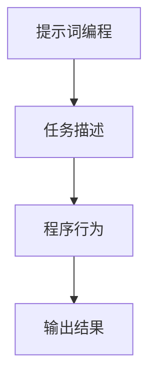
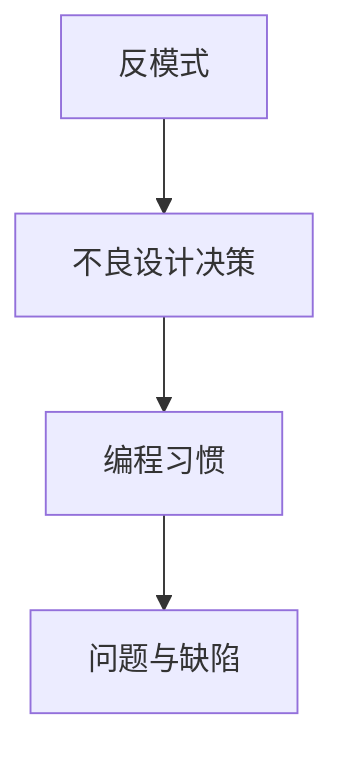
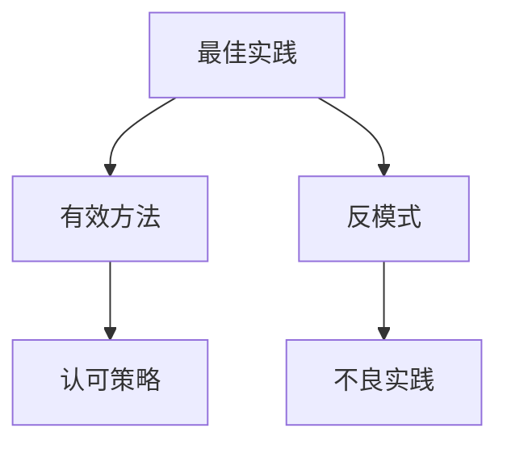
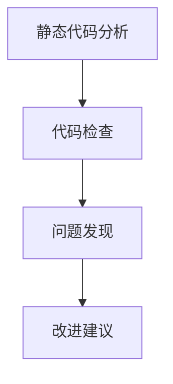
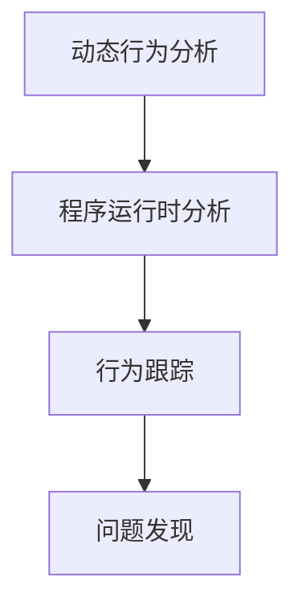
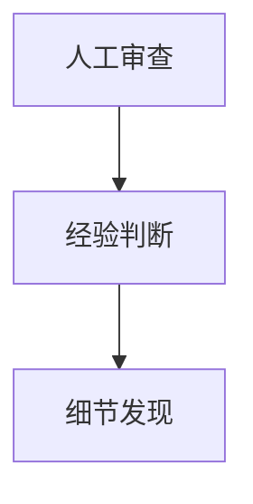

                 

## 文章标题

《提示词编程的反模式检测与重构建议》

## 文章关键词

提示词编程、反模式检测、重构、代码质量、人工智能

## 文章摘要

本文旨在探讨提示词编程中的反模式现象，并提供有效的检测与重构建议。通过深入分析提示词编程的背景、核心概念、反模式的影响，结合静态代码分析、动态行为分析和人工审查等检测方法，我们将揭示反模式的存在与影响。随后，本文将介绍重构原则与方法，通过实际项目实战，展示重构工具的使用与最佳实践。最终，本文将总结提升编程质量的方法与未来研究方向，为读者提供全面的指导。

## 第一部分：背景与基础

### 第1章：提示词编程概述

#### 1.1 提示词编程的概念

提示词编程（Prompt Programming）是一种基于提示词（Prompt）的编程范式。提示词是一个或一组用于指导程序执行的任务描述，它通常由用户或系统生成。在提示词编程中，程序的行为和输出由提示词决定，而不再是传统的预定义逻辑或规则。

#### 1.2 提示词编程的优势

提示词编程具有以下优势：

1. **灵活性与适应性**：提示词编程允许程序根据不同的任务描述动态调整其行为，提高了系统的灵活性和适应性。
2. **易用性**：用户可以使用自然语言形式的提示词来描述任务，降低了编程门槛。
3. **高效性**：通过减少传统编程中的硬编码逻辑，提示词编程可以加快开发速度，提高生产效率。

#### 1.3 提示词编程的挑战

尽管提示词编程具有许多优势，但同时也面临以下挑战：

1. **语义理解**：准确理解和解析提示词的语义是提示词编程的关键，但自然语言的复杂性使得这一过程充满挑战。
2. **泛化能力**：提示词编程需要具备良好的泛化能力，以处理各种不同的任务描述。
3. **可维护性**：随着提示词的多样化，如何保证代码的可维护性和可扩展性成为重要问题。

### 第2章：反模式的基本概念

#### 2.1 反模式的定义

反模式（Anti-pattern）是指在软件开发过程中，由于不良的设计决策或编程习惯导致的问题或缺陷。反模式通常表现为一系列不良的实践或行为，可能导致代码质量下降、系统维护困难、性能问题等。

#### 2.2 反模式与最佳实践的对比

反模式与最佳实践（Best Practices）之间存在显著差异。最佳实践是指被广泛认可的、有效的软件开发方法和策略，旨在提高代码质量、系统性能和可维护性。相比之下，反模式则是应避免的不良实践。

#### 2.3 反模式的影响

反模式对软件开发的影响是多方面的：

1. **性能问题**：反模式可能导致系统性能下降，影响用户体验。
2. **可维护性差**：反模式使得代码结构混乱，降低代码的可维护性，增加维护成本。
3. **可靠性问题**：反模式可能导致系统稳定性下降，增加故障风险。
4. **安全性隐患**：反模式可能导致潜在的安全漏洞，威胁系统的安全性。

### 第二部分：反模式检测方法

### 第3章：静态代码分析

#### 3.1 静态代码分析概述

静态代码分析（Static Code Analysis）是一种不运行程序的情况下对代码进行分析的技术。它通过检查代码的语法、结构、逻辑等，发现潜在的问题和缺陷。

#### 3.2 常用静态代码分析工具

以下是一些常用的静态代码分析工具：

1. **SonarQube**：一款强大的静态代码分析平台，支持多种编程语言。
2. **PMD**：一个基于Java的静态代码分析工具，用于检测代码中的潜在问题。
3. **FindBugs**：一款用于Java代码的静态分析工具，能够发现多种反模式。

#### 3.3 静态代码分析的步骤

进行静态代码分析通常包括以下步骤：

1. **代码准备**：将待分析的代码准备好，确保代码格式正确。
2. **工具配置**：配置静态代码分析工具，设置检查规则和参数。
3. **执行分析**：运行分析工具，生成分析报告。
4. **问题处理**：根据分析报告，对发现的问题进行修复或优化。

### 第4章：动态行为分析

#### 4.1 动态行为分析概述

动态行为分析（Dynamic Behavior Analysis）是一种在程序运行时对代码行为进行分析的技术。它通过跟踪程序的运行过程，发现潜在的问题和缺陷。

#### 4.2 常用动态行为分析工具

以下是一些常用的动态行为分析工具：

1. **JUnit**：一款用于Java程序的单元测试工具，支持动态行为分析。
2. **Eclipse Memory Analyzer Tool (MAT)**：一款用于Java内存分析的动态行为分析工具。
3. **Log Analyzer**：一款用于分析程序日志的动态行为分析工具。

#### 4.3 动态行为分析的步骤

进行动态行为分析通常包括以下步骤：

1. **测试环境搭建**：搭建测试环境，准备测试用例。
2. **运行程序**：执行测试用例，观察程序的行为。
3. **日志收集**：收集程序运行过程中的日志信息。
4. **分析结果**：根据日志信息，分析程序的行为，发现潜在的问题。

### 第5章：人工审查

#### 5.1 人工审查的重要性

人工审查（Manual Review）是一种通过人工方式对代码进行审查的技术。尽管自动化工具在代码分析中发挥着重要作用，但人工审查在某些情况下仍然是不可或缺的。

#### 5.2 人工审查的流程

人工审查通常包括以下步骤：

1. **准备审查材料**：准备好待审查的代码和相关文档。
2. **组织审查团队**：组建具备相关经验的审查团队。
3. **审查会议**：召开审查会议，讨论和评估代码的质量。
4. **记录反馈**：记录审查发现的问题和改进建议。

#### 5.3 人工审查的有效性

人工审查在以下几个方面具有显著有效性：

1. **发现自动化工具无法检测的问题**：人工审查可以捕捉到自动化工具无法检测的细节问题。
2. **提高代码可维护性**：通过人工审查，可以发现代码中的不良设计决策，提高代码的可维护性。
3. **培养团队协作精神**：人工审查过程可以促进团队成员之间的沟通和协作，提高团队的整体能力。

### 第三部分：反模式重构

### 第6章：重构原则与方法

#### 6.1 重构的原则

重构（Refactoring）是一种在不改变代码外部行为的前提下，改进代码内部结构和质量的技术。重构的原则包括：

1. **保持代码功能不变**：重构过程中，必须确保代码的功能保持不变。
2. **逐步改进**：重构应分步骤进行，避免一次性引入过多的变更。
3. **代码质量优先**：在重构过程中，应优先考虑代码质量，确保代码可读性、可维护性和性能。

#### 6.2 重构的方法

重构的方法包括：

1. **提取方法**（Extract Method）：将重复代码提取为独立的方法。
2. **内联方法**（Inline Method）：将方法调用替换为其实现。
3. **替换条件语句**（Replace Conditional with Polymorphism）：使用多态替换复杂的条件语句。
4. **分解类**（Split Class）：将过大的类分解为较小的类。

#### 6.3 重构的最佳实践

重构的最佳实践包括：

1. **定期重构**：定期对代码进行重构，避免积累过多的技术债务。
2. **团队协作**：重构过程应鼓励团队协作，共同改进代码质量。
3. **代码审查**：在重构过程中，进行代码审查，确保重构效果。

### 第7章：重构工具与实践

#### 7.1 重构工具的选择

选择适合的重构工具对于提高重构效率至关重要。以下是一些常用的重构工具：

1. **Eclipse重构工具**：Eclipse自带的重构工具，支持多种编程语言。
2. **Visual Studio重构工具**：Visual Studio内置的重构工具，适用于C#等编程语言。
3. **RefactoringTools**：一款跨平台的重构工具，支持多种编程语言。

#### 7.2 重构工具的使用

使用重构工具通常包括以下步骤：

1. **安装与配置**：安装并配置所选的重构工具。
2. **代码分析**：使用重构工具对代码进行分析，识别潜在的改进点。
3. **执行重构**：根据分析结果，执行相应的重构操作。

#### 7.3 重构项目的实战案例

以下是一个重构项目的实战案例：

**项目背景**：某电商系统存在大量重复代码，代码结构混乱，可维护性较差。

**重构过程**：

1. **提取方法**：将重复代码提取为独立的方法，减少冗余。
2. **分解类**：将过大的类分解为较小的类，提高代码可读性。
3. **代码审查**：团队成员对重构后的代码进行审查，确保重构效果。

**重构效果**：

1. **代码质量提升**：重构后的代码更加清晰、易于维护。
2. **可维护性增强**：重构后的代码可维护性明显提高。
3. **性能优化**：重构后的代码在某些场景下性能得到优化。

### 第四部分：提升与展望

### 第8章：提升提示词编程质量

#### 8.1 编程质量的重要性

编程质量直接影响软件系统的性能、稳定性和可维护性。提升编程质量对于提高软件系统的整体质量至关重要。

#### 8.2 提升编程质量的方法

提升编程质量的方法包括：

1. **编码规范**：遵循统一的编码规范，提高代码的可读性和一致性。
2. **代码审查**：定期进行代码审查，发现并修复潜在的问题。
3. **自动化测试**：编写自动化测试用例，确保代码的正确性和稳定性。

#### 8.3 编程质量的评估

编程质量的评估可以通过以下方法进行：

1. **代码复杂度**：评估代码的复杂度，识别潜在的瓶颈和优化点。
2. **代码覆盖**：评估代码的测试覆盖率，确保代码的每个部分都得到充分的测试。
3. **性能分析**：评估代码的性能，发现并优化性能瓶颈。

### 第9章：未来展望

#### 9.1 提示词编程的发展趋势

提示词编程作为人工智能领域的重要研究方向，未来发展趋势包括：

1. **自然语言处理**：结合自然语言处理技术，提高提示词的语义理解和解析能力。
2. **自动化生成**：通过自动化生成技术，提高提示词编程的效率和质量。
3. **跨领域应用**：拓展提示词编程的应用领域，实现更广泛的应用场景。

#### 9.2 反模式检测与重构的挑战

反模式检测与重构在提示词编程中面临以下挑战：

1. **复杂性**：提示词编程的复杂性使得反模式检测与重构变得更加困难。
2. **动态性**：提示词编程的动态性使得反模式检测与重构需要实时调整。
3. **可维护性**：提示词编程的可维护性要求在反模式检测与重构过程中保持代码质量。

#### 9.3 未来研究方向

未来的研究方向包括：

1. **智能化检测**：结合人工智能技术，实现自动化的反模式检测。
2. **智能重构**：研究智能化的重构方法，提高重构的效率和效果。
3. **跨领域集成**：探索提示词编程与其他领域的集成应用，实现更广泛的价值。

### 附录

### A.1 相关资源与工具

#### A.1.1 提示词编程相关资源

1. **论文**：《提示词编程：方法、应用与挑战》
2. **书籍**：《人工智能编程：从基础到实践》
3. **在线课程**：Coursera上的《人工智能与机器学习》

#### A.1.2 反模式检测工具

1. **SonarQube**：https://www.sonarqube.org/
2. **PMD**：https://pmd.github.io/
3. **FindBugs**：http://findbugs.sourceforge.net/

#### A.1.3 重构工具

1. **Eclipse重构工具**：https://www.eclipse.org/
2. **Visual Studio重构工具**：https://visualstudio.microsoft.com/
3. **RefactoringTools**：https://refactoringtools.org/

### 作者信息

作者：AI天才研究院/AI Genius Institute & 禅与计算机程序设计艺术 /Zen And The Art of Computer Programming

### 最佳实践 tips、小结、注意事项、拓展阅读等内容

- **最佳实践 tips**：定期进行代码审查，确保重构效果；遵循统一的编码规范，提高代码质量。
- **小结**：本文系统地介绍了提示词编程的反模式检测与重构方法，为提升代码质量提供了指导。
- **注意事项**：反模式检测与重构过程中，要注重团队合作，确保重构的有效性。
- **拓展阅读**：参考相关论文、书籍和在线课程，深入了解更多关于提示词编程和反模式检测与重构的知识。

### 文章标题：提示词编程的反模式检测与重构建议

### 文章关键词：提示词编程、反模式检测、重构、代码质量、人工智能

### 文章摘要

本文旨在探讨提示词编程中的反模式现象，并提供有效的检测与重构建议。通过深入分析提示词编程的背景、核心概念、反模式的影响，结合静态代码分析、动态行为分析和人工审查等检测方法，本文揭示了反模式的存在与影响。随后，本文介绍了重构原则与方法，通过实际项目实战，展示重构工具的使用与最佳实践。最终，本文总结了提升编程质量的方法与未来研究方向，为读者提供全面的指导。

