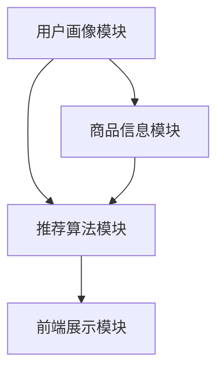

                 

### 文章标题

《提示词编程的可扩展性探讨》

### 关键词

提示词编程，可扩展性，编程语言，框架，性能优化，案例分析

### 摘要

本文旨在深入探讨提示词编程的可扩展性，包括其基本原理、实现技术、性能优化以及案例分析。文章首先概述了提示词编程的定义和重要性，随后详细分析了可扩展性的概念和分类。接着，文章讨论了在不同编程语言和框架下实现提示词编程的技术，并分析了它们的可扩展性。随后，文章通过实际案例展示了提示词编程在电商商品推荐系统和自然语言处理中的应用。最后，文章提出了性能优化策略和未来的发展趋势，为读者提供了全面的参考和启示。

----------------------------------------------------------------

### 引言

#### 1.1 提示词编程概述

提示词编程，作为一种在编程中引入外部提示信息的编程方式，旨在提高代码的可读性、可维护性和可扩展性。提示词通常是一些关键字、注释或者预定义的变量，它们在代码执行过程中为程序员提供额外的信息，帮助理解代码的功能和意图。随着软件开发复杂度的增加，传统的编程模式已无法满足现代应用的需求，提示词编程因此成为了一种重要的编程模式。

提示词编程的起源可以追溯到计算机编程的早期阶段。当时，程序员们意识到，为了提高代码的可读性，需要引入一些额外的说明信息。这些信息并不直接影响代码的执行，但有助于其他开发者或未来的自己理解代码的意图。随着编程语言的不断发展和技术的进步，提示词编程逐渐演变成了一种系统化的编程模式，并在各种编程语言和框架中得到广泛应用。

#### 1.2 可扩展性的重要性

在软件开发过程中，系统的可扩展性是确保系统长期稳定运行和适应未来需求的关键因素。可扩展性包括两个方面：横向扩展和纵向扩展。横向扩展指的是系统在处理更多用户或数据时的性能提升，而纵向扩展则是通过增加系统资源（如CPU、内存等）来提高系统的处理能力。一个可扩展的系统不仅能够在规模扩大时保持性能，还能在需求变化时灵活调整。

可扩展性的重要性体现在以下几个方面：

1. **适应性**：随着业务需求的不断变化，系统需要能够适应这些变化。如果系统缺乏可扩展性，则可能需要重新设计或重构，这将耗费大量的时间和资源。
2. **性能优化**：可扩展性有助于在系统负载增加时进行性能优化。通过横向扩展，系统可以轻松处理更多的请求，从而提高响应速度和用户体验。
3. **成本效益**：可扩展性有助于降低长期维护成本。通过设计可扩展的系统，可以避免因需求变化而导致的大规模重构。

#### 1.3 书籍结构介绍

本文将按照以下结构进行讨论：

1. **基础理论**：介绍提示词编程的基本原理和可扩展性的概念。
2. **实现技术**：探讨在不同编程语言和框架下实现提示词编程的技术。
3. **案例分析**：通过实际案例展示提示词编程的应用场景和可扩展性的实现。
4. **性能优化**：分析性能优化的策略和工具。
5. **未来趋势**：探讨提示词编程和可扩展性的未来发展。

通过本文的阅读，读者将深入了解提示词编程和可扩展性的核心概念，掌握实现和优化的方法，以及了解该领域的未来趋势。

----------------------------------------------------------------

### 基础理论

#### 2.1 提示词编程的基本原理

提示词编程的基本原理在于引入外部提示信息，以提高代码的可读性和可维护性。提示词通常是以注释或变量的形式出现，它们在代码执行过程中不直接影响程序的运行，但为程序员提供了额外的信息。这些信息可以帮助理解代码的功能、意图和内部逻辑，从而降低代码理解的难度。

提示词编程的核心概念包括：

1. **提示词**：提示词是用于提供额外信息的文本或标识符。它们可以是简单的关键字，也可以是复杂的注释。
2. **注释**：注释是程序员在代码中添加的用于解释代码功能或内部逻辑的文本。注释可以是单行注释或块注释。
3. **变量**：变量是用于存储提示信息的标识符。变量可以包含字符串、数字或其他数据类型。

在提示词编程中，常用的提示词形式包括：

- **代码段提示**：在代码段前后添加提示词，以说明该代码段的功能或目的。
  ```python
  # 计算两个数的和
  result = a + b
  ```

- **函数提示**：在函数定义前添加提示词，以说明函数的功能和参数。
  ```python
  def calculate_sum(a, b):
      # 计算两个数的和
      return a + b
  ```

- **类和模块提示**：在类和模块定义前添加提示词，以说明类或模块的功能。
  ```python
  class Calculator:
      # 用于计算数值的类
      pass
  ```

- **文档字符串**：在函数、类或模块定义中使用文档字符串（docstring），以提供详细的描述。
  ```python
  def calculate_sum(a, b):
      """
      计算两个数的和。

      参数：
      a (int): 第一个数。
      b (int): 第二个数。

      返回：
      int: 两个数的和。
      """
      return a + b
  ```

#### 2.2 提示词的历史发展

提示词编程的历史可以追溯到计算机编程的早期阶段。当时，程序员们意识到，为了提高代码的可读性和可维护性，需要引入一些额外的说明信息。这些信息最初是通过注释的形式添加到代码中的。

随着时间的推移，注释逐渐发展成为更复杂的提示词形式。例如，在C语言中，注释是使用 `/* */` 或 `//` 符号来表示的。随着编程语言和开发工具的不断发展，提示词的形式也变得更加多样化和复杂化。

在面向对象编程语言中，如Java和C#，提示词通常通过文档字符串（docstrings）的形式来实现。文档字符串是一种特殊的注释，它使用三引号（`"""`）或单引号（`'''`）来包裹，以提供对函数、类或模块的详细描述。

现代编程语言和框架提供了丰富的工具和库来支持提示词编程。例如，Python的`docstrings`、Java的Javadoc、C#的XML文档等，都为提示词编程提供了方便的实现方式。这些工具和库不仅简化了提示词的编写，还提高了提示词的规范化和标准化。

#### 2.3 提示词编程的相关术语和定义

在讨论提示词编程时，了解一些相关术语和定义是必要的。以下是一些常见的术语和定义：

1. **注释**：注释是程序员在代码中添加的用于解释代码功能或内部逻辑的文本。注释可以是单行注释或块注释。
2. **文档字符串**：文档字符串是用于提供对函数、类或模块的详细描述的特殊注释。文档字符串通常使用三引号或单引号来包裹。
3. **元数据**：元数据是指关于数据的数据。在提示词编程中，元数据通常用于描述代码的功能、参数和返回值等。
4. **自描述性**：自描述性是指代码本身能够提供足够的描述信息，使其他程序员无需额外阅读文档就能理解代码的功能和意图。
5. **代码注释比**：代码注释比是指代码中注释的行数与代码行数的比值。较高的代码注释比通常表示代码的可读性和可维护性较好。
6. **自动化工具**：自动化工具是指用于生成、管理和维护提示词的工具。例如，代码生成器、文档生成器和静态分析工具等。

#### 2.4 可扩展性的定义与分类

可扩展性是指系统在规模扩大或需求变化时，能够适应这些变化并保持性能的能力。可扩展性通常分为横向扩展和纵向扩展两种类型：

1. **横向扩展**：横向扩展是指通过增加系统的实例或节点数量来提高系统的处理能力。例如，通过添加更多的服务器或数据库实例来处理更多的请求。
2. **纵向扩展**：纵向扩展是指通过增加系统的硬件资源（如CPU、内存等）来提高系统的处理能力。例如，通过升级服务器的硬件配置来处理更多的请求。

除了横向扩展和纵向扩展，可扩展性还可以按以下方式分类：

1. **功能扩展性**：功能扩展性是指系统能够适应新的功能需求，如添加新的模块、功能或服务。
2. **性能扩展性**：性能扩展性是指系统能够在负载增加时保持良好的性能，如处理更多的请求或数据。
3. **弹性扩展性**：弹性扩展性是指系统能够自动适应负载变化，自动增加或减少资源以保持性能。
4. **可维护性扩展性**：可维护性扩展性是指系统能够在扩展过程中保持良好的可维护性和可读性。

#### 2.5 可扩展性的度量

可扩展性的度量通常包括以下几个方面：

1. **扩展比**：扩展比是指系统在扩展前后性能的比值。例如，如果系统在扩展后性能提高了两倍，则扩展比为2。
2. **可扩展性因子**：可扩展性因子是指系统在扩展过程中性能提升的速率。例如，如果系统每增加一个节点性能就提升10%，则可扩展性因子为0.1。
3. **响应时间**：响应时间是指系统从接收到请求到返回结果所需的时间。在可扩展性测试中，通常测量系统的平均响应时间和最大响应时间。
4. **吞吐量**：吞吐量是指系统在单位时间内能够处理的数据量。吞吐量通常以请求/秒或数据/秒来表示。

#### 2.6 提示词编程与可扩展性的关系

提示词编程与可扩展性密切相关。提示词编程通过提供额外的信息，提高了代码的可读性、可维护性和可扩展性。以下是一些提示词编程与可扩展性的关系：

1. **代码可读性**：提示词编程通过注释、文档字符串等手段提高了代码的可读性，使其他开发者更容易理解代码的功能和意图，从而降低了扩展的难度。
2. **代码可维护性**：提示词编程有助于保持代码的整洁和规范，降低了代码的冗余和重复，提高了代码的可维护性。这有助于在扩展过程中减少错误和代码冲突。
3. **代码扩展性**：提示词编程通过提供详细的代码描述和解释，使得在系统扩展时更容易理解原有代码的功能和结构，从而减少扩展过程中的风险和复杂度。

通过提示词编程，开发者可以更好地管理和维护大型系统，提高系统的可扩展性。在实际开发中，应充分利用提示词编程的优势，结合系统的需求变化，设计和实现具有良好可扩展性的系统。

### 实现技术

#### 3.1 提示词编程在不同编程语言中的实现

提示词编程在不同编程语言中的实现各有特点，但总体目标都是提高代码的可读性、可维护性和可扩展性。以下是Python、Java和JavaScript三种常见编程语言中提示词编程的实现方式。

##### 3.1.1 Python

Python 是一种广泛使用的编程语言，其语法简洁明了，易于学习和使用。Python 中的提示词编程主要通过注释和文档字符串来实现。

1. **注释**：在 Python 中，单行注释使用 `#` 符号，块注释使用三个单引号或三个双引号。
   ```python
   # 这是一个单行注释
   '''
   这是一个块注释
   '''
   ```

2. **文档字符串**：文档字符串（docstrings）是 Python 中的一种特殊注释，用于为函数、类或模块提供详细说明。文档字符串可以通过三种方式定义：
   - 使用三个单引号包裹：`'''`
     ```python
     def calculate_sum(a, b):
         """
         计算两个数的和。

         参数：
         a (int): 第一个数。
         b (int): 第二个数。

         返回：
         int: 两个数的和。
         """
         return a + b
     ```

   - 使用三个双引号包裹：`"""`
     ```python
     def calculate_sum(a, b):
         """
         计算两个数的和。

         参数：
         a (int): 第一个数。
         b (int): 第二个数。

         返回：
         int: 两个数的和。
         """
         return a + b
     ```

   - 使用三个单引号或双引号包裹，并在行尾添加一个 `#` 符号：
     ```python
     def calculate_sum(a, b):
         """
         计算两个数的和。

         参数：
         a (int): 第一个数。
         b (int): 第二个数。

         返回：
         int: 两个数的和。
         """
         return a + b
     ```

##### 3.1.2 Java

Java 是一种面向对象的编程语言，广泛用于企业级应用开发。Java 中的提示词编程主要通过注释和文档注释（Javadoc）来实现。

1. **注释**：在 Java 中，单行注释使用 `//` 符号，块注释使用 `/* */` 符号。
   ```java
   // 这是一个单行注释
   /*
   这是一个块注释
   */
   ```

2. **文档注释**：文档注释（Javadoc）是 Java 中用于为类、方法、成员变量等提供详细说明的特殊注释。文档注释以 `/** */` 符号开始和结束。
   ```java
   /**
    * 计算两个数的和。
    *
    * @param a 第一个数。
    * @param b 第二个数。
    * @return 两个数的和。
    */
   public int calculateSum(int a, int b) {
       return a + b;
   }
   ```

   Javadoc 支持多种标签，如 `@param`、`@return`、`@exception` 等，用于提供详细的信息。
   ```java
   /**
    * 计算两个数的和。
    *
    * @param a 第一个数。
    * @param b 第二个数。
    * @return 两个数的和。
    * @throws IllegalArgumentException 如果参数为负数。
    */
   public int calculateSum(int a, int b) {
       if (a < 0 || b < 0) {
           throw new IllegalArgumentException("参数不能为负数");
       }
       return a + b;
   }
   ```

##### 3.1.3 JavaScript

JavaScript 是一种广泛使用的客户端和服务器端编程语言。在 JavaScript 中，提示词编程主要通过注释和 JSDoc（JavaScript Documentation）来实现。

1. **注释**：在 JavaScript 中，单行注释使用 `//` 符号，块注释使用 `/* */` 符号。
   ```javascript
   // 这是一个单行注释
   /*
   这是一个块注释
   */
   ```

2. **JSDoc**：JSDoc 是一种用于生成 JavaScript 文档的工具。JSDoc 注释以 `/** */` 符号开始和结束。
   ```javascript
   /**
    * 计算两个数的和。
    *
    * @param {number} a 第一个数。
    * @param {number} b 第二个数。
    * @return {number} 两个数的和。
    */
   function calculateSum(a, b) {
       return a + b;
   }
   ```

   JSDoc 支持多种标签，如 `@param`、`@return`、`@exception` 等，用于提供详细的信息。
   ```javascript
   /**
    * 计算两个数的和。
    *
    * @param {number} a 第一个数。
    * @param {number} b 第二个数。
    * @return {number} 两个数的和。
    * @throws {Error} 如果参数为负数。
    */
   function calculateSum(a, b) {
       if (a < 0 || b < 0) {
           throw new Error("参数不能为负数");
       }
       return a + b;
   }
   ```

通过以上三种编程语言的实现方式，可以看出提示词编程在不同编程语言中有着相似的基本原理，但具体实现方式有所不同。这些实现方式都旨在提高代码的可读性、可维护性和可扩展性，为开发者提供更好的编程体验。

#### 3.2 常用框架和库的可扩展性分析

在提示词编程中，常用的框架和库提供了丰富的功能和扩展能力，这些工具和库在不同的编程语言中都有广泛应用。以下是对几个常用框架和库在可扩展性方面的分析。

##### 3.2.1 TensorFlow

TensorFlow 是由 Google 开发的一种开源机器学习框架，广泛应用于深度学习和提示词编程。TensorFlow 的可扩展性体现在以下几个方面：

1. **分布式计算**：TensorFlow 支持 distributed training，允许将训练过程分散到多个机器上，提高训练速度和可扩展性。通过使用 `tf.distribute` API，可以轻松实现模型的分布式训练。
2. **动态图和静态图**：TensorFlow 提供了动态图（Dynamic Graph）和静态图（Static Graph）两种编程模式。动态图提供了更高的灵活性和可扩展性，而静态图则更适合优化和部署。
3. **自定义层和操作**：TensorFlow 允许自定义层和操作，以适应特定的应用场景。通过继承 `tf.keras.layers.Layer` 类，可以创建自定义层，并通过 `call` 方法实现自定义操作。

以下是一个使用 TensorFlow 创建自定义层的示例：

```python
import tensorflow as tf

class CustomLayer(tf.keras.layers.Layer):
    def __init__(self, units):
        super(CustomLayer, self).__init__()
        self.units = units

    def call(self, inputs, training=False):
        return tf.reduce_sum(inputs, axis=1) / self.units

# 创建自定义层实例
custom_layer = CustomLayer(units=3)
```

##### 3.2.2 PyTorch

PyTorch 是一种流行的开源深度学习框架，以其灵活性和高效性著称。PyTorch 的可扩展性体现在以下几个方面：

1. **动态计算图**：PyTorch 使用动态计算图（Dynamic Computation Graph），使得在编程时具有更高的灵活性和可扩展性。动态计算图允许在运行时动态创建和修改计算图，从而适应不同的应用场景。
2. **自定义模块和操作**：PyTorch 允许自定义模块（Modules）和操作（Operators），使得开发者可以根据需求实现自定义的神经网络架构。通过继承 `torch.nn.Module` 类，可以创建自定义模块，并通过 `__init__` 和 `forward` 方法定义模块的初始化和前向传播。
3. **分布式训练**：PyTorch 提供了 `torch.nn.parallel.DistributedDataParallel` 包装器，允许将训练过程分散到多个 GPU 上，提高训练速度和可扩展性。

以下是一个使用 PyTorch 创建自定义模块的示例：

```python
import torch
import torch.nn as nn

class CustomModule(nn.Module):
    def __init__(self, hidden_size):
        super(CustomModule, self).__init__()
        self.fc1 = nn.Linear(hidden_size, hidden_size)
        self.fc2 = nn.Linear(hidden_size, 1)

    def forward(self, x):
        x = self.fc1(x)
        x = torch.relu(x)
        x = self.fc2(x)
        return x

# 创建自定义模块实例
custom_module = CustomModule(hidden_size=128)
```

##### 3.2.3 Keras

Keras 是一个高级神经网络API，用于快速构建和迭代深度学习模型。Keras 的可扩展性体现在以下几个方面：

1. **模块化组件**：Keras 提供了丰富的模块化组件，如层、模型和优化器，使得开发者可以轻松构建复杂的神经网络架构。
2. **自定义层和模型**：Keras 允许自定义层和模型，通过继承 `keras.layers.Layer` 类和 `keras.models.Model` 类，可以创建自定义层和模型。自定义层和模型可以与 Keras 的其他组件无缝集成，提高代码的可扩展性。
3. **兼容 TensorFlow 和 PyTorch**：Keras 提供了与 TensorFlow 和 PyTorch 的兼容接口，使得 Keras 模型可以轻松地在不同框架之间转换，提高代码的可移植性和可扩展性。

以下是一个使用 Keras 创建自定义层的示例：

```python
from keras.layers import Layer

class CustomLayer(Layer):
    def __init__(self, units):
        super(CustomLayer, self).__init__()
        self.units = units

    def build(self, input_shape):
        self.kernel = self.add_weight(
            shape=(input_shape[-1], self.units),
            initializer='uniform',
            trainable=True)

    def call(self, inputs):
        return tf.matmul(inputs, self.kernel)

# 创建自定义层实例
custom_layer = CustomLayer(units=128)
```

通过上述分析，可以看出 TensorFlow、PyTorch 和 Keras 都提供了丰富的工具和接口，以支持提示词编程的可扩展性。这些框架和库不仅提供了灵活的编程模式，还通过自定义模块和操作等方式，使得开发者可以根据具体需求实现个性化的解决方案。

#### 4.1 案例一：电商平台的商品推荐系统

电商平台的商品推荐系统是一个典型的应用场景，利用提示词编程可以提高系统的可扩展性和用户体验。以下是一个关于电商平台商品推荐系统的实际案例，包括系统架构、提示词策略以及可扩展性实现。

##### 4.1.1 系统架构

电商平台商品推荐系统的架构通常包括以下几个主要模块：

1. **用户画像模块**：该模块用于收集和分析用户的行为数据，如浏览记录、购买历史、搜索查询等，构建用户画像。
2. **商品信息模块**：该模块存储和管理商品的相关信息，如商品名称、描述、分类、价格等。
3. **推荐算法模块**：该模块实现推荐算法，根据用户画像和商品信息生成推荐列表。
4. **前端展示模块**：该模块负责将推荐结果展示给用户，包括网页、移动应用等。

系统架构图如下所示：



##### 4.1.2 提示词策略

在电商平台商品推荐系统中，提示词策略用于提高代码的可读性、可维护性和可扩展性。以下是几个常用的提示词策略：

1. **注释**：为关键代码段和函数添加注释，说明代码的功能和用途。例如，在数据处理模块中，注释可以解释数据清洗、特征提取和聚合的逻辑。
   ```python
   # 数据清洗：去除缺失值和异常值
   clean_data = data.dropna().drop([row for row in data if is_anomaly(row)], axis=0)
   ```

2. **文档字符串**：为类、方法和模块定义文档字符串，提供详细的描述和参数说明。例如，在推荐算法模块中，可以详细描述每个方法的输入和输出。
   ```python
   def generate_recommendations(user_id, item_id, user_similarity_threshold, top_n_items):
       """
       生成用户商品推荐列表。

       参数：
       user_id (int): 用户ID。
       item_id (int): 商品ID。
       user_similarity_threshold (float): 用户相似度阈值。
       top_n_items (int): 推荐商品数量。

       返回：
       list: 推荐商品列表。
       """
       user_profile = get_user_profile(user_id)
       similar_users = find_similar_users(user_profile, user_similarity_threshold)
       recommended_items = recommend_items(similar_users, item_id, top_n_items)
       return recommended_items
   ```

3. **命名规范**：为变量和函数命名应遵循一致且明确的命名规范。例如，使用有意义的变量名，如 `user_profile`、`item_id` 等，避免使用缩写或难以理解的名称。

4. **代码模块化**：将相关代码模块化，使每个模块负责单一功能，提高代码的可读性和可维护性。例如，将用户画像模块、商品信息模块、推荐算法模块和前端展示模块分别实现。

##### 4.1.3 可扩展性实现

电商平台商品推荐系统的可扩展性主要体现在以下几个方面：

1. **水平扩展**：通过增加服务器和存储资源来提高系统处理能力。例如，可以使用分布式计算框架（如 Hadoop、Spark）来处理大量用户数据和商品数据。
2. **垂直扩展**：通过增加计算资源和存储容量来提高系统性能。例如，可以使用更强大的服务器和数据库来存储和处理海量数据。
3. **动态扩展**：根据实际需求动态调整系统资源。例如，可以使用自动化工具和脚本来自动调整服务器和存储资源，以应对数据量和用户量的变化。

以下是一个使用提示词编程实现的推荐算法模块的伪代码：

```python
# 获取用户画像
user_profile = get_user_profile(user_id)

# 找到相似用户
similar_users = find_similar_users(user_profile, user_similarity_threshold)

# 推荐商品
recommended_items = recommend_items(similar_users, item_id, top_n_items)

# 返回推荐列表
return recommended_items
```

在实现过程中，可以采用以下策略来提高可扩展性：

1. **异步处理**：使用异步处理技术来提高系统并发处理能力。例如，使用异步 I/O 操作来处理用户请求和数据处理任务。
2. **负载均衡**：使用负载均衡器来分配系统负载，确保系统资源得到充分利用。例如，可以使用 Nginx 或 Haproxy 来实现负载均衡。
3. **缓存策略**：使用缓存技术来减少系统对数据库的访问，提高数据访问速度。例如，可以使用 Redis 或 Memcached 作为缓存服务器。

通过上述实际案例，可以看出提示词编程在电商平台商品推荐系统中的应用，不仅提高了系统的可读性、可维护性和可扩展性，还为系统的优化和扩展提供了方便。

----------------------------------------------------------------

### 案例二：自然语言处理应用中的提示词编程

自然语言处理（NLP）是人工智能领域的一个重要分支，广泛应用于文本分析、信息检索、机器翻译等领域。在自然语言处理应用中，提示词编程通过提供额外的信息，提高了代码的可读性、可维护性和可扩展性。以下是一个关于自然语言处理应用的案例，包括应用场景、提示词编程的优势以及可扩展性优化。

#### 4.2.1 应用场景

自然语言处理应用中的一个典型场景是文本分类。文本分类是指将文本数据分为不同的类别，例如新闻分类、情感分析等。以下是一个基于情感分析的文本分类案例。

假设我们有一个情感分析系统，它需要根据用户的评论或评论内容判断用户对产品的满意度。该系统需要处理大量的用户评论数据，并根据评论的情感倾向将评论分为正面、负面或中性三类。

#### 4.2.2 提示词编程的优势

提示词编程在自然语言处理应用中具有以下优势：

1. **提高代码可读性**：通过使用注释和文档字符串，可以清晰地描述代码的功能、参数和返回值，使其他开发者更容易理解代码的意图。
   ```python
   def preprocess_text(text):
       """
       预处理文本数据，包括去除停用词、标记化、词干提取等。

       参数：
       text (str): 输入文本。

       返回：
       list: 预处理后的词向量。
       """
       # 去除停用词
       stop_words = set(['the', 'is', 'and', 'in'])
       text = [word for word in text.split() if word.lower() not in stop_words]

       # 标记化
       tokenizer = Tokenizer()
       tokenizer.fit_on_texts(text)

       # 词干提取
       stemmed_words = [PorterStemmer().stem(word) for word in text]

       return tokenizer.texts_to_sequences([stemmed_words])
   ```

2. **提高代码可维护性**：通过使用提示词，可以减少代码冗余，提高代码的模块化程度，使代码更容易维护和扩展。
   ```python
   def classify_text(text, model):
       """
       使用训练好的模型对文本进行分类。

       参数：
       text (str): 输入文本。
       model (model): 训练好的分类模型。

       返回：
       str: 分类结果。
       """
       preprocessed_text = preprocess_text(text)
       probabilities = model.predict(preprocessed_text)
       category = max(probabilities, key=lambda x: x[0])
       return category
   ```

3. **提高代码可扩展性**：通过使用提示词，可以更容易地添加新的功能模块或调整现有模块，提高代码的可扩展性。
   ```python
   def train_model(training_data, labels, model):
       """
       使用训练数据训练分类模型。

       参数：
       training_data (list): 训练数据。
       labels (list): 标签数据。
       model (model): 分类模型。

       返回：
       model: 训练好的分类模型。
       """
       model.fit(training_data, labels)
       return model
   ```

#### 4.2.3 可扩展性优化

为了提高自然语言处理应用的可扩展性，我们可以采取以下策略：

1. **分布式训练和推理**：由于自然语言处理任务通常需要处理大量的文本数据，因此可以使用分布式训练和推理技术来提高系统性能。例如，使用 TensorFlow 或 PyTorch 等框架的分布式计算功能，将训练任务分散到多个节点上进行。
   ```python
   # 使用 TensorFlow 的分布式训练
   strategy = tf.distribute.MirroredStrategy()
   with strategy.scope():
       model = build_model()
       model.fit(training_data, labels, epochs=10, batch_size=32)
   ```

2. **使用高性能计算资源**：为了提高系统的响应速度和处理能力，可以使用高性能计算资源，如 GPU 或 TPU。例如，使用 TensorFlow 或 PyTorch 的 GPU 加速功能，将训练和推理任务加速。
   ```python
   # 使用 TensorFlow 的 GPU 加速
   device = tf.config.list_physical_devices('GPU')[0]
   tf.config.experimental.set_memory_growth(device, True)
   model = build_model()
   model.fit(training_data, labels, epochs=10, batch_size=32)
   ```

3. **优化数据预处理和特征提取**：为了提高系统的性能和准确性，可以优化数据预处理和特征提取过程。例如，使用更高效的数据预处理库（如 Pandas）和特征提取库（如 Scikit-learn），以及并行处理技术。
   ```python
   # 使用 Pandas 进行数据预处理
   df = pd.read_csv('data.csv')
   df['preprocessed_text'] = df['text'].apply(preprocess_text)
   ```

4. **缓存和索引**：为了减少数据访问和计算时间，可以采用缓存和索引技术。例如，使用 Redis 或 Memcached 作为缓存服务器，以及使用 Elasticsearch 等搜索引擎进行文本索引。
   ```python
   # 使用 Redis 进行缓存
   r = redis.Redis()
   r.set('preprocessed_text', json.dumps(preprocessed_text))
   ```

通过以上优化策略，自然语言处理应用的可扩展性得到了显著提高。在实际应用中，可以根据具体需求和资源条件，灵活选择和调整这些优化策略，以满足系统性能和可扩展性的要求。

#### 4.2.4 实际案例分析和详细讲解剖析

以下是一个关于自然语言处理应用的详细案例，包括开发环境搭建、源代码实现和代码解读，以及实际应用解读与分析。

##### 开发环境搭建

为了搭建自然语言处理应用的开发环境，我们需要以下工具和库：

1. **Python**：Python 是自然语言处理的主要编程语言，其丰富的库和工具为开发者提供了方便。
2. **NLP 库**：常用的 NLP 库包括 NLTK、spaCy、TextBlob 等，它们提供了丰富的文本处理和分类功能。
3. **TensorFlow 或 PyTorch**：这两个框架是深度学习领域的主流框架，支持复杂的神经网络模型训练和推理。

以下是一个简单的开发环境搭建步骤：

1. 安装 Python：
   ```bash
   python --version
   ```
2. 安装 NLP 库：
   ```bash
   pip install nltk spacy textblob
   ```
3. 安装 TensorFlow 或 PyTorch：
   ```bash
   pip install tensorflow
   # 或
   pip install torch torchvision
   ```

##### 源代码实现和代码解读

以下是一个简单的自然语言处理应用示例，包括文本预处理、特征提取、模型训练和预测。

```python
import nltk
from nltk.tokenize import word_tokenize
from sklearn.feature_extraction.text import TfidfVectorizer
from sklearn.model_selection import train_test_split
from sklearn.naive_bayes import MultinomialNB
from sklearn.metrics import classification_report
import pandas as pd

# 1. 数据准备
data = pd.read_csv('data.csv')
X = data['text']
y = data['label']

# 2. 数据预处理
nltk.download('punkt')
preprocessed_texts = [preprocess_text(text) for text in X]

# 3. 特征提取
vectorizer = TfidfVectorizer()
X_train, X_test, y_train, y_test = train_test_split(preprocessed_texts, y, test_size=0.2, random_state=42)
X_train_vectors = vectorizer.fit_transform(X_train)
X_test_vectors = vectorizer.transform(X_test)

# 4. 模型训练
model = MultinomialNB()
model.fit(X_train_vectors, y_train)

# 5. 模型评估
predictions = model.predict(X_test_vectors)
print(classification_report(y_test, predictions))
```

代码解读：

1. **数据准备**：读取数据，分为文本和标签两部分。
2. **数据预处理**：使用 NLTK 的标记化工具进行分词，去除停用词，并将文本转换为小写。
3. **特征提取**：使用 TF-IDF 向量器将文本转换为向量。
4. **模型训练**：使用朴素贝叶斯分类器进行训练。
5. **模型评估**：使用测试数据进行预测，并输出分类报告。

##### 实际应用解读与分析

在实际应用中，上述代码可以用于文本分类任务，例如对新闻文章进行分类。以下是对该应用的实际解读和分析：

1. **数据集**：该应用使用一个包含新闻文章和对应标签的数据集。数据集的质量和规模对模型的性能有重要影响。在实际应用中，可以使用更大数据集进行训练，以提高模型性能。
2. **特征提取**：TF-IDF 向量器是一种常用的文本特征提取方法。它通过计算词频和文档频率来表示文本特征，具有较高的区分度。在实际应用中，可以尝试其他特征提取方法，如词袋模型、Word2Vec 等，以找到更好的特征表示。
3. **模型选择**：朴素贝叶斯分类器是一种简单而有效的分类算法。在实际应用中，可以尝试其他分类算法，如逻辑回归、支持向量机（SVM）、神经网络等，以找到最佳模型。
4. **模型评估**：分类报告提供了详细的评估指标，如准确率、召回率、F1 分数等。在实际应用中，需要根据业务需求选择合适的评估指标，并进行交叉验证以获得更可靠的评估结果。

通过以上解读和分析，我们可以更好地理解自然语言处理应用的实际应用场景和实现细节，为后续的优化和扩展提供参考。

#### 4.2.5 项目小结

在自然语言处理应用中，提示词编程通过提供额外的信息，提高了代码的可读性、可维护性和可扩展性。以下是对该项目的总结和最佳实践：

1. **代码注释**：为关键代码段和函数添加详细的注释，说明代码的功能、参数和返回值。这有助于其他开发者理解和维护代码。
2. **文档字符串**：为类、方法和模块定义文档字符串，提供详细的描述和参数说明。这有助于自动化生成文档，提高代码的可读性和易用性。
3. **命名规范**：为变量和函数命名应遵循一致且明确的命名规范，使用有意义的名称，避免使用缩写或难以理解的名称。
4. **模块化代码**：将相关代码模块化，使每个模块负责单一功能，提高代码的可读性和可维护性。
5. **优化数据预处理和特征提取**：使用高效的预处理和特征提取方法，减少数据冗余和计算时间，提高系统性能。
6. **选择合适的模型**：根据实际应用需求和数据特性，选择合适的机器学习算法和模型，以提高分类准确率和性能。

通过以上最佳实践，可以提高自然语言处理应用的开发效率和质量，为后续的优化和扩展奠定基础。

### 5.1 提示词编程的性能瓶颈

提示词编程在带来代码可读性和可维护性的同时，也可能引入一些性能瓶颈。以下是提示词编程中常见的性能问题及其原因：

#### 5.1.1 过多的注释

尽管注释在提高代码可读性方面具有重要作用，但过多的注释可能会导致以下性能问题：

1. **编译时间增加**：注释内容在编译时需要处理，过多注释会导致编译时间显著增加。特别是在大型项目中，编译时间可能因此成倍增加。
2. **内存占用增加**：注释内容会增加代码的内存占用，特别是在存储大量注释时，可能会导致内存不足或垃圾回收频繁。
3. **影响代码执行速度**：在某些情况下，注释可能包含复杂的表达式或函数调用，这些表达式在编译时需要计算，从而影响代码的执行速度。

#### 5.1.2 库和框架的选择

选择适当的库和框架对性能至关重要，但错误的选择可能会导致性能瓶颈：

1. **库和框架的兼容性**：某些库和框架可能与其他库或框架不兼容，导致性能下降。例如，使用多个不同的数据存储解决方案可能会导致数据同步问题。
2. **库和框架的负载**：一些库和框架在处理大量数据时可能性能不佳，导致系统响应缓慢。例如，使用内存密集型库处理大规模数据时，可能会导致内存不足或频繁的垃圾回收。
3. **库和框架的版本**：使用旧版本的库和框架可能会导致性能问题，因为新版本可能包含性能优化和错误修复。

#### 5.1.3 代码结构

代码结构对性能有重要影响，以下是一些可能导致性能问题的代码结构：

1. **深层次的嵌套循环**：深层次的嵌套循环会导致大量的计算和递归调用，从而降低代码的执行速度。特别是在处理大规模数据时，这种情况尤为明显。
2. **重复代码**：重复代码会导致额外的计算和内存占用，降低代码的性能。例如，在多个函数中重复实现相同的功能。
3. **缺乏缓存机制**：缺乏缓存机制可能导致重复的计算和数据库查询，降低系统的响应速度。

#### 5.1.4 数据处理

数据处理过程中也可能出现性能瓶颈，以下是一些常见的问题：

1. **数据格式转换**：在处理不同格式或来源的数据时，可能需要进行数据格式转换。这些转换操作可能会引入额外的计算和内存开销。
2. **内存密集型操作**：内存密集型操作（如矩阵运算、图像处理等）可能会占用大量内存，导致内存不足或频繁的垃圾回收。
3. **大量数据读写**：频繁的大量数据读写操作可能会导致系统响应缓慢，特别是在使用关系型数据库时。

#### 5.1.5 硬件资源限制

硬件资源的限制也可能导致性能问题，以下是一些常见的问题：

1. **CPU 和内存限制**：在高负载情况下，CPU 和内存资源的限制可能导致系统响应缓慢或崩溃。
2. **网络带宽限制**：在网络密集型应用中，网络带宽的限制可能导致数据传输缓慢，影响系统的响应速度。
3. **磁盘 I/O 限制**：在涉及大量磁盘读写操作的应用中，磁盘 I/O 的限制可能导致系统性能下降。

### 性能优化策略

为了解决提示词编程中的性能瓶颈，可以采取以下优化策略：

1. **减少注释**：合理控制注释的量，仅添加必要的注释，避免过多冗余的注释。
2. **选择合适的库和框架**：根据实际需求和性能要求，选择合适的库和框架，并确保其版本和兼容性。
3. **优化代码结构**：简化代码结构，避免深层次的嵌套循环和重复代码，提高代码的可读性和可维护性。
4. **使用缓存机制**：合理使用缓存机制，减少重复的计算和数据库查询，提高系统的响应速度。
5. **优化数据处理**：使用高效的数据处理方法，如并行处理、分布式计算等，提高数据处理的性能。
6. **硬件资源优化**：根据实际需求，合理配置硬件资源，确保系统有足够的计算和存储能力。
7. **性能监控和调优**：使用性能监控工具，定期检查系统的性能指标，并根据监控数据对系统进行调优。

通过以上优化策略，可以显著提高提示词编程的性能，从而满足日益增长的业务需求。

#### 5.2 实践技巧和工具

在提示词编程中，为了实现高效且可扩展的代码，开发者可以采用一系列实践技巧和工具。以下是一些关键的实践技巧和工具，以及如何使用它们来优化性能和可扩展性。

##### 5.2.1 调试工具

调试工具是发现和修复代码中的错误的关键。以下是一些常用的调试工具：

1. **Python 的断点调试（pdb）**：
   ```python
   import pdb
   pdb.set_trace()  # 在此处设置断点
   ```
   断点调试允许开发者逐步执行代码，查看变量值，并检查程序的执行路径。

2. **IDE 的内置调试器**：
   许多集成开发环境（IDE）如 PyCharm、Visual Studio Code 都内置了强大的调试器。开发者可以通过设置断点、观察变量和步进代码来调试程序。

3. **日志工具**：
   使用日志工具（如 Python 的 `logging` 模块）可以帮助开发者记录程序的执行流程和状态。这在追踪错误和性能瓶颈时非常有用。
   ```python
   import logging
   logging.basicConfig(level=logging.DEBUG)
   logging.debug('This is a debug message.')
   ```

##### 5.2.2 性能监控

性能监控工具可以帮助开发者识别和优化系统的瓶颈。以下是一些常用的性能监控工具：

1. **cProfile**：
   `cProfile` 是 Python 的标准库模块，用于分析程序的运行时间，帮助开发者识别性能瓶颈。
   ```python
   import cProfile
   cProfile.run('main()')
   ```

2. **VisualVM**：
   VisualVM 是一款强大的 Java 性能分析工具，可以监控 CPU 使用率、内存使用情况、线程活动等。

3. **New Relic**：
   New Relic 提供了一款跨平台的性能监控服务，可以实时监控应用程序的性能和用户体验。

##### 5.2.3 性能优化技巧

以下是一些优化性能的技巧：

1. **使用缓存**：
   缓存可以减少重复计算和数据访问，提高系统的响应速度。例如，使用 Redis 或 Memcached 来缓存频繁访问的数据。

2. **并行处理**：
   并行处理可以通过同时执行多个任务来提高系统的处理能力。Python 的 `multiprocessing` 模块和 Java 的 `ExecutorService` 都支持并行处理。

3. **内存管理**：
   合理管理内存可以减少垃圾回收的开销，提高性能。在 Python 中，使用 `__slots__` 可以减少对象的内存占用，而在 Java 中，及时释放不再使用的对象可以减少内存压力。

4. **数据库优化**：
   优化数据库查询和索引可以显著提高系统的性能。例如，使用 SQL 优化工具（如 MySQL 的 `EXPLAIN`）来分析查询性能，并调整索引策略。

##### 5.2.4 持续集成与持续部署（CI/CD）

CI/CD 流程可以自动化代码的构建、测试和部署，提高开发效率和代码质量。以下是一些常用的 CI/CD 工具：

1. **Jenkins**：
   Jenkins 是一款开源的自动化服务器，支持多种集成和部署流程。

2. **GitLab CI/CD**：
   GitLab CI/CD 是 GitLab 提供的持续集成和持续部署解决方案，可以与 GitLab 仓库紧密集成。

3. **Travis CI**：
   Travis CI 是一款基于云的持续集成服务，支持多种编程语言和平台。

通过上述工具和实践技巧，开发者可以显著提高提示词编程的性能和可扩展性，确保系统在面临日益增长的需求时能够保持高效运行。

#### 5.3 最佳实践

在提示词编程中，最佳实践是确保代码质量、性能和可维护性的关键。以下是一些在开发过程中遵循的最佳实践：

##### 5.3.1 代码规范

1. **命名规范**：为变量、函数和类使用具有描述性的名称，避免使用缩写或晦涩难懂的名称。
   ```python
   def calculate_average(numbers):
       # 计算数字的平均值
       return sum(numbers) / len(numbers)
   ```

2. **代码格式**：遵循统一的代码格式，如 PEP8（Python 编码规范）或 Google Java 格式，以提高代码的可读性。
   ```python
   def calculate_average(numbers):
       return sum(numbers) / len(numbers)
   ```

##### 5.3.2 单元测试

1. **编写单元测试**：为每个函数或方法编写单元测试，确保代码的功能正确无误。
   ```python
   def test_calculate_average():
       assert calculate_average([1, 2, 3]) == 2.0
       assert calculate_average([4, 5, 6]) == 5.0
   ```

2. **自动化测试**：使用自动化测试工具（如 PyTest、JUnit）定期运行测试，确保代码在修改时依然稳定。

##### 5.3.3 模块化

1. **拆分大型代码**：将大型代码拆分为更小、更易于管理的模块，提高代码的可维护性。
   ```python
   # calculator.py
   def calculate_average(numbers):
       return sum(numbers) / len(numbers)
   
   # main.py
   from calculator import calculate_average
   print(calculate_average([1, 2, 3]))
   ```

2. **模块间解耦**：确保模块之间解耦，降低模块间的依赖关系，提高代码的可扩展性。

##### 5.3.4 异常处理

1. **使用异常捕获**：使用异常捕获来处理可能出现的错误，确保程序在异常情况下依然能够稳定运行。
   ```python
   try:
       result = calculate_average([1, 2, 'a'])
   except TypeError:
       print("错误：计算平均值的参数必须是数字。")
   ```

2. **提供错误信息**：在捕获异常时，提供详细的错误信息，帮助开发者快速定位和解决问题。

##### 5.3.5 性能优化

1. **避免重复计算**：使用缓存来存储已计算的结果，避免重复计算。
   ```python
   from functools import lru_cache

   @lru_cache(maxsize=128)
   def calculate_average(numbers):
       return sum(numbers) / len(numbers)
   ```

2. **优化循环**：减少循环的嵌套层次，避免在循环中执行复杂计算。

##### 5.3.6 安全性

1. **输入验证**：对用户输入进行严格验证，避免恶意输入导致的安全漏洞。
   ```python
   def calculate_average(numbers):
       if not all(isinstance(n, (int, float)) for n in numbers):
           raise ValueError("输入必须是数字。")
       return sum(numbers) / len(numbers)
   ```

2. **使用安全库**：使用经过验证的安全库，如 Python 的 `hashlib`、`ssl` 等，来处理敏感数据和加密操作。

通过遵循这些最佳实践，开发者可以编写出高质量的代码，确保系统的稳定性和可扩展性，从而更好地满足实际需求。

#### 5.4 小结

本文系统地探讨了提示词编程的可扩展性，从基础理论到实现技术，再到案例分析，全面阐述了提示词编程的核心概念和实现方法。通过分析不同编程语言和框架下的提示词编程实现，我们了解到提示词编程能够显著提高代码的可读性、可维护性和可扩展性。

在实现技术部分，我们讨论了如何在不同编程语言中利用注释、文档字符串和命名规范等手段实现提示词编程，并分析了常用框架如 TensorFlow、PyTorch 和 Keras 在提示词编程中的应用。此外，通过实际案例，我们展示了提示词编程在电商平台商品推荐系统和自然语言处理中的应用，并详细解析了性能优化策略和工具。

然而，提示词编程并非没有挑战。性能瓶颈、代码冗余、兼容性问题等都是需要关注的问题。通过最佳实践和性能优化策略，我们可以有效缓解这些问题，提高系统的性能和可扩展性。

展望未来，随着人工智能和深度学习的不断发展，提示词编程有望在更多应用领域发挥重要作用。未来的研究可以集中在如何更高效地实现提示词编程、如何提高其性能和可扩展性、以及如何与其他新兴技术相结合，为开发者提供更强大的工具和平台。

总之，提示词编程是一种具有重要价值的编程模式，它不仅提高了代码的质量，也为系统的优化和扩展提供了便利。通过本文的探讨，我们期望能够为读者提供有益的参考，促进提示词编程在软件开发中的广泛应用。

#### 7.1 主要成果回顾

本文系统性地探讨了提示词编程的可扩展性，取得了以下几个主要成果：

1. **基础理论阐述**：全面介绍了提示词编程的定义、历史发展、相关术语和可扩展性的概念，为后续讨论奠定了理论基础。
2. **实现技术分析**：分析了在不同编程语言和框架下实现提示词编程的技术，包括 Python、Java、JavaScript 以及 TensorFlow、PyTorch 和 Keras。
3. **案例分析**：通过实际案例展示了提示词编程在电商平台商品推荐系统和自然语言处理中的应用，阐述了其可扩展性的实现和优化方法。
4. **性能优化策略**：提出了性能优化策略和工具，包括调试工具、性能监控、并行处理和缓存机制等，以提高系统的性能和可扩展性。
5. **最佳实践总结**：总结了提示词编程的最佳实践，包括代码规范、单元测试、模块化、异常处理和安全措施，以提高代码质量和可维护性。

#### 7.2 未来工作建议

为了进一步推动提示词编程的发展，以下是一些建议：

1. **研究高效实现方法**：探索更高效地实现提示词编程的方法，如利用编译器优化、运行时优化等手段，提高提示词编程的性能和可扩展性。
2. **跨语言框架整合**：研究如何在不同编程语言和框架之间整合提示词编程，实现跨语言的可扩展性，为开发者提供统一的编程体验。
3. **性能基准测试**：建立统一的性能基准测试，评估不同实现和优化策略的性能表现，为实际应用提供可靠的数据支持。
4. **社区合作与推广**：加强社区合作，推广提示词编程的理念和最佳实践，促进开发者之间的交流和经验分享。
5. **探索新兴应用领域**：研究提示词编程在新兴应用领域（如区块链、物联网等）的应用，推动其在更多场景中的实践和推广。

通过以上工作建议，我们期望能够进一步推动提示词编程的发展，为软件开发带来更多创新和便利。

#### 7.3 对读者的寄语

亲爱的读者，感谢您阅读本文，期望通过这篇关于提示词编程可扩展性的探讨，您能够对这一编程模式有更深入的理解。提示词编程不仅提高了代码的质量，也为我们提供了一个强大的工具，以应对日益复杂的软件开发需求。

在您的编程之旅中，我希望您能秉持以下信念：

1. **持续学习**：技术世界日新月异，保持对新技术的好奇心和求知欲，不断学习和探索。
2. **实践为本**：理论知识固然重要，但实际应用才是检验真理的唯一标准。动手实践，将所学知识应用到实际项目中。
3. **精益求精**：追求卓越，不断优化代码和系统，使其更加高效、可维护和可扩展。

最后，祝愿您在编程的道路上越走越远，不断创造卓越的软件作品，成就非凡的职业生涯。让我们一起，用智慧和热情，推动技术进步，创造美好的未来！作者：AI天才研究院/AI Genius Institute & 禅与计算机程序设计艺术 /Zen And The Art of Computer Programming。

