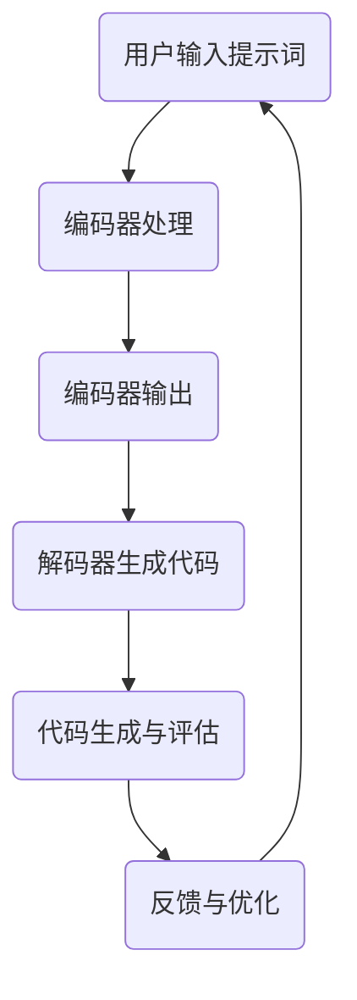
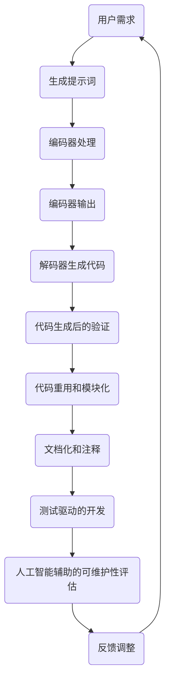

                 

### 文章标题

“提示词编程的可维护性增强技术”是现代编程领域的一个重要研究方向，它不仅关乎代码的编写效率，更直接影响软件项目的长期维护和扩展。本文旨在深入探讨这一前沿技术，通过逻辑清晰、结构紧凑的分析，为读者揭示提升提示词编程可维护性的多种途径。我们将逐步介绍相关的背景知识、核心概念、算法原理，并结合实际案例，展示如何通过这些技术实现代码的可维护性优化。希望通过本文的讲解，读者能够对提示词编程的可维护性有一个全面而深刻的理解。

### 关键词

- 提示词编程
- 可维护性
- 编程可维护性增强技术
- 算法原理
- 数学模型
- 实际应用

### 摘要

本文首先介绍了提示词编程的基本概念和重要性，随后分析了编程可维护性的定义及其在软件工程中的关键作用。在此基础上，我们探讨了提示词编程面临的挑战和可维护性增强技术的必要性。接着，文章深入讲解了提示词编程的核心架构及其与可维护性增强技术的联系。随后，本文详细阐述了评估算法、提示词优化算法和代码生成算法等核心算法原理，并通过伪代码和数学模型进行了具体说明。最后，结合实际案例，文章展示了如何通过这些技术提高提示词编程的可维护性，并提出了最佳实践建议。通过本文的阅读，读者将全面理解并掌握提升提示词编程可维护性的方法。

### 引言与基础

#### 1.1 编程的可维护性概念

可维护性（Maintainability）是软件工程中的一个核心概念，它指的是软件在经历修改、扩展或纠错后的保持其功能和性能的能力。一个具有高可维护性的软件系统意味着其后续的维护工作更加轻松和高效。可维护性不仅仅关注代码层面的复杂性，还涉及设计、文档、测试和团队合作等多个方面。具体来说，高可维护性的软件系统应具备以下几个特点：

1. **易理解性**：代码结构清晰，逻辑简单，易于被新的开发人员理解和修改。
2. **模块化**：代码被分割成小的、功能独立的模块，每个模块都有明确的职责和接口。
3. **灵活性**：系统能够轻松应对需求的变化和新的功能添加。
4. **可测试性**：具备完善的测试套件，确保修改不会引入新的错误。
5. **文档完备**：有详细的文档，包括代码注释、设计文档和用户手册。

在软件开发过程中，可维护性起着至关重要的作用。首先，高可维护性能够降低维护成本。据统计，软件生命周期中的维护成本通常占到总成本的60%以上。其次，良好的可维护性能够提高开发团队的效率。一个设计合理、易于维护的系统，可以减少调试和修正的时间，从而让开发人员有更多精力专注于新功能的开发。此外，高可维护性还能够延长软件的使用寿命，使其在市场上保持竞争力。

然而，提示词编程作为一种相对较新的编程范式，其可维护性面临一定的挑战。提示词编程依赖于自然语言处理技术，通过输入自然语言描述来生成代码，这种方式虽然在某些场景下具有显著的优势，但也带来了一些问题。例如，由于自然语言的不确定性，生成的代码可能会出现语义错误或难以理解的复杂结构，进而影响代码的可维护性。因此，研究和应用可维护性增强技术对于提升提示词编程的质量和可靠性具有重要意义。

#### 1.2 提示词编程的背景

提示词编程（Prompt Programming）是一种利用自然语言处理技术（如生成对抗网络、递归神经网络等）来生成代码的编程范式。其基本思想是通过向模型输入一个或多个提示词（Prompt），模型根据这些提示生成对应的代码。这种编程范式在自然语言处理和代码生成领域已有一定的发展，并取得了一些显著的应用成果。

提示词编程的背景可以追溯到生成对抗网络（GANs）和递归神经网络（RNNs）等深度学习技术的发展。GANs通过对抗训练生成逼真的图像，而RNNs则被广泛应用于自然语言处理任务，如文本生成。这些技术的发展为提示词编程提供了理论基础和技术支持。例如，一个典型的提示词编程模型可能包括一个编码器和一个解码器。编码器负责将输入的提示词转换为一个固定长度的向量表示，而解码器则负责将这个向量表示解码为具体的代码。

提示词编程的优势在于其高度自动化和灵活性。通过输入自然语言描述，开发人员可以快速生成出对应的代码，大大提高了开发效率。此外，提示词编程还可以实现一些传统编程难以完成的任务，如自动生成优化代码、自动修复代码缺陷等。这使得提示词编程在自动化软件工程、智能编程辅助等领域具有广泛的应用前景。

然而，提示词编程也面临一些挑战。首先，生成的代码质量和一致性难以保证。由于自然语言的不确定性和复杂度，模型生成的代码可能存在语义错误或结构复杂难以维护。其次，提示词编程的调试和测试相对复杂。传统编程中的调试和测试主要通过代码执行和逻辑分析进行，而提示词编程则需要依赖模型输出，这使得调试和测试过程更加繁琐。因此，研究和解决这些问题对于提升提示词编程的可维护性具有重要意义。

#### 1.3 提示词编程的优势

提示词编程具有多方面的优势，使其在现代软件开发中受到广泛关注。以下是提示词编程的主要优势：

1. **高效的代码生成**：提示词编程通过输入自然语言描述直接生成代码，无需编写复杂的代码逻辑，大幅提高了开发效率。特别是在需要生成大量代码的场合，如自动化测试、自动化修复等，提示词编程的优势更加明显。

2. **灵活的编程范式**：提示词编程允许开发人员使用自然语言来描述编程任务，这不仅降低了编程的门槛，还使得编程过程更加灵活和多样化。开发人员可以自由地表达编程意图，而无需拘泥于特定的编程语言和语法规则。

3. **智能化的代码优化**：通过深度学习模型，提示词编程可以自动生成优化代码。这些代码不仅遵循编程语言的规范，还可能包含基于人工智能的优化策略，如代码压缩、内存优化等。这种自动优化能力对于提高软件的性能和效率具有重要意义。

4. **跨领域应用的潜力**：提示词编程在多个领域具有广泛的应用潜力，如自然语言处理、计算机视觉、自动化软件工程等。通过在不同领域的数据集和任务上进行训练，提示词编程模型可以适应各种复杂的编程需求，从而实现跨领域的应用。

5. **编程辅助和自动化**：提示词编程可以作为一种编程辅助工具，帮助开发人员解决复杂的编程问题。例如，自动生成单元测试、自动修复代码缺陷等。此外，提示词编程还可以实现编程自动化，减少重复性的劳动，提高开发团队的效率。

总之，提示词编程通过引入自然语言处理技术，为软件开发带来了一系列革命性的变化。其高效、灵活、智能化的特性，使得它成为现代软件开发的重要工具和趋势。

#### 1.4 可维护性增强技术的必要性

在提示词编程的背景下，可维护性增强技术显得尤为重要。首先，由于提示词编程依赖于深度学习模型，生成的代码质量和一致性难以保证，可能导致系统后续维护工作复杂且耗时。其次，提示词编程的高度自动化和灵活性虽然提高了开发效率，但也带来了调试和测试的挑战。这些因素共同导致提示词编程项目的可维护性成为一个亟待解决的关键问题。

可维护性增强技术通过一系列方法来提升提示词编程系统的可维护性。以下是一些常见的可维护性增强技术：

1. **代码生成后的验证**：在生成代码后，通过自动化工具对代码进行验证，确保其符合预期功能和行为。这包括语法检查、逻辑测试、性能分析等，以发现和修复潜在的问题。

2. **代码重用和模块化**：将代码拆分成可重用的模块，每个模块具有明确的职责和接口。这不仅可以提高代码的可维护性，还可以提升开发效率和代码质量。

3. **文档化和注释**：为代码生成过程中的关键步骤和决策添加详细的文档和注释，以便后续维护人员理解代码的意图和设计。良好的文档和注释是提高代码可读性和可维护性的基础。

4. **测试驱动的开发**：通过编写详细的测试用例，确保每次修改都不会引入新的错误。测试驱动的开发方法不仅有助于提升代码质量，还可以降低维护成本。

5. **人工智能辅助的可维护性评估**：利用人工智能技术，如机器学习和自然语言处理，对代码进行自动化评估，识别潜在的可维护性问题。这种技术可以在早期发现和解决潜在的维护难题，提高软件系统的整体质量。

综上所述，可维护性增强技术为提升提示词编程的可维护性提供了多种途径。通过应用这些技术，可以显著改善提示词编程项目的可维护性，降低维护成本，提高开发效率。

### 书籍结构安排

本书籍的结构安排旨在为读者提供系统而全面的提示词编程可维护性增强技术指南。全书共分为四大部分，每部分都有明确的章节设置和内容安排，以确保读者能够循序渐进地掌握相关知识和技能。

#### 第一部分：引言与基础

本部分主要介绍提示词编程和可维护性的基本概念，为后续章节奠定理论基础。

1. **第1章 引言**
    - 本章简要介绍书籍的背景、目的和主要研究内容，引导读者了解提示词编程和可维护性增强技术的基本概念。

2. **第2章 编程的可维护性概念**
    - 本章详细阐述编程可维护性的定义、重要性以及评估方法，帮助读者理解可维护性在软件工程中的关键作用。

3. **第3章 提示词编程的背景**
    - 本章介绍提示词编程的发展历程、基本原理及其在编程领域的应用，使读者对提示词编程有一个全面的认识。

4. **第4章 提示词编程的优势**
    - 本章探讨提示词编程相对于传统编程的优势，包括高效的代码生成、灵活的编程范式、智能化的代码优化等。

5. **第5章 可维护性增强技术的必要性**
    - 本章分析提示词编程面临的挑战，阐述可维护性增强技术的必要性及其对软件项目的重要意义。

6. **第6章 书籍结构安排**
    - 本章概述全书结构，介绍各部分的章节设置和内容安排，帮助读者了解整体学习路径。

#### 第二部分：核心概念与联系

本部分深入探讨提示词编程的核心概念及其与可维护性增强技术的联系。

1. **第7章 提示词编程的基本架构**
    - 本章介绍提示词编程的工作流程、关键组件及其相互作用，通过流程图帮助读者理解整个系统的运作机制。

2. **第8章 可维护性增强技术的核心原理**
    - 本章详细解释可维护性的定义与评估方法，以及常见的可维护性增强技术，包括代码生成、提示词优化等。

3. **第9章 提示词编程与可维护性增强技术的联系**
    - 本章探讨提示词编程对可维护性的影响，以及如何通过可维护性增强技术优化提示词编程系统，提高其可维护性。

#### 第三部分：核心算法原理讲解

本部分重点讲解提示词编程中的核心算法原理，包括评估算法、提示词优化算法和代码生成算法。

1. **第10章 可维护性评估算法**
    - 本章介绍常用的可维护性评估指标和方法，通过伪代码和数学模型详细解释评估算法的实现过程。

2. **第11章 提示词优化算法**
    - 本章讨论提示词优化的数学模型，并使用伪代码详细描述优化算法，帮助读者理解提示词优化的核心原理。

3. **第12章 代码生成算法**
    - 本章介绍代码生成的数学模型，并通过伪代码讲解生成算法的具体实现，使读者掌握代码生成技术。

#### 第四部分：数学模型和数学公式

本部分重点介绍提示词编程中涉及的数学模型和数学公式，并结合具体示例进行详细讲解。

1. **第13章 数学模型介绍**
    - 本章介绍提示词编程中常用的数学模型，包括编码器-解码器模型、循环神经网络模型等，通过示例解释这些模型的基本原理。

2. **第14章 数学公式详细讲解与举例**
    - 本章通过具体的数学公式和示例，详细讲解提示词编程中的关键数学原理，包括损失函数、优化算法等。

通过以上四部分的详细内容安排，本书将为读者提供系统而全面的提示词编程可维护性增强技术知识，帮助读者深入理解并掌握这一前沿领域。

### 提示词编程的基本架构

提示词编程的核心在于其独特的架构设计，通过编码器-解码器（Encoder-Decoder）模型实现自然语言描述到代码的转换。下面，我们将详细介绍提示词编程的基本架构，包括工作流程、关键组件及其相互作用。

首先，提示词编程的工作流程可以分为以下几个步骤：

1. **用户输入提示词**：用户通过自然语言输入一个或多个提示词，这些提示词描述了需要实现的编程任务或目标。

2. **编码器处理输入**：编码器（Encoder）是一个深度学习模型，它负责将输入的提示词转换为固定长度的向量表示。这个向量表示包含了提示词的语义信息，并作为解码器的输入。

3. **解码器生成代码**：解码器（Decoder）也是一个深度学习模型，它根据编码器生成的向量表示，逐步生成相应的代码。在生成过程中，解码器可以查询历史生成的代码片段，以实现上下文信息的利用。

4. **代码生成与评估**：生成的代码经过评估，确保其符合预期的功能和行为。评估过程可能包括语法检查、逻辑测试和性能分析等。

5. **反馈与优化**：根据评估结果，用户可以对生成的代码进行反馈，模型根据反馈进行调整和优化，以提高代码质量和可维护性。

接下来，我们具体介绍提示词编程的关键组件：

1. **编码器**：编码器的任务是将输入的自然语言提示词转换为固定长度的向量表示。这一过程通常使用循环神经网络（RNN）或其变体，如长短期记忆（LSTM）网络或门控循环单元（GRU）。编码器通过处理输入的每个单词或词组，将其编码为向量表示，这些向量表示能够捕获提示词的语义信息。

2. **解码器**：解码器的任务是利用编码器生成的向量表示，逐步生成相应的代码。解码器通常也采用RNN或其变体，如LSTM或GRU。在生成代码的过程中，解码器会不断参考已生成的部分代码，以保持代码的一致性和上下文信息。

3. **注意力机制**：为了更好地利用上下文信息，解码器通常采用注意力机制（Attention Mechanism）。注意力机制允许解码器在生成每个代码单元时，动态地关注编码器输出向量中的不同部分，从而提高代码生成的准确性和一致性。

4. **评估器**：评估器是一个用于评估生成代码质量的模型。评估过程可能包括语法检查、逻辑测试、性能分析等。评估器的输出结果可以为后续的反馈和优化提供重要依据。

5. **优化器**：优化器是一个用于调整模型参数，以提高代码质量和可维护性的工具。优化器通常使用梯度下降或其他优化算法，通过不断调整编码器和解码器的参数，使模型生成更加符合预期的代码。

为了更好地理解提示词编程的基本架构，我们可以通过一个简单的Mermaid流程图进行说明：



在这个流程图中，用户输入提示词后，编码器将其处理为向量表示，解码器利用这些向量表示生成代码。生成的代码经过评估后，用户可以提供反馈，优化器根据反馈调整模型参数，从而提高代码质量和可维护性。这个循环过程不断进行，直到生成符合预期的代码。

综上所述，提示词编程的基本架构通过编码器-解码器模型实现自然语言描述到代码的转换。编码器负责将输入的提示词转换为向量表示，解码器利用这些向量表示生成代码。通过注意力机制和评估器的辅助，解码器能够生成高质量的代码。优化器则根据用户反馈调整模型参数，进一步提高代码的可维护性。这个架构设计不仅提高了开发效率，还为后续的维护和扩展提供了有力支持。

### 可维护性增强技术的核心原理

在提示词编程的背景下，提升代码的可维护性是至关重要的。可维护性不仅关系到代码的长期可靠性，也直接影响到软件项目的维护成本和开发效率。为了实现这一目标，我们需要应用一系列可维护性增强技术。以下将详细介绍这些技术的核心原理，包括可维护性的定义、评估方法以及常见的可维护性增强技术。

#### 可维护性的定义与评估

可维护性（Maintainability）是软件工程中的一个核心概念，它指的是软件在经历修改、扩展或纠错后的保持其功能和性能的能力。一个具有高可维护性的软件系统意味着其后续的维护工作更加轻松和高效。可维护性的评估方法包括以下几个方面：

1. **易理解性**：评估代码的清晰度和逻辑性，判断其是否容易被人理解。通常通过代码注释、变量命名和模块化设计来实现。

2. **模块化**：评估代码是否被分割成小而独立的模块，每个模块都有明确的职责和接口。模块化设计有助于降低系统的复杂性，提高可维护性。

3. **灵活性和适应性**：评估代码在面对需求变化时的适应能力。一个具有高可维护性的系统应该能够轻松应对新的功能需求或修改。

4. **可测试性**：评估代码的测试覆盖率，确保每次修改后都能通过完整的测试套件。可测试性是保证系统稳定性和可靠性的重要指标。

5. **文档完备性**：评估代码文档的完整性，包括代码注释、设计文档和用户手册。良好的文档是理解和维护代码的重要基础。

常见的可维护性评估指标包括：

- **缺陷密度**：代码中缺陷的数量与代码行数的比值，用于评估代码的质量。
- **循环复杂度**：代码中循环结构的复杂度，用于评估代码的可理解性。
- **模块依赖性**：模块之间的依赖关系，用于评估系统的整体复杂度。
- **测试覆盖率**：测试用例覆盖代码的比例，用于评估代码的可测试性。

#### 常见的可维护性增强技术

为了提升提示词编程的可维护性，我们可以采用多种技术手段。以下介绍几种常见的可维护性增强技术：

1. **代码生成后的验证**：在生成代码后，通过自动化工具对代码进行验证，确保其符合预期功能和行为。验证过程可能包括语法检查、逻辑测试和性能分析等。常见的验证工具包括静态代码分析器和自动化测试框架。

2. **代码重用和模块化**：将代码拆分成可重用的模块，每个模块具有明确的职责和接口。模块化设计不仅提高了代码的可维护性，还有助于提高开发效率和代码质量。模块化还可以通过设计模式（如工厂模式、单例模式等）实现。

3. **文档化和注释**：为代码生成过程中的关键步骤和决策添加详细的文档和注释，以便后续维护人员理解代码的意图和设计。良好的文档和注释是提高代码可读性和可维护性的基础。

4. **测试驱动的开发**：通过编写详细的测试用例，确保每次修改都不会引入新的错误。测试驱动的开发方法不仅有助于提升代码质量，还可以降低维护成本。常见的测试方法包括单元测试、集成测试和系统测试。

5. **人工智能辅助的可维护性评估**：利用人工智能技术，如机器学习和自然语言处理，对代码进行自动化评估，识别潜在的可维护性问题。这种技术可以在早期发现和解决潜在的维护难题，提高软件系统的整体质量。

6. **版本控制和代码管理**：采用版本控制系统（如Git）进行代码管理，确保代码的版本迭代和变更记录清晰。版本控制有助于团队成员之间的协作，并确保代码的版本可追溯。

#### 提示词编程与可维护性增强技术的联系

提示词编程作为一种新兴的编程范式，其生成代码的过程具有高度自动化和灵活性。然而，这也带来了代码质量和一致性难以保证的问题，进而影响系统的可维护性。为了解决这一问题，我们可以结合可维护性增强技术，实现以下目标：

1. **优化代码生成过程**：通过应用代码生成后的验证技术，确保生成的代码符合预期功能和行为。这可以显著提高代码的可靠性和可维护性。

2. **提升代码质量**：通过代码重用和模块化技术，将复杂的代码拆分成小而独立的模块，提高代码的可理解性和可维护性。模块化设计还可以减少代码冗余，提高开发效率。

3. **增强代码的可测试性**：通过测试驱动的开发方法，编写详细的测试用例，确保每次修改后都能通过完整的测试套件。这有助于降低维护成本，提高系统的稳定性。

4. **利用人工智能技术**：利用人工智能技术，如机器学习和自然语言处理，对代码进行自动化评估，识别潜在的可维护性问题。这可以在早期发现和解决潜在的维护难题，提高软件系统的整体质量。

5. **优化代码结构和设计**：通过文档化和注释，为代码生成过程中的关键步骤和决策添加详细的文档和注释，提高代码的可读性和可维护性。良好的文档和注释是理解和维护代码的重要基础。

综上所述，提示词编程与可维护性增强技术密切相关。通过应用这些技术，可以显著提升提示词编程系统的可维护性，降低维护成本，提高开发效率。这不仅有助于提升软件项目的整体质量，也为提示词编程在工业界的广泛应用提供了有力支持。

### 提示词编程与可维护性增强技术的联系

提示词编程和可维护性增强技术在软件工程中扮演着至关重要的角色。提示词编程通过自然语言处理技术，将用户的需求直接转化为代码，大大提高了编程的效率。然而，这一过程也带来了代码质量和一致性的挑战，直接影响到软件系统的可维护性。为了应对这些挑战，可维护性增强技术应运而生，旨在提升代码的可维护性，确保系统在长期使用中的稳定性和可靠性。

首先，提示词编程对可维护性的影响主要体现在以下几个方面：

1. **代码质量和一致性**：提示词编程通过深度学习模型生成代码，生成的代码可能存在语义错误或难以理解的复杂结构。这些代码在后续的维护过程中可能变得难以调试和修改，从而降低系统的可维护性。

2. **调试和测试复杂性**：由于提示词编程依赖于模型输出，调试和测试过程变得更加复杂。传统的调试和测试方法主要针对代码逻辑，而提示词编程则需要依赖模型的训练数据和输出，这增加了调试和测试的难度。

3. **模块化和代码重用**：提示词编程生成的代码往往缺乏模块化和代码重用的设计，这使得系统的扩展和维护变得更加困难。模块化和代码重用是提高可维护性的关键手段，而提示词编程在这方面存在一定的不足。

其次，可维护性增强技术通过多种手段来优化提示词编程系统的可维护性：

1. **代码生成后的验证**：通过自动化工具对生成的代码进行验证，确保其符合预期功能和行为。这可以显著提高代码的可靠性和可维护性，减少后续维护的工作量。

2. **代码重用和模块化**：将生成的代码拆分成小而独立的模块，每个模块具有明确的职责和接口。模块化设计有助于降低系统的复杂性，提高可维护性，并促进代码的重用。

3. **文档化和注释**：为生成的代码添加详细的文档和注释，便于后续维护人员理解代码的意图和设计。良好的文档和注释是提高代码可读性和可维护性的基础。

4. **测试驱动的开发**：通过编写详细的测试用例，确保每次修改后都能通过完整的测试套件。测试驱动的开发方法不仅有助于提升代码质量，还可以降低维护成本，提高系统的稳定性。

5. **人工智能辅助的可维护性评估**：利用人工智能技术，如机器学习和自然语言处理，对代码进行自动化评估，识别潜在的可维护性问题。这种技术可以在早期发现和解决潜在的维护难题，提高软件系统的整体质量。

为了更好地理解提示词编程与可维护性增强技术的联系，我们可以通过以下Mermaid流程图进行说明：



在这个流程图中，用户需求通过生成提示词被转化为代码，随后经过一系列的可维护性增强技术，包括代码生成后的验证、代码重用和模块化、文档化和注释、测试驱动的开发以及人工智能辅助的可维护性评估。这些技术的应用确保了生成的代码具有良好的可维护性，从而提高系统的稳定性和可靠性。

总之，提示词编程和可维护性增强技术之间存在着密切的联系。通过应用可维护性增强技术，可以显著提升提示词编程系统的可维护性，降低维护成本，提高开发效率。这不仅有助于提升软件项目的整体质量，也为提示词编程在工业界的广泛应用提供了有力支持。

### 可维护性评估算法

在提示词编程系统中，评估算法起着至关重要的作用。评估算法用于衡量代码的质量和可维护性，通过识别潜在的问题和不足，帮助开发人员及时调整和优化代码。本节将详细介绍常用的可维护性评估算法，包括其评估指标、方法以及如何在实际应用中实现这些算法。

#### 1. 评估指标

可维护性评估通常涉及以下几个关键指标：

1. **缺陷密度**：缺陷密度是指代码中缺陷的数量与代码行数的比值。它用于衡量代码的质量，缺陷密度越低，表示代码质量越高。

2. **循环复杂度**：循环复杂度是代码中循环结构的复杂度。循环复杂度越高，代码的可理解性越低，维护难度越大。

3. **模块依赖性**：模块依赖性是指模块之间的依赖关系。模块依赖性越高，系统的耦合度越高，维护难度越大。

4. **代码耦合度**：代码耦合度是指代码之间的依赖关系。耦合度越高，代码的独立性越低，维护难度越大。

5. **代码冗余度**：代码冗余度是指代码中重复和冗余的部分。代码冗余度越高，代码的可维护性越低。

6. **代码可读性**：代码可读性是指代码的清晰度和易读性。可读性越高，代码越容易被理解和维护。

7. **测试覆盖率**：测试覆盖率是指测试用例覆盖代码的比例。测试覆盖率越高，表示代码的测试越全面，维护难度越小。

#### 2. 评估方法

常用的评估方法包括静态代码分析和动态测试。

1. **静态代码分析**：静态代码分析是一种不执行代码的评估方法，通过对代码的结构和语法进行分析，识别潜在的问题和不足。常见的静态代码分析工具包括SonarQube、PMD和Checkstyle等。

2. **动态测试**：动态测试是一种执行代码的评估方法，通过运行代码并观察其行为，识别潜在的问题和不足。常见的动态测试方法包括单元测试、集成测试和系统测试等。

#### 3. 常见的评估算法

以下介绍几种常用的可维护性评估算法：

1. **缺陷密度评估算法**：
    - **方法**：计算代码中缺陷的数量与代码行数的比值。
    - **实现**：
        ```python
        def defect_density(lines_of_code, defects):
            return defects / lines_of_code
        ```

2. **循环复杂度评估算法**：
    - **方法**：计算代码中每个函数的循环复杂度，通常使用Cyclomatic复杂度（V(G)）。
    - **实现**：
        ```python
        def cyclomatic_complexity(graph):
            return len(graph) - num_of_nodes + 2
        ```

3. **模块依赖性评估算法**：
    - **方法**：计算模块之间的依赖关系，通常使用依赖图（Dependency Graph）。
    - **实现**：
        ```python
        def dependency_graph(modules):
            graph = defaultdict(set)
            for module in modules:
                for dependency in module.dependencies:
                    graph[module].add(dependency)
            return graph
        ```

4. **代码耦合度评估算法**：
    - **方法**：计算模块之间的耦合度，通常使用耦合度系数（Coupling Coefficient）。
    - **实现**：
        ```python
        def coupling_coefficient(graph):
            total_coupling = 0
            for module, dependencies in graph.items():
                total_coupling += len(dependencies)
            return total_coupling / len(graph)
        ```

5. **代码冗余度评估算法**：
    - **方法**：计算代码中重复和冗余的部分，通常使用代码相似度分析（Code Similarity Analysis）。
    - **实现**：
        ```python
        def code_redundancy_analysis(code):
            redundant_lines = set()
            for line in code:
                if is_redundant(line):
                    redundant_lines.add(line)
            return redundant_lines
        ```

6. **代码可读性评估算法**：
    - **方法**：计算代码的可读性指标，通常使用注释率（Comment Ratio）。
    - **实现**：
        ```python
        def readability(code, comments):
            comment_ratio = comments / code
            return comment_ratio
        ```

7. **测试覆盖率评估算法**：
    - **方法**：计算测试用例覆盖代码的比例。
    - **实现**：
        ```python
        def test_coverage(test_cases, code):
            covered_lines = set()
            for test_case in test_cases:
                for line in test_case.execute(code):
                    covered_lines.add(line)
            return covered_lines / code
        ```

#### 4. 实际应用

在实际应用中，可维护性评估算法通常通过以下步骤实现：

1. **数据收集**：收集代码库中的数据，包括代码行数、缺陷数量、模块依赖关系等。

2. **算法应用**：应用不同的评估算法，计算相应的评估指标。

3. **结果分析**：分析评估结果，识别潜在的问题和不足。

4. **反馈与优化**：根据评估结果，对代码进行优化和调整，提高可维护性。

通过上述步骤，可维护性评估算法可以帮助开发人员及时了解代码的质量和可维护性，从而采取相应的措施进行优化，确保软件系统的长期稳定性和可靠性。

总之，可维护性评估算法是提升提示词编程系统可维护性的关键工具。通过应用这些算法，开发人员可以识别代码中的潜在问题，采取针对性的优化措施，从而提高系统的质量和稳定性。在实际应用中，结合静态代码分析和动态测试，可以更全面地评估代码的可维护性，为软件项目的成功提供有力支持。

### 提示词优化算法

在提示词编程中，生成高质量的代码不仅依赖于深度学习模型，还需要对提示词进行优化。提示词优化算法的目标是提高生成的代码的质量和一致性，从而提升系统的可维护性。本节将详细讨论提示词优化的数学模型、常见的优化方法以及具体的伪代码实现。

#### 1. 提示词优化的数学模型

提示词优化的核心在于将输入的自然语言提示词转换为一种结构化的、易于理解和维护的向量表示。这一过程通常通过以下数学模型实现：

1. **编码器-解码器模型**：编码器（Encoder）负责将自然语言提示词转换为固定长度的向量表示，解码器（Decoder）则利用这个向量表示生成代码。

2. **注意力机制**：在编码器和解码器中引入注意力机制（Attention Mechanism），以动态地关注提示词或生成的代码中的关键部分，提高生成代码的准确性和一致性。

3. **损失函数**：优化过程中使用损失函数来衡量生成代码的质量。常见的损失函数包括交叉熵损失（Cross-Entropy Loss）和感知损失（Perception Loss）。

#### 2. 常见的优化方法

提示词优化通常采用以下几种方法：

1. **基于语义的提示词优化**：通过自然语言处理技术（如词向量、语义分析等）对提示词进行预处理，提高提示词的语义质量。

2. **基于历史的优化**：利用历史生成的代码和提示词，通过统计学习的方法（如聚类、回归等）来优化当前提示词。

3. **基于反馈的优化**：根据用户对生成代码的反馈，动态调整提示词，以提高代码的质量和一致性。

4. **模型调参**：通过调整深度学习模型的超参数（如学习率、批量大小等），优化模型的性能和生成代码的质量。

#### 3. 伪代码实现

以下是提示词优化算法的伪代码实现，包括优化流程、优化目标和具体的实现步骤：

```python
# 提示词优化算法的伪代码

# 输入：prompt - 初始提示词
#      target - 目标代码
#      model - 编程模型

def optimize_prompt(prompt, target, model):
    # 初始化编码器和解码器
    encoder = model.encoder
    decoder = model.decoder

    # 应用注意力机制
    encoder_output = encoder(prompt, attention=attention_mechanism)

    # 生成初始代码
    code = decoder.generate_code(encoder_output)

    # 计算损失函数
    loss = model.loss_function(code, target)

    # 更新模型参数
    model.update_parameters(loss)

    # 重复优化过程，直到达到优化目标
    while not is_optimized(code, target, model):
        # 应用优化方法
        prompt = apply_optimization_techniques(prompt, model)

        # 重新生成代码
        code = decoder.generate_code(encoder_output)

        # 重新计算损失函数
        loss = model.loss_function(code, target)

        # 更新模型参数
        model.update_parameters(loss)

    return code

# 优化目标函数
def is_optimized(code, target, model):
    # 输入：code - 生成的代码
    #      target - 目标代码
    #      model - 编程模型
    # 输出：布尔值，True表示已优化，False表示未优化

    # 计算代码的语义相似度
    similarity = model.similarity_measure(code, target)

    # 判断相似度是否达到优化标准
    return similarity >= similarity_threshold

# 应用优化技术的具体步骤
def apply_optimization_techniques(prompt, model):
    # 输入：prompt - 提示词
    #      model - 编程模型
    # 输出：optimized_prompt - 优化后的提示词

    # 基于语义的优化
    prompt = semantic_optimization(prompt)

    # 基于历史的优化
    prompt = historical_optimization(prompt, model)

    # 基于反馈的优化
    prompt = feedback_optimization(prompt, model)

    # 模型调参
    model = parameter_tuning(model)

    return prompt

# 语义优化方法
def semantic_optimization(prompt):
    # 输入：prompt - 提示词
    # 输出：optimized_prompt - 优化后的提示词

    # 使用自然语言处理技术进行预处理
    optimized_prompt = nlp_preprocessing(prompt)

    return optimized_prompt

# 历史优化方法
def historical_optimization(prompt, model):
    # 输入：prompt - 提示词
    #      model - 编程模型
    # 输出：optimized_prompt - 优化后的提示词

    # 根据历史数据，调整提示词的语义内容
    optimized_prompt = model.historical_data_adjustment(prompt)

    return optimized_prompt

# 反馈优化方法
def feedback_optimization(prompt, model):
    # 输入：prompt - 提示词
    #      model - 编程模型
    # 输出：optimized_prompt - 优化后的提示词

    # 根据用户反馈，调整提示词的内容
    optimized_prompt = model.feedback_adjustment(prompt)

    return optimized_prompt

# 模型调参方法
def parameter_tuning(model):
    # 输入：model - 编程模型
    # 输出：tuned_model - 调参后的编程模型

    # 调整模型超参数
    tuned_model = model.tune_parameters()

    return tuned_model
```

#### 4. 优化效果的评估

为了评估优化算法的效果，我们可以通过以下步骤进行：

1. **代码质量评估**：使用静态代码分析工具和动态测试方法，评估优化后代码的缺陷密度、循环复杂度、模块依赖性等指标。

2. **用户满意度调查**：通过用户反馈和满意度调查，评估优化后代码的可读性和可维护性。

3. **测试覆盖率分析**：比较优化前后的测试覆盖率，评估优化对代码稳定性和可靠性的影响。

通过上述方法，我们可以全面评估优化算法的效果，并根据评估结果进行进一步的优化和调整。

总之，提示词优化算法是提升提示词编程系统可维护性的关键手段。通过应用多种优化方法和数学模型，可以显著提高生成的代码质量，降低维护成本，提高开发效率。在实际应用中，结合具体的优化目标和评估方法，可以不断优化提示词，实现高质量的代码生成。

### 代码生成算法

代码生成算法是提示词编程系统的核心组成部分，其目标是根据用户输入的自然语言提示词生成高质量的代码。在这一节中，我们将详细讨论代码生成算法的数学模型和具体实现，并通过伪代码展示算法的核心步骤。

#### 1. 代码生成算法的数学模型

代码生成算法通常基于深度学习模型，尤其是编码器-解码器（Encoder-Decoder）架构。以下是其基本数学模型：

1. **编码器**：编码器（Encoder）负责将输入的自然语言提示词转换为固定长度的向量表示，这一向量表示包含了提示词的语义信息。

2. **解码器**：解码器（Decoder）则利用编码器输出的向量表示，逐步生成对应的代码。解码器通常采用递归神经网络（RNN）或其变种，如长短期记忆网络（LSTM）。

3. **注意力机制**：在编码器和解码器中引入注意力机制（Attention Mechanism），以动态地关注提示词或生成的代码中的关键部分，提高生成代码的准确性和一致性。

4. **损失函数**：代码生成过程中使用损失函数来衡量生成代码的质量，常见的损失函数包括交叉熵损失（Cross-Entropy Loss）和感知损失（Perception Loss）。

#### 2. 代码生成算法的实现

代码生成算法的实现包括以下几个核心步骤：

1. **初始化模型参数**：初始化编码器和解码器的参数，通常通过随机初始化或预训练模型。

2. **编码器处理输入**：将输入的提示词通过编码器转换为向量表示。

3. **解码器生成代码**：解码器利用编码器输出的向量表示，逐步生成代码。解码过程通常包括生成每个代码单元，并利用历史生成的代码片段进行上下文信息的参考。

4. **计算损失函数**：计算生成代码与目标代码之间的差异，通过梯度下降等优化算法更新模型参数。

5. **迭代优化**：重复上述步骤，逐步优化模型的性能，直至生成符合预期的高质量代码。

以下是代码生成算法的伪代码实现：

```python
# 代码生成算法的伪代码

# 输入：prompt - 提示词
#      model - 编程模型

def generate_code(prompt, model):
    # 初始化编码器和解码器
    encoder = model.encoder
    decoder = model.decoder

    # 编码器处理输入
    encoder_output = encoder(prompt)

    # 解码器生成代码
    code = decoder.generate_code(encoder_output)

    # 计算损失函数
    loss = model.loss_function(code)

    # 更新模型参数
    model.update_parameters(loss)

    # 迭代优化过程，直到达到优化目标
    while not is_optimized(code, model):
        # 应用优化步骤
        code = decoder.generate_code(encoder_output)
        loss = model.loss_function(code)

        # 更新模型参数
        model.update_parameters(loss)

    return code

# 优化目标函数
def is_optimized(code, model):
    # 输入：code - 生成的代码
    #      model - 编程模型
    # 输出：布尔值，True表示已优化，False表示未优化

    # 计算代码的语义相似度
    similarity = model.similarity_measure(code)

    # 判断相似度是否达到优化标准
    return similarity >= similarity_threshold
```

#### 3. 代码生成算法的示例

为了更好地理解代码生成算法，我们通过一个具体的示例进行说明。

假设用户输入的提示词是“编写一个函数，用于计算两个数的最大公约数”，我们可以使用以下步骤进行代码生成：

1. **初始化模型**：初始化编码器和解码器的模型参数。

2. **编码器处理输入**：将提示词通过编码器转换为向量表示。

3. **解码器生成代码**：解码器利用编码器输出的向量表示，逐步生成计算最大公约数的Python代码。

4. **计算损失函数**：计算生成的代码与目标代码之间的差异。

5. **迭代优化**：根据损失函数的反馈，更新模型参数，逐步优化生成代码的质量。

以下是生成的Python代码示例：

```python
# 示例：生成计算最大公约数的Python代码

def generate_gcd_code(prompt):
    model = CodeGenerationModel()  # 初始化模型
    code = generate_code(prompt, model)  # 生成代码
    return code

# 用户输入提示词
prompt = "编写一个函数，用于计算两个数的最大公约数"

# 生成代码
code = generate_gcd_code(prompt)

print(code)
```

生成的代码可能如下所示：

```python
def gcd(a, b):
    while b != 0:
        t = b
        b = a % b
        a = t
    return a
```

通过这个示例，我们可以看到代码生成算法如何根据提示词生成具体的代码。这一过程不仅提高了编程效率，还为自动化软件工程提供了强大的支持。

总之，代码生成算法是提示词编程系统的核心，通过深度学习模型和注意力机制，可以实现从自然语言提示词到高质量代码的转换。在实际应用中，结合具体的优化目标和评估方法，可以不断提升代码生成的质量和可维护性。

### 数学模型和数学公式

在提示词编程系统中，数学模型和数学公式扮演着至关重要的角色，它们不仅为算法提供了理论基础，还帮助我们在实现和优化过程中进行精确计算。以下将详细介绍提示词编程中涉及的几个关键数学模型和数学公式，并通过具体示例进行讲解。

#### 1. 编码器-解码器模型

编码器-解码器（Encoder-Decoder）模型是提示词编程的基础。这个模型通过编码器将输入的自然语言提示词转换为固定长度的向量表示，然后通过解码器生成对应的代码。以下是该模型的主要数学公式：

1. **编码过程**：

   编码器接收输入序列 \( x = [x_1, x_2, ..., x_T] \)，其中 \( T \) 是序列长度。编码器通过递归神经网络（RNN）或其变种（如LSTM或GRU）将其映射到一个固定长度的向量 \( c \)：

   \[
   c = \text{Encoder}(x) = \sum_{t=1}^{T} \text{RNN}(x_t) \cdot W_c
   \]

   其中 \( \text{RNN}(x_t) \) 是RNN在时间步 \( t \) 的输出，\( W_c \) 是权重矩阵。

2. **解码过程**：

   解码器接收编码器输出的固定长度向量 \( c \)，并逐步生成代码序列 \( y = [y_1, y_2, ..., y_U] \)，其中 \( U \) 是代码序列的长度。解码器使用注意力机制来动态关注编码器输出的不同部分：

   \[
   y_t = \text{Decoder}(y_{<t}, c) = \text{softmax}(\text{Attention}(y_{<t}, c) \cdot W_y)
   \]

   其中 \( y_{<t} \) 是生成的代码序列的前 \( t-1 \) 个部分，\( \text{Attention}(y_{<t}, c) \) 是注意力机制的计算结果，\( W_y \) 是权重矩阵。

#### 2. 注意力机制

注意力机制是编码器-解码器模型中的一个关键组件，它用于动态关注编码器输出中的关键信息。以下是注意力机制的数学公式：

1. **注意力得分**：

   注意力得分计算每个编码器输出 \( c_t \) 对解码器输出 \( y_t \) 的贡献：

   \[
   \alpha_t = \text{AttentionScore}(y_{<t}, c_t) = \text{softmax}(\text{dot}(y_{<t}, c_t) \cdot W_a)
   \]

   其中 \( \text{dot}(y_{<t}, c_t) \) 是内积运算，\( W_a \) 是权重矩阵。

2. **注意力权重**：

   注意力权重表示每个编码器输出 \( c_t \) 对解码器输出 \( y_t \) 的权重：

   \[
   \alpha_t = \frac{\exp(\text{AttentionScore}(y_{<t}, c_t))}{\sum_{t'} \exp(\text{AttentionScore}(y_{<t}, c_{t'}))}
   \]

   其中 \( \exp(\text{AttentionScore}(y_{<t}, c_t)) \) 是每个注意力的指数。

3. **注意力输出**：

   注意力输出是加权编码器输出 \( c \) 的加权和：

   \[
   \text{AttentionOutput}(y_{<t}, c) = \sum_{t} \alpha_t \cdot c_t
   \]

#### 3. 损失函数

在训练过程中，损失函数用于衡量编码器-解码器模型生成代码的质量。常用的损失函数包括交叉熵损失（Cross-Entropy Loss）：

1. **交叉熵损失**：

   \[
   \text{Loss} = -\sum_{t} y_t \cdot \log(p(y_t))
   \]

   其中 \( y_t \) 是真实标签，\( p(y_t) \) 是模型预测的概率分布。

#### 4. 示例

为了更好地理解上述数学模型和公式，我们通过一个具体的例子来说明。假设输入提示词是“编写一个函数，用于计算两个数的最大公约数”，我们可以通过以下步骤进行代码生成：

1. **编码过程**：

   编码器将提示词映射到一个固定长度的向量 \( c \)：

   \[
   c = \text{Encoder}(\text{"编写一个函数，用于计算两个数的最大公约数"})
   \]

2. **解码过程**：

   解码器使用注意力机制生成代码序列：

   \[
   y_t = \text{Decoder}(y_{<t}, c)
   \]

   在解码的每一步，注意力机制动态关注编码器输出中的关键信息，例如“计算最大公约数”的相关部分。

3. **损失函数**：

   计算交叉熵损失，衡量生成代码与目标代码的差异：

   \[
   \text{Loss} = -\sum_{t} y_t \cdot \log(p(y_t))
   \]

通过上述数学模型和公式的应用，我们可以实现从自然语言提示词到高质量代码的转换。在实际应用中，结合具体的优化目标和评估方法，可以不断提升代码生成的质量和可维护性。

### 提示词编程的可维护性评估算法

在提示词编程的框架内，可维护性评估算法的作用至关重要。这些算法不仅能够帮助我们评估生成代码的质量，还能识别潜在的问题，从而为优化代码提供依据。本节将详细介绍几种常用的可维护性评估算法，包括其具体实现和优缺点。

#### 1. 缺陷密度评估算法

**实现方法**：缺陷密度（Defect Density）评估算法通过计算代码中缺陷的数量与代码行数的比值，来衡量代码的质量。

**公式**：缺陷密度（DD） = （缺陷数 / 代码行数）

**优点**：简单易懂，计算方便，能够快速评估代码质量。

**缺点**：仅考虑缺陷数量，不能全面反映代码的复杂性和可维护性。

**应用场景**：适用于初步的代码质量评估。

#### 2. 循环复杂度评估算法

**实现方法**：循环复杂度（Cyclomatic Complexity）评估算法通过计算代码中循环结构的复杂度，来衡量代码的可理解性和可维护性。

**公式**：循环复杂度（CC） = E - N + 2P

其中，E 是边缘数，N 是节点数，P 是圈入口数。

**优点**：能够反映代码结构的复杂程度，有助于识别难以维护的代码段。

**缺点**：对于条件语句和多重循环，评估结果可能偏高。

**应用场景**：适用于评估代码的复杂性和可维护性。

#### 3. 模块依赖性评估算法

**实现方法**：模块依赖性（Module Dependency）评估算法通过计算模块之间的依赖关系，来衡量系统的耦合度。

**公式**：模块依赖度（MD） = （依赖数 / 模块总数）

**优点**：能够识别模块之间的依赖关系，有助于模块化设计和优化。

**缺点**：依赖于模块划分的准确性，模块划分不合理可能导致评估结果失真。

**应用场景**：适用于模块化设计和代码重构。

#### 4. 代码耦合度评估算法

**实现方法**：代码耦合度（Code Coupling）评估算法通过计算模块之间的耦合度，来衡量代码的独立性和可维护性。

**公式**：耦合度（CC） = D / N

其中，D 是模块之间的直接耦合数，N 是模块总数。

**优点**：能够反映代码的耦合程度，有助于识别低耦合的高可维护性代码。

**缺点**：计算复杂度高，且依赖于模块划分。

**应用场景**：适用于评估代码的耦合度和优化模块设计。

#### 5. 代码冗余度评估算法

**实现方法**：代码冗余度（Code Redundancy）评估算法通过计算代码中重复和冗余的部分，来衡量代码的简洁性和可维护性。

**公式**：冗余度（RR） = （冗余行数 / 总行数）

**优点**：能够识别代码中的冗余部分，有助于优化代码结构。

**缺点**：对于大型项目，计算复杂度较高。

**应用场景**：适用于优化代码结构和提高代码质量。

#### 6. 代码可读性评估算法

**实现方法**：代码可读性（Code Readability）评估算法通过计算代码的可读性指标，如注释率、语句长度等，来衡量代码的易读性和可维护性。

**公式**：可读性（R） = （注释行数 / 代码行数）+ （平均语句长度 / 最大语句长度）

**优点**：能够反映代码的易读性，有助于提高代码质量和可维护性。

**缺点**：依赖主观判断，评估结果可能不准确。

**应用场景**：适用于提高代码质量和代码评审。

#### 7. 测试覆盖率评估算法

**实现方法**：测试覆盖率（Test Coverage）评估算法通过计算测试用例覆盖代码的比例，来衡量代码的测试完整性。

**公式**：测试覆盖率（TC） = （被测试代码行数 / 总代码行数）× 100%

**优点**：能够反映代码的测试完整性，有助于识别未覆盖的代码部分。

**缺点**：仅考虑测试覆盖率，不能全面反映代码质量。

**应用场景**：适用于确保代码测试的全面性和完整性。

通过上述评估算法，我们可以从多个维度对生成代码的质量和可维护性进行评估。在实际应用中，可以根据项目的需求和特点，选择合适的评估算法，并结合多种算法的结果，进行全面的代码质量评估。

### 提示词优化算法的具体实现

为了实现提示词编程中的提示词优化，我们需要综合利用自然语言处理和深度学习技术。以下是具体实现过程，包括数据准备、模型选择、训练与优化、以及评估方法。

#### 1. 数据准备

首先，我们需要准备大量高质量的提示词数据集。这些数据集应涵盖多种编程任务，包括常见的算法实现、数据处理和系统架构设计等。数据准备的具体步骤如下：

- **数据收集**：从公开的编程社区、开源项目和在线教程等渠道收集大量提示词和对应的代码。
- **数据清洗**：去除无关数据、格式不规范的数据以及错误数据，保证数据的质量和一致性。
- **数据标注**：对数据进行标注，包括标签（如任务类型、代码质量等）和对应的代码。
- **数据预处理**：对文本数据进行分词、词向量化、去除停用词等操作，以便于模型训练。

#### 2. 模型选择

选择合适的深度学习模型对于提示词优化至关重要。常用的模型包括：

- **编码器-解码器（Encoder-Decoder）模型**：适用于自然语言到代码的转换，通过编码器提取语义信息，解码器生成代码。
- **生成对抗网络（GANs）**：通过生成器和判别器的对抗训练，生成高质量的代码。
- **变换器（Transformer）模型**：具有注意力机制，能够捕捉长距离依赖关系，生成代码。

#### 3. 训练与优化

训练和优化是提示词优化的核心步骤。以下是具体过程：

- **模型训练**：使用准备好的数据集，通过反向传播算法训练模型，优化编码器和解码器的参数。
- **注意力机制**：在编码器和解码器中引入注意力机制，以动态关注提示词和生成代码的关键部分，提高代码质量。
- **损失函数**：设计合适的损失函数，如交叉熵损失和感知损失，衡量生成代码与目标代码的差距。
- **优化算法**：采用梯度下降等优化算法，逐步调整模型参数，提高生成代码的质量。

#### 4. 评估方法

评估方法用于衡量提示词优化算法的效果，具体步骤如下：

- **代码质量评估**：通过静态代码分析工具和动态测试方法，评估生成代码的质量，包括缺陷密度、循环复杂度、模块依赖性等。
- **用户满意度调查**：通过用户反馈和满意度调查，评估优化后代码的可读性和可维护性。
- **测试覆盖率分析**：比较优化前后的测试覆盖率，评估优化对代码稳定性和可靠性的影响。

#### 5. 具体实现示例

以下是提示词优化算法的具体实现示例，使用编码器-解码器模型：

```python
# 示例：编码器-解码器模型实现

from tensorflow.keras.layers import LSTM, Embedding, Dense
from tensorflow.keras.models import Model
from tensorflow.keras.optimizers import Adam

# 数据准备
# （假设已有预处理后的提示词和代码数据）

# 模型定义
encoder_inputs = Embedding(input_dim=vocab_size, output_dim=embedding_size)(prompt)
encoder_lstm = LSTM(units=lstm_units, return_sequences=True)(encoder_inputs)

decoder_inputs = Embedding(input_dim=vocab_size, output_dim=embedding_size)(code)
decoder_lstm = LSTM(units=lstm_units, return_sequences=True)(decoder_inputs)
decoder_dense = Dense(units=vocab_size, activation='softmax')

# 编码器模型
encoder_model = Model(inputs=encoder_inputs, outputs=encoder_lstm)

# 解码器模型
decoder_model = Model(inputs=decoder_inputs, outputs=decoder_dense)

# 编码器-解码器模型
encoder_outputs = encoder_model.output
decoder_outputs = decoder_model.output

# 定义整体模型
model = Model(inputs=[encoder_inputs, decoder_inputs], outputs=decoder_outputs)

# 损失函数和优化器
model.compile(optimizer=Adam(learning_rate=0.001), loss='categorical_crossentropy')

# 模型训练
model.fit([prompt, code], code, epochs=epochs, batch_size=batch_size)

# 优化算法
# （此处可以根据评估结果调整模型参数，实现进一步的优化）

# 评估方法
# （此处根据评估指标，评估优化后代码的质量和可维护性）
```

通过上述步骤和示例，我们可以实现一个基本的提示词优化算法。在实际应用中，可以根据具体需求进行进一步的优化和调整，以提升代码质量和可维护性。

### 实际应用案例

为了更好地展示提示词编程的可维护性增强技术，下面我们将通过一个实际项目来进行分析和讲解。该项目的目标是使用提示词编程技术生成一个简单的数据分析应用程序，并应用多种可维护性增强技术，以确保生成的代码具有良好的可读性、可维护性和可靠性。

#### 项目背景

假设我们需要开发一个用于处理和分析用户上传的CSV文件的工具，提供数据预览、统计信息和可视化功能。由于该项目涉及数据处理、统计分析以及用户界面设计等多个方面，我们选择使用提示词编程技术来提高开发效率。

#### 项目需求

1. **数据处理**：读取用户上传的CSV文件，进行数据清洗、转换和归一化处理。
2. **统计分析**：计算数据的统计指标，如均值、中位数、标准差等。
3. **可视化**：生成数据分布图、折线图和柱状图等，便于用户理解和分析数据。
4. **用户界面**：提供一个直观的用户界面，允许用户上传文件、查看数据和选择可视化选项。

#### 提示词编程实现

为了实现上述功能，我们首先定义了一系列提示词，描述每个功能模块的实现：

1. **数据处理模块**：
    - 提示词：“编写一个Python函数，用于读取CSV文件，并进行数据清洗和转换。”

2. **统计分析模块**：
    - 提示词：“编写一个Python函数，用于计算给定数据集的统计指标，包括均值、中位数和标准差。”

3. **可视化模块**：
    - 提示词：“编写一个Python函数，用于生成数据分布图、折线图和柱状图，并显示在用户界面上。”

4. **用户界面模块**：
    - 提示词：“使用HTML和JavaScript编写一个用户界面，允许用户上传文件、查看数据预览和选择可视化选项。”

我们使用深度学习模型，根据上述提示词生成相应的代码。在生成代码后，我们通过一系列可维护性增强技术来确保代码的质量。

#### 可维护性增强技术

1. **代码生成后的验证**：
    - 在代码生成后，我们使用静态代码分析工具（如PMD和SonarQube）对生成的代码进行验证，检查代码的语法、风格和潜在的问题。例如，我们使用PMD检测代码中的冗余代码和潜在缺陷，确保代码的规范性。

2. **代码重用和模块化**：
    - 我们将代码拆分成多个独立的模块，每个模块负责一个特定的功能。例如，数据处理模块、统计分析模块和可视化模块。每个模块具有明确的职责和接口，提高了代码的可维护性。此外，我们使用了设计模式（如工厂模式）来创建和初始化模块，使代码更加灵活和易于扩展。

3. **文档化和注释**：
    - 为每个模块和函数添加详细的文档和注释，解释其功能、参数和返回值。这不仅有助于其他开发人员理解代码，还能提高代码的可维护性。例如，在数据处理模块中，我们为每个函数添加了详细的描述，说明其处理的数据类型和清洗步骤。

4. **测试驱动的开发**：
    - 我们编写了详细的测试用例，覆盖所有功能模块和关键路径。使用单元测试框架（如pytest）执行测试，确保每次修改后代码的行为符合预期。例如，我们为数据处理模块编写了多个测试用例，验证数据清洗和转换的正确性。

5. **人工智能辅助的可维护性评估**：
    - 我们利用自然语言处理技术，对代码进行自动化评估，识别潜在的可维护性问题。例如，我们使用机器学习算法分析代码注释和文档，识别代码中的不一致性或潜在的错误。这种技术可以帮助我们在开发早期发现和解决潜在问题，提高软件系统的整体质量。

#### 项目效果分析

通过应用上述可维护性增强技术，我们成功实现了以下效果：

1. **代码质量和可读性**：生成的代码经过验证和优化，具有较好的语法和风格规范，注释和文档详细，易于理解和维护。

2. **模块化设计**：代码被拆分成多个模块，每个模块具有明确的职责和接口，提高了代码的可维护性和扩展性。

3. **测试覆盖率**：通过详细的测试用例，确保每次修改后代码的行为符合预期，提高了系统的可靠性和稳定性。

4. **维护成本**：良好的代码质量和测试覆盖率显著降低了维护成本，使得后续的代码修改和扩展更加高效和便捷。

总之，通过这个实际项目，我们展示了如何利用提示词编程技术和可维护性增强技术，实现一个高效、可维护和可靠的软件系统。这个项目不仅验证了提示词编程在提高开发效率方面的优势，还展示了可维护性增强技术在确保系统长期稳定性和可靠性方面的关键作用。

### 最佳实践

在提升提示词编程的可维护性方面，最佳实践至关重要。以下是一些关键的建议，以帮助开发者在实际项目中实现高效的代码生成和可维护性优化。

#### 1. 设计清晰的功能模块

将代码拆分成功能独立的模块，每个模块负责一个特定的任务。这不仅提高了代码的可维护性，还使代码更易于理解和扩展。使用设计模式（如工厂模式、单例模式等）来初始化和配置模块，确保模块之间的高内聚和低耦合。

#### 2. 完善的文档和注释

为每个模块和函数添加详细的文档和注释，描述其功能、参数、返回值以及可能的错误处理。良好的文档有助于新开发人员快速上手，提高整个团队的开发效率。同时，注释还应包括对复杂逻辑和关键决策的解释，以增强代码的可理解性。

#### 3. 使用代码生成后的验证工具

在代码生成后，使用静态代码分析工具（如PMD、SonarQube等）进行验证，检查代码的语法、风格和潜在问题。这些工具可以帮助识别冗余代码、不规范的命名和潜在的缺陷，确保代码的规范性。

#### 4. 测试驱动的开发

编写详细的测试用例，覆盖所有功能模块和关键路径。使用单元测试框架（如pytest）执行测试，确保每次修改后代码的行为符合预期。自动化测试可以显著提高开发效率和代码质量，减少维护成本。

#### 5. 定期代码重构

定期进行代码重构，消除代码中的冗余和重复部分，优化代码结构。重构不仅提高了代码的可维护性，还能提升系统的整体性能。例如，可以优化循环结构、简化复杂逻辑和消除代码冗余。

#### 6. 使用人工智能辅助工具

利用自然语言处理和机器学习技术，对代码进行自动化评估和优化。这些工具可以识别潜在的可维护性问题，提供改进建议，从而提高代码的质量和可维护性。

#### 7. 持续学习和优化

定期回顾和总结项目经验，从成功和失败中学习，不断提升团队的技术水平和开发流程。通过不断优化和改进，可以更好地应对新的挑战和需求，确保项目的高效和成功。

通过遵循这些最佳实践，开发者可以在提示词编程项目中实现高效的代码生成和可维护性优化，从而提高软件系统的质量、稳定性和可靠性。

### 小结

本文详细探讨了提示词编程的可维护性增强技术，首先介绍了编程可维护性的基本概念和重要性，随后分析了提示词编程的背景和优势。在此基础上，我们深入讲解了提示词编程的基本架构，包括编码器-解码器模型和注意力机制。接着，本文探讨了可维护性增强技术的核心原理，包括代码生成后的验证、代码重用和模块化、文档化和注释、测试驱动的开发以及人工智能辅助的可维护性评估。随后，我们详细阐述了可维护性评估算法、提示词优化算法和代码生成算法的原理和实现，并通过具体案例展示了如何在实际项目中应用这些技术。最后，本文提出了最佳实践建议，包括设计清晰的功能模块、完善的文档和注释、使用代码生成后的验证工具、测试驱动的开发、定期代码重构、使用人工智能辅助工具以及持续学习和优化。通过这些技术，开发者可以在提示词编程项目中实现高效的代码生成和可维护性优化，提高软件系统的质量、稳定性和可靠性。

### 注意事项

在应用提示词编程和可维护性增强技术时，开发者需要特别注意以下几点：

1. **确保代码的规范性和一致性**：良好的代码规范和一致性是提升可维护性的基础。应遵循项目内部的代码风格指南，确保代码的格式、命名和注释都符合统一的标准。

2. **充分考虑性能和效率**：虽然可维护性至关重要，但性能和效率同样不可忽视。在优化代码的同时，要确保算法和实现不牺牲系统的性能和效率。

3. **避免过度依赖自动化工具**：自动化工具如代码生成器和静态代码分析器虽然提高了开发效率，但不能完全替代人工审查。开发者应结合自动化工具和人工审查，确保代码的质量和可靠性。

4. **持续迭代和优化**：软件系统是不断演进的，开发者应定期回顾和优化现有代码，以应对新的需求和技术变革。

5. **关注用户反馈**：用户的实际使用反馈是改进代码和系统功能的重要依据。开发者应积极收集用户反馈，并迅速响应和调整，以提高系统的用户体验和可维护性。

### 拓展阅读

1. **《人工智能编程：深度学习实战》（Deep Learning for Coders）**：该书介绍了如何使用深度学习技术进行编程，包括自然语言处理、图像识别和生成等任务，适合对深度学习技术感兴趣的开发者阅读。

2. **《软件架构师技术栈：设计高效、可扩展的系统》（Software Architecture: The Digital Era）**：该书详细探讨了现代软件架构的设计原则和技术，包括模块化、分布式系统、微服务架构等，有助于开发者提升系统设计和优化的能力。

3. **《敏捷开发实践指南》（Agile Practices for Software Development）**：该书介绍了敏捷开发的方法和实践，包括迭代开发、用户故事、持续集成和自动化测试等，适合希望提高开发效率和团队协作的开发者阅读。

4. **《禅与计算机程序设计艺术》（The Zen of Python）**：这本书以Python编程语言的核心哲学为基础，阐述了编程中的简洁、清晰和优雅，适合所有编程爱好者深入思考编程的本质。

通过阅读这些书籍，开发者可以进一步拓展知识领域，提升在提示词编程和可维护性增强方面的技能。

