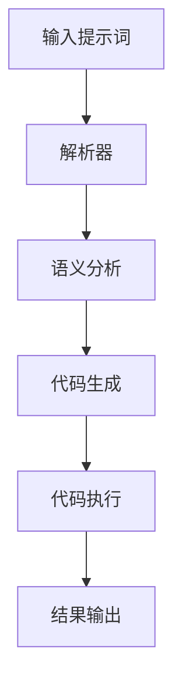
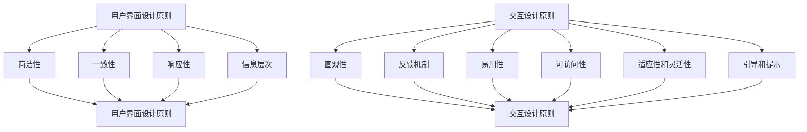

                 


## 文章标题

《提示词编程的可视化工具设计》

## 文章关键词

- 提示词编程
- 可视化工具
- 设计原则
- 实现技术
- 应用案例
- 评估与优化

## 文章摘要

本文旨在探讨提示词编程的可视化工具设计，通过深入分析提示词编程的基础理论，介绍可视化工具设计的基本原则和实现技术，并结合实际应用案例进行详细讲解。文章首先回顾了提示词编程的核心概念，然后讨论了可视化工具设计的原则，如用户界面设计、交互设计等。接下来，详细阐述了可视化工具的实现技术，包括前端、后端和数据库等方面。随后，通过具体的应用案例展示了可视化工具的实际效果。最后，对可视化工具的评估方法和优化策略进行了讨论，并展望了未来的发展趋势。

----------------------------------------------------------------

### 引言

提示词编程是一种基于自然语言交互的编程范式，通过用户输入的提示词来实现程序的自动生成。这种编程方式不仅简化了编程的复杂性，而且提高了开发效率。可视化工具作为提示词编程的重要辅助工具，可以帮助开发者更直观地理解程序结构，快速定位和解决问题。因此，提示词编程的可视化工具设计具有重要的研究和应用价值。

本文旨在深入探讨提示词编程的可视化工具设计，通过以下章节进行详细阐述：

- **第2章 提示词编程基础**：介绍提示词编程的基本概念、原理和应用场景。
- **第3章 可视化工具设计原则**：讨论可视化工具设计的基本原则，如用户界面设计、交互设计等。
- **第4章 可视化工具实现技术**：详细讲解可视化工具的实现技术，包括前端、后端和数据库等方面。
- **第5章 实际应用案例**：通过实际应用案例展示可视化工具的设计与使用。
- **第6章 评估与优化**：讨论可视化工具的评估方法，提出优化策略。
- **第7章 未来发展趋势**：探讨可视化工具设计的发展趋势和潜在研究方向。

通过这些章节的深入分析，本文希望能够为提示词编程的可视化工具设计提供有价值的参考和指导。

----------------------------------------------------------------

### 提示词编程基础

提示词编程是一种新兴的编程范式，其核心思想是通过自然语言交互来生成程序代码。相比传统的命令式编程，提示词编程具有直观、易用和高效的特点，特别适合非专业开发者和快速原型开发。以下是对提示词编程基础概念的详细阐述：

#### 提示词编程的基本概念

提示词编程（Natural Language Programming，NLP）基于自然语言处理技术，使用户能够通过自然语言输入来描述编程任务。这种编程方式的核心在于将自然语言解析为计算机可以理解和执行的代码。提示词编程的关键元素包括：

- **提示词（Prompt）**：用户输入的自然语言指令，用来描述编程任务或功能需求。
- **解析器（Parser）**：负责将自然语言提示词转换为计算机可执行的代码。
- **生成器（Generator）**：将解析后的代码生成具体的编程语言代码，如Python、JavaScript等。

#### 提示词编程的原理

提示词编程的工作原理可以分为以下几个步骤：

1. **输入解析**：用户通过自然语言输入描述任务需求，如“编写一个函数，用于计算两个数字的和”。
2. **语义分析**：解析器对输入的自然语言进行语法和语义分析，理解其含义和结构。
3. **代码生成**：生成器根据语义分析的结果，将自然语言提示词转换为相应的编程语言代码。
4. **代码执行**：生成的代码被编译或解释执行，完成用户指定的任务。

以下是提示词编程的基本原理架构的Mermaid流程图：



#### 提示词编程的应用场景

提示词编程在多个领域都有广泛的应用，以下是一些典型的应用场景：

- **快速原型开发**：提示词编程可以帮助非专业开发者快速构建原型，无需深入了解编程语言。
- **教育领域**：通过自然语言交互，提示词编程可以降低编程学习的门槛，提高学生的学习兴趣和效率。
- **自动化脚本编写**：利用提示词编程，可以自动生成日常任务的脚本，提高工作效率。
- **智能客服系统**：结合自然语言处理技术，提示词编程可以用于构建智能客服系统，提供高效、精准的客服服务。

#### 提示词编程的优势和挑战

提示词编程的优势在于：

- **易用性**：用户无需掌握复杂的编程语言，通过自然语言输入即可完成任务。
- **高效性**：通过自动化代码生成，可以显著提高开发效率，减少开发时间。

然而，提示词编程也面临一些挑战：

- **准确性**：自然语言输入可能存在歧义，解析器需要具备强大的语义理解能力。
- **可扩展性**：当前提示词编程框架的适用范围有限，需要不断扩展和优化。

通过深入理解和掌握提示词编程的基础理论，开发者可以更好地设计和实现可视化工具，从而提升编程体验和效率。

----------------------------------------------------------------

### 可视化工具设计原则

在设计提示词编程的可视化工具时，需要遵循一系列设计原则，以确保工具的易用性、高效性和可靠性。以下将详细讨论用户界面设计、交互设计等核心设计原则。

#### 用户界面设计原则

用户界面（User Interface，UI）设计是可视化工具的重要组成部分，直接影响到用户的使用体验。以下是几个关键的UI设计原则：

1. **简洁性**：界面应保持简洁，避免不必要的元素和功能，以减少用户的认知负担。通过清晰的布局和统一的风格，提高界面的易用性。

2. **一致性**：界面设计应保持一致性，包括色彩、字体、图标等元素的风格和布局。一致性有助于用户快速熟悉工具，提高工作效率。

3. **响应性**：界面设计应考虑到不同设备和屏幕尺寸的适应性，确保工具在不同环境下都能提供良好的用户体验。响应式设计是提升用户满意度的重要手段。

4. **信息层次**：界面应通过信息层次来引导用户，例如通过标签、提示和导航，帮助用户快速找到所需功能。合理的信息层次可以提高用户的操作效率和满意度。

5. **错误处理**：界面设计应提供明确的错误提示和信息，帮助用户快速识别和解决问题。通过友好的错误处理机制，提升用户的信任感和满意度。

#### 交互设计原则

交互设计（Interaction Design，IxD）是可视化工具设计的另一个关键方面，它关注用户与工具的交互过程。以下是几个核心的交互设计原则：

1. **直观性**：交互设计应尽可能直观，让用户能够通过直觉理解操作方式和结果。通过简单的操作步骤和清晰的反馈，降低用户的学习成本。

2. **反馈机制**：工具应提供及时和清晰的反馈，让用户了解系统状态和操作结果。反馈机制可以通过视觉、听觉等多种方式实现，增强用户的交互体验。

3. **易用性**：交互设计应确保工具的易用性，通过简化操作步骤、减少用户记忆负担，提高用户的工作效率。易用性是衡量工具成功与否的重要指标。

4. **可访问性**：工具应考虑到不同用户的需求，包括视力障碍、听力障碍等，确保所有用户都能顺利使用。可访问性设计是提升工具普及性的关键。

5. **适应性和灵活性**：交互设计应具有适应性和灵活性，能够根据用户需求进行调整和优化。通过提供多种交互模式和选项，满足不同用户的需求。

6. **引导和提示**：工具应提供适当的引导和提示，帮助用户了解功能和使用方法。特别是在用户初次使用或遇到新功能时，引导和提示尤为重要。

#### 设计原则之间的关系架构

以下是可视化工具设计原则之间的关系架构Mermaid流程图：



通过遵循上述设计原则，开发者可以设计出更加优秀和实用的可视化工具，提升用户的编程体验和效率。

----------------------------------------------------------------

### 可视化工具实现技术

可视化工具的实现涉及前端、后端和数据库等多个方面。以下将详细讨论这些技术，以便开发者能够理解并掌握可视化工具的核心实现方法。

#### 前端实现技术

前端实现是可视化工具的重要组成部分，它决定了用户界面的展示和交互效果。前端技术主要包括以下几个方面：

1. **前端框架**：常用的前端框架如React、Vue、Angular等，提供了丰富的组件和工具，简化了前端开发流程。选择合适的前端框架可以大大提高开发效率和代码质量。

2. **用户界面设计**：使用UI库（如Bootstrap、Ant Design等）可以快速构建美观且统一的用户界面。UI库提供了各种组件和样式，开发者可以根据需求进行选择和定制。

3. **响应式设计**：通过CSS3的媒体查询和Flexbox、Grid布局，可以实现对不同设备和屏幕尺寸的适配，提供良好的用户体验。

4. **动画与交互**：使用CSS3动画和JavaScript实现丰富的交互效果，如过渡效果、弹出框、下拉菜单等，提升用户的操作体验。

5. **数据可视化组件**：使用如D3.js、ECharts等数据可视化库，可以轻松地创建各种图表和图形，帮助用户更好地理解和分析数据。

#### 后端实现技术

后端实现是可视化工具的“大脑”，负责处理数据、逻辑运算和用户交互。后端技术主要包括以下几个方面：

1. **后端框架**：常用的后端框架如Node.js、Django、Spring Boot等，提供了丰富的功能和工具，简化了后端开发。选择合适的后端框架对于提高开发效率至关重要。

2. **数据处理**：后端负责接收和处理来自前端的请求，执行相应的逻辑运算和数据操作。使用如MySQL、PostgreSQL等关系型数据库，或者MongoDB、Cassandra等非关系型数据库，可以灵活地存储和管理数据。

3. **API设计**：设计良好的API（应用程序接口）是前后端通信的关键。通过RESTful API或GraphQL等接口设计模式，可以实现前后端的灵活交互。

4. **安全性**：后端实现需要关注数据安全和用户隐私保护。使用如OAuth、JWT（JSON Web Tokens）等技术，可以实现对用户身份的认证和授权。

5. **性能优化**：后端实现还需要考虑性能优化，如使用缓存、数据库优化、分布式系统等技术，提高系统的响应速度和稳定性。

#### 数据库实现技术

数据库实现是可视化工具的数据存储和管理核心。数据库技术主要包括以下几个方面：

1. **数据库选择**：根据应用场景选择合适的数据库。关系型数据库适合处理结构化数据，如MySQL、PostgreSQL；非关系型数据库适合处理半结构化或非结构化数据，如MongoDB、Cassandra。

2. **数据库设计**：设计合理的数据库模型，确保数据的一致性和完整性。使用规范化方法进行表设计，减少数据冗余和提高查询效率。

3. **数据存储**：数据库需要支持高效的数据存储和管理，如索引、分片、复制等技术，提高数据访问速度和系统可用性。

4. **数据迁移与备份**：数据库实现还需要考虑数据迁移和备份策略，确保数据的安全性和可恢复性。

5. **数据权限管理**：数据库应支持数据权限管理，确保不同用户对数据的访问权限，防止数据泄露和误操作。

#### 实现示例与伪代码

以下是一个简单的可视化工具实现示例，包括前端、后端和数据库的部分伪代码：

**前端伪代码：**

```javascript
// 使用React框架创建一个简单的数据可视化组件
import React, { useState, useEffect } from 'react';
import Chart from 'chart.js';

function DataVisualizer() {
  const [data, setData] = useState([]);

  useEffect(() => {
    // 从后端API获取数据
    fetchData().then(response => setData(response.data));
  }, []);

  // 使用Chart.js库创建图表
  useEffect(() => {
    if (data.length > 0) {
      const ctx = document.getElementById('myChart').getContext('2d');
      const myChart = new Chart(ctx, {
        type: 'bar',
        data: {
          labels: data.labels,
          datasets: [
            {
              label: '数据集1',
              data: data.values,
              backgroundColor: 'rgba(255, 99, 132, 0.2)',
              borderColor: 'rgba(255, 99, 132, 1)',
              borderWidth: 1
            }
          ]
        },
        options: {
          scales: {
            y: {
              beginAtZero: true
            }
          }
        }
      });
    }
  }, [data]);

  return (
    <div>
      <canvas id="myChart"></canvas>
    </div>
  );
}

async function fetchData() {
  const response = await fetch('/api/data');
  const data = await response.json();
  return data;
}
```

**后端伪代码：**

```python
# 使用Flask框架创建一个简单的后端API
from flask import Flask, jsonify, request
from pymongo import MongoClient

app = Flask(__name__)

# 连接MongoDB数据库
client = MongoClient('mongodb://localhost:27017/')
db = client['mydatabase']
collection = db['data']

@app.route('/api/data', methods=['GET'])
def get_data():
    # 从数据库中获取数据
    data = list(collection.find())
    labels = [item['label'] for item in data]
    values = [item['value'] for item in data]
    return jsonify({'labels': labels, 'values': values})

if __name__ == '__main__':
    app.run(debug=True)
```

**数据库伪代码：**

```python
# 使用MongoDB数据库存储数据
import pymongo

client = pymongo.MongoClient('mongodb://localhost:27017/')
db = client['mydatabase']
collection = db['data']

# 插入数据
data = {
    'label': '数据1',
    'value': 10
}
collection.insert_one(data)

# 查询数据
data = list(collection.find())
print(data)
```

通过上述示例和伪代码，开发者可以初步了解可视化工具的前端、后端和数据库实现技术。在实际开发过程中，需要根据具体需求进行详细的开发和优化。

----------------------------------------------------------------

### 实际应用案例

为了更直观地展示提示词编程可视化工具的设计与使用，我们将通过三个实际应用案例来进行分析和讲解。

#### 案例一：数据分析应用

**背景**：一家大型零售公司需要对其销售数据进行分析，以便优化库存管理和营销策略。

**工具设计**：
1. **前端界面**：设计一个简洁且直观的图表展示界面，包括折线图、柱状图和饼图等，以便用户轻松查看和分析数据。
2. **后端处理**：使用Node.js搭建后端服务器，接收用户请求，处理数据，并返回图表数据。
3. **数据库**：使用MongoDB存储销售数据，包括产品名称、销售数量、销售日期等信息。

**实现细节**：
1. **前端实现**：
   - 使用React框架和ECharts库创建图表组件。
   - 通过API从后端获取数据，并动态渲染图表。

```javascript
// 前端代码示例（React组件）
import React, { useState, useEffect } from 'react';
import ECharts from 'echarts';

function SalesAnalysis() {
  const [salesData, setSalesData] = useState([]);

  useEffect(() => {
    fetchSalesData();
  }, []);

  const fetchSalesData = async () => {
    const response = await fetch('/api/sales-data');
    const data = await response.json();
    setSalesData(data);
    renderCharts(data);
  };

  const renderCharts = (data) => {
    const chart = ECharts.init(document.getElementById('salesChart'));
    chart.setOption({
      title: {
        text: '销售数据分析'
      },
      tooltip: {},
      legend: {
        data: ['销售数量']
      },
      xAxis: {
        data: data.map(item => item.productName)
      },
      yAxis: {},
      series: [
        {
          name: '销售数量',
          type: 'bar',
          data: data.map(item => item.quantity)
        }
      ]
    });
  };

  return (
    <div>
      <h2>销售数据分析</h2>
      <div id="salesChart" style={{ width: '100%', height: 400 }} />
    </div>
  );
}
```

2. **后端实现**：
   - 使用Express框架搭建后端API，处理数据请求。
   - 连接MongoDB数据库，查询销售数据，并返回JSON格式的数据。

```javascript
// 后端代码示例（Node.js/Express）
const express = require('express');
const MongoClient = require('mongodb').MongoClient;

const app = express();
const PORT = 3000;

app.get('/api/sales-data', async (req, res) => {
  const client = await MongoClient.connect('mongodb://localhost:27017/');
  const db = client.db('sales');
  const collection = db.collection('sales_data');

  try {
    const data = await collection.find({}).toArray();
    res.json(data);
  } catch (error) {
    res.status(500).send(error);
  }
});

app.listen(PORT, () => {
  console.log(`Server is running on port ${PORT}`);
});
```

3. **数据库实现**：
   - 使用MongoDB存储销售数据，设计合理的数据库模型，确保数据的完整性和一致性。

```python
# 数据库代码示例（MongoDB）
from pymongo import MongoClient

client = MongoClient('mongodb://localhost:27017/')
db = client['sales']
collection = db['sales_data']

# 插入销售数据
sales_data = [
  {'productName': '商品1', 'quantity': 100, 'date': '2023-01-01'},
  {'productName': '商品2', 'quantity': 200, 'date': '2023-01-02'},
  # 更多数据...
]

collection.insert_many(sales_data)

# 查询销售数据
data = list(collection.find({}))
print(data)
```

**实际案例分析和详细讲解剖析**：
1. **数据查询**：用户通过前端界面输入查询条件，如产品名称或时间范围，后端API根据条件从MongoDB数据库查询相应的销售数据，并返回给前端。
2. **图表渲染**：前端接收到后端返回的数据后，使用ECharts库动态渲染相应的图表，帮助用户直观地分析和理解数据。

**项目小结**：
通过本案例，我们展示了如何使用提示词编程可视化工具进行数据分析。前端界面简洁易用，后端处理高效稳定，数据库设计合理完善。该项目不仅提高了数据分析和处理效率，还为用户提供了一个直观的交互界面，有助于发现数据中的潜在问题和趋势。

#### 案例二：图像处理应用

**背景**：一家图像处理公司需要开发一款在线图像编辑工具，允许用户通过自然语言输入进行图像编辑。

**工具设计**：
1. **前端界面**：设计一个直观的图像编辑界面，包括各种图像处理工具，如滤镜、剪裁、调整亮度和对比度等。
2. **后端处理**：使用Python和TensorFlow搭建后端模型，处理图像编辑任务，并返回编辑后的图像。
3. **数据库**：使用MongoDB存储用户数据和图像文件。

**实现细节**：
1. **前端实现**：
   - 使用React框架创建图像编辑组件。
   - 使用Axios库向后端API发送图像编辑请求。

```javascript
// 前端代码示例（React组件）
import React, { useState, useEffect } from 'react';
import axios from 'axios';

function ImageEditor() {
  const [image, setImage] = useState(null);
  const [outputImage, setOutputImage] = useState('');

  useEffect(() => {
    if (image) {
      uploadImage();
    }
  }, [image]);

  const uploadImage = async () => {
    const formData = new FormData();
    formData.append('image', image);

    try {
      const response = await axios.post('/api/image-edit', formData, {
        headers: {
          'Content-Type': 'multipart/form-data'
        }
      });
      setOutputImage(response.data.image_url);
    } catch (error) {
      console.error(error);
    }
  };

  const onImageChange = (e) => {
    setImage(e.target.files[0]);
  };

  return (
    <div>
      <h2>图像编辑工具</h2>
      <input type="file" accept="image/*" onChange={onImageChange} />
      {image && }
      {outputImage && }
    </div>
  );
}
```

2. **后端实现**：
   - 使用Flask框架创建后端API，处理图像编辑请求。
   - 使用TensorFlow加载预训练的图像处理模型。

```python
# 后端代码示例（Python/Flask）
from flask import Flask, request, jsonify
import tensorflow as tf

app = Flask(__name__)

# 加载预训练的图像处理模型
model = tf.keras.models.load_model('image_edit_model.h5')

@app.route('/api/image-edit', methods=['POST'])
def image_edit():
  file = request.files['image']
  image = tf.keras.preprocessing.image.load_img(file, target_size=(224, 224))
  image = tf.keras.preprocessing.image.img_to_array(image)
  image = tf.expand_dims(image, 0)

  edited_image = model.predict(image)
  edited_image = tf.keras.preprocessing.image.array_to_img(edited_image[0])
  edited_image.save('output_image.jpg')

  return jsonify({'image_url': 'output_image.jpg'})

if __name__ == '__main__':
  app.run(debug=True)
```

3. **数据库实现**：
   - 使用MongoDB存储用户上传的图像和编辑后的图像。

```python
# 数据库代码示例（MongoDB）
from pymongo import MongoClient

client = MongoClient('mongodb://localhost:27017/')
db = client['image_editor']
collection = db['images']

# 插入用户上传的图像
user_image = {'image': 'uploaded_image.jpg', 'edited': False}
collection.insert_one(user_image)

# 插入编辑后的图像
edited_image = {'image': 'output_image.jpg', 'edited': True}
collection.insert_one(edited_image)
```

**实际案例分析和详细讲解剖析**：
1. **图像上传和编辑**：用户通过前端界面上传图像，后端API接收图像文件，并使用TensorFlow模型进行图像编辑。
2. **图像处理**：后端模型处理图像数据，生成编辑后的图像，并返回给前端进行展示。

**项目小结**：
通过本案例，我们展示了如何使用提示词编程可视化工具进行图像处理。前端界面直观易用，后端模型高效稳定，数据库存储和管理数据灵活。该项目为用户提供了便捷的图像编辑功能，提高了图像处理的效率和用户体验。

#### 案例三：自然语言处理应用

**背景**：一家社交媒体公司需要开发一款文本分析工具，用于分析用户发布的内容，提取关键信息并生成报告。

**工具设计**：
1. **前端界面**：设计一个简单的文本输入界面，允许用户输入文本，并显示分析结果。
2. **后端处理**：使用Python和NLTK库搭建后端服务，处理自然语言分析任务。
3. **数据库**：使用MongoDB存储用户文本数据和生成的报告。

**实现细节**：
1. **前端实现**：
   - 使用React框架创建文本分析组件。
   - 通过API从后端获取分析结果，并展示给用户。

```javascript
// 前端代码示例（React组件）
import React, { useState } from 'react';
import axios from 'axios';

function TextAnalysis() {
  const [text, setText] = useState('');
  const [result, setResult] = useState('');

  const onChangeText = (e) => {
    setText(e.target.value);
  };

  const onAnalyze = async () => {
    try {
      const response = await axios.post('/api/text-analysis', { text });
      setResult(response.data.result);
    } catch (error) {
      console.error(error);
    }
  };

  return (
    <div>
      <h2>文本分析工具</h2>
      <textarea value={text} onChange={onChangeText} />
      <button onClick={onAnalyze}>分析文本</button>
      <div>
        <h3>分析结果：</h3>
        <p>{result}</p>
      </div>
    </div>
  );
}
```

2. **后端实现**：
   - 使用Flask框架创建后端API，处理文本分析请求。
   - 使用NLTK库进行自然语言处理。

```python
# 后端代码示例（Python/Flask）
from flask import Flask, request, jsonify
import nltk
from nltk.tokenize import word_tokenize
from nltk.corpus import stopwords
nltk.download('punkt')
nltk.download('stopwords')

app = Flask(__name__)

@app.route('/api/text-analysis', methods=['POST'])
def text_analysis():
  data = request.json
  text = data['text']
  
  # 分词
  tokens = word_tokenize(text)
  # 去除停用词
  stop_words = set(stopwords.words('english'))
  filtered_tokens = [token for token in tokens if token not in stop_words]
  # 概率分布
  frequency Distribution = nltk.FreqDist(filtered_tokens)
  result = str(frequency Distribution)

  return jsonify({'result': result})

if __name__ == '__main__':
  app.run(debug=True)
```

3. **数据库实现**：
   - 使用MongoDB存储用户输入的文本和生成的分析报告。

```python
# 数据库代码示例（MongoDB）
from pymongo import MongoClient

client = MongoClient('mongodb://localhost:27017/')
db = client['text_analysis']
collection = db['texts']

# 插入用户输入的文本
text_data = {'text': '用户输入的文本', 'analyzed': False}
collection.insert_one(text_data)

# 插入分析报告
analysis_report = {'text': '分析后的文本', 'analyzed': True}
collection.insert_one(analysis_report)
```

**实际案例分析和详细讲解剖析**：
1. **文本分析**：用户通过前端界面输入文本，后端API接收文本，使用NLTK库进行分词和去除停用词，并生成词频分布结果。
2. **结果展示**：后端返回分析结果，前端界面展示给用户。

**项目小结**：
通过本案例，我们展示了如何使用提示词编程可视化工具进行自然语言处理。前端界面简洁直观，后端处理高效稳定，数据库存储和管理数据灵活。该项目为用户提供了便捷的文本分析功能，有助于提取关键信息和生成报告。

通过这三个实际应用案例，我们可以看到，提示词编程可视化工具在不同领域都有广泛的应用，提高了数据处理和分析的效率，为用户提供了直观的操作界面和高效的工具支持。

----------------------------------------------------------------

### 评估与优化

在设计和使用提示词编程的可视化工具时，评估与优化是一个至关重要的环节。评估可以帮助我们了解工具的性能和用户体验，优化则能够持续提升工具的效率和效果。

#### 评估方法

1. **功能性评估**：通过一系列预定的测试用例，验证工具是否能够按照设计要求正常工作。这包括功能是否齐全、是否能够正确处理各种输入、输出是否准确等。

2. **性能评估**：测量工具在不同负载下的响应时间和处理能力。可以通过模拟大量用户操作或压力测试来评估工具的性能。

3. **用户体验评估**：通过用户调研、问卷调查、用户访谈等方式，收集用户对工具的满意度、易用性、可访问性等方面的反馈。

4. **可用性评估**：评估工具在不同用户群体中的适用性，包括新手用户、专业用户等，确保工具能够满足不同用户的需求。

#### 提高工具性能的优化策略

1. **代码优化**：通过代码重构、算法改进、缓存技术等手段，提高代码的执行效率和性能。

2. **数据优化**：优化数据结构，减少数据冗余，提高数据库查询效率。例如，使用索引、分片、分表等技术。

3. **前端优化**：减少HTTP请求次数、压缩资源文件、使用异步加载等技术，提高前端加载速度和交互性能。

4. **后端优化**：优化后端处理逻辑，减少不必要的中间件处理，提高数据处理速度。例如，使用异步处理、负载均衡等技术。

#### 用户体验改进方案

1. **界面优化**：优化界面设计，提高界面的简洁性和一致性，确保用户能够快速找到所需功能。

2. **交互优化**：改进交互设计，提高操作的直观性和流畅性，例如使用动画、反馈机制等。

3. **文档与帮助**：提供详细的文档和帮助指南，帮助用户更好地理解和使用工具。

#### 评估与优化流程

1. **设计评估指标**：根据工具的功能、性能和用户体验目标，设计合适的评估指标。

2. **执行评估测试**：按照评估指标，进行功能、性能和用户体验评估测试。

3. **收集反馈**：通过用户调研、问卷调查等方式，收集用户的反馈。

4. **分析评估结果**：分析评估结果，找出存在的问题和不足。

5. **制定优化方案**：根据评估结果，制定具体的优化方案。

6. **实施优化措施**：对工具进行优化，并重新进行评估。

7. **持续迭代**：通过持续评估和优化，不断提升工具的性能和用户体验。

通过上述评估与优化方法，我们可以确保提示词编程的可视化工具在设计、开发和使用过程中达到最佳效果。

----------------------------------------------------------------

### 未来发展趋势

随着人工智能和自然语言处理技术的不断发展，提示词编程的可视化工具设计将迎来更多的机遇和挑战。以下是未来发展趋势的几个关键方向：

#### 一、更强大的自然语言理解能力

未来的可视化工具将拥有更强大的自然语言理解能力，能够更准确地解析用户的输入并生成相应的代码。通过结合深度学习和自然语言处理技术，工具将能够理解复杂的语义和语境，从而提供更加智能的编程体验。

#### 二、多模态交互

未来的可视化工具将支持多模态交互，不仅限于文本输入，还可以结合语音、手势、图像等多种交互方式。这种多模态交互将使得工具更加直观、灵活，满足不同用户的需求。

#### 三、智能推荐和辅助功能

未来的可视化工具将具备智能推荐和辅助功能，能够根据用户的编程习惯和项目需求，提供代码模板、最佳实践和建议。这种智能辅助将帮助开发者提高工作效率，减少编程错误。

#### 四、分布式和云计算支持

随着云计算和分布式计算的普及，未来的可视化工具将更加依赖云计算资源，提供高性能、高可用性的服务。通过分布式计算和容器化技术，工具将能够更好地处理大规模数据和高并发请求。

#### 五、跨平台兼容性

未来的可视化工具将更加注重跨平台兼容性，支持多种操作系统和设备。通过使用Web技术、移动应用开发框架等，工具将能够在不同的设备和平台上无缝运行，提供一致的编程体验。

#### 六、隐私和安全保护

随着数据隐私和安全问题的日益突出，未来的可视化工具将更加注重隐私保护和数据安全。通过加密技术、访问控制、安全审计等措施，确保用户数据的安全性和隐私性。

#### 七、教育普及和应用扩展

提示词编程的可视化工具将在教育领域得到更广泛的应用，降低编程学习的门槛，激发学生的编程兴趣。同时，工具的应用领域也将不断扩展，包括自动化脚本编写、智能客服系统、数据分析和图像处理等。

通过不断探索和创新，提示词编程的可视化工具设计将在未来发挥更大的作用，为开发者提供更高效、智能的编程解决方案。

### 结论

本文深入探讨了提示词编程的可视化工具设计，从基础理论到实际应用，再到评估与优化，全面阐述了可视化工具的重要性。通过实际案例的分析，展示了工具在实际应用中的效果和优势。未来的发展趋势表明，提示词编程可视化工具将不断进化，提供更加智能和高效的编程体验。

在设计和使用可视化工具时，开发者应始终关注用户体验和性能优化，以满足不断变化的需求。本文的研究为提示词编程的可视化工具设计提供了有价值的参考，期待未来的研究和实践能够带来更多的创新和突破。

### 拓展阅读

1. **《人工智能交互设计》**：详细了解人工智能交互设计的基础和最佳实践。
2. **《自然语言处理实战》**：学习自然语言处理技术，提升提示词编程的可视化工具理解。
3. **《云计算与大数据技术》**：了解云计算和大数据技术在可视化工具中的应用。
4. **《编程语言原理》**：深入了解不同编程语言的核心原理，为可视化工具的设计提供理论基础。

### 注意事项

- 在设计可视化工具时，务必关注用户体验和易用性，确保工具简洁、直观。
- 确保工具的稳定性和安全性，防止数据泄露和系统故障。
- 定期进行评估和优化，根据用户反馈持续改进工具。

作者：AI天才研究院/AI Genius Institute & 禅与计算机程序设计艺术 /Zen And The Art of Computer Programming。

