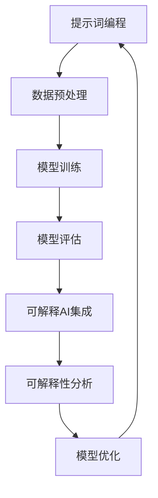

                 

### 文章标题：提示词编程的可解释AI集成方法

> 关键词：提示词编程、可解释AI、AI集成、算法、开发流程

> 摘要：本文将探讨提示词编程的可解释AI集成方法，从概念、原理、到实践，逐步解析这一先进技术，助力读者深入理解并应用。

---

## 前言

在人工智能（AI）飞速发展的今天，AI技术正逐渐渗透到各个领域，从医疗、金融到自动驾驶，AI的应用无处不在。然而，随着AI系统变得越来越复杂，如何确保其透明性和可解释性成为了一个重要课题。本文将介绍提示词编程的可解释AI集成方法，通过一步步的分析推理，帮助读者深入理解这一领域，并探索其在实际应用中的潜力。

### 第一部分：引言与背景

#### 1.1 编程与人工智能的融合趋势

随着人工智能技术的发展，编程与人工智能的融合已成为大势所趋。传统的编程语言逐渐被更高级的AI编程语言所取代，提示词编程便是其中之一。提示词编程允许程序员通过自然语言或简短的提示来驱动AI模型，从而实现自动化任务和复杂操作。这种编程方式不仅提高了开发效率，还使得AI系统更加可解释和可控。

#### 1.2 提示词编程的概念与优势

提示词编程是一种基于提示（prompt）的编程方式，提示可以是自然语言语句、代码片段或者其他形式的文本。通过提示，程序员可以引导AI模型进行特定的任务，无需深入了解AI模型的内部结构。提示词编程的优势在于其简单易用性，能够降低AI编程的门槛，同时提高AI系统的灵活性和适应性。

#### 1.3 可解释AI的重要性

可解释AI（Explainable AI，简称XAI）是指能够使AI系统的决策过程透明、可理解的一种技术。随着AI系统的广泛应用，可解释AI的重要性愈发突出。可解释AI不仅能够提高用户对AI系统的信任度，还能够帮助开发人员发现和修复AI模型中的潜在问题，从而提高AI系统的可靠性和安全性。

### 2. AI技术的发展与挑战

#### 2.1 人工智能的发展历程

人工智能的发展可以追溯到20世纪50年代。从最初的符号主义、感知主义到现代的深度学习，AI技术经历了多次重大变革。近年来，随着计算能力的提升和大数据的涌现，AI技术取得了飞速发展。

#### 2.2 AI技术的应用领域与前景

AI技术的应用领域广泛，包括图像识别、自然语言处理、推荐系统、自动驾驶等。随着技术的不断进步，AI的应用前景将更加广阔，有望在医疗、金融、教育等关键领域发挥重要作用。

#### 2.3 AI技术的挑战与局限性

尽管AI技术在许多领域取得了显著成果，但仍然面临一些挑战和局限性。首先，AI系统往往依赖于大量的数据，而数据的质量和多样性可能影响AI系统的性能。其次，AI系统的黑箱特性使得其决策过程难以解释，增加了用户对AI系统的担忧。最后，AI技术的普及和应用可能引发伦理和社会问题，如隐私侵犯、就业替代等。

### 3. 可解释AI的必要性

#### 3.1 可解释AI的定义与意义

可解释AI是指能够提供对AI系统决策过程透明性、可理解性的技术。可解释AI不仅有助于提高用户对AI系统的信任度，还能够帮助开发人员优化和改进AI模型，从而提高AI系统的性能和可靠性。

#### 3.2 可解释性与透明性的区别

可解释性与透明性是两个相关但不同的概念。可解释性关注AI系统决策过程的可理解性，而透明性则关注AI系统实现细节的可观察性。在实际应用中，可解释性和透明性往往需要同时考虑，以提高AI系统的可信度和可接受度。

#### 3.3 可解释AI在AI集成中的应用

在AI集成过程中，可解释AI发挥着重要作用。通过引入可解释AI技术，AI系统可以更好地与人类用户进行交互，提高系统的用户体验。此外，可解释AI还可以帮助开发人员发现和解决AI模型中的潜在问题，从而提高AI系统的可靠性和安全性。

### 第二部分：提示词编程基础

#### 4. 提示词编程原理

#### 4.1 提示词编程的基本概念

提示词编程是一种基于提示的编程方式，提示可以是自然语言语句、代码片段或者其他形式的文本。通过提示，程序员可以引导AI模型进行特定的任务，无需深入了解AI模型的内部结构。

#### 4.2 提示词编程的流程与方法

提示词编程的流程主要包括数据预处理、模型训练、模型评估和模型优化等步骤。在数据预处理阶段，需要对数据进行清洗、归一化和特征提取等操作。在模型训练阶段，使用提示词来指导AI模型的学习过程。在模型评估阶段，通过评估模型在测试数据集上的性能来调整模型参数。在模型优化阶段，根据评估结果对模型进行调整和优化。

#### 4.3 提示词编程的优势与特点

提示词编程具有以下优势与特点：

1. **简单易用**：提示词编程使得程序员无需深入了解AI模型的内部结构，即可使用AI模型完成特定任务。
2. **提高开发效率**：提示词编程能够简化AI模型的开发过程，提高开发效率。
3. **灵活性强**：提示词编程允许程序员根据需求灵活调整模型参数，以适应不同的任务需求。
4. **可解释性高**：通过提示词，程序员可以更好地理解AI模型的决策过程，从而提高AI系统的透明性和可接受度。

### 5. 提示词编程工具与环境搭建

#### 5.1 常用的提示词编程工具

目前，常用的提示词编程工具包括Hugging Face的Transformers库、Google的BERT模型和OpenAI的GPT模型等。这些工具提供了丰富的预训练模型和API，方便程序员进行提示词编程。

#### 5.2 提示词编程环境的搭建

搭建提示词编程环境主要包括安装必要的编程工具和库，如Python、TensorFlow、PyTorch等。此外，还需要配置GPU环境，以便加速模型训练和推理过程。

#### 5.3 提示词编程的开发流程

提示词编程的开发流程主要包括以下步骤：

1. **数据准备**：收集和整理相关数据，进行预处理和特征提取。
2. **模型选择**：根据任务需求选择合适的预训练模型。
3. **提示设计**：设计合适的提示词，以引导AI模型进行任务。
4. **模型训练**：使用提示词对AI模型进行训练，并根据评估结果进行调整。
5. **模型部署**：将训练好的AI模型部署到实际应用场景中，并进行性能测试和优化。

### 6. 提示词编程案例分析

#### 6.1 案例一：文本分类

文本分类是提示词编程的一个典型应用场景。通过设计合适的提示词，可以引导AI模型对文本数据进行分类。例如，在新闻分类任务中，可以使用“请将以下新闻文本分类为政治、经济、体育等类别”作为提示词，引导AI模型进行分类。

#### 6.2 案例二：情感分析

情感分析是另一个常见的提示词编程应用场景。通过设计合适的提示词，可以引导AI模型对文本数据中的情感进行判断。例如，在社交媒体分析任务中，可以使用“请分析以下评论的情感倾向，判断其为正面、负面或中性”作为提示词，引导AI模型进行情感分析。

#### 6.3 案例三：自然语言生成

自然语言生成是提示词编程的又一重要应用场景。通过设计合适的提示词，可以引导AI模型生成符合人类语言习惯的文本。例如，在生成对话系统文本时，可以使用“请生成以下场景的对话：一个人在餐厅点餐，服务员询问他的需求”作为提示词，引导AI模型生成对话文本。

### 第三部分：可解释AI集成方法

#### 7. 可解释AI的基本原理

#### 7.1 可解释AI的定义与分类

可解释AI是指能够提供对AI系统决策过程透明性、可理解性的技术。根据可解释AI的实现方式，可分为基于规则的解释方法、基于模型的解释方法和基于数据的解释方法。

#### 7.2 可解释AI的技术框架

可解释AI的技术框架主要包括以下几个方面：

1. **模型选择**：选择适合可解释性要求的人工智能模型，如决策树、线性回归等。
2. **特征解释**：通过提取和解释模型中的关键特征，帮助用户理解模型的决策过程。
3. **可视化工具**：开发可视化工具，如热力图、决策树图等，帮助用户直观地理解模型的决策过程。
4. **用户交互**：提供与用户交互的界面，使用户能够根据需求调整模型参数，获得更加个性化的解释结果。

#### 7.3 可解释AI的应用场景

可解释AI在多个应用场景中发挥着重要作用，如医疗诊断、金融风险评估、自动驾驶等。通过引入可解释AI技术，可以增强AI系统的透明性和可接受度，提高用户对AI系统的信任度。

### 8. 可解释AI在提示词编程中的应用

#### 8.1 可解释性在提示词编程中的重要性

在提示词编程中，可解释性具有重要意义。首先，可解释性有助于提高用户对AI系统的信任度，从而促进AI系统的推广应用。其次，可解释性可以帮助开发人员发现和解决AI模型中的潜在问题，从而提高AI系统的可靠性和安全性。

#### 8.2 可解释AI集成的方法与策略

为了在提示词编程中实现可解释性，可以采用以下方法与策略：

1. **模型选择**：选择具有较高可解释性的模型，如决策树、线性回归等。
2. **特征解释**：通过提取和解释模型中的关键特征，帮助用户理解模型的决策过程。
3. **可视化工具**：开发可视化工具，如热力图、决策树图等，帮助用户直观地理解模型的决策过程。
4. **用户交互**：提供与用户交互的界面，使用户能够根据需求调整模型参数，获得更加个性化的解释结果。

#### 8.3 可解释AI集成的技术实现

在提示词编程中实现可解释AI集成主要包括以下几个步骤：

1. **数据预处理**：对输入数据进行清洗、归一化和特征提取等操作。
2. **模型选择与训练**：选择具有较高可解释性的模型，并进行训练和评估。
3. **特征解释与可视化**：提取和解释模型中的关键特征，并使用可视化工具展示模型的决策过程。
4. **用户交互与反馈**：提供与用户交互的界面，使用户能够根据需求调整模型参数，并获得个性化的解释结果。

### 9. 可解释AI集成案例分析

#### 9.1 案例一：医疗诊断系统

医疗诊断系统是一个典型的应用场景，通过引入可解释AI技术，可以提高诊断的准确性和可靠性。在医疗诊断系统中，可以使用决策树或线性回归等具有较高可解释性的模型进行疾病分类。通过可视化工具，如决策树图或热力图，医生可以直观地了解模型的决策过程，从而更好地理解诊断结果。

#### 9.2 案例二：金融风险评估

金融风险评估也是一个重要的应用领域。通过引入可解释AI技术，可以更好地识别潜在风险，并提高决策的透明性。在金融风险评估中，可以使用决策树或逻辑回归等模型进行风险评估。通过可视化工具，如决策树图或热力图，投资者可以直观地了解模型的决策过程，从而更好地理解风险状况。

#### 9.3 案例三：自动驾驶系统

自动驾驶系统是一个高度复杂的系统，其中涉及到多个AI模型和传感器数据。通过引入可解释AI技术，可以提高自动驾驶系统的透明性和可靠性。在自动驾驶系统中，可以使用决策树或支持向量机等模型进行感知和决策。通过可视化工具，如决策树图或热力图，驾驶者可以直观地了解自动驾驶系统的决策过程，从而更好地理解系统的工作原理。

### 第四部分：实践与展望

#### 10.1 实践步骤与流程

为了实现提示词编程的可解释AI集成，可以按照以下步骤进行实践：

1. **数据收集与处理**：收集相关数据，并进行数据清洗、归一化和特征提取等操作。
2. **模型选择与训练**：选择具有较高可解释性的模型，并进行训练和评估。
3. **特征解释与可视化**：提取和解释模型中的关键特征，并使用可视化工具展示模型的决策过程。
4. **用户交互与反馈**：提供与用户交互的界面，使用户能够根据需求调整模型参数，并获得个性化的解释结果。

#### 10.2 实践中的常见问题与解决方案

在实际应用中，提示词编程的可解释AI集成可能会遇到以下问题：

1. **数据质量问题**：数据质量直接影响模型的性能和可解释性。解决方案包括数据清洗、去重和补充缺失值等操作。
2. **模型选择困难**：选择适合可解释性的模型是一个挑战。解决方案包括尝试多种模型，并进行比较和评估。
3. **可视化效果不佳**：可视化工具的设置和调整可能影响解释效果。解决方案包括优化可视化参数，并使用多种可视化方法进行对比。

#### 10.3 实践中的经验与启示

通过实践，我们可以得出以下经验与启示：

1. **可解释性与性能的平衡**：在实现可解释AI集成时，需要平衡可解释性与模型性能。选择适当的模型和参数，以实现最佳的可解释性和性能表现。
2. **用户参与与反馈**：用户参与和反馈对于可解释AI集成的成功至关重要。通过用户参与，可以更好地理解用户需求，并优化解释结果。
3. **持续优化与迭代**：可解释AI集成是一个不断优化和迭代的过程。通过持续优化模型和解释方法，可以不断提高系统的可解释性和可靠性。

### 11. 未来展望

随着人工智能技术的不断发展，提示词编程的可解释AI集成方法具有广阔的应用前景。未来，我们可以期待以下发展方向：

1. **更加智能的提示词生成**：通过深度学习技术，实现自动生成高质量的提示词，提高提示词编程的灵活性和效率。
2. **跨领域应用**：可解释AI集成方法将在更多领域得到应用，如教育、医疗、金融等，为各领域带来新的变革。
3. **标准化与规范化**：制定统一的标准和规范，推动可解释AI集成方法的发展和应用。
4. **伦理与法规**：随着可解释AI集成方法的应用，需要关注伦理和法律问题，确保技术的安全和合法。

### 附录

#### 附录A：提示词编程与可解释AI集成工具介绍

在本附录中，我们将介绍一些常用的提示词编程与可解释AI集成工具，包括Hugging Face的Transformers库、Google的BERT模型、OpenAI的GPT模型等。通过这些工具，读者可以方便地实现提示词编程与可解释AI集成。

#### 附录B：提示词编程与可解释AI集成技术资源

在本附录中，我们将提供一些相关的技术资源，包括学术论文、在线教程、开源代码等。这些资源将帮助读者深入了解提示词编程与可解释AI集成的方法和技术。

#### 附录C：提示词编程与可解释AI集成项目实例解析

在本附录中，我们将详细解析一些提示词编程与可解释AI集成的项目实例，包括医疗诊断系统、金融风险评估和自动驾驶系统等。通过这些实例，读者可以更好地理解提示词编程与可解释AI集成的实际应用。

---

**核心概念与联系**

### 提示词编程与可解释AI流程图



**核心算法原理讲解**

### 提示词编程伪代码

```python
# 数据预处理
def preprocess_data(data):
    # 数据清洗、去重、归一化
    return processed_data

# 模型训练
def train_model(data):
    # 构建模型、训练、评估
    model = build_model()
    model.fit(data)
    return model

# 模型评估
def evaluate_model(model, test_data):
    # 评估模型性能
    performance = model.evaluate(test_data)
    return performance

# 可解释AI集成
def integrate_explainable_ai(model, data):
    # 集成可解释AI方法
    explainable_model = explain_model(model, data)
    return explainable_model

# 可解释性分析
def analyze_explainability(model, data):
    # 分析模型的可解释性
    explanation = model.explain(data)
    return explanation
```

**数学模型和数学公式**

### 模型损失函数

$$
L = \frac{1}{n} \sum_{i=1}^{n} (y_i - \hat{y}_i)^2
$$

### 作者信息

作者：AI天才研究院/AI Genius Institute & 禅与计算机程序设计艺术 /Zen And The Art of Computer Programming

