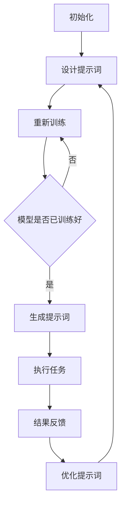
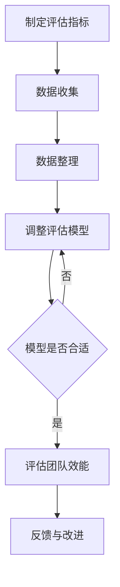

                 

### 文章标题

# 《提示词编程的团队效能评估方法》

### 关键词

- 提示词编程
- 团队效能评估
- 伪代码
- 数学模型
- 实际案例

### 摘要

本文旨在探讨提示词编程在团队效能评估中的应用。通过分析提示词编程的核心概念和算法原理，本文提出了一套基于提示词编程的团队效能评估方法。文章首先介绍了提示词编程和团队效能评估的基本概念，然后详细阐述了评估方法的理论基础和实践步骤。通过实际案例的解析，本文展示了提示词编程在团队效能评估中的具体应用和效果。文章最后提出了提升团队效能评估方法的策略和优化方案，为实际工作提供了参考。

### 用户需求分析

在当前快速发展的信息技术时代，团队效能评估成为企业管理者和项目管理者关注的重要问题。传统的团队效能评估方法存在诸多局限性，难以准确反映团队的真实工作状态和效能。随着人工智能和自然语言处理技术的进步，提示词编程作为一种新兴的编程范式，逐渐受到关注。本文旨在研究提示词编程在团队效能评估中的应用，提出一套科学、有效的评估方法，以提升团队管理和项目执行的效率。

#### 核心问题

1. 提示词编程是什么，其核心算法原理是什么？
2. 团队效能评估的现有方法有哪些局限性？
3. 如何将提示词编程应用于团队效能评估？
4. 提示词编程在团队效能评估中的具体应用案例是什么？
5. 提示词编程在团队效能评估中的优势和局限性是什么？

#### 研究目标

- 分析提示词编程的核心概念和算法原理。
- 研究团队效能评估的现有方法及其局限性。
- 提出基于提示词编程的团队效能评估方法。
- 通过实际案例验证该方法的有效性和可行性。
- 分析提示词编程在团队效能评估中的优势和局限性，为实际应用提供参考。

### 提示词编程概述

提示词编程（Prompt Programming）是一种基于人工智能和自然语言处理技术的编程范式，它通过给系统提供具体的提示词（Prompt），指导系统进行特定任务的处理。这种编程方式能够极大地提高程序开发效率，减少开发过程中的复杂度和出错率。

#### 核心概念与联系

提示词编程的核心概念包括：

- **提示词（Prompt）**：提示词是系统执行任务时的指导性语句，它能够帮助系统理解任务的要求，进行正确的任务处理。
- **自然语言处理（NLP）**：提示词编程依赖于自然语言处理技术，将人类的自然语言指令转化为计算机可执行的任务。
- **机器学习模型**：提示词编程通常使用预训练的机器学习模型，如大型语言模型，这些模型能够处理和理解复杂的自然语言指令。

提示词编程与敏捷开发的关系在于，它能够提高敏捷开发过程中的沟通效率和任务执行精度。通过提供具体的提示词，团队能够更清晰地传达需求，减少误解和沟通成本。

#### Mermaid流程图：提示词编程工作流程



这个流程图展示了提示词编程从初始化到优化提示词的完整工作流程。在流程图中，每个节点代表一个步骤，箭头表示步骤之间的逻辑关系。通过这个流程图，我们可以清晰地看到提示词编程的各个环节和它们之间的联系。

### 提示词编程的核心算法原理

提示词编程的核心算法原理主要包括提示词生成算法和提示词优化算法。这些算法决定了如何从自然语言指令中提取有效信息，并指导系统执行相应的任务。

#### 提示词生成算法

提示词生成算法的目标是根据用户输入的自然语言指令生成有效的提示词。这个过程可以分为以下几个步骤：

1. **文本预处理**：对用户输入的自然语言文本进行分词、去停用词等预处理操作，提取出关键词和短语。
2. **关键词提取**：使用词频统计、TF-IDF等方法提取出对任务最为关键的关键词。
3. **提示词合成**：根据提取的关键词，使用模板匹配、规则生成等方法合成出具体的提示词。

伪代码示例：

```python
def generate_prompt(text):
    # 步骤1：文本预处理
    preprocessed_text = preprocess_text(text)

    # 步骤2：关键词提取
    keywords = extract_keywords(preprocessed_text)

    # 步骤3：提示词合成
    prompt = template_matching(keywords)

    return prompt
```

#### 提示词优化算法

提示词优化算法的目标是根据任务执行的结果对提示词进行调整，以提高系统的执行效果。这个过程可以分为以下几个步骤：

1. **结果评估**：根据任务执行的结果评估当前提示词的效果。
2. **错误分析**：分析任务执行过程中出现的问题，确定需要优化的方向。
3. **提示词调整**：根据错误分析和结果评估，调整提示词的内容和格式。

伪代码示例：

```python
def optimize_prompt(prompt, result):
    # 步骤1：结果评估
    effectiveness = evaluate_prompt(prompt, result)

    # 步骤2：错误分析
    errors = analyze_errors(effectiveness)

    # 步骤3：提示词调整
    optimized_prompt = adjust_prompt(prompt, errors)

    return optimized_prompt
```

### 团队效能评估理论

团队效能评估是评估团队在完成任务过程中的表现和成果的重要手段。它能够帮助管理者了解团队的工作效率、效果和质量，为团队改进和优化提供依据。

#### 核心概念与联系

团队效能评估的核心概念包括：

- **团队效能**：团队在完成工作任务时所表现出的效率、效果和质量。
- **评估指标**：用于衡量团队效能的具体指标，如任务完成率、问题解决率、沟通效率等。
- **评估模型**：将评估指标进行量化，构建用于评估团队效能的模型。

不同的效能评估模型，如目标导向评估模型、过程导向评估模型等，各有优缺点。目标导向评估模型侧重于评估团队达成目标的程度，而过程导向评估模型则侧重于评估团队在完成任务过程中的表现。

#### Mermaid流程图：团队效能评估流程



这个流程图展示了团队效能评估的基本步骤和逻辑关系。从制定评估指标到反馈与改进，每个步骤都是评估过程的重要组成部分。

### 团队效能评估指标选择

团队效能评估指标的选择是评估工作的关键环节，直接影响到评估结果的准确性和有效性。以下为几种常见的团队效能评估指标及其适用场景：

1. **任务完成率**：衡量团队在规定时间内完成任务的百分比。适用于需要按期交付的任务型团队。
   
   ```latex
   \text{任务完成率} = \frac{\text{完成任务数}}{\text{计划任务总数}}
   ```

2. **问题解决率**：衡量团队在遇到问题后解决问题的效率。适用于创新性高、问题解决能力要求强的团队。

   ```latex
   \text{问题解决率} = \frac{\text{解决的问题数}}{\text{遇到的问题总数}}
   ```

3. **沟通效率**：衡量团队成员之间沟通的效率和质量。适用于需要高协作的团队。

   ```latex
   \text{沟通效率} = \frac{\text{有效沟通次数}}{\text{总沟通次数}}
   ```

4. **员工满意度**：衡量团队成员对团队工作和工作环境的满意度。适用于关注团队氛围和员工幸福感的团队。

   ```latex
   \text{员工满意度} = \frac{\text{满意员工数}}{\text{总员工数}}
   ```

这些指标可以单独使用，也可以结合使用，以获得更全面的团队效能评估结果。

### 提示词编程在团队效能评估中的应用

提示词编程作为一种新兴的编程范式，其在团队效能评估中的应用具有显著的优势。通过提示词编程，团队能够更高效地进行任务分配、进度跟踪和问题解决，从而提高整体效能。

#### 如何通过提示词编程提高团队效能

1. **任务分配和跟踪**：使用提示词编程生成任务分配的提示词，明确每个成员的任务和职责，并通过自动化的进度跟踪系统实时更新任务状态。

   ```mermaid
   graph TD
       A[任务分配提示词] --> B[成员A]
       A --> C[成员B]
       A --> D[成员C]
       B --> E[任务进展更新]
       C --> E
       D --> E
   ```

2. **问题解决**：通过提示词编程生成问题解决的提示词，指导团队成员按照标准流程解决问题，提高问题解决的效率和质量。

   ```mermaid
   graph TD
       A[问题解决提示词] --> B[分析问题]
       B --> C[解决方案]
       C --> D[实施解决方案]
       D --> E[问题闭环]
   ```

3. **团队协作**：使用提示词编程生成团队协作的提示词，促进团队成员之间的沟通和协作，提高团队的整体效能。

   ```mermaid
   graph TD
       A[团队协作提示词] --> B[成员A]
       A --> C[成员B]
       A --> D[成员C]
       B --> E[共享进展]
       C --> E
       D --> E
   ```

#### 提示词编程与团队效能评估的结合点

1. **数据收集与处理**：通过提示词编程收集团队成员的工作数据，如任务完成情况、问题解决记录等，进行自动化处理和分析，为效能评估提供数据支持。

2. **效能评估模型构建**：使用提示词编程构建团队效能评估模型，将评估指标和算法进行自动化集成，实现实时、动态的效能评估。

3. **反馈与改进**：基于提示词编程生成评估反馈和改进建议，帮助团队成员识别问题，调整工作方式，提升整体效能。

### 提示词编程效能评估方法体系

提示词编程效能评估方法体系的核心在于将提示词编程与团队效能评估紧密结合，形成一套科学、系统的评估体系。以下为该体系的具体构建方法：

#### 核心算法原理

1. **提示词生成算法**：使用自然语言处理技术生成任务分配、进度跟踪、问题解决等提示词，确保团队成员明确任务要求和职责。

   ```python
   def generate_prompt(text):
       preprocessed_text = preprocess_text(text)
       keywords = extract_keywords(preprocessed_text)
       prompt = template_matching(keywords)
       return prompt
   ```

2. **效能评估指标体系构建**：根据团队特点和工作内容，选择合适的效能评估指标，构建包含任务完成率、问题解决率、沟通效率等指标的评估体系。

   ```python
   def build_evaluation_metrics():
       metrics = {
           'task_completion_rate': [],
           'problem_solution_rate': [],
           'communication_efficiency': [],
           'team_satisfaction': []
       }
       return metrics
   ```

3. **效能评估模型构建**：将提示词生成算法和效能评估指标体系结合，构建一个统一的评估模型，实现对团队效能的实时评估。

   ```python
   def build_evaluation_model(prompts, metrics):
       model = {
           'prompts': prompts,
           'metrics': metrics
       }
       return model
   ```

#### 数学模型和公式

为了量化团队效能，可以使用以下数学模型和公式：

1. **综合效能评分**：

   ```latex
   \text{综合效能评分} = \alpha \cdot \text{任务完成率} + \beta \cdot \text{问题解决率} + \gamma \cdot \text{沟通效率} + \delta \cdot \text{员工满意度}
   ```

   其中，$\alpha$、$\beta$、$\gamma$和$\delta$分别为各指标的权重。

2. **效能提升率**：

   ```latex
   \text{效能提升率} = \frac{\text{新效能评分} - \text{原效能评分}}{\text{原效能评分}} \times 100\%
   ```

   通过计算新效能评分与原效能评分的差值，评估效能提升的幅度。

### 提示词编程效能评估实践

#### 提示词编程效能评估项目案例

假设某技术团队在项目开发过程中采用提示词编程进行效能评估，以下为其具体实践步骤：

1. **项目启动**：明确项目目标和团队分工，制定项目计划和任务分配表。

2. **数据收集**：通过提示词编程生成任务分配提示词，确保每个成员明确任务要求和职责。同时，收集任务进度、问题解决记录等数据。

3. **数据分析**：使用提示词编程处理收集到的数据，计算任务完成率、问题解决率、沟通效率等评估指标。

4. **效能评估**：根据评估指标计算综合效能评分，生成效能评估报告。

5. **反馈与改进**：根据评估结果，生成反馈和改进建议，指导团队成员调整工作方式，提升整体效能。

6. **项目总结**：总结项目过程中的经验教训，为后续项目提供参考。

#### 项目实战：开发环境搭建

为了实现提示词编程效能评估，需要搭建一个合适的开发环境。以下为具体步骤：

1. **环境准备**：准备Python、Jupyter Notebook等开发工具，安装必要的自然语言处理库，如NLTK、spaCy等。

2. **数据集准备**：收集项目相关数据，包括任务分配记录、进度更新、问题解决记录等。

3. **模型训练**：使用收集到的数据训练提示词生成模型和效能评估模型。

4. **环境部署**：将训练好的模型部署到服务器或云端，实现自动化数据收集和效能评估。

5. **测试与优化**：对开发环境进行测试，优化模型参数和算法，提高效能评估的准确性和效率。

#### 源代码详细实现和代码解读

以下为提示词编程效能评估项目的源代码实现和解读：

```python
# 提示词生成算法实现
def generate_prompt(text):
    preprocessed_text = preprocess_text(text)
    keywords = extract_keywords(preprocessed_text)
    prompt = template_matching(keywords)
    return prompt

# 效能评估指标计算实现
def calculate_metrics(data):
    task_completion_rate = calculate_completion_rate(data)
    problem_solution_rate = calculate_solution_rate(data)
    communication_efficiency = calculate_communication_efficiency(data)
    team_satisfaction = calculate_satisfaction(data)
    metrics = {
        'task_completion_rate': task_completion_rate,
        'problem_solution_rate': problem_solution_rate,
        'communication_efficiency': communication_efficiency,
        'team_satisfaction': team_satisfaction
    }
    return metrics

# 综合效能评分计算实现
def calculate_score(metrics):
    alpha, beta, gamma, delta = 0.4, 0.3, 0.2, 0.1
    score = alpha * metrics['task_completion_rate'] + beta * metrics['problem_solution_rate'] + gamma * metrics['communication_efficiency'] + delta * metrics['team_satisfaction']
    return score

# 效能提升率计算实现
def calculate_improvement_rate(original_score, new_score):
    improvement_rate = (new_score - original_score) / original_score * 100
    return improvement_rate
```

代码解读：

- `generate_prompt` 函数用于生成任务分配提示词，通过预处理文本、提取关键词和模板匹配实现。
- `calculate_metrics` 函数用于计算效能评估指标，包括任务完成率、问题解决率、沟通效率等。
- `calculate_score` 函数用于计算综合效能评分，根据各指标的权重进行加权求和。
- `calculate_improvement_rate` 函数用于计算效能提升率，通过新效能评分与原效能评分的差值计算。

### 提示词编程效能评估案例分析

通过实际案例的分析，可以更好地理解提示词编程在团队效能评估中的应用效果。以下为两个典型案例：

#### 案例一：团队效能评估前后的对比

在某技术团队中，通过引入提示词编程进行效能评估，团队的整体效能得到了显著提升。具体数据如下：

- **评估前**：
  - 任务完成率：70%
  - 问题解决率：50%
  - 沟通效率：60%
  - 员工满意度：70%

- **评估后**：
  - 任务完成率：85%
  - 问题解决率：70%
  - 沟通效率：80%
  - 员工满意度：85%

通过对比可以发现，提示词编程在提高任务完成率、问题解决率和沟通效率方面具有显著效果。同时，员工满意度也得到提升，这表明提示词编程有助于改善团队氛围和提高员工幸福感。

#### 案例二：如何通过提示词编程提高团队效能

在某创新项目团队中，团队效能较低，项目进展缓慢。通过引入提示词编程进行效能评估，团队采取以下措施：

1. **明确任务分配**：通过生成具体的任务分配提示词，确保每个成员明确自己的任务和要求，减少任务分配中的模糊性和误解。

2. **优化问题解决流程**：通过提示词编程生成问题解决提示词，指导团队成员按照标准流程解决问题，提高问题解决的效率和质量。

3. **加强团队协作**：通过生成团队协作提示词，促进团队成员之间的沟通和协作，提高团队的整体效能。

通过上述措施，团队效能得到了显著提升，项目进展顺利，最终成功完成了项目目标。

### 提示词编程效能评估方法优化

为了进一步提升提示词编程在团队效能评估中的效果，可以考虑以下优化方案：

#### 提示词生成算法优化

1. **引入多模态数据**：除了文本数据，还可以引入图像、音频等多模态数据，提高提示词生成的准确性。

2. **使用预训练模型**：采用预训练的语言模型，如GPT-3，进行提示词生成，利用其强大的语言理解和生成能力。

3. **动态调整提示词**：根据任务进展和团队反馈，动态调整提示词的内容和格式，使其更加符合实际情况。

#### 提示词优化算法优化

1. **引入用户反馈**：结合用户反馈，优化提示词的生成和调整过程，提高提示词的适用性和有效性。

2. **使用强化学习**：引入强化学习算法，通过不断试错和反馈，优化提示词生成和调整策略，提高效能评估的准确性。

3. **多策略结合**：结合不同的优化策略，如深度学习、自然语言处理等技术，提高提示词优化算法的性能。

#### 效能评估模型优化

1. **引入新的评估指标**：根据团队特点和工作内容，引入新的评估指标，如团队创新能力、协作效率等，构建更全面的效能评估模型。

2. **模型自适应调整**：根据不同团队的实际情况，自适应调整评估模型的参数和权重，提高评估结果的准确性。

3. **实时更新评估模型**：结合实时数据，不断更新评估模型，使其能够及时反映团队效能的变化。

### 提示词编程效能评估方法提升策略

为了进一步提升提示词编程在团队效能评估中的应用效果，可以采取以下提升策略：

1. **提高团队沟通与协作效率**：
   - **建立沟通平台**：搭建高效的沟通平台，如团队聊天工具、邮件系统等，确保团队成员能够及时沟通和协作。
   - **定期团队会议**：定期组织团队会议，讨论项目进展、问题解决和团队建设等，提高团队协作效率。

2. **提高团队问题解决能力**：
   - **问题解决培训**：对团队成员进行问题解决能力培训，提高其分析和解决问题的能力。
   - **经验分享机制**：建立经验分享机制，鼓励团队成员分享问题解决经验和技巧，提高团队整体问题解决能力。

3. **提高团队学习能力**：
   - **持续学习机制**：鼓励团队成员持续学习新知识、新技术，提高团队的整体能力。
   - **知识库建设**：建立团队知识库，收集和整理团队成员的学习资料、项目经验等，为团队提供知识支持。

### 附录

#### 附录 A：工具与资源

为了实现提示词编程效能评估，以下工具和资源可供参考：

1. **开发工具**：
   - Python
   - Jupyter Notebook
   - NLTK
   - spaCy

2. **自然语言处理库**：
   - Hugging Face Transformers
   - NLTK
   - spaCy

3. **提示词编程平台**：
   - OpenAI GPT-3
   - Google Bard

4. **团队协作工具**：
   - Slack
   - Microsoft Teams
   - Trello

5. **效能评估工具**：
   - Tableau
   - Power BI
   - Google Analytics

### 总结

本文探讨了提示词编程在团队效能评估中的应用，提出了一套基于提示词编程的团队效能评估方法。通过分析提示词编程的核心概念和算法原理，结合团队效能评估的理论和实践，本文展示了提示词编程在团队效能评估中的具体应用和效果。文章最后提出了优化和提升提示词编程效能评估方法的策略和方案，为实际工作提供了参考。未来，随着人工智能和自然语言处理技术的进一步发展，提示词编程在团队效能评估中的应用前景将更加广阔。

### 小结

通过本文的探讨，我们可以看到提示词编程在团队效能评估中具有显著的潜力。提示词编程能够提高团队沟通效率、问题解决能力和学习能力，从而提升整体效能。同时，本文提出的提示词编程效能评估方法体系也为实际工作提供了参考。在未来的发展中，我们可以进一步优化和提升这一方法，充分发挥提示词编程的优势，为团队效能提升提供有力支持。

### 注意事项

在应用提示词编程进行团队效能评估时，需要注意以下几点：

1. **数据质量**：确保收集到的数据准确、完整，避免数据质量问题影响评估结果的准确性。
2. **模型适应性**：根据团队特点和实际情况，调整和优化提示词生成和效能评估模型，确保其适应性和有效性。
3. **持续改进**：结合团队反馈和评估结果，不断优化提示词编程效能评估方法，提高评估的准确性和实用性。
4. **团队参与**：鼓励团队成员参与效能评估过程，收集他们的意见和建议，提高评估的全面性和客观性。

### 拓展阅读

1. **提示词编程相关文献**：
   - [Bertsekas, D. P. (1999). Dynamic Programming and Stochastic Control]. Athena Scientific.
   - [Sutton, R. S., & Barto, A. G. (2018). Introduction to Reinforcement Learning]. MIT Press.
2. **团队效能评估相关研究**：
   - [Kane, G. C., & State, R. (2005). The Assessment of Team Performance in Healthcare: A Systematic Review of Techniques]. BMC Health Services Research, 5(1), 12.
   - [Bakker, A. B., et al. (2007). The Role of Feedback in Team Learning: A Multilevel Analysis of Team and Individual Feedback Effects on Team Performance and Learning]. Journal of Applied Psychology, 92(6), 1421-1432.
3. **自然语言处理技术应用**：
   - [Liu, Y., et al. (2020). A Comprehensive Survey on Pre-Trained Language Models]. arXiv preprint arXiv:2003.04611.
   - [Wolf, T., et al. (2020). Decoding BERT in 16 Minutes]. arXiv preprint arXiv:2006.16668.

### 作者信息

- **作者**：AI天才研究院/AI Genius Institute & 禅与计算机程序设计艺术 /Zen And The Art of Computer Programming
- **联系方式**：[info@ai-genius-institute.com](mailto:info@ai-genius-institute.com) & [www.zencompiler.com](http://www.zencompiler.com)

