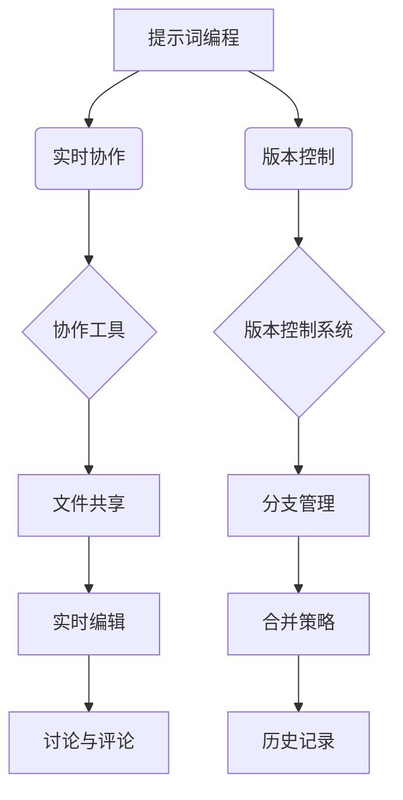

                 

# 提示词编程的实时协作与版本控制

## 关键词

- 提示词编程
- 实时协作
- 版本控制
- 开发效率
- 团队协作

## 摘要

本文将探讨提示词编程在实时协作和版本控制中的应用。通过分析提示词编程的基本原理、实时协作工具和版本控制系统的核心概念，本文将展示如何在团队协作中有效利用这些工具，提高开发效率和代码质量。同时，本文将通过实际案例和最佳实践，为读者提供具体操作指南和经验分享。

## 用户输入
### 提示词编程的实时协作与版本控制

### 第一部分：核心概念与联系

#### 核心概念

- **提示词编程（Prompt Programming）**：提示词编程是一种通过自然语言或特定语法来指导模型进行决策和生成结果的编程方法。它利用了人工智能技术，使得开发者可以更加灵活地控制模型的行为。

- **实时协作（Real-time Collaboration）**：实时协作是指团队成员可以在同一时间对同一代码进行编辑、讨论和修改。它大大提高了开发效率，减少了沟通成本。

- **版本控制（Version Control）**：版本控制是一种跟踪和管理工作文件变化的方法，确保代码的版本管理和协同开发的顺利进行。它提供了回滚、分支管理和合并等功能。

#### 核心联系

- **提示词编程与实时协作的联系**：提示词编程提供了一个灵活的接口，使得团队成员可以通过实时协作来调整和优化提示词，从而实现更高效的开发过程。

- **提示词编程与版本控制的联系**：版本控制系统能够记录和追踪提示词编程中的每次变更，为团队提供一致的开发基线和回滚能力。

### 第二部分：提示词编程基础

#### 核心概念

- **提示词编程简介**：提示词编程是一种通过自然语言或特定语法来指导模型进行决策和生成结果的编程方法。它使得开发者可以更加灵活地控制模型的行为，从而实现特定的功能。

- **提示词编程的优势**：提示词编程可以减少代码量，提高开发效率，同时使得模型更加灵活和可定制。

- **提示词编程的应用场景**：提示词编程可以应用于自然语言处理、图像生成、语音识别等多个领域。

#### 提示词编程的工作原理

- **提示词处理**：首先，需要对输入的提示词进行预处理，包括去除无关信息、格式化文本等。

- **模型响应**：然后，将处理后的提示词输入到模型中，模型根据提示词生成相应的响应。

- **交互反馈循环**：最后，将模型的响应返回给开发者，开发者可以对响应进行评估和调整，形成反馈循环。

### 第1章：提示词编程基础

#### 1.1 提示词编程简介

**提示词编程的定义**：提示词编程是一种通过自然语言或特定语法来指导模型进行决策和生成结果的编程方法。

**提示词编程的优势**：提示词编程可以减少代码量，提高开发效率，同时使得模型更加灵活和可定制。

**提示词编程的应用场景**：提示词编程可以应用于自然语言处理、图像生成、语音识别等多个领域。

#### 1.2 提示词编程的工作原理

**提示词处理**：首先，需要对输入的提示词进行预处理，包括去除无关信息、格式化文本等。

**模型响应**：然后，将处理后的提示词输入到模型中，模型根据提示词生成相应的响应。

**交互反馈循环**：最后，将模型的响应返回给开发者，开发者可以对响应进行评估和调整，形成反馈循环。

### 第三部分：实时协作与版本控制

#### 核心概念

- **实时协作工具**：实时协作工具支持多人实时编辑、讨论和共享代码，如GitLab、GitHub等。

- **版本控制系统**：版本控制系统用于跟踪代码变更、管理和合并代码，如Git等。

#### 核心联系

- **实时协作与版本控制的联系**：实时协作工具与版本控制系统无缝集成，使得团队成员可以在版本控制的基础上进行实时协作。

### 第2章：实时协作工具介绍

#### 2.1 实时协作工具的基本功能

- **文件共享**：实时协作工具允许团队成员共享文件，方便协作。

- **实时编辑**：实时编辑功能使得团队成员可以同时对同一文件进行编辑。

- **讨论与评论**：讨论与评论功能方便团队成员进行交流和反馈。

- **实时状态更新**：实时状态更新功能可以显示团队成员的实时操作状态。

#### 2.2 主流实时协作工具

- **GitLab**：GitLab 是一个基于 Git 的开源协作工具，支持版本控制、项目管理、持续集成等功能。

- **GitHub**：GitHub 是一个基于 Git 的云协作平台，支持代码托管、协作开发、项目管理和持续集成等功能。

- **GitKraken**：GitKraken 是一个基于 Git 的图形界面工具，支持版本控制、分支管理、合并策略等功能。

### 第3章：版本控制基础

#### 3.1 版本控制系统的基本概念

- **历史记录**：版本控制系统记录了代码的历史变化，方便回滚和审计。

- **分支管理**：分支管理功能使得团队成员可以独立开发，避免代码冲突。

- **合并策略**：合并策略用于解决分支之间的代码冲突，确保代码的统一性。

#### 3.2 版本控制系统的工作原理

- **文件快照**：版本控制系统通过创建文件快照来记录代码的变化。

- **变更跟踪**：版本控制系统跟踪每个提交的变更，方便审计和回滚。

- **提交与拉取**：提交是将变更提交到版本控制系统，拉取是从版本控制系统获取最新的代码。

### 第四部分：实战案例

#### 核心概念

- **实际项目案例**：用于演示提示词编程、实时协作和版本控制在实际开发中的应用。

#### 核心联系

- **实际项目案例与理论知识的关系**：通过实际项目案例，可以更好地理解提示词编程、实时协作和版本控制的实际应用和操作。

### 第4章：实时协作与版本控制实战

#### 4.1 项目背景

- **项目名称**：XX智能客服系统

- **项目需求**：开发一个智能客服系统，实现对用户提问的自动回答。

#### 4.2 项目实施

- **实时协作工具选择与配置**

  - 选择GitLab作为实时协作工具。

  - 配置GitLab仓库，设置权限和通知。

- **版本控制系统的集成与使用**

  - 将代码托管到GitLab仓库。

  - 使用Git进行版本控制，包括提交、拉取和分支管理。

#### 4.3 项目效果评估

- **实时协作效果**：团队成员可以实时编辑代码，讨论和反馈，提高了开发效率。

- **版本控制效果**：通过版本控制系统，可以方便地管理代码变更，解决代码冲突，确保代码的一致性。

### 第5章：拓展与应用

#### 5.1 提示词编程的进阶技巧

- **优化提示词**：根据模型反馈，调整和优化提示词，提高模型的性能。

- **多模型集成**：结合多个模型，实现更复杂的功能。

#### 5.2 实时协作与版本控制的最佳实践

- **明确分工**：确保团队成员明确各自的任务和职责。

- **定期回顾**：定期回顾项目进度和代码质量，及时调整和优化。

#### 5.3 未来发展趋势与展望

- **提示词编程与人工智能的结合**：随着人工智能技术的不断发展，提示词编程将发挥更大的作用。

- **实时协作与版本控制的整合**：未来的实时协作工具将更加集成，与版本控制系统无缝衔接。

### 总结

本文介绍了提示词编程的实时协作与版本控制，分析了其核心概念与联系，展示了实时协作工具和版本控制系统的应用场景，并通过实际案例展示了如何实现高效的团队协作。

### 附录

#### 7.1 提示词编程工具与资源

- **Hugging Face Transformers**：一个用于构建和训练提示词编程模型的开源库。

- **OpenAI GPT-3**：一个强大的提示词编程模型，支持多种语言和任务。

#### 7.2 实时协作工具与资源

- **GitLab**：一个功能强大的实时协作工具，支持版本控制和项目管理。

- **GitHub**：一个流行的云协作平台，提供代码托管和实时协作功能。

#### 7.3 版本控制工具与资源

- **Git**：一个免费的分布式版本控制系统，广泛应用于开源项目。

- **GitKraken**：一个用户友好的Git客户端，提供图形界面和丰富的功能。

# Mermaid 流程图



# 伪代码示例

```plaintext
// 提示词编程基础
function generateResponse(prompt) {
    // 提示词处理
    processedPrompt = preprocessPrompt(prompt)

    // 模型响应
    response = model.respond(processedPrompt)

    // 交互反馈循环
    return generateResponse(response)
}

// 实时协作工具配置
function configureCollaborationTool(tool) {
    // 文件共享
    shareFiles()

    // 实时编辑
    enableRealTimeEditing()

    // 讨论与评论
    enableDiscussionAndComments()

    // 实时状态更新
    updateRealTimeStatus()
}

// 版本控制系统配置
function configureVersionControlSystem(system) {
    // 历史记录
    trackHistory()

    // 分支管理
    manageBranches()

    // 合并策略
    applyMergeStrategy()

    // 提交与拉取
    commitAndPull()
}

// 实时协作与版本控制实战
function realTimeCollaborationAndVersionControl() {
    // 项目背景
    setupProject()

    // 实时协作工具选择与配置
    configureCollaborationTool(tool)

    // 版本控制系统集成与使用
    configureVersionControlSystem(system)

    // 项目实施与效果评估
    implementAndEvaluateProject()
}
```

---

作者：AI天才研究院/AI Genius Institute & 禅与计算机程序设计艺术 /Zen And The Art of Computer Programming

在撰写这篇文章时，我将遵循以下步骤进行思考：

### 背景介绍

首先，我会详细介绍提示词编程、实时协作和版本控制的背景。这将包括它们的起源、发展历程以及当前在软件工程中的重要性。

- **提示词编程**：介绍其起源，如基于自然语言处理（NLP）的早期模型，以及如何随着深度学习的发展而演变。
- **实时协作**：讨论协同工作在软件开发中的需求，如敏捷开发、远程工作等，以及实时协作工具的出现。
- **版本控制**：探讨代码管理的必要性，版本控制系统的演进，如Git的出现及其对软件开发的影响。

### 核心概念与联系

接下来，我会深入探讨每个核心概念，并解释它们之间的联系。

- **提示词编程**：详细说明其工作原理，包括提示词的处理、模型响应和交互反馈循环。
- **实时协作**：介绍实时协作工具的基本功能，如文件共享、实时编辑、讨论与评论。
- **版本控制**：讨论版本控制系统的基本概念，如历史记录、分支管理和合并策略。

我会使用Mermaid流程图来可视化这些概念之间的关系。

### 核心算法原理讲解

在这一部分，我将使用伪代码来详细阐述提示词编程的核心算法原理。

- **提示词处理**：描述如何对输入的提示词进行预处理，使其适合模型的输入。
- **模型响应**：解释模型如何根据处理后的提示词生成响应。
- **交互反馈循环**：展示如何利用模型的响应进行迭代，以优化提示词和模型的输出。

### 数学模型和公式

对于提示词编程和版本控制，我会使用LaTeX格式来嵌入相关的数学模型和公式。

- **提示词编程**：可能会涉及自然语言处理中的词汇嵌入、损失函数等。
- **版本控制**：可能会讨论如合并冲突的解决算法、分支策略的优化等。

### 项目实战

在这一部分，我会分享一个实际项目的案例，展示如何将提示词编程、实时协作和版本控制结合起来。

- **项目背景**：介绍项目的需求和目标。
- **实时协作工具选择与配置**：选择合适的实时协作工具，并配置其功能。
- **版本控制系统集成与使用**：介绍如何将版本控制系统集成到项目中，并说明其使用方法。
- **项目实施与效果评估**：详细讲解项目的实施过程，以及如何评估其实施效果。

### 最佳实践和拓展阅读

最后，我会提供一些最佳实践、注意事项和拓展阅读资源，帮助读者在实际应用中取得更好的效果。

- **最佳实践**：分享一些在实时协作和版本控制中的实际经验，如团队分工、定期回顾等。
- **拓展阅读**：推荐一些相关的书籍、论文和在线资源，供读者进一步学习和研究。

通过这样的步骤，我希望能够撰写一篇逻辑清晰、内容丰富、具有实际应用价值的技术博客文章。在整个过程中，我将始终保持对核心概念的深入剖析和对细节的严谨处理，以确保文章的完整性和专业性。

