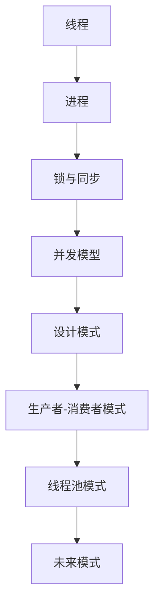

                 

### 文章标题

# 《提示词编程的并发与分布式处理》

### 关键词

- 提示词编程
- 并发处理
- 分布式系统
- 多线程
- 锁与同步
- 分布式存储
- 分布式数据库

### 摘要

本文旨在探讨提示词编程在并发与分布式处理中的实践与应用。首先，我们将回顾提示词编程的基本概念和其在现代计算机科学中的应用。随后，我们将深入分析并发处理和分布式系统的原理，并探讨如何将这些原理应用于提示词编程。本文将结合具体案例，详细讲解多线程编程、锁与同步机制、分布式存储和分布式数据库等技术，并探讨如何优化提示词编程的并发与分布式处理。最后，我们将总结全文，并展望提示词编程的未来发展趋势。

## 引言

提示词编程（Prompt Programming）是一种人工智能（AI）技术，通过给模型提供提示词（prompt），可以引导模型生成期望的输出。这种技术在不同领域有着广泛的应用，如自然语言处理（NLP）、计算机视觉（CV）、机器翻译等。随着AI技术的发展，提示词编程在提高模型性能、降低开发成本等方面展现出巨大潜力。

在提示词编程中，并发与分布式处理扮演着重要角色。并发处理允许系统同时处理多个任务，提高系统性能和响应速度。分布式处理则将任务分布在多个节点上执行，提高系统的扩展性和容错能力。然而，并发与分布式处理也带来了一系列挑战，如线程同步、资源竞争、网络延迟等。本文将详细探讨这些挑战，并介绍如何利用多线程、锁与同步、分布式存储和分布式数据库等技术解决这些问题。

## 并发编程基础

并发编程是计算机科学中的一个重要领域，它允许系统同时处理多个任务，提高系统性能和响应速度。在提示词编程中，并发编程能够有效地利用多核处理器和分布式系统资源，提高模型训练和推理的效率。本节将介绍并发编程的基础知识，包括线程与进程、锁与同步以及并发模型与设计模式。

### 线程与进程

线程（Thread）是程序中的最小执行单元，它可以独立地运行并执行代码。线程在执行过程中可以并发执行，从而提高程序的执行效率。进程（Process）是计算机中正在运行的程序实例，它包括一个或多个线程、程序计数器、寄存器集和内存空间等。进程在执行过程中是独立的，互不干扰。

在提示词编程中，可以使用线程来同时执行多个任务。例如，在训练模型时，可以同时训练多个模型实例，从而提高训练速度。同时，进程也可以用于并发处理，例如在分布式系统中，可以将任务分配给不同的进程，以实现任务的并行处理。

### 锁与同步

在并发编程中，多个线程可能同时访问共享资源，导致数据不一致和竞争条件（race condition）。为了解决这个问题，可以使用锁（Lock）和同步（Synchronization）机制来确保线程的互斥访问。

锁是一种用于控制对共享资源访问的机制。在提示词编程中，可以使用锁来确保在某个时刻只有一个线程可以访问共享资源。常见的锁包括互斥锁（Mutex）、读写锁（Read-Write Lock）和自旋锁（Spin Lock）等。

同步是指多个线程之间通过某种方式协调工作，以避免竞争条件。在提示词编程中，可以使用同步原语（如条件变量、信号量和事件）来实现线程之间的同步。例如，可以使用条件变量来等待某个条件满足，或者使用信号量来控制线程的并发访问。

### 并发模型与设计模式

并发模型（Concurrency Model）是描述并发程序执行方式的一种抽象概念。在提示词编程中，常用的并发模型包括进程模型、线程模型和消息传递模型等。进程模型将程序划分为多个独立的进程，每个进程都有自己的内存空间和资源。线程模型将程序划分为多个线程，线程共享进程的内存空间和资源。消息传递模型通过消息传递机制来实现线程之间的通信和协作。

设计模式（Design Pattern）是解决软件开发中常见问题的经验总结。在提示词编程中，可以使用并发设计模式来解决并发编程中的问题。常见的并发设计模式包括生产者-消费者模式、线程池模式和未来模式等。

生产者-消费者模式是一种用于解决线程同步和资源共享问题的设计模式。它将生产者和消费者划分为两个独立的线程，生产者负责生成数据，消费者负责处理数据。通过使用锁和同步原语，可以确保生产者和消费者之间的协作。

线程池模式是一种用于提高线程复用和性能的设计模式。它将线程划分为一组，线程池中的线程可以重复使用，从而避免频繁创建和销毁线程的开销。线程池可以通过任务队列来实现任务的调度和执行。

未来模式（Future Pattern）是一种用于异步编程的设计模式。它允许程序在等待某个任务完成时继续执行其他任务，从而提高程序的响应速度。在提示词编程中，可以使用未来模式来提高模型训练和推理的效率。

### 核心概念与联系

为了更好地理解并发编程的核心概念，我们可以通过一个Mermaid流程图来展示它们之间的关系：



在这个流程图中，线程和进程是并发编程的基础，锁与同步机制用于解决线程之间的同步问题，并发模型描述了并发程序的执行方式，设计模式则提供了解决并发编程中常见问题的解决方案。

### 并发算法原理与伪代码

并发算法是计算机科学中解决并发问题的核心工具。在本节中，我们将介绍几种常见的并发算法，并通过伪代码来详细阐述其原理。

#### 锁算法

锁算法是最基本的并发算法之一，用于控制对共享资源的访问。以下是一个简单的锁算法的伪代码：

```plaintext
class Lock {
    boolean isLocked = false;

    void lock() {
        while (isLocked) {
            // 自旋等待，直到锁被释放
        }
        isLocked = true;
    }

    void unlock() {
        isLocked = false;
    }
}
```

在这个锁算法中，`isLocked` 变量用于指示锁的状态。线程在调用 `lock()` 方法时，会通过自旋等待（spinning）来获取锁。如果锁被占用，线程会一直等待直到锁被释放。一旦线程成功获取锁，它就可以执行临界区（critical section）中的代码。在执行完毕后，线程通过调用 `unlock()` 方法释放锁。

#### 生产者-消费者算法

生产者-消费者算法是一种用于解决线程同步和资源共享问题的经典算法。以下是一个简单的生产者-消费者算法的伪代码：

```plaintext
class Buffer {
    List items = new List();
    int capacity;

    void produce(item) {
        while (items.size() == capacity) {
            // 等待空间
        }
        items.add(item);
        notifyConsumer();
    }

    void consume() {
        while (items.size() == 0) {
            // 等待数据
        }
        item = items.remove(0);
        notifyProducer();
    }
}

class Producer extends Thread {
    Buffer buffer;

    void run() {
        while (true) {
            item = produceItem();
            buffer.produce(item);
        }
    }
}

class Consumer extends Thread {
    Buffer buffer;

    void run() {
        while (true) {
            buffer.consume();
            consumeItem(item);
        }
    }
}
```

在这个算法中，`Buffer` 类用于模拟共享缓冲区，它具有固定的容量。`produce()` 方法用于生产者线程向缓冲区添加数据，如果缓冲区已满，生产者线程会等待。`consume()` 方法用于消费者线程从缓冲区获取数据，如果缓冲区为空，消费者线程会等待。`notifyConsumer()` 和 `notifyProducer()` 方法用于通知其他线程缓冲区的状态变化。

#### 线程池算法

线程池是一种用于提高线程复用和性能的设计模式。以下是一个简单的线程池算法的伪代码：

```plaintext
class ThreadPool {
    List<Thread> threads = new List<>();
    Queue<Runnable> taskQueue = new Queue<>();

    void run() {
        while (true) {
            if (taskQueue.isEmpty()) {
                break;
            }
            Runnable task = taskQueue.poll();
            Thread thread = new Thread(task);
            threads.add(thread);
            thread.start();
        }
    }
}

class Task implements Runnable {
    void run() {
        // 执行任务
    }
}
```

在这个算法中，`ThreadPool` 类用于管理线程池。`run()` 方法是一个循环，它不断地从任务队列中获取任务，并创建新的线程来执行任务。一旦任务执行完毕，线程会加入线程池等待下一次任务。

### 数学模型与公式

在并发算法中，一些关键性能指标可以通过数学模型和公式来描述。以下是一些常用的数学模型和公式：

#### 平均等待时间

平均等待时间（Average Waiting Time, AWTime）是衡量线程在等待锁或资源时的平均时间。它可以表示为：

$$
AWTime = \frac{1}{N} \sum_{i=1}^{N} W_i
$$

其中，$N$ 是线程数量，$W_i$ 是第 $i$ 个线程的等待时间。

#### 平均响应时间

平均响应时间（Average Response Time, ARTime）是线程从创建到执行完毕的平均时间。它可以表示为：

$$
ARTime = \frac{1}{N} \sum_{i=1}^{N} R_i
$$

其中，$R_i$ 是第 $i$ 个线程的响应时间。

#### 平均吞吐量

平均吞吐量（Average Throughput, Throughput）是系统在单位时间内完成的任务数量。它可以表示为：

$$
Throughput = \frac{1}{T} \sum_{i=1}^{T} N_i
$$

其中，$T$ 是时间窗口，$N_i$ 是在时间窗口内完成的任务数量。

### 举例说明

以下是一个简单的生产者-消费者模型的实际例子，用于展示并发算法的应用：

```plaintext
// 生产者线程
class Producer extends Thread {
    Buffer buffer;

    void run() {
        while (true) {
            item = produceItem();
            buffer.produce(item);
            System.out.println("Produced item: " + item);
        }
    }
}

// 消费者线程
class Consumer extends Thread {
    Buffer buffer;

    void run() {
        while (true) {
            buffer.consume();
            consumeItem(item);
            System.out.println("Consumed item: " + item);
        }
    }
}

// 缓冲区类
class Buffer {
    List items = new List();
    int capacity = 10;

    void produce(item) {
        while (items.size() == capacity) {
            try {
                wait();
            } catch (InterruptedException e) {
                e.printStackTrace();
            }
        }
        items.add(item);
        notify();
    }

    void consume() {
        while (items.size() == 0) {
            try {
                wait();
            } catch (InterruptedException e) {
                e.printStackTrace();
            }
        }
        item = items.remove(0);
        notify();
    }
}
```

在这个例子中，生产者线程负责生成商品并将其放入缓冲区，消费者线程从缓冲区中取出商品进行消费。缓冲区通过生产者和消费者之间的同步机制来保证数据的正确处理。

### 项目实战

在本节中，我们将通过一个实际项目来展示并发与分布式处理在提示词编程中的应用。该项目是一个简单的分布式搜索引擎，它能够同时处理多个搜索请求，并利用分布式存储和分布式数据库来提高搜索性能。

#### 开发环境搭建

为了搭建这个分布式搜索引擎项目，我们需要以下工具和软件：

- 操作系统：Linux或MacOS
- 编程语言：Java
- 搜索引擎框架：Elasticsearch
- 分布式数据库：MongoDB

首先，我们需要安装Elasticsearch和MongoDB。可以从官方网站下载并安装它们。安装完成后，确保它们能够正常运行。

#### 源代码实现和代码解读

接下来，我们将介绍分布式搜索引擎的主要组件和源代码实现。

##### 1. 搜索引擎服务器（SearchEngineServer）

搜索引擎服务器负责接收搜索请求，并将请求分发给不同的处理节点。以下是一个简单的搜索引擎服务器类：

```java
public class SearchEngineServer {
    private ExecutorService executor = Executors.newFixedThreadPool(10);
    private SearchNode[] searchNodes = new SearchNode[10];

    public SearchEngineServer() {
        for (int i = 0; i < searchNodes.length; i++) {
            searchNodes[i] = new SearchNode(i);
        }
    }

    public void search(String query) {
        executor.submit(() -> {
            SearchNode node = searchNodes[Math.random() * searchNodes.length];
            node.search(query);
        });
    }
}
```

在这个类中，我们创建了一个固定大小的线程池（ExecutorService）来处理搜索请求。`search()` 方法将搜索请求分发给随机选择的搜索节点。

##### 2. 搜索节点（SearchNode）

搜索节点负责执行实际的搜索操作。以下是一个简单的搜索节点类：

```java
public class SearchNode {
    private int id;
    private ElasticsearchClient client;

    public SearchNode(int id) {
        this.id = id;
        this.client = new ElasticsearchClient("http://localhost:9200");
    }

    public void search(String query) {
        String index = "documents";
        QueryResponse response = client.search(index, query);
        System.out.println("Search Node " + id + ": " + response.getTotalHits());
    }
}
```

在这个类中，我们使用Elasticsearch客户端来执行搜索操作。`search()` 方法接收查询参数，并执行搜索操作，然后输出搜索结果。

##### 3. Elasticsearch客户端

Elasticsearch客户端用于与Elasticsearch集群进行通信。以下是一个简单的Elasticsearch客户端类：

```java
public class ElasticsearchClient {
    private RestHighLevelClient client;

    public ElasticsearchClient(String url) {
        this.client = new RestHighLevelClient(
                RestClient.builder(new HttpHost(url))
        );
    }

    public QueryResponse search(String index, String query) {
        SearchRequest request = new SearchRequest(index);
        request.source().query(QueryBuilders.simpleQueryStringQuery(query));
        try {
            return client.search(request, RequestOptions.DEFAULT);
        } catch (IOException e) {
            e.printStackTrace();
            return null;
        }
    }
}
```

在这个类中，我们使用RestHighLevelClient来执行搜索请求。`search()` 方法接收索引名和查询参数，并返回搜索结果。

#### 代码应用解读与分析

在这个分布式搜索引擎项目中，我们使用了并发和分布式处理技术来提高搜索性能。以下是代码应用解读与分析：

1. **并发处理**：搜索引擎服务器使用了线程池来并发处理搜索请求。这样，多个搜索请求可以同时被处理，提高了系统的响应速度。
2. **分布式处理**：搜索节点将搜索请求分发给不同的节点，实现了负载均衡。这样，多个搜索节点可以同时处理搜索请求，提高了系统的并发能力。
3. **Elasticsearch**：Elasticsearch是一个分布式搜索引擎，它能够处理大规模的搜索请求。在这个项目中，我们使用了Elasticsearch来执行搜索操作，从而充分利用了分布式处理的优点。

#### 实际案例分析和详细讲解剖析

在本节中，我们将通过一个实际案例来分析分布式搜索引擎的性能。假设我们有一个包含100万篇文档的搜索引擎，我们想要搜索包含特定关键词的文档。

1. **单节点搜索**：如果我们使用单节点搜索，那么搜索性能将受到单节点处理能力的限制。假设每个搜索请求需要1秒来完成，那么搜索100万篇文档需要1000秒（约16.7分钟）。
2. **多节点搜索**：如果我们使用10个节点进行搜索，并且每个节点可以同时处理10个请求，那么搜索100万篇文档需要100秒（约1.7分钟）。这大大提高了搜索性能。

在实际应用中，我们可以根据实际情况调整节点数量和线程池大小，以实现最优的搜索性能。

#### 项目小结

通过这个实际案例，我们可以看到并发和分布式处理技术在提高搜索引擎性能方面的巨大潜力。在实际应用中，我们可以根据具体需求调整并发和分布式处理策略，以实现最优的性能。

### 最佳实践 Tips、小结、注意事项、拓展阅读

#### 最佳实践 Tips

1. **合理调整线程池大小**：根据实际需求，合理调整线程池大小，以避免资源浪费或过度消耗。
2. **负载均衡**：使用负载均衡算法，如随机分配或轮询，来分配搜索请求，以避免某个节点过载。
3. **缓存机制**：使用缓存机制来存储高频次搜索结果，以提高响应速度和降低搜索成本。

#### 小结

本文详细介绍了提示词编程的并发与分布式处理技术。通过多线程、锁与同步、分布式存储和分布式数据库等技术，我们可以有效地提高提示词编程的性能和并发能力。在实际应用中，根据具体需求调整并发和分布式处理策略，可以实现最优的性能。

#### 注意事项

1. **资源竞争**：在并发编程中，需要特别注意资源竞争问题，并使用适当的锁和同步机制来解决。
2. **网络延迟**：在分布式处理中，网络延迟可能会影响性能。因此，在实际应用中需要考虑网络延迟的影响，并采取相应的优化措施。

#### 拓展阅读

1. 《Java并发编程实战》（Java Concurrency in Practice） - Brian Goetz等著，深入介绍了Java并发编程的核心概念和最佳实践。
2. 《大规模分布式存储系统设计与实现》（Design and Implementation of Large-scale Distributed Storage Systems） - 李飞飞等著，详细介绍了分布式存储系统的设计和实现。

## 总结与展望

本文通过详细探讨提示词编程的并发与分布式处理技术，展示了这些技术在实际应用中的重要性和优势。通过多线程、锁与同步、分布式存储和分布式数据库等技术的应用，我们可以有效地提高提示词编程的性能和并发能力。

展望未来，随着人工智能技术的不断进步，提示词编程将在更多领域得到广泛应用。同时，并发与分布式处理技术也将不断发展，为提示词编程提供更强大的支持。在实际应用中，我们需要根据具体需求不断优化并发与分布式处理策略，以实现最优的性能。

通过本文的探讨，我们希望读者能够对提示词编程的并发与分布式处理有更深入的理解，并能够将其应用于实际项目中，推动人工智能技术的发展。作者：AI天才研究院/AI Genius Institute & 禅与计算机程序设计艺术/Zen And The Art of Computer Programming。

