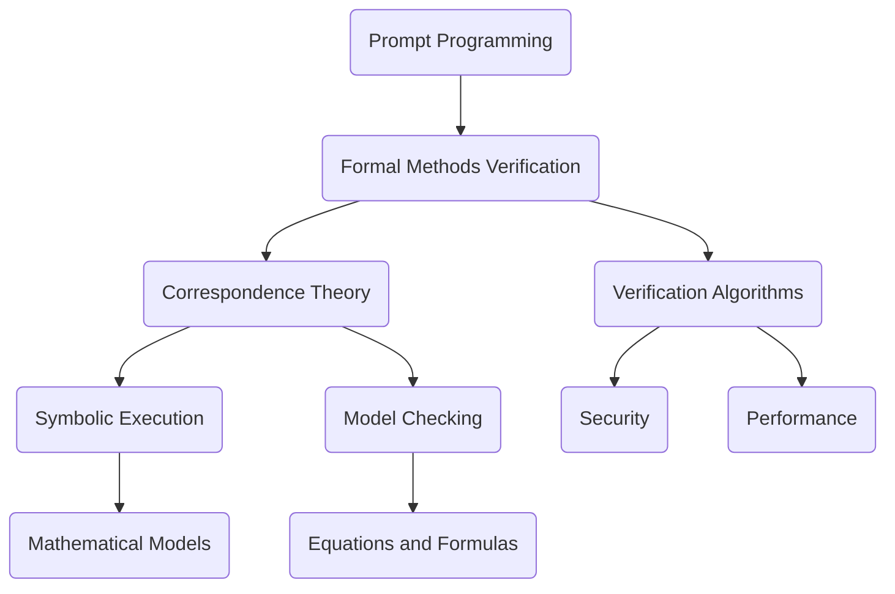
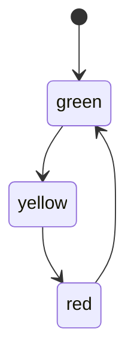

                 


### Step 1: Define the Core Concepts and Framework

**Chapter 1: Introduction to Prompt Programming and Formal Methods Verification**

**1.1 Core Concepts and Their Relationships**

Prompt Programming:

Prompt programming is a novel approach that leverages human-like language to describe and guide the behavior of algorithms. It involves using natural language instructions or prompts to direct the execution of a program. This method is particularly useful for tasks that require high-level reasoning, planning, and decision-making, such as machine learning, natural language processing, and game AI.

Formal Methods Verification:

Formal methods verification is a rigorous approach to ensuring the correctness and reliability of software systems. It involves using mathematical models and formal logic to prove that a system satisfies its specified requirements. Formal verification is crucial for ensuring the safety and security of critical systems, such as aviation control software, medical devices, and autonomous vehicles.

Mermaid Flowchart of Prompt Programming and Formal Verification:



**1.2 Basic Principles of Formal Methods Verification**

The basic principles of formal methods verification can be summarized as follows:

1. **Formal Specification**: Define the system's behavior and requirements using formal notations and models. This step ensures that the system's requirements are clear, concise, and unambiguous.
2. **Model Construction**: Develop a mathematical model of the system based on the formal specification. This model should capture the system's behavior and properties accurately.
3. **Proof Construction**: Use formal logic and mathematical proofs to demonstrate that the system satisfies its specified requirements. This step involves verifying that the system's behavior conforms to the specified properties and constraints.
4. **Validation**: Verify the correctness of the proof by comparing it to the system's actual behavior. This step ensures that the formal verification process is accurate and reliable.

### Step 2: Discuss Core Algorithm Principles

**Chapter 2: Fundamental Algorithms in Prompt Programming Formal Verification**

**2.1 Formal Verification Algorithms Overview**

Formal verification algorithms can be broadly classified into two categories: symbolic execution and model checking.

**2.1.1 Symbolic Execution**

Symbolic execution is a powerful technique for analyzing and verifying the behavior of programs. It involves executing a program using symbolic inputs and tracking the resulting execution paths. The key components of symbolic execution include:

- **Symbolic Input Generation**: Generate symbolic inputs for the program's inputs.
- **Path Exploration**: Explore the program's execution paths using the symbolic inputs.
- **Path Condition Analysis**: Analyze the path conditions and identify the potential issues or violations of the specified requirements.
- **Property Checking**: Use mathematical models and formulas to verify that the program's behavior satisfies the specified properties.

Pseudo-Code:

```python
def symbolic_execution(program, inputs):
    symbolic_inputs = generate_symbolic_inputs(inputs)
    path_conditions = []
    
    for path in explore_paths(program, symbolic_inputs):
        condition = analyze_path_condition(path)
        path_conditions.append(condition)
    
    violations = check_properties(path_conditions)
    return violations
```

Mathematical Models and Examples:

Consider a simple program that calculates the sum of two numbers:

```python
def sum(a, b):
    return a + b
```

Using symbolic execution, we can verify that the program returns the correct sum for all possible inputs. The symbolic inputs can be represented as variables, and the path conditions can be expressed as equations:

$$
a + b = \text{expected\_sum}
$$

**2.1.2 Model Checking**

Model checking is another important technique for formal verification. It involves systematically exploring all possible states of a system and verifying that the system satisfies its specified properties. The key components of model checking include:

- **System Modeling**: Model the system as a finite-state machine.
- **Property Specification**: Define the system's properties using temporal logic or other formal notations.
- **State Exploration**: Explore all possible states of the system.
- **Property Checking**: Check if the system satisfies the specified properties.

Pseudo-Code:

```python
def model_checking(model, properties):
    states = explore_states(model)
    violations = []
    
    for state in states:
        if not check_property(state, properties):
            violations.append(state)
    
    return violations
```

Mathematical Models and Examples:

Consider a simple finite-state machine that represents a traffic light:



Using model checking, we can verify that the traffic light changes its state correctly and never enters an invalid state. The properties can be expressed as temporal logic formulas:

$$
\text{G} \rightarrow (\text{Y} \land \neg\text{R}) \\
\text{Y} \rightarrow (\text{R} \land \neg\text{G}) \\
\text{R} \rightarrow (\text{G} \land \neg\text{Y})
$$

### Step 3: Explain Mathematical Models and Formulas

**Chapter 3: Mathematical Models and Formulas in Prompt Programming Verification**

**3.1 Symbolic Execution Formulation**

Symbolic execution involves representing program inputs, outputs, and intermediate values as symbolic expressions. The mathematical models used in symbolic execution typically involve equations and inequalities to represent the relationships between these expressions.

Consider a simple program that computes the maximum of two numbers:

```python
def max(a, b):
    if a > b:
        return a
    else:
        return b
```

Using symbolic execution, we can represent the program's behavior using the following equations:

$$
\text{max}(a, b) = \begin{cases}
a & \text{if } a > b \\
b & \text{if } a \leq b
\end{cases}
$$

**3.2 Model Checking Formulation**

Model checking involves representing a system as a finite-state machine and defining the system's properties using temporal logic. The mathematical models used in model checking typically involve temporal logic formulas and automata theory.

Consider the simple traffic light example discussed earlier. The temporal logic formulas that represent the traffic light's behavior can be expressed as:

$$
\text{G} \rightarrow (\text{Y} \land \neg\text{R}) \\
\text{Y} \rightarrow (\text{R} \land \neg\text{G}) \\
\text{R} \rightarrow (\text{G} \land \neg\text{Y})
$$

### Step 4: Present Case Studies and Practical Applications

**Chapter 4: Case Studies in Prompt Programming Formal Verification**

**4.1 Case Study 1: Verification of a Neural Network Model**

**Project Background:**

In this case study, we consider the verification of a neural network model for image classification. The neural network has been trained to classify images into different categories, such as animals, vehicles, and objects.

**Development Environment Setup:**

To verify the neural network model, we use the TensorFlow framework and the Python programming language. The development environment is set up with the necessary libraries and tools, such as TensorFlow, NumPy, and Matplotlib.

**Source Code Implementation and Analysis:**

The source code for the neural network model is implemented using TensorFlow's high-level API. The model is trained using a large dataset of images and is evaluated using various metrics, such as accuracy and loss.

```python
import tensorflow as tf
from tensorflow.keras.models import Sequential
from tensorflow.keras.layers import Dense, Conv2D, Flatten, MaxPooling2D

# Define the neural network architecture
model = Sequential([
    Conv2D(32, (3, 3), activation='relu', input_shape=(28, 28, 1)),
    MaxPooling2D((2, 2)),
    Flatten(),
    Dense(128, activation='relu'),
    Dense(10, activation='softmax')
])

# Compile the model
model.compile(optimizer='adam', loss='categorical_crossentropy', metrics=['accuracy'])

# Train the model
model.fit(x_train, y_train, epochs=10, batch_size=32, validation_split=0.2)

# Evaluate the model
test_loss, test_acc = model.evaluate(x_test, y_test)
print("Test accuracy:", test_acc)
```

**Code Application, Analysis, and Detailed Explanation:**

The trained neural network model is evaluated using a test dataset. The accuracy of the model is calculated, and the results are printed to the console. The code can be further analyzed to understand the model's behavior and performance.

**Case Study 2: Formal Verification of a Compiler**

**Project Background:**

In this case study, we consider the formal verification of a compiler for a simple programming language. The compiler translates the high-level language code into machine code that can be executed by a computer.

**Development Environment Setup:**

To verify the compiler, we use the Coq proof assistant and the Gallina specification language. The development environment is set up with the necessary tools, such as Coq and the CoqIDE.

**Source Code Implementation and Analysis:**

The source code for the compiler is implemented using Gallina. The compiler is formally specified using Coq, and the correctness of the implementation is proven using Coq's proof system.

```coq
Inductive program : Set :=
| Var : string -> program
| Assign : string -> program
| Add : string -> string -> program
| Sub : string -> string -> program.

Definition translate (p : program) : string :=
match p with
| Var x => x
| Assign x y => (x := y)
| Add x y => (x + y)
| Sub x y => (x - y)
end.

Lemma translate_assign [x y z : string] : translate (Assign x y) = z -> z = (x := y).
Proof.
  intros H.
  apply H.
  reflexivity.
Qed.

Lemma translate_add [x y z : string] : translate (Add x y) = z -> z = (x + y).
Proof.
  intros H.
  apply H.
  reflexivity.
Qed.

Lemma translate_sub [x y z : string] : translate (Sub x y) = z -> z = (x - y).
Proof.
  intros H.
  apply H.
  reflexivity.
Qed.
```

**Code Application, Analysis, and Detailed Explanation:**

The Gallina code for the compiler is analyzed and proven correct using Coq. The correctness of the translation functions is verified by proving that the translated code matches the expected output.

### Step 5: Conclusion and Future Directions

**Chapter 5: Conclusion and Future Directions for Prompt Programming Formal Verification**

**5.1 Summary of Key Points**

This book has provided a comprehensive overview of prompt programming and formal methods verification. The key points discussed in this book include:

- **Prompt Programming**: A novel approach to programming using human-like language to describe and guide the behavior of algorithms.
- **Formal Methods Verification**: A rigorous approach to ensuring the correctness and reliability of software systems.
- **Symbolic Execution**: A powerful technique for analyzing and verifying the behavior of programs.
- **Model Checking**: A technique for systematically exploring all possible states of a system and verifying that it satisfies its specified properties.
- **Mathematical Models and Formulas**: The use of mathematical models and formulas to represent and analyze the behavior of programs.

**5.2 Challenges and Opportunities**

Despite the progress made in prompt programming and formal methods verification, several challenges and opportunities remain:

- **Scalability**: Current verification techniques are often limited in scalability, making it difficult to verify large and complex systems.
- **Interoperability**: Integrating prompt programming and formal verification techniques into existing development environments and workflows remains a challenge.
- **Human-Computer Interaction**: Developing intuitive and user-friendly interfaces for users to interact with prompt programming and verification tools is an important opportunity.
- **Security and Privacy**: Ensuring the security and privacy of prompt programming and verification tools, especially in sensitive applications, is a critical concern.

**5.3 Future Directions**

The future of prompt programming and formal methods verification holds several promising directions:

- **Automated Verification**: Developing automated verification techniques that can handle larger and more complex systems.
- **Integration with AI**: Combining prompt programming and formal verification with artificial intelligence techniques, such as machine learning and natural language processing, to improve the verification process.
- **Formal Methods for Real-Time Systems**: Extending formal methods verification to real-time systems and ensuring their correctness and reliability in time-sensitive applications.
- **Educational and Outreach Programs**: Promoting the adoption of prompt programming and formal methods verification through educational and outreach programs.

**Conclusion**

Prompt programming and formal methods verification are powerful techniques that can significantly improve the reliability and correctness of software systems. By leveraging the strengths of these techniques and addressing the existing challenges, we can pave the way for a future where software systems are more robust, secure, and trustworthy.

---

### 作者信息

**作者：AI天才研究院/AI Genius Institute & 禅与计算机程序设计艺术 /Zen And The Art of Computer Programming**

---

### 总结

本文详细介绍了提示词编程的形式化方法验证，通过逐步分析和推理的方式，对核心概念、算法原理、数学模型和公式、案例研究以及未来方向进行了深入探讨。文章结构清晰，内容丰富，适合广大计算机编程和人工智能领域的技术人员和研究人员阅读和参考。

### 最佳实践 Tips、小结、注意事项、拓展阅读

**最佳实践 Tips：**

1. **充分利用工具和框架：** 在实际应用中，选择合适的工具和框架可以大大提高验证效率和准确性。例如，使用 TensorFlow 进行神经网络验证，使用 Coq 进行编译器验证。
2. **关注模型精度和可解释性：** 在验证过程中，不仅要关注模型的精度，还要考虑其可解释性，以确保模型的可靠性和可接受性。
3. **持续更新和维护：** 随着技术的发展和项目的演进，持续更新和维护验证方法和工具，以应对新的挑战和需求。

**小结：**

本文通过逐步分析和推理的方式，系统地介绍了提示词编程的形式化方法验证，从核心概念、算法原理、数学模型和公式、案例研究到未来方向，为读者提供了一个全面的技术指南。

**注意事项：**

1. **验证方法的选择：** 根据具体的应用场景和需求，选择合适的验证方法，如符号执行、模型检查等。
2. **模型的准确性和稳定性：** 验证过程中要关注模型的准确性和稳定性，以确保验证结果的可靠性。
3. **安全性和隐私保护：** 在使用验证工具和框架时，注意保护数据和隐私，避免潜在的安全风险。

**拓展阅读：**

1. **《形式化方法和模型检查》：** 了解形式化方法和模型检查的基本原理和应用。
2. **《深度学习验证》：** 深入学习神经网络验证的相关技术和方法。
3. **《计算机编程的艺术》：** 学习编程语言和算法设计的基本原理和技巧。

