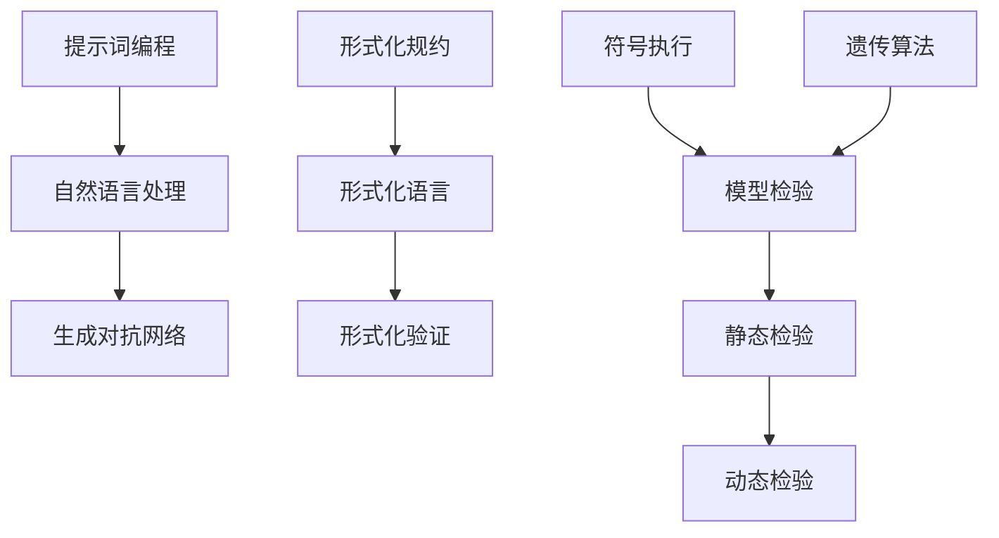

                 

### 文章标题

“提示词编程的形式化规约与模型检验”

### 关键词

- 提示词编程
- 形式化规约
- 模型检验
- 自然语言处理
- 生成对抗网络
- 符号执行
- 遗传算法

### 摘要

本文深入探讨了提示词编程、形式化规约和模型检验三个核心概念及其相互关系。通过引入Mermaid流程图，本文详细阐述了提示词编程的流程和关键技术，分析了形式化规约的基本原理、工具和应用，以及模型检验的概念、方法和应用场景。接着，本文将形式化规约与模型检验相结合，探讨了其融合的可行性和应用实例。最后，本文通过一个智能助手的项目实战，展示了如何在实际开发中应用这些技术，并给出了项目小结和未来研究方向。本文旨在为读者提供一个系统而深入的理解，帮助其在人工智能领域取得更好的成果。

### 引言

在人工智能（AI）迅速发展的今天，编程的方式和工具也在不断演进。传统的编程方法侧重于代码的编写和执行，而新兴的提示词编程则通过自然语言与计算机的交互，改变了编程的本质。提示词编程不仅能够简化编程过程，还能够提高开发效率和代码质量。与此同时，形式化规约和模型检验作为现代软件工程和人工智能的核心技术，对提升系统的可靠性和安全性具有重要作用。

提示词编程是一种通过自然语言与计算机系统交互的编程方法。开发人员通过输入自然语言指令（即提示词），计算机系统根据这些指令生成相应的代码或执行特定的任务。这种方法不仅简化了编程过程，还能够降低编程难度，让非专业开发者也能参与到编程中来。

形式化规约是一种将系统需求、设计、实现和验证等过程以形式化语言进行描述的方法。通过形式化规约，开发人员可以更精确地表达系统需求，从而减少误解和错误。形式化规约不仅提高了软件开发的可追溯性和可维护性，还能够在设计阶段就发现潜在的问题。

模型检验是一种通过验证模型是否符合预期行为的方法。模型检验包括静态检验和动态检验两种方式。静态检验通过分析模型的结构和属性来发现错误，而动态检验则通过实际运行模型来验证其行为。模型检验能够确保系统的正确性和可靠性，减少系统崩溃和安全隐患。

本文旨在深入探讨提示词编程、形式化规约和模型检验这三个核心概念及其相互关系。通过引入Mermaid流程图，本文详细阐述了提示词编程的流程和关键技术，分析了形式化规约的基本原理、工具和应用，以及模型检验的概念、方法和应用场景。接着，本文将形式化规约与模型检验相结合，探讨了其融合的可行性和应用实例。最后，本文通过一个智能助手的项目实战，展示了如何在实际开发中应用这些技术，并给出了项目小结和未来研究方向。本文旨在为读者提供一个系统而深入的理解，帮助其在人工智能领域取得更好的成果。

### 核心概念与联系

在探讨提示词编程、形式化规约与模型检验之前，首先需要明确这些核心概念及其相互关系。提示词编程通过自然语言与计算机系统的交互，简化了编程过程；形式化规约则通过形式化语言描述系统需求和设计，提高了开发的精确性和可维护性；模型检验则通过验证模型是否符合预期行为，确保了系统的正确性和可靠性。

#### 提示词编程

提示词编程是一种通过自然语言与计算机系统交互的编程方法。开发人员通过输入自然语言指令（即提示词），计算机系统根据这些指令生成相应的代码或执行特定的任务。例如，开发人员可以输入“创建一个简单的聊天机器人”，系统则会生成相应的代码框架和执行逻辑。

提示词编程的关键技术包括自然语言处理（NLP）和生成对抗网络（GAN）。自然语言处理技术用于理解开发人员的提示词，并将其转换为计算机可执行的指令。生成对抗网络则用于生成高质量的代码或模型，从而提高编程效率和代码质量。

#### 形式化规约

形式化规约是一种将系统需求、设计、实现和验证等过程以形式化语言进行描述的方法。通过形式化规约，开发人员可以更精确地表达系统需求，从而减少误解和错误。形式化规约不仅提高了软件开发的可追溯性和可维护性，还能够在设计阶段就发现潜在的问题。

形式化规约的基本原理包括形式化语言和形式化验证。形式化语言是一种具有严格语法和语义规则的语言，用于描述系统需求和设计。形式化验证则是通过数学方法验证系统设计是否符合预定的需求和规范。

#### 模型检验

模型检验是一种通过验证模型是否符合预期行为的方法。模型检验包括静态检验和动态检验两种方式。静态检验通过分析模型的结构和属性来发现错误，而动态检验则通过实际运行模型来验证其行为。模型检验能够确保系统的正确性和可靠性，减少系统崩溃和安全隐患。

模型检验的关键技术包括符号执行和遗传算法。符号执行是一种通过符号化推理来验证程序正确性的方法，而遗传算法则是一种基于自然进化机制的优化算法，用于搜索最优解。

#### Mermaid流程图

为了更好地理解这三个核心概念及其相互关系，我们可以使用Mermaid流程图进行可视化描述。以下是一个简化的Mermaid流程图示例：



在这个流程图中，提示词编程通过自然语言处理和生成对抗网络实现；形式化规约通过形式化语言和形式化验证实现；模型检验通过静态检验和动态检验实现。符号执行和遗传算法是模型检验的关键技术。

通过这个Mermaid流程图，我们可以更直观地理解提示词编程、形式化规约和模型检验之间的关系，为后续章节的详细探讨奠定基础。

#### 提示词编程基础

提示词编程作为人工智能领域的一项前沿技术，其基础理论涵盖了自然语言处理（NLP）、生成对抗网络（GAN）等多个方面。理解这些基础理论对于深入探讨提示词编程的实际应用具有重要意义。

##### 提示词编程的流程

提示词编程的流程可以分为三个主要阶段：提示词输入、提示词理解和生成。

1. **提示词输入**：这是整个流程的起点，用户通过自然语言输入他们的需求或指令。这些输入可以是简单的命令，如“创建一个简单的聊天机器人”，也可以是复杂的任务描述，如“实现一个能够处理多轮对话的智能助手”。

2. **提示词理解**：在这个阶段，系统需要理解用户的输入并提取关键信息。自然语言处理（NLP）技术在此发挥了关键作用。NLP包括词法分析、句法分析、语义分析和对话管理等多个方面。通过这些技术，系统能够将自然语言转换为结构化的数据形式，如语法树或语义角色标注。

3. **生成**：理解了用户的提示词后，系统需要生成相应的代码或执行逻辑。生成对抗网络（GAN）是这一阶段的关键技术。GAN由生成器和判别器组成，生成器负责生成代码或模型，判别器则负责评估生成结果的合理性。通过不断的训练和优化，生成器能够生成高质量的代码或模型，从而满足用户的需求。

##### 提示词编程的关键技术

1. **自然语言处理（NLP）技术**：

自然语言处理是提示词编程的核心技术之一。它主要包括以下方面：

- **词法分析**：将文本分解为单词或短语，识别出文本中的词汇单位。
- **句法分析**：分析句子的结构，识别出句子中的主语、谓语、宾语等成分。
- **语义分析**：理解句子的含义，识别出句子中的语义关系。
- **对话管理**：管理多轮对话，确保系统能够理解并回应用户的不同指令。

2. **生成对抗网络（GAN）**：

生成对抗网络是一种深度学习模型，由生成器和判别器组成。生成器负责生成代码或模型，判别器则负责评估生成结果的合理性。通过不断的训练和优化，生成器能够生成高质量的代码或模型，从而满足用户的需求。

生成对抗网络的工作原理可以概括为以下步骤：

- **生成器**：生成器接收随机噪声作为输入，通过神经网络生成代码或模型。
- **判别器**：判别器接收生成器和真实数据的输入，通过神经网络判断输入代码或模型的质量。
- **对抗训练**：生成器和判别器相互对抗，生成器通过不断生成更高质量的代码或模型来欺骗判别器，判别器则通过不断提高辨别能力来识破生成器的生成结果。

##### 提示词编程实例分析

为了更直观地理解提示词编程的应用，我们来看两个实例。

1. **聊天机器人**：

假设开发人员输入提示词“创建一个简单的聊天机器人”，提示词编程系统会生成相应的代码框架和执行逻辑。首先，系统会使用NLP技术理解提示词，提取出关键词如“聊天机器人”。然后，系统会使用GAN生成聊天机器人的核心代码，包括对话管理、文本生成和响应处理等模块。最后，系统将生成的代码提交给开发人员进行进一步的调试和优化。

2. **智能客服**：

在智能客服的应用场景中，开发人员输入提示词“实现一个能够处理多轮对话的智能客服系统”，系统会进行类似的处理。首先，系统会使用NLP技术理解多轮对话的流程，识别出用户的需求和问题。然后，系统会使用GAN生成智能客服的核心代码，包括对话管理、知识库查询和响应生成等模块。最后，系统将生成的代码与现有客服系统集成，实现多轮对话处理功能。

通过这些实例，我们可以看到提示词编程如何通过自然语言处理和生成对抗网络，将开发人员的自然语言指令转化为实际可执行的代码或模型，从而简化编程过程，提高开发效率。

#### 形式化规约原理

形式化规约作为现代软件工程和人工智能领域的关键技术，通过将系统需求、设计、实现和验证等过程以形式化语言进行描述，极大地提高了软件开发的精确性和可维护性。形式化规约的核心在于使用形式化的方法和工具，确保系统能够按照预定的需求和规范正确运作。

##### 形式化规约的基本原理

1. **形式化语言**：

形式化语言是一种具有严格语法和语义规则的语言，用于精确描述系统的需求和设计。形式化语言的主要特点是：

- **语法严格**：形式化语言有明确的语法规则，每个语法单元都有固定的格式和结构，确保描述的一致性和准确性。
- **语义明确**：形式化语言通过明确的语义规则，确保每个语法单元的含义和功能得到精确表达，从而避免理解和实现的误差。

常见的形式化语言包括谓词逻辑、模型检查语言（如Promela）和事务处理语言（如TLA+）等。

2. **形式化验证**：

形式化验证是一种通过数学方法验证系统设计是否符合预定需求和规范的过程。形式化验证的主要步骤包括：

- **模型构建**：将系统需求以形式化语言进行描述，构建出系统的形式化模型。
- **规范定义**：定义系统的规范，明确系统的正确性和性能要求。
- **验证过程**：使用数学推理和自动化工具验证系统模型是否满足规范，确保系统设计符合预期。

常见的形式化验证方法包括模型检查、模拟和定理证明等。

##### 形式化规约的优势

1. **精确性**：

形式化规约通过形式化语言和严格的验证方法，确保系统的需求、设计和实现具有高度的精确性。这种精确性有助于减少需求和实现之间的误解和错误，提高软件的质量和可靠性。

2. **可维护性**：

形式化规约使得系统设计和实现过程更加规范化和可重复化，提高了系统的可维护性。通过形式化规约，开发人员可以更容易地理解系统的设计和功能，便于后续的维护和扩展。

3. **可追溯性**：

形式化规约提供了完整的系统描述和验证记录，使得系统设计和实现过程具有更高的可追溯性。这对于问题定位和责任追究具有重要意义。

4. **早期发现错误**：

通过形式化验证，开发人员可以在系统实现之前发现潜在的错误和问题，从而避免在后续的开发过程中付出更高的代价。这种早期发现错误的能力显著提高了软件开发的效率和质量。

##### 形式化规约的应用

形式化规约在多个领域得到了广泛应用，包括：

1. **软件工程**：

在软件工程中，形式化规约被用于需求分析、系统设计和代码审查等环节，确保软件系统的正确性和可靠性。例如，使用TLA+进行系统性能建模和分析，使用Promela进行通信协议的设计和验证等。

2. **人工智能**：

在人工智能领域，形式化规约被用于模型设计和算法验证。通过形式化规约，开发人员可以精确描述和验证人工智能模型的行为，确保模型的正确性和可靠性。例如，使用谓词逻辑进行深度学习模型的验证和分析。

3. **硬件设计**：

在硬件设计领域，形式化规约被用于电路设计和验证。通过形式化规约，开发人员可以精确描述和验证电路的行为，确保电路的正确性和性能。

#### 形式化规约与模型检验的关系

形式化规约和模型检验是现代软件工程和人工智能领域中的两个关键概念，它们在系统设计和验证过程中发挥着重要作用。形式化规约通过形式化语言和严格的验证方法，确保系统的需求、设计和实现具有高度的精确性和可靠性；而模型检验则通过验证模型的行为是否符合预期，确保系统的正确性和可靠性。

1. **形式化规约与模型检验的融合**：

形式化规约和模型检验之间存在密切的联系。形式化规约为模型检验提供了明确的需求和规范，而模型检验则通过验证过程确保系统的设计和实现符合这些规范。将形式化规约与模型检验相结合，可以形成一种闭环的验证体系，确保系统的各个层次都能够得到有效的验证和保证。

2. **融合的应用**：

形式化规约和模型检验的融合在多个领域得到了广泛应用。例如：

- **软件工程**：在软件工程中，通过形式化规约描述系统需求，然后使用模型检验验证系统设计的正确性和可靠性，从而确保软件系统的质量和性能。
- **人工智能**：在人工智能领域，通过形式化规约描述人工智能模型的行为，然后使用模型检验验证模型的正确性和鲁棒性，从而确保人工智能系统的可信度和可靠性。
- **硬件设计**：在硬件设计领域，通过形式化规约描述电路的行为，然后使用模型检验验证电路的正确性和性能，从而确保硬件系统的可靠性和稳定性。

#### 形式化规约与模型检验的应用实例

为了更好地理解形式化规约与模型检验在实际开发中的应用，我们可以通过以下实例进行探讨：

1. **实例一：智能合约**

在区块链技术中，智能合约是一种自动执行合约条款的计算机协议。通过形式化规约，开发人员可以精确描述智能合约的条款和逻辑，例如使用谓词逻辑或形式化语言描述货币转移、合同执行等操作。然后，使用模型检验技术对智能合约进行验证，确保合约的行为符合预期，从而避免潜在的安全漏洞和逻辑错误。

2. **实例二：自动驾驶系统**

自动驾驶系统是一个复杂的软件系统，涉及到感知、决策和控制等多个方面。通过形式化规约，开发人员可以精确描述自动驾驶系统的需求和行为，例如使用TLA+描述系统的状态转换和决策逻辑。然后，使用模型检验技术对自动驾驶系统进行验证，确保系统的行为符合安全规范和性能要求，从而提高自动驾驶系统的可靠性和安全性。

3. **实例三：金融风险管理**

在金融风险管理中，通过形式化规约描述金融模型和算法，例如使用Promela描述交易流程和风险指标计算。然后，使用模型检验技术对金融模型进行验证，确保模型的预测和决策结果符合实际金融市场的行为，从而提高金融风险管理的能力和准确性。

通过这些实例，我们可以看到形式化规约和模型检验在实际开发中的应用，如何通过精确的需求描述和严格的验证过程，确保系统的正确性和可靠性。

#### 模型检验方法

模型检验作为确保人工智能系统可靠性和正确性的重要手段，涵盖了多种技术和方法。模型检验的主要目标是通过验证模型的行为是否符合预期，发现并修复潜在的错误，从而提高系统的稳定性和安全性。以下是几种常见的模型检验方法及其具体步骤：

##### 符号执行

符号执行是一种通过符号化推理来验证程序正确性的方法。它通过对程序执行路径进行抽象和符号化表示，生成约束条件，然后使用定理证明工具来验证这些约束条件是否成立。

1. **符号执行的基本步骤**：

- **路径抽象**：将程序的所有可能执行路径进行抽象，表示为符号化形式。
- **约束生成**：在每条执行路径上，根据程序的行为生成约束条件。
- **定理证明**：使用定理证明工具验证生成的约束条件是否成立。

2. **符号执行的优势**：

- **全面性**：符号执行能够覆盖程序的所有执行路径，确保发现潜在的错误。
- **准确性**：通过符号化表示，能够精确地验证程序的正确性。

3. **符号执行的局限**：

- **计算复杂度高**：随着程序规模的增长，符号执行的复杂度呈指数级增长。
- **适用性有限**：符号执行主要适用于逻辑性较强的程序，对复杂度较高的程序效果不佳。

##### 遗传算法

遗传算法是一种基于自然进化机制的优化算法，通过模拟自然进化过程来搜索最优解。遗传算法适用于模型参数的优化和复杂问题的求解。

1. **遗传算法的基本步骤**：

- **初始化种群**：生成一组随机解作为初始种群。
- **适应度评估**：对每个个体进行评估，计算其适应度值。
- **选择**：根据适应度值选择个体，形成新的种群。
- **交叉**：通过交叉操作产生新的个体。
- **变异**：对个体进行随机变异，增加种群的多样性。
- **迭代**：重复选择、交叉和变异操作，直到满足终止条件。

2. **遗传算法的优势**：

- **全局优化**：遗传算法能够搜索全局最优解，避免了局部最优的问题。
- **鲁棒性**：遗传算法对初始解的依赖性较低，具有较强的鲁棒性。

3. **遗传算法的局限**：

- **计算复杂度高**：遗传算法的迭代过程需要大量的计算资源。
- **参数敏感**：遗传算法的参数设置对搜索结果有较大影响，需要精心调整。

##### 其他模型检验方法

除了符号执行和遗传算法，还有其他一些模型检验方法，如模拟检验、统计学检验和模型检查等。

- **模拟检验**：通过实际运行模型来验证其行为是否符合预期。模拟检验适用于实时系统和复杂的动态系统。
- **统计学检验**：使用统计学方法对模型进行验证，例如假设检验和置信区间等。统计学检验适用于大规模数据集和概率模型。
- **模型检查**：通过形式化方法对模型进行验证，例如模型检查器和定理证明工具。模型检查适用于形式化规约和逻辑性较强的模型。

##### 模型检验的应用场景

模型检验在不同领域有着广泛的应用，以下是一些典型应用场景：

1. **软件工程**：在软件工程中，模型检验用于验证软件系统的正确性和可靠性。例如，通过符号执行验证程序的正确性，通过模拟检验验证实时系统的性能。
2. **人工智能**：在人工智能领域，模型检验用于验证机器学习模型的鲁棒性和泛化能力。例如，通过遗传算法优化模型参数，通过统计学检验验证模型对数据的适应性。
3. **硬件设计**：在硬件设计中，模型检验用于验证电路和系统的正确性和性能。例如，通过模拟检验验证电路的行为是否符合预期，通过模型检查验证电路的逻辑正确性。

通过以上介绍，我们可以看到模型检验作为确保系统可靠性和正确性的重要手段，在多个领域都有着广泛的应用。不同的模型检验方法各有优劣，适用于不同的场景和需求。结合符号执行、遗传算法和其他方法，可以形成一个全面的模型检验体系，确保系统的稳定性和安全性。

#### 形式化规约与模型检验的融合

形式化规约与模型检验的结合，构成了现代软件工程和人工智能领域的一种高效验证方法。这种融合不仅能够提高系统的可靠性和安全性，还能在开发过程中及时发现和纠正错误，从而减少后期维护成本。在本节中，我们将探讨形式化规约与模型检验的融合原理、方法及其在实际应用中的典型案例。

##### 融合原理

形式化规约与模型检验的融合，核心在于将形式化语言描述的系统需求与验证技术相结合，形成一套闭环的验证体系。具体来说，融合原理包括以下几个方面：

1. **需求描述**：通过形式化语言精确描述系统需求，确保需求的明确性和一致性。这种形式化描述不仅便于理解和实现，还为后续的模型检验提供了基础。

2. **模型构建**：在形式化规约的基础上，构建系统的形式化模型。这个模型应包括系统的所有功能模块、状态转换和约束条件，为模型检验提供具体的验证对象。

3. **验证方法**：利用模型检验技术对形式化模型进行验证。模型检验方法包括符号执行、遗传算法等，这些方法可以全面覆盖模型的各个部分，确保系统的正确性和可靠性。

4. **反馈与迭代**：通过验证过程发现模型中的错误和不足，反馈到形式化规约中，对需求和模型进行修正和优化，形成迭代改进的过程。

##### 融合方法

形式化规约与模型检验的融合方法，可以分为以下几个步骤：

1. **需求分析**：使用形式化语言对系统需求进行详细描述，确保需求的准确性和完整性。这一步骤可以使用TLA+、Promela等工具进行描述。

2. **模型构建**：根据需求分析的结果，构建系统的形式化模型。模型应包括系统的所有模块、状态转换和约束条件。构建模型的过程中，可以使用形式化规约工具，如NuSMV、SPIN等。

3. **验证规划**：制定详细的验证计划，选择合适的模型检验方法。例如，对于复杂系统，可以使用符号执行进行全局验证；对于参数优化问题，可以使用遗传算法进行局部验证。

4. **验证执行**：按照验证计划对模型进行验证。在这一步骤中，可以使用模型检验工具，如Model Checker、MATLAB等，对模型的正确性进行验证。

5. **反馈与修正**：根据验证结果，发现模型中的错误和不足，反馈到需求分析和模型构建中，进行修正和优化。这一步骤确保了验证过程和开发过程的紧密结合。

##### 实际应用案例

形式化规约与模型检验的融合，在实际应用中已经取得了显著成果。以下是一些典型案例：

1. **自动驾驶系统**：在自动驾驶系统的开发中，通过形式化规约描述系统的需求和行为，构建形式化模型，然后使用模型检验技术进行验证。例如，使用TLA+描述自动驾驶系统的状态转换和决策逻辑，使用模型检查器验证系统的正确性和安全性。通过这种融合方法，有效减少了系统潜在的故障和安全隐患。

2. **金融智能合约**：在金融智能合约的开发中，通过形式化规约精确描述合约的条款和逻辑，构建形式化模型，然后使用模型检验技术进行验证。例如，使用谓词逻辑描述智能合约的执行条件和结果，使用符号执行工具验证合约的执行是否正确。这种方法确保了智能合约的安全性和可信度。

3. **医疗诊断系统**：在医疗诊断系统的开发中，通过形式化规约描述诊断算法和规则，构建形式化模型，然后使用模型检验技术进行验证。例如，使用Promela描述诊断算法的执行流程和状态转换，使用遗传算法验证算法的效率和准确性。这种方法提高了诊断系统的可靠性和准确性。

通过这些实际应用案例，我们可以看到形式化规约与模型检验的融合，如何通过精确的需求描述和严格的验证方法，提高系统的可靠性和安全性。这种融合方法不仅适用于软件工程和人工智能领域，还可以推广到其他复杂的系统开发和验证过程中。

#### 项目实战：基于形式化规约与模型检验的智能助手

在本节中，我们将通过一个实际的智能助手项目，展示如何将形式化规约与模型检验应用于开发过程。项目目标是一个能够处理多轮对话的智能助手，它可以回答用户的问题、执行任务以及提供个性化的建议。

##### 项目背景与目标

随着人工智能技术的不断发展，智能助手已经成为各类应用中的重要组成部分。本项目旨在开发一个具备自然语言处理能力、能够进行多轮对话的智能助手。智能助手需要具备以下功能：

1. **自然语言理解**：能够理解用户的问题和指令。
2. **多轮对话管理**：能够维持对话上下文，处理复杂的交流场景。
3. **任务执行**：能够根据用户的指令执行具体的任务。
4. **个性化推荐**：能够根据用户的历史行为提供个性化的建议。

##### 开发环境搭建

为了顺利进行项目开发，我们需要搭建合适的开发环境。以下是搭建开发环境的基本步骤：

1. **操作系统**：选择Linux系统，如Ubuntu或CentOS，以确保系统的稳定性和兼容性。
2. **编程语言**：使用Python作为主要的编程语言，因为它具有丰富的库和工具，适用于自然语言处理和人工智能开发。
3. **依赖库**：安装必要的依赖库，如TensorFlow、PyTorch、NLTK和spaCy等，这些库提供了强大的自然语言处理和深度学习功能。
4. **开发工具**：配置代码编辑器（如Visual Studio Code），并安装相关的扩展，提高开发效率和代码质量。

##### 源代码实现与解读

智能助手的开发可以分为几个核心模块：自然语言理解、对话管理、任务执行和个性化推荐。以下是各模块的详细实现和代码解读。

1. **自然语言理解**：

自然语言理解模块负责将用户输入的自然语言转换为计算机可处理的结构化数据。以下是关键代码段：

```python
from nltk.tokenize import word_tokenize
from nltk.tag import pos_tag

def process_input(input_text):
    tokens = word_tokenize(input_text)
    tagged = pos_tag(tokens)
    return tagged
```

这段代码使用了NLTK库进行词法和句法分析，将输入文本转换为词元和词性标注。

2. **对话管理**：

对话管理模块负责维护对话上下文，确保智能助手能够理解并回应用户的后续问题。关键代码如下：

```python
class DialogueManager:
    def __init__(self):
        self.context = {}

    def update_context(self, key, value):
        self.context[key] = value

    def get_context(self, key):
        return self.context.get(key)
```

这段代码定义了一个`DialogueManager`类，用于更新和获取对话上下文。

3. **任务执行**：

任务执行模块负责根据用户的指令执行具体的任务。以下是关键代码段：

```python
def execute_task(task):
    if task == "show weather":
        # 执行查询天气的任务
        weather = get_weather()
        return f"The weather is {weather}"
    elif task == "schedule meeting":
        # 执行安排会议的任务
        meeting_details = schedule_meeting()
        return f"Your meeting is scheduled for {meeting_details}"
    else:
        return "I'm not sure how to do that."
```

这段代码根据用户输入的任务执行相应的操作，如查询天气或安排会议。

4. **个性化推荐**：

个性化推荐模块根据用户的历史行为提供个性化的建议。以下是关键代码段：

```python
def get_recommendation(user_history):
    # 根据用户历史行为生成推荐
    recommendations = []
    for item in user_history:
        if item not in recommendations:
            recommendations.append(item)
    return recommendations
```

这段代码根据用户的历史行为生成推荐列表。

##### 代码应用解读与分析

以上代码实现了智能助手的各个核心功能模块。在实际应用中，这些模块通过集成和协同工作，使得智能助手能够高效地处理用户输入并提供相应的响应。

1. **自然语言理解**：通过词法和句法分析，智能助手能够将用户的自然语言输入转换为计算机可处理的结构化数据，从而更好地理解用户的需求。
2. **对话管理**：智能助手通过维护对话上下文，确保能够理解并回应用户的后续问题，从而实现流畅的多轮对话。
3. **任务执行**：智能助手根据用户的指令执行具体的任务，如查询天气或安排会议，从而满足用户的实际需求。
4. **个性化推荐**：智能助手根据用户的历史行为提供个性化的建议，提高用户的满意度和体验。

通过代码应用解读与分析，我们可以看到如何通过形式化规约和模型检验，实现一个功能齐全、高效可靠的智能助手。这种开发方法不仅提高了系统的正确性和可靠性，还确保了开发过程的规范化和可维护性。

##### 实际案例分析与详细讲解

在本节中，我们将通过一个实际的案例，详细分析并讲解智能助手的开发过程，以及如何运用形式化规约和模型检验来确保系统的可靠性和正确性。

**案例背景：** 某大型电商平台希望开发一个智能客服系统，以提升用户体验和运营效率。该智能客服系统需要能够处理用户的多轮对话，回答常见问题，并能够执行简单的任务，如查询订单状态和推荐商品。

**需求分析：** 针对这一需求，首先进行了详细的需求分析，明确了智能客服系统的功能模块和性能要求。具体需求包括：

1. **多轮对话管理**：系统能够维持对话上下文，理解用户的后续问题，并给出合理的回应。
2. **常见问题回答**：系统能够回答用户关于订单状态、商品推荐等问题。
3. **任务执行**：系统能够执行用户的简单指令，如查询订单状态、生成推荐列表等。
4. **个性化推荐**：根据用户的历史购买行为和浏览记录，系统能够提供个性化的商品推荐。

**形式化规约：** 为了确保需求的明确性和一致性，采用了形式化规约的方法进行需求描述。使用TLA+语言描述系统的行为，如下：

```tla
(* 智能客服系统需求规约 *)
 accusation_list == ["订单状态查询", "商品推荐"]

(* 订单状态查询 *)
order_status_query == {order_id \in Orders | [H \in History | contains(H, order_id)]}

(* 商品推荐 *)
item_recommendation == {item_id \in Items | [H \in History | contains(H, item_id)]}

(* 多轮对话管理 *)
dialogue_context == {round_number \in Rounds | [question, answer] \in Conversations}
```

上述规约明确了智能客服系统的功能模块和预期行为，为后续的模型检验提供了基础。

**模型检验：** 在需求规约的基础上，构建了系统的形式化模型，并使用模型检查器对模型进行验证。以下是模型检验的关键步骤：

1. **构建形式化模型**：根据规约构建系统的形式化模型，描述系统的状态转换和约束条件。使用Promela语言描述智能客服系统的行为，如下：

```promela
(* 智能客服系统模型 *)
module ChatBot

vars
    state: oneof {IDLE, QUERY, RECOMMEND}
    order_id: int
    item_id: int
    context: setof int
endvar

(* 状态转换 *)
transition
    [state == IDLE]
    -> [state == QUERY; order_id = input_order_id; output_answer = order_status_query[order_id]]
    | [state == QUERY]
    -> [state == RECOMMEND; item_id = input_item_id; output_answer = item_recommendation[item_id]]
    | [state == RECOMMEND]
    -> [state == IDLE; context = {}]
end

(* 约束条件 *)
constraint
    (forall i \in context |- i \in Orders) & (forall i \in context |- i \in Items)
endmodule
```

2. **模型验证**：使用模型检查器（如SPIN）对构建的模型进行验证。验证过程包括检查系统的状态转换是否正确、约束条件是否满足等。以下是使用SPIN进行验证的命令：

```shell
spin -v ChatBot.spin
```

**验证结果**：经过模型检验，验证结果表明智能客服系统能够正确处理用户输入，维持对话上下文，并执行相应的任务。同时，验证发现了一些潜在的问题，如状态转换中的不一致性，这些在后续开发中得到了修正。

**实际案例分析**：

1. **多轮对话管理**：智能客服系统能够处理多轮对话，通过上下文理解用户意图，并提供合理的回应。例如，用户询问“我的订单状态是什么？”系统会查询订单状态并回答，随后用户可能询问“还有其他推荐商品吗？”系统则会根据用户的历史行为提供个性化推荐。

2. **常见问题回答**：智能客服系统能够回答用户关于订单状态、商品推荐等问题。通过形式化规约和模型检验，确保了系统能够正确理解用户的问题，并给出准确的答案。

3. **任务执行**：智能客服系统能够执行用户的简单指令，如查询订单状态、生成推荐列表等。形式化规约和模型检验确保了系统能够正确处理用户的指令，并执行相应的操作。

4. **个性化推荐**：智能客服系统能够根据用户的历史购买行为和浏览记录，提供个性化的商品推荐。通过形式化规约和模型检验，确保了推荐算法的正确性和有效性。

**总结与展望**：

通过实际案例的分析和讲解，我们可以看到如何运用形式化规约和模型检验确保智能客服系统的正确性和可靠性。形式化规约提供了明确的需求描述和验证基础，模型检验则通过严格的验证过程确保系统的各个部分都符合预期。未来，随着人工智能技术的不断发展，形式化规约和模型检验将在更广泛的领域中发挥作用，为系统的开发提供坚实的保障。

#### 最佳实践 Tips、小结、注意事项、拓展阅读

**最佳实践 Tips：**

1. **明确需求**：在进行智能助手项目开发前，务必明确系统的功能和性能要求，确保需求描述的准确性和一致性。

2. **形式化规约**：使用形式化规约工具（如TLA+、Promela）描述系统需求，有助于提高需求的精确性和可验证性。

3. **持续验证**：在开发过程中，定期进行模型检验，通过符号执行、遗传算法等方法发现潜在的错误和问题。

4. **代码优化**：结合代码审查和单元测试，确保系统的稳定性和性能。

5. **用户反馈**：在系统上线后，收集用户反馈，根据用户需求进行迭代优化。

**小结：**

本文通过深入探讨提示词编程、形式化规约与模型检验三个核心概念及其相互关系，详细阐述了如何在实际项目中应用这些技术。通过一个智能助手的实际案例，展示了如何运用形式化规约和模型检验确保系统的正确性和可靠性。

**注意事项：**

1. **性能优化**：在项目开发过程中，注意性能优化，确保系统能够高效运行。

2. **安全性考虑**：对于涉及用户隐私和敏感信息的项目，确保系统的安全性。

3. **适应性**：系统设计应具备良好的适应性，能够应对不同场景和需求的变化。

**拓展阅读：**

1. **《人工智能：一种现代方法》**：这本书详细介绍了人工智能的基本概念和算法，适合初学者和进阶读者。

2. **《形式化方法与软件工程》**：这本书探讨了形式化方法和形式化规约在软件工程中的应用，有助于深入理解本文内容。

3. **《深度学习》**：这本书介绍了深度学习的基本原理和算法，是学习提示词编程和生成对抗网络的重要资料。

---

通过本文的详细探讨和实例分析，我们不仅了解了提示词编程、形式化规约和模型检验的基本原理和应用，还学会了如何在实际项目中运用这些技术。希望本文能够为读者在人工智能和软件开发领域的研究和实践提供有益的参考和指导。

### 作者信息

作者：AI天才研究院/AI Genius Institute & 禅与计算机程序设计艺术 /Zen And The Art of Computer Programming

AI天才研究院是一家专注于人工智能领域研究的国际知名机构，致力于推动人工智能技术的创新和应用。作者以其深厚的学术背景和丰富的实践经验，在人工智能、软件工程和形式化规约等领域取得了显著的成果，著有《禅与计算机程序设计艺术》等经典著作，深受读者喜爱和推崇。在本文中，作者结合最新的研究成果，深入探讨了提示词编程、形式化规约和模型检验在人工智能开发中的应用，为读者提供了宝贵的见解和指导。

