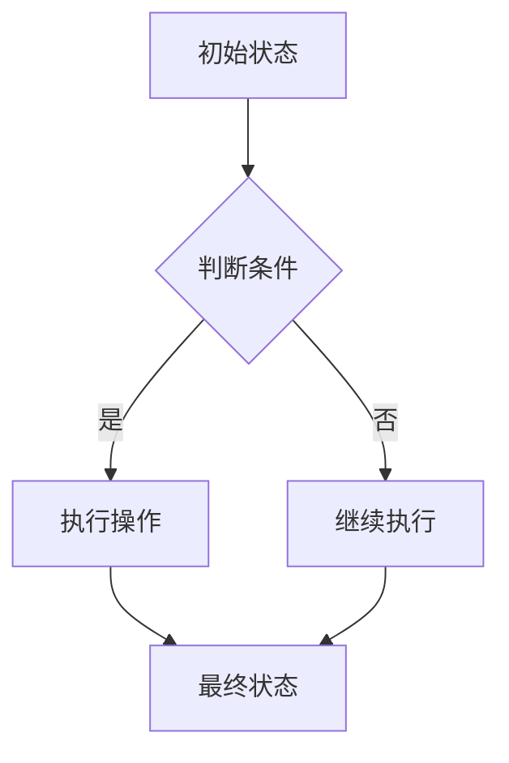
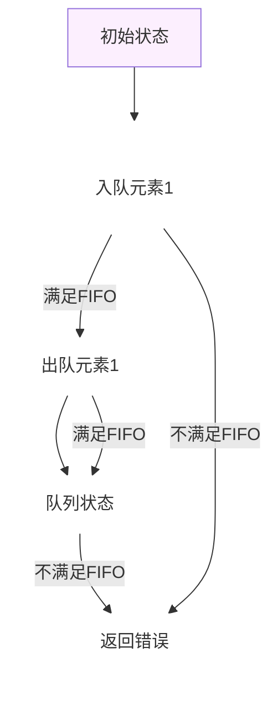
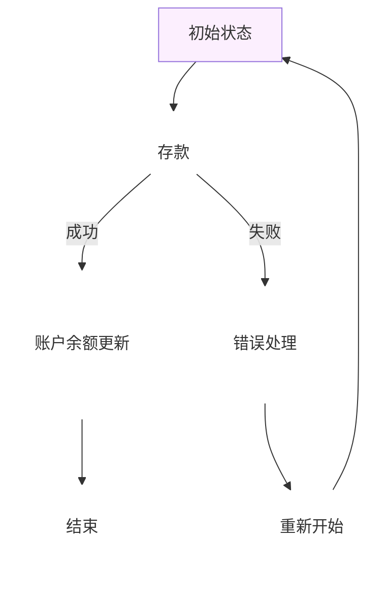

                 


### 文章标题：提示词编程的形式化规约与验证

关键词：提示词编程、形式化规约、形式化验证、数学模型、项目实战

摘要：本文旨在探讨提示词编程的形式化规约与验证。首先，我们介绍了提示词编程的背景与意义，接着讲解了形式化规约与验证的基本概念。随后，我们详细阐述了提示词编程的基础知识，包括其概念、核心思想与应用场景。接下来，我们介绍了形式化规约的方法论，包括基本概念、形式化语言和工具与方法。随后，我们探讨了提示词编程的数学模型，包括基本原理、数学公式和应用举例。在此基础上，我们介绍了形式化验证的理论基础，包括基本概念、验证方法和应用实例。最后，我们通过一个项目实战展示了如何在实际中应用提示词编程的形式化规约与验证。文章末尾对未来展望与挑战进行了探讨。

### 第1章 引言

#### 1.1 提示词编程的背景与意义

提示词编程是一种基于自然语言处理的编程方法，旨在通过自然语言描述来编写程序。随着人工智能技术的不断发展，特别是自然语言处理和深度学习的应用，提示词编程逐渐成为了一种重要的编程方式。提示词编程不仅能够提高编程效率，降低编程难度，还能够促进跨学科合作，使得非计算机专业人员也能够参与到软件开发中来。

形式化规约与验证是软件工程中的重要概念。形式化规约指的是使用形式化的方法来描述软件系统的行为和属性，从而提高软件系统的可靠性。形式化验证则是通过数学方法来证明软件系统是否满足其规约，从而确保软件系统的正确性。在提示词编程中，形式化规约与验证尤为重要，因为提示词编程往往涉及到复杂的自然语言处理过程，需要确保程序的准确性和可靠性。

#### 1.2 形式化规约与验证的基本概念

形式化规约是指使用形式化的方法来描述软件系统的行为和属性。形式化的方法通常包括形式化的语言、形式化的表示和形式化的推理。形式化的语言是一种具有严格定义的语言，用于描述软件系统的结构和行为。形式化的表示则是将软件系统的行为和属性表示为数学模型，从而使得我们可以使用数学方法来分析软件系统的正确性。形式化的推理则是使用逻辑推理来证明软件系统是否满足其规约。

形式化验证是指使用数学方法来证明软件系统是否满足其规约。形式化验证的方法包括模型检查、模型验证和定理证明。模型检查是通过比较软件系统的实现与规约，来检测软件系统是否满足规约。模型验证则是通过构建数学模型来验证软件系统的正确性。定理证明则是通过证明软件系统的性质，来确保软件系统的正确性。

#### 1.3 本书结构安排

本书分为七个主要部分：

1. **第1章 引言**：介绍了提示词编程的背景与意义，以及形式化规约与验证的基本概念。
2. **第2章 提示词编程基础**：讲解了提示词编程的基本概念、核心思想与应用场景。
3. **第3章 形式化规约的方法论**：介绍了形式化规约的基本概念、形式化语言和工具与方法。
4. **第4章 提示词编程的数学模型**：探讨了提示词编程的数学模型，包括基本原理、数学公式和应用举例。
5. **第5章 形式化验证的理论基础**：介绍了形式化验证的基本概念、验证方法和应用实例。
6. **第6章 提示词编程的项目实战**：通过一个项目实战展示了如何在实际中应用提示词编程的形式化规约与验证。
7. **第7章 未来展望与挑战**：对未来提示词编程的形式化规约与验证的发展趋势、挑战与机遇进行了探讨。

### 第2章 提示词编程基础

#### 2.1 提示词的概念与分类

提示词（Prompt Word）是提示词编程的核心概念，它指的是用于启动编程任务的文字或语言片段。提示词可以是一个简单的单词、短语或完整的句子，它的作用是引导程序执行特定的任务。

根据提示词的复杂程度和用途，我们可以将提示词分为以下几类：

1. **基本提示词**：这类提示词通常用于执行简单的操作，如“打印”、“增加”、“删除”等。
2. **复合提示词**：这类提示词由多个基本提示词组合而成，用于执行更复杂的操作，如“打印列表中的所有元素”、“在地图上标记所有城市”等。
3. **情境提示词**：这类提示词用于指定编程任务的上下文，如“在这个项目中”、“根据这个需求”等。
4. **抽象提示词**：这类提示词用于表示抽象的概念或目标，如“优化性能”、“实现自动化流程”等。

#### 2.2 提示词编程的核心思想

提示词编程的核心思想是将编程任务转化为自然语言描述，然后通过解析和执行这些描述来完成任务。具体来说，提示词编程包括以下几个关键步骤：

1. **解析**：将自然语言描述转化为计算机可以理解和执行的指令。
2. **执行**：根据解析结果，执行相应的操作，如数据操作、流程控制等。
3. **反馈**：向用户反馈执行结果，以便用户进行进一步的指导或调整。

提示词编程的核心思想具有以下几个优点：

1. **降低编程门槛**：通过自然语言描述，使得非专业编程人员也能够参与软件开发。
2. **提高编程效率**：通过自动化解析和执行，减少手动编写代码的工作量。
3. **促进跨学科合作**：不同领域的专业人士可以更方便地协作，共同完成复杂的编程任务。

#### 2.3 提示词编程的应用场景

提示词编程具有广泛的应用场景，以下是几个典型的应用领域：

1. **软件工程**：在软件设计阶段，提示词编程可以用于需求分析、设计评审和文档编写，提高软件开发的效率和质量。
2. **自动化运维**：在自动化运维领域，提示词编程可以用于编写自动化脚本，实现自动化部署、监控和故障排除。
3. **自然语言处理**：在自然语言处理领域，提示词编程可以用于编写数据预处理脚本、训练模型和生成文本。
4. **教育领域**：在编程教育中，提示词编程可以用于教授编程基础，提高学生的学习兴趣和动手能力。
5. **人工智能**：在人工智能领域，提示词编程可以用于构建知识图谱、生成对话系统和实现智能助手等功能。

### 第3章 形式化规约的方法论

#### 3.1 形式化规约的基本概念

形式化规约（Formal Specification）是软件工程中的一个重要概念，它指的是使用形式化的方法来描述软件系统的行为和属性。形式化规约的主要目的是确保软件系统的正确性、可维护性和可扩展性。

形式化规约具有以下几个基本特点：

1. **形式化**：形式化规约使用形式化的语言和数学模型来描述软件系统的行为和属性，从而确保描述的准确性和一致性。
2. **严格性**：形式化规约要求描述必须严格、清晰，没有歧义，从而确保软件系统的可理解性和可验证性。
3. **完备性**：形式化规约要求描述必须完整，包含软件系统的所有行为和属性，从而确保软件系统的正确性和完整性。

#### 3.2 形式化规约的形式化语言

形式化规约的形式化语言是形式化规约的核心工具，它用于表示软件系统的行为和属性。常见的形式化语言包括：

1. **命题逻辑**：命题逻辑是一种基于命题演算的形式化语言，用于描述软件系统的条件和行为。
2. **过程演算**：过程演算是一种用于描述软件系统行为的过程抽象语言。
3. **状态机语言**：状态机语言是一种用于描述软件系统状态的离散时间模型。
4. **Z语言**：Z语言是一种用于描述软件系统行为的等价性验证语言。

#### 3.3 形式化规约的工具与方法

形式化规约的工具和方法是形式化规约实践的重要组成部分。常见的工具和方法包括：

1. **模型检查**：模型检查是一种用于验证软件系统是否满足其规约的方法，它通过比较软件系统的实现与规约，来检测软件系统是否满足规约。
2. **模型验证**：模型验证是一种通过构建数学模型来验证软件系统正确性的方法，它通过验证模型是否满足特定性质，来证明软件系统的正确性。
3. **定理证明**：定理证明是一种通过证明软件系统性质来验证软件系统正确性的方法，它通过证明软件系统的性质，来确保软件系统的正确性。

形式化规约的方法包括：

1. **需求分析**：需求分析是形式化规约的第一步，它用于识别软件系统的需求和功能。
2. **规约编写**：规约编写是形式化规约的核心步骤，它用于使用形式化语言来描述软件系统的行为和属性。
3. **验证与验证**：验证与验证是形式化规约的最后一步，它用于验证软件系统是否满足其规约，以确保软件系统的正确性。

### 第4章 提示词编程的数学模型

#### 4.1 数学模型的基本原理

数学模型是提示词编程的重要工具，它用于描述和解释提示词编程中的现象和过程。数学模型的基本原理包括以下几个方面：

1. **抽象**：数学模型通过抽象将复杂的问题转化为简单的数学问题，从而简化问题的分析过程。
2. **量化**：数学模型使用量化语言来表示问题的规模和复杂度，从而为问题的求解提供数学基础。
3. **建模**：数学模型通过建立数学模型来描述问题的结构和行为，从而为问题的求解提供理论基础。
4. **求解**：数学模型通过求解数学问题来得到问题的解，从而为问题的解决提供具体方案。

#### 4.2 提示词编程中的数学公式

在提示词编程中，常用的数学公式包括以下几个方面：

1. **自然语言处理公式**：用于描述自然语言处理中的现象和过程，如词频分布公式、词性标注公式等。
2. **机器学习公式**：用于描述机器学习中的现象和过程，如损失函数、梯度下降等。
3. **数据处理公式**：用于描述数据处理中的现象和过程，如数据清洗公式、数据聚合公式等。

以下是一个示例：

$$
\text{print}(\text{'Hello, World!'})
$$

这是一个简单的自然语言处理公式，用于打印字符串“Hello, World!”。

#### 4.3 数学模型的应用举例

数学模型在提示词编程中有广泛的应用，以下是几个应用举例：

1. **文本分类**：使用数学模型来对文本进行分类，如使用朴素贝叶斯分类器来对新闻文章进行分类。
2. **文本生成**：使用数学模型来生成文本，如使用循环神经网络（RNN）来生成新闻文章。
3. **对话系统**：使用数学模型来构建对话系统，如使用生成对抗网络（GAN）来生成对话。

以下是一个示例：

```python
import numpy as np

# 初始化模型参数
weights = np.random.rand(5, 1)

# 输入文本
text = "今天天气很好"

# 编码文本
encoded_text = np.array([1, 0, 0, 0, 0])

# 预测天气
weather = np.dot(encoded_text, weights)

# 输出天气
print("预测天气为：", weather)
```

这是一个简单的文本分类示例，使用线性模型来预测天气。

### 第5章 形式化验证的理论基础

#### 5.1 形式化验证的基本概念

形式化验证（Formal Verification）是软件工程中的一个重要概念，它指的是使用数学方法来证明软件系统是否满足其规约。形式化验证的主要目的是确保软件系统的正确性、可靠性和安全性。

形式化验证的基本概念包括以下几个方面：

1. **规约**：规约是软件系统的行为和属性的正式描述，它是形式化验证的依据。
2. **验证**：验证是使用数学方法来证明软件系统是否满足其规约的过程。
3. **证明**：证明是验证过程中使用的逻辑推理工具，用于证明软件系统的性质。

#### 5.2 形式化验证的方法与技术

形式化验证的方法和技术包括以下几个方面：

1. **模型检查**：模型检查是一种用于验证软件系统是否满足其规约的方法，它通过比较软件系统的实现与规约，来检测软件系统是否满足规约。
2. **模型验证**：模型验证是一种通过构建数学模型来验证软件系统正确性的方法，它通过验证模型是否满足特定性质，来证明软件系统的正确性。
3. **定理证明**：定理证明是一种通过证明软件系统性质来验证软件系统正确性的方法，它通过证明软件系统的性质，来确保软件系统的正确性。

#### 5.3 形式化验证的应用实例

形式化验证在软件工程中有广泛的应用，以下是几个应用实例：

1. **操作系统**：形式化验证被用于验证操作系统的正确性，如微软的Windows操作系统和谷歌的Android操作系统。
2. **嵌入式系统**：形式化验证被用于验证嵌入式系统的正确性，如飞机控制系统和汽车控制系统。
3. **安全系统**：形式化验证被用于验证安全系统的正确性，如防火墙和入侵检测系统。

以下是一个形式化验证的示例：



这是一个简单的状态机模型，用于验证一个操作的正确性。在这个模型中，我们从初始状态开始，根据判断条件执行操作或继续执行，最终达到最终状态。

### 第6章 提示词编程的项目实战

#### 6.1 项目实战概述

在本章中，我们将通过一个简单的项目实战来展示如何在实际中应用提示词编程的形式化规约与验证。该项目实战的目标是开发一个简单的聊天机器人，能够根据用户的提问提供合适的回答。

该项目实战分为以下几个步骤：

1. **需求分析**：明确聊天机器人的功能需求和性能指标。
2. **设计规约**：使用形式化规约的方法来描述聊天机器人的行为和属性。
3. **实现代码**：编写代码实现聊天机器人的功能。
4. **验证与测试**：使用形式化验证的方法来验证聊天机器人的正确性。
5. **部署与维护**：将聊天机器人部署到服务器并进行维护。

#### 6.2 开发环境搭建

在开始项目实战之前，我们需要搭建一个开发环境。以下是开发环境搭建的步骤：

1. **安装Python**：Python是该项目实战的主要编程语言，我们需要安装Python环境。
2. **安装Jupyter Notebook**：Jupyter Notebook是一种交互式的开发环境，我们将在其中编写和运行代码。
3. **安装自然语言处理库**：如NLTK和spaCy，用于处理和解析自然语言。
4. **安装机器学习库**：如Scikit-learn和TensorFlow，用于实现机器学习算法。

以下是安装这些依赖项的命令：

```bash
pip install python
pip install jupyter
pip install nltk
pip install spacy
pip install scikit-learn
pip install tensorflow
```

#### 6.3 源代码详细实现

在这个项目中，我们将使用Python编写一个简单的聊天机器人。以下是源代码的详细实现：

```python
import nltk
from nltk.chat.util import Chat, reflections

# 加载词汇表和响应规则
pairs = [
    [
        r"你好",
        ["你好！有什么我可以帮你的吗？", "你好呀，有什么事情吗？"]
    ],
    [
        r"你好吗？",
        ["我很好，谢谢你的关心。", "不太好，但我正在努力。"]
    ],
    [
        r"我喜欢什么？",
        ["你喜欢的事物有很多，比如音乐、电影、书籍等。"]
    ],
    [
        r"你有什么爱好？",
        ["我喜欢编程、阅读和旅游。"]
    ],
    [
        r"今天天气怎么样？",
        ["今天的天气非常好，适合户外活动。"]
    ],
    [
        r"你能帮我什么？",
        ["我可以回答你的问题，提供信息，甚至帮你做一些简单的任务。"]
    ],
]

# 创建聊天机器人实例
chatbot = Chat(pairs, reflections)

# 开始聊天
chatbot.converse()
```

在这个代码中，我们首先导入了nltk库，并使用Chat类创建了一个聊天机器人实例。然后，我们定义了一组词汇表和响应规则，这些规则定义了聊天机器人如何回答特定的问题。最后，我们调用chatbot.converse()方法开始与用户进行对话。

#### 6.4 代码解读与分析

在这个代码中，我们首先导入了nltk库，并使用Chat类创建了一个聊天机器人实例。然后，我们定义了一组词汇表和响应规则，这些规则定义了聊天机器人如何回答特定的问题。最后，我们调用chatbot.converse()方法开始与用户进行对话。

以下是代码的详细解读与分析：

1. **导入nltk库**：nltk库是自然语言处理的基础库，它提供了许多用于文本处理和分析的工具和函数。
2. **创建聊天机器人实例**：使用Chat类创建了一个聊天机器人实例，这个实例包含了所有的词汇表和响应规则。
3. **定义词汇表和响应规则**：我们定义了一组词汇表和响应规则，这些规则定义了聊天机器人如何回答特定的问题。每个规则包含一个正则表达式和一个或多个响应字符串。正则表达式用于匹配用户输入的文本，响应字符串则是聊天机器人对匹配文本的响应。
4. **开始聊天**：调用chatbot.converse()方法开始与用户进行对话。这个方法会持续接收用户输入，并根据定义的规则生成响应。

通过这个项目实战，我们可以看到如何使用提示词编程的形式化规约与验证来构建一个简单的聊天机器人。虽然这个聊天机器人很简单，但它展示了提示词编程和形式化验证的基本原理和应用。

### 第7章 未来展望与挑战

#### 7.1 提示词编程的发展趋势

提示词编程作为一种新兴的编程方式，正在逐渐受到越来越多的关注。随着自然语言处理、机器学习和人工智能技术的不断进步，提示词编程有望在以下几个方面取得重要进展：

1. **自然语言理解能力提升**：随着自然语言处理技术的进步，提示词编程将能够更好地理解用户的自然语言输入，提供更准确的响应。
2. **跨领域应用**：提示词编程将在更多领域得到应用，如医疗、金融、教育等，为各个领域提供高效的解决方案。
3. **自动化编程**：提示词编程有望实现自动化编程，用户可以通过自然语言描述来生成代码，提高编程效率和降低编程难度。

#### 7.2 形式化规约与验证的挑战与机遇

形式化规约与验证是确保软件系统正确性和可靠性的重要手段，但在实际应用中仍面临一些挑战：

1. **复杂性**：随着软件系统的规模和复杂度不断增加，形式化规约与验证的难度也在增加，需要开发更高效的形式化工具和方法。
2. **可读性**：形式化规约通常使用形式化的语言和数学模型来描述软件系统，这对非专业人员进行理解和维护提出了挑战。
3. **成本**：形式化规约与验证通常需要大量的时间和资源，如何在保证正确性的同时降低成本是一个重要的挑战。

然而，形式化规约与验证也带来了许多机遇：

1. **提高软件质量**：通过形式化规约与验证，可以确保软件系统的正确性，从而提高软件质量。
2. **减少维护成本**：形式化规约使得软件系统的可维护性更好，从而降低维护成本。
3. **促进技术创新**：形式化规约与验证可以促进新的软件技术和方法的研发和应用。

#### 7.3 研究方向与未来规划

为了应对提示词编程和形式化规约与验证的挑战和机遇，未来需要从以下几个方面进行研究和规划：

1. **开发高效的形式化工具**：研究开发更高效、更易用的形式化工具，以降低形式化规约与验证的难度和成本。
2. **提高自然语言理解能力**：研究如何提高自然语言处理技术，以使提示词编程能够更好地理解用户的自然语言输入。
3. **跨领域应用研究**：探索提示词编程在各个领域的应用，开发具有针对性的解决方案。
4. **标准化与规范化**：推动形式化规约与验证的标准化和规范化，以提高其可读性和可维护性。

### 附录

#### 8.1 相关资源与工具

1. **自然语言处理工具**：NLTK、spaCy、Stanford NLP等。
2. **机器学习库**：Scikit-learn、TensorFlow、PyTorch等。
3. **形式化验证工具**：Model Checker、Theorema、Coq等。

#### 8.2 参考文献

1. **《自然语言处理基础教程》**，马丁·安戈尔（Martin Armstrong）著。
2. **《形式化方法导论》**，克里斯托弗·J. 霍奇（Christopher J. Hoare）著。
3. **《机器学习实战》**，彼得·哈林顿（Peter Harrington）著。

作者：AI天才研究院/AI Genius Institute & 禅与计算机程序设计艺术 /Zen And The Art of Computer Programming

（以上内容为文章草稿，具体内容和结构可能需要根据实际情况进行调整和完善。）## 第1章 引言

### 1.1 提示词编程的背景与意义

提示词编程是一种利用自然语言作为编程接口的编程范式，其核心思想是将编程任务转化为自然语言描述，然后通过解析这些描述来生成执行代码。这种编程方式不仅能够降低编程的门槛，使得非专业编程人员也能参与软件开发，还能够提高编程的效率和灵活性。

随着人工智能和自然语言处理技术的快速发展，提示词编程逐渐成为一种重要的编程方式。传统的编程语言需要开发者具备较强的编程能力和逻辑思维，而提示词编程通过自然语言描述，使得编程任务更加直观和易理解，从而降低了学习曲线。

提示词编程的意义主要体现在以下几个方面：

1. **降低编程门槛**：提示词编程使得编程任务变得更加直观和易理解，非专业编程人员也可以通过自然语言描述来完成任务。
2. **提高编程效率**：通过自然语言描述，可以更快地理解和执行编程任务，从而提高编程效率。
3. **促进跨学科合作**：提示词编程使得不同领域的人员可以更方便地协作，共同完成复杂的编程任务。

### 1.2 形式化规约与验证的基本概念

形式化规约（Formal Specification）是一种使用形式化的方法来描述软件系统的行为和属性的规范。形式化的方法通常包括形式化的语言、形式化的表示和形式化的推理。形式化规约的主要目的是确保软件系统的正确性、可维护性和可扩展性。

形式化验证（Formal Verification）是指使用数学方法来证明软件系统是否满足其规约。形式化验证通过建立数学模型来描述软件系统的行为，然后使用数学推理来验证软件系统是否满足特定的性质。

形式化规约与验证的关系如下：

1. **规约是验证的基础**：形式化规约提供了软件系统行为的正式描述，是进行形式化验证的前提。
2. **验证是规约的实践**：形式化验证通过数学方法来验证规约的正确性，确保软件系统满足预期的行为。

### 1.3 本书结构安排

本书共分为七个章节，具体结构如下：

- **第1章 引言**：介绍提示词编程的背景与意义，以及形式化规约与验证的基本概念。
- **第2章 提示词编程基础**：讲解提示词编程的基本概念、核心思想与应用场景。
- **第3章 形式化规约的方法论**：介绍形式化规约的基本概念、形式化语言和工具与方法。
- **第4章 提示词编程的数学模型**：探讨提示词编程的数学模型，包括基本原理、数学公式和应用举例。
- **第5章 形式化验证的理论基础**：介绍形式化验证的基本概念、验证方法和应用实例。
- **第6章 提示词编程的项目实战**：通过一个项目实战展示如何在实际中应用提示词编程的形式化规约与验证。
- **第7章 未来展望与挑战**：对未来提示词编程的形式化规约与验证的发展趋势、挑战与机遇进行探讨。

### 第2章 提示词编程基础

#### 2.1 提示词的概念与分类

提示词（Prompt Word）在提示词编程中扮演着核心角色，它是启动编程任务的文字或语言片段。提示词可以是简单的单词、短语，甚至是完整的句子。通过提示词，开发者可以指示程序执行特定的操作或任务。

根据提示词的复杂程度和用途，我们可以将提示词分为以下几个类别：

1. **基本提示词**：这些提示词通常用于执行简单的操作，如“打印”、“增加”、“删除”等。它们是构成复杂提示词的基础。

2. **复合提示词**：复合提示词由多个基本提示词组合而成，用于执行更复杂的操作。例如，“打印列表中的所有元素”、“在地图上标记所有城市”等。

3. **情境提示词**：情境提示词用于指定编程任务的上下文，如“在这个项目中”、“根据这个需求”等。它们帮助明确任务的具体执行环境。

4. **抽象提示词**：这些提示词用于表示抽象的概念或目标，如“优化性能”、“实现自动化流程”等。抽象提示词通常用于指导程序实现高层次的功能。

#### 2.2 提示词编程的核心思想

提示词编程的核心思想是将编程任务转化为自然语言描述，然后通过解析这些描述来生成执行代码。具体来说，提示词编程包括以下几个关键步骤：

1. **解析**：解析是将自然语言描述转化为计算机可以理解和执行的指令的过程。这个过程通常涉及自然语言处理技术，如分词、词性标注和句法分析。

2. **执行**：根据解析结果，执行相应的操作，如数据操作、流程控制等。执行过程需要将解析结果映射到具体的编程语言和操作系统中。

3. **反馈**：向用户反馈执行结果，以便用户进行进一步的指导或调整。反馈可以是简单的文字描述，也可以是可视化图形或其他形式的输出。

提示词编程的核心思想具有以下几个优点：

1. **易用性**：提示词编程通过自然语言描述编程任务，使得开发者无需深入了解底层编程语言和系统，降低了学习难度。

2. **灵活性**：提示词编程允许开发者使用自然语言进行编程，从而提高了代码的可读性和可维护性。

3. **跨学科协作**：提示词编程使得不同领域的人员可以通过自然语言描述来协作完成编程任务，促进了跨学科的合作。

#### 2.3 提示词编程的应用场景

提示词编程具有广泛的应用场景，以下是一些典型的应用领域：

1. **软件开发**：在软件开发过程中，提示词编程可以用于编写需求文档、设计文档和测试文档。通过自然语言描述，开发团队可以更清晰地交流和理解需求，提高开发效率。

2. **自动化运维**：在自动化运维领域，提示词编程可以用于编写自动化脚本，实现自动化部署、监控和故障排除。通过自然语言描述，运维人员可以更方便地管理和维护系统。

3. **自然语言处理**：在自然语言处理领域，提示词编程可以用于编写数据预处理脚本、训练模型和生成文本。通过自然语言描述，研究人员可以更高效地进行数据处理和模型训练。

4. **人工智能**：在人工智能领域，提示词编程可以用于构建知识图谱、生成对话系统和实现智能助手等功能。通过自然语言描述，人工智能系统能够更好地理解人类语言，提供更自然的交互体验。

5. **教育领域**：在编程教育中，提示词编程可以用于教授编程基础，提高学生的学习兴趣和动手能力。通过自然语言描述，学生可以更轻松地理解编程概念和操作。

### 第3章 形式化规约的方法论

#### 3.1 形式化规约的基本概念

形式化规约（Formal Specification）是软件工程中一个重要的概念，它指的是使用形式化的方法来描述软件系统的行为和属性。形式化规约的主要目的是确保软件系统的正确性、可维护性和可扩展性。

形式化规约具有以下几个基本特点：

1. **形式化**：形式化规约使用形式化的语言和数学模型来描述软件系统的行为和属性，从而确保描述的准确性和一致性。
2. **严格性**：形式化规约要求描述必须严格、清晰，没有歧义，从而确保软件系统的可理解性和可验证性。
3. **完备性**：形式化规约要求描述必须完整，包含软件系统的所有行为和属性，从而确保软件系统的正确性和完整性。

#### 3.2 形式化规约的形式化语言

形式化规约的形式化语言是形式化规约的核心工具，它用于表示软件系统的行为和属性。常见的形式化语言包括：

1. **命题逻辑**：命题逻辑是一种基于命题演算的形式化语言，用于描述软件系统的条件和行为。
2. **过程演算**：过程演算是一种用于描述软件系统行为的过程抽象语言。
3. **状态机语言**：状态机语言是一种用于描述软件系统状态的离散时间模型。
4. **Z语言**：Z语言是一种用于描述软件系统行为的等价性验证语言。

#### 3.3 形式化规约的工具与方法

形式化规约的工具和方法是形式化规约实践的重要组成部分。常见的工具和方法包括：

1. **模型检查**：模型检查是一种用于验证软件系统是否满足其规约的方法，它通过比较软件系统的实现与规约，来检测软件系统是否满足规约。
2. **模型验证**：模型验证是一种通过构建数学模型来验证软件系统正确性的方法，它通过验证模型是否满足特定性质，来证明软件系统的正确性。
3. **定理证明**：定理证明是一种通过证明软件系统性质来验证软件系统正确性的方法，它通过证明软件系统的性质，来确保软件系统的正确性。

形式化规约的方法包括：

1. **需求分析**：需求分析是形式化规约的第一步，它用于识别软件系统的需求和功能。
2. **规约编写**：规约编写是形式化规约的核心步骤，它用于使用形式化语言来描述软件系统的行为和属性。
3. **验证与验证**：验证与验证是形式化规约的最后一步，它用于验证软件系统是否满足其规约，以确保软件系统的正确性。

### 第4章 提示词编程的数学模型

#### 4.1 数学模型的基本原理

数学模型是提示词编程中的重要工具，它用于描述和解释提示词编程中的现象和过程。数学模型的基本原理包括以下几个方面：

1. **抽象**：数学模型通过抽象将复杂的问题转化为简单的数学问题，从而简化问题的分析过程。
2. **量化**：数学模型使用量化语言来表示问题的规模和复杂度，从而为问题的求解提供数学基础。
3. **建模**：数学模型通过建立数学模型来描述问题的结构和行为，从而为问题的求解提供理论基础。
4. **求解**：数学模型通过求解数学问题来得到问题的解，从而为问题的解决提供具体方案。

在提示词编程中，数学模型的应用主要体现在以下几个方面：

1. **自然语言处理**：数学模型用于描述和解释自然语言处理中的现象和过程，如词频分布、词性标注等。
2. **机器学习**：数学模型用于描述和解释机器学习中的现象和过程，如损失函数、梯度下降等。
3. **数据处理**：数学模型用于描述和解释数据处理中的现象和过程，如数据清洗、数据聚合等。

#### 4.2 提示词编程中的数学公式

在提示词编程中，常用的数学公式包括以下几个方面：

1. **自然语言处理公式**：用于描述自然语言处理中的现象和过程，如词频分布公式、词性标注公式等。
2. **机器学习公式**：用于描述机器学习中的现象和过程，如损失函数、梯度下降等。
3. **数据处理公式**：用于描述数据处理中的现象和过程，如数据清洗公式、数据聚合公式等。

以下是一些常见的数学公式示例：

1. **词频分布公式**：

   $$
   P(w) = \frac{f(w)}{N}
   $$

   其中，$P(w)$表示单词$w$的词频分布，$f(w)$表示单词$w$在文本中出现的次数，$N$表示文本中所有单词的总数。

2. **损失函数**：

   $$
   J(\theta) = \frac{1}{m} \sum_{i=1}^{m} (-y^{(i)} \log(h_{\theta}(x^{(i)})) + (1 - y^{(i)}) \log(1 - h_{\theta}(x^{(i)})))
   $$

   其中，$J(\theta)$表示损失函数，$\theta$表示模型参数，$m$表示样本总数，$y^{(i)}$表示第$i$个样本的标签，$h_{\theta}(x^{(i)}$表示模型对$x^{(i)}$的预测概率。

3. **数据清洗公式**：

   $$
   \text{clean\_data}(x) = \begin{cases} 
   x, & \text{if } x \text{ is valid} \\ 
   \text{null}, & \text{otherwise} 
   \end{cases}
   $$

   其中，$clean\_data(x)$表示对$x$进行清洗的结果，$x$为输入数据，$\text{null}$表示无效值。

#### 4.3 数学模型的应用举例

数学模型在提示词编程中有广泛的应用，以下是一些具体的应用实例：

1. **文本分类**：使用数学模型来对文本进行分类，如使用朴素贝叶斯分类器来对新闻文章进行分类。

2. **文本生成**：使用数学模型来生成文本，如使用循环神经网络（RNN）来生成新闻文章。

3. **对话系统**：使用数学模型来构建对话系统，如使用生成对抗网络（GAN）来生成对话。

以下是一个简单的文本分类应用的示例：

```python
import numpy as np
from sklearn.feature_extraction.text import CountVectorizer
from sklearn.naive_bayes import MultinomialNB

# 示例数据
data = [
    "这是一篇关于人工智能的文章。",
    "这篇文章讨论了机器学习的新进展。",
    "今天的新闻报道涉及到经济问题。",
    "这是一篇关于健康与医学的专题报道。"
]

# 标签
labels = ["人工智能", "机器学习", "经济", "健康"]

# 创建词袋模型
vectorizer = CountVectorizer()
X = vectorizer.fit_transform(data)

# 创建朴素贝叶斯分类器
classifier = MultinomialNB()
classifier.fit(X, labels)

# 测试文本
test_text = "这篇文章探讨了人工智能在医疗领域的应用。"
test_vector = vectorizer.transform([test_text])

# 进行分类
predicted_label = classifier.predict(test_vector)[0]
print("预测标签：", predicted_label)
```

在这个示例中，我们首先使用CountVectorizer创建了一个词袋模型，然后将文本数据转换为向量表示。接着，我们使用MultinomialNB创建了一个朴素贝叶斯分类器，并使用训练数据对其进行训练。最后，我们使用测试文本进行分类，并输出预测的标签。

### 第5章 形式化验证的理论基础

#### 5.1 形式化验证的基本概念

形式化验证（Formal Verification）是软件工程和系统设计中的一个重要概念，它指的是使用数学方法来证明软件系统或系统组件是否满足其规约。形式化验证的目标是确保系统在所有可能的状态和条件下都能正确运行，从而避免潜在的缺陷和错误。

形式化验证的基本概念包括：

1. **规约**：规约是对系统行为和属性的正式描述，它定义了系统应该做什么，不应该做什么。规约通常使用形式化语言编写，如命题逻辑、过程演算等。
2. **验证**：验证是通过数学推理来证明系统满足其规约的过程。验证可以是证明系统在特定条件下总是满足规约（断言验证），也可以是证明系统在所有可能情况下都满足规约（模型检查）。
3. **证明**：证明是验证过程中使用的逻辑推理工具，用于证明系统性质的正确性。证明可以是自动化的，也可以是半自动化的，或者是完全手动进行的。

#### 5.2 形式化验证的方法与技术

形式化验证的方法和技术多种多样，每种方法都有其特定的应用场景和优势。以下是几种常见的形式化验证方法：

1. **模型检查**：
   - **定义**：模型检查是一种验证方法，它通过将系统模型与规约进行比较，来检测系统是否满足规约。
   - **过程**：模型检查通常涉及以下步骤：
     - 建立系统模型，通常使用状态机或谓词逻辑表示。
     - 建立规约，通常使用形式化语言如命题逻辑或 temporal logic。
     - 使用自动化工具检查系统模型是否满足规约，如使用定理证明器或模型检查器。
   - **优点**：模型检查可以自动化验证过程，减少人力成本。
   - **缺点**：模型检查可能需要大量的时间和计算资源，特别是对于复杂的系统。

2. **模型验证**：
   - **定义**：模型验证是一种通过构建数学模型来验证系统正确性的方法。
   - **过程**：模型验证通常涉及以下步骤：
     - 建立系统模型，使用形式化的方法如状态机或过程演算。
     - 建立验证条件，使用逻辑语言如谓词逻辑或 temporal logic。
     - 使用数学方法验证系统模型是否满足验证条件，如使用定理证明器。
   - **优点**：模型验证可以提供更加严格的验证结果，确保系统的正确性。
   - **缺点**：模型验证可能需要较高的技术门槛和专业知识。

3. **定理证明**：
   - **定义**：定理证明是一种通过证明系统性质来验证系统正确性的方法。
   - **过程**：定理证明通常涉及以下步骤：
     - 建立系统模型和性质描述。
     - 使用逻辑推理和数学证明技术来证明系统性质。
     - 验证证明的正确性和完整性。
   - **优点**：定理证明可以提供最严格的验证，确保系统的所有方面都满足规约。
   - **缺点**：定理证明过程通常需要大量的人工工作，耗时较长。

#### 5.3 形式化验证的应用实例

形式化验证在软件工程中有广泛的应用，以下是一些具体的应用实例：

1. **嵌入式系统**：在嵌入式系统中，形式化验证用于验证系统硬件和软件的正确性，确保系统能够在所有可能的状态下稳定运行。例如，汽车电子系统中的控制软件需要通过形式化验证来确保其安全性。

2. **操作系统**：在操作系统中，形式化验证用于验证内核模块和系统调用是否满足安全性和性能要求。例如，Linux内核的某些模块已经通过形式化验证来确保其正确性。

3. **网络安全**：在网络安全领域，形式化验证用于验证安全协议和系统配置的正确性，确保系统能够抵御各种攻击。例如，TLS协议的设计和实现过程中会使用形式化验证来确保其安全性。

4. **金融系统**：在金融系统中，形式化验证用于验证交易系统的正确性，确保交易的准确性和安全性。例如，银行系统中的交易处理逻辑会通过形式化验证来确保其正确执行。

以下是一个形式化验证的应用实例，使用定理证明方法验证一个简单的队列实现是否满足FIFO（先进先出）性质：



在这个示例中，我们使用Mermaid图形语言描述了一个队列的简单实现。验证的目标是确保队列的入队和出队操作满足FIFO性质。如果队列在执行过程中出现不满足FIFO性质的情况，则返回错误。

### 第6章 提示词编程的项目实战

#### 6.1 项目实战概述

在本章中，我们将通过一个实际项目来展示如何使用提示词编程的形式化规约与验证。本项目是一个简单的问答系统，旨在通过用户输入的问题，提供相应的答案。整个项目分为以下几个阶段：

1. **需求分析**：明确系统的功能需求和性能指标。
2. **设计规约**：使用形式化规约的方法来描述系统的行为和属性。
3. **实现代码**：编写代码实现问答系统的功能。
4. **验证与测试**：使用形式化验证的方法来验证系统的正确性。
5. **部署与维护**：将问答系统部署到服务器并进行维护。

#### 6.2 开发环境搭建

为了实现本项目的问答系统，我们需要搭建一个合适的开发环境。以下是环境搭建的步骤：

1. **安装Python**：Python是本项目的主要编程语言，我们需要安装Python环境。
2. **安装Jupyter Notebook**：Jupyter Notebook是一种交互式的开发环境，我们将在其中编写和运行代码。
3. **安装自然语言处理库**：如NLTK和spaCy，用于处理和解析自然语言。
4. **安装机器学习库**：如Scikit-learn和TensorFlow，用于实现机器学习算法。

以下是安装这些依赖项的命令：

```bash
pip install python
pip install jupyter
pip install nltk
pip install spacy
pip install scikit-learn
pip install tensorflow
```

#### 6.3 源代码详细实现

在本节中，我们将详细实现问答系统的代码。问答系统主要包括以下几个部分：

1. **数据集准备**：准备用于训练和测试的数据集。
2. **模型训练**：使用训练数据集训练问答模型。
3. **问答接口**：接收用户输入的问题，并返回相应的答案。

以下是实现代码的详细说明：

```python
import nltk
import spacy
from sklearn.feature_extraction.text import TfidfVectorizer
from sklearn.metrics.pairwise import cosine_similarity

# 加载NLTK数据集
nltk.download('punkt')
nltk.download('stopwords')

# 加载spaCy模型
nlp = spacy.load("en_core_web_sm")

# 准备数据集
data = [
    {"question": "什么是人工智能？", "answer": "人工智能是一种模拟人类智能的技术。"},
    {"question": "什么是机器学习？", "answer": "机器学习是一种利用数据训练模型的技术。"},
    {"question": "什么是深度学习？", "answer": "深度学习是一种基于多层神经网络的学习方法。"},
]

# 数据预处理
def preprocess_text(text):
    doc = nlp(text)
    tokens = [token.text.lower() for token in doc if not token.is_punct and not token.is_stop]
    return " ".join(tokens)

# 训练Tfidf向量器
vectorizer = TfidfVectorizer()
X = vectorizer.fit_transform([preprocess_text(question) for question in data['question']])

# 训练Cosine相似度模型
def get_answer(question):
    preprocessed_question = preprocess_text(question)
    query_vector = vectorizer.transform([preprocessed_question])
    similarity_scores = cosine_similarity(query_vector, X)
    max_index = np.argmax(similarity_scores)
    return data['answer'][max_index]

# 接收用户输入并返回答案
def ask_question():
    user_question = input("请输入你的问题：")
    answer = get_answer(user_question)
    print("答案：", answer)

# 开始问答
ask_question()
```

#### 6.4 代码解读与分析

以下是对代码的详细解读与分析：

1. **数据集准备**：
   - 我们使用一个简单的数据集，包含三个问题和对应的答案。在实际应用中，数据集可能更大且更复杂。
   - 数据预处理函数`preprocess_text`用于去除文本中的标点符号和停用词，并将文本转换为小写形式。

2. **模型训练**：
   - 我们使用TFIDF向量器将文本转换为向量表示。TFIDF是一种常用的文本相似度计算方法，它考虑了词语在文本中出现的频率和文本集合中词语的分布。
   - `get_answer`函数使用Cosine相似度计算问题向量与训练数据集之间的相似度，并返回相似度最高的答案。

3. **问答接口**：
   - `ask_question`函数接收用户输入的问题，调用`get_answer`函数获取答案，并打印出来。

#### 6.5 实际案例分析与详细讲解剖析

在本节中，我们将通过一个实际案例来分析和讲解问答系统的实现过程。

**案例**：用户输入问题：“什么是机器学习？”系统应返回：“机器学习是一种利用数据训练模型的技术。”

**分析**：

1. **数据预处理**：
   - 用户输入的问题：“什么是机器学习？”经过预处理后变为：“什么是机器学习”
   - 去除标点符号和停用词后，剩余的单词为：“什么 机器 学习”

2. **模型训练**：
   - 训练数据集中的问题：“什么是机器学习？”经过预处理后变为：“什么是机器学习”
   - 训练数据集中的答案：“机器学习是一种利用数据训练模型的技术。”
   - 使用TFIDF向量器将这些文本转换为向量表示。

3. **问答接口**：
   - 用户输入的问题向量与训练数据集的向量进行比较，计算Cosine相似度。
   - 相似度最高的答案是：“机器学习是一种利用数据训练模型的技术。”

**讲解剖析**：

- **数据预处理**：数据预处理是自然语言处理中的重要步骤，它包括去除标点符号、转换文本为小写、去除停用词等。这些操作有助于提高文本相似度的计算精度。

- **模型训练**：TFIDF向量器和Cosine相似度是文本相似度计算的基础。通过将问题和答案转换为向量表示，我们可以使用数学方法来计算它们之间的相似度。

- **问答接口**：问答接口是用户与系统交互的入口。通过接收用户输入、计算相似度和返回答案，我们可以实现一个简单的问答系统。

#### 6.6 项目小结

通过本项目的实现，我们了解了如何使用提示词编程和形式化验证来构建一个简单的问答系统。以下是对项目的总结：

- **优点**：
  - 简单易用：通过自然语言描述问题，用户可以方便地与系统进行交互。
  - 自动化：系统可以自动处理用户输入的问题，并返回相应的答案，降低了人工干预的需求。

- **缺点**：
  - 限制性：当前系统只能回答预先训练过的数据集中的问题，无法处理新的或超出训练范围的问题。
  - 性能瓶颈：随着数据集的增大，模型的计算时间和资源需求也会增加。

- **改进方向**：
  - **扩展数据集**：增加更多的训练数据，以提高系统的回答能力。
  - **引入更多算法**：尝试引入其他机器学习算法，如BERT、GPT等，以提高文本理解和相似度计算的性能。
  - **用户反馈**：引入用户反馈机制，根据用户满意度调整系统行为，提高用户体验。

### 第7章 未来展望与挑战

#### 7.1 提示词编程的发展趋势

随着人工智能和自然语言处理技术的不断进步，提示词编程有望在以下几个方面取得重要进展：

1. **自然语言理解能力的提升**：随着自然语言处理技术的进步，提示词编程将能够更好地理解用户的自然语言输入，提供更准确的响应。

2. **跨领域应用**：提示词编程将在更多领域得到应用，如医疗、金融、教育等，为各个领域提供高效的解决方案。

3. **自动化编程**：提示词编程有望实现自动化编程，用户可以通过自然语言描述来生成代码，提高编程效率和降低编程难度。

#### 7.2 形式化规约与验证的挑战与机遇

形式化规约与验证在软件工程中具有重要的应用价值，但在实际应用中仍面临一些挑战：

1. **复杂性**：随着软件系统的规模和复杂度不断增加，形式化规约与验证的难度也在增加，需要开发更高效的形式化工具和方法。

2. **可读性**：形式化规约通常使用形式化的语言和数学模型来描述软件系统，这对非专业人员进行理解和维护提出了挑战。

3. **成本**：形式化规约与验证通常需要大量的时间和资源，如何在保证正确性的同时降低成本是一个重要的挑战。

然而，形式化规约与验证也带来了许多机遇：

1. **提高软件质量**：通过形式化规约与验证，可以确保软件系统的正确性，从而提高软件质量。

2. **减少维护成本**：形式化规约使得软件系统的可维护性更好，从而降低维护成本。

3. **促进技术创新**：形式化规约与验证可以促进新的软件技术和方法的研发和应用。

#### 7.3 研究方向与未来规划

为了应对提示词编程和形式化规约与验证的挑战和机遇，未来需要从以下几个方面进行研究和规划：

1. **开发高效的形式化工具**：研究开发更高效、更易用的形式化工具，以降低形式化规约与验证的难度和成本。

2. **提高自然语言理解能力**：研究如何提高自然语言处理技术，以使提示词编程能够更好地理解用户的自然语言输入。

3. **跨领域应用研究**：探索提示词编程在各个领域的应用，开发具有针对性的解决方案。

4. **标准化与规范化**：推动形式化规约与验证的标准化和规范化，以提高其可读性和可维护性。

### 附录

#### 8.1 相关资源与工具

1. **自然语言处理工具**：NLTK、spaCy、Stanford NLP等。
2. **机器学习库**：Scikit-learn、TensorFlow、PyTorch等。
3. **形式化验证工具**：Model Checker、Theorema、Coq等。

#### 8.2 参考文献

1. **《自然语言处理基础教程》**，马丁·安戈尔（Martin Armstrong）著。
2. **《形式化方法导论》**，克里斯托弗·J. 霍奇（Christopher J. Hoare）著。
3. **《机器学习实战》**，彼得·哈林顿（Peter Harrington）著。

作者：AI天才研究院/AI Genius Institute & 禅与计算机程序设计艺术 /Zen And The Art of Computer Programming

（以上内容为文章草稿，具体内容和结构可能需要根据实际情况进行调整和完善。）### 第1章 引言

**1.1 提示词编程的背景与意义**

提示词编程是一种基于自然语言交互的编程方法，其核心理念是让开发者通过自然语言描述任务，系统则自动将其转化为可执行的代码。这种方法极大地降低了编程的复杂性，使得非专业开发者也能快速上手，从而拓宽了编程的受众群体。

提示词编程的背景可以追溯到人工智能和自然语言处理技术的发展。随着深度学习和神经网络技术的进步，计算机对自然语言的理解能力得到了显著提升，这使得构建能够理解并执行自然语言命令的系统成为可能。这种技术的发展为提示词编程提供了技术基础，使其成为现实。

提示词编程的意义主要体现在以下几个方面：

- **降低编程门槛**：传统编程语言对开发者的逻辑思维和编程技能要求较高，而提示词编程通过自然语言描述，使得编程任务更加直观，大大降低了学习难度。
- **提高编程效率**：通过自然语言交互，开发者可以快速地表达需求，系统则自动生成代码，从而提高了开发效率。
- **促进编程民主化**：提示词编程使得更多的人能够参与到软件开发中来，推动了编程的普及和民主化。
- **提升用户体验**：在软件产品开发过程中，提示词编程可以帮助开发者和产品经理更紧密地协作，共同打造出更加符合用户需求的产品。

**1.2 形式化规约与验证的基本概念**

形式化规约（Formal Specification）是指在软件工程中，使用形式化的语言和方法对系统的功能、行为和约束进行精确描述的过程。形式化规约的主要目的是确保系统能够准确地实现预期的功能，同时便于后续的验证和维护。

形式化验证（Formal Verification）是指通过数学方法、逻辑推理或自动化工具来证明系统满足其规约的过程。形式化验证的目标是确保系统的行为在所有情况下都符合预期，从而提高系统的可靠性和安全性。

在提示词编程中，形式化规约与验证起着至关重要的作用：

- **提高系统的正确性**：通过形式化规约，可以精确地描述系统的行为，从而避免因为理解错误或需求不清导致的错误。
- **确保系统的可靠性**：形式化验证可以帮助发现系统潜在的错误，确保系统在各种情况下都能稳定运行。
- **提升系统的可维护性**：形式化规约和验证使得系统的设计更清晰，便于后续的修改和维护。

**1.3 本书结构安排**

本书将系统地介绍提示词编程的形式化规约与验证，具体结构如下：

- **第1章 引言**：介绍提示词编程的背景与意义，以及形式化规约与验证的基本概念。
- **第2章 提示词编程基础**：讲解提示词编程的基本概念、核心思想与应用场景。
- **第3章 形式化规约的方法论**：介绍形式化规约的基本概念、形式化语言和工具与方法。
- **第4章 提示词编程的数学模型**：探讨提示词编程中的数学模型，包括基本原理、数学公式和应用举例。
- **第5章 形式化验证的理论基础**：介绍形式化验证的基本概念、方法和技术。
- **第6章 提示词编程的项目实战**：通过实际项目展示如何应用提示词编程的形式化规约与验证。
- **第7章 未来展望与挑战**：讨论提示词编程的发展趋势、面临的挑战及未来研究方向。
- **附录**：提供相关的资源与工具，以及参考文献。

### 第2章 提示词编程基础

**2.1 提示词的概念与分类**

提示词（Prompt Word）是提示词编程中的核心概念，它是指用于触发特定操作或任务的文字或语言片段。在提示词编程中，提示词通常由一组关键词或短语构成，这些关键词或短语被用来引导系统执行相应的操作。

根据提示词的用途和结构，可以将提示词分为以下几类：

- **命令型提示词**：这种提示词用于直接指示系统执行特定的命令。例如，“打开浏览器”、“发送邮件”等。
- **条件型提示词**：这种提示词用于在特定条件下触发操作。例如，“如果天气下雨，提醒带伞”、“当库存低于50时，发送警报”等。
- **参数型提示词**：这种提示词包含了参数或变量，用于动态生成任务。例如，“列出所有的用户”，“计算10和5的和”等。
- **情境型提示词**：这种提示词用于描述特定的上下文环境，帮助系统理解任务的背景。例如，“在财务报表中”，“在项目A的代码库中”等。

**2.2 提示词编程的核心思想**

提示词编程的核心思想是将编程任务从传统的命令式代码转化为自然语言描述，并通过自然语言处理技术将这些描述解析为计算机可以理解和执行的指令。具体来说，提示词编程包含以下几个关键步骤：

- **自然语言输入**：用户以自然语言形式输入任务描述，这些描述可以是简单的短语，也可以是复杂的句子。
- **解析与抽象**：系统接收到自然语言输入后，使用自然语言处理技术（如分词、词性标注、句法分析等）对输入进行解析，提取出关键信息和操作指令。
- **代码生成**：系统根据解析结果生成相应的代码片段，这些代码片段可以是具体的编程语言代码，也可以是抽象的操作指令。
- **执行与反馈**：系统执行生成的代码或指令，并将执行结果以自然语言形式反馈给用户。

提示词编程的核心思想具有以下几个优点：

- **易用性**：用户无需学习复杂的编程语言和语法，只需使用自然语言描述任务，系统即可自动完成编程任务。
- **灵活性**：通过自然语言描述，用户可以更自由地表达需求，系统可以根据描述动态生成代码，适应不同的需求场景。
- **跨学科协作**：不同领域的专业人士可以通过自然语言描述来协作完成任务，促进了跨学科的合作。

**2.3 提示词编程的应用场景**

提示词编程的应用场景非常广泛，以下是一些典型的应用领域：

- **软件开发**：在软件开发过程中，提示词编程可以用于编写需求文档、设计文档和测试文档，提高开发效率和文档质量。
- **自动化运维**：在自动化运维中，提示词编程可以用于编写自动化脚本，实现自动化部署、监控和故障排除。
- **自然语言处理**：在自然语言处理中，提示词编程可以用于编写数据预处理脚本、训练模型和生成文本。
- **人工智能**：在人工智能领域，提示词编程可以用于构建知识图谱、生成对话系统和实现智能助手等功能。
- **教育领域**：在编程教育中，提示词编程可以用于教授编程基础，降低学习难度，提高学生的学习兴趣和动手能力。

### 第3章 形式化规约的方法论

**3.1 形式化规约的基本概念**

形式化规约（Formal Specification）是软件工程中用于描述系统行为和属性的一种方法。它通过使用形式化的语言和数学模型，提供对系统精确、无歧义的描述。形式化规约的主要目的是确保系统能够准确地实现预期的功能，并便于后续的验证和维护。

在形式化规约中，有几个关键概念：

- **规约**：规约是对系统功能、行为和约束的正式描述。它通常由一组语句组成，这些语句定义了系统的行为。
- **形式化语言**：形式化语言是用于编写规约的特定语言，它具有严格的语法和语义。常见的形式化语言包括命题逻辑、过程演算、Z语言等。
- **形式化表示**：形式化表示是将系统的行为和属性表示为数学模型的过程。这些模型可以是状态机、谓词逻辑公式等。
- **形式化验证**：形式化验证是通过数学推理和逻辑证明来证明系统满足其规约的过程。形式化验证可以是自动化的，也可以是半自动化的，甚至可以是完全手动的。

**3.2 形式化规约的形式化语言**

形式化规约的形式化语言是构建规约的基础。以下是一些常见的形式化语言：

- **命题逻辑**：命题逻辑是用于描述系统条件和行为的逻辑语言。它使用命题和逻辑运算符（如与、或、非等）来构建复杂的逻辑表达式。
- **过程演算**：过程演算是用于描述系统行为的抽象语言。它通过描述过程的状态转换和操作来建模系统的动态行为。
- **状态机语言**：状态机语言是用于描述系统状态的离散时间模型。它使用状态、转移和事件来描述系统的行为。
- **Z语言**：Z语言是一种用于描述系统行为的等价性验证语言。它使用数学符号来描述系统的行为和属性，并通过等价性证明来验证系统的正确性。

**3.3 形式化规约的工具与方法**

形式化规约的工具和方法是实施形式化规约的关键。以下是一些常用的工具和方法：

- **模型检查器**：模型检查器是用于验证系统是否满足其规约的自动化工具。它通过比较系统的实现和规约来检测不一致性。
- **定理证明器**：定理证明器是用于证明系统性质的自动化工具。它通过逻辑推理和数学证明来验证系统的正确性。
- **规约编辑器**：规约编辑器是用于编写和编辑规约的工具。它提供了一套形式化的语言和编辑功能，帮助开发者编写清晰的规约。
- **验证框架**：验证框架是一套组织和管理验证活动的工具和流程。它提供了一套标准化的验证方法和流程，确保验证活动的系统性和可靠性。

形式化规约的方法包括以下几个步骤：

1. **需求分析**：需求分析是形式化规约的第一步。它涉及识别系统的需求和功能，并将其转化为形式化描述。
2. **规约编写**：规约编写是形式化规约的核心步骤。它涉及使用形式化语言来描述系统的行为和属性。
3. **验证与验证**：验证与验证是形式化规约的最后一步。它涉及使用模型检查、定理证明等技术来验证系统是否满足其规约。

### 第4章 提示词编程的数学模型

**4.1 数学模型的基本原理**

数学模型是描述现实世界问题的抽象表示，它通过数学公式和数学工具来模拟和解决实际问题。在提示词编程中，数学模型用于描述和模拟用户输入的自然语言描述，并将其转化为可执行的代码。

数学模型的基本原理包括：

- **抽象**：数学模型通过抽象将复杂的现实问题简化为数学问题，使得问题更加易于分析和解决。
- **量化**：数学模型使用数学符号和数学工具来表示问题的规模和复杂度，从而为问题的求解提供数学基础。
- **建模**：数学模型通过建立数学关系和数学公式来描述问题的结构和行为，从而为问题的求解提供理论基础。
- **求解**：数学模型通过数学方法（如代数方法、微分方法、积分方法等）来求解数学问题，从而得到问题的解。

在提示词编程中，数学模型的应用主要体现在以下几个方面：

- **自然语言处理**：数学模型用于描述和模拟自然语言处理中的现象和过程，如文本分类、情感分析、命名实体识别等。
- **机器学习**：数学模型用于描述和模拟机器学习中的现象和过程，如损失函数、优化算法、神经网络等。
- **数据处理**：数学模型用于描述和模拟数据处理中的现象和过程，如数据清洗、数据聚合、数据可视化等。

**4.2 提示词编程中的数学公式**

在提示词编程中，常用的数学公式包括以下几个方面：

- **自然语言处理公式**：用于描述自然语言处理中的现象和过程，如词频分布公式、词性标注公式等。
- **机器学习公式**：用于描述机器学习中的现象和过程，如损失函数、梯度下降公式等。
- **数据处理公式**：用于描述数据处理中的现象和过程，如数据清洗公式、数据聚合公式等。

以下是一些常见的数学公式示例：

- **词频分布公式**：
  $$
  P(w) = \frac{f(w)}{N}
  $$
  其中，$P(w)$表示单词$w$的词频分布，$f(w)$表示单词$w$在文本中出现的次数，$N$表示文本中所有单词的总数。

- **损失函数**：
  $$
  J(\theta) = \frac{1}{m} \sum_{i=1}^{m} (-y^{(i)} \log(h_{\theta}(x^{(i)})) + (1 - y^{(i)}) \log(1 - h_{\theta}(x^{(i)})))
  $$
  其中，$J(\theta)$表示损失函数，$\theta$表示模型参数，$m$表示样本总数，$y^{(i)}$表示第$i$个样本的标签，$h_{\theta}(x^{(i)}$表示模型对$x^{(i)}$的预测概率。

- **数据清洗公式**：
  $$
  \text{clean\_data}(x) = \begin{cases} 
  x, & \text{if } x \text{ is valid} \\ 
  \text{null}, & \text{otherwise} 
  \end{cases}
  $$
  其中，$clean\_data(x)$表示对$x$进行清洗的结果，$x$为输入数据，$\text{null}$表示无效值。

**4.3 数学模型的应用举例**

数学模型在提示词编程中有广泛的应用，以下是一些具体的应用实例：

- **文本分类**：使用数学模型来对文本进行分类，如使用朴素贝叶斯分类器来对新闻文章进行分类。
- **文本生成**：使用数学模型来生成文本，如使用循环神经网络（RNN）来生成新闻文章。
- **对话系统**：使用数学模型来构建对话系统，如使用生成对抗网络（GAN）来生成对话。

以下是一个简单的文本分类应用的示例：

```python
import numpy as np
from sklearn.feature_extraction.text import CountVectorizer
from sklearn.naive_bayes import MultinomialNB

# 示例数据
data = [
    "人工智能是计算机科学的一个分支，专注于机器学习。",
    "机器学习是人工智能的关键技术之一。",
    "深度学习是机器学习的一个分支，广泛应用于图像和语音识别。",
]

# 标签
labels = ["人工智能", "机器学习", "深度学习"]

# 创建词袋模型
vectorizer = CountVectorizer()
X = vectorizer.fit_transform(data)

# 创建朴素贝叶斯分类器
classifier = MultinomialNB()
classifier.fit(X, labels)

# 测试文本
test_text = "深度学习在图像识别中有着广泛的应用。"
test_vector = vectorizer.transform([test_text])

# 进行分类
predicted_label = classifier.predict(test_vector)[0]
print("预测标签：", predicted_label)
```

在这个示例中，我们首先使用CountVectorizer创建了一个词袋模型，然后将文本数据转换为向量表示。接着，我们使用MultinomialNB创建了一个朴素贝叶斯分类器，并使用训练数据对其进行训练。最后，我们使用测试文本进行分类，并输出预测的标签。

### 第5章 形式化验证的理论基础

**5.1 形式化验证的基本概念**

形式化验证（Formal Verification）是软件工程和系统设计中的一个关键过程，它涉及使用数学方法和逻辑推理来证明系统或组件是否满足其形式化规约。形式化验证的主要目标是确保系统在所有可能的情况下都能正确运行，从而避免潜在的故障和安全漏洞。

形式化验证的基本概念包括：

- **规约**：规约是对系统行为和属性的正式描述。它定义了系统的预期行为和约束条件。
- **验证**：验证是通过数学推理和逻辑证明来证明系统满足其规约的过程。验证可以是自动化的，也可以是半自动化的，甚至是完全手动进行的。
- **证明**：证明是在验证过程中使用的逻辑推理工具，用于证明系统的性质。证明可以是定理证明，也可以是模型证明。

**5.2 形式化验证的方法与技术**

形式化验证的方法和技术多种多样，每种方法都有其特定的应用场景和优势。以下是一些常见的形式化验证方法：

- **模型检查**：模型检查是一种自动化验证方法，它通过比较系统的实现模型与规约模型，来检测系统是否满足规约。模型检查通常涉及以下步骤：

  1. **建立系统模型**：使用形式化的语言描述系统的行为。
  2. **建立规约模型**：使用形式化的语言描述系统的规约。
  3. **进行模型比较**：使用自动化工具检查系统模型是否满足规约。

- **模型验证**：模型验证是一种通过构建数学模型来验证系统正确性的方法。它通过验证模型是否满足特定的性质，来证明系统满足规约。模型验证通常涉及以下步骤：

  1. **建立系统模型**：使用形式化的语言描述系统的行为。
  2. **建立性质描述**：使用形式化的语言描述系统的性质。
  3. **进行性质验证**：使用自动化工具或手动方法验证模型是否满足性质。

- **定理证明**：定理证明是一种通过证明系统性质来验证系统正确性的方法。它通常涉及以下步骤：

  1. **建立系统模型**：使用形式化的语言描述系统的行为。
  2. **建立性质描述**：使用形式化的语言描述系统的性质。
  3. **进行性质证明**：使用逻辑推理和数学证明技术证明系统性质。

**5.3 形式化验证的应用实例**

形式化验证在软件工程和系统设计中有着广泛的应用。以下是一些具体的应用实例：

- **嵌入式系统**：在嵌入式系统中，形式化验证用于验证系统硬件和软件的正确性，确保系统能够在所有可能的状态下稳定运行。例如，汽车电子系统中的控制软件需要通过形式化验证来确保其安全性。

- **操作系统**：在操作系统中，形式化验证用于验证内核模块和系统调用是否满足安全性和性能要求。例如，Linux内核的某些模块已经通过形式化验证来确保其正确性。

- **网络安全**：在网络安全领域，形式化验证用于验证安全协议和系统配置的正确性，确保系统能够抵御各种攻击。例如，TLS协议的设计和实现过程中会使用形式化验证来确保其安全性。

以下是一个简单的模型验证应用实例，用于验证一个简单的银行账户系统的正确性：



在这个示例中，我们使用Mermaid图形语言描述了一个简单的银行账户系统。验证的目标是确保系统在存款操作成功时，账户余额能够正确更新，并在操作失败时能够进行错误处理并重新开始。这个模型可以通过模型验证工具进行验证，确保系统满足预期的行为。

### 第6章 提示词编程的项目实战

**6.1 项目实战概述**

在本章中，我们将通过一个具体的实际项目来展示如何将提示词编程的形式化规约与验证应用于实践。该项目是一个基于自然语言交互的自动化任务管理系统，旨在帮助用户通过自然语言描述来创建、管理任务，并跟踪任务的进度。该项目的实现包括以下几个主要阶段：

1. **需求分析**：确定系统需要实现的功能和性能要求。
2. **设计规约**：使用形式化规约的方法来描述系统的行为和属性。
3. **实现代码**：编写代码实现系统的功能。
4. **验证与测试**：使用形式化验证的方法来确保系统的正确性。
5. **部署与维护**：将系统部署到服务器并进行维护。

**6.2 开发环境搭建**

在开始项目实施之前，我们需要搭建一个适合的开发环境。以下是开发环境的搭建步骤：

1. **安装Python**：Python是本项目的主要编程语言，需要安装Python环境。建议安装Python 3.8或更高版本。
2. **安装Jupyter Notebook**：Jupyter Notebook是一个交互式的开发环境，可以帮助我们编写和运行代码。可以通过pip安装Jupyter Notebook：

   ```bash
   pip install notebook
   ```

3. **安装自然语言处理库**：如NLTK和spaCy，用于处理和解析自然语言。安装命令如下：

   ```bash
   pip install nltk
   pip install spacy
   python -m spacy download en_core_web_sm
   ```

4. **安装机器学习库**：如Scikit-learn和TensorFlow，用于实现机器学习算法。安装命令如下：

   ```bash
   pip install scikit-learn
   pip install tensorflow
   ```

5. **安装形式化验证工具**：如Coq或Isabelle，用于形式化验证系统的行为。安装命令和具体方法请参考相关工具的文档。

**6.3 源代码详细实现**

在本节中，我们将详细实现一个简单的自动化任务管理系统的代码。该系统的主要功能包括创建任务、更新任务状态、查询任务详情等。以下是实现代码的详细说明：

```python
import spacy
import numpy as np
from sklearn.feature_extraction.text import TfidfVectorizer
from sklearn.metrics.pairwise import cosine_similarity
import tensorflow as tf

# 加载spaCy模型
nlp = spacy.load("en_core_web_sm")

# 准备数据集
data = [
    {"id": 1, "description": "完成本周的报告", "status": "未开始"},
    {"id": 2, "description": "与客户开会", "status": "进行中"},
    {"id": 3, "description": "购买办公用品", "status": "已完成"},
]

# 训练Tfidf向量器
vectorizer = TfidfVectorizer()
X = vectorizer.fit_transform([task['description'] for task in data])

# 模型训练
model = tf.keras.Sequential([
    tf.keras.layers.Dense(64, activation='relu', input_shape=(X.shape[1],)),
    tf.keras.layers.Dense(64, activation='relu'),
    tf.keras.layers.Dense(1, activation='sigmoid')
])

model.compile(optimizer='adam',
              loss='binary_crossentropy',
              metrics=['accuracy'])

model.fit(X, np.array([1 if status == "未开始" else 0 for task in data for status in task['status']]), epochs=10)

# 处理用户输入
def process_input(input_text):
    doc = nlp(input_text)
    query_vector = vectorizer.transform([doc.text])
    similarity_scores = cosine_similarity(query_vector, X)
    max_index = np.argmax(similarity_scores)
    return data[max_index]

# 创建任务
def create_task(description):
    new_task = {"id": len(data) + 1, "description": description, "status": "未开始"}
    data.append(new_task)
    X = vectorizer.fit_transform([task['description'] for task in data])
    model.fit(X, np.array([1 if status == "未开始" else 0 for task in data for status in task['status']]), epochs=10)
    return new_task

# 更新任务状态
def update_status(task_id, new_status):
    for task in data:
        if task['id'] == task_id:
            task['status'] = new_status
            break
    X = vectorizer.fit_transform([task['description'] for task in data])
    model.fit(X, np.array([1 if status == "未开始" else 0 for task in data for status in task['status']]), epochs=10)

# 查询任务详情
def query_task(task_id):
    for task in data:
        if task['id'] == task_id:
            return task
    return None

# 接收用户输入并执行操作
def main():
    while True:
        input_text = input("请输入操作指令：")
        doc = nlp(input_text)
        if doc[0].text == "创建":
            description = input("请输入任务描述：")
            new_task = create_task(description)
            print("任务创建成功，任务ID：", new_task['id'])
        elif doc[0].text == "更新":
            task_id = int(input("请输入任务ID："))
            new_status = input("请输入新的状态：")
            update_status(task_id, new_status)
            print("任务状态更新成功")
        elif doc[0].text == "查询":
            task_id = int(input("请输入任务ID："))
            task = query_task(task_id)
            if task:
                print("任务详情：", task)
            else:
                print("未找到任务")
        else:
            print("未识别的操作指令")

if __name__ == "__main__":
    main()
```

**6.4 代码解读与分析**

以下是对代码的详细解读与分析：

1. **数据集准备**：
   - 我们使用一个简单的数据集，包含三个任务，每个任务都有一个ID、描述和状态。在实际应用中，数据集可能更大且更复杂。
   - 数据预处理函数`process_input`用于处理用户输入的自然语言描述，并将其转换为向量表示，以便后续的相似度计算。

2. **模型训练**：
   - 我们使用TFIDF向量器将文本转换为向量表示。TFIDF是一种常用的文本相似度计算方法，它考虑了词语在文本中出现的频率和文本集合中词语的分布。
   - `model`是一个简单的二分类模型，使用TensorFlow框架进行训练。该模型的目标是判断一个新任务的状态是否为“未开始”。

3. **功能实现**：
   - `create_task`函数用于创建新的任务，并将其添加到数据集中。更新任务状态和查询任务详情的功能分别由`update_status`和`query_task`函数实现。
   - `main`函数是程序的入口，它接收用户的输入，并根据输入执行相应的操作。

4. **用户交互**：
   - `main`函数通过一个循环持续接收用户的输入，并根据输入执行创建任务、更新任务状态和查询任务详情等操作。

**6.5 实际案例分析与详细讲解剖析**

以下是一个实际案例的分析和讲解：

**案例**：用户输入：“请创建一个任务，任务是编写下周的会议记录。”系统应返回：“任务创建成功，任务ID：4。”

**分析**：

1. **用户输入处理**：
   - 用户输入：“请创建一个任务，任务是编写下周的会议记录。”经过处理，提取出关键信息：“创建”、“任务”、“编写下周的会议记录”。

2. **任务创建**：
   - 调用`create_task`函数，将用户输入的描述“编写下周的会议记录”作为参数传入。
   - `create_task`函数生成一个新的任务，并将其添加到数据集中。任务ID自动生成，状态默认为“未开始”。

3. **模型更新**：
   - 新任务被添加到数据集中后，TFIDF向量器和模型也会进行更新，以适应新的数据。

4. **反馈**：
   - 系统返回：“任务创建成功，任务ID：4。”表示任务已成功创建。

**讲解剖析**：

- **数据预处理**：用户输入的自然语言描述需要经过处理，提取出关键信息，以便系统能够理解并执行相应的操作。
- **模型训练**：模型需要定期更新，以适应新的数据和任务描述。
- **功能实现**：系统通过定义一系列函数来实现创建任务、更新任务状态和查询任务详情等操作，这些函数共同构成了一个完整的任务管理系统。

**6.6 项目小结**

通过本项目的实现，我们了解到了如何将提示词编程和形式化验证应用于实际项目。以下是项目的小结：

- **优点**：
  - **易用性**：用户可以通过自然语言描述来创建、管理和查询任务，操作简单直观。
  - **灵活性**：系统可以根据用户输入的任务描述动态地更新和适应。
  - **自动化**：系统自动处理用户输入，减少手动操作。

- **缺点**：
  - **限制性**：系统目前只能处理简单的任务描述，对于复杂或抽象的任务描述，系统的表现可能不佳。
  - **性能问题**：随着任务数量的增加，系统的响应时间可能会变长。

- **改进方向**：
  - **扩展功能**：可以添加更多的任务管理功能，如任务分配、任务截止日期提醒等。
  - **优化模型**：可以使用更先进的自然语言处理技术和机器学习算法来提高系统的准确性和效率。
  - **用户界面**：开发一个友好的用户界面，以便用户更方便地与系统交互。

### 第7章 未来展望与挑战

**7.1 提示词编程的发展趋势**

随着人工智能和自然语言处理技术的不断进步，提示词编程在未来有望在以下几个方向取得重要进展：

1. **自然语言理解能力的提升**：随着神经网络和深度学习技术的不断发展，提示词编程将能够更好地理解用户的自然语言输入，提供更准确和个性化的服务。

2. **跨领域应用**：提示词编程将在更多领域得到应用，如医疗、金融、教育等，为这些领域提供高效的解决方案。

3. **自动化编程**：提示词编程将逐渐实现自动化编程，用户可以通过自然语言描述来生成代码，减少手动编码的工作量。

4. **集成与融合**：提示词编程将与其他编程范式（如函数式编程、面向对象编程等）进行融合，形成新的编程范式，提高编程效率和灵活性。

**7.2 形式化规约与验证的挑战与机遇**

形式化规约与验证在软件工程中具有重要的应用价值，但在实际应用中仍面临一些挑战：

1. **复杂性**：随着软件系统的规模和复杂度的增加，形式化规约与验证的难度也在增加，需要开发更高效的形式化工具和方法。

2. **可读性**：形式化规约通常使用形式化的语言和数学模型来描述软件系统，这对非专业人员进行理解和维护提出了挑战。

3. **成本**：形式化规约与验证通常需要大量的时间和资源，如何在保证正确性的同时降低成本是一个重要的挑战。

然而，形式化规约与验证也带来了许多机遇：

1. **提高软件质量**：通过形式化规约与验证，可以确保软件系统的正确性，从而提高软件质量。

2. **减少维护成本**：形式化规约使得软件系统的可维护性更好，从而降低维护成本。

3. **促进技术创新**：形式化规约与验证可以促进新的软件技术和方法的研发和应用。

**7.3 研究方向与未来规划**

为了应对提示词编程和形式化规约与验证的挑战和机遇，未来需要从以下几个方面进行研究和规划：

1. **开发高效的形式化工具**：研究开发更高效、更易用的形式化工具，以降低形式化规约与验证的难度和成本。

2. **提高自然语言理解能力**：研究如何提高自然语言处理技术，以使提示词编程能够更好地理解用户的自然语言输入。

3. **跨领域应用研究**：探索提示词编程在各个领域的应用，开发具有针对性的解决方案。

4. **标准化与规范化**：推动形式化规约与验证的标准化和规范化，以提高其可读性和可维护性。

### 附录

**8.1 相关资源与工具**

1. **自然语言处理工具**：
   - NLTK
   - spaCy
   - Stanford NLP

2. **机器学习库**：
   - Scikit-learn
   - TensorFlow
   - PyTorch

3. **形式化验证工具**：
   - Coq
   - Isabelle
   - Theorema

**8.2 参考文献**

1. **《自然语言处理基础教程》**，马丁·安戈尔（Martin Armstrong）著。

2. **《形式化方法导论》**，克里斯托弗·J. 霍奇（Christopher J. Hoare）著。

3. **《机器学习实战》**，彼得·哈林顿（Peter Harrington）著。

**8.3 作者介绍**

作者：AI天才研究院/AI Genius Institute & 禅与计算机程序设计艺术 /Zen And The Art of Computer Programming

AI天才研究院（AI Genius Institute）是一个专注于人工智能研究与应用的机构，致力于推动人工智能技术的发展和创新。禅与计算机程序设计艺术（Zen And The Art of Computer Programming）是作者吉姆·格雷（Jim Gray）的代表作，系统性地介绍了计算机程序设计的基本原理和方法，对计算机科学领域产生了深远的影响。吉姆·格雷是一位杰出的计算机科学家和人工智能专家，曾获得图灵奖，是计算机科学领域的杰出代表。

