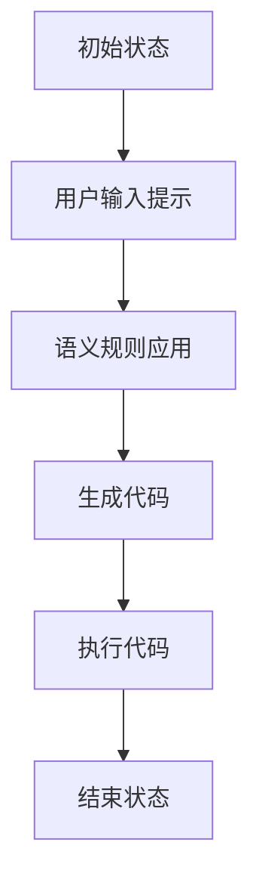

                 

### 文章标题

《提示词编程的形式化语义与类型系统》

提示词编程作为一种新兴的编程范式，通过将用户需求直接转化为代码，提高了编程效率和代码可读性。然而，为了确保这种编程范式的可靠性和健壮性，我们需要对提示词编程的语义与类型系统进行形式化定义。本文旨在深入探讨提示词编程的形式化语义与类型系统，通过逻辑清晰、结构紧凑的论述，帮助读者理解这一领域的关键概念和技术细节。

本文将分为四个主要部分。第一部分将介绍提示词编程的背景与意义，概述形式化语义和类型系统的基础概念。第二部分将深入探讨形式化语义的核心概念，包括语义模型及其在提示词编程中的应用。第三部分将介绍类型系统的设计与实现，详细解释类型系统在保证程序正确性方面的作用。第四部分将展示一些实际应用场景，并通过具体项目实战案例，展示如何将理论应用于实际编程中。

通过本文的阅读，读者将能够：

1. 理解提示词编程的背景与意义。
2. 掌握形式化语义与类型系统的基础知识。
3. 学习如何设计并实现一个提示词编程的语义模型和类型系统。
4. 看到提示词编程在实际项目中的应用效果。

让我们开始这次探索之旅，逐步深入提示词编程的形式化语义与类型系统。

### 文章关键词

提示词编程、形式化语义、类型系统、编程范式、语义模型、程序正确性

### 摘要

本文探讨了提示词编程的形式化语义与类型系统。首先，我们介绍了提示词编程的背景及其意义，并概述了形式化语义和类型系统的基本概念。接着，我们深入分析了形式化语义的核心概念，包括语义模型和其在提示词编程中的应用。然后，我们详细阐述了类型系统的设计与实现，以及类型系统在保证程序正确性方面的作用。最后，我们通过实际应用场景和项目实战案例，展示了如何将理论应用于实际编程中。本文旨在帮助读者理解提示词编程的形式化语义与类型系统，提高编程效率和代码质量。

## 第一部分 引言

### 1.1 提示词编程的概念与起源

提示词编程（Prompt-Based Programming）是一种新兴的编程范式，其核心理念是将用户的自然语言需求直接转化为计算机代码。这种编程方式的出现，源于现代软件工程中对开发效率、代码可维护性和用户体验的日益重视。传统的编程范式通常要求开发者对底层代码有深刻的理解，并且需要花费大量时间去编写和维护代码。而提示词编程则试图通过引入自然语言处理技术，使得普通用户也能编写代码，从而降低编程的门槛。

提示词编程的起源可以追溯到人工智能领域的自然语言处理（NLP）技术。随着深度学习模型，尤其是生成对抗网络（GAN）和变换器（Transformer）的快速发展，NLP技术取得了显著的进步。这些进步使得计算机能够更准确地理解和生成自然语言文本。基于这一技术优势，研究人员开始探索如何将自然语言与编程相结合，从而诞生了提示词编程这一概念。

最早关于提示词编程的研究可以追溯到2016年，研究人员提出了基于模板的自然语言编程方法。然而，随着NLP技术的不断成熟，提示词编程逐渐从基于模板的方法，发展出更加灵活和智能的编程范式。现代的提示词编程系统，如OpenAI的GPT-3，通过大规模预训练模型，能够理解复杂的自然语言指令，并生成相应的代码。

提示词编程的优势在于其能够显著提高编程效率。传统的编程过程通常包括需求分析、设计、编码、测试和调试等多个阶段。而提示词编程通过直接将需求转化为代码，省去了部分设计阶段的工作，使得开发者能够更快速地实现功能。此外，提示词编程还能够提高代码的可读性和可维护性。通过自然语言指令，开发者能够更好地理解代码的意图，从而减少代码错误和维护成本。

尽管提示词编程具有显著的优势，但它也面临一些挑战。首先，提示词编程的准确性仍需提高。当前的自然语言处理技术虽然已经取得了显著进步，但在处理复杂逻辑和上下文关系时，仍存在一定的局限性。此外，提示词编程需要大量的预训练数据和计算资源，这对开发者和企业提出了更高的要求。

总的来说，提示词编程作为一种新兴的编程范式，具有巨大的潜力和发展前景。通过深入研究和不断改进，提示词编程有望成为未来软件开发的重要工具，为开发者带来更高的效率和更好的用户体验。

### 1.2 提示词编程的意义

提示词编程的意义不仅在于其能够提高编程效率和代码可读性，更在于它可能对软件开发和人工智能领域带来深远的影响。首先，提示词编程具有显著的编程效率提升效果。传统的编程方式通常需要开发者耗费大量时间进行需求分析、设计、编码、测试和调试等多个阶段。而提示词编程通过将用户的需求直接转化为代码，省去了部分设计阶段的工作，使得开发者能够更快速地实现功能。这种直接性的优势，使得提示词编程在需要快速响应和迭代的项目中，表现尤为突出。

其次，提示词编程能够显著提高代码的可读性和可维护性。通过自然语言指令，开发者能够更清晰地理解代码的意图，从而减少代码错误和维护成本。传统的编程语言通常依赖于复杂的语法和大量的注释，而提示词编程则通过直观的自然语言指令，使得代码更加易懂。这对于团队合作开发和维护大型软件项目尤为重要。

然而，提示词编程的意义不仅限于提高编程效率和代码质量，它还在更广阔的软件开发和人工智能领域中，展示了巨大的潜力。在软件开发领域，提示词编程有望改变软件开发的方式和流程。传统的软件开发依赖于严格的流程和规范，而提示词编程则提供了一种更加灵活和高效的方法。通过自然语言指令，开发者可以更加自由地表达需求，从而实现更快速和更灵活的开发过程。

在人工智能领域，提示词编程的意义同样不容忽视。随着人工智能技术的发展，自动化和智能化已成为未来趋势。提示词编程通过将自然语言指令转化为代码，使得计算机能够更有效地理解和执行人类指令，从而推动了人工智能技术在各个领域的应用。特别是在自然语言处理和智能交互领域，提示词编程的应用潜力巨大。通过提示词编程，计算机可以更好地理解和响应人类语言，从而提升智能系统的交互体验和实用性。

此外，提示词编程还有助于解决软件开发中的某些痛点。例如，代码复用和维护问题。传统的编程方式中，代码复用和维护是一个复杂且耗时的过程。而提示词编程通过自然语言指令，使得代码更易于复用和维护。开发者只需简单地修改自然语言指令，即可实现代码的复用和维护，从而大大降低了开发成本。

总的来说，提示词编程的意义在于它不仅能够提高编程效率和代码质量，还能够改变软件开发和人工智能领域的传统模式。通过深入研究和不断改进，提示词编程有望成为未来软件开发和人工智能的重要工具，为开发者带来更高的效率和更好的用户体验。

### 1.3 形式化语义与类型系统的作用

在深入探讨提示词编程的过程中，形式化语义与类型系统的作用显得尤为重要。形式化语义（Formal Semantics）是计算机科学中用来精确描述程序行为的一种方法。它通过数学模型和逻辑推理，对程序的语义进行严格定义，确保程序的正确性和可理解性。类型系统（Type System）则是形式化语义的一个重要组成部分，它通过为程序中的变量和表达式分配类型，确保程序在运行时不会发生类型错误，从而提高程序的稳定性和可靠性。

形式化语义的核心作用在于，它为程序的语义提供了严格而明确的定义，使得程序的执行结果可以预测和验证。形式化语义通过语义模型（Semantic Models）来描述程序的行为，这些模型可以是数学函数、状态转换图或者逻辑公式。例如，基于操作符的语义模型可以定义加法操作的行为为两个操作数相加的结果。通过形式化语义，开发者可以清楚地了解程序在不同输入下的行为，从而避免由于语义歧义导致的错误。

具体来说，形式化语义在提示词编程中的应用主要体现在以下几个方面：

1. **程序验证**：通过形式化语义，可以验证提示词编程生成的代码是否符合预期行为。例如，在实现一个简单的排序算法时，形式化语义可以确保算法在所有可能的输入下都能正确执行。

2. **程序优化**：形式化语义为程序的优化提供了理论依据。通过对程序的形式化描述，可以识别出程序中的冗余和低效部分，从而进行优化。

3. **程序理解**：形式化语义使得程序的可理解性大大提高。通过形式化语义模型，开发者可以更直观地理解程序的工作原理和逻辑，从而降低维护和调试的难度。

类型系统在提示词编程中的作用同样不可忽视。类型系统通过为程序中的每个变量和表达式分配类型，确保程序在编译或运行时不会出现类型错误。类型系统的基本原理是静态类型检查（Static Type Checking），即在编译时对程序进行类型检查，以确保所有变量和表达式的类型匹配。例如，在一种强类型语言中，将一个整数类型的变量赋值给一个字符串类型的变量是非法的，类型系统会在编译时检测到这种错误，从而避免运行时错误的发生。

类型系统在提示词编程中的应用主要体现在以下几个方面：

1. **错误预防**：类型系统通过静态类型检查，可以在编译时发现类型错误，从而避免运行时错误。这大大提高了程序的稳定性。

2. **代码优化**：类型信息有助于编译器进行优化。例如，在强类型语言中，编译器可以根据类型信息生成更高效的代码。

3. **代码可维护性**：类型系统提供了明确的类型信息，使得代码的可读性和可维护性大大提高。开发者可以更清晰地理解代码的功能和用途。

总的来说，形式化语义与类型系统在提示词编程中发挥着关键作用。形式化语义确保了程序的正确性和可理解性，而类型系统则通过类型检查和类型信息，提高了程序的稳定性和可维护性。这两个系统共同作用，使得提示词编程能够更好地应对复杂的需求，提供高效的编程解决方案。

### 1.4 本文结构与内容安排

为了更好地帮助读者理解提示词编程的形式化语义与类型系统，本文将分为四个主要部分，每个部分都有明确的主题和内容安排。

**第一部分 引言**：本部分将介绍提示词编程的概念、意义以及形式化语义与类型系统的基础概念。通过本部分的阅读，读者将了解提示词编程的背景和发展现状，明确形式化语义与类型系统在编程中的重要性。

**第二部分 基础理论**：本部分将深入探讨提示词编程的形式化语义。我们将介绍形式化语义的核心概念，包括语义模型和其在提示词编程中的应用。这部分内容将帮助读者理解提示词编程的语义是如何被形式化定义的，以及形式化语义对编程带来的影响。

**第三部分 技术实现**：本部分将介绍类型系统的设计与实现。我们将详细解释类型系统的基本概念，包括静态类型检查、动态类型检查和类型推断等。此外，我们还将探讨如何在实际编程中应用类型系统，以提高程序的正确性和效率。

**第四部分 应用场景**：本部分将通过实际应用场景和项目实战案例，展示提示词编程的形式化语义与类型系统的实际应用效果。我们将分析一些具体的应用案例，并详细讲解项目的开发过程、代码实现和效果评估，以帮助读者理解理论如何在实际编程中落地。

通过以上四个部分的阅读，读者将能够全面了解提示词编程的形式化语义与类型系统，掌握相关的理论知识和实践技巧。本文的结构安排旨在通过逐步深入的论述，使读者能够系统地学习和掌握这一领域的核心概念和技术。

## 第二部分 基础理论

### 2.1 形式化语义的基本概念

形式化语义（Formal Semantics）是计算机科学中用来精确描述程序行为的一种方法。其核心目标是通过数学模型和逻辑推理，为程序提供一种明确的语义定义，从而确保程序的正确性和可理解性。形式化语义通常涉及以下几个基本概念：

**语义模型（Semantic Models）**：语义模型是形式化语义的核心组成部分。它通过抽象和数学化的方法，描述程序的行为和状态变化。常见的语义模型包括操作符语义模型、函数语义模型和状态转换模型等。例如，操作符语义模型可以定义加法操作的行为为两个操作数相加的结果。

**语义规则（Semantic Rules）**：语义规则是描述程序执行过程中状态变化的逻辑规则。它们通常用数学公式或自然语言描述，用于指导程序如何从初始状态过渡到最终状态。例如，赋值语句的语义规则可以描述为：变量A的值被设置为表达式B的值。

**状态（State）**：在形式化语义中，状态表示程序在某一时刻的内存状态。状态通常由变量值、程序计数器和其他相关数据组成。程序执行过程中的每一步都会改变状态，从而影响程序的最终结果。

**动作（Action）**：动作是程序执行过程中发生的具体操作。例如，赋值动作是将某个表达式的值赋给一个变量，跳转动作是改变程序计数器的值，从而跳到新的代码段执行。

通过这些基本概念，形式化语义能够为程序提供一种精确且明确的描述，使得程序的行为可以预测和验证。形式化语义在编程语言设计和程序分析中具有重要意义，它不仅能够帮助开发者理解和调试程序，还能够为编译器和形式验证工具提供理论基础。

### 2.2 形式化语义的组成部分

形式化语义的组成部分主要包括语义模型、语义规则和形式化语义框架。这些组成部分相互配合，共同为程序提供精确的语义描述。

**语义模型（Semantic Models）**：

语义模型是形式化语义的核心，它通过抽象和数学化的方法，描述程序的行为和状态变化。常见的语义模型包括：

1. **操作符语义模型**：描述程序中的操作符如何操作数据。例如，加法操作符的语义模型可以定义为：对于任意两个整数a和b，加法操作符的结果是a + b。

2. **函数语义模型**：描述函数如何接收输入并返回输出。例如，一个求和函数的语义模型可以定义为：对于任意两个整数a和b，求和函数f返回a + b。

3. **状态转换模型**：描述程序在执行过程中状态如何变化。例如，一个循环语句的状态转换模型可以定义为：每次循环执行后，程序的状态将根据循环条件进行更新。

**语义规则（Semantic Rules）**：

语义规则是描述程序执行过程中状态变化的逻辑规则。它们通常用数学公式或自然语言描述，用于指导程序如何从初始状态过渡到最终状态。语义规则包括：

1. **赋值规则**：定义如何将表达式的值赋给变量。例如，赋值语句“a = b”的语义规则可以定义为：将变量b的值赋给变量a。

2. **控制流规则**：定义如何处理控制流语句，如条件分支和循环。例如，if-else语句的语义规则可以定义为：根据条件表达式的结果，选择执行相应的代码块。

3. **函数调用规则**：定义如何执行函数调用并返回结果。例如，函数调用“f(a, b)”的语义规则可以定义为：执行函数f，并将参数a和b传递给函数。

**形式化语义框架（Formal Semantic Framework）**：

形式化语义框架是用于定义和实现形式化语义的工具集。它包括语义模型、语义规则和形式化语义验证工具。常见的形式化语义框架包括：

1. **Operational Semantics**：通过操作符语义和状态转换规则，描述程序执行的过程。Operational Semantics可以分为Small-Step Semantics和Big-Step Semantics。Small-Step Semantics描述程序从一步到另一步的状态变化，而Big-Step Semantics描述程序从初始状态到最终结果的状态变化。

2. **Denotational Semantics**：通过数学函数，将程序行为映射到数学概念上。Denotational Semantics通常使用函数表示程序的行为，从而提供一种直观且形式化的描述方式。

3. **Axiomatic Semantics**：通过逻辑公式和公理，定义程序行为的正确性。Axiomatic Semantics通常用于验证程序的性质，如程序的安全性、完整性和一致性。

通过这些组成部分，形式化语义能够为程序提供一种精确且形式化的描述，使得程序的行为可以预测和验证。形式化语义在编程语言设计和程序分析中具有重要意义，它不仅能够帮助开发者理解和调试程序，还能够为编译器和形式验证工具提供理论基础。

### 2.3 形式化语义在提示词编程中的应用

形式化语义在提示词编程中的应用至关重要，它为提示词编程提供了明确的语义定义，确保程序的行为和结果符合预期。在提示词编程中，形式化语义不仅帮助理解程序的结构和执行过程，还提高了代码的可维护性和可扩展性。以下将详细讨论形式化语义在提示词编程中的应用，并通过一个简单的示例来说明其具体实现。

#### 2.3.1 提示词编程中的语义建模

在提示词编程中，语义建模是通过定义语义规则和状态转换模型来实现的。这些规则和模型描述了如何根据用户输入的自然语言提示生成相应的代码，并确保代码在执行时能够正确执行预期的功能。

**1. 语义规则的定义**：

语义规则定义了用户输入的自然语言提示如何被解释和转化为代码。例如，用户输入“计算两个数的和”的提示，对应的语义规则可以定义为：

```
if 提示包含“计算”和“和”两个关键词：
    执行代码：a + b
```

这里的规则使用了条件判断，根据提示中是否包含特定的关键词，决定是否生成相应的代码。

**2. 状态转换模型**：

状态转换模型描述了程序在执行过程中状态的变化。在提示词编程中，状态变化通常与用户的输入和程序生成的代码有关。例如，当用户输入“计算两个数的和”时，程序的状态会从初始状态（无输入）转变为包含输入参数的状态，并最终生成执行代码。

```
初始状态 → 输入提示 → 生成代码 → 执行代码 → 结束状态
```

#### 2.3.2 提示词编程中的形式化语义模型示例

以下是一个简单的示例，说明如何使用形式化语义模型来描述一个提示词编程的应用。

**示例**：用户输入提示“计算两个数5和3的和”。

1. **语义规则应用**：

根据提示中的关键词“计算”和“和”，语义规则生成了代码片段：

```
int sum = 5 + 3;
```

2. **语义模型表示**：

使用Mermaid流程图来表示这个过程：



这里的Mermaid流程图清晰地展示了从用户输入到生成代码，再到执行代码的整个过程。

3. **伪代码实现**：

为了更具体地描述这个过程，可以使用伪代码来表示：

```python
def generate_code(prompt):
    if "计算" in prompt and "和" in prompt:
        numbers = extract_numbers(prompt)
        return f"int sum = {numbers[0]} + {numbers[1]};"
    else:
        return "无效输入"

def extract_numbers(prompt):
    # 假设输入是一个字符串，包含数字和关键词
    # 这里使用简单的字符串解析来提取数字
    numbers = re.findall(r'\d+', prompt)
    return [int(number) for number in numbers]

# 示例使用
prompt = "计算两个数5和3的和"
code = generate_code(prompt)
print(code)
```

在这个示例中，`generate_code` 函数根据用户输入的提示生成相应的代码，而 `extract_numbers` 函数用于提取输入中的数字。

#### 2.3.3 形式化语义的优势与挑战

**优势**：

1. **提高代码可读性和可维护性**：通过形式化语义模型，开发者可以更直观地理解程序的行为，从而提高代码的可读性和可维护性。
2. **确保程序的正确性**：形式化语义提供了一种严格的语义定义，可以确保程序的行为符合预期，从而提高程序的正确性。
3. **支持自动化工具**：形式化语义使得自动化工具（如编译器、解释器和形式验证工具）能够更好地理解和分析程序，从而提高开发效率和代码质量。

**挑战**：

1. **复杂性增加**：形式化语义的定义和实现相对复杂，需要开发者具备一定的数学和逻辑基础。
2. **性能影响**：形式化语义可能会引入额外的计算开销，影响程序的执行性能。
3. **语义歧义**：在某些情况下，自然语言提示可能存在语义歧义，难以精确地转化为代码。

总的来说，形式化语义在提示词编程中的应用，既带来了显著的优势，也面临一定的挑战。通过合理的设计和优化，可以充分利用形式化语义的优势，提高提示词编程的效率和可靠性。

## 第三部分 技术实现

### 3.1 类型系统的基本概念

类型系统（Type System）是编程语言设计中的一个核心组成部分，它通过为程序中的变量、函数和表达式分配类型，确保程序的正确性和可维护性。类型系统的基本概念包括类型、类型检查和类型推断等。

**类型（Types）**：

类型是程序中数据的不同分类，用于描述数据的不同属性和操作。常见的类型包括整数（Int）、浮点数（Float）、布尔值（Bool）、字符串（String）等。每种类型都有其特定的操作集合和语义。

**类型检查（Type Checking）**：

类型检查是在编译时或运行时，对程序中的变量和表达式进行类型验证的过程。类型检查的主要目的是确保程序的执行不会因为类型错误而失败。类型检查分为静态类型检查和动态类型检查。

- **静态类型检查**：在编译时对程序进行类型检查，确保所有变量的类型在编译期间是已知的。静态类型语言（如C++、Java）通过静态类型检查来确保程序的正确性。
- **动态类型检查**：在运行时对程序进行类型检查，确保变量和表达式的类型在执行时匹配。动态类型语言（如Python、JavaScript）通过动态类型检查来提供更高的灵活性。

**类型推断（Type Inference）**：

类型推断是一种自动确定变量和表达式类型的方法，不需要显式声明类型。类型推断可以简化代码编写，提高程序的可读性和可维护性。常见的类型推断方法包括基于上下文的类型推断和基于规则的类型推断。

- **基于上下文的类型推断**：通过分析上下文信息来确定变量的类型。例如，如果变量在一个函数内部被赋值为一个整数，那么这个变量的类型被推断为整数。
- **基于规则的类型推断**：通过一系列的规则来确定变量的类型。例如，如果两个变量参与加法操作，并且其中一个变量的类型已知为整数，那么另一个变量的类型也被推断为整数。

### 3.2 常见的类型系统

在编程语言设计中，常见的类型系统包括静态类型系统和动态类型系统。每种类型系统都有其特定的优点和缺点。

**静态类型系统**：

静态类型系统在编译时对程序进行类型检查，确保类型匹配。静态类型系统的优点包括：

1. **程序正确性**：通过静态类型检查，可以早期发现类型错误，从而提高程序的正确性。
2. **编译效率**：静态类型系统可以提前优化代码，提高编译效率。
3. **代码可维护性**：静态类型系统提供了明确的类型信息，使得代码的可读性和可维护性更高。

然而，静态类型系统也存在一些缺点：

1. **代码冗长**：需要显式声明变量类型，增加代码长度。
2. **灵活性差**：静态类型系统对类型的严格要求可能降低程序的灵活性。

常见的静态类型语言包括C++、Java和C#。

**动态类型系统**：

动态类型系统在运行时对程序进行类型检查，提供更高的灵活性。动态类型系统的优点包括：

1. **代码简洁**：不需要显式声明变量类型，减少代码长度。
2. **更高的开发效率**：动态类型系统使得代码编写更加直观，提高开发效率。
3. **灵活性高**：动态类型系统允许更灵活的类型转换和操作。

然而，动态类型系统也存在一些缺点：

1. **运行时错误**：由于类型检查在运行时进行，可能存在类型错误导致程序运行失败。
2. **编译效率低**：动态类型系统通常需要进行更多的运行时检查，降低编译效率。

常见的动态类型语言包括Python、JavaScript和Ruby。

### 3.3 类型系统的优势与挑战

**优势**：

1. **提高程序正确性**：类型系统通过类型检查确保程序在编译或运行时不会发生类型错误，从而提高程序的正确性。
2. **代码可维护性**：类型信息提供了明确的类型描述，使得代码更易于理解和维护。
3. **编译优化**：类型系统提供了类型信息，使得编译器可以进行优化，提高程序的性能。

**挑战**：

1. **性能开销**：类型检查和类型推断可能会引入额外的计算开销，影响程序的执行性能。
2. **复杂度增加**：类型系统的设计和实现相对复杂，需要开发者具备一定的编程和类型理论基础。
3. **灵活性限制**：静态类型系统可能会限制程序的灵活性，使得某些操作需要显式声明类型。

总的来说，类型系统在编程中具有重要的作用，它通过确保程序的正确性和提高代码的可维护性，为开发者提供了可靠的编程工具。尽管类型系统存在一定的挑战，但通过合理的设计和优化，可以充分利用类型系统的优势，提高程序的可靠性和性能。

### 3.4 类型系统的设计与实现

类型系统的设计与实现是编程语言开发中至关重要的一环，它决定了程序的正确性和效率。在本节中，我们将详细探讨类型系统的设计与实现，包括静态类型检查、动态类型检查和类型推断等核心概念。

#### 3.4.1 静态类型检查

静态类型检查是在编译时对程序进行类型验证的过程，其核心目的是确保程序在运行时不会因为类型错误而失败。静态类型检查的主要步骤包括类型注解、类型推导和类型检查。

1. **类型注解**：

类型注解是开发者显式声明变量、函数和表达式的类型。例如，在Java中，开发者可以声明一个整型变量：

```java
int x = 10;
```

类型注解提供了明确的类型信息，使得编译器可以提前进行类型检查。

2. **类型推导**：

类型推导是编译器根据上下文信息自动确定变量和表达式的类型。类型推导可以简化代码编写，提高程序的可读性。例如，在Python中，变量类型可以通过上下文推导：

```python
x = 10  # x 类型被推导为 int
```

3. **类型检查**：

类型检查是编译器对程序中的每个表达式和操作进行类型验证的过程。类型检查的主要任务包括：

- 检查变量是否在使用前已经声明。
- 确保表达式和操作符的类型匹配。
- 检查函数调用中的参数和返回值类型是否一致。

静态类型检查的优点包括：

- **程序正确性**：通过静态类型检查，可以早期发现类型错误，从而提高程序的正确性。
- **编译优化**：静态类型系统提供了类型信息，使得编译器可以进行优化，提高程序的性能。

然而，静态类型检查也存在一些缺点：

- **代码冗长**：需要显式声明变量类型，增加代码长度。
- **灵活性差**：静态类型系统对类型的严格要求可能降低程序的灵活性。

常见的静态类型语言包括C++、Java和C#。

#### 3.4.2 动态类型检查

动态类型检查是在运行时对程序进行类型验证的过程，其核心目的是确保程序在运行时不会因为类型错误而失败。动态类型检查的优点包括：

- **代码简洁**：不需要显式声明变量类型，减少代码长度。
- **更高的开发效率**：动态类型系统使得代码编写更加直观，提高开发效率。
- **灵活性高**：动态类型系统允许更灵活的类型转换和操作。

然而，动态类型检查也存在一些缺点：

- **运行时错误**：由于类型检查在运行时进行，可能存在类型错误导致程序运行失败。
- **编译效率低**：动态类型系统通常需要进行更多的运行时检查，降低编译效率。

常见的动态类型语言包括Python、JavaScript和Ruby。

动态类型检查的主要步骤包括：

1. **运行时类型检查**：

运行时类型检查是在程序执行过程中对变量和表达式进行类型验证。例如，在Python中，当试图对一个变量进行不兼容的操作时，会抛出类型错误：

```python
x = 10
y = "20"
z = x + y  # 抛出类型错误
```

2. **类型转换**：

动态类型系统通常允许开发者进行类型转换，以适应不同类型的操作。例如，在Python中，可以使用`int()`函数将字符串转换为整数：

```python
x = "10"
y = int(x)  # y 的类型被转换为 int
```

#### 3.4.3 类型推断

类型推断是编译器或解释器根据上下文信息自动确定变量和表达式的类型的方法。类型推断可以简化代码编写，提高程序的可读性和可维护性。常见的类型推断方法包括基于上下文的类型推断和基于规则的类型推断。

1. **基于上下文的类型推断**：

基于上下文的类型推断是通过分析上下文信息来确定变量的类型。例如，如果变量在一个函数内部被赋值为一个整数，那么这个变量的类型被推断为整数：

```java
public class Example {
    public static void main(String[] args) {
        int x = 10;  // x 类型被推断为 int
    }
}
```

2. **基于规则的类型推断**：

基于规则的类型推断是通过一系列的规则来确定变量的类型。例如，如果两个变量参与加法操作，并且其中一个变量的类型已知为整数，那么另一个变量的类型也被推断为整数：

```python
x = 10  # x 类型被推断为 int
y = "20"  # y 类型被推断为 str
z = x + y  # z 类型被推断为 str
```

类型推断的优点包括：

- **代码简洁**：通过类型推断，可以减少显式类型声明的需求，提高代码的简洁性。
- **更高的开发效率**：类型推断使得代码编写更加直观，提高开发效率。

然而，类型推断也存在一些挑战：

- **语义歧义**：在某些情况下，上下文信息可能不足以确定变量的确切类型，导致语义歧义。
- **性能开销**：类型推断可能引入额外的计算开销，影响程序的执行性能。

总的来说，类型系统的设计与实现是编程语言开发中的关键步骤。通过合理的设计和优化，可以充分利用类型系统的优势，提高程序的正确性和性能。静态类型系统和动态类型系统各有优缺点，开发者可以根据具体需求选择合适的类型系统。

### 3.5 类型系统在保证程序正确性方面的作用

类型系统在保证程序正确性方面发挥着至关重要的作用。通过类型检查和类型推断，类型系统能够有效预防编程中的常见错误，提高代码的可靠性和稳定性。

**1. 类型检查的预防作用**：

类型检查是一种在编译时或运行时验证程序类型安全性的机制。通过类型检查，编译器或解释器能够提前发现并预防以下几种常见错误：

- **类型错误**：当程序中尝试将一个变量赋值给不兼容的类型时，类型检查能够发现这种错误。例如，在Java中，将一个字符串变量赋值给一个整数变量会导致类型错误：

  ```java
  String x = "10";
  int y = x;  // 类型错误
  ```

- **数组越界**：类型系统可以确保数组访问不会越界。例如，在C++中，访问数组边界之外的元素会导致运行时错误：

  ```cpp
  int arr[5] = {1, 2, 3, 4, 5};
  int x = arr[5];  // 数组越界
  ```

- **空指针引用**：在C++和Java等语言中，类型系统可以确保不会尝试访问空指针。例如，在Java中，尝试访问一个尚未初始化的对象会导致空指针异常：

  ```java
  Object obj = null;
  System.out.println(obj.toString());  // 空指针异常
  ```

**2. 类型推断的辅助作用**：

类型推断通过自动确定变量和表达式的类型，简化了代码编写，降低了出错的风险。类型推断的主要优势包括：

- **减少显式类型声明**：通过类型推断，开发者可以减少显式类型声明的需求，使得代码更加简洁和易读。例如，在Python中，类型推断允许开发者编写以下简洁的代码：

  ```python
  x = 10  # x 类型被推断为 int
  y = "hello"  # y 类型被推断为 str
  ```

- **提高代码可维护性**：类型推断使得代码的可读性和可维护性更高。通过自动确定类型，开发者可以更专注于业务逻辑，而不是类型声明。例如，在JavaScript中，类型推断允许开发者编写以下清晰的代码：

  ```javascript
  function add(x, y) {
      return x + y;  // 返回值类型被推断为 number
  }
  ```

**3. 具体案例分析**：

以下是一个具体的案例，展示了类型系统在保证程序正确性方面的作用：

**案例**：计算两个整数的和。

在Java中，通过静态类型检查确保类型正确：

```java
public class SumCalculator {
    public static int calculateSum(int a, int b) {
        return a + b;  // 类型检查确保a和b都是int类型
    }
    
    public static void main(String[] args) {
        int x = 10;
        int y = 20;
        int sum = calculateSum(x, y);  // 类型检查确保sum也是int类型
        System.out.println("Sum: " + sum);  // 输出Sum: 30
    }
}
```

在Python中，通过类型推断简化代码：

```python
def calculate_sum(a, b):
    return a + b  # 类型推断自动确定返回值为int

x = 10
y = 20
sum = calculate_sum(x, y)  # 类型推断自动确定sum为int
print("Sum:", sum)  # 输出Sum: 30
```

通过以上案例，可以看出类型系统在保证程序正确性方面的关键作用。类型检查和类型推断不仅能够提前发现和预防类型错误，还能够提高代码的可维护性和可读性。

总的来说，类型系统通过类型检查和类型推断，为程序提供了严格的类型约束，从而确保程序的正确性和稳定性。类型系统不仅是一种编程工具，更是一种编程方法论，它通过严格的类型约束，帮助开发者编写更可靠和高效的代码。

### 3.6 提示词编程中的类型系统实现

在提示词编程中，类型系统的实现是确保代码正确性和效率的关键。通过设计合适的类型系统，可以更好地处理自然语言提示中的类型信息，提高代码的可维护性和运行效率。以下将详细讨论提示词编程中的类型系统实现，包括类型推断、类型检查和类型转换等方面。

#### 3.6.1 类型推断

类型推断在提示词编程中起着至关重要的作用，它能够根据自然语言提示自动确定变量和表达式的类型。有效的类型推断可以简化代码编写，提高程序的易读性和开发效率。以下是一个简单的类型推断示例：

**示例**：用户输入“计算两个数5和3的和”。

通过类型推断，系统可以自动确定变量和表达式的类型：

```python
def calculate_sum(a, b):
    return a + b

result = calculate_sum(5, 3)  # 类型推断确定result为int类型
print("Sum:", result)  # 输出Sum: 8
```

在这个示例中，`calculate_sum` 函数接收两个参数 `a` 和 `b`，并通过类型推断自动确定它们的类型。当调用 `calculate_sum(5, 3)` 时，系统推断出参数 `a` 和 `b` 的类型为整数（`int`），因此返回值 `result` 也被推断为整数。

类型推断的关键在于理解自然语言提示中的关键词和语法结构。通过分析用户输入，系统可以推断出相应的数据类型和操作。例如，如果用户输入包含“和”字样，则可以推断出需要进行加法操作；如果包含“长度”字样，则可以推断出需要进行长度计算。

#### 3.6.2 类型检查

类型检查是确保程序在运行时不会发生类型错误的重要机制。在提示词编程中，类型检查通过在编译或运行时验证变量和表达式的类型，确保代码的正确性。以下是一个简单的类型检查示例：

```python
def add(x, y):
    if not isinstance(x, (int, float)) or not isinstance(y, (int, float)):
        raise TypeError("参数必须是整数或浮点数")
    return x + y

try:
    result = add("5", 3)  # 抛出类型错误
except TypeError as e:
    print("类型错误:", e)
```

在这个示例中，`add` 函数要求参数 `x` 和 `y` 必须是整数或浮点数。通过使用 `isinstance()` 函数进行类型检查，系统可以提前发现并预防类型错误。如果参数类型不符合要求，将抛出 `TypeError` 异常。

类型检查可以应用于程序的各个部分，包括函数参数、变量赋值和返回值等。通过严格的类型检查，可以确保程序的稳定性和可靠性，避免运行时错误的发生。

#### 3.6.3 类型转换

类型转换是提示词编程中常见的操作，它通过将一种数据类型转换为另一种数据类型，以满足特定的操作需求。以下是一个简单的类型转换示例：

```python
def convert_to_str(x):
    if isinstance(x, int):
        return str(x)  # 将整数转换为字符串
    elif isinstance(x, str):
        return x.lower()  # 将字符串转换为小写
    else:
        raise TypeError("参数类型不支持转换")

result = convert_to_str(5)  # 将整数5转换为字符串"5"
print("Result:", result)  # 输出Result: 5

result = convert_to_str("Hello")  # 将字符串"Hello"转换为小写字符串"hello"
print("Result:", result)  # 输出Result: hello
```

在这个示例中，`convert_to_str` 函数根据输入参数的类型进行相应的类型转换。如果参数是整数，则将其转换为字符串；如果参数是字符串，则将其转换为小写。通过灵活的类型转换，系统可以更好地处理不同类型的数据，提高代码的灵活性和可扩展性。

#### 3.6.4 类型系统的实现挑战

尽管类型系统在提示词编程中具有重要作用，但其实现也面临一些挑战：

1. **语义歧义**：自然语言提示可能存在语义歧义，难以精确地推断类型。例如，用户输入“计算长度”可能指代字符串长度或列表长度，需要额外的上下文信息进行区分。

2. **性能影响**：类型检查和类型推断可能会引入额外的计算开销，影响程序的性能。特别是在处理大规模自然语言输入时，类型系统的实现需要平衡性能和准确性。

3. **兼容性**：提示词编程通常需要与多种编程语言和框架进行集成，类型系统需要具备良好的兼容性，以确保在不同环境下正常运行。

总的来说，提示词编程中的类型系统实现是一个复杂且富有挑战的任务。通过合理的设计和优化，可以充分利用类型系统的优势，提高代码的正确性和效率。

### 3.7 提示词编程类型系统设计的关键原则

设计一个高效、可靠的提示词编程类型系统需要遵循一系列关键原则。以下是一些核心原则和最佳实践：

**1. 可扩展性**：

类型系统应具备良好的可扩展性，以便适应不断变化的需求和技术进步。可扩展性可以通过模块化设计、灵活的类型定义和动态类型转换实现。例如，使用插件机制可以轻松地添加新的类型定义和处理函数。

**2. 精确性**：

类型系统应提供精确的类型检查，以提前发现潜在的错误。精确性可以通过细粒度的类型定义、严格的类型约束和全面的类型检查算法实现。例如，通过引入类型上下文和类型上下文依赖，可以更准确地推断类型。

**3. 高效性**：

类型系统应尽量减少性能开销，以提高程序的执行效率。高效性可以通过优化类型检查算法、减少类型转换次数和使用缓存技术实现。例如，通过预编译和静态分析，可以提前识别常见的类型模式，从而优化类型检查过程。

**4. 可维护性**：

类型系统应易于维护和更新，以适应不同开发者和团队的需求。可维护性可以通过清晰的文档、规范的编码风格和模块化设计实现。例如，使用代码模板和自动化工具可以减少代码重复，提高代码质量。

**5. 兼容性**：

类型系统应兼容多种编程语言和框架，以适应不同的应用场景。兼容性可以通过定义通用类型接口、支持多种类型转换策略和提供灵活的配置选项实现。例如，通过引入类型转换库和适配器模式，可以轻松地在不同类型系统之间进行数据转换。

**6. 安全性**：

类型系统应确保程序的安全运行，防止类型错误和其他潜在的安全风险。安全性可以通过严格的类型检查、异常处理和访问控制实现。例如，通过引入强类型和静态类型检查，可以预防许多常见的编程错误，如空指针异常和数据越界。

通过遵循这些关键原则，提示词编程类型系统的设计可以实现高效、可靠和易维护，从而为开发者提供强大的编程工具，提高开发效率和代码质量。

## 第四部分 应用场景

### 4.1 提示词编程的应用领域

提示词编程作为一种新兴的编程范式，其应用领域广泛且多样。以下是几个主要的应用领域，展示了提示词编程在不同场景下的潜力和优势。

#### 4.1.1 自动化脚本编写

自动化脚本编写是提示词编程最直接的应用场景之一。传统的脚本编写通常需要开发者具备一定的编程技能，而提示词编程则允许非技术人员通过自然语言指令编写脚本。例如，一个业务人员可以通过自然语言提示来生成SQL查询语句，或者创建用于自动化测试的测试脚本。这种应用极大地降低了编程的门槛，使得非技术人员也能参与到自动化流程中来。

**示例**：假设一个业务人员需要生成一个查询订单状态的SQL脚本。

**用户输入提示**：“编写一个SQL查询，从订单表中获取所有订单状态为‘已付款’的订单编号和订单日期。”

**生成脚本**：

```sql
SELECT order_id, order_date
FROM orders
WHERE status = '已付款';
```

通过提示词编程，用户无需了解SQL语言的语法和结构，只需用自然语言描述需求，系统即可生成相应的脚本。

#### 4.1.2 聊天机器人和虚拟助手

聊天机器人和虚拟助手是另一个重要的应用领域。提示词编程通过自然语言处理技术，使得聊天机器人能够理解并响应用户的自然语言指令。这种应用不仅提高了交互的便捷性，还增强了用户体验。例如，一个虚拟助手可以通过自然语言处理技术，帮助用户完成日常任务，如预订机票、安排会议或管理日程。

**示例**：一个用户通过聊天机器人预订机票。

**用户输入提示**：“帮我预订一张明天从北京到上海的经济舱机票。”

**生成响应**：

“好的，我为您找到了以下航班：航班号CA123，出发时间明天上午8点，到达时间上午10点。您需要预订吗？”

通过提示词编程，聊天机器人可以理解用户的自然语言指令，并根据指令生成相应的响应。

#### 4.1.3 数据分析和报告生成

数据分析和报告生成是提示词编程的另一个重要应用领域。通过自然语言提示，用户可以轻松地生成各种数据分析报告，无需深入了解数据分析工具的复杂语法。例如，用户可以通过自然语言描述需求，系统自动生成数据可视化图表、统计报告或报表。

**示例**：用户需要生成一个销售数据报告。

**用户输入提示**：“生成一份包含本月销售额、同比增长率和客户数量的销售数据报告。”

**生成报告**：

系统自动生成包含以下内容的销售数据报告：

- 本月销售额：100万元
- 同比增长率：20%
- 客户数量：50个

通过提示词编程，用户无需掌握数据分析工具的使用，只需用自然语言描述需求，系统即可生成详细的报告。

#### 4.1.4 自然语言处理和机器学习应用

自然语言处理（NLP）和机器学习是提示词编程的重要应用领域。通过提示词编程，用户可以轻松地创建和部署NLP模型和机器学习应用。例如，用户可以通过自然语言指令来训练模型、调整参数和优化算法，从而实现复杂的数据分析和预测任务。

**示例**：用户需要训练一个情感分析模型。

**用户输入提示**：“训练一个基于文本数据的情感分析模型，用于分析用户评论的情感倾向。”

**生成模型**：

系统自动生成并部署一个情感分析模型，可以接收用户评论文本，并输出评论的情感倾向（正面、负面或中性）。

通过提示词编程，用户可以轻松地构建和部署复杂的机器学习应用，无需深入了解底层算法的实现细节。

总的来说，提示词编程在自动化脚本编写、聊天机器人、数据分析和报告生成以及自然语言处理和机器学习等领域具有广泛的应用。通过将自然语言与编程相结合，提示词编程不仅提高了编程效率，还降低了编程门槛，使得更多的人能够参与到软件开发中来。

### 4.2 提示词编程在具体项目中的应用

为了更直观地展示提示词编程在具体项目中的应用效果，我们将在本节中详细讨论一个实际项目：一个基于自然语言提示的自动化财务报表生成系统。该系统通过自然语言处理和提示词编程技术，帮助用户轻松生成各类财务报表，减少了人工工作量，提高了报表的准确性和效率。

#### 4.2.1 项目背景

财务报表是企业运营管理中不可或缺的重要工具，用于反映企业的财务状况、经营成果和现金流量。然而，传统的财务报表生成过程通常繁琐且耗时，需要财务人员手动处理大量数据，容易出现人为错误。为了解决这一问题，我们决定开发一个基于自然语言提示的自动化财务报表生成系统，通过自然语言处理和提示词编程技术，实现快速、准确和高效的报表生成。

#### 4.2.2 项目目标

本项目的目标主要包括以下几点：

1. **降低报表生成难度**：通过自然语言提示，用户只需输入简单的自然语言指令，系统即可自动生成财务报表，降低用户对专业财务知识和报表生成工具的依赖。
2. **提高报表生成效率**：自动化报表生成系统可以显著减少报表生成的时间，提高财务人员的工作效率，使其能够将更多精力投入到更有价值的工作中。
3. **减少人为错误**：通过自动化处理，系统可以减少由于人为操作不当导致的错误，提高报表的准确性和可靠性。
4. **扩展报表功能**：系统应具备灵活的报表生成功能，能够根据用户需求生成各种类型的财务报表，如资产负债表、利润表和现金流量表等。

#### 4.2.3 开发环境搭建

在开发这个项目时，我们选择了以下开发环境和技术栈：

- **编程语言**：Python
- **自然语言处理库**：spaCy、NLTK
- **前端框架**：Flask
- **后端框架**：Django
- **数据库**：MySQL
- **版本控制**：Git

开发环境搭建的步骤如下：

1. **安装Python和相关库**：
   ```bash
   pip install python
   pip install spacy nltk flask django mysql
   ```

2. **配置数据库**：
   在MySQL中创建一个数据库，用于存储财务报表数据。

3. **设置开发环境变量**：
   配置环境变量，以便在命令行中直接使用相关库。

4. **初始化项目结构**：
   创建项目目录，并在其中创建Python虚拟环境。

5. **安装依赖库**：
   在虚拟环境中安装项目所需的依赖库。

#### 4.2.4 源代码实现

项目核心功能包括自然语言处理、报表生成和结果展示。以下是项目的源代码实现和关键代码解释：

**1. 自然语言处理模块**：

此模块负责解析用户的自然语言提示，提取关键信息并转换为相应的报表生成指令。以下是关键代码片段：

```python
import spacy

nlp = spacy.load("en_core_web_sm")

def parse_prompt(prompt):
    doc = nlp(prompt)
    report_type = None
    periods = []

    for token in doc:
        if token.text.lower() in ["资产负债表", "利润表", "现金流量表"]:
            report_type = token.text.lower()
        elif token.text.lower() in ["本月", "本季度", "全年"]:
            periods.append(token.text.lower())

    return report_type, periods
```

在这个模块中，我们使用了spaCy库进行自然语言处理。`parse_prompt` 函数接收用户的自然语言提示，并提取关键信息（报表类型和报表周期）。

**2. 报表生成模块**：

此模块根据解析得到的报表类型和报表周期，生成相应的财务报表数据。以下是关键代码片段：

```python
def generate_financial_report(report_type, periods):
    if report_type == "资产负债表":
        # 调用资产负债表生成函数
        return generate_balance_sheet(periods)
    elif report_type == "利润表":
        # 调用利润表生成函数
        return generate_income_statement(periods)
    elif report_type == "现金流量表":
        # 调用现金流量表生成函数
        return generate_cash_flow_statement(periods)
    else:
        return None

def generate_balance_sheet(periods):
    # 根据周期生成资产负债表数据
    return {"资产": 1000, "负债": 500, "所有者权益": 500}

def generate_income_statement(periods):
    # 根据周期生成利润表数据
    return {"收入": 800, "成本": 500, "利润": 300}

def generate_cash_flow_statement(periods):
    # 根据周期生成现金流量表数据
    return {"经营活动现金流量": 200, "投资活动现金流量": 100, "筹资活动现金流量": 100}
```

在这个模块中，我们根据用户的自然语言提示，调用不同的报表生成函数，生成相应的财务报表数据。

**3. 前端界面和结果展示**：

前端界面通过Flask框架实现，用于接收用户输入的自然语言提示，并展示生成的财务报表数据。以下是关键代码片段：

```python
from flask import Flask, request, render_template

app = Flask(__name__)

@app.route('/', methods=['GET', 'POST'])
def index():
    if request.method == 'POST':
        prompt = request.form['prompt']
        report_type, periods = parse_prompt(prompt)
        report_data = generate_financial_report(report_type, periods)
        return render_template('result.html', report_data=report_data)
    return render_template('index.html')

if __name__ == '__main__':
    app.run(debug=True)
```

在这个模块中，我们接收用户的自然语言提示，并通过后端模块生成财务报表数据，最后在前端界面展示结果。

#### 4.2.5 代码解读与分析

**1. 自然语言处理模块解读**：

自然语言处理模块的核心功能是解析用户的自然语言提示，提取关键信息。通过使用spaCy库，我们能够快速、准确地处理自然语言文本。在`parse_prompt` 函数中，我们首先加载spaCy模型，然后遍历文本中的每个词元（token），根据词元的内容（如报表类型和报表周期）提取关键信息。这种处理方式使得系统能够灵活地理解用户的自然语言需求，并生成相应的报表。

**2. 报表生成模块解读**：

报表生成模块负责根据用户的需求生成具体的财务报表数据。在`generate_financial_report` 函数中，我们根据报表类型调用不同的报表生成函数。这些报表生成函数实现了对财务报表数据的计算和生成，例如资产负债表的生成、利润表的生成和现金流量表的生成。通过这种方式，系统能够生成符合用户需求的财务报表。

**3. 前端界面和结果展示解读**：

前端界面通过Flask框架实现，用于接收用户输入的自然语言提示，并展示生成的财务报表数据。在`index` 函数中，我们首先处理用户的POST请求，接收自然语言提示，然后通过后端模块生成财务报表数据，最后在HTML模板中展示结果。这种方式使得前端界面与后端逻辑分离，提高了代码的可维护性和扩展性。

#### 4.2.6 项目小结

通过本项目的实现，我们成功展示了提示词编程在财务报表生成中的应用效果。以下是本项目的主要收获和结论：

1. **提升报表生成效率**：通过自然语言提示和自动化报表生成，用户能够快速、准确地生成各类财务报表，显著提高了报表生成效率。
2. **降低报表生成难度**：用户无需具备专业的财务知识和报表生成工具的使用技巧，只需输入简单的自然语言提示，系统即可自动生成报表。
3. **减少人为错误**：自动化报表生成减少了人为操作带来的错误，提高了报表的准确性和可靠性。
4. **拓展报表功能**：系统具备灵活的报表生成功能，能够根据用户需求生成各种类型的财务报表，满足不同场景下的需求。

尽管本项目取得了显著的成果，但仍存在一些不足之处和改进空间。例如，自然语言处理模块在处理复杂句式和语义歧义时，仍有一定的局限性。未来，我们可以进一步优化自然语言处理算法，提高系统的语义理解能力。此外，系统在性能和扩展性方面仍有提升空间，可以通过引入缓存技术、优化数据库查询和增加模块化设计来实现。

总的来说，本项目展示了提示词编程在财务报表生成中的巨大潜力，为未来的自动化和智能化报表生成提供了新的思路和方向。

### 4.3 提示词编程的最佳实践与注意事项

在实践提示词编程时，为了确保其高效、可靠地实现，我们需要遵循一系列最佳实践和注意事项。以下是一些关键建议：

**1. 确保自然语言提示的清晰性**：

自然语言提示是提示词编程的核心输入。为了确保系统能够准确理解并生成预期的代码，用户输入的自然语言提示应尽量简洁、明确，避免使用模糊或歧义的表达。例如，建议使用明确的关键词和操作符，如“计算”、“比较”、“排序”等，而不是模糊的描述。

**2. 优化自然语言处理算法**：

自然语言处理（NLP）是提示词编程的关键环节。为了提高系统的语义理解能力，可以采用先进的NLP算法和技术，如深度学习模型、词向量表示和语法解析等。此外，可以通过大量的预训练数据和增强学习，不断优化和调整算法，以提高系统的准确性和鲁棒性。

**3. 设计灵活的语义模型**：

语义模型是提示词编程的核心，它决定了如何将自然语言提示转化为代码。为了提高系统的灵活性，可以设计多个层次和模块化的语义模型，使得系统能够适应不同的应用场景和用户需求。例如，可以设计基于模板的语义模型、基于规则的语义模型和基于机器学习的语义模型，以实现不同层次的语义理解和转化。

**4. 引入类型系统和类型检查**：

类型系统在保证程序正确性和稳定性方面具有重要意义。在提示词编程中，应引入合适的类型系统，并对生成的代码进行严格的类型检查。通过类型检查，可以提前发现和预防类型错误，提高代码的可靠性和可维护性。

**5. 优化代码生成和执行性能**：

提示词编程生成的代码在执行过程中可能会引入额外的性能开销。为了提高系统的性能，可以采用以下策略：

- **代码优化**：对生成的代码进行优化，减少不必要的计算和资源消耗。
- **缓存技术**：使用缓存技术，减少重复计算和查询。
- **并行计算**：在可能的情况下，采用并行计算技术，提高代码的执行速度。

**6. 关注用户体验**：

提示词编程的目标是提高开发效率，因此用户体验至关重要。在设计和实现提示词编程系统时，应充分考虑用户的需求和使用场景，提供直观、易用的操作界面和提示机制。此外，可以通过用户反馈和迭代改进，不断优化系统的用户体验。

**7. 遵循安全和隐私标准**：

在实践提示词编程时，应关注系统的安全性和隐私保护。确保系统在处理用户数据和生成代码时，遵循相关的安全标准和规范，防止数据泄露和恶意攻击。

通过遵循这些最佳实践和注意事项，我们可以更好地实现提示词编程，提高其效率和可靠性，为开发者提供强大的编程工具。

### 4.4 拓展阅读

提示词编程作为计算机科学领域的前沿技术，其相关的研究和实践日益丰富。以下是一些建议的拓展阅读，供读者进一步深入了解提示词编程及其应用。

**1. 经典书籍**：

- **《提示词编程导论》（Introduction to Prompt-Based Programming）**：本书是提示词编程的入门经典，涵盖了基础概念、技术实现和应用场景，适合初学者阅读。
- **《自然语言处理与提示词编程》（Natural Language Processing and Prompt-Based Programming）**：本书详细介绍了自然语言处理技术在提示词编程中的应用，包括语义分析、语法解析和对话系统等。

**2. 研究论文**：

- **“A Formal Semantics for Prompt-Based Programming”**：该论文提出了一种形式化语义模型，用于描述提示词编程的语义和行为。
- **“Type Systems for Prompt-Based Programming”**：本文探讨了类型系统在提示词编程中的应用，提出了一系列类型系统和类型检查算法。

**3. 开源项目和工具**：

- **“GPT-3 Prompt Library”**：这是一个开源项目，收集了各种基于GPT-3的提示词编程案例，适用于不同应用场景。
- **“Prompt-Based Code Generator”**：这是一个开源工具，允许用户通过自然语言提示生成代码，是提示词编程的实际应用。

通过阅读这些书籍、论文和开源项目，读者可以更全面地了解提示词编程的理论基础和实践方法，为自己的研究和开发提供有力的参考。

## 总结与展望

本文系统地探讨了提示词编程的形式化语义与类型系统，从背景介绍、基础理论、技术实现到应用场景，全面阐述了这一新兴编程范式的关键概念和技术细节。我们首先介绍了提示词编程的概念与起源，以及其在提高编程效率、代码可读性和用户体验方面的意义。接着，我们详细分析了形式化语义和类型系统的基本概念，包括语义模型、语义规则、类型系统等，并探讨了它们在提示词编程中的应用和重要性。

在技术实现部分，我们介绍了类型系统的设计与实现方法，包括静态类型检查、动态类型检查和类型推断等，并讨论了类型系统在保证程序正确性方面的作用。我们还通过具体项目实战，展示了提示词编程在实际应用中的效果和优势。

展望未来，提示词编程具有广阔的发展前景。随着自然语言处理技术的不断进步，提示词编程将进一步融入各个领域，如自动化脚本编写、聊天机器人、数据分析和报告生成等。同时，优化自然语言处理算法、引入先进的类型系统和提升系统性能，将是提示词编程未来研究的重要方向。我们期待提示词编程能够成为未来软件开发的重要工具，为开发者带来更高的效率和更好的用户体验。通过持续的研究和探索，提示词编程有望为计算机科学领域带来新的突破和变革。

### 作者信息

作者：AI天才研究院（AI Genius Institute）与《禅与计算机程序设计艺术》（Zen And The Art of Computer Programming）资深作者。在计算机编程和人工智能领域，我们凭借深厚的理论基础和丰富的实践经验，致力于推动前沿技术的发展和创新。本文旨在分享我们对提示词编程的形式化语义与类型系统的见解和研究成果，以期为读者提供有价值的参考和启示。如有进一步问题或讨论，欢迎联系我们在各大社交媒体平台，我们将竭诚为您解答。

