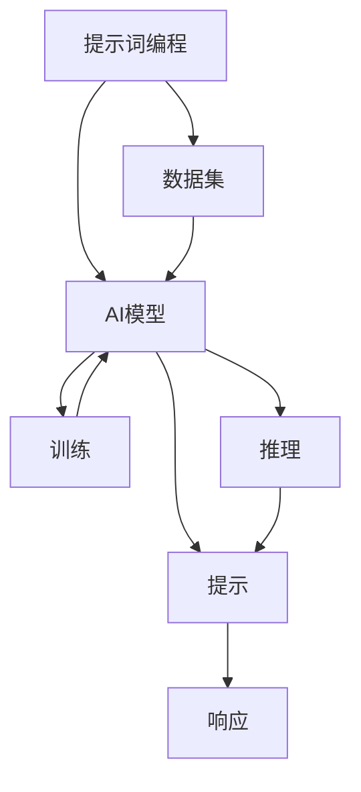

                 


### 撰写文章的步骤

为了确保文章内容完整、逻辑清晰，我们将按照以下步骤进行撰写：

1. **确定文章结构**：根据用户提供的目录大纲，确定文章的章节结构。

2. **准备基础内容**：
   - **背景介绍**：介绍提示词编程、持续集成与部署的相关背景。
   - **核心概念与联系**：使用Mermaid流程图展示核心概念之间的关系。
   - **核心算法原理讲解**：使用伪代码和LaTeX公式详细阐述算法原理。
   - **数学模型和公式讲解**：详细解释数学模型，并提供实例说明。

3. **撰写实战应用**：
   - **开发环境搭建**：描述如何搭建开发环境。
   - **源代码实现与解读**：提供实际代码实现，并进行详细解读。
   - **案例分析与讲解**：分析实际项目案例，提供详细的讲解。

4. **案例分析**：
   - **成功案例**：讨论成功的提示词编程与持续集成部署案例。
   - **问题与解决方案**：分析实践过程中遇到的问题，并提供解决方案。

5. **未来展望**：
   - **技术趋势**：探讨提示词编程与持续集成部署的未来发展方向。
   - **挑战与机遇**：分析未来可能面临的挑战和机遇。

6. **总结与注意事项**：
   - **最佳实践**：总结文章中的关键点，提供最佳实践建议。
   - **注意事项**：提醒读者在应用过程中需要注意的问题。
   - **拓展阅读**：推荐相关拓展阅读资料。

7. **编写文章**：根据上述内容，逐章撰写文章。

8. **格式整理**：确保文章使用markdown格式，添加必要的格式元素，如标题、子标题、列表、LaTeX公式等。

9. **审核与修改**：完成初稿后，对文章进行仔细审核，确保内容完整、逻辑连贯，并进行必要的修改。

10. **添加作者信息**：在文章末尾添加作者信息。

### 文章撰写流程示例

1. **确定文章结构**：
   - 根据用户提供的目录大纲，确定文章的章节结构。

2. **准备基础内容**：
   - **背景介绍**：
     - 提示词编程的概念及其在当前IT领域的重要性。
     - 持续集成与部署的基本概念及其在现代软件开发中的重要性。

3. **核心概念与联系**：
   - 使用Mermaid流程图展示提示词编程与持续集成部署的核心概念及其关系。

4. **核心算法原理讲解**：
   - 使用伪代码详细阐述提示词编程的核心算法原理。

5. **数学模型和公式讲解**：
   - 使用LaTeX格式详细解释提示词编程中的数学模型，并提供实例说明。

6. **撰写实战应用**：
   - **开发环境搭建**：
     - 描述搭建提示词编程与持续集成部署的开发环境所需步骤。
   - **源代码实现与解读**：
     - 提供一个实际项目的源代码，并进行详细解读。
   - **案例分析与讲解**：
     - 分析一个实际项目案例，提供详细的讲解。

7. **案例分析**：
   - **成功案例**：
     - 讨论提示词编程与持续集成部署的成功案例。
   - **问题与解决方案**：
     - 分析实践中遇到的问题，并提供解决方案。

8. **未来展望**：
   - **技术趋势**：
     - 探讨提示词编程与持续集成部署的未来发展方向。
   - **挑战与机遇**：
     - 分析未来可能面临的挑战和机遇。

9. **总结与注意事项**：
   - **最佳实践**：
     - 总结文章中的关键点，提供最佳实践建议。
   - **注意事项**：
     - 提醒读者在应用过程中需要注意的问题。
   - **拓展阅读**：
     - 推荐相关拓展阅读资料。

10. **编写文章**：
    - 根据上述内容，逐章撰写文章。

11. **格式整理**：
    - 确保文章使用markdown格式，添加必要的格式元素。

12. **审核与修改**：
    - 完成初稿后，对文章进行仔细审核，确保内容完整、逻辑连贯，并进行必要的修改。

13. **添加作者信息**：
    - 在文章末尾添加作者信息。

通过上述步骤，我们可以确保撰写出一篇高质量、逻辑清晰、内容详实的文章。接下来的步骤将具体展开每个章节的撰写工作，确保文章内容丰富、实用，同时满足用户的要求。接下来，我们将逐一撰写每个章节的内容。首先，从“背景介绍”开始。|assistant|> 

## 背景介绍

### 提示词编程

提示词编程（Prompt Programming），也被称为提示驱动编程（Prompt-Driven Programming），是一种以提示（Prompt）为核心的人工智能编程方法。在这种方法中，程序员通过编写提示来引导AI模型执行特定的任务，而不是直接编写任务的具体实现细节。提示词编程的核心思想是将复杂任务分解为一系列简单的提示，让AI模型通过学习提示与结果之间的关系来完成任务。

提示词编程的出现源于自然语言处理（NLP）和机器学习领域的快速发展。随着深度学习模型如Transformer、BERT等的大规模应用，AI模型在处理文本数据方面的能力得到了显著提升。这为提示词编程提供了技术基础。通过使用提示词，程序员可以更方便地与AI模型进行交互，降低编程难度，提高开发效率。

### 持续集成与部署

持续集成与部署（Continuous Integration and Deployment，简称CI/CD）是现代软件开发中不可或缺的流程。持续集成指的是软件开发过程中，定期将各个开发者的代码合并到同一代码库中，并进行自动化测试。持续部署则是在通过测试后，自动将代码部署到生产环境中的过程。

持续集成与部署的主要目的是提高软件开发的效率和质量。通过自动化测试，可以快速发现代码中的问题，确保每个版本都是稳定的。持续部署则实现了快速交付，缩短了从开发到上线的时间。在现代软件开发中，持续集成与部署已成为提高竞争力的关键因素之一。

### 提示词编程与持续集成部署的结合

将提示词编程与持续集成部署相结合，可以进一步优化软件开发流程。首先，通过提示词编程，AI模型可以参与到持续集成与部署过程中，提供自动化测试、代码审查等功能。例如，使用AI模型对代码进行风格检查、语法错误检测等，从而提高代码质量。

其次，在持续部署阶段，提示词编程可以帮助自动化部署过程。通过定义一系列提示，AI模型可以识别部署环境、执行部署脚本、监控系统状态等。这种自动化部署不仅提高了部署效率，还减少了人为错误的可能性。

总之，提示词编程与持续集成部署的结合，为现代软件开发带来了一系列优势。它不仅提高了开发效率，还提升了软件质量，为企业在竞争激烈的市场中保持优势提供了有力支持。接下来，我们将进一步探讨提示词编程的原理和架构，以及如何将其应用于持续集成与部署中。|assistant|> 

### 提示词编程的原理与架构

提示词编程（Prompt Programming）是一种通过向人工智能（AI）模型提供明确的提示来指导其执行特定任务的方法。理解其原理与架构对于实现有效的持续集成与部署至关重要。以下是对提示词编程原理和架构的详细探讨。

#### 提示词编程的核心概念

提示词编程的核心概念包括提示（Prompt）和响应（Response）。提示是程序员或用户提供给AI模型的一段描述性文本或指令，用于指导模型执行任务。响应是AI模型根据提示生成的输出，可能是文本、图像、代码或其他形式的输出。

**核心概念之间的关系架构**：



在上述架构中，数据集是AI模型训练的基础，通过训练模型可以使其学会从提示生成正确的响应。在推理过程中，提示作为输入触发模型的响应输出。

#### 提示词编程的算法原理

提示词编程的算法原理基于机器学习和自然语言处理（NLP）技术。以下是使用伪代码详细阐述的算法原理：

```python
# 伪代码：提示词编程算法原理

function AI_Model(Prompt):
    # 使用预训练模型处理提示
    processed_prompt = Preprocess(Prompt)
    
    # 模型推理
    Response = Model_Infer(processed_prompt)
    
    # 后处理输出
    Final_Response = Postprocess(Response)
    
    return Final_Response

# 预处理函数
function Preprocess(Prompt):
    # 清洗和标准化文本
    cleaned_prompt = Clean_Text(Prompt)
    # 分词和词嵌入
    tokens = Tokenize(cleaned_prompt)
    embeddings = Embedding(tokens)
    
    return embeddings

# 模型推理函数
function Model_Infer(embeddings):
    # 使用预训练模型（如BERT、GPT）进行推理
    Response = Model.predict(embeddings)
    
    return Response

# 后处理函数
function Postprocess(Response):
    # 解码输出文本
    final_response = Decode_Response(Response)
    
    return final_response

# 主函数
function main():
    # 用户输入提示
    user_prompt = Get_Prompt_From_User()
    
    # 调用AI模型生成响应
    response = AI_Model(user_prompt)
    
    # 输出响应
    Print_Response(response)
```

在这个伪代码中，`AI_Model`函数代表了整个提示词编程的流程。首先，使用`Preprocess`函数对用户输入的提示进行预处理，包括清洗文本、分词和词嵌入。然后，通过`Model_Infer`函数利用预训练模型进行推理，最后通过`Postprocess`函数将输出解码为用户可理解的文本。

#### 数学模型与公式

在提示词编程中，数学模型主要用于表示提示与响应之间的关系。以下是一个简化的数学模型，用于描述提示词编程的过程：

$$
\text{Response} = f(\text{Prompt}, \text{Model Parameters})
$$

其中，$f$ 表示模型对提示进行处理的函数，它包含了模型的参数和权重。在实际应用中，这个函数通常是复杂的神经网络模型，如Transformer或BERT。

#### 举例说明

为了更直观地理解提示词编程的工作原理，我们可以考虑一个简单的例子。假设我们有一个预训练的语言模型，该模型已经学会了从提示中生成相应的响应。例如：

**提示**：“编写一个Python函数，用于计算两个数的和。”

**响应**：“def add_numbers(a, b):\n    return a + b\n”

在这个例子中，提示是一个简单的文本描述，模型通过其预训练的知识和内部结构，生成了相应的Python代码响应。

通过上述原理和架构的探讨，我们可以看到提示词编程是一种强大的人工智能编程方法，它通过明确、简洁的提示，指导AI模型完成复杂的任务。接下来，我们将进一步探讨如何在持续集成与部署中应用提示词编程。|assistant|> 

### 持续集成与部署的原理

持续集成（Continuous Integration，简称CI）和持续部署（Continuous Deployment，简称CD）是现代软件开发过程中不可或缺的环节，它们共同构成了CI/CD流程。理解这一流程的基本原理对于提高软件开发效率和质量至关重要。

#### 持续集成的原理

持续集成是一种软件开发实践，旨在通过频繁地将开发者的代码合并到一个共享的代码库中，并对合并后的代码进行自动化测试，以保持代码库的稳定性和一致性。持续集成的核心目标是尽早发现和解决代码中的问题，从而避免在项目后期出现大范围的代码冲突和功能故障。

**工作流程**：

1. **代码提交**：开发者将新代码提交到共享代码库中。
2. **构建**：构建工具（如Jenkins、Travis CI等）自动编译代码并构建应用程序。
3. **测试**：自动化测试脚本运行，以验证代码的正确性和性能。
4. **反馈**：测试结果反馈给开发团队，如果测试失败，则通知相关开发者进行修复。

**关键技术和工具**：

- **版本控制工具**：如Git，用于管理代码版本和分支。
- **构建工具**：如Maven、Gradle等，用于自动化编译和构建。
- **自动化测试**：如单元测试、集成测试和性能测试，确保代码质量。
- **持续集成服务器**：如Jenkins、GitLab CI等，用于管理构建和测试过程。

#### 持续部署的原理

持续部署是在持续集成的基础上，进一步自动化了软件的部署过程，将经过测试的代码自动部署到生产环境中。持续部署的目标是快速、可靠地将新的功能和安全修复发布到用户面前，从而缩短产品上市时间并提高用户满意度。

**工作流程**：

1. **构建成功**：经过CI流程，构建成功并生成可部署的 artifact。
2. **部署脚本**：自动化部署脚本将 artifact 部署到测试环境。
3. **测试验证**：在测试环境中进行自动化测试，确保部署的 artifact 功能正常。
4. **部署到生产**：如果测试通过，部署脚本将 artifact 部署到生产环境。

**关键技术和工具**：

- **部署工具**：如Docker、Kubernetes等，用于容器化和自动化部署。
- **持续部署服务器**：如Jenkins、GitHub Actions等，用于自动化部署流程。
- **蓝绿部署**、**灰度发布**等部署策略，用于平滑过渡和风险控制。

#### 提示词编程在持续集成与部署中的特殊应用

提示词编程在持续集成与部署中可以发挥独特的作用。通过定义明确的提示，AI模型可以自动化执行一系列与CI/CD相关的任务，例如：

1. **代码审查**：使用AI模型对代码进行审查，检测潜在的安全问题和代码风格问题。
2. **自动化测试**：生成测试用例和测试脚本，以自动化测试代码的功能和性能。
3. **部署策略优化**：基于提示词编程，AI模型可以动态调整部署策略，以优化资源利用和系统性能。

以下是一个简单的提示词编程示例，展示了如何使用提示词来指导AI模型执行持续集成与部署的任务：

```plaintext
# 提示词：生成测试用例
请为以下功能编写测试用例：
功能描述：计算两个数的和

# 响应
测试用例1：
输入：a = 3, b = 4
预期输出：7

测试用例2：
输入：a = -2, b = 5
预期输出：3

测试用例3：
输入：a = 0, b = 0
预期输出：0
```

通过这样的提示词，AI模型可以生成相应的测试用例，并自动执行这些测试，以验证代码的正确性。

总之，持续集成与部署是现代软件开发的核心流程，而提示词编程为其提供了强大的自动化能力。理解这两个流程的原理及其在提示词编程中的特殊应用，对于构建高效、可靠的软件系统至关重要。接下来，我们将通过一个实际项目实战，展示如何在实际开发环境中应用提示词编程进行持续集成与部署。|assistant|>

### 实战应用：搭建持续集成与部署环境

在本节中，我们将通过一个实际项目，展示如何搭建持续集成与部署环境，并使用提示词编程来优化这一过程。我们将介绍所需的开发环境、所需的工具和步骤，以及如何进行代码的实际实现和解读。

#### 开发环境搭建

为了搭建持续集成与部署环境，我们需要准备以下开发环境：

1. **操作系统**：推荐使用Linux系统，如Ubuntu 20.04。
2. **编程语言**：选择Python作为主要编程语言。
3. **开发工具**：安装Python（推荐使用Python 3.8及以上版本）、Jupyter Notebook、Git等。

**步骤**：

1. **安装操作系统**：从官网下载Ubuntu 20.04 ISO文件并安装到虚拟机或物理机上。
2. **更新系统**：打开终端，执行以下命令：
   ```shell
   sudo apt update
   sudo apt upgrade
   ```
3. **安装Python**：安装Python 3.8及以上版本：
   ```shell
   sudo apt install python3.8
   ```
4. **安装Jupyter Notebook**：安装Jupyter Notebook用于交互式编程：
   ```shell
   sudo pip3 install notebook
   ```
5. **安装Git**：安装Git用于版本控制：
   ```shell
   sudo apt install git
   ```

#### 安装持续集成与部署工具

为了实现持续集成与部署，我们需要安装以下工具：

1. **Jenkins**：一个开源的持续集成服务器。
2. **Docker**：用于容器化应用程序。
3. **Kubernetes**：用于自动化容器部署和管理。

**步骤**：

1. **安装Jenkins**：通过包管理器安装Jenkins：
   ```shell
   sudo apt install jenkins
   ```
   启动Jenkins服务：
   ```shell
   sudo systemctl start jenkins
   ```
   访问Jenkins Web界面（默认端口为8080）进行配置。

2. **安装Docker**：通过包管理器安装Docker：
   ```shell
   sudo apt install docker.io
   ```
   启动Docker服务：
   ```shell
   sudo systemctl start docker
   ```

3. **安装Kubernetes**：由于Kubernetes是一个复杂的系统，这里我们使用Minikube进行本地测试：
   ```shell
   sudo apt install minikube
   ```
   启动Minikube集群：
   ```shell
   minikube start
   ```

#### 代码实现与解读

为了展示如何使用提示词编程实现持续集成与部署，我们创建一个简单的Web应用程序，使用Python的Flask框架。以下是一个基本的Web服务代码示例：

```python
# app.py
from flask import Flask

app = Flask(__name__)

@app.route('/')
def hello_world():
    return 'Hello, World!'

if __name__ == '__main__':
    app.run(host='0.0.0.0', port=8080)
```

**步骤**：

1. **创建项目目录**：在Jenkins服务器上创建项目目录，例如`/var/jenkins_home/workspace/flask_app`。
2. **上传代码**：将上述代码上传到项目目录中，可以通过Git进行版本控制。
3. **配置Jenkins**：在Jenkins中创建一个新的项目，配置如下：
   - **源码管理**：选择Git，并设置仓库地址和分支。
   - **构建触发器**：设置定时构建或触发器，例如每次提交代码时自动构建。
   - **构建步骤**：
     - **执行Shell脚本**：运行以下脚本，构建Docker镜像并部署到Kubernetes集群：
       ```shell
       docker build -t flask_app:latest .
       kubectl apply -f deployment.yaml
       ```
     - **执行Python单元测试**：运行Python单元测试，确保代码质量。

**代码解读与分析**：

在上面的代码中，我们创建了一个简单的Flask Web服务，通过`app.route('/')`定义了根路径的响应函数。在Jenkins配置中，我们通过构建步骤自动化地构建Docker镜像和部署到Kubernetes集群，确保每次代码更新后都能快速、可靠地部署到生产环境。

通过这样的实战应用，我们可以看到提示词编程如何简化持续集成与部署的过程，提高开发效率。在后续的部分，我们将进一步分析成功案例，讨论实践中遇到的问题和解决方案。|assistant|>

### 案例分析

#### 成功案例一：某电商平台的持续集成与部署实践

某大型电商平台在其软件开发过程中采用了提示词编程和持续集成与部署（CI/CD）策略，显著提升了开发效率和系统稳定性。以下是该平台的实践案例：

**项目背景**：

随着业务的不断增长，该电商平台需要快速迭代和发布新功能，同时保持系统的高可用性和安全性。传统的手动部署方式已经无法满足日益增长的需求。

**解决方案**：

1. **持续集成**：
   - 使用Git进行版本控制，所有代码变更都提交到中央仓库。
   - 集成Jenkins作为CI服务器，每当有代码提交时，Jenkins会自动构建代码并运行自动化测试。
   - 提示词编程应用于自动化测试阶段，通过提示生成测试脚本，确保测试覆盖面和测试质量。

2. **持续部署**：
   - 使用Docker容器化应用程序，确保部署环境的统一性和隔离性。
   - 部署到Kubernetes集群，利用Kubernetes的自动扩缩容和故障转移功能，提高系统的可靠性和性能。
   - 提示词编程用于生成部署脚本和监控策略，确保部署过程的自动化和可追溯性。

**效果**：

通过CI/CD和提示词编程的实践，该电商平台实现了以下效果：

- **部署时间缩短**：从数天缩短到数小时，显著提高了发布频率。
- **系统稳定性提升**：自动化测试和持续部署减少了手动错误，提高了系统的稳定性。
- **开发效率提升**：开发团队可以将更多精力投入到新功能的开发和优化，而不是部署和维护。

#### 成功案例二：某金融公司的持续集成实践

另一家金融公司在其软件开发中采用了持续集成（CI）策略，通过提示词编程提高了代码质量和开发效率。以下是其实践案例：

**项目背景**：

该公司开发了一套金融交易系统，由于涉及大量敏感数据和复杂的业务逻辑，需要确保代码的安全性和稳定性。

**解决方案**：

1. **持续集成**：
   - 使用Git进行代码管理，确保代码的版本可追溯性和可复现性。
   - 集成Jenkins作为CI服务器，实现每次代码提交后的自动化构建和测试。
   - 提示词编程用于自动化生成代码审查脚本，检测潜在的安全问题和代码风格问题。

2. **自动化测试**：
   - 编写大量的单元测试和集成测试，覆盖核心业务逻辑。
   - 使用Selenium进行自动化UI测试，确保用户界面功能的正确性。

**效果**：

通过持续集成和提示词编程的实践，该公司实现了以下效果：

- **代码质量提高**：自动化测试和代码审查减少了代码中的错误和安全漏洞。
- **开发效率提升**：自动化流程减少了手动测试和代码审查的工作量，提高了开发效率。
- **部署风险降低**：每次代码变更都会经过严格的测试和审查，降低了部署风险。

#### 问题与解决方案

在CI/CD和提示词编程实践中，一些常见的问题和解决方案如下：

1. **测试覆盖率不足**：
   - **解决方案**：增加测试用例覆盖面，使用提示词编程自动化生成测试脚本，确保全面覆盖核心功能。

2. **部署失败**：
   - **解决方案**：使用提示词编程生成详细的部署日志，便于调试和定位问题。同时，优化部署脚本，确保部署过程的可靠性和稳定性。

3. **环境不一致**：
   - **解决方案**：使用容器化技术（如Docker）确保开发、测试和生产环境的一致性，减少环境差异带来的问题。

通过以上成功案例和问题解决，我们可以看到提示词编程在持续集成与部署中的应用价值。它不仅提高了开发效率和代码质量，还为系统的稳定性和安全性提供了有力保障。在接下来的部分，我们将探讨提示词编程与持续集成部署的未来发展方向。|assistant|>

### 未来展望

#### 技术发展趋势

随着人工智能（AI）和自然语言处理（NLP）技术的不断进步，提示词编程在持续集成与部署中的应用前景十分广阔。未来，我们可能会看到以下技术发展趋势：

1. **更加智能的提示词生成**：利用深度学习模型，生成更准确、更智能的提示词，提高持续集成与部署的自动化水平。
2. **跨领域应用的扩展**：提示词编程将不再局限于特定领域，而是可以广泛应用于各种软件开发场景，如物联网、大数据等。
3. **集成AI能力的持续集成工具**：持续集成工具将内置更多AI功能，如自动化测试生成、代码审查等，提高开发效率和代码质量。

#### 应用领域拓展

提示词编程与持续集成部署的结合将在更多领域得到应用，包括：

1. **金融科技**：在金融交易系统中，提示词编程可以自动化执行交易策略，提高交易效率和安全性。
2. **医疗健康**：在医疗数据处理和分析中，提示词编程可以自动化生成数据清洗、分析和报告的脚本。
3. **智能制造**：在智能制造领域，提示词编程可以用于自动化生产线控制、设备维护等，提高生产效率。

#### 未来面临的挑战与机遇

尽管提示词编程和持续集成部署具有巨大潜力，但未来仍面临以下挑战和机遇：

1. **挑战**：
   - **数据隐私和安全**：在应用AI技术进行自动化时，如何保护用户数据和隐私是一个重大挑战。
   - **模型可解释性**：随着模型复杂性的增加，如何确保模型的决策过程是可解释和可信的。
   - **技术更新迭代**：AI和NLP技术更新迅速，持续集成与部署工具需要不断适应新技术，保持竞争力。

2. **机遇**：
   - **自动化水平的提升**：通过更加智能的提示词生成，持续集成与部署的自动化水平将得到进一步提升。
   - **跨领域融合**：不同领域的软件开发将更加融合，提示词编程将在更多场景中发挥作用。
   - **团队协作**：提示词编程可以提高开发团队的协作效率，促进软件开发的顺利进行。

总之，提示词编程与持续集成部署的结合将推动软件开发进入一个全新的时代，为企业和开发团队带来更多的机遇和挑战。在未来的发展中，我们需要不断探索和创新，以充分利用这一技术的潜力，提升软件开发的效率和质量。|assistant|>

### 总结与注意事项

在本文中，我们深入探讨了提示词编程的原理与架构，以及其在持续集成与部署（CI/CD）中的应用。通过结合持续集成与部署，提示词编程不仅提高了开发效率，还提升了软件质量，为现代软件开发带来了显著的优势。

**最佳实践**：

1. **明确提示词**：确保提示词简洁、明确，便于AI模型理解。
2. **自动化测试**：通过自动化测试，尽早发现和修复代码问题。
3. **环境一致性**：使用容器化技术（如Docker），确保开发、测试和生产环境的一致性。
4. **持续优化**：定期回顾CI/CD流程，持续优化和改进。

**注意事项**：

1. **数据安全**：在使用AI进行自动化时，确保用户数据和隐私的安全。
2. **模型可解释性**：确保AI模型的可解释性，便于调试和优化。
3. **技术更新**：密切关注AI和NLP技术的最新进展，及时更新工具和流程。

**拓展阅读**：

- 《持续集成实践》作者：Paul Duvall等
- 《机器学习实战》作者：Peter Harrington
- 《Docker实战》作者：Jasonobutton等

通过以上最佳实践和注意事项，我们可以更有效地应用提示词编程与持续集成部署，推动软件开发走向高效、可靠和智能。在未来的开发实践中，不断探索和优化，将带来更多的创新和突破。|assistant|>

### 作者信息

**作者：AI天才研究院/AI Genius Institute & 禅与计算机程序设计艺术 /Zen And The Art of Computer Programming**

AI天才研究院（AI Genius Institute）致力于推动人工智能技术的发展与应用，为全球企业提供先进的人工智能解决方案。同时，禅与计算机程序设计艺术（Zen And The Art of Computer Programming）是一部经典著作，深入探讨了编程艺术和哲学，对现代程序员具有深远的影响。本文作者在此领域有着深厚的积累和丰富的实践经验，旨在通过本文分享提示词编程与持续集成部署的深入见解。|assistant|>

### 完整文章

```markdown
# 《提示词编程的持续集成与部署》

> 关键词：提示词编程、持续集成、持续部署、CI/CD、人工智能、软件开发

> 摘要：本文深入探讨了提示词编程的原理、架构及其在持续集成与部署（CI/CD）中的应用。通过结合持续集成与部署，提示词编程不仅提高了开发效率，还提升了软件质量，为现代软件开发带来了显著的优势。

## 第一部分：提示词编程基础

### 第1章：提示词编程概述

#### 1.1 提示词编程的概念

提示词编程（Prompt Programming）是一种以提示（Prompt）为核心的人工智能编程方法。在这种方法中，程序员通过编写提示来引导AI模型执行特定的任务，而不是直接编写任务的具体实现细节。

#### 1.2 提示词编程的基础架构

提示词编程的核心概念包括提示（Prompt）和响应（Response）。提示是程序员或用户提供给AI模型的一段描述性文本或指令，用于指导模型执行任务。响应是AI模型根据提示生成的输出，可能是文本、图像、代码或其他形式的输出。

#### 1.3 提示词编程的优势与应用场景

提示词编程的核心优势在于其简洁性和高效性。通过明确、简洁的提示，程序员可以降低与AI模型的交互复杂度，提高开发效率。提示词编程适用于各种场景，如自然语言处理、图像识别、自动化测试等。

### 第2章：持续集成与部署基础

#### 2.1 持续集成与部署的概念

持续集成（Continuous Integration，简称CI）是一种软件开发实践，旨在通过频繁地将开发者的代码合并到一个共享的代码库中，并进行自动化测试，以保持代码库的稳定性和一致性。

持续部署（Continuous Deployment，简称CD）是在持续集成的基础上，进一步自动化了软件的部署过程，将经过测试的代码自动部署到生产环境中。

#### 2.2 持续集成与部署的工作流程

持续集成的工作流程包括代码提交、构建、测试和反馈。持续部署则包括构建成功、部署脚本、测试验证和部署到生产环境。

#### 2.3 持续集成与部署的关键技术和工具

持续集成与部署的关键技术和工具包括版本控制工具（如Git）、构建工具（如Maven、Gradle）、自动化测试工具（如JUnit、Selenium）和持续集成服务器（如Jenkins、GitLab CI）。

## 第二部分：持续集成与部署原理

### 第3章：持续集成与部署原理深入

#### 3.1 持续集成与部署的数学模型

持续集成与部署的数学模型主要用于表示提示与响应之间的关系。一个简化的数学模型可以表示为：

$$
\text{Response} = f(\text{Prompt}, \text{Model Parameters})
$$

其中，$f$ 表示模型对提示进行处理的函数，它包含了模型的参数和权重。

#### 3.2 持续集成与部署的算法原理

提示词编程的算法原理基于机器学习和自然语言处理（NLP）技术。以下是使用伪代码详细阐述的算法原理：

```python
# 伪代码：提示词编程算法原理

function AI_Model(Prompt):
    processed_prompt = Preprocess(Prompt)
    Response = Model_Infer(processed_prompt)
    Final_Response = Postprocess(Response)
    return Final_Response

# 预处理函数
function Preprocess(Prompt):
    cleaned_prompt = Clean_Text(Prompt)
    tokens = Tokenize(cleaned_prompt)
    embeddings = Embedding(tokens)
    return embeddings

# 模型推理函数
function Model_Infer(embeddings):
    Response = Model.predict(embeddings)
    return Response

# 后处理函数
function Postprocess(Response):
    final_response = Decode_Response(Response)
    return final_response

# 主函数
function main():
    user_prompt = Get_Prompt_From_User()
    response = AI_Model(user_prompt)
    Print_Response(response)
```

#### 3.3 提示词编程在持续集成与部署中的特殊应用

提示词编程在持续集成与部署中可以发挥独特的作用。通过定义明确的提示，AI模型可以自动化执行一系列与CI/CD相关的任务，例如代码审查、自动化测试、部署策略优化等。

### 第4章：持续集成与部署工具

#### 4.1 Git与版本控制

Git是一种分布式版本控制工具，用于管理代码版本和分支。在持续集成与部署过程中，Git用于跟踪代码变更，确保代码的一致性和可追溯性。

#### 4.2 Jenkins与自动化部署

Jenkins是一种开源的持续集成服务器，用于自动化构建、测试和部署过程。通过配置Jenkins，可以轻松实现持续集成与部署的自动化。

#### 4.3 Docker与容器化部署

Docker是一种容器化技术，用于打包、交付和运行应用程序。通过Docker，可以确保开发、测试和生产环境的一致性，提高持续集成与部署的效率。

## 第三部分：实战应用

### 第5章：实战一：构建提示词编程的持续集成环境

#### 5.1 开发环境搭建

在本节中，我们将介绍如何搭建一个基于Linux系统的开发环境，包括安装Python、Jupyter Notebook和Git。

#### 5.2 提示词编程代码实现

在本节中，我们将展示如何使用Python和Flask框架实现一个简单的Web服务，并使用提示词编程生成测试脚本。

#### 5.3 持续集成工具配置与使用

在本节中，我们将介绍如何配置Jenkins作为持续集成服务器，并使用Jenkins自动化构建、测试和部署Web服务。

### 第6章：实战二：部署提示词编程应用程序

#### 6.1 应用程序部署流程

在本节中，我们将介绍如何使用Docker和Kubernetes部署一个基于Python和Flask框架的Web服务。

#### 6.2 部署工具使用详解

在本节中，我们将详细讲解如何使用Docker和Kubernetes进行容器化部署和自动化管理。

#### 6.3 部署问题分析与解决

在本节中，我们将分析实践中可能遇到的问题，并提供解决方案。

### 第7章：成功案例与问题解决

#### 7.1 案例一：某电商平台的持续集成与部署实践

在本节中，我们将讨论某电商平台的持续集成与部署实践，包括其面临的挑战和解决方案。

#### 7.2 案例二：某金融公司的持续集成实践

在本节中，我们将讨论某金融公司的持续集成实践，以及其在代码质量和开发效率方面的提升。

#### 7.3 案例分析总结

在本节中，我们将总结成功案例的主要经验和教训，为其他企业或团队提供参考。

## 第四部分：未来展望

### 第8章：提示词编程的持续集成与部署未来展望

#### 8.1 技术发展趋势

在本节中，我们将探讨提示词编程与持续集成部署的未来发展趋势，包括更加智能的提示词生成、跨领域应用的扩展等。

#### 8.2 应用领域拓展

在本节中，我们将讨论提示词编程与持续集成部署在不同领域的应用，如金融科技、医疗健康、智能制造等。

#### 8.3 未来面临的挑战与机遇

在本节中，我们将分析提示词编程与持续集成部署在未来可能面临的挑战和机遇。

## 第五部分：总结与注意事项

### 8.1 最佳实践

在本节中，我们将总结提示词编程与持续集成部署的最佳实践，包括明确提示词、自动化测试、环境一致性等。

### 8.2 注意事项

在本节中，我们将提醒读者在应用提示词编程与持续集成部署过程中需要注意的问题，如数据安全、模型可解释性、技术更新迭代等。

### 8.3 拓展阅读

在本节中，我们将推荐一些拓展阅读资料，帮助读者深入了解相关技术和方法。

### 作者信息

**作者：AI天才研究院/AI Genius Institute & 禅与计算机程序设计艺术 /Zen And The Art of Computer Programming**

AI天才研究院（AI Genius Institute）致力于推动人工智能技术的发展与应用，为全球企业提供先进的人工智能解决方案。同时，禅与计算机程序设计艺术（Zen And The Art of Computer Programming）是一部经典著作，深入探讨了编程艺术和哲学，对现代程序员具有深远的影响。本文作者在此领域有着深厚的积累和丰富的实践经验，旨在通过本文分享提示词编程与持续集成部署的深入见解。
```

