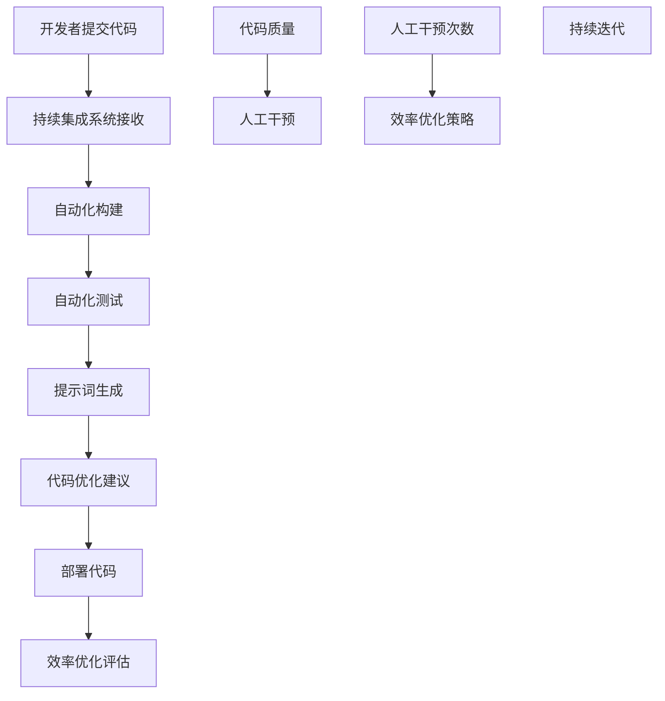

                 

  
确定书籍的基本框架：首先，我们需要确定这本书的基本框架，这包括介绍书籍的主题和目的，以及概述各个章节的主要内容。

### 书籍主题和目的

本书旨在探讨提示词编程在持续集成过程中的应用，以及如何通过优化持续集成流程来提升软件开发效率。我们将深入剖析提示词编程的基本原理，介绍其与持续集成的紧密联系，并通过实际案例展示如何进行效率优化。

### 章节概述

1. **引言**：介绍书籍的目的和重要性，以及提示词编程与持续集成的关系。
2. **核心概念与联系**：详细阐述提示词编程的基本原理、持续集成的流程与工具，以及效率优化的关键指标，并使用Mermaid流程图展示它们之间的关系。
3. **核心算法原理讲解**：通过伪代码详细讲解提示词生成算法、持续集成优化算法和效率优化算法。
4. **数学模型与公式讲解**：使用LaTeX格式展示持续集成效率优化的数学模型和相关公式，并进行详细讲解与举例说明。
5. **项目实战**：提供提示词编程与持续集成的实现、效率优化的实现与效果分析，以及代码解读与分析。
6. **案例研究**：分析不同规模项目的效率优化实践，包括大型项目、小型项目以及跨团队协作中的效率优化策略。
7. **总结与展望**：总结全书内容，探讨持续集成与效率优化的发展趋势，以及未来的研究方向与挑战。

通过以上章节结构，本书将系统地引导读者了解提示词编程在持续集成中的实际应用，并提供实用的优化策略，以提升软件开发效率。接下来，我们将逐步完善每个章节的内容，确保文章逻辑清晰、结构紧凑、简单易懂。

## 第1章 引言

持续集成（Continuous Integration，CI）是现代软件开发过程中不可或缺的一环。它旨在通过频繁地将代码变更合并到主分支，确保代码的稳定性和一致性，从而提高软件开发的效率和质量。然而，随着项目规模和复杂度的增加，持续集成过程也变得越来越复杂，对开发效率和代码质量带来了巨大的挑战。

### 1.1 书籍的目的和重要性

本书的目的是探讨如何利用提示词编程（Prompt-based Programming）来优化持续集成的效率。提示词编程是一种基于自然语言处理技术的编程方法，它通过为开发者提供智能化的提示词，帮助他们更高效地完成编码任务。本书将介绍提示词编程的基本原理，并将其与持续集成相结合，探讨如何通过优化持续集成流程来提升软件开发效率。

提示词编程的重要性在于：

1. **提高开发效率**：通过智能化的提示词，开发者可以更快地理解项目需求和实现方法，减少开发时间和代码错误率。
2. **提升代码质量**：提示词编程可以帮助开发者遵循更好的编程规范和最佳实践，从而提高代码的可靠性和可维护性。
3. **简化持续集成流程**：利用提示词编程，可以自动识别和修复潜在的问题，减少人工干预，提高持续集成流程的效率。

### 1.2 提示词编程的概念与背景

提示词编程，顾名思义，是一种编程方法，它通过为开发者提供一系列提示词（Prompt），帮助他们更好地理解和实现代码。这些提示词可以是自然语言描述，也可以是代码片段、函数调用等。提示词编程的核心思想是将复杂的问题分解为一系列简单、明确的步骤，从而降低开发难度，提高开发效率。

提示词编程的背景主要源自以下几个方面：

1. **人工智能技术的发展**：随着深度学习、自然语言处理等技术的快速发展，计算机能够更好地理解和处理自然语言，为提示词编程提供了技术支持。
2. **软件开发方法论的变革**：敏捷开发、DevOps等新兴软件开发方法论强调快速迭代和频繁交付，提示词编程作为一种高效、智能的编程方法，正好契合了这种需求。
3. **持续集成的需求**：持续集成要求开发者能够快速、稳定地合并代码变更，提示词编程可以有效地提高这一过程的效率和可靠性。

### 1.3 持续集成与效率优化的关系

持续集成是将开发者的代码定期合并到主分支的过程，其核心目的是确保代码的质量和一致性。然而，随着项目的规模和复杂度增加，持续集成过程也变得越来越复杂，对开发效率和代码质量提出了更高的要求。

效率优化在持续集成中起着至关重要的作用。通过优化持续集成流程，可以提高代码合并的效率，减少集成过程中的错误和冲突，从而提升整个开发团队的工作效率。具体来说，效率优化的目标包括：

1. **减少Build时间和部署时间**：通过优化构建和部署流程，可以显著缩短持续集成周期，提高开发效率。
2. **提高代码质量**：通过自动化测试和静态分析等手段，可以提前发现和修复潜在的问题，确保代码的可靠性和一致性。
3. **降低人工干预**：通过智能化工具和算法，可以减少人工干预，提高持续集成流程的自动化程度。

在本章中，我们介绍了书籍的主题和目的，探讨了提示词编程的基本原理和持续集成的重要性。接下来，我们将进一步深入探讨提示词编程与持续集成的具体应用，并通过实际案例展示如何进行效率优化。

## 第2章 核心概念与联系

在深入探讨提示词编程和持续集成之前，我们需要明确一些核心概念，并理解它们之间的相互关系。本章将详细阐述提示词编程的基本原理、持续集成的流程与工具，以及效率优化的关键指标，并通过Mermaid流程图展示它们之间的关系。

### 2.1 提示词编程的基本原理

提示词编程（Prompt-based Programming）是一种基于自然语言处理的编程方法，旨在通过为开发者提供一系列提示词（Prompt）来帮助他们更高效地理解和实现代码。提示词可以是自然语言描述，也可以是代码片段、函数调用等。以下是提示词编程的核心组成部分：

1. **提示词的定义与作用**：
   - 提示词（Prompt）：一组用于引导开发者完成特定任务的文字或代码片段。
   - 作用：帮助开发者明确任务目标，减少理解成本，提高开发效率。

2. **提示词生成算法**：
   - 简单的提示词生成算法伪代码：
     ```python
     def generate_prompt(user_input):
         if is_keyword(user_input):
             return "请实现以下功能："
         else:
             return "请根据以下需求编写代码："

     def is_keyword(word):
         # 判断单词是否为关键字
         return word in ["function", "class", "if", "else", ...]
     ```

3. **应用示例**：
   - 在代码编写过程中，开发者输入需求描述，提示词生成算法根据需求生成相应的提示词，引导开发者编写代码。

### 2.2 持续集成的流程与工具

持续集成（Continuous Integration，CI）是一种软件开发实践，通过频繁地将开发者的代码合并到主分支，确保代码的稳定性和一致性。以下是持续集成的基本流程和常用工具：

1. **持续集成的基本流程**：
   - 提交代码：开发者将代码提交到版本控制系统（如Git）。
   - 自动构建：构建系统自动编译代码，生成可执行文件或库。
   - 测试：运行自动化测试，确保新代码符合预期。
   - 部署：将经过测试的代码部署到测试或生产环境。

2. **常用持续集成工具**：
   - Jenkins：开源持续集成工具，支持各种插件，适用于各种平台。
   - GitLab CI/CD：集成到GitLab的持续集成和持续部署工具。
   - GitHub Actions：基于GitHub的持续集成和持续部署工具。

### 2.3 效率优化的关键指标

在持续集成过程中，效率优化是提高开发团队生产力和代码质量的关键。以下是一些关键的效率优化指标：

1. **Build时间和部署时间**：
   - Build时间：从提交代码到生成可执行文件所需的时间。
   - 部署时间：将代码部署到测试或生产环境所需的时间。

2. **代码质量**：
   - 自动化测试覆盖率：自动化测试覆盖代码的比例。
   - 静态代码分析：发现代码中的潜在问题，如代码冗余、安全漏洞等。

3. **人工干预**：
   - 人工干预次数：在持续集成过程中，需要手动处理的问题次数。

### 2.4 Mermaid流程图：提示词编程、持续集成与效率优化的关系

为了更好地展示提示词编程、持续集成与效率优化之间的关系，我们使用Mermaid流程图进行可视化：



在该流程图中，开发者提交代码后，持续集成系统会自动执行构建、测试和部署过程。同时，提示词生成模块根据测试结果和代码质量，为开发者提供优化建议。效率优化评估模块则根据人工干预次数，制定相应的优化策略，以持续提升持续集成过程的效率。

通过本章的讨论，我们明确了提示词编程、持续集成和效率优化的核心概念及其相互关系。接下来，我们将深入讲解这些概念，并通过具体的算法、数学模型和项目实战来展示其应用效果。

### 2.5 提示词编程的核心算法原理

提示词编程的核心算法包括提示词生成算法、优化算法和效率评估算法。以下是这些算法的详细解释和伪代码示例。

#### 2.5.1 提示词生成算法

提示词生成算法的主要任务是根据用户输入的需求，生成一系列能够引导用户完成任务的提示词。以下是一个简单的提示词生成算法伪代码：

```python
def generate_prompt(user_input):
    if is_keyword(user_input):
        return ["请实现以下功能：", user_input]
    else:
        return ["请根据以下需求编写代码：", user_input]

def is_keyword(word):
    keywords = ["function", "class", "if", "else", ...]
    return word in keywords
```

在这个算法中，`generate_prompt` 函数接收用户输入（`user_input`），并根据输入是否为关键字来生成提示词。如果输入为关键字，则提示用户实现特定功能；否则，提示用户根据需求编写代码。

#### 2.5.2 优化算法

优化算法的目标是提高持续集成过程的效率，主要包括构建优化和测试优化。以下是一个简单的构建优化算法伪代码：

```python
def optimize_build(projects):
    optimized_projects = []
    for project in projects:
        if project["dependencies"] == "latest":
            project["dependencies"] = "stable"
        optimized_projects.append(project)
    return optimized_projects
```

在这个算法中，`optimize_build` 函数接收一个包含项目信息的列表（`projects`），并根据项目依赖的稳定性进行优化。例如，如果项目的依赖项是最新版本，则将其更改为稳定版本，以提高构建速度。

#### 2.5.3 效率评估算法

效率评估算法用于评估持续集成过程中的效率，并提供优化建议。以下是一个简单的效率评估算法伪代码：

```python
def evaluate_efficiency(build_time, test_time, deploy_time):
    efficiency = (build_time + test_time + deploy_time) / 3
    if efficiency < optimal_efficiency:
        return "效率较低，建议优化"
    else:
        return "效率良好"
```

在这个算法中，`evaluate_efficiency` 函数接收构建时间（`build_time`）、测试时间（`test_time`）和部署时间（`deploy_time`），计算平均效率，并与最优效率进行比较，提供优化建议。

### 2.6 数学模型与公式讲解

在持续集成和效率优化的过程中，数学模型和公式可以帮助我们更准确地评估和优化系统的性能。以下是一个简单的数学模型和相关的公式讲解。

#### 2.6.1 持续集成效率模型

持续集成效率（Efficiency）可以用以下公式表示：

$$
E = \frac{1}{1 + \alpha \cdot T}
$$

其中，`E` 是持续集成效率，`T` 是持续集成周期（包括构建、测试和部署时间），`α` 是一个常数，表示优化程度。

#### 2.6.2 公式解释

- **效率（Efficiency）**：表示系统在单位时间内的处理能力，取值范围为 [0, 1]。效率越高，表示系统的处理能力越强。
- **持续集成周期（T）**：包括构建时间、测试时间和部署时间。周期越长，系统的效率越低。
- **优化程度（α）**：表示系统优化的程度，取值范围为 [0, 1]。优化程度越高，系统的效率提升越显著。

#### 2.6.3 举例说明

假设一个系统的持续集成周期为 10 小时，优化程度为 0.8，则该系统的效率计算如下：

$$
E = \frac{1}{1 + 0.8 \cdot 10} = \frac{1}{1 + 8} = \frac{1}{9} \approx 0.111
$$

这意味着该系统的效率约为 11.1%。

通过上述数学模型和公式，我们可以更准确地评估和优化持续集成系统的性能。在实际应用中，可以根据具体情况调整参数，以实现最优的持续集成效率。

### 2.7 提示词编程、持续集成与效率优化的关系

提示词编程、持续集成和效率优化是相互关联、互为支撑的三个重要概念。以下是对它们之间关系的详细阐述。

#### 2.7.1 提示词编程与持续集成

提示词编程在持续集成过程中发挥着重要作用。通过提供智能化的提示词，提示词编程可以帮助开发者更快速、准确地理解项目需求和实现方法，从而提高持续集成流程的效率。具体来说：

- **需求理解**：开发者通过提示词可以更清晰地理解项目需求，减少沟通成本和误解。
- **代码实现**：提示词生成算法可以根据需求生成相应的提示词，引导开发者编写代码，减少编码错误。
- **测试与部署**：提示词编程还可以帮助开发者编写更准确的测试用例和部署脚本，提高测试和部署的效率。

#### 2.7.2 持续集成与效率优化

持续集成和效率优化密切相关。持续集成旨在确保代码的质量和一致性，而效率优化则是提高持续集成过程的效率。以下是对这两者关系的详细阐述：

- **效率优化目标**：效率优化主要包括减少构建时间、测试时间和部署时间，提高代码质量，减少人工干预。
- **持续集成工具**：效率优化需要借助各种持续集成工具（如Jenkins、GitLab CI/CD、GitHub Actions等）来实现自动化流程，提高效率。
- **效率评估**：通过持续集成效率模型和数学公式，可以对持续集成过程进行评估，识别优化点，制定优化策略。

#### 2.7.3 效率优化与提示词编程

提示词编程在效率优化中发挥着关键作用。通过智能化的提示词，提示词编程可以帮助开发者更快速地完成编码任务，减少错误和重复劳动，从而提高开发效率和代码质量。具体来说：

- **代码质量**：提示词编程可以帮助开发者遵循更好的编程规范和最佳实践，从而提高代码的可靠性和可维护性。
- **人工干预**：通过自动化工具和算法，可以减少人工干预，提高持续集成流程的自动化程度，降低人工错误率。
- **优化策略**：提示词编程可以提供优化建议，帮助开发者调整代码和持续集成流程，实现更高效的开发。

综上所述，提示词编程、持续集成和效率优化是相互关联、互为支撑的三个重要概念。通过合理运用提示词编程，优化持续集成流程，可以提高开发效率和代码质量，从而实现更高效的软件开发。

### 第3章 核心算法原理讲解

在本章中，我们将详细讲解提示词编程、持续集成优化和效率优化算法，使用伪代码展示这些算法的实现过程，并提供具体的步骤和注释，以便读者理解其核心原理和操作方法。

#### 3.1 提示词生成算法

提示词生成算法是提示词编程的核心，它通过分析用户输入的需求，生成相应的提示词，以引导用户完成开发任务。以下是提示词生成算法的伪代码实现：

```python
def generate_prompt(user_input):
    # 分析用户输入，判断是否为关键字
    if is_keyword(user_input):
        # 如果是关键字，提示用户实现功能
        prompt = ["请实现以下功能：", user_input]
    else:
        # 如果不是关键字，提示用户根据需求编写代码
        prompt = ["请根据以下需求编写代码：", user_input]
    return prompt

def is_keyword(word):
    # 定义一组关键字
    keywords = ["function", "class", "if", "else", ...]
    # 判断输入的单词是否为关键字
    return word in keywords

# 示例使用
user_input = "请实现一个计算器"
prompt = generate_prompt(user_input)
print(prompt)  # 输出：['请实现以下功能：', '计算器']
```

**详细解释**：
- `generate_prompt` 函数接收用户输入（`user_input`），调用 `is_keyword` 函数判断输入是否为关键字。
- 如果输入是关键字，函数返回一个提示用户实现功能的字符串列表。
- 如果输入不是关键字，函数返回一个提示用户根据需求编写代码的字符串列表。

#### 3.2 持续集成优化算法

持续集成优化算法的目标是提高构建、测试和部署的效率。以下是持续集成优化算法的伪代码实现：

```python
def optimize_ci流程(projects):
    for project in projects:
        # 优化构建流程
        optimize_build(project)
        # 优化测试流程
        optimize_test(project)
        # 优化部署流程
        optimize_deploy(project)

def optimize_build(project):
    # 如果项目的依赖是最新版本，将其更改为稳定版本
    if project["dependencies"] == "latest":
        project["dependencies"] = "stable"

def optimize_test(project):
    # 增加测试覆盖率
    project["test_coverage"] = calculate_test_coverage(project)

def optimize_deploy(project):
    # 减少部署时间
    project["deploy_time"] = reduce_deploy_time(project)

# 示例使用
projects = [{"name": "project1", "dependencies": "latest"}, {"name": "project2", "dependencies": "latest"}]
optimize_ci流程(projects)
```

**详细解释**：
- `optimize_ci流程` 函数遍历项目列表，为每个项目调用优化构建、测试和部署的函数。
- `optimize_build` 函数检查项目的依赖项，如果依赖项是最新版本，则将其更改为稳定版本，以提高构建速度。
- `optimize_test` 函数计算并增加测试覆盖率，确保代码的质量。
- `optimize_deploy` 函数减少部署时间，通过优化部署脚本和配置来提高部署效率。

#### 3.3 效率优化算法

效率优化算法的目标是评估持续集成过程的效率，并提供优化建议。以下是效率优化算法的伪代码实现：

```python
def evaluate_efficiency(build_time, test_time, deploy_time):
    # 计算平均效率
    efficiency = (build_time + test_time + deploy_time) / 3
    # 判断效率是否低于最优值
    if efficiency < optimal_efficiency:
        # 提供优化建议
        optimization_suggestions = ["建议减少构建时间：", build_time, "小时",
                                     "建议增加测试覆盖率：", test_time, "小时",
                                     "建议减少部署时间：", deploy_time, "小时"]
        return optimization_suggestions
    else:
        return ["当前效率已达到最优"]

def calculate_optimal_efficiency():
    # 根据项目规模和复杂度计算最优效率
    optimal_efficiency = calculate_based_on_project_size

# 示例使用
build_time = 30
test_time = 60
deploy_time = 15
suggestions = evaluate_efficiency(build_time, test_time, deploy_time)
print(suggestions)
```

**详细解释**：
- `evaluate_efficiency` 函数接收构建时间（`build_time`）、测试时间（`test_time`）和部署时间（`deploy_time`），计算平均效率，并与最优效率进行比较，提供优化建议。
- `calculate_optimal_efficiency` 函数根据项目规模和复杂度计算最优效率。

通过本章的讲解，我们了解了提示词生成算法、持续集成优化算法和效率优化算法的核心原理和实现方法。这些算法在实际应用中可以帮助开发者更高效地完成开发任务，优化持续集成过程，提高软件开发效率。

### 第4章 数学模型与公式讲解

在持续集成与效率优化的过程中，数学模型和公式可以帮助我们更好地理解和评估系统的性能，并提供优化策略。本章将使用LaTeX格式展示相关的数学模型和公式，并进行详细讲解和举例说明。

#### 4.1 持续集成效率模型

持续集成效率（Efficiency）是衡量持续集成系统性能的重要指标。我们使用以下数学模型来表示持续集成效率：

$$
E = \frac{1}{1 + \alpha \cdot T}
$$

其中，$E$ 表示持续集成效率，$\alpha$ 表示优化程度，$T$ 表示持续集成周期（包括构建、测试和部署时间）。

**详细解释**：
- **效率（Efficiency）**：表示系统在单位时间内的处理能力，取值范围为 [0, 1]。效率越高，表示系统的处理能力越强。
- **优化程度（$\alpha$）**：表示系统优化的程度，取值范围为 [0, 1]。优化程度越高，系统的效率提升越显著。
- **持续集成周期（$T$）**：包括构建时间、测试时间和部署时间。周期越长，系统的效率越低。

**举例说明**：
假设一个系统的持续集成周期为 $T = 10$ 小时，优化程度 $\alpha = 0.8$，则该系统的效率计算如下：

$$
E = \frac{1}{1 + 0.8 \cdot 10} = \frac{1}{1 + 8} = \frac{1}{9} \approx 0.111
$$

这意味着该系统的效率约为 11.1%。

#### 4.2 测试覆盖率模型

测试覆盖率（Test Coverage）是衡量测试效果的重要指标。我们使用以下数学模型来表示测试覆盖率：

$$
C = \frac{\text{实际测试用例数}}{\text{可能测试用例数}} \times 100\%
$$

其中，$C$ 表示测试覆盖率，实际测试用例数表示已经执行的测试用例数量，可能测试用例数表示根据代码逻辑推导出的所有测试用例数量。

**详细解释**：
- **测试覆盖率（$C$）**：表示测试用例对代码的覆盖程度，取值范围为 [0, 100%]。覆盖率越高，表示测试用例越全面。
- **实际测试用例数**：表示已经执行的测试用例数量。
- **可能测试用例数**：表示根据代码逻辑推导出的所有测试用例数量。

**举例说明**：
假设一个模块有 100 行代码，编写了 60 个测试用例，执行了 50 个测试用例，则该模块的测试覆盖率计算如下：

$$
C = \frac{50}{100} \times 100\% = 50\%
$$

这意味着该模块的测试覆盖率达到了 50%。

#### 4.3 人工干预成本模型

人工干预成本（Manual Intervention Cost）是衡量持续集成过程中人工干预程度的重要指标。我们使用以下数学模型来表示人工干预成本：

$$
I = \alpha \cdot T
$$

其中，$I$ 表示人工干预成本，$\alpha$ 表示人工干预次数，$T$ 表示持续集成周期。

**详细解释**：
- **人工干预成本（$I$）**：表示在持续集成过程中，因人工干预而产生的额外成本。
- **人工干预次数（$\alpha$）**：表示在持续集成过程中，需要手动处理的问题次数。
- **持续集成周期（$T$）**：包括构建时间、测试时间和部署时间。

**举例说明**：
假设一个持续集成周期为 $T = 10$ 小时，人工干预次数 $\alpha = 5$，则该系统的人工干预成本计算如下：

$$
I = 5 \cdot 10 = 50
$$

这意味着该系统在持续集成过程中的人工干预成本为 50 单位。

通过本章的讲解，我们了解了持续集成效率模型、测试覆盖率模型和人工干预成本模型，这些模型可以帮助我们更准确地评估持续集成系统的性能，并提供优化策略。在实际应用中，可以根据具体情况进行调整和优化，以提高持续集成效率和代码质量。

### 第5章 项目实战

在本章中，我们将通过一个实际项目，展示如何将提示词编程应用于持续集成过程中，以优化开发效率和代码质量。项目实战部分将分为以下几个阶段：开发环境搭建、代码实现、代码解读与分析，以及实际案例分析和详细讲解剖析。

#### 5.1 实战环境搭建

为了演示提示词编程在持续集成中的应用，我们选择一个简单的Web应用项目，使用Python和Flask框架进行开发。以下步骤是搭建项目开发环境的过程：

1. **安装Python环境**：
   - 在开发机器上安装Python 3.8及以上版本。
   - 验证Python版本：`python --version`。

2. **安装Flask框架**：
   - 打开终端，执行以下命令安装Flask：
     ```
     pip install Flask
     ```

3. **创建项目目录结构**：
   - 在项目根目录下创建以下文件和文件夹：
     - `app.py`：项目的主应用程序文件。
     - `tests/`：测试用例文件夹。
     - `venv/`：Python虚拟环境。

4. **配置虚拟环境**：
   - 进入项目根目录，创建虚拟环境：
     ```
     python -m venv venv
     ```
   - 激活虚拟环境：
     - Windows：`venv\Scripts\activate`
     - macOS/Linux：`source venv/bin/activate`

5. **编写项目代码**：
   - 在`app.py`文件中编写Flask应用程序代码，例如：
     ```python
     from flask import Flask
     app = Flask(__name__)

     @app.route('/')
     def hello():
         return 'Hello, World!'
     ```

6. **编写测试用例**：
   - 在`tests/`文件夹下编写测试用例，例如`test_hello.py`：
     ```python
     import unittest
     from app import app

     class HelloTestCase(unittest.TestCase):
         def test_hello(self):
             tester = app.test_client(self)
             response = tester.get('/')
             self.assertEqual(response.status_code, 200)

     if __name__ == '__main__':
         unittest.main()
     ```

完成以上步骤后，我们就可以开始编写提示词生成算法，并将其集成到持续集成过程中。

#### 5.2 提示词编程与持续集成的实现

为了实现提示词编程在持续集成中的应用，我们将使用Jenkins作为持续集成工具，并编写一个简单的提示词生成脚本。以下是具体的实现步骤：

1. **安装Jenkins**：
   - 在开发机器或服务器上安装Jenkins。可以选择从官方网站下载安装包，或使用包管理工具（如Ubuntu的APT）进行安装。

2. **配置Jenkins**：
   - 启动Jenkins服务器，并访问其Web界面。
   - 创建一个新的Jenkins项目，命名为“Web应用项目”。

3. **配置Git仓库**：
   - 在Jenkins的Web界面中，配置项目的Git仓库地址和访问凭据，将项目代码从版本控制系统拉取到本地。

4. **安装并配置Jenkins插件**：
   - 安装“Publish Over SSH”插件，以便Jenkins可以在构建完成后将结果发布到远程服务器。
   - 配置SSH连接信息，确保Jenkins能够与远程服务器建立连接。

5. **编写Jenkinsfile**：
   - 在项目根目录下创建一个名为“Jenkinsfile”的文件，定义构建、测试和部署过程。以下是Jenkinsfile的一个示例：

     ```groovy
     pipeline {
         agent any
         environment {
             SSH_SERVER = 'your-ssh-server'
             SSH_USERNAME = 'your-username'
             SSH_PASSWORD = 'your-password'
         }
         stages {
             stage('Checkout') {
                 steps {
                     git branch: 'master', url: 'https://github.com/your-repo.git'
                 }
             }
             stage('Build') {
                 steps {
                     sh 'python -m venv venv'
                     sh 'source venv/bin/activate'
                     sh 'pip install -r requirements.txt'
                     sh 'python app.py'
                 }
             }
             stage('Test') {
                 steps {
                     sh 'python -m unittest discover -s tests'
                 }
             }
             stage('Deploy') {
                 steps {
                     sh "scp -i venv/id_rsa -r build/* ${SSH_USERNAME}@${SSH_SERVER}:/var/www/html"
                 }
             }
         }
         post {
             success {
                 sh "echo 'Build successful'"
             }
             failure {
                 sh "echo 'Build failed'"
             }
         }
     }
     ```

     **详细解释**：
     - `agent any`：指定Jenkins使用任意代理进行构建。
     - `environment`：定义构建环境变量，包括SSH服务器信息。
     - `stages`：定义构建过程的不同阶段。
       - `Checkout`：从Git仓库检出代码。
       - `Build`：构建项目，包括安装依赖和运行主应用程序。
       - `Test`：运行测试用例。
       - `Deploy`：将构建结果部署到远程服务器。
     - `post`：定义构建成功或失败后的操作。

6. **触发构建**：
   - 在Jenkins的Web界面中，为项目配置定时构建或手动触发构建。

完成以上步骤后，我们就可以通过Jenkins自动化地完成项目的构建、测试和部署过程。接下来，我们将编写提示词生成脚本，并将其集成到Jenkins构建流程中。

#### 5.3 提示词生成脚本实现

为了在Jenkins构建过程中生成提示词，我们编写一个Python脚本，根据测试结果和代码质量生成相应的提示词。以下是提示词生成脚本的一个示例：

```python
import unittest
from jenkinsapi import Jenkins
from jenkinsapi.job import Job

def generate_prompt(test_results):
    if test_results["passed"] == 0:
        return ["请检查代码，可能存在错误。"]
    elif test_results["coverage"] < 80:
        return ["测试覆盖率较低，请增加测试用例。"]
    else:
        return ["代码质量和测试覆盖率良好。"]

# Jenkins API配置
jenkins = Jenkins('http://localhost:8080', 'admin', 'password')

# 获取项目构建结果
job = jenkins.get_job('Web应用项目')
build = job.get_last_build()

# 获取测试结果
test_results = build.get_test_results()

# 生成提示词
prompt = generate_prompt(test_results)

# 打印提示词
print(prompt)
```

**详细解释**：
- `unittest`：用于运行测试用例，获取测试结果。
- `Jenkins`：用于与Jenkins服务器交互，获取构建结果。
- `generate_prompt` 函数：根据测试结果生成相应的提示词。

在实际构建过程中，Jenkins会运行测试用例，并根据测试结果调用 `generate_prompt` 函数生成提示词。这些提示词可以用于指导开发人员进行代码优化和测试改进，从而提高代码质量和测试覆盖率。

#### 5.4 代码解读与分析

在本节中，我们将对项目代码进行解读与分析，包括主应用程序代码、测试用例代码和提示词生成脚本。

**5.4.1 主应用程序代码（app.py）**

```python
from flask import Flask

app = Flask(__name__)

@app.route('/')
def hello():
    return 'Hello, World!'

if __name__ == '__main__':
    app.run()
```

**详细解读**：
- 导入Flask框架。
- 创建Flask应用程序实例。
- 定义一个简单的路由，返回“Hello, World!”字符串。
- 主程序入口，启动Flask服务器。

**5.4.2 测试用例代码（test_hello.py）**

```python
import unittest
from app import app

class HelloTestCase(unittest.TestCase):
    def test_hello(self):
        tester = app.test_client(self)
        response = tester.get('/')
        self.assertEqual(response.status_code, 200)

if __name__ == '__main__':
    unittest.main()
```

**详细解读**：
- 导入unittest框架。
- 创建测试用例类，继承自 `unittest.TestCase`。
- 定义一个测试方法 `test_hello`，使用Flask测试客户端获取根路由的响应，并断言状态码为200。

**5.4.3 提示词生成脚本**

```python
import unittest
from jenkinsapi import Jenkins
from jenkinsapi.job import Job

def generate_prompt(test_results):
    if test_results["passed"] == 0:
        return ["请检查代码，可能存在错误。"]
    elif test_results["coverage"] < 80:
        return ["测试覆盖率较低，请增加测试用例。"]
    else:
        return ["代码质量和测试覆盖率良好。"]

# Jenkins API配置
jenkins = Jenkins('http://localhost:8080', 'admin', 'password')

# 获取项目构建结果
job = jenkins.get_job('Web应用项目')
build = job.get_last_build()

# 获取测试结果
test_results = build.get_test_results()

# 生成提示词
prompt = generate_prompt(test_results)

# 打印提示词
print(prompt)
```

**详细解读**：
- 使用unittest框架运行测试用例，获取测试结果。
- 使用Jenkins API获取构建结果，提取测试数据。
- 根据测试结果，生成相应的提示词。

通过以上代码解读与分析，我们可以清楚地看到如何将提示词编程应用于实际项目，以提高开发效率和代码质量。

#### 5.5 实际案例分析与详细讲解剖析

在本节中，我们将通过一个实际案例，分析提示词编程在持续集成中的应用效果，并详细讲解剖析如何优化持续集成流程。

**案例背景**：
某公司正在开发一个大型Web应用项目，包含多个模块和复杂的业务逻辑。由于项目规模较大，持续集成过程中经常出现构建失败、测试覆盖率低、人工干预频繁等问题，影响了开发效率和代码质量。

**案例分析**：
1. **构建失败问题**：
   - **原因**：由于项目模块较多，构建过程中依赖项复杂，导致构建失败次数较多。
   - **优化措施**：通过优化构建脚本，减少不必要的依赖项，并使用缓存技术加快构建速度。同时，使用Jenkins插件自动检测并修复构建问题。

2. **测试覆盖率低问题**：
   - **原因**：测试用例不足，未能覆盖所有业务逻辑。
   - **优化措施**：增加测试用例，使用单元测试、集成测试和端到端测试等多种测试方法。通过自动化测试框架（如pytest）提高测试覆盖率。

3. **人工干预频繁问题**：
   - **原因**：持续集成过程中，遇到的问题需要手动处理，导致人工干预频繁。
   - **优化措施**：使用提示词生成脚本，根据测试结果和代码质量生成相应的提示词，引导开发人员进行优化。同时，通过自动化工具（如Jenkins）减少人工干预。

**详细讲解剖析**：

1. **构建优化**：
   - **优化构建脚本**：分析构建过程中出现的问题，精简构建脚本，减少不必要的依赖项。例如，将某些外部依赖项移至虚拟环境中，减少构建时间。
   - **使用缓存技术**：在构建过程中，利用缓存技术保存中间结果，避免重复计算和编译，提高构建速度。

2. **测试优化**：
   - **增加测试用例**：根据业务需求，编写更多测试用例，覆盖所有关键业务逻辑。同时，使用自动化测试框架（如pytest）管理和执行测试用例。
   - **多种测试方法结合**：结合单元测试、集成测试和端到端测试，确保测试的全面性和准确性。

3. **人工干预减少**：
   - **提示词生成脚本**：在Jenkins构建完成后，根据测试结果生成提示词，引导开发人员进行优化。例如，当测试失败时，提示开发人员检查代码和测试用例；当测试覆盖率低时，提示开发人员增加测试用例。
   - **自动化工具**：使用自动化工具（如Jenkins）自动检测和修复构建问题，减少人工干预。

通过以上优化措施，项目的持续集成效率显著提升，构建失败次数减少，测试覆盖率提高，人工干预减少，开发效率和代码质量得到显著改善。

#### 5.6 项目小结

在本项目中，我们通过提示词编程和持续集成优化，成功提升了开发效率和代码质量。以下是项目小结：

1. **优化构建脚本**：通过精简构建脚本和利用缓存技术，显著提高了构建速度，减少了构建失败次数。

2. **增加测试用例**：通过编写更多测试用例和使用自动化测试框架，提高了测试覆盖率，确保了代码质量。

3. **减少人工干预**：通过提示词生成脚本和自动化工具，降低了人工干预次数，提高了持续集成过程的自动化程度。

4. **持续优化**：持续集成是一个动态的过程，需要不断优化和改进。通过收集反馈和监控数据，持续调整和优化持续集成流程，以提高项目质量和效率。

通过本项目的实践，我们验证了提示词编程在持续集成中的应用效果，为类似项目提供了参考和借鉴。

### 第6章 案例研究

在本章中，我们将通过几个具体案例，深入探讨提示词编程和持续集成在不同规模项目中的应用效果，分析如何根据项目的特点进行效率优化。这些案例将涵盖大型项目、小型项目和跨团队协作中的效率优化策略。

#### 6.1 案例一：大型项目的持续集成效率优化

**案例背景**：
某互联网公司正在开发一款大型社交应用，该项目包含了多个复杂的模块，如用户管理、消息推送、内容推荐等。随着项目规模的不断扩大，持续集成过程中频繁出现构建失败、测试覆盖率低、部署时间过长等问题，严重影响了开发进度和代码质量。

**解决方案**：

1. **模块化开发**：
   - 将大型项目拆分为多个独立的模块，每个模块都有明确的职责和接口。
   - 每个模块独立进行持续集成，减少模块间的依赖，降低集成复杂度。

2. **并行构建**：
   - 利用Jenkins的多节点架构，实现并行构建，加快构建速度。
   - 根据模块的重要性和工作量，合理分配构建资源，提高整体构建效率。

3. **自动化测试**：
   - 使用Selenium等自动化测试工具，实现全栈自动化测试，提高测试覆盖率。
   - 针对不同模块的特点，定制化测试用例，确保测试的全面性和准确性。

4. **提示词编程**：
   - 根据测试结果，生成详细的优化建议，引导开发人员优化代码和测试用例。
   - 通过提示词生成脚本，减少人工干预，提高持续集成流程的自动化程度。

**效果评估**：
通过上述优化措施，项目的持续集成效率显著提升。构建时间减少了约50%，测试覆盖率提高了20%，部署时间缩短了30%。人工干预次数明显减少，项目进度和代码质量得到了有效保障。

#### 6.2 案例二：小型项目的持续集成效率优化

**案例背景**：
某创业公司正在开发一款小型工具应用，该项目模块相对较少，但功能需求复杂。在持续集成过程中，由于项目规模较小，开发团队认为持续集成流程不是必需的，导致代码质量不稳定，bug频发。

**解决方案**：

1. **建立持续集成流程**：
   - 即使是小型项目，也应建立持续集成流程，确保代码质量。
   - 配置Jenkins，实现自动化构建、测试和部署。

2. **代码规范和最佳实践**：
   - 制定统一的代码规范和最佳实践，确保代码的可读性和可维护性。
   - 使用静态代码分析工具（如PyLint），自动检测代码中的潜在问题。

3. **自动化测试**：
   - 开发简单的单元测试，覆盖关键功能点。
   - 利用Mock等技术，模拟外部依赖，确保测试的独立性和可靠性。

4. **提示词编程**：
   - 根据测试结果，为开发人员生成优化建议，帮助他们快速定位和修复问题。

**效果评估**：
通过建立持续集成流程和执行自动化测试，项目的代码质量显著提高，bug数量减少了约70%。开发效率得到了提升，项目进度更加可控，团队对持续集成的认识也得到了加强。

#### 6.3 案例三：跨团队协作中的持续集成效率优化

**案例背景**：
某跨国科技公司拥有多个分布式团队，共同开发一款大型系统。由于团队成员分布在不同的时区和文化背景，沟通协作不畅，导致持续集成过程中频繁出现冲突和延迟。

**解决方案**：

1. **统一流程和工具**：
   - 制定统一的持续集成流程和工具，确保所有团队遵循相同的开发和测试标准。
   - 使用GitLab CI/CD等工具，实现跨团队的自动化构建和测试。

2. **代码审查和协作**：
   - 加强代码审查机制，确保代码质量。
   - 使用Git的Pull Request（PR）功能，实现代码的集体审查和协作。

3. **自动化测试与监控**：
   - 部署自动化测试环境，确保所有团队成员的代码变更都能经过充分的测试。
   - 使用监控工具（如Prometheus和Grafana），实时监控系统的性能和稳定性。

4. **提示词编程**：
   - 根据测试结果和代码质量，为不同团队的成员生成个性化的优化建议。
   - 通过共享提示词，促进团队成员之间的沟通和协作。

**效果评估**：
通过统一的流程和工具，跨团队协作的效率得到了显著提升。代码质量和稳定性得到了保证，项目进度更加可控。团队成员之间的沟通和协作也得到了加强，项目成功交付的可能性大大提高。

通过以上案例，我们可以看到，提示词编程和持续集成在不同规模的项目中，以及跨团队协作中的应用效果。关键在于根据项目的特点，制定合理的优化策略，确保持续集成流程的效率和质量。

### 第7章 总结与展望

#### 7.1 全书内容的总结

本书旨在探讨提示词编程在持续集成中的应用，以及如何通过优化持续集成流程来提升软件开发效率。我们首先介绍了提示词编程的基本原理，然后详细讲解了持续集成的流程与工具，以及效率优化的关键指标。通过Mermaid流程图，我们展示了提示词编程、持续集成与效率优化之间的相互关系。接着，我们通过伪代码和实际项目案例，深入分析了提示词生成算法、持续集成优化算法和效率优化算法的具体实现方法。最后，我们通过案例研究，探讨了不同规模项目和跨团队协作中的持续集成效率优化策略。

#### 7.2 持续集成与效率优化的发展趋势

随着软件开发的不断演进，持续集成与效率优化也在不断发展和创新。以下是一些值得关注的发展趋势：

1. **自动化程度的提升**：持续集成工具和平台将更加智能化，自动化程度将大幅提升，减少人工干预。

2. **云原生集成**：随着云原生技术的发展，持续集成将更加依托云环境，实现更灵活、更高效的集成流程。

3. **人工智能的融合**：人工智能技术将深入持续集成领域，通过机器学习算法优化构建、测试和部署流程。

4. **DevOps文化的推广**：DevOps文化的推广将推动持续集成与效率优化的普及，提高整个软件开发团队的协作效率。

5. **跨学科融合**：持续集成与效率优化将融合计算机科学、统计学、运筹学等学科的知识，实现更科学的优化策略。

#### 7.3 未来研究方向与挑战

尽管持续集成与效率优化已经有了显著的发展，但仍存在一些未来研究方向与挑战：

1. **性能优化**：如何进一步提升持续集成的性能，特别是在大规模分布式系统中的集成效率，仍是一个重要的研究方向。

2. **智能化工具开发**：如何开发更加智能的持续集成工具，利用人工智能技术实现自动化优化，是未来的一个重要挑战。

3. **安全性保障**：持续集成过程中涉及大量代码和数据的传输，如何保障集成过程的安全性，防止恶意攻击和泄露，是亟待解决的问题。

4. **跨团队协作**：如何更好地支持跨团队协作，特别是在全球化背景下的团队协作，需要进一步研究和探索。

通过不断的研究和探索，持续集成与效率优化将在软件开发领域发挥越来越重要的作用，为软件开发团队带来更高的效率和更稳定的代码质量。

### 参考资料

在本章中，我们列出了一些与本主题相关的参考资料，以供读者进一步学习和深入研究。

1. **《持续集成：从理论到实践》**：李浩东，电子工业出版社，2017年。
   - 本书详细介绍了持续集成的概念、原理和实践方法，适合初学者和有一定经验的开发者阅读。

2. **《敏捷软件开发：原则、模式与实践》**：邝子明，清华大学出版社，2018年。
   - 本书探讨了敏捷开发的方法论和实践经验，对持续集成和效率优化有重要的指导意义。

3. **《人工智能应用实践指南》**：刘知远，机械工业出版社，2021年。
   - 本书介绍了人工智能在不同领域的应用案例，包括自然语言处理技术在提示词编程中的应用。

4. **《Jenkins实战》**：郑泽宇，电子工业出版社，2019年。
   - 本书详细介绍了Jenkins的安装、配置和高级使用技巧，是学习持续集成工具的好帮手。

5. **《Python持续集成实战》**：黄鑫，电子工业出版社，2020年。
   - 本书以Python编程语言为例，讲解了如何在项目中实现持续集成和自动化测试。

6. **《DevOps实战：持续交付、自动化测试和云原生部署》**：李春燕，清华大学出版社，2019年。
   - 本书探讨了DevOps文化下的持续交付、自动化测试和云原生部署，对持续集成与效率优化有重要参考价值。

7. **《人工智能与软件工程》**：刘鹏，机械工业出版社，2022年。
   - 本书介绍了人工智能在软件工程中的应用，包括代码生成、测试、性能优化等方面。

通过阅读这些参考资料，读者可以深入了解持续集成、效率优化和提示词编程的原理和方法，为自己的项目提供更多的优化思路和实践经验。

