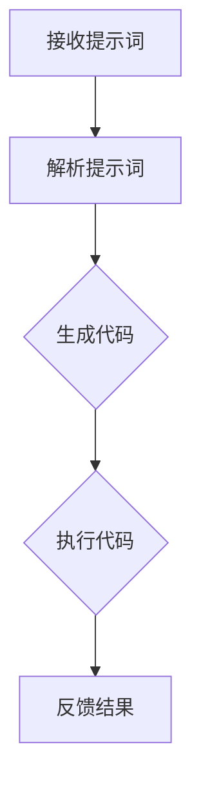

                 

### 文章标题

《提示词编程的教育与培训体系》

### 关键词

提示词编程、教育与培训体系、编程教育、教学策略、课程设计、教学评价、技术工具、伪代码、数学模型、实践案例、持续改进

### 摘要

本文旨在探讨提示词编程的教育与培训体系，详细阐述其核心概念、教学策略、课程设计、教学评价和技术工具等方面的内容。文章通过逐步分析提示词编程的背景与重要性，构建了一个全面且系统的教育与培训体系框架，为编程教育提供了新的视角和思路。文章不仅涵盖了理论讲解，还提供了丰富的实践案例和最佳实践，旨在提升读者对提示词编程教育体系的理解和应用能力。通过本文的阅读，读者将能够全面掌握提示词编程的教育与培训体系，为编程教育实践提供有力的指导。### 引言

#### 提示词编程的基本概念

提示词编程（Prompt-Based Programming），是一种基于自然语言处理（NLP）技术的编程模式，它通过预定义的提示词（prompts）来引导和辅助程序的开发。提示词通常是一段文本，用来提示程序员执行特定的任务或实现特定的功能。这种模式的核心在于将复杂、抽象的编程任务转化为一系列直观、具体的操作步骤，从而降低编程的难度和复杂度。

提示词编程不仅适用于编程初学者，还能帮助经验丰富的程序员提高工作效率。例如，在开发大型系统时，通过提示词可以快速定位关键功能模块，进行优化和改进。此外，提示词编程还能够促进跨学科合作，因为非计算机专业的团队成员也能够通过提示词理解并参与编程工作。

#### 教育与培训体系的重要性

提示词编程的教育与培训体系在编程教育中具有重要的地位。首先，它能够帮助教育者设计出更加符合学生认知特点的教学方法，提高教学效果。传统的编程教学往往注重理论知识的灌输，而提示词编程则更强调实践操作和问题解决能力的培养。

其次，提示词编程的教育与培训体系能够满足不同层次学生的需求。无论是编程初学者，还是有一定编程基础的学生，都可以通过提示词编程找到适合自己的学习路径。这种灵活、个性化的教学模式有助于提高学生的学习兴趣和参与度，从而提升整体教育质量。

此外，提示词编程的教育与培训体系还能够为培训企业提供有效的技能提升方案。通过系统的培训课程，企业员工可以快速掌握提示词编程的方法，提高编程效率，降低开发成本。

总之，构建一个完善的提示词编程教育与培训体系，不仅能够提升编程教育质量，还能够推动编程技术的普及和应用，为我国软件产业的发展提供有力支持。接下来，本文将详细探讨提示词编程的教育与培训体系，包括其核心内容、教学策略、课程设计、教学评价和技术工具等方面。通过逐步分析，我们将构建一个系统、完整的提示词编程教育与培训体系框架，为编程教育实践提供有力指导。### 提示词编程的基础理论

#### 提示词的定义

提示词（Prompt）是提示词编程的核心概念，它通常是一段文本，用来引导程序员执行特定的任务或实现特定的功能。提示词可以是简单的一句话，也可以是复杂的句子或段落。其基本结构通常包括以下要素：

1. **动作指令**：提示词中通常会包含一个动作指令，指示程序应执行的操作。例如，“创建一个数据库连接”，“绘制一个正方形”等。

2. **参数**：动作指令通常会附带参数，用于提供额外的信息或上下文。例如，“在屏幕中心绘制一个边长为100的正方形”。

3. **上下文**：提示词还会包含一定的上下文信息，帮助程序员理解任务背景和目标。例如，“在一个Web应用程序中实现用户登录功能”。

根据提示词的形式和用途，可以将提示词分为以下几种类型：

1. **命令式提示词**：这种提示词直接指示程序执行某个动作，通常用于实现具体的功能。例如，“执行数据库查询”。

2. **问题式提示词**：这种提示词以问题的形式出现，要求程序员提供解决方案。例如，“如何实现一个简单的排序算法？”

3. **故事式提示词**：这种提示词通过故事情节来引导程序员完成任务，通常用于教学和训练。例如，“在一个游戏中，你需要编写代码控制角色移动和攻击”。

#### 提示词编程的基本流程

提示词编程的基本流程包括以下几个步骤：

1. **接收提示词**：程序首先接收用户输入的提示词，可以是文本框输入、语音输入或其他形式。

2. **解析提示词**：程序对输入的提示词进行解析，提取出动作指令、参数和上下文信息。这一过程通常需要使用自然语言处理技术，如词法分析、语法分析等。

3. **生成代码**：根据解析结果，程序生成相应的代码。这可以是一个简单的函数、一个复杂的模块，或者是一系列指令。

4. **执行代码**：程序执行生成的代码，完成用户指定的任务。

5. **反馈结果**：程序将执行结果反馈给用户，可以是屏幕输出、文件保存或其他形式。

#### 提示词编程的优点

提示词编程具有以下优点：

1. **简化编程过程**：通过提示词，程序员可以更快速地实现目标，减少手动编写代码的工作量。

2. **降低编程难度**：提示词编程将复杂的编程任务分解为一系列简单、直观的步骤，降低了编程的难度。

3. **提高编程效率**：提示词编程能够提高程序员的编程效率，减少调试时间。

4. **促进跨学科合作**：非计算机专业的团队成员也可以通过提示词参与编程工作，促进跨学科合作。

5. **增强用户体验**：提示词编程可以更好地满足用户需求，提供更个性化的服务。

#### 提示词编程的应用场景

提示词编程广泛应用于以下场景：

1. **编程教育**：提示词编程是编程教育的有力工具，可以帮助初学者快速掌握编程基础。

2. **自动化脚本开发**：提示词编程可以用于自动化脚本开发，提高工作流程的效率。

3. **自然语言处理**：提示词编程可以用于自然语言处理任务，如文本分类、情感分析等。

4. **人机交互**：提示词编程可以用于设计智能人机交互系统，如语音助手、聊天机器人等。

5. **软件开发**：提示词编程可以用于软件开发中的原型设计和功能实现。

#### 核心概念之间的关系架构

为了更好地理解提示词编程的核心概念，我们使用Mermaid流程图来展示它们之间的关系：



在这个流程图中，A表示程序接收用户输入的提示词，B表示对提示词进行解析，C表示生成代码，D表示执行代码，E表示反馈结果。这个流程图清晰地展示了提示词编程的基本流程和核心概念之间的关系。

#### 核心算法原理讲解

为了深入理解提示词编程的核心算法原理，我们将使用伪代码来详细阐述提示词的解析和处理过程：

```pseudo
function processPrompt(prompt)
    // 初始化变量
    action = ""
    parameters = []
    context = ""

    // 分词，提取出动作指令、参数和上下文
    words = tokenize(prompt)
    for word in words
        if word is a verb
            action = word
        else if word is a noun or adjective
            parameters.append(word)
        else
            context.append(word)

    // 解析参数
    for parameter in parameters
        if parameter is a number
            parameter = convertToNumber(parameter)
        else if parameter is a date or time
            parameter = convertToDate(parameter)

    // 生成代码
    code = generateCode(action, parameters, context)
    return code
end function
```

在这个伪代码中，`processPrompt` 函数接收一个提示词，然后通过分词和分类提取出动作指令、参数和上下文。接下来，对参数进行类型转换，最后生成相应的代码。

#### 数学模型和公式

在提示词编程中，我们常常需要处理时间和日期等参数。以下是一个简单的数学模型，用于将文本形式的日期转换为日期对象：

```latex
\newfunction{DateConversion}{2}{\date{dateString}}
{
    dateString = input string representing a date
    dateParts = tokenize(dateString, "-")
    if length(dateParts) == 3
        year = convertToNumber(dateParts[0])
        month = convertToNumber(dateParts[1])
        day = convertToNumber(dateParts[2])
        if isValidDate(year, month, day)
            return createDateObject(year, month, day)
        else
            return null
    else
        return null
}
```

在这个LaTeX函数中，`DateConversion`函数接收一个表示日期的字符串，将其拆分为年、月、日三个部分，然后检查是否是有效的日期。如果是，则创建日期对象并返回；否则，返回null。

#### 举例说明

为了更好地理解提示词编程的核心概念和算法原理，我们来看一个简单的例子：

**例子**：编写一个提示词编程脚本，实现以下功能：

- 动作指令：绘制一个边长为100的正方形
- 参数：边长=100
- 上下文：在屏幕中心绘制

**步骤**：

1. 接收提示词：“绘制一个边长为100的正方形，在屏幕中心绘制”。

2. 解析提示词，提取出动作指令（“绘制正方形”）、参数（边长=100）和上下文（“在屏幕中心”）。

3. 生成代码：
   ```pseudo
   function drawSquare(centerX, centerY, size)
       context = createGraphicsContext()
       context.moveTo(centerX - size/2, centerY - size/2)
       context.lineTo(centerX + size/2, centerY - size/2)
       context.lineTo(centerX + size/2, centerY + size/2)
       context.lineTo(centerX - size/2, centerY + size/2)
       context.stroke()
   end function
   ```

4. 执行代码，绘制边长为100的正方形。

5. 反馈结果：在屏幕中心成功绘制了一个边长为100的正方形。

通过这个例子，我们可以看到提示词编程是如何通过一系列步骤将一个复杂的任务分解为简单的操作，从而实现高效的编程开发。接下来，本文将深入探讨提示词编程的教学策略，以帮助教育者更好地设计教学内容和教学过程。### 提示词编程的教学策略

#### 教学目标设定

教学目标是教育过程中预期的学习成果，是教学设计和实施的出发点和归宿。在设定教学目标时，教育者需要明确以下几方面：

1. **知识目标**：学生应掌握的核心知识，如编程语言的基本语法、数据结构、算法原理等。
2. **能力目标**：学生应具备的能力，如编程实践能力、问题解决能力、团队合作能力等。
3. **情感目标**：学生应培养的情感态度，如学习兴趣、自主学习意识、创新精神等。

为了确保教学目标的科学性和可操作性，教育者可以采用以下策略：

- **明确具体性**：教学目标应具体、明确，避免模糊不清。例如，“学会使用Python编程语言”不如“能够使用Python编写简单的计算程序”具体。
- **层次性**：教学目标应层次分明，从基础到高级，形成一个完整的体系。例如，初级目标可以是“理解变量和函数的基本概念”，高级目标可以是“能够运用算法设计复杂的功能模块”。
- **可衡量性**：教学目标应具备可衡量性，以便对教学效果进行评估。例如，可以通过编程作业、项目展示等方式评估学生的知识掌握情况。

#### 教学方法与实践

在提示词编程的教学过程中，教育者可以采用多种教学方法，以激发学生的学习兴趣和主动性。以下是一些常用的教学方法：

1. **互动式教学**：互动式教学通过师生互动和学生互动，提高学生的参与度和学习效果。例如，教师可以通过提问、讨论、小组合作等方式引导学生思考问题、解决问题。

2. **案例教学**：案例教学通过实际案例的讲解和分析，帮助学生理解抽象的概念和原理。例如，教师可以选取经典的编程案例，分析其代码实现和算法原理，引导学生从中学习。

3. **项目式教学**：项目式教学通过让学生参与实际项目，培养其解决问题的能力和团队合作精神。例如，教师可以设计一个编程项目，要求学生分工合作，共同完成项目的开发。

4. **探究式教学**：探究式教学鼓励学生主动探究、发现知识。例如，教师可以提出一个问题，让学生通过查阅资料、讨论、实验等方式寻找答案。

#### 互动式教学

互动式教学是提示词编程教学中的一种有效方法。它强调在教学过程中充分调动学生的主动性和积极性，通过师生互动和学生互动，提高教学效果。以下是互动式教学的几个关键点：

1. **营造轻松氛围**：教师应创造一个轻松、民主的教学氛围，让学生敢于提问、发表意见。例如，教师可以使用幽默的语言、生动的案例，激发学生的学习兴趣。

2. **设置问题情境**：教师可以通过设置问题情境，引导学生主动思考和解决问题。例如，教师可以提出一个编程问题，让学生尝试解决，并鼓励他们互相讨论、交流。

3. **及时反馈**：教师应及时给予学生反馈，帮助学生了解自己的学习情况，发现并纠正错误。例如，教师可以在课堂上进行实时点评，表扬做得好的学生，指导做得不够好的学生。

4. **分组合作**：教师可以组织学生进行小组合作，共同完成任务。这有助于培养学生的团队合作能力和沟通能力。例如，教师可以设计一个编程项目，让学生分组完成，每组负责不同的模块。

5. **应用现代技术**：教师可以利用现代信息技术，如在线教学平台、编程工具等，提高互动教学的效率。例如，教师可以在教学平台上发布教学资源，学生可以通过平台进行编程练习和讨论。

#### 案例教学

案例教学是提示词编程教学中的重要方法，通过实际案例的讲解和分析，帮助学生理解抽象的概念和原理。以下是案例教学的几个关键点：

1. **选择典型案例**：教师应选择具有代表性、典型性的案例，以便学生能够通过案例理解相关概念和原理。例如，对于初学者，可以选择一些简单的编程案例，如计算器、猜数字游戏等。

2. **分析案例代码**：教师应对案例代码进行详细分析，讲解其实现原理和关键技术。例如，教师可以逐步拆解案例代码，解释变量、函数、循环等基本概念，以及它们在程序中的作用。

3. **引导学生实践**：教师应鼓励学生动手实践，通过编写代码来加深对案例的理解。例如，教师可以布置编程作业，要求学生模仿案例代码，实现类似的功能。

4. **讨论与反馈**：教师可以组织学生进行案例讨论，分享自己的理解和心得。这有助于培养学生的思考能力和表达能力。例如，教师可以在课堂上组织小组讨论，让学生互相分享案例实现的经验和技巧。

5. **拓展应用**：教师应引导学生将所学知识应用于实际问题，提高其解决问题的能力。例如，教师可以设计一些拓展性的编程任务，让学生在完成基本功能的基础上，增加新的功能或进行优化。

通过互动式教学和案例教学，提示词编程教学可以更加生动、有趣，有助于提高学生的编程技能和问题解决能力。接下来，本文将探讨提示词编程的课程设计，以帮助教育者更好地组织教学内容和教学活动。### 课程设计与开发

#### 课程设计原则

课程设计是教育过程中至关重要的一环，它决定了教学内容的组织结构和教学目标的有效实现。在提示词编程课程设计中，需要遵循以下原则：

1. **目标导向**：课程设计应以教学目标为导向，确保每一部分内容都服务于教学目标的实现。例如，如果教学目标是让学生掌握基本编程技能，课程设计应围绕这一目标，精选合适的教学内容和方法。

2. **层次性**：课程设计应具有层次性，从基础到高级，形成一个完整的知识体系。初学者可以从简单的概念和操作开始，逐步过渡到复杂的算法和编程实践。

3. **实践性**：课程设计应注重实践，通过实际操作和项目实践，帮助学生巩固理论知识，提高编程能力。例如，可以设计一些简单的编程练习和项目，让学生在动手实践中掌握技能。

4. **灵活性**：课程设计应具有一定的灵活性，以适应不同层次和需求的学生。例如，可以设置不同的学习路径，让学生根据自己的兴趣和基础选择合适的课程内容。

5. **互动性**：课程设计应鼓励师生互动和学生互动，提高学生的学习积极性和参与度。例如，可以通过课堂讨论、小组合作、在线教学平台等方式，增加学生与教师、同学之间的交流。

6. **反馈机制**：课程设计应建立有效的反馈机制，及时收集学生的学习反馈，调整和优化教学内容和方法。例如，可以通过课后作业、项目评审、在线问卷调查等方式，了解学生的学习效果和需求。

#### 课程内容组织

在提示词编程课程中，内容组织应遵循以下原则：

1. **基础知识**：包括编程语言的基本语法、变量、数据类型、控制结构、函数等基本概念。

2. **算法原理**：介绍常用的算法原理，如排序、查找、图算法等，帮助学生理解算法的基本思想和实现方法。

3. **数据结构与设计模式**：介绍基本的数据结构，如数组、链表、栈、队列、树、图等，以及常用的设计模式，如工厂模式、单例模式、装饰器模式等。

4. **项目实践**：设计实际项目，让学生通过项目实践，综合运用所学知识，解决实际问题。例如，可以设计一个简单的Web应用、移动应用或游戏开发项目。

5. **拓展内容**：根据学生的兴趣和需求，提供一些拓展性的内容，如人工智能、机器学习、区块链等前沿技术。

#### 课程内容组织的步骤

课程内容组织可以按照以下步骤进行：

1. **需求分析**：了解学生的背景、需求和学习目标，确定课程的核心内容和拓展内容。

2. **知识结构设计**：根据需求分析，设计课程的层次结构和知识体系，明确每个模块的教学目标。

3. **内容细化**：对每个模块进行细化，确定具体的教学内容、教学方法、教学资源等。

4. **编写教学大纲**：将细化后的教学内容和教学资源整合成教学大纲，明确课程的教学目标、教学内容、教学方法和评估方式。

5. **课程评审**：组织课程评审，听取专家、同行和学生的意见和建议，对课程进行优化和调整。

6. **课程实施**：按照教学大纲实施课程，包括课堂讲授、实验实践、项目开发等。

7. **反馈与改进**：收集学生的学习反馈，对课程进行持续改进，提高教学质量。

#### 教学资源开发

教学资源开发是课程设计的重要组成部分，它包括教材、课件、实验手册、在线课程等。以下是教学资源开发的要点：

1. **教材编写**：教材应具备系统性、科学性和实用性，能够帮助学生系统地掌握提示词编程的知识和技能。教材可以包括教材、参考书、习题集等。

2. **课件制作**：课件应设计生动、直观，能够吸引学生的注意力，提高教学效果。课件可以包括PPT、视频、动画等。

3. **实验手册编写**：实验手册应详细描述实验目的、实验步骤、实验数据分析和实验报告模板等，帮助学生顺利完成实验。

4. **在线课程开发**：利用在线教学平台，开发丰富的在线课程资源，包括视频讲座、编程练习、项目案例等，方便学生随时随地进行学习。

5. **教学资源整合**：将各类教学资源进行整合，形成一套完整的教学资源体系，提高教学资源的利用效率。

#### 教学计划制定

教学计划是课程实施的重要依据，它规定了课程的教学内容、教学方法、教学资源和教学进度等。以下是教学计划制定的步骤：

1. **确定教学目标**：明确课程的教学目标，包括知识目标、能力目标和情感目标。

2. **分解教学任务**：根据教学目标，将课程内容分解为具体的任务，确定每个任务的教学内容、教学方法和教学资源。

3. **编排教学进度**：根据教学任务，编排教学进度，明确每个教学阶段的教学内容和教学时间。

4. **制定评估方案**：设计评估方案，包括课堂测验、实验报告、项目评审等，以评估学生的学习效果。

5. **课程实施**：按照教学计划实施课程，包括课堂讲授、实验实践、项目开发等。

6. **反馈与调整**：收集学生的学习反馈，对教学计划进行评估和调整，提高教学质量。

#### 课程设计的示例

以下是一个示例课程设计，用于介绍提示词编程的基本概念和应用：

**课程名称**：提示词编程基础

**课程目标**：
- 了解提示词编程的基本概念。
- 掌握提示词的解析和处理方法。
- 能够编写简单的提示词编程脚本。

**课程内容**：
1. **提示词编程概述**
   - 提示词编程的定义和重要性
   - 提示词编程的应用场景

2. **基本概念**
   - 提示词的构成要素
   - 提示词的类型

3. **基本流程**
   - 提示词的解析和处理
   - 提示词编程的基本流程

4. **实践应用**
   - 编写简单的提示词编程脚本
   - 实现基本的编程功能

**教学方法**：
- 互动式教学：通过提问、讨论、案例分析等方式，引导学生思考和解决问题。
- 案例教学：通过实际案例的讲解和分析，帮助学生理解抽象的概念和原理。
- 实践教学：通过编写代码和实践项目，帮助学生巩固理论知识，提高编程能力。

**教学资源**：
- 教材：《提示词编程基础》
- 课件：PPT、视频、动画等
- 在线资源：编程练习、项目案例等

**教学计划**：
1. **第1周**：介绍提示词编程的基本概念和应用场景。
2. **第2周**：讲解提示词的构成要素和类型。
3. **第3周**：解析和处理提示词的基本流程。
4. **第4周**：编写简单的提示词编程脚本，实现基本编程功能。

通过以上课程设计，学生可以系统地学习提示词编程的基本知识和技能，为后续的高级课程打下坚实基础。接下来，本文将探讨提示词编程的教学评价与反馈机制，以帮助教育者更好地评估教学效果和改进教学策略。### 教学评价与反馈机制

#### 教学评价方法

教学评价是确保教学质量的重要环节，通过科学、有效的评价方法，可以全面了解学生的学习情况，发现教学中的问题和不足，进而改进教学策略。在提示词编程的教学评价中，可以采用以下几种方法：

1. **形成性评价**：形成性评价是在教学过程中进行的，旨在及时了解学生的学习进度和问题，以便教师调整教学策略。例如，教师可以通过课堂提问、作业反馈、小组讨论等方式，实时评估学生的学习效果，及时给予指导。

2. **总结性评价**：总结性评价是在教学结束后进行的，主要用于评估学生的学习成果和教学效果。例如，教师可以通过期末考试、项目报告、编程竞赛等方式，全面评估学生的知识掌握情况和技能水平。

3. **过程性评价**：过程性评价注重评估学生在学习过程中的表现，如参与度、主动性、问题解决能力等。例如，教师可以通过学习日志、实验报告、课堂表现等，记录学生的学习过程，为总结性评价提供依据。

4. **自我评价**：自我评价是指学生对自己学习过程和成果进行评估，有助于培养学生的自我反思能力和自主学习意识。例如，学生可以通过自我评估表、反思日志等方式，记录自己的学习进展和问题，制定改进计划。

5. **同行评价**：同行评价是指学生之间的相互评价，有助于提高学生的沟通能力和团队合作能力。例如，学生可以通过项目评审、小组讨论等方式，相互评价项目成果和表现。

#### 教学反馈机制

教学反馈是教学评价的重要环节，通过有效的反馈机制，可以及时了解学生的学习状况，指导教师改进教学方法和策略，提高教学效果。以下是教学反馈机制的几个关键点：

1. **及时性**：教学反馈应具有及时性，确保教师在教学过程中能够及时了解学生的掌握情况，及时调整教学策略。例如，教师可以在课堂上通过提问、讨论等方式，及时获取学生的反馈。

2. **针对性**：教学反馈应具有针对性，针对不同学生的学习情况和问题，提供具体的指导和建议。例如，对于学习困难的学生，教师可以提供额外的辅导和资源；对于表现优秀的学生，教师可以给予表扬和鼓励。

3. **多样性**：教学反馈应具有多样性，通过不同的方式获取和传递反馈信息。例如，教师可以通过口头反馈、书面反馈、在线反馈等方式，与学生进行交流，了解学生的学习需求和困惑。

4. **互动性**：教学反馈应具有互动性，鼓励学生积极参与，提出自己的观点和建议。例如，教师可以组织学生进行课堂讨论、小组讨论等，让学生在交流中互相学习、共同进步。

5. **持续改进**：教学反馈应促进持续改进，教师应根据学生的反馈，不断调整和优化教学策略，提高教学质量。例如，教师可以定期评估教学效果，总结经验教训，为下一阶段的教学做好准备。

#### 教学反馈的实施策略

为了确保教学反馈的有效实施，教师可以采取以下策略：

1. **建立反馈渠道**：教师应建立多种反馈渠道，如课堂反馈、在线反馈、邮件反馈等，方便学生随时随地向教师提出问题和建议。

2. **定期收集反馈**：教师应定期收集学生的反馈，如每学期、每学期的课程结束后，可以通过问卷调查、访谈等方式，了解学生的学习体验和需求。

3. **及时回复反馈**：教师应及时回复学生的反馈，如对于学生提出的问题和建议，教师应在24小时内给予回复，帮助学生解决困惑。

4. **公开反馈结果**：教师可以将反馈结果公开，如在教学总结报告、课程评价表中，公布学生的反馈情况和改进措施，增强教学的透明度。

5. **激励学生反馈**：教师可以激励学生积极反馈，如对提出有建设性意见的学生给予表扬和奖励，提高学生的参与度和积极性。

通过建立科学、有效的教学评价和反馈机制，教师可以更好地了解学生的学习状况，及时调整教学策略，提高教学效果，促进学生的全面发展。接下来，本文将介绍提示词编程中的常用工具和技术，以帮助教育者更好地实施教学和培训。### 提示词编程工具与应用

#### 常用提示词编程工具

在提示词编程中，选择合适的编程工具至关重要。以下是一些常用的提示词编程工具：

1. **Python**：Python是一种高级编程语言，因其简洁易懂的语法和强大的标准库而广受欢迎。Python支持多种编程范式，包括命令式、面向对象和函数式编程，非常适合用于提示词编程。

2. **JavaScript**：JavaScript是一种广泛使用的脚本语言，主要用于Web开发。它具有灵活性和可扩展性，可以通过Node.js运行在服务器端。JavaScript的强大生态系统和丰富的库资源使其成为提示词编程的理想选择。

3. **Rust**：Rust是一种系统编程语言，以其安全性和高性能而著称。它具有内存安全特性，可以有效避免常见的编程错误。Rust适用于需要高性能和系统级的提示词编程任务。

4. **Java**：Java是一种多用途编程语言，广泛应用于企业级应用和Android移动应用开发。Java具有稳定性和跨平台性，适用于大型项目和高性能提示词编程。

5. **Swift**：Swift是一种由苹果公司开发的编程语言，主要用于iOS和macOS应用开发。Swift简洁易学，同时提供了丰富的库和框架，适用于提示词编程和相关应用开发。

6. **Prolog**：Prolog是一种逻辑编程语言，以其基于逻辑的编程范式而著称。Prolog适用于需要处理复杂逻辑和规则的提示词编程任务。

7. **Erlang**：Erlang是一种用于并发和分布式系统的编程语言，以其高并发性和可靠性而闻名。Erlang适用于需要处理大规模分布式任务的提示词编程。

#### 编程工具的选择标准

选择合适的编程工具应考虑以下标准：

1. **易用性**：编程工具应易于学习和使用，降低编程门槛，提高开发效率。

2. **功能丰富性**：编程工具应具备丰富的功能，支持多种编程范式和开发需求。

3. **生态系统**：编程工具应拥有强大的生态系统，包括丰富的库、框架和工具，方便开发者快速开发。

4. **性能**：编程工具应具备良好的性能，特别是在处理大规模数据和复杂任务时。

5. **兼容性**：编程工具应具有良好的兼容性，支持跨平台开发和部署。

6. **社区支持**：编程工具应有活跃的社区支持，提供丰富的学习资源和解决方案。

#### 编程工具的使用技巧

为了提高编程效率和开发质量，以下是编程工具的一些使用技巧：

1. **版本控制**：使用版本控制系统（如Git）管理代码，确保代码的版本和变更可追溯，便于团队合作和代码管理。

2. **代码规范**：遵循统一的代码规范，提高代码的可读性和可维护性。

3. **自动化测试**：编写自动化测试用例，确保代码的正确性和稳定性。

4. **代码重构**：定期进行代码重构，优化代码结构，提高代码质量。

5. **持续集成**：采用持续集成（CI）工具（如Jenkins、Travis CI），自动化构建和测试代码，提高开发效率。

6. **版本管理**：使用版本管理工具（如Maven、Gradle），自动化依赖管理和构建过程。

7. **文档生成**：生成文档（如使用Doxygen），方便代码理解和维护。

8. **代码审查**：进行代码审查，确保代码质量和安全性。

9. **性能优化**：对关键代码进行性能优化，提高程序运行效率。

10. **虚拟环境**：使用虚拟环境（如Docker、Vagrant），隔离开发环境和生产环境，确保代码在不同环境的一致性。

#### 提示词编程应用案例

以下是一个简单的提示词编程应用案例，用于实现一个基于Python的文本分类系统：

**需求**：编写一个程序，根据输入的文本，将其分类到预定义的类别中。

**步骤**：

1. **数据预处理**：准备训练数据和测试数据，对文本进行分词、去除停用词等预处理操作。

2. **特征提取**：将预处理后的文本转换为特征向量，可以使用词袋模型、TF-IDF等方法。

3. **模型训练**：使用训练数据训练一个分类模型，如支持向量机（SVM）、朴素贝叶斯（NB）等。

4. **模型评估**：使用测试数据评估模型性能，计算准确率、召回率等指标。

5. **模型应用**：使用训练好的模型对新的文本进行分类，输出分类结果。

**伪代码**：

```python
import nltk
from sklearn.feature_extraction.text import TfidfVectorizer
from sklearn.model_selection import train_test_split
from sklearn.naive_bayes import MultinomialNB

# 数据预处理
def preprocess_text(text):
    # 分词、去除停用词等操作
    pass

# 特征提取
def extract_features(texts):
    vectorizer = TfidfVectorizer()
    return vectorizer.fit_transform(texts)

# 模型训练
def train_model(X_train, y_train):
    model = MultinomialNB()
    model.fit(X_train, y_train)
    return model

# 模型评估
def evaluate_model(model, X_test, y_test):
    predictions = model.predict(X_test)
    accuracy = (predictions == y_test).mean()
    return accuracy

# 模型应用
def classify_text(model, vectorizer, text):
    processed_text = preprocess_text(text)
    features = vectorizer.transform([processed_text])
    prediction = model.predict(features)
    return prediction

# 示例
if __name__ == "__main__":
    # 加载数据
    texts = ["这是一段文本", "这是另一段文本", ...]
    labels = ["类别1", "类别2", ...]

    # 数据预处理
    preprocessed_texts = [preprocess_text(text) for text in texts]

    # 特征提取
    features = extract_features(preprocessed_texts)

    # 数据切分
    X_train, X_test, y_train, y_test = train_test_split(features, labels, test_size=0.2)

    # 模型训练
    model = train_model(X_train, y_train)

    # 模型评估
    accuracy = evaluate_model(model, X_test, y_test)
    print(f"模型准确率：{accuracy}")

    # 模型应用
    new_text = "这是一段新文本"
    prediction = classify_text(model, vectorizer, new_text)
    print(f"分类结果：{prediction}")
```

在这个案例中，我们首先对文本进行预处理，然后使用TF-IDF方法提取特征，接着训练一个朴素贝叶斯分类器。最后，我们将训练好的模型应用于新的文本，输出分类结果。

通过这个案例，我们可以看到提示词编程如何将复杂的文本分类任务分解为一系列简单、直观的步骤。接下来，本文将探讨提示词编程在自然语言处理中的应用，以及如何利用这些工具和技术进行实际项目开发。### 提示词编程的实际应用

#### 提示词编程在自然语言处理中的应用

提示词编程在自然语言处理（NLP）领域有着广泛的应用，尤其在文本分类、情感分析和命名实体识别等方面。以下是一些具体的应用案例：

1. **文本分类**：文本分类是将文本数据根据其内容分类到预定义的类别中。提示词编程可以帮助实现这一过程。例如，我们可以使用提示词来定义分类模型，如朴素贝叶斯、支持向量机等，然后将文本数据输入模型，输出分类结果。以下是一个简单的文本分类示例：

```python
from sklearn.feature_extraction.text import TfidfVectorizer
from sklearn.naive_bayes import MultinomialNB

# 示例文本数据
texts = ["这是一篇科技文章", "这篇文章讨论了经济问题", ...]
labels = ["科技", "经济", ...]

# 数据预处理和特征提取
vectorizer = TfidfVectorizer()
X = vectorizer.fit_transform(texts)

# 训练分类模型
model = MultinomialNB()
model.fit(X, labels)

# 测试文本
test_texts = ["这篇文章讨论了人工智能应用"]
X_test = vectorizer.transform(test_texts)

# 输出分类结果
predictions = model.predict(X_test)
print(predictions)
```

2. **情感分析**：情感分析是判断文本表达的情感倾向，如正面、负面或中性。提示词编程可以通过构建情感分析模型来实现。例如，我们可以使用朴素贝叶斯、长短期记忆（LSTM）等模型来预测文本的情感。以下是一个简单的情感分析示例：

```python
from sklearn.feature_extraction.text import TfidfVectorizer
from sklearn.naive_bayes import MultinomialNB

# 示例文本数据
texts = ["我很喜欢这个产品", "这个产品太糟糕了", ...]
labels = ["正面", "负面", ...]

# 数据预处理和特征提取
vectorizer = TfidfVectorizer()
X = vectorizer.fit_transform(texts)

# 训练分类模型
model = MultinomialNB()
model.fit(X, labels)

# 测试文本
test_texts = ["这个产品非常好用"]
X_test = vectorizer.transform(test_texts)

# 输出情感分析结果
predictions = model.predict(X_test)
print(predictions)
```

3. **命名实体识别**：命名实体识别是识别文本中的特定实体，如人名、地名、组织名等。提示词编程可以通过构建命名实体识别模型来实现。例如，我们可以使用条件随机场（CRF）模型来识别文本中的命名实体。以下是一个简单的命名实体识别示例：

```python
import numpy as np
from sklearn_crfsuite import CRF

# 示例文本数据
X = np.array([
    ["张三", "北京", "科技有限公司"],
    ["李四", "上海", "科技有限公司"],
    ...
])

y = np.array([
    ["人名", "地名", "组织名"],
    ["人名", "地名", "组织名"],
    ...
])

# 训练CRF模型
crf = CRF()
crf.fit(X, y)

# 预测命名实体
X_test = np.array([["王五", "上海", "科技有限公司"]])
predictions = crf.predict(X_test)
print(predictions)
```

#### 实际项目开发

提示词编程在项目开发中具有重要的应用价值，可以帮助开发者提高工作效率，简化开发流程。以下是一个简单的项目开发案例，用于构建一个基于Web的在线问答系统：

1. **需求分析**：分析用户需求，确定系统的功能模块，如用户注册、登录、提问、回答、搜索等。

2. **系统设计**：设计系统的整体架构，包括前端界面、后端服务器、数据库等。

3. **功能实现**：
   - 用户注册与登录：使用提示词编程实现用户注册、登录功能，如用户输入用户名和密码，系统验证用户身份。
   - 提问与回答：使用提示词编程实现提问、回答功能，如用户输入问题，系统根据问题内容和答案库自动匹配答案。
   - 搜索：使用提示词编程实现搜索功能，如用户输入关键词，系统根据关键词搜索相关问题和答案。

4. **界面设计**：设计简洁、直观的用户界面，提高用户体验。

5. **测试与部署**：进行系统测试，确保功能正常运行，然后部署到服务器，供用户使用。

6. **持续优化**：根据用户反馈和系统运行情况，持续优化系统功能和性能。

通过提示词编程，开发者可以快速实现项目的核心功能，提高开发效率，降低开发成本。接下来，本文将探讨提示词编程在教育与培训体系中的持续改进，以帮助教育者不断提升教学质量。### 教育与培训体系的持续改进

#### 持续改进的必要性

提示词编程的教育与培训体系是一个动态发展的过程，随着技术的进步、市场需求的变化以及教育理念的创新，教育与培训体系需要不断进行调整和优化，以保持其相关性和有效性。以下是持续改进的必要性：

1. **技术更新**：编程语言和技术工具不断更新，教育体系需要不断引入最新的技术，以保持教学内容的前沿性。

2. **市场需求**：随着市场需求的演变，对编程人才的要求也在不断变化，教育体系需要根据市场需求调整课程内容和教学策略。

3. **教育理念**：教育理念也在不断进步，例如，从注重知识传授向注重能力培养转变，教育体系需要不断适应这些变化。

4. **教学效果**：为了提高教学效果，教育体系需要通过持续的评估和反馈，识别问题并进行改进。

#### 教育与培训体系的变化趋势

随着教育技术的发展，提示词编程的教育与培训体系呈现出以下变化趋势：

1. **在线教育与混合学习**：在线教育和混合学习模式的兴起，使得教育不再局限于传统课堂教学，学习者可以灵活选择学习时间和地点。

2. **个性化学习**：通过大数据分析和人工智能技术，教育体系可以实现个性化学习，为不同层次和需求的学习者提供定制化的教学内容。

3. **项目驱动教学**：项目驱动教学强调实践能力的培养，通过实际项目开发，让学生在解决实际问题的过程中学习和掌握技能。

4. **跨学科融合**：跨学科教育的兴起，使得编程教育不再孤立，而是与其他学科如数据科学、人工智能等领域深度融合。

5. **持续职业发展**：教育体系不再局限于课程学习，更强调学习者的终身学习和职业发展。

#### 持续改进的实施策略

为了实现提示词编程教育与培训体系的持续改进，教育者可以采取以下策略：

1. **定期评估**：定期对教学效果进行评估，包括学生反馈、考试成绩、项目成果等，以识别问题和不足。

2. **课程更新**：根据评估结果和市场需求，定期更新课程内容，引入新的技术和方法。

3. **教学研究**：鼓励教师进行教学研究，探索新的教学方法和策略，提高教学质量。

4. **师资培训**：定期对教师进行培训，提高其教学能力和技术水平，以适应教育体系的变化。

5. **资源整合**：整合校内外教学资源，包括在线课程、开放资源、企业合作等，为学生提供丰富的学习资源。

6. **校企合作**：与行业企业合作，引入实际项目和实践经验，提高学生的实践能力和职业素养。

7. **技术支持**：利用大数据分析和人工智能技术，为学生提供个性化的学习建议和资源推荐。

#### 教育与培训体系的案例分析

以下是一个持续改进的教育与培训体系案例分析：

**案例背景**：某高校计算机科学与技术专业在提示词编程教育与培训方面存在以下问题：
- 课程内容过于陈旧，未能及时更新。
- 教学方式单一，缺乏实践环节。
- 师资力量不足，教师缺乏企业实践经验。

**改进措施**：

1. **课程更新**：对课程内容进行全面更新，引入最新的编程语言和技术工具，如Python、JavaScript等。

2. **教学方式**：采用项目驱动教学，增加实践环节，让学生在解决实际问题的过程中学习。

3. **师资培训**：定期组织教师参加企业培训和实践，提高其教学能力和技术水平。

4. **资源整合**：与知名在线教育平台合作，引入优质在线课程和教学资源。

5. **校企合作**：与企业建立合作关系，引入实际项目和实践经验，提高学生的实践能力和职业素养。

6. **技术支持**：利用大数据分析和人工智能技术，为学生提供个性化的学习建议和资源推荐。

**改进效果**：通过持续改进，该专业在提示词编程教育与培训方面取得了显著成果：
- 学生对课程的满意度显著提高。
- 学生实践能力和职业素养得到提升。
- 教师教学能力和技术水平得到提高。
- 专业的市场竞争力得到增强。

通过以上案例，我们可以看到，持续改进是提升教育与培训体系质量和效果的关键。教育者应不断探索和创新，以适应时代的发展和市场需求，为培养高素质的编程人才贡献力量。接下来，本文将总结全文，并给出最佳实践 tips 和注意事项。### 总结

本文《提示词编程的教育与培训体系》详细探讨了提示词编程的核心概念、教学策略、课程设计、教学评价和技术工具等方面的内容。通过逐步分析，我们构建了一个全面且系统的教育与培训体系框架，为编程教育实践提供了有力的指导。

首先，我们介绍了提示词编程的基本概念，包括提示词的定义、基本流程和优点。接着，我们探讨了提示词编程在教育与培训体系中的应用，如文本分类、情感分析和命名实体识别等。随后，我们深入分析了教学策略，包括教学目标设定、互动式教学和案例教学等方法。此外，我们还详细阐述了课程设计与开发的原则、内容和步骤，以及教学评价与反馈机制。

通过本文的阅读，读者可以全面掌握提示词编程的教育与培训体系，了解其核心概念和教学方法，为编程教育实践提供有力支持。

### 最佳实践 tips

1. **理论与实践相结合**：在教学中，注重理论知识的传授，同时通过实际项目和实践，帮助学生巩固和应用所学知识。

2. **个性化学习**：利用大数据和人工智能技术，为不同层次和需求的学生提供个性化学习资源和建议。

3. **定期评估与反馈**：定期对教学效果进行评估，及时获取学生反馈，调整和优化教学内容和方法。

4. **跨学科合作**：鼓励跨学科合作，将编程与其他学科如数据科学、人工智能等领域相结合，提高学生的综合素质。

5. **校企合作**：与行业企业建立合作关系，引入实际项目和实践经验，提高学生的实践能力和职业素养。

### 注意事项

1. **课程内容的更新**：定期更新课程内容，引入最新的技术和方法，确保教学内容的前沿性。

2. **教学资源的整合**：整合校内外教学资源，提高教学资源的利用效率，为学生提供丰富的学习资源。

3. **教师培训**：定期对教师进行培训，提高其教学能力和技术水平，以适应教育体系的变化。

4. **学生参与度**：提高学生的参与度，通过互动式教学和项目驱动教学，激发学生的学习兴趣和主动性。

5. **教学效果的评估**：建立科学、有效的教学评价体系，全面评估学生的知识掌握情况和技能水平。

通过遵循这些最佳实践和注意事项，教育者可以不断提升提示词编程的教育与培训体系的质量和效果，为培养高素质的编程人才贡献力量。最后，本文感谢读者对《提示词编程的教育与培训体系》的关注和阅读，希望本文能为您的编程教育实践提供有益的启示。

### 拓展阅读

1. **《编程入门：从零开始》**：作者：Joshua Bloch
   - 本书适合编程初学者，详细介绍了编程基础和编程思想，有助于理解提示词编程的基本概念。

2. **《深度学习入门：基于Python》**：作者：斋藤康毅
   - 本书介绍了深度学习的基础知识，包括神经网络和深度学习模型，提示词编程在自然语言处理中的应用。

3. **《人工智能：一种现代的方法》**：作者：Stuart Russell & Peter Norvig
   - 本书全面介绍了人工智能的基本概念、技术和应用，包括自然语言处理和机器学习等，有助于深入理解提示词编程。

4. **《代码大全》**：作者：Steve McConnell
   - 本书涵盖了编程的各个方面，包括代码设计、代码质量、代码优化等，对于提升编程技能和编写高质量的代码有很好的指导作用。

5. **《教学之道：如何成为一个优秀的教师》**：作者：Robert J. Marzano
   - 本书介绍了教学方法和策略，对于教育者来说，是提升教学效果的必备读物。

6. **《机器学习实战》**：作者：Peter Harrington
   - 本书通过实际案例，详细介绍了机器学习的基本概念、算法和应用，提示词编程在机器学习中的应用案例。

通过阅读这些拓展资源，读者可以进一步深入了解编程、人工智能和教育的相关理论和实践，为提升自己的编程教育能力提供更多启示。作者：AI天才研究院/AI Genius Institute & 禅与计算机程序设计艺术 /Zen And The Art of Computer Programming

