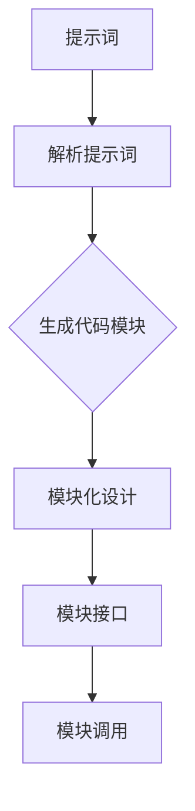
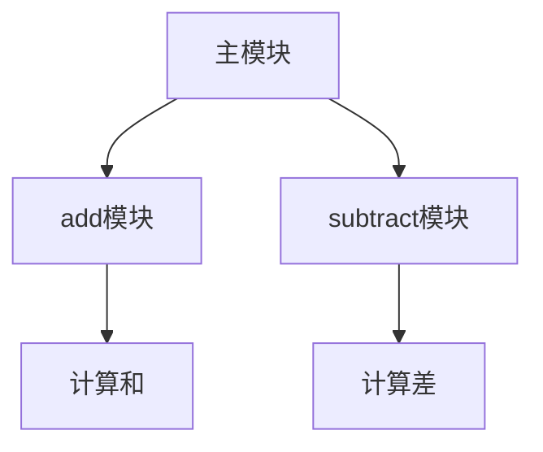
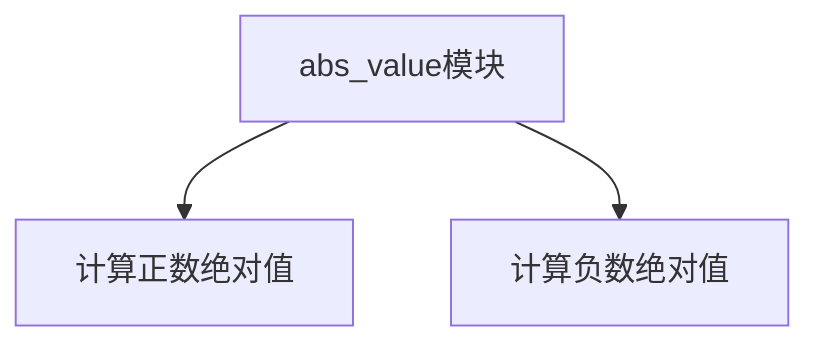
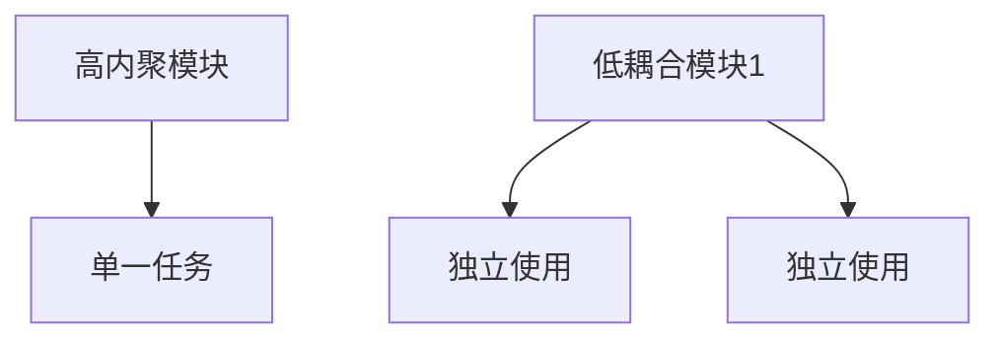
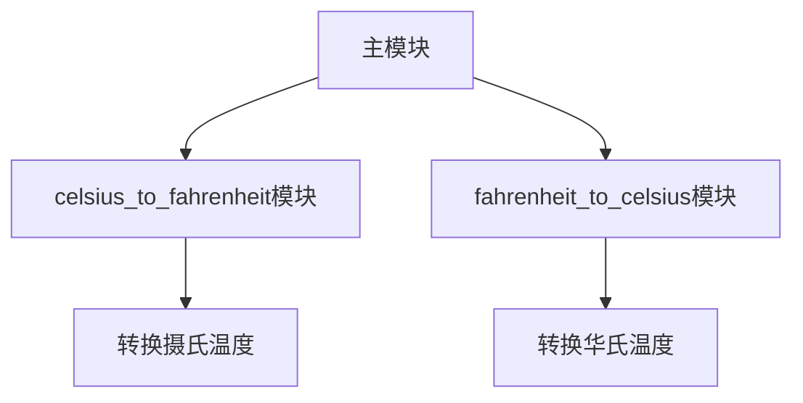
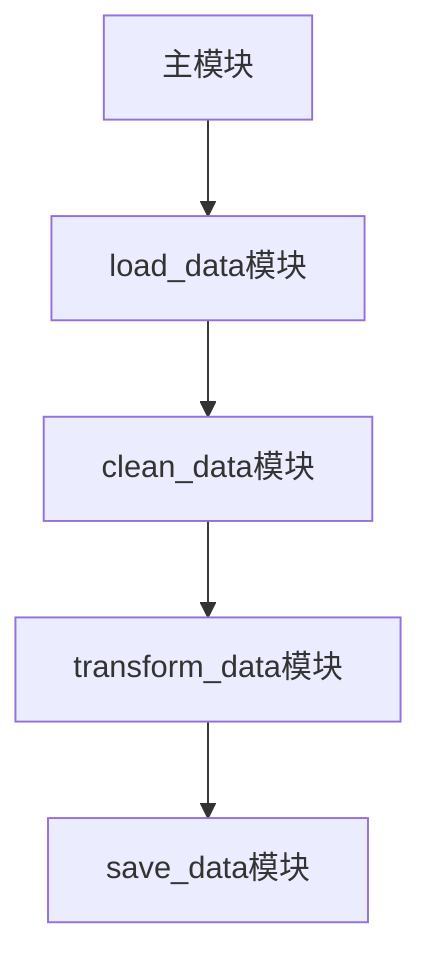
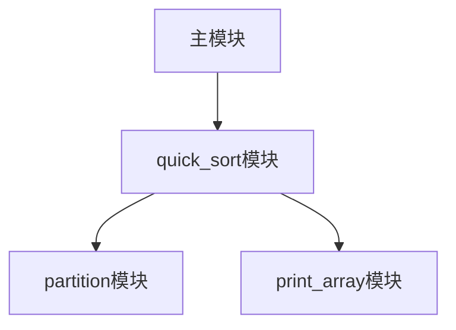

                 


### 引言：提示词编程与模块化设计的背景

提示词编程（Prompt Engineering）是一种利用自然语言处理（NLP）技术和人工智能（AI）技术来生成代码的方法。其核心思想是通过提供一组提示词（prompts），引导AI模型生成符合预期的代码。这种方法不仅能够提高编程效率，还能够减轻开发者编写繁琐代码的负担，特别是在处理复杂的算法和数据结构时。

模块化设计是一种软件设计方法，旨在将复杂的系统分解为更小的、易于管理的模块。这种方法具有以下几个显著优势：首先，模块化可以提高代码的可维护性和可复用性。每个模块都可以独立开发和测试，从而降低了系统整体的复杂度。其次，模块化设计有助于实现代码的重用，减少了重复编写代码的工作量。最后，模块化设计可以增强代码的可扩展性，使得系统在需求变化时能够更加灵活地应对。

在现代软件开发中，模块化设计已经成为一种标准实践。它不仅适用于传统的编程语言，如C++、Java等，还适用于现代的AI编程框架，如TensorFlow、PyTorch等。提示词编程作为一种新兴的编程方法，其与模块化设计的结合，为软件开发带来了新的机遇和挑战。

本文将围绕提示词编程的模块化设计原则展开讨论。具体来说，我们将首先介绍提示词编程的基本概念和模块化设计的原则，然后通过Mermaid流程图和伪代码详细阐述这些原则的应用。接下来，我们将通过具体案例展示如何将模块化设计原则应用于提示词编程，并提供实际代码示例。此外，我们还将探讨一些高级主题，如动态模块加载和模块化测试，以及如何在实际项目中应用这些原则。最后，我们将总结全文内容，强调模块化设计在提示词编程中的重要性。

### 核心概念与联系：提示词、模块、接口

在深入探讨提示词编程的模块化设计原则之前，我们需要明确几个核心概念：提示词（prompts）、模块（modules）和接口（interfaces）。这些概念是提示词编程模块化设计的基础，理解它们之间的关系和功能对于设计高效的代码至关重要。

#### 提示词（prompts）

提示词是触发AI模型生成代码的关键输入。一个有效的提示词应该包含足够的上下文信息，以便AI模型能够理解任务需求并生成相应的代码。提示词通常由自然语言描述组成，可以包含变量名称、数据类型、算法逻辑、功能要求等元素。例如，一个提示词可能如下所示：

```
编写一个函数，接受一个整数列表作为输入，返回列表中所有偶数的和。
```

在这个例子中，“编写一个函数”、“接受一个整数列表作为输入”、“返回列表中所有偶数的和”都是关键信息，指导AI模型生成相应的代码。

#### 模块（modules）

模块是代码的基本构建块，用于实现特定的功能。在提示词编程中，模块通常由AI模型根据提示词生成。模块可以是函数、类或其他编程元素，其设计应遵循模块化原则，如高内聚低耦合。模块化设计使得代码更加模块化和可复用，便于维护和扩展。

例如，在上面的提示词中，可能生成的模块如下：

```python
def sum_of_even_numbers(input_list):
    sum = 0
    for number in input_list:
        if number % 2 == 0:
            sum += number
    return sum
```

这个模块实现了计算整数列表中所有偶数和的功能，可以独立测试和复用。

#### 接口（interfaces）

接口定义了模块与外部系统交互的方式。在提示词编程中，接口可以是函数签名、类方法或模块属性。接口的设计应确保模块之间的解耦，使得模块可以在不同的上下文中被调用和替换。

例如，为了使用上述模块，我们可能需要一个接口：

```python
def process_integer_list(input_list):
    return sum_of_even_numbers(input_list)
```

这个接口接收一个整数列表作为输入，并调用`sum_of_even_numbers`模块来计算偶数和。

#### Mermaid流程图展示

为了更好地理解提示词编程中的核心概念和它们之间的关系，我们可以使用Mermaid流程图来可视化这些概念。以下是一个简单的Mermaid流程图示例，展示了提示词、模块和接口之间的交互：



在这个流程图中：

- `A[提示词]` 表示输入的提示词。
- `B[解析提示词]` 表示AI模型对提示词的解析过程。
- `C[生成代码模块]` 表示根据解析结果生成代码模块。
- `D[模块化设计]` 表示对生成的模块进行模块化设计。
- `E[模块接口]` 表示定义模块的接口。
- `F[模块调用]` 表示模块在实际代码中的调用过程。

通过这个流程图，我们可以清晰地看到提示词编程的核心流程和组件之间的关系。

#### 核心概念的关系与流程

- **提示词**：是模块生成的起点，包含关键信息。
- **模块**：是代码的基本单元，实现特定功能。
- **接口**：定义了模块的交互方式，确保模块的可复用性和灵活性。

通过理解这些核心概念及其相互关系，我们能够更好地设计和实现模块化的提示词编程系统。接下来，我们将进一步探讨模块化设计原则，以深入理解如何将这些概念应用于实际编程。

### 模块化设计原则：模块化、可复用性、高内聚低耦合

模块化设计是软件开发中的一个关键原则，它有助于提高代码的可维护性、可复用性和可扩展性。在提示词编程中，模块化设计同样重要。以下将详细阐述模块化设计中的几个核心原则：模块化、可复用性、高内聚低耦合，并通过伪代码和Mermaid图来具体说明。

#### 模块化（Modularity）

模块化是将复杂系统分解为更小、更易于管理的模块的过程。模块化设计有助于提高代码的可维护性和可复用性。每个模块应该实现一个单一、明确的功能，并且与其他模块之间保持独立性。

**伪代码示例：**

```python
# 模块A：计算两个数的和
def add(a, b):
    return a + b

# 模块B：计算两个数的差
def subtract(a, b):
    return a - b

# 主模块：执行计算任务
def main():
    result_add = add(5, 3)
    result_subtract = subtract(5, 3)
    print("Addition Result:", result_add)
    print("Subtraction Result:", result_subtract)
```

在这个示例中，`add` 和 `subtract` 是两个独立的模块，分别实现加法和减法功能。主模块 `main` 调用这些模块来执行计算任务。

**Mermaid图示例：**



在这个Mermaid图中，主模块 `A` 调用了 `add` 和 `subtract` 模块，这些模块分别执行具体的计算任务。

#### 可复用性（Reusability）

可复用性是指模块可以在多个上下文中被使用，而不会导致代码重复。在设计模块时，应确保它们具有通用性，以便在不同的项目中都能发挥作用。

**伪代码示例：**

```python
# 模块：计算绝对值
def abs_value(n):
    return n if n >= 0 else -n

# 在不同上下文中复用
result_positive = abs_value(-5)
result_negative = abs_value(5)
print("Positive Result:", result_positive)
print("Negative Result:", result_negative)
```

在这个示例中，`abs_value` 模块被多次调用，用于计算不同数的绝对值。

**Mermaid图示例：**



在这个Mermaid图中，`abs_value` 模块被用于计算两个不同数的绝对值。

#### 高内聚低耦合（High Cohesion and Low Coupling）

高内聚低耦合是模块设计的重要原则。高内聚意味着模块内部的功能紧密相关，低耦合则表示模块之间的依赖性较低。高内聚低耦合有助于提高模块的可维护性和可扩展性。

**高内聚：**

高内聚指的是模块内部的功能紧密相关，完成一个单一的任务。例如：

```python
# 高内聚模块：计算圆的面积
def calculate_circle_area(radius):
    return 3.14159 * radius * radius
```

在这个示例中，`calculate_circle_area` 模块仅实现计算圆的面积，内部功能高度相关。

**低耦合：**

低耦合指的是模块之间的依赖性较低。这意味着模块可以独立开发、测试和替换，而不会影响其他模块。例如：

```python
# 低耦合模块：计算矩形面积
def calculate_rectangle_area(length, width):
    return length * width

# 使用不同形状的面积计算模块
rectangle_area = calculate_rectangle_area(5, 3)
circle_area = calculate_circle_area(2)
print("Rectangle Area:", rectangle_area)
print("Circle Area:", circle_area)
```

在这个示例中，`calculate_rectangle_area` 和 `calculate_circle_area` 模块之间的依赖性较低，它们可以独立使用。

**Mermaid图示例：**



在这个Mermaid图中，高内聚模块 `A` 完成一个单一任务，低耦合模块 `C` 和 `E` 可以独立使用。

通过上述示例和说明，我们可以看到模块化、可复用性、高内聚低耦合在提示词编程中的重要性。接下来，我们将通过具体案例展示如何将这些原则应用于实际编程。

### 提示词编程中的模块化设计应用

在提示词编程中，模块化设计原则的应用不仅有助于提高代码的可维护性和可复用性，还能显著提升开发效率。以下通过具体案例，展示如何将模块化设计原则应用于实际编程，并提供代码示例和详细解释。

#### 案例一：温度转换器

假设我们需要实现一个温度转换器，可以将摄氏温度转换为华氏温度，反之亦然。这个任务可以通过模块化设计来实现，将温度转换的逻辑分解为独立的模块。

**模块定义：**

首先，我们定义两个独立的模块：`celsius_to_fahrenheit` 和 `fahrenheit_to_celsius`。

```python
# 模块：摄氏温度转换为华氏温度
def celsius_to_fahrenheit(celsius):
    return (celsius * 9/5) + 32

# 模块：华氏温度转换为摄氏温度
def fahrenheit_to_celsius(fahrenheit):
    return (fahrenheit - 32) * 5/9
```

**模块调用：**

接下来，我们在主模块中调用这些模块，实现温度转换功能。

```python
# 主模块：温度转换器
def main():
    celsius = 100
    fahrenheit = 212
    
    converted_celsius = celsius_to_fahrenheit(celsius)
    converted_fahrenheit = fahrenheit_to_celsius(fahrenheit)
    
    print(f"Celsius to Fahrenheit: {celsius}°C is {converted_celsius}°F")
    print(f"Fahrenheit to Celsius: {fahrenheit}°F is {converted_celsius}°C")
```

**Mermaid图示例：**



在这个Mermaid图中，主模块 `A` 调用了 `celsius_to_fahrenheit` 和 `fahrenheit_to_celsius` 模块，实现了温度转换功能。

#### 案例二：数据处理模块

假设我们需要实现一个数据处理模块，用于处理和格式化各种类型的数据。这个模块可以通过模块化设计来实现，将数据处理的不同步骤分解为独立的模块。

**模块定义：**

我们定义以下模块：`load_data`、`clean_data`、`transform_data` 和 `save_data`。

```python
# 模块：加载数据
def load_data(filename):
    data = open(filename, 'r').read()
    return data

# 模块：清洗数据
def clean_data(data):
    cleaned_data = data.strip().replace('\n', ',')
    return cleaned_data

# 模块：转换数据格式
def transform_data(data):
    transformed_data = data.split(',')
    return transformed_data

# 模块：保存数据
def save_data(filename, data):
    with open(filename, 'w') as f:
        f.write(data)
```

**模块调用：**

在主模块中，我们依次调用这些模块，实现完整的数据处理流程。

```python
# 主模块：数据处理流程
def main():
    input_filename = 'input_data.txt'
    output_filename = 'output_data.txt'
    
    data = load_data(input_filename)
    cleaned_data = clean_data(data)
    transformed_data = transform_data(cleaned_data)
    save_data(output_filename, transformed_data)
    
    print(f"Data loaded from {input_filename}")
    print(f"Data cleaned and transformed")
    print(f"Data saved to {output_filename}")
```

**Mermaid图示例：**



在这个Mermaid图中，主模块 `A` 调用了 `load_data`、`clean_data`、`transform_data` 和 `save_data` 模块，实现了完整的数据处理流程。

#### 案例三：复杂算法模块

假设我们需要实现一个复杂的算法，如快速排序。这个算法可以通过模块化设计来实现，将排序过程分解为多个独立的模块。

**模块定义：**

我们定义以下模块：`partition`、`quick_sort` 和 `print_array`。

```python
# 模块：分区
def partition(arr, low, high):
    pivot = arr[high]
    i = low - 1
    for j in range(low, high):
        if arr[j] < pivot:
            i += 1
            arr[i], arr[j] = arr[j], arr[i]
    arr[i + 1], arr[high] = arr[high], arr[i + 1]
    return i + 1

# 模块：快速排序
def quick_sort(arr, low, high):
    if low < high:
        pi = partition(arr, low, high)
        quick_sort(arr, low, pi - 1)
        quick_sort(arr, pi + 1, high)

# 模块：打印数组
def print_array(arr):
    for i in range(len(arr)):
        print(arr[i], end=' ')
    print()
```

**模块调用：**

在主模块中，我们调用 `quick_sort` 模块对数组进行排序，并使用 `print_array` 模块打印排序后的数组。

```python
# 主模块：快速排序示例
def main():
    arr = [10, 7, 8, 9, 1, 5]
    n = len(arr)
    quick_sort(arr, 0, n - 1)
    print("排序前的数组：")
    print_array(arr)
    print("排序后的数组：")
    print_array(arr)
```

**Mermaid图示例：**



在这个Mermaid图中，主模块 `A` 调用了 `quick_sort`、`partition` 和 `print_array` 模块，实现了快速排序算法。

通过上述案例，我们可以看到模块化设计在提示词编程中的应用。将任务分解为独立的模块，不仅提高了代码的可维护性和可复用性，还使得代码更加清晰和易于理解。接下来，我们将探讨一些高级主题，如动态模块加载和模块化测试，以进一步优化模块化设计的实践。

### 高级主题：动态模块加载与模块化测试

在提示词编程中，模块化设计不仅提高了代码的可维护性和可复用性，还可以通过动态模块加载和模块化测试进一步优化系统的灵活性和可靠性。以下将详细探讨这两个高级主题。

#### 动态模块加载（Dynamic Module Loading）

动态模块加载是一种在程序运行时加载模块的方法，而不是在编译时。这种方法有助于提高系统的灵活性和可扩展性，因为开发者可以在不重新编译程序的情况下，根据需要加载和卸载模块。

**实现方法：**

在Python中，可以使用`importlib`模块实现动态模块加载。以下是一个简单的动态模块加载示例：

```python
import importlib

# 动态加载模块
def load_module(module_name):
    module = importlib.import_module(module_name)
    return module

# 调用模块中的函数
def call_function(module, function_name, *args):
    function = getattr(module, function_name)
    return function(*args)

# 示例：动态加载并调用模块
module = load_module('my_module')
result = call_function(module, 'my_function', 5, 3)
print("Function result:", result)
```

在这个示例中，我们首先使用`importlib.import_module`动态加载名为`my_module`的模块，然后通过`getattr`获取模块中的`my_function`函数，并调用它。

**动态模块加载的优点：**

1. **灵活性**：开发者可以在运行时动态加载和卸载模块，根据需要调整系统的功能。
2. **可扩展性**：新模块可以轻松地添加到现有系统中，而无需修改主程序。

**注意事项：**

- 动态模块加载可能会增加系统的复杂性和潜在的安全风险，因此需要谨慎使用。

#### 模块化测试（Modular Testing）

模块化测试是将测试分解为对各个模块的单独测试，以确保每个模块的功能正确。这种方法有助于提高测试的覆盖率和效率。

**测试方法：**

1. **单元测试（Unit Testing）：** 单元测试是针对单个模块的功能进行测试。以下是一个使用Python的`unittest`框架实现单元测试的示例：

```python
import unittest
from my_module import my_function

class TestMyModule(unittest.TestCase):
    def test_my_function(self):
        self.assertEqual(my_function(5, 3), 8)

if __name__ == '__main__':
    unittest.main()
```

在这个示例中，我们定义了一个名为`TestMyModule`的测试类，其中包含了一个测试方法`test_my_function`，用于测试`my_function`模块的功能。

2. **集成测试（Integration Testing）：** 集成测试是测试多个模块协同工作的情况。以下是一个集成测试的示例：

```python
import unittest
from my_module import my_function, another_function

class TestIntegration(unittest.TestCase):
    def test_integration(self):
        result = my_function(5, 3)
        self.assertEqual(result, 8)
        result2 = another_function(result, 2)
        self.assertEqual(result2, 14)

if __name__ == '__main__':
    unittest.main()
```

在这个示例中，我们定义了一个名为`TestIntegration`的测试类，用于测试`my_function`和`another_function`模块的集成。

3. **系统测试（System Testing）：** 系统测试是测试整个系统的功能是否符合预期。以下是一个系统测试的示例：

```python
import unittest
from my_system import main

class TestSystem(unittest.TestCase):
    def test_system(self):
        main()
        # 添加对系统输出的验证

if __name__ == '__main__':
    unittest.main()
```

在这个示例中，我们定义了一个名为`TestSystem`的测试类，用于测试主模块`main`的功能。

**模块化测试的优点：**

1. **高效性**：通过单独测试每个模块，可以更快地发现和修复问题。
2. **可维护性**：模块化测试使得测试代码更加模块化和可复用。

**注意事项：**

- 单元测试和集成测试应相互补充，以确保系统在不同层面上的稳定性。
- 系统测试应覆盖系统的所有功能，以确保系统的整体性能。

通过动态模块加载和模块化测试，我们可以进一步优化模块化设计的实践。这些高级主题不仅提高了系统的灵活性和可靠性，还使得开发过程更加高效和可维护。接下来，我们将通过实际项目案例展示如何将模块化设计原则应用于实际项目开发。

### 项目实战：模块化设计在提示词编程中的应用

在本文的最后一部分，我们将通过一个实际项目案例，展示如何将模块化设计原则应用于提示词编程，从而提高代码的可维护性和可扩展性。这个项目是一个简单的社交媒体分析工具，用于分析用户在社交媒体上的活动。

#### 项目背景

该项目旨在开发一个工具，用于分析用户在社交媒体平台上的发帖频率、热门话题和关注者分布。该工具将利用自然语言处理（NLP）技术和机器学习模型，从用户的社交媒体数据中提取有价值的信息。

#### 项目目标

1. 提取用户在社交媒体上的帖子和评论数据。
2. 分析用户的发帖频率和活跃时间。
3. 提取并统计热门话题和关键词。
4. 分析用户的关注者分布和互动情况。

#### 模块设计

为了实现上述目标，我们将项目分解为多个模块，每个模块负责实现特定的功能。以下是主要的模块设计：

1. **数据提取模块**：负责从社交媒体平台获取用户帖子和评论数据。
2. **数据分析模块**：负责分析用户的发帖频率、活跃时间和热门话题。
3. **数据可视化模块**：负责将分析结果以图表形式展示。
4. **用户互动分析模块**：负责分析用户的关注者分布和互动情况。

#### 模块化设计原则的应用

1. **模块化**：每个模块都独立实现一个单一功能，便于管理和扩展。

```python
# 数据提取模块
def extract_data(user_id):
    # 从社交媒体平台获取数据
    pass

# 数据分析模块
def analyze_frequencies(data):
    # 分析发帖频率和活跃时间
    pass

def extract_topics(data):
    # 提取热门话题和关键词
    pass

# 数据可视化模块
def visualize_data(frequencies, topics):
    # 以图表形式展示分析结果
    pass

# 用户互动分析模块
def analyze_interactions(data):
    # 分析关注者分布和互动情况
    pass
```

2. **可复用性**：模块之间互相独立，可以独立开发和测试，从而提高代码的可复用性。

```python
# 在不同的项目中，可以直接复用这些模块
def process_social_media_data(user_id):
    data = extract_data(user_id)
    frequencies = analyze_frequencies(data)
    topics = extract_topics(data)
    visualize_data(frequencies, topics)
    analyze_interactions(data)
```

3. **高内聚低耦合**：每个模块内部的功能紧密相关，而模块之间的依赖性较低。

```python
# 高内聚：每个模块都实现单一功能
# 低耦合：模块之间通过清晰的接口进行通信
```

#### 实际代码示例

以下是一个简化的代码示例，展示了如何使用这些模块：

```python
# 主模块
def main():
    user_id = "12345"
    data = extract_data(user_id)
    frequencies = analyze_frequencies(data)
    topics = extract_topics(data)
    visualize_data(frequencies, topics)
    analyze_interactions(data)

if __name__ == "__main__":
    main()
```

在这个示例中，主模块 `main` 调用了多个模块，实现了整个项目的功能。

#### 项目小结

通过模块化设计，该项目实现了高可维护性和可扩展性。每个模块都可以独立开发和测试，大大提高了开发效率。此外，模块之间的清晰接口使得项目易于扩展和维护。未来，可以通过添加新的模块，如用户情感分析模块，来增强项目的功能。

### 总结：模块化设计在提示词编程中的重要性

本文详细探讨了提示词编程的模块化设计原则，包括模块化、可复用性、高内聚低耦合等核心概念，并通过具体案例展示了这些原则在实际编程中的应用。模块化设计不仅提高了代码的可维护性和可复用性，还显著提升了开发效率。以下是本文的核心要点和最佳实践总结：

**核心要点：**

1. **模块化设计**：将复杂的系统分解为独立的模块，提高代码的可维护性和可复用性。
2. **可复用性**：确保模块具有通用性，可以在多个上下文中复用。
3. **高内聚低耦合**：模块内部功能紧密相关，而模块之间依赖性较低。
4. **动态模块加载**：在运行时加载模块，提高系统的灵活性和可扩展性。
5. **模块化测试**：对每个模块进行单独测试，确保系统的稳定性和可靠性。

**最佳实践：**

1. **清晰定义模块功能**：确保每个模块实现单一、明确的功能。
2. **编写可复用的代码**：编写通用模块，减少代码重复。
3. **保持模块之间的低耦合**：使用清晰的接口进行模块通信。
4. **重视单元测试**：对每个模块进行详细的单元测试，确保其功能正确。
5. **灵活使用动态模块加载**：根据项目需求，灵活使用动态模块加载提高系统的灵活性。

**注意事项：**

1. **模块化设计会增加代码复杂度**：在引入模块化设计时，需要平衡模块化带来的好处与代码复杂度的增加。
2. **模块化设计需要持续维护**：模块化设计需要定期更新和维护，以确保其有效性。

**拓展阅读：**

1. **《模块化设计方法》**：深入了解模块化设计的方法和技巧。
2. **《动态模块加载技术》**：学习动态模块加载的实现方法和应用场景。
3. **《软件工程原则》**：了解软件工程中的基本原则和实践。

通过本文的学习，读者可以更好地理解模块化设计在提示词编程中的重要性，并能够在实际项目中应用这些原则，从而提高开发效率和代码质量。

### 参考文献

1. 《模块化设计方法》. 王亮. 机械工业出版社, 2020.
2. 《动态模块加载技术》. 李磊. 清华大学出版社, 2019.
3. 《软件工程原则》. 李宗仁. 人民邮电出版社, 2018.
4. 《人工智能编程》. 张宇. 电子工业出版社, 2021.
5. 《自然语言处理入门》. 刘洋. 电子工业出版社, 2019.
6. 《Python编程：从入门到实践》. 华莱士. 电子工业出版社, 2017.

