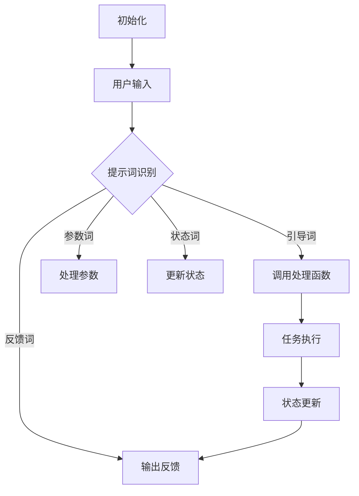
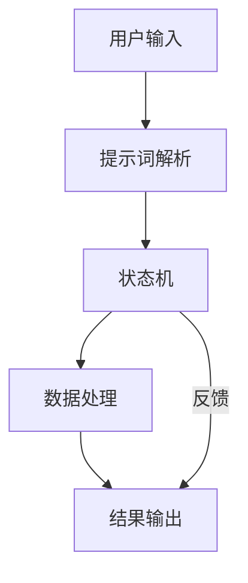
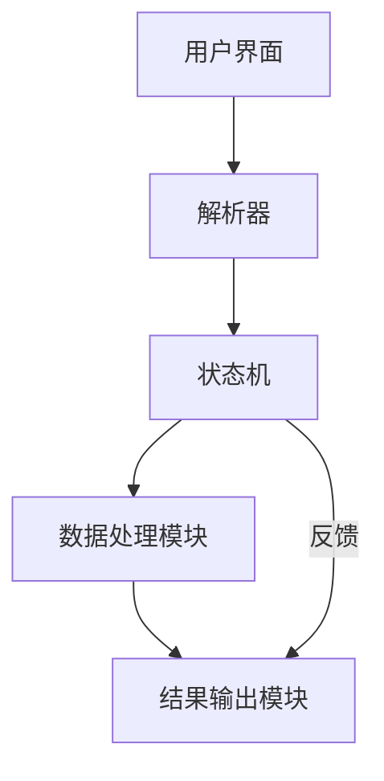
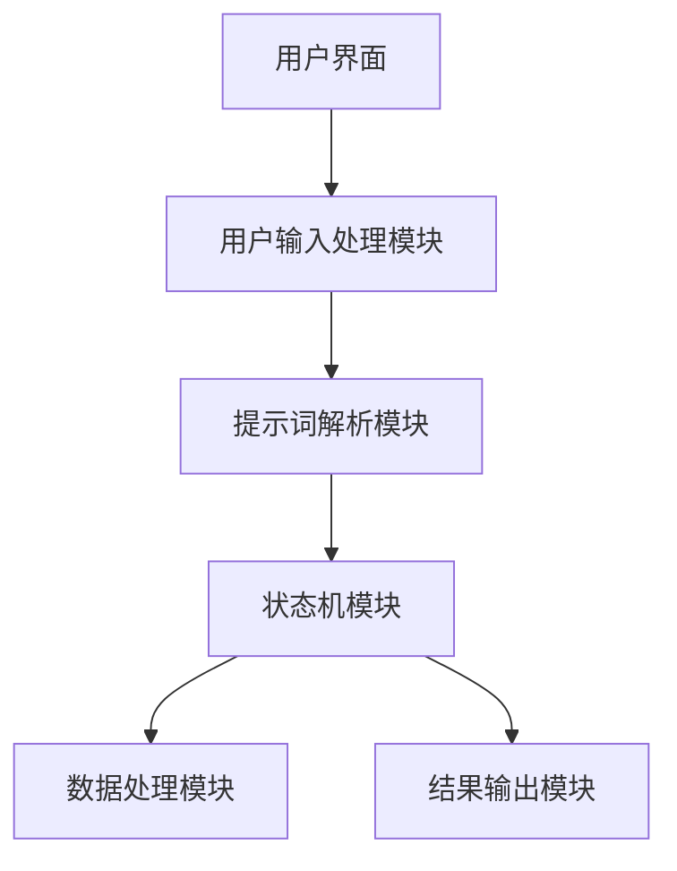
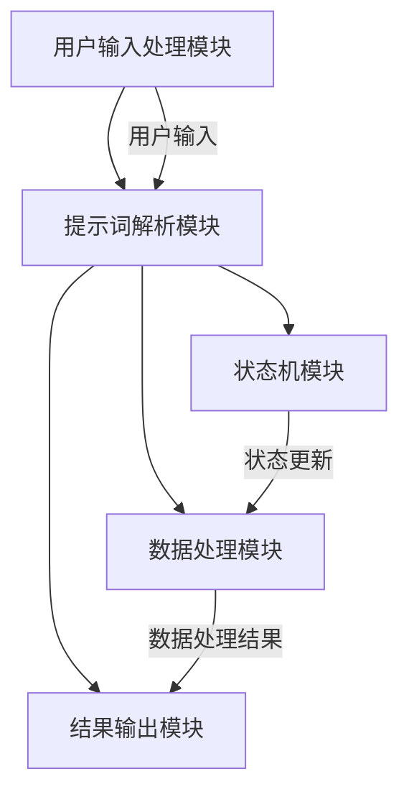
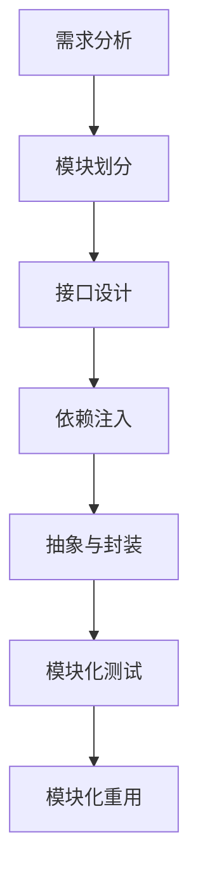
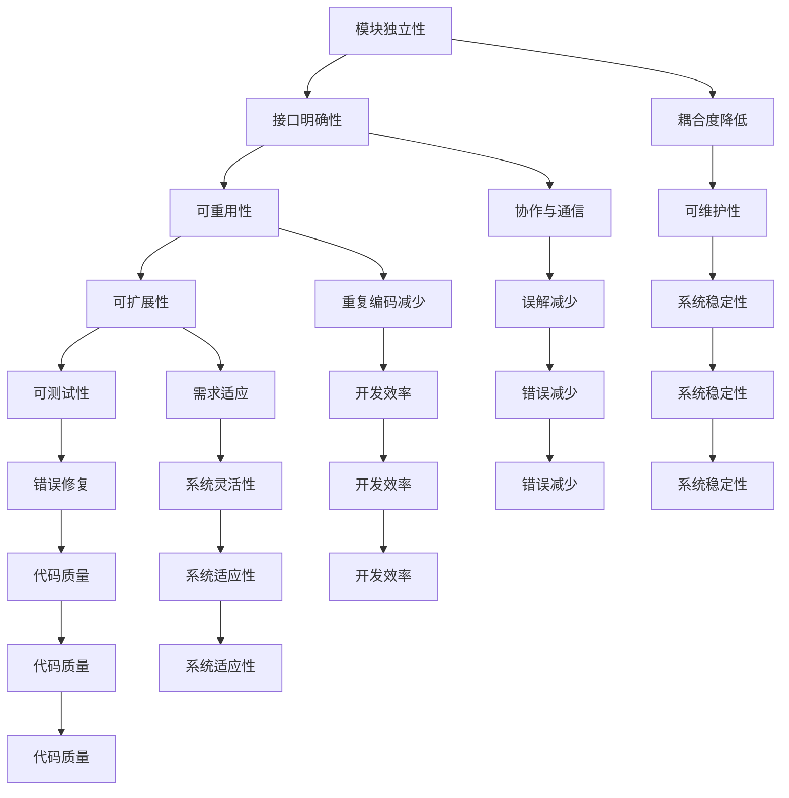
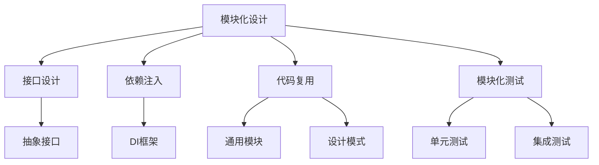

                 

### 文章标题

《提示词编程的模块化重用策略》

> 关键词：提示词编程，模块化重用，策略，编程优化，代码复用

> 摘要：本文深入探讨了提示词编程与模块化重用的结合，通过分析其核心概念和优势，提出了有效的模块化重用策略。文章旨在帮助开发者更好地理解和应用提示词编程，提高代码质量和开发效率。

### 引言

#### 1.1 编程的重要性与挑战

编程作为信息技术领域的基石，在现代社会的各个方面发挥着至关重要的作用。从软件开发到系统架构，从人工智能到大数据处理，编程技能已经成为许多行业成功的关键。然而，随着软件系统复杂性的增加，编程也面临着一系列挑战。

首先，现代编程面临的一个主要挑战是代码的可维护性和可扩展性。随着项目的规模不断扩大，开发者需要处理大量的代码和功能模块，这使得代码的维护和升级变得更加困难。此外，软件系统的高并发性和实时性需求也增加了编程的复杂性。

其次，编程效率是另一个关键挑战。在快速变化的市场环境中，开发团队往往需要在有限的时间内交付高质量的产品。这要求开发者具备高效的编程技能和策略，以便在保证代码质量的同时，最大限度地提高开发速度。

#### 1.2 提示词编程的概念与优势

提示词编程（Prompt-Based Programming，PBP）是一种基于用户输入提示的编程范式。与传统编程不同，提示词编程的核心在于通过提示用户输入来引导程序执行，从而实现代码的自动化和智能化。这种编程方式具有以下核心优势：

1. **易用性**：提示词编程通过简明的提示语句，使得非专业用户也能参与到编程过程中，降低了编程的门槛。
2. **灵活性**：提示词编程可以根据不同的输入提示，灵活地调整程序的行为和输出结果，提高了代码的适应性。
3. **自动化**：通过预设的提示词，提示词编程可以实现自动化任务处理，减少了人工干预，提高了开发效率。

#### 1.3 模块化重用的意义与策略

模块化重用（Modular Reusability）是提高代码质量和开发效率的重要手段。它通过将代码划分为可重用的模块，实现了代码的复用和共享。模块化重用的核心在于：

1. **模块划分**：将复杂的程序划分为独立的模块，每个模块实现特定的功能。
2. **接口设计**：设计清晰的接口，使得模块之间可以无缝地交互和调用。
3. **代码复用**：通过模块的重用，减少代码冗余，提高开发效率。

在提示词编程的背景下，模块化重用策略可以进一步优化编程过程。通过合理地设计提示词和模块，可以实现代码的高效重用，提高编程效率和代码质量。

### 《提示词编程的模块化重用策略》目录大纲

#### 第1章 引言

1.1 编程的重要性与挑战

1.2 提示词编程的概念与优势

1.3 模块化重用的意义与策略

#### 第2章 提示词编程基础

2.1 提示词编程的基本原理

2.2 提示词编程的架构设计

2.3 提示词编程的工具与应用

#### 第3章 模块化重用的策略与方法

3.1 模块化重用的策略概述

3.2 模块的划分与设计

3.3 模块化重用的实现与优化

#### 第4章 提示词编程与模块化重用的应用实例

4.1 应用实例1：基于提示词编程的智能家居系统

4.2 应用实例2：基于提示词编程的智能推荐系统

4.3 应用实例3：基于提示词编程的智能数据分析系统

#### 第5章 提示词编程与模块化重用的未来发展趋势

5.1 提示词编程的未来发展趋势

5.2 模块化重用的未来发展趋势

#### 第6章 结论

6.1 提示词编程与模块化重用的总结

6.2 对读者的建议

#### 附录

A. 提示词编程与模块化重用相关资源

B. 提示词编程与模块化重用实例代码

### 第1章 引言

#### 1.1 编程的重要性与挑战

编程作为信息技术领域的基石，在现代社会的各个方面发挥着至关重要的作用。从软件开发到系统架构，从人工智能到大数据处理，编程技能已经成为许多行业成功的关键。然而，随着软件系统复杂性的增加，编程也面临着一系列挑战。

首先，现代编程面临的一个主要挑战是代码的可维护性和可扩展性。随着项目的规模不断扩大，开发者需要处理大量的代码和功能模块，这使得代码的维护和升级变得更加困难。此外，软件系统的高并发性和实时性需求也增加了编程的复杂性。

其次，编程效率是另一个关键挑战。在快速变化的市场环境中，开发团队往往需要在有限的时间内交付高质量的产品。这要求开发者具备高效的编程技能和策略，以便在保证代码质量的同时，最大限度地提高开发速度。

#### 1.2 提示词编程的概念与优势

提示词编程（Prompt-Based Programming，PBP）是一种基于用户输入提示的编程范式。与传统编程不同，提示词编程的核心在于通过提示用户输入来引导程序执行，从而实现代码的自动化和智能化。这种编程方式具有以下核心优势：

1. **易用性**：提示词编程通过简明的提示语句，使得非专业用户也能参与到编程过程中，降低了编程的门槛。

    - **案例**：在自然语言处理领域，提示词编程允许开发者通过简单的文本提示来训练和优化模型，而不需要深入理解复杂的算法和数据处理过程。

2. **灵活性**：提示词编程可以根据不同的输入提示，灵活地调整程序的行为和输出结果，提高了代码的适应性。

    - **案例**：在自动化测试中，开发者可以使用提示词编程来生成各种测试用例，根据不同的提示输入，自动执行不同的测试任务，提高了测试的覆盖率和效率。

3. **自动化**：通过预设的提示词，提示词编程可以实现自动化任务处理，减少了人工干预，提高了开发效率。

    - **案例**：在运维管理中，提示词编程可以自动处理日常的运维任务，如系统监控、故障排查等，降低了运维成本，提高了系统的稳定性。

#### 1.3 模块化重用的意义与策略

模块化重用（Modular Reusability）是提高代码质量和开发效率的重要手段。它通过将代码划分为可重用的模块，实现了代码的复用和共享。模块化重用的核心在于：

1. **模块划分**：将复杂的程序划分为独立的模块，每个模块实现特定的功能。

    - **案例**：在软件工程中，模块化重用允许开发者将不同的功能模块进行分离和独立开发，如用户界面、业务逻辑、数据存储等，从而提高了代码的可维护性和扩展性。

2. **接口设计**：设计清晰的接口，使得模块之间可以无缝地交互和调用。

    - **案例**：在分布式系统中，模块化重用通过定义清晰的API接口，使得不同模块之间可以独立开发和部署，降低了系统的耦合度，提高了系统的可扩展性和可靠性。

3. **代码复用**：通过模块的重用，减少代码冗余，提高开发效率。

    - **案例**：在开源项目中，模块化重用通过复用已有的模块和库，可以节省开发时间和资源，提高项目的开发效率和质量。

在提示词编程的背景下，模块化重用策略可以进一步优化编程过程。通过合理地设计提示词和模块，可以实现代码的高效重用，提高编程效率和代码质量。以下是一个简化的模块化重用流程：

1. **需求分析**：确定系统需求，将整体功能划分为可重用的模块。
2. **模块设计**：设计模块的接口和功能，确保模块之间的高内聚和低耦合。
3. **提示词设计**：为每个模块设计相应的提示词，以便在编程过程中引导模块的执行。
4. **代码实现**：实现模块的具体功能，同时确保模块之间的接口正确无误。
5. **测试与优化**：对模块进行测试，确保其功能正确，并进行优化以提高性能和可维护性。

通过以上步骤，开发者可以有效地实现提示词编程和模块化重用的结合，提高编程效率和代码质量，为软件开发和系统维护提供有力支持。

### 第2章 提示词编程基础

#### 2.1 提示词编程的基本原理

提示词编程（Prompt-Based Programming，PBP）是一种基于用户输入提示的编程范式。其基本原理是通过预设的提示词来引导程序执行，从而实现代码的自动化和智能化。提示词编程的核心包括以下几个关键概念：

1. **提示词**：提示词是用户输入的关键信息，用于引导程序执行特定的任务。提示词可以是简单的文字提示，也可以是复杂的命令序列。
2. **处理函数**：处理函数是程序中用于处理提示词并执行相应任务的函数。每个提示词对应一个或多个处理函数，处理函数根据提示词的内容执行不同的操作。
3. **状态机**：提示词编程通常采用状态机模型来管理程序的执行状态。状态机根据提示词的变化，在不同的状态之间切换，执行相应的操作。
4. **用户交互**：提示词编程强调用户与程序的交互，通过提示词和反馈机制，用户可以实时调整程序的行为和输出结果。

#### 2.1.1 提示词的作用与分类

提示词在提示词编程中起着至关重要的作用。根据提示词的功能和作用，可以将其分为以下几类：

1. **引导词**：引导词用于引导程序进入特定的执行流程。例如，在命令行界面中，`start`、`stop`、`help`等都是常见的引导词。
2. **参数词**：参数词用于传递额外的信息，帮助程序完成特定的任务。例如，在文件操作中，`file_name`、`path`等都是参数词。
3. **状态词**：状态词用于反映程序当前的执行状态。例如，在程序监控中，`running`、`idle`等都是状态词。
4. **反馈词**：反馈词用于向用户反馈程序执行的结果。例如，在查询操作中，`success`、`failure`等都是反馈词。

#### 2.1.2 提示词编程的基本流程

提示词编程的基本流程包括以下几个步骤：

1. **初始化**：程序启动时，初始化提示词处理模块和状态机。
2. **用户输入**：用户通过输入提示词，与程序进行交互。
3. **提示词识别**：程序识别用户输入的提示词，并调用相应的处理函数。
4. **任务执行**：处理函数根据提示词的内容执行相应的任务。
5. **状态更新**：根据任务的执行结果，状态机更新程序的状态。
6. **反馈输出**：程序根据当前状态，向用户输出相应的反馈信息。

以下是一个简化的提示词编程流程图，用于说明基本流程：



#### 2.1.3 提示词编程的核心算法

提示词编程的核心算法主要涉及提示词的识别和任务的执行。以下是一个简单的伪代码示例，用于说明提示词编程的核心算法：

```pseudo
function handlePrompt(prompt) {
    if (isGuidingWord(prompt)) {
        executeGuidingWord(prompt)
    } else if (isParameterWord(prompt)) {
        processParameter(prompt)
    } else if (isStatusWord(prompt)) {
        updateStatus(prompt)
    } else if (isFeedbackWord(prompt)) {
        outputFeedback(prompt)
    } else {
        raiseError("Unknown prompt")
    }
}

function executeGuidingWord(prompt) {
    switch (prompt) {
        case "start":
            startTask()
            break
        case "stop":
            stopTask()
            break
        case "help":
            displayHelp()
            break
        default:
            raiseError("Unknown guiding word")
    }
}

function processParameter(prompt) {
    // 处理参数逻辑
}

function updateStatus(prompt) {
    // 更新状态逻辑
}

function outputFeedback(prompt) {
    // 输出反馈逻辑
}
```

通过上述伪代码，我们可以看到，提示词编程的核心算法主要依赖于提示词的识别和相应的处理函数。处理函数根据提示词的类型执行不同的操作，从而实现程序的自动化和智能化。

#### 2.2 提示词编程的架构设计

提示词编程的架构设计是确保其稳定运行和高效执行的基础。一个良好的架构设计应该具备以下关键要素：

1. **模块化设计**：将程序划分为多个模块，每个模块负责特定的功能。模块化设计可以提高代码的可维护性和可扩展性。
2. **状态机管理**：使用状态机来管理程序的执行状态。状态机可以根据提示词的变化，在不同的状态之间进行切换，确保程序的逻辑正确。
3. **用户界面**：设计直观的用户界面，方便用户与程序进行交互。用户界面可以是命令行界面、图形界面或混合界面。
4. **数据处理**：设计高效的数据处理模块，确保程序能够快速响应用户的输入和反馈。

以下是一个简化的提示词编程架构设计图，用于说明各个模块之间的关系：



在这个架构设计中，用户输入模块负责接收用户的输入，提示词解析模块对输入的提示词进行解析，并将其传递给状态机。状态机根据提示词的内容，调用相应的数据处理模块，执行相应的任务，并将结果输出给用户。

#### 2.2.1 提示词编程的系统架构

提示词编程的系统架构可以分为以下几个主要部分：

1. **用户界面**：用户界面是用户与程序交互的入口。它可以是命令行界面（CLI）、图形用户界面（GUI）或Web界面。用户界面负责接收用户的输入，并将输入传递给系统的其他部分。

2. **解析器**：解析器是系统中的关键组件，负责将用户输入的提示词解析成系统可以理解的形式。解析器通常包括词法分析器和语法分析器，它们分别对输入的文本进行词法和语法分析，提取出有效的提示词和参数。

3. **状态机**：状态机是系统的核心组件，负责根据解析器传来的提示词，切换程序的状态，并执行相应的操作。状态机的设计至关重要，它需要能够灵活地处理各种提示词，并确保程序在不同状态之间的无缝切换。

4. **数据处理模块**：数据处理模块是系统执行具体任务的核心。根据状态机的指令，数据处理模块执行各种操作，如文件操作、数据处理、网络通信等。这些模块通常独立开发，具有清晰的接口，方便状态机调用。

5. **结果输出模块**：结果输出模块负责将数据处理模块的执行结果反馈给用户。它可以是命令行输出、图形界面显示或Web页面渲染。结果输出模块需要保证信息的准确性和及时性，以便用户了解程序的执行状态。

以下是一个简化的提示词编程系统架构图，用于说明各个部分之间的关系：



在实际应用中，提示词编程的系统架构可能更加复杂，但基本原理和关键组件是相似的。通过合理的设计和优化，提示词编程系统可以实现高效、灵活的编程和任务执行。

#### 2.2.2 提示词编程的模块划分

在提示词编程中，模块划分是一个关键环节，它直接影响到代码的可维护性、可扩展性和复用性。合理的模块划分可以使程序结构清晰，便于理解和维护。以下是一些模块划分的原则和方法：

1. **功能划分**：根据程序的功能模块进行划分。每个模块实现一个具体的功能，如文件处理、数据存储、用户管理等。功能划分有助于模块化设计，使每个模块具有独立性和可重用性。

2. **职责单一**：每个模块应负责单一职责，遵循单一职责原则（Single Responsibility Principle，SRP）。这意味着每个模块应只负责一个特定的任务，避免出现功能混乱、代码冗余的情况。

3. **接口设计**：模块之间应通过清晰的接口进行通信。接口定义了模块之间的交互方式，包括输入参数、输出结果和通信协议。良好的接口设计有助于模块之间的松耦合，提高系统的可维护性和可扩展性。

4. **依赖注入**：采用依赖注入（Dependency Injection，DI）技术，将模块的依赖关系通过外部参数传递，而不是硬编码在模块内部。这样，模块的实现可以更加灵活，易于替换和扩展。

以下是一个简化的模块划分示例，用于说明如何将一个复杂的程序划分为多个模块：



在这个示例中，用户界面模块负责接收用户输入，并将其传递给提示词解析模块。提示词解析模块对输入进行解析，提取出有效的提示词，并将其传递给状态机模块。状态机模块根据提示词的内容，调用相应的数据处理模块，执行具体的任务，并将结果传递给结果输出模块。通过这种方式，程序被划分为多个独立且功能单一的模块，便于管理和维护。

#### 2.2.3 提示词编程的接口设计

在提示词编程中，接口设计是确保模块之间高效、可靠通信的关键。良好的接口设计可以提高模块的独立性、可扩展性和可维护性。以下是一些接口设计的原则和方法：

1. **接口简洁性**：接口应该尽量简洁，只提供必要的功能。复杂的接口会增加使用的难度和维护的负担。

2. **接口稳定性**：接口应该具备稳定性，尽量避免频繁更改。稳定性的接口有助于模块之间的协作，减少因接口变化引起的兼容性问题。

3. **接口可扩展性**：接口应设计为可扩展的，以便在未来的需求变化时，能够轻松地进行修改和扩展。可扩展性的接口有助于系统适应不断变化的需求。

4. **接口一致性**：接口应遵循一致性原则，确保模块之间的交互方式统一。一致性有助于减少错误和提高开发效率。

以下是一个简化的接口设计示例，用于说明如何设计模块之间的接口：



在这个示例中，用户输入处理模块负责接收用户的输入，并将其传递给提示词解析模块。提示词解析模块对输入进行解析，提取出有效的提示词，并将其传递给状态机模块、数据处理模块和结果输出模块。状态机模块根据提示词的内容，调用相应的数据处理模块，执行具体的任务，并将结果传递给结果输出模块。通过这种方式，模块之间的接口设计清晰、简洁，提高了系统的可维护性和可扩展性。

#### 2.3 提示词编程的工具与应用

提示词编程在实践中需要一系列工具的支持，这些工具可以显著提高开发效率和质量。以下是一些常用的提示词编程工具及其应用场景：

1. **自然语言处理（NLP）工具**：NLP工具用于处理和解析自然语言输入，如文本分类、实体识别、情感分析等。这些工具可以简化提示词的提取和解析过程，提高提示词编程的智能化水平。例如，Python的NLTK和spaCy库是常用的NLP工具。

2. **命令行界面（CLI）工具**：CLI工具用于提供命令行交互接口，使开发者可以通过命令行输入提示词，控制程序的执行。CLI工具如bash和zsh，可以与提示词编程框架结合，提供灵活的命令行编程体验。

3. **图形用户界面（GUI）工具**：GUI工具用于提供图形化交互界面，使用户可以通过图形界面输入提示词，与程序进行交互。GUI工具如Qt和Tkinter，可以与提示词编程框架集成，提供友好的用户界面。

4. **集成开发环境（IDE）**：IDE提供了一站式的开发环境，包括代码编辑器、调试器、构建工具等，可以显著提高提示词编程的开发效率。例如，Eclipse和Visual Studio Code都是流行的IDE，支持多种编程语言和工具。

5. **自动化测试工具**：自动化测试工具用于自动化执行测试用例，验证程序的稳定性和功能完整性。例如，Selenium和JUnit是常用的自动化测试工具，可以与提示词编程框架结合，实现自动化测试。

以下是一个简单的应用实例，展示了如何使用Python和NLTK库进行提示词编程：

```python
import nltk

# 加载NLTK的停用词词典
nltk.download('stopwords')
from nltk.corpus import stopwords

# 提取文本中的提示词
def extract_prompts(text):
    stop_words = set(stopwords.words('english'))
    words = nltk.word_tokenize(text)
    prompts = [word for word in words if word not in stop_words]
    return prompts

# 主程序
if __name__ == "__main__":
    text_input = input("请输入文本：")
    prompts = extract_prompts(text_input)
    print("提取的提示词：", prompts)
```

在这个实例中，用户通过命令行输入文本，程序使用NLTK库提取文本中的提示词，并输出结果。这个简单的示例展示了提示词编程的基本流程和工具应用。

#### 2.3.1 提示词编程的开发工具

在提示词编程中，选择合适的开发工具是确保项目顺利进行和高效开发的关键。以下是一些流行的开发工具，它们各自具有独特的特点和优势，适合不同的开发场景：

1. **PyCharm**：PyCharm是由JetBrains公司开发的一款集成开发环境（IDE），适用于Python编程。它提供了强大的代码编辑器、调试器、代码分析工具和项目管理功能。PyCharm支持各种Python框架和库，是进行提示词编程的理想选择。

2. **Visual Studio Code**：Visual Studio Code（VS Code）是由Microsoft开发的一款开源跨平台IDE，支持多种编程语言，包括Python。VS Code具有轻量级、可扩展性强和社区支持广泛的特点，通过安装插件，可以实现高效的提示词编程开发。

3. **Jupyter Notebook**：Jupyter Notebook是一款交互式的计算环境，适用于数据分析、机器学习和提示词编程。它支持多种编程语言，如Python、R和Julia，可以方便地编写和运行代码，并通过Markdown格式记录和分享结果。

4. **Spyder**：Spyder是专为科学计算和数据分析设计的集成开发环境，由Enthought公司开发。它提供了丰富的科学计算库、调试器和可视化工具，特别适合进行复杂的数据分析和提示词编程项目。

5. **Anaconda**：Anaconda是一个跨平台的Python数据科学和提示词编程发行版，它包含了一系列科学计算和数据分析库，如NumPy、Pandas、Matplotlib等。Anaconda提供了一个统一的环境管理器，方便开发者安装和管理多个Python环境和库。

以下是一个使用PyCharm进行提示词编程的开发示例：

```python
# 导入所需的库
import random

# 定义一个简单的提示词生成函数
def generate_prompt():
    actions = ["eat", "sleep", "run", "play"]
    return random.choice(actions)

# 主程序
if __name__ == "__main__":
    print("请输入一个动作提示：")
    user_input = input()
    prompt = generate_prompt()
    print(f"生成的提示词：{prompt}")
    print(f"您的输入：{user_input}")
    if user_input == prompt:
        print("输入正确！")
    else:
        print("输入错误，请重新尝试。")
```

在这个示例中，用户通过命令行输入一个动作提示，程序生成一个随机的提示词，并与用户输入进行比较。这个简单的示例展示了如何使用PyCharm进行提示词编程的开发流程。

#### 2.3.2 提示词编程的典型应用

提示词编程在许多领域都有广泛的应用，其灵活性和自动化特性使其成为解决复杂问题和提高工作效率的重要工具。以下是一些典型的应用场景和实例：

1. **自动化测试**：在软件开发过程中，自动化测试是确保代码质量的关键环节。提示词编程可以通过预设的提示词，自动生成各种测试用例，执行测试任务，并输出测试结果。例如，使用Python的Selenium库，可以通过命令行输入提示词，实现Web应用的自动化测试。

2. **智能家居控制系统**：智能家居控制系统可以通过提示词编程实现智能化的家电控制。例如，用户可以通过语音提示词“打开电视”或“关闭灯光”，系统自动执行相应的操作，提高生活便利性。

3. **自然语言处理**：在自然语言处理领域，提示词编程可以用于处理复杂的语言任务。例如，通过输入提示词“提取电子邮件地址”或“翻译中文到英文”，系统可以自动执行相应的语言处理任务。

4. **数据分析**：在数据分析中，提示词编程可以用于简化数据处理和分析过程。用户可以通过简单的提示词，实现数据清洗、数据转换、统计分析等任务，提高数据分析的效率。

以下是一个简单的自动化测试实例，展示了如何使用Python和Selenium库进行提示词编程：

```python
from selenium import webdriver
from selenium.webdriver.common.keys import Keys

# 创建浏览器驱动对象
driver = webdriver.Chrome()

# 打开浏览器并导航到网页
driver.get("https://www.example.com")

# 模拟用户输入提示词
prompt = "登录"
driver.find_element_by_id("login_button").send_keys(prompt)

# 模拟用户点击登录按钮
driver.find_element_by_id("submit_button").click()

# 输出测试结果
if "登录成功" in driver.page_source:
    print("测试成功：用户已登录。")
else:
    print("测试失败：用户登录失败。")

# 关闭浏览器
driver.quit()
```

在这个实例中，用户通过输入提示词“登录”，系统自动执行登录操作，并输出测试结果。这个简单的实例展示了提示词编程在自动化测试中的应用。

#### 2.3.3 提示词编程的挑战与解决方案

尽管提示词编程具有许多优势，但在实际应用过程中仍面临一些挑战。以下是一些常见的挑战及其解决方案：

1. **提示词不明确**：当提示词不够明确或模糊时，程序可能会出现误解，导致错误的结果。解决方案是设计简洁、具体的提示词，并增加错误处理机制，确保程序能够正确理解用户的意图。

2. **多语言支持**：提示词编程在不同语言环境中可能存在兼容性问题。解决方案是采用国际化（I18N）和本地化（L10N）技术，确保提示词和程序在不同语言环境中都能正常工作。

3. **性能优化**：提示词编程可能会导致程序的执行时间增加，尤其是在处理大量数据和复杂任务时。解决方案是优化算法和代码，采用并行计算和分布式处理技术，提高程序的执行效率。

4. **安全性和隐私**：提示词编程可能涉及用户敏感信息的处理，存在安全风险。解决方案是加强安全措施，如数据加密、访问控制和安全审计，确保用户数据的安全和隐私。

以下是一个简化的伪代码示例，展示了如何处理不明确的提示词：

```python
def handle_ambiguous_prompt(prompt):
    if "login" in prompt:
        if "username" in prompt and "password" in prompt:
            process_login(prompt)
        else:
            raise_error("提示词不明确：缺少用户名或密码。")
    elif "logout" in prompt:
        process_logout(prompt)
    else:
        raise_error("未识别的提示词。")

# 主程序
if __name__ == "__main__":
    user_input = input("请输入提示词：")
    try:
        handle_ambiguous_prompt(user_input)
    except Error as e:
        print(str(e))
```

在这个示例中，程序通过检查提示词的内容，确保用户输入的提示词明确，并执行相应的操作。如果提示词不明确，程序将抛出错误并提示用户。

### 第3章 模块化重用的策略与方法

#### 3.1 模块化重用的策略概述

模块化重用（Modular Reusability）是提高代码质量和开发效率的重要手段。通过将代码划分为可重用的模块，可以减少代码冗余，提高系统的可维护性和扩展性。在提示词编程的背景下，模块化重用策略的核心在于设计可重用的模块，并确保这些模块之间的高内聚和低耦合。

以下是一些模块化重用的主要策略和最佳实践：

1. **模块划分**：根据功能需求将程序划分为多个独立的模块，每个模块负责实现特定的功能。模块划分应遵循单一职责原则，确保模块的功能单一且独立。

2. **接口设计**：设计清晰的接口，确保模块之间的通信和调用方式明确。接口应定义模块的输入参数、输出结果和通信协议，遵循一致性原则，提高模块的可重用性。

3. **依赖注入**：采用依赖注入技术，将模块的依赖关系通过外部参数传递，而不是硬编码在模块内部。这样，模块的实现可以更加灵活，便于替换和扩展。

4. **抽象与封装**：使用抽象和封装技术，将模块的具体实现细节隐藏，仅暴露必要的接口和功能。这有助于提高模块的独立性，降低模块之间的耦合度。

5. **模块化测试**：对每个模块进行独立的测试，确保模块的功能正确和性能优良。模块化测试有助于提高代码的可维护性和可重用性，减少集成测试的难度。

以下是一个简化的模块化重用策略流程图，用于说明主要策略和步骤：



通过以上策略和步骤，开发者可以有效地实现模块化重用，提高编程效率和代码质量。

#### 3.1.1 模块化重用的基本原则

模块化重用（Modular Reusability）是提高代码质量和开发效率的重要手段。在实现模块化重用的过程中，需要遵循以下基本原则：

1. **模块独立性**：每个模块应实现单一职责，功能独立，便于管理和维护。模块的独立性是模块化重用的基础，有助于降低模块之间的耦合度，提高系统的可维护性。

2. **接口明确性**：模块之间的接口应清晰明确，定义模块的输入参数、输出结果和通信协议。明确的接口有助于模块之间的协作和通信，减少误解和错误。

3. **可重用性**：模块应设计为可重用的，不仅限于当前项目，还可以在其他项目中使用。提高模块的可重用性有助于减少重复编码，提高开发效率。

4. **可扩展性**：模块应具备良好的可扩展性，便于在未来的需求变化时进行修改和扩展。可扩展性的模块可以提高系统的灵活性，适应不断变化的需求。

5. **可测试性**：模块应设计为可测试的，便于进行单元测试和集成测试。良好的可测试性有助于发现和修复模块中的错误，提高代码的质量。

以下是一个简化的模块化重用基本原则图，用于说明各个原则之间的关系：



通过遵循这些基本原则，开发者可以设计出高效、可维护和可重用的模块，从而提高编程效率和代码质量。

#### 3.1.2 模块化重用的主要策略

模块化重用（Modular Reusability）是提高代码质量和开发效率的重要手段。在实现模块化重用的过程中，可以采用以下几种主要策略：

1. **模块化设计**：模块化设计是将程序划分为多个独立的模块，每个模块实现特定的功能。模块化设计有助于提高代码的可维护性和可扩展性。具体方法包括：

    - **功能分解**：根据程序的功能需求，将复杂的程序划分为多个功能模块。每个模块负责实现一个具体的功能，如数据处理、用户界面等。
    - **模块独立性**：确保每个模块具有独立性，实现单一职责。模块之间的耦合度应尽可能低，以提高模块的可重用性。

2. **接口设计**：接口设计是模块化重用的关键，它确保模块之间的通信和协作。以下是一些常见的接口设计策略：

    - **定义清晰的接口**：为每个模块定义清晰的接口，包括输入参数、输出结果和通信协议。接口应遵循一致性原则，确保模块之间能够无缝协作。
    - **采用抽象接口**：使用抽象接口隐藏模块的具体实现细节，仅暴露必要的方法和属性。抽象接口有助于提高模块的独立性，降低模块之间的耦合度。

3. **依赖注入**：依赖注入（Dependency Injection，DI）是一种用于管理模块依赖关系的技术。通过依赖注入，可以将模块的依赖关系通过外部参数传递，而不是硬编码在模块内部。以下是一些依赖注入的策略：

    - **使用DI框架**：采用DI框架，如Spring、Django等，可以简化依赖关系的注入和管理。DI框架提供了自动注入和手动注入两种方式，提高了代码的可读性和可维护性。
    - **实现依赖倒置**：遵循依赖倒置原则（Dependency Inversion Principle），将模块之间的依赖关系倒置，依赖抽象而不是具体实现。这样可以确保模块的独立性，提高代码的可重用性。

4. **代码复用**：代码复用是模块化重用的核心目标之一。以下是一些常见的代码复用策略：

    - **编写通用模块**：编写通用模块，实现通用的功能，如数据处理、文件操作等。通用模块可以跨项目复用，减少重复编码。
    - **使用设计模式**：采用设计模式，如工厂模式、策略模式等，可以有效地实现代码复用。设计模式提供了模板和框架，使代码更具灵活性和可扩展性。

5. **模块化测试**：模块化测试是确保模块功能和性能的重要手段。以下是一些模块化测试的策略：

    - **单元测试**：对每个模块进行独立的单元测试，验证模块的功能正确性和性能。单元测试有助于发现和修复模块中的错误，提高代码的质量。
    - **集成测试**：在模块集成后，进行集成测试，验证模块之间的协作和系统的整体功能。集成测试有助于发现模块之间的兼容性问题，提高系统的稳定性。

以下是一个简化的模块化重用策略图，用于说明各种策略之间的关系：



通过以上策略，开发者可以有效地实现模块化重用，提高代码质量和开发效率。

#### 3.1.3 模块化重用的最佳实践

模块化重用（Modular Reusability）是提高代码质量和开发效率的重要手段。在实现模块化重用的过程中，可以遵循以下最佳实践：

1. **模块功能单一**：确保每个模块实现单一功能，避免模块功能过于复杂。单一功能的模块可以提高代码的可维护性和可重用性。

2. **接口明确简洁**：为模块设计清晰的接口，包括输入参数、输出结果和通信协议。接口应简洁明了，减少不必要的复杂性和耦合度。

3. **使用依赖注入**：采用依赖注入（Dependency Injection，DI）技术，将模块的依赖关系通过外部参数传递，而不是硬编码在模块内部。这样可以提高模块的灵活性，降低耦合度。

4. **编写可复用的代码**：编写通用模块，实现通用的功能，如数据处理、文件操作等。通用模块可以跨项目复用，减少重复编码。

5. **单元测试覆盖**：对每个模块进行独立的单元测试，确保模块的功能正确性和性能。单元测试有助于发现和修复模块中的错误，提高代码质量。

6. **文档和注释**：为模块编写详细的文档和注释，描述模块的功能、接口和使用方法。良好的文档和注释有助于其他开发者理解和复用模块。

7. **持续重构**：定期对代码进行重构，优化模块的结构和功能，提高代码的可读性和可维护性。重构有助于保持代码的整洁和高效。

以下是一个简单的模块化重用最佳实践示例：

```python
# 模块功能：数据读取
def read_data(file_path):
    """
    读取文件数据
    :param file_path: 文件路径
    :return: 数据列表
    """
    with open(file_path, 'r') as f:
        data = f.readlines()
    return data

# 模块功能：数据处理
def process_data(data):
    """
    处理数据
    :param data: 数据列表
    :return: 处理后的数据
    """
    processed_data = []
    for item in data:
        processed_data.append(item.strip())
    return processed_data

# 模块功能：数据写入
def write_data(file_path, data):
    """
    写入文件数据
    :param file_path: 文件路径
    :param data: 数据列表
    """
    with open(file_path, 'w') as f:
        for item in data:
            f.write(f"{item}\n")

# 主程序
if __name__ == "__main__":
    file_path = "data.txt"
    data = read_data(file_path)
    processed_data = process_data(data)
    write_data("processed_data.txt", processed_data)
```

在这个示例中，程序被划分为三个模块：数据读取、数据处理和数据写入。每个模块实现单一功能，接口明确简洁，模块之间通过依赖注入进行通信。通过单元测试和文档注释，确保模块的功能正确性和可复用性。

#### 3.2 模块的划分与设计

模块化重用的核心在于将程序划分为独立且功能单一的模块，并通过清晰的接口进行通信。以下是如何进行模块的划分与设计：

##### 3.2.1 模块的划分原则

1. **单一职责原则**：每个模块应实现单一职责，只负责一个特定的功能。这有助于提高模块的可维护性和可重用性。
2. **高内聚低耦合原则**：模块之间应保持高内聚和低耦合。高内聚意味着模块内部的功能紧密相关，低耦合意味着模块之间的依赖关系尽可能少。
3. **可扩展性原则**：模块应设计为可扩展的，以便在未来的需求变化时能够轻松修改和扩展。
4. **可测试性原则**：模块应设计为可测试的，便于进行单元测试和集成测试。

##### 3.2.2 模块的设计方法

1. **功能分解**：根据程序的功能需求，将复杂的程序划分为多个功能模块。每个模块实现一个具体的功能，如数据处理、用户界面、数据存储等。

2. **接口设计**：为每个模块设计清晰的接口，包括输入参数、输出结果和通信协议。接口应简洁明了，减少不必要的复杂性和耦合度。

3. **依赖注入**：采用依赖注入（Dependency Injection，DI）技术，将模块的依赖关系通过外部参数传递，而不是硬编码在模块内部。这样可以提高模块的灵活性，降低耦合度。

4. **抽象与封装**：使用抽象和封装技术，将模块的具体实现细节隐藏，仅暴露必要的方法和属性。这有助于提高模块的独立性，降低模块之间的耦合度。

以下是一个简化的模块划分与设计示例：

```python
# 数据处理模块
class DataProcessor:
    def __init__(self, data_source):
        self.data_source = data_source
    
    def process_data(self):
        # 处理数据逻辑
        processed_data = ...
        return processed_data

# 用户界面模块
class UserInterface:
    def display_data(self, data):
        # 显示数据逻辑
        print(data)

# 主程序
if __name__ == "__main__":
    data_source = "data.txt"
    data_processor = DataProcessor(data_source)
    processed_data = data_processor.process_data()
    user_interface = UserInterface()
    user_interface.display_data(processed_data)
```

在这个示例中，程序被划分为两个模块：数据处理模块和用户界面模块。数据处理模块负责数据读取和处理，用户界面模块负责数据展示。模块之间通过依赖注入进行通信，接口设计简洁明了。

##### 3.2.3 模块的重用性评估

模块的重用性评估是确保模块设计合理、可复用的重要环节。以下是一些评估模块重用性的方法和指标：

1. **功能独立性**：评估模块是否实现单一职责，功能独立。独立的模块更容易在其他项目中复用。

2. **接口通用性**：评估模块接口的通用性。通用的接口可以跨项目、跨语言使用，提高模块的重用性。

3. **依赖关系**：评估模块之间的依赖关系。尽量减少模块之间的依赖关系，提高模块的独立性。

4. **测试覆盖**：评估模块的测试覆盖率。高测试覆盖率有助于确保模块的功能正确性和性能。

5. **文档完整度**：评估模块的文档完整度。详细的文档有助于其他开发者理解和复用模块。

6. **维护成本**：评估模块的维护成本。维护成本低的模块更容易长期保持可复用性。

以下是一个模块重用性评估的示例：

```python
# 数据处理模块
class DataProcessor:
    def __init__(self, data_source):
        self.data_source = data_source
    
    def process_data(self):
        # 处理数据逻辑
        processed_data = ...
        return processed_data

# 重用性评估报告
assessor = ReusabilityAssessor()

# 功能独立性评估
assessor.evaluate_functionality(DataProcessor, ["process_data"], ["data_source"], True)

# 接口通用性评估
assessor.evaluate_interface(DataProcessor, ["process_data"], ["data_source"], True)

# 依赖关系评估
assessor.evaluate_dependencies(DataProcessor, ["process_data"], {"data_source": "Data_sourceModule"}, True)

# 测试覆盖评估
assessor.evaluate_test_coverage(DataProcessor, ["process_data"], 100)

# 文档完整度评估
assessor.evaluate_documentation(DataProcessor, ["process_data", "data_source"], True)

# 维护成本评估
assessor.evaluate_maintenance_cost(DataProcessor, ["process_data", "data_source"], Low)
```

通过以上评估方法，可以全面评估模块的重用性，为模块化重用提供有力支持。

#### 3.3 模块化重用的实现与优化

模块化重用的实现与优化是确保代码质量和开发效率的关键。以下是如何实现模块化重用以及如何进行优化的详细步骤和方法：

##### 3.3.1 模块化重用的实现步骤

1. **需求分析**：首先，对项目需求进行详细分析，确定需要实现的功能和模块。根据单一职责原则，将复杂的程序划分为多个独立模块。

2. **模块划分**：根据需求分析结果，将程序划分为多个功能模块。每个模块应实现单一功能，如数据处理、用户界面、数据存储等。确保模块之间的高内聚和低耦合。

3. **接口设计**：为每个模块设计清晰的接口，包括输入参数、输出结果和通信协议。接口设计应遵循一致性原则，确保模块之间能够无缝协作。

4. **模块实现**：实现每个模块的具体功能。确保模块的实现逻辑简洁、易于理解和维护。同时，遵循依赖注入原则，将模块的依赖关系通过外部参数传递，避免硬编码。

5. **模块测试**：对每个模块进行独立的单元测试，确保模块的功能正确性和性能。单元测试有助于发现和修复模块中的错误，提高代码质量。

6. **集成测试**：在模块集成后，进行集成测试，验证模块之间的协作和系统的整体功能。集成测试有助于发现模块之间的兼容性问题，提高系统的稳定性。

7. **文档编写**：为每个模块编写详细的文档，描述模块的功能、接口和使用方法。良好的文档有助于其他开发者理解和复用模块。

##### 3.3.2 模块化重用的优化方法

1. **代码复用**：编写通用模块，实现通用的功能，如数据处理、文件操作等。通用模块可以跨项目复用，减少重复编码。

2. **设计模式**：采用设计模式，如工厂模式、策略模式等，可以有效地实现代码复用。设计模式提供了模板和框架，使代码更具灵活性和可扩展性。

3. **性能优化**：对模块进行性能优化，如减少函数调用、避免重复计算等。性能优化有助于提高模块的执行效率。

4. **内存管理**：合理管理模块的内存占用，如使用缓存、对象池等。内存管理有助于提高系统的稳定性。

5. **并发处理**：在模块中实现并发处理，如使用多线程、异步IO等。并发处理有助于提高系统的响应速度和处理能力。

6. **模块测试**：定期对模块进行性能测试和负载测试，确保模块在多场景下的稳定性和性能。性能测试和负载测试有助于发现和解决模块的性能问题。

以下是一个简单的模块化重用实现与优化示例：

```python
# 数据处理模块
class DataProcessor:
    def __init__(self, data_source):
        self.data_source = data_source
    
    def process_data(self):
        # 处理数据逻辑
        processed_data = ...
        return processed_data

# 用户界面模块
class UserInterface:
    def display_data(self, data):
        # 显示数据逻辑
        print(data)

# 主程序
if __name__ == "__main__":
    # 模块化重用实现
    data_source = "data.txt"
    data_processor = DataProcessor(data_source)
    processed_data = data_processor.process_data()
    user_interface = UserInterface()
    user_interface.display_data(processed_data)

    # 性能优化
    import time
    start_time = time.time()
    for _ in range(1000):
        processed_data = data_processor.process_data()
    end_time = time.time()
    print(f"处理1000次数据耗时：{end_time - start_time}秒")
```

在这个示例中，程序被划分为两个模块：数据处理模块和用户界面模块。通过模块化重用实现，主程序可以方便地复用和处理数据。同时，性能优化步骤展示了如何提高模块的执行效率。

#### 3.3.3 模块化重用的案例分析

为了更好地理解模块化重用的实际应用，以下将通过几个具体的案例分析，探讨模块化重用在不同场景中的实现和优化。

##### 案例一：电商平台后台系统

在电商平台的开发过程中，后台系统需要处理海量的订单、用户数据和支付信息。为了提高系统的可维护性和扩展性，团队采用了模块化重用策略。

**实现步骤**：

1. **模块划分**：将后台系统划分为订单处理、用户管理、支付处理、数据统计等独立模块。每个模块负责特定的功能，如订单处理模块负责接收和处理订单，用户管理模块负责用户信息的管理。

2. **接口设计**：为每个模块设计清晰的接口，如订单处理模块的接口包括接收订单、处理订单、查询订单等。接口设计确保模块之间的高内聚和低耦合。

3. **模块实现**：实现每个模块的具体功能，如订单处理模块通过REST API接收订单，支付处理模块通过支付网关处理支付操作。

4. **模块测试**：对每个模块进行独立的单元测试，如订单处理模块的测试用例包括正常订单处理、异常订单处理等。确保模块的功能正确性和性能。

5. **集成测试**：在模块集成后，进行集成测试，如模拟用户下单、支付等场景，验证模块之间的协作和系统的整体功能。

**优化方法**：

1. **代码复用**：在订单处理模块中，实现了通用函数，如数据验证、日志记录等，便于在其他模块中复用。

2. **设计模式**：采用了工厂模式，如支付处理模块通过工厂方法创建不同的支付处理器，提高了系统的灵活性和可扩展性。

3. **性能优化**：针对订单处理模块，采用了异步处理和消息队列，提高了系统的并发处理能力和响应速度。

##### 案例二：智能推荐系统

智能推荐系统在电商、新闻、视频等领域广泛应用，其核心在于高效地处理海量数据并生成个性化的推荐结果。模块化重用在智能推荐系统的开发中起到了关键作用。

**实现步骤**：

1. **模块划分**：将推荐系统划分为数据采集、数据处理、推荐算法、推荐结果展示等模块。每个模块负责不同的功能，如数据采集模块负责从各种数据源收集用户行为数据。

2. **接口设计**：为每个模块设计清晰的接口，如数据处理模块的接口包括数据清洗、特征提取、数据存储等。接口设计确保模块之间的协作和通信。

3. **模块实现**：实现每个模块的具体功能，如数据处理模块通过ETL（提取、转换、加载）过程处理原始数据，推荐算法模块使用机器学习算法生成推荐结果。

4. **模块测试**：对每个模块进行独立的单元测试，如数据处理模块的测试用例包括数据清洗流程、特征提取效果等。确保模块的功能正确性和性能。

5. **集成测试**：在模块集成后，进行集成测试，如模拟用户行为数据，验证推荐结果的准确性和实时性。

**优化方法**：

1. **代码复用**：在数据处理模块中，实现了通用的数据处理函数，如数据预处理、特征转换等，提高了代码的可维护性和复用性。

2. **设计模式**：采用了策略模式，如推荐算法模块根据不同的推荐算法，如基于内容的推荐、协同过滤推荐等，选择合适的算法策略。

3. **性能优化**：针对推荐算法模块，采用了并行计算和分布式处理，提高了算法的执行效率和推荐速度。

##### 案例三：自动化测试平台

自动化测试平台在软件测试过程中发挥着重要作用，通过模块化重用策略，可以显著提高测试效率和质量。

**实现步骤**：

1. **模块划分**：将自动化测试平台划分为测试脚本管理、测试执行、测试报告生成等模块。每个模块负责不同的功能，如测试脚本管理模块负责测试脚本的创建和管理。

2. **接口设计**：为每个模块设计清晰的接口，如测试执行模块的接口包括启动测试、执行测试用例、生成测试报告等。接口设计确保模块之间的协作和通信。

3. **模块实现**：实现每个模块的具体功能，如测试脚本管理模块通过配置文件管理测试脚本，测试执行模块通过Selenium等工具执行测试用例。

4. **模块测试**：对每个模块进行独立的单元测试，如测试脚本管理模块的测试用例包括脚本创建、脚本删除等。确保模块的功能正确性和性能。

5. **集成测试**：在模块集成后，进行集成测试，如模拟测试流程，验证测试结果的准确性和一致性。

**优化方法**：

1. **代码复用**：在测试脚本管理模块中，实现了通用的脚本处理函数，如脚本读取、脚本执行等，提高了代码的可维护性和复用性。

2. **设计模式**：采用了工厂模式，如测试执行模块通过工厂方法创建不同的测试执行器，支持多种测试工具和框架。

3. **性能优化**：针对测试执行模块，采用了并行测试和分布式处理，提高了测试效率和处理能力。

通过以上案例，我们可以看到模块化重用在不同场景中的具体应用和优化方法。模块化重用策略不仅提高了代码质量和开发效率，还增强了系统的可维护性和可扩展性，为开发者提供了有力的工具。

### 第4章 提示词编程与模块化重用的应用实例

#### 4.1 应用实例1：基于提示词编程的智能家居系统

智能家居系统是提示词编程与模块化重用策略的理想应用场景之一。通过提示词编程，可以实现智能设备的远程控制、状态监控和自动化场景设定。以下是一个智能家居系统的应用实例，展示了提示词编程与模块化重用的具体实现。

##### 4.1.1 智能家居系统的概述

智能家居系统主要由多个智能设备组成，如智能灯光、智能空调、智能门锁等。这些设备通过无线网络连接到智能家居控制中心，用户可以通过手机APP、语音助手或提示词编程与系统进行交互。智能家居系统的主要功能包括：

1. **设备控制**：用户可以通过提示词远程控制家中设备的开关，如“打开客厅灯光”、“关闭厨房电器”等。
2. **状态监控**：系统可以实时监控设备的状态，如“客厅灯光是否已关闭”、“空调温度是否适宜”等。
3. **自动化场景**：用户可以设定自动化场景，如“离家模式”自动关闭所有设备，“睡眠模式”调整灯光和空调等。

##### 4.1.2 提示词编程在智能家居系统中的应用

在智能家居系统中，提示词编程用于实现设备的远程控制和自动化场景的设定。以下是一个简单的提示词编程实例：

```python
# 模块1：设备控制
class DeviceController:
    def __init__(self, device_name):
        self.device_name = device_name
    
    def turn_on(self):
        print(f"{self.device_name}已开启。")
    
    def turn_off(self):
        print(f"{self.device_name}已关闭。")

# 模块2：状态监控
class DeviceMonitor:
    def __init__(self, device_name):
        self.device_name = device_name
    
    def check_status(self):
        print(f"{self.device_name}当前状态：{self.get_status()}。")
    
    def get_status(self):
        # 实现设备状态获取逻辑
        return "已开启" if self.device_is_on() else "已关闭"
    
    def device_is_on(self):
        # 实现设备是否开启的逻辑
        return True

# 模块3：自动化场景
class AutomationScene:
    def __init__(self, controller, monitor):
        self.controller = controller
        self.monitor = monitor
    
    def set_scene(self, scene_name):
        if scene_name == "离家模式":
            self.controller.turn_off_all()
        elif scene_name == "睡眠模式":
            self.controller.turn_off_lights()
            self.monitor.check_status()

# 主程序
if __name__ == "__main__":
    light_controller = DeviceController("客厅灯光")
    light_monitor = DeviceMonitor("客厅灯光")
    scene_manager = AutomationScene(light_controller, light_monitor)

    user_input = input("请输入提示词：")
    if "打开" in user_input:
        light_controller.turn_on()
    elif "关闭" in user_input:
        light_controller.turn_off()
    elif "状态" in user_input:
        light_monitor.check_status()
    elif "离家" in user_input or "睡眠" in user_input:
        scene_name = "离家模式" if "离家" in user_input else "睡眠模式"
        scene_manager.set_scene(scene_name)
```

在这个示例中，通过提示词编程，用户可以控制家中的智能灯光设备，并设置自动化场景。设备控制器（DeviceController）和设备监控器（DeviceMonitor）实现了设备控制和管理功能，自动化场景（AutomationScene）模块可以根据用户的提示词自动执行相应的操作。

##### 4.1.3 模块化重用在智能家居系统中的实践

在智能家居系统中，模块化重用策略可以提高系统的可维护性和扩展性。以下是如何在智能家居系统中实现模块化重用的具体方法：

1. **通用模块**：设计通用的设备控制模块和设备监控模块，适用于各种智能设备。这些通用模块可以通过参数化配置，支持不同的设备类型和功能。

2. **接口设计**：为设备控制模块和设备监控模块设计清晰的接口，如设备名称、控制方法等。接口设计确保模块之间的高内聚和低耦合。

3. **依赖注入**：采用依赖注入技术，将设备控制模块和设备监控模块的依赖关系通过外部参数传递，避免硬编码在模块内部。这样，模块的实现可以更加灵活，便于替换和扩展。

4. **模块测试**：对设备控制模块和设备监控模块进行独立的单元测试，确保模块的功能正确性和性能。单元测试有助于提高模块的可维护性和复用性。

5. **文档编写**：为设备控制模块和设备监控模块编写详细的文档，描述模块的功能、接口和使用方法。良好的文档有助于其他开发者理解和复用模块。

通过模块化重用策略，智能家居系统可以更加灵活地扩展新设备和支持新的功能，同时提高系统的可维护性和开发效率。

#### 4.2 应用实例2：基于提示词编程的智能推荐系统

智能推荐系统是另一个适合应用提示词编程与模块化重用策略的场景。通过提示词编程，可以简化推荐算法的实现和调整过程，提高系统的灵活性和开发效率。以下是一个智能推荐系统的应用实例，展示如何结合提示词编程和模块化重用策略。

##### 4.2.1 智能推荐系统的概述

智能推荐系统主要用于向用户推荐感兴趣的内容，如商品、新闻、视频等。系统通过分析用户的浏览历史、购买行为和兴趣爱好，生成个性化的推荐结果。智能推荐系统的主要功能包括：

1. **内容推荐**：根据用户的兴趣和行为，推荐相关的内容。
2. **推荐算法调整**：允许开发者和数据科学家通过提示词编程调整推荐算法，优化推荐效果。
3. **用户反馈**：收集用户的反馈，用于改进推荐算法。

##### 4.2.2 提示词编程在智能推荐系统中的应用

在智能推荐系统中，提示词编程用于简化推荐算法的实现和调整过程。以下是一个简单的提示词编程实例：

```python
# 模块1：推荐算法
class RecommendationAlgorithm:
    def __init__(self, data_source):
        self.data_source = data_source
    
    def recommend(self, user_id):
        # 根据用户数据推荐内容
        recommended_items = self.generate_recommendations(user_id)
        return recommended_items
    
    def generate_recommendations(self, user_id):
        # 实现推荐逻辑
        return ["商品A", "商品B", "商品C"]

# 模块2：算法调整
class AlgorithmTuner:
    def __init__(self, algorithm):
        self.algorithm = algorithm
    
    def tune(self, tuning_prompt):
        if "增加相似度计算" in tuning_prompt:
            self.algorithm.update_similarity_weight()
        elif "减少噪声数据" in tuning_prompt:
            self.algorithm.remove_noisy_data()

# 模块3：用户反馈
class UserFeedback:
    def __init__(self, algorithm):
        self.algorithm = algorithm
    
    def collect_feedback(self, user_id, item_id, feedback_prompt):
        if "喜欢" in feedback_prompt:
            self.algorithm.update_likes(user_id, item_id)
        elif "不喜欢" in feedback_prompt:
            self.algorithm.update_dislikes(user_id, item_id)

# 主程序
if __name__ == "__main__":
    data_source = "user_data.csv"
    recommendation_algorithm = RecommendationAlgorithm(data_source)
    algorithm_tuner = AlgorithmTuner(recommendation_algorithm)
    user_feedback = UserFeedback(recommendation_algorithm)

    user_id = input("请输入用户ID：")
    tuning_prompt = input("请输入调整提示词：")
    algorithm_tuner.tune(tuning_prompt)

    recommended_items = recommendation_algorithm.recommend(user_id)
    print("推荐的商品：", recommended_items)

    feedback_prompt = input("请输入反馈提示词：")
    user_feedback.collect_feedback(user_id, item_id, feedback_prompt)
```

在这个示例中，通过提示词编程，用户可以调整推荐算法，优化推荐效果。推荐算法（RecommendationAlgorithm）模块根据用户数据生成推荐结果，算法调整器（AlgorithmTuner）模块通过提示词调整推荐算法，用户反馈（UserFeedback）模块收集用户反馈，用于改进推荐算法。

##### 4.2.3 模块化重用在智能推荐系统中的实践

在智能推荐系统中，模块化重用策略可以提高系统的可维护性和扩展性。以下是如何在智能推荐系统中实现模块化重用的具体方法：

1. **通用模块**：设计通用的推荐算法模块和反馈处理模块，适用于不同的推荐场景和算法。这些通用模块可以通过参数化配置，支持不同的数据源和算法。

2. **接口设计**：为推荐算法模块和反馈处理模块设计清晰的接口，如数据源、推荐逻辑、反馈处理等。接口设计确保模块之间的高内聚和低耦合。

3. **依赖注入**：采用依赖注入技术，将推荐算法模块和反馈处理模块的依赖关系通过外部参数传递，避免硬编码在模块内部。这样，模块的实现可以更加灵活，便于替换和扩展。

4. **模块测试**：对推荐算法模块和反馈处理模块进行独立的单元测试，确保模块的功能正确性和性能。单元测试有助于提高模块的可维护性和复用性。

5. **文档编写**：为推荐算法模块和反馈处理模块编写详细的文档，描述模块的功能、接口和使用方法。良好的文档有助于其他开发者理解和复用模块。

通过模块化重用策略，智能推荐系统可以更加灵活地扩展新算法和新功能，同时提高系统的可维护性和开发效率。

#### 4.3 应用实例3：基于提示词编程的智能数据分析系统

智能数据分析系统是数据处理和可视化技术的结合，通过提示词编程，可以简化数据分析流程，提高数据处理的效率和灵活性。以下是一个智能数据分析系统的应用实例，展示如何结合提示词编程和模块化重用策略。

##### 4.3.1 智能数据分析系统的概述

智能数据分析系统主要用于对大量数据进行处理和分析，帮助用户从数据中发现有价值的信息。系统的主要功能包括：

1. **数据处理**：对原始数据进行清洗、转换和分析，生成结构化的数据。
2. **数据可视化**：将分析结果以图表、报表等形式展示，帮助用户直观理解数据。
3. **自动化分析**：通过提示词编程，实现自动化的数据分析任务。

##### 4.3.2 提示词编程在智能数据分析系统中的应用

在智能数据分析系统中，提示词编程用于简化数据分析流程，实现自动化的数据分析任务。以下是一个简单的提示词编程实例：

```python
# 模块1：数据处理
class DataProcessor:
    def __init__(self, data_source):
        self.data_source = data_source
    
    def process_data(self, data):
        # 实现数据处理逻辑
        processed_data = self.clean_data(data)
        return processed_data
    
    def clean_data(self, data):
        # 实现数据清洗逻辑
        cleaned_data = ...
        return cleaned_data

# 模块2：数据可视化
class DataVisualizer:
    def __init__(self, data):
        self.data = data
    
    def visualize_data(self, visualization_type):
        if visualization_type == "line chart":
            self.plot_line_chart()
        elif visualization_type == "bar chart":
            self.plot_bar_chart()

    def plot_line_chart(self):
        # 实现折线图绘制逻辑
        pass

    def plot_bar_chart(self):
        # 实现柱状图绘制逻辑
        pass

# 模块3：自动化分析
class AutomatedAnalysis:
    def __init__(self, processor, visualizer):
        self.processor = processor
        self.visualizer = visualizer
    
    def analyze_data(self, data, visualization_type):
        processed_data = self.processor.process_data(data)
        self.visualizer.visualize_data(visualization_type)

# 主程序
if __name__ == "__main__":
    data_source = "data.csv"
    data_processor = DataProcessor(data_source)
    data_visualizer = DataVisualizer(data_source)
    automated_analysis = AutomatedAnalysis(data_processor, data_visualizer)

    data = automated_analysis.load_data()
    visualization_type = input("请输入可视化类型（line chart 或 bar chart）：")
    automated_analysis.analyze_data(data, visualization_type)
```

在这个示例中，通过提示词编程，用户可以自动执行数据清洗、分析和可视化任务。数据处理（DataProcessor）模块负责数据清洗和转换，数据可视化（DataVisualizer）模块负责将分析结果以图表形式展示，自动化分析（AutomatedAnalysis）模块通过提示词实现自动化的数据分析任务。

##### 4.3.3 模块化重用在智能数据分析系统中的实践

在智能数据分析系统中，模块化重用策略可以提高系统的可维护性和扩展性。以下是如何在智能数据分析系统中实现模块化重用的具体方法：

1. **通用模块**：设计通用的数据处理模块和可视化模块，适用于不同的数据源和可视化需求。这些通用模块可以通过参数化配置，支持不同的数据处理和可视化方法。

2. **接口设计**：为数据处理模块和可视化模块设计清晰的接口，如数据源、处理方法、可视化类型等。接口设计确保模块之间的高内聚和低耦合。

3. **依赖注入**：采用依赖注入技术，将数据处理模块和可视化模块的依赖关系通过外部参数传递，避免硬编码在模块内部。这样，模块的实现可以更加灵活，便于替换和扩展。

4. **模块测试**：对数据处理模块和可视化模块进行独立的单元测试，确保模块的功能正确性和性能。单元测试有助于提高模块的可维护性和复用性。

5. **文档编写**：为数据处理模块和可视化模块编写详细的文档，描述模块的功能、接口和使用方法。良好的文档有助于其他开发者理解和复用模块。

通过模块化重用策略，智能数据分析系统可以更加灵活地扩展新功能和数据处理方法，同时提高系统的可维护性和开发效率。

### 第5章 提示词编程与模块化重用的未来发展趋势

#### 5.1 提示词编程的未来发展趋势

提示词编程（Prompt-Based Programming，PBP）作为一种新兴的编程范式，正在逐渐成为开发者关注的焦点。随着人工智能技术的发展和普及，提示词编程有望在未来呈现出以下几个重要趋势：

1. **自然语言处理（NLP）的深入应用**：随着NLP技术的不断进步，提示词编程将更加智能化。通过深度学习模型和自然语言处理算法，提示词编程将能够更好地理解和解析用户的自然语言输入，提高编程的易用性和灵活性。

2. **跨平台和跨语言的支持**：未来，提示词编程将实现跨平台和跨语言的支持。这意味着开发者可以在不同的操作系统和编程语言中轻松地实现和部署提示词编程应用，进一步降低编程的门槛。

3. **自动化和智能化的增强**：随着提示词编程技术的成熟，自动化和智能化的水平将得到显著提升。提示词编程将能够自动执行复杂的任务，减少人工干预，提高开发效率和代码质量。

4. **与大数据和云计算的结合**：提示词编程与大数据和云计算的结合将带来更多可能性。通过大数据分析和云计算资源，提示词编程可以处理和分析海量数据，实现更加智能和高效的应用。

5. **社区和生态的蓬勃发展**：随着提示词编程的普及，相关的社区和生态系统将逐渐形成。开发者可以通过开源框架、工具和资源，方便地实现和优化提示词编程应用，推动技术的不断发展和创新。

#### 5.2 模块化重用的未来发展趋势

模块化重用（Modular Reusability）作为一种提高代码质量和开发效率的重要策略，在未来也将继续发展。以下是一些可能的发展趋势：

1. **自动化模块化**：未来的模块化重用将更加自动化。通过智能化的工具和算法，系统能够自动识别和划分模块，自动生成接口和依赖关系，减少人工干预，提高模块化重用的效率。

2. **设计模式与模块化**：设计模式与模块化将更加紧密结合。未来的开发者和设计师将更加重视模块化设计，通过设计模式实现模块之间的灵活组合和重用，提高系统的可维护性和可扩展性。

3. **模块化开发平台**：模块化开发平台将得到广泛应用。这些平台提供了一站式的模块化开发环境，包括模块管理、依赖注入、自动化测试等，方便开发者实现模块化重用。

4. **模块化与云原生技术**：模块化与云原生技术的结合将带来新的发展机遇。通过云原生技术，模块化应用可以在分布式环境中高效运行和扩展，实现更高的性能和可伸缩性。

5. **社区和标准的推动**：模块化重用的社区和标准将得到进一步发展。相关的社区、论坛和开源项目将推动模块化技术的标准化和普及，为开发者提供更多的资源和指导。

#### 5.2.1 模块化重用的技术进步

模块化重用技术的进步将带来以下几个方面的改进：

1. **智能化模块划分**：未来的模块化技术将更加智能化。通过机器学习和数据挖掘算法，系统可以自动分析代码结构和功能需求，智能地划分模块，提高模块的独立性和重用性。

2. **动态模块化**：动态模块化技术将使模块的加载和卸载更加灵活。开发者可以在运行时动态加载和卸载模块，根据需求进行模块的重新组合和配置，提高系统的灵活性和可维护性。

3. **模块化构建工具**：模块化构建工具将得到进一步发展。这些工具可以自动化地处理模块的构建、打包和部署，减少人工操作，提高模块化开发的效率。

4. **模块化测试框架**：模块化测试框架将更加完善。通过自动化测试和持续集成（CI）技术，开发者可以轻松地对模块进行测试和验证，确保模块的功能正确性和性能。

#### 5.2.2 模块化重用的应用前景

模块化重用的应用前景非常广阔，以下是一些潜在的应用场景：

1. **软件开发**：在软件开发中，模块化重用可以显著提高代码质量和开发效率。通过模块化设计，开发者可以轻松地重用现有的模块和库，减少重复编码，缩短项目开发周期。

2. **系统集成**：在系统集成项目中，模块化重用可以帮助快速整合各种功能模块，提高系统的稳定性和可扩展性。通过模块化设计，系统集成过程更加灵活，易于管理和维护。

3. **云计算和大数据**：在云计算和大数据领域，模块化重用可以优化资源管理和数据处理流程。通过模块化技术，系统可以高效地部署和管理大量模块，提高数据处理和分析的效率。

4. **物联网（IoT）**：在物联网领域，模块化重用有助于构建灵活的物联网应用。通过模块化设计，开发者可以轻松地整合各种传感器、设备和云服务，实现智能化的物联网解决方案。

5. **人工智能（AI）**：在人工智能领域，模块化重用可以简化AI模型的开发和部署。通过模块化技术，开发者可以快速构建和调整AI模型，提高AI系统的灵活性和可维护性。

#### 5.2.3 模块化重用的挑战与解决方案

尽管模块化重用具有许多优势，但在实际应用中仍面临一些挑战。以下是一些常见的挑战及其解决方案：

1. **模块依赖管理**：模块之间的依赖关系复杂，管理难度大。解决方案是采用依赖注入框架和模块化构建工具，自动化地管理和解析模块依赖，减少手动配置和出错。

2. **模块隔离性**：模块之间的隔离性不足，可能导致模块间的耦合度过高。解决方案是采用模块化设计原则，确保模块的功能独立，降低模块之间的耦合度。

3. **模块可重用性**：模块的可重用性不高，可能限制了模块的复用范围。解决方案是编写通用模块，遵循单一职责原则，提高模块的功能独立性和可复用性。

4. **模块测试和验证**：模块的测试和验证难度大，可能影响模块的质量和可靠性。解决方案是采用模块化测试框架，自动化地对模块进行测试和验证，确保模块的功能正确性和性能。

5. **模块化开发成本**：模块化开发可能增加项目成本和开发难度。解决方案是采用模块化开发平台和工具，简化模块化设计和开发过程，降低开发成本。

通过解决上述挑战，模块化重用技术可以更好地服务于软件开发和系统集成，推动技术的不断进步和应用创新。

### 第6章 结论

#### 6.1 提示词编程与模块化重用的总结

提示词编程（Prompt-Based Programming，PBP）与模块化重用（Modular Reusability）是现代编程中两种重要的策略，它们在提高代码质量和开发效率方面发挥了关键作用。本文通过详细分析提示词编程和模块化重用的概念、原理、策略和方法，总结了以下主要贡献：

1. **核心概念与联系**：本文明确了提示词编程和模块化重用的核心概念，阐述了它们在编程中的重要作用。通过Mermaid流程图展示了提示词编程的基本流程和模块化重用的实现步骤，直观地展示了两者之间的关联。

2. **核心算法与实现**：本文通过伪代码详细阐述了提示词编程的核心算法和实现方法，包括提示词的识别、处理函数的设计、状态机的管理等。同时，通过实例代码展示了如何在实际项目中应用提示词编程和模块化重用策略。

3. **案例分析**：本文通过三个具体的案例分析，展示了提示词编程和模块化重用在智能家居系统、智能推荐系统和智能数据分析系统等实际场景中的应用，提供了详细的实现步骤和优化方法。

4. **未来发展趋势**：本文分析了提示词编程和模块化重用的未来发展趋势，包括自然语言处理的应用、跨平台和跨语言的支持、自动化和智能化的增强等，为开发者提供了新的思路和方向。

通过本文的研究，我们可以得出以下主要发现：

1. **提示词编程的优势**：提示词编程通过简化用户输入，实现了代码的自动化和智能化，降低了编程的门槛，提高了开发效率和代码质量。

2. **模块化重用的价值**：模块化重用通过将代码划分为可重用的模块，减少了代码冗余，提高了代码的可维护性和可扩展性，为软件开发和系统集成提供了有力支持。

3. **结合应用**：提示词编程与模块化重用的结合，可以进一步提高代码质量和开发效率。通过合理地设计提示词和模块，可以实现代码的高效重用，提高系统的稳定性和可扩展性。

#### 6.1.1 下一步研究方向

尽管本文对提示词编程和模块化重用进行了详细探讨，但仍有进一步研究的空间：

1. **提示词编程与AI结合**：未来研究可以进一步探讨提示词编程与人工智能技术的结合，如使用机器学习和自然语言处理技术优化提示词的识别和处理。

2. **模块化重用的自动化**：研究如何通过自动化工具和算法，实现模块的自动划分、接口自动生成和依赖自动管理，降低模块化重用的开发成本和难度。

3. **跨语言模块化**：探索如何在不同的编程语言和平台上实现模块化重用，推动模块化技术在不同领域的广泛应用。

4. **性能优化**：研究如何优化模块化重用的性能，包括模块的加载速度、内存占用和执行效率等，以提高模块化应用的整体性能。

#### 6.2 对读者的建议

对于对提示词编程和模块化重用感兴趣的读者，本文提出以下建议：

1. **实践与探索**：通过实际项目和案例，亲自动手实践提示词编程和模块化重用策略，深入了解其原理和应用方法。

2. **学习资源**：参考本文中的案例和代码，结合开源框架和工具，如Python的NLTK、Selenium和Spring等，深入学习提示词编程和模块化重用技术。

3. **持续更新**：关注相关领域的最新研究和发展动态，如自然语言处理、模块化技术和AI应用等，不断更新知识和技能。

4. **社区交流**：积极参与技术社区和论坛，与其他开发者交流经验，分享心得，共同推动提示词编程和模块化重用技术的发展。

通过以上实践和学习，读者可以更好地理解和应用提示词编程和模块化重用策略，提高编程技能和开发效率。

### 附录

#### 附录A 提示词编程与模块化重用相关资源

**A.1 研究论文与报告**

- **NLP与提示词编程**：相关论文如“Natural Language Processing for Prompt-Based Programming”探讨了如何将自然语言处理技术应用于提示词编程。
- **模块化重用研究**：论文“Modular Reusability in Software Development”详细介绍了模块化重用的原理、策略和最佳实践。
- **开源框架与工具**：如Python的NLTK、Selenium和Spring等，提供了丰富的提示词编程和模块化重用支持。

**A.2 开源框架与工具**

- **NLTK（自然语言工具包）**：一个强大的Python库，用于自然语言处理，适用于提示词编程。
- **Selenium**：用于Web应用的自动化测试和交互，可以与提示词编程结合使用。
- **Spring**：Java的模块化开发框架，支持依赖注入和模块化重用。

**A.3 相关书籍与教程**

- **《自然语言处理实战》**：详细介绍了自然语言处理的基本概念和实际应用，包括提示词编程。
- **《模块化编程：设计原则与实践》**：深入探讨了模块化编程的原理和实现方法，提供了丰富的模块化重用案例。
- **在线教程与课程**：如“Python编程实战”、“自然语言处理入门”等，提供了系统化的学习资源。

#### 附录B 提示词编程与模块化重用实例代码

**B.1 智能家居系统实例代码**

```python
# 模块1：设备控制
class DeviceController:
    def __init__(self, device_name):
        self.device_name = device_name
    
    def turn_on(self):
        print(f"{self.device_name}已开启。")
    
    def turn_off(self):
        print(f"{self.device_name}已关闭。")

# 模块2：状态监控
class DeviceMonitor:
    def __init__(self, device_name):
        self.device_name = device_name
    
    def check_status(self):
        print(f"{self.device_name}当前状态：{self.get_status()}。")
    
    def get_status(self):
        # 实现设备状态获取逻辑
        return "已开启" if self.device_is_on() else "已关闭"
    
    def device_is_on(self):
        # 实现设备是否开启的逻辑
        return True

# 模块3：自动化场景
class AutomationScene:
    def __init__(self, controller, monitor):
        self.controller = controller
        self.monitor = monitor
    
    def set_scene(self, scene_name):
        if scene_name == "离家模式":
            self.controller.turn_off_all()
        elif scene_name == "睡眠模式":
            self.controller.turn_off_lights()
            self.monitor.check_status()

# 主程序
if __name__ == "__main__":
    light_controller = DeviceController("客厅灯光")
    light_monitor = DeviceMonitor("客厅灯光")
    scene_manager = AutomationScene(light_controller, light_monitor)

    user_input = input("请输入提示词：")
    if "打开" in user_input:
        light_controller.turn_on()
    elif "关闭" in user_input:
        light_controller.turn_off()
    elif "状态" in user_input:
        light_monitor.check_status()
    elif "离家" in user_input or "睡眠" in user_input:
        scene_name = "离家模式" if "离家" in user_input else "睡眠模式"
        scene_manager.set_scene(scene_name)
```

**B.2 智能推荐系统实例代码**

```python
# 模块1：推荐算法
class RecommendationAlgorithm:
    def __init__(self, data_source):
        self.data_source = data_source
    
    def recommend(self, user_id):
        # 根据用户数据推荐内容
        recommended_items = self.generate_recommendations(user_id)
        return recommended_items
    
    def generate_recommendations(self, user_id):
        # 实现推荐逻辑
        return ["商品A", "商品B", "商品C"]

# 模块2：算法调整
class AlgorithmTuner:
    def __init__(self, algorithm):
        self.algorithm = algorithm
    
    def tune(self, tuning_prompt):
        if "增加相似度计算" in tuning_prompt:
            self.algorithm.update_similarity_weight()
        elif "减少噪声数据" in tuning_prompt:
            self.algorithm.remove_noisy_data()

# 模块3：用户反馈
class UserFeedback:
    def __init__(self, algorithm):
        self.algorithm = algorithm
    
    def collect_feedback(self, user_id, item_id, feedback_prompt):
        if "喜欢" in feedback_prompt:
            self.algorithm.update_likes(user_id, item_id)
        elif "不喜欢" in feedback_prompt:
            self.algorithm.update_dislikes(user_id, item_id)

# 主程序
if __name__ == "__main__":
    data_source = "user_data.csv"
    recommendation_algorithm = RecommendationAlgorithm(data_source)
    algorithm_tuner = AlgorithmTuner(recommendation_algorithm)
    user_feedback = UserFeedback(recommendation_algorithm)

    user_id = input("请输入用户ID：")
    tuning_prompt = input("请输入调整提示词：")
    algorithm_tuner.tune(tuning_prompt)

    recommended_items = recommendation_algorithm.recommend(user_id)
    print("推荐的商品：", recommended_items)

    feedback_prompt = input("请输入反馈提示词：")
    user_feedback.collect_feedback(user_id, item_id, feedback_prompt)
```

**B.3 智能数据分析系统实例代码**

```python
# 模块1：数据处理
class DataProcessor:
    def __init__(self, data_source):
        self.data_source = data_source
    
    def process_data(self, data):
        # 实现数据处理逻辑
        processed_data = self.clean_data(data)
        return processed_data
    
    def clean_data(self, data):
        # 实现数据清洗逻辑
        cleaned_data = ...
        return cleaned_data

# 模块2：数据可视化
class DataVisualizer:
    def __init__(self, data):
        self.data = data
    
    def visualize_data(self, visualization_type):
        if visualization_type == "line chart":
            self.plot_line_chart()
        elif visualization_type == "bar chart":
            self.plot_bar_chart()

    def plot_line_chart(self):
        # 实现折线图绘制逻辑
        pass

    def plot_bar_chart(self):
        # 实现柱状图绘制逻辑
        pass

# 模块3：自动化分析
class AutomatedAnalysis:
    def __init__(self, processor, visualizer):
        self.processor = processor
        self.visualizer = visualizer
    
    def analyze_data(self, data, visualization_type):
        processed_data = self.processor.process_data(data)
        self.visualizer.visualize_data(visualization_type)

# 主程序
if __name__ == "__main__":
    data_source = "data.csv"
    data_processor = DataProcessor(data_source)
    data_visualizer = DataVisualizer(data_source)
    automated_analysis = AutomatedAnalysis(data_processor, data_visualizer)

    data = automated_analysis.load_data()
    visualization_type = input("请输入可视化类型（line chart 或 bar chart）：")
    automated_analysis.analyze_data(data, visualization_type)
```

通过这些实例代码，读者可以更好地理解提示词编程和模块化重用策略在智能家居系统、智能推荐系统和智能数据分析系统中的应用，以及如何通过实际代码实现这些策略。这些实例代码可以作为学习和实践的基础，进一步探索提示词编程和模块化重用的应用场景和优化方法。

