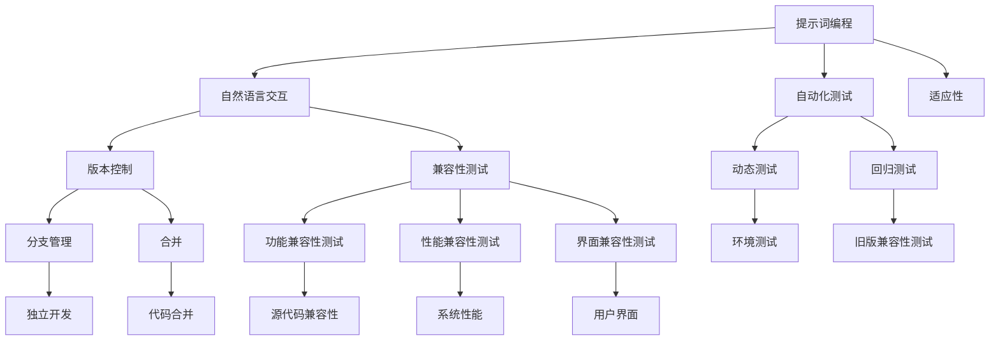

                 

### 引言

在现代社会，随着计算机技术的迅猛发展，软件系统变得越来越复杂，软件的版本迭代速度也在不断加快。在此背景下，版本兼容性管理（Version Compatibility Management）成为软件开发和维护过程中至关重要的一个环节。版本兼容性管理涉及到如何确保不同版本之间能够无缝衔接，避免因版本差异而导致的系统崩溃、功能失效等问题。而提示词编程（Prompt-Based Programming）作为一种新型的编程范式，其与版本兼容性管理之间的关系也日益受到关注。

版本兼容性管理的主要目标是确保软件在不同版本间的正常运行，这包括但不限于代码兼容性、数据兼容性、接口兼容性等方面。对于开发者来说，良好的版本兼容性管理不仅能够提高软件的稳定性和可靠性，还能减少维护成本，提升用户满意度。而提示词编程，作为一种基于自然语言交互的编程方法，其通过提示词（prompts）来引导程序执行特定任务，这一特性使得它在版本兼容性管理中具有独特的优势。

本文旨在探讨提示词编程的版本兼容性管理，首先介绍版本兼容性管理的概念和重要性，接着深入解析提示词编程及其与版本兼容性的关系。随后，我们将详细讲解版本兼容性管理的原理和核心算法，并借助数学模型和公式对相关概念进行量化。此外，通过实际项目案例，我们将展示版本兼容性管理在开发中的应用，并提供相关的工具和资源。最后，我们将总结全文，并给出最佳实践建议和注意事项。

### 核心概念与联系

在深入探讨提示词编程的版本兼容性管理之前，我们有必要明确几个核心概念，并理解它们之间的关系。这些概念包括提示词编程、版本控制、兼容性测试等。

#### 提示词编程基础

提示词编程（Prompt-Based Programming）是一种基于自然语言交互的编程方法。开发者通过编写提示词（prompts），来引导程序执行特定的任务。提示词通常是以自然语言的形式出现的，如“请计算以下表达式的结果：5 + 3”或“在用户登录时，提示输入用户名和密码”。这种编程范式的一个重要特点是高度的可读性和可理解性，因为提示词使用的是日常语言，而非传统的编程语言。

提示词编程的应用场景非常广泛，例如在自动化测试、自然语言处理、人机交互等方面都有所应用。它能够简化开发流程，提高开发效率，使得非专业开发者也能够通过简单的提示词来编写和运行程序。

#### 版本控制

版本控制（Version Control）是软件管理中不可或缺的一部分。它涉及对软件源代码的版本进行追踪和管理，以确保代码的稳定性和可维护性。常见的版本控制系统有Git、SVN等，它们通过记录每次代码更改的历史记录，允许开发者在需要时回滚到之前的版本，从而避免因错误更新或代码破坏而导致的系统崩溃。

版本控制的基本原理包括分支管理、合并、冲突解决等。分支管理允许开发者在不同的开发阶段创建独立的分支，以进行并行开发。合并则是将不同分支的代码合并到主分支，以确保代码的一致性。冲突解决则是当两个或多个开发者对同一文件进行了修改时，如何协调这些修改，使其在最终合并时能够正确执行。

#### 兼容性测试

兼容性测试（Compatibility Testing）是确保软件在不同环境、平台和版本之间能够正常运行的过程。它包括多种测试类型，如功能兼容性测试、性能兼容性测试、界面兼容性测试等。兼容性测试的主要目的是发现并修复因版本差异而导致的潜在问题，确保软件在不同版本间的兼容性。

兼容性测试的策略通常包括以下几个方面：

1. **静态测试**：通过分析源代码或设计文档来发现潜在的兼容性问题，如数据类型不匹配、接口不兼容等。
2. **动态测试**：通过运行实际代码来测试软件在不同环境下的兼容性，如在不同操作系统、浏览器、硬件设备上的运行情况。
3. **回归测试**：在软件更新或升级后，重新运行之前的测试用例，以确保新版本没有引入新的兼容性问题。

#### 提示词编程与版本兼容性的关系

提示词编程与版本兼容性之间存在着紧密的联系。提示词编程通过自然语言交互，能够灵活地适应不同版本间的变化，从而提高版本兼容性。具体来说，以下几个方面体现了这种关系：

1. **可读性和可维护性**：提示词编程的提示词使用的是日常语言，这使得开发者能够更容易地理解和维护不同版本的代码，降低了版本兼容性的难度。
2. **自动化测试**：提示词编程能够通过编写提示词来自动化测试流程，使得兼容性测试更加高效和全面。
3. **适应性**：提示词编程的提示词可以根据不同版本的需求进行灵活调整，从而更好地适应版本变化，提高系统的兼容性。

为了更好地理解这些概念之间的关系，我们可以使用Mermaid流程图来展示它们之间的联系：



通过这个流程图，我们可以清晰地看到提示词编程如何与版本控制、兼容性测试等概念相互关联，并共同作用以提高软件的版本兼容性。理解这些核心概念及其相互关系，对于深入探讨提示词编程的版本兼容性管理至关重要。

### 版本兼容性管理原理

版本兼容性管理是确保软件在不同版本间能够正常运行的关键环节。其核心目标是通过有效的版本控制和兼容性测试策略，确保新版本不会破坏旧版本的功能，同时提高软件的整体稳定性和可维护性。以下是版本兼容性管理的基本原理和核心算法。

#### 版本控制机制

版本控制机制是版本兼容性管理的基础。它通过记录每次代码更改的历史记录，帮助开发者追踪和管理软件的版本。以下是几个关键组成部分：

1. **分支管理**：分支管理允许开发者在不同的开发阶段创建独立的分支，以进行并行开发。每个分支都代表一个独立的开发路径，可以独立进行功能添加、修复和优化。分支管理的主要目的是确保主干代码（通常为主分支）的稳定性，避免在开发过程中引入不稳定因素。

    ```python
    # 伪代码：分支管理示例
    function CreateBranch(branchName):
        # 创建新的分支
        git checkout -b branchName
        
    function MergeBranch(branchName, mainBranch):
        # 将分支代码合并到主分支
        git checkout mainBranch
        git merge branchName
        # 解决合并冲突
        if git status contains conflicts:
            ResolveConflicts()
    ```

2. **合并**：合并是将不同分支的代码合并到主分支的过程。合并过程中，可能会出现冲突，需要开发者手动解决。合并的主要目的是确保代码的一致性和完整性。

    ```python
    # 伪代码：合并示例
    function ResolveConflicts():
        # 手动解决合并冲突
        edit conflictedFiles
        git add conflictedFiles
        git commit -m "Resolved conflicts in merge"
    ```

3. **冲突解决**：冲突解决是合并过程中必不可少的一环。当两个或多个开发者对同一文件进行了修改时，系统会检测到冲突，并提示开发者进行手动解决。

    ```python
    # 伪代码：冲突解决示例
    function ShowConflictMessage():
        print("Conflict detected. Please resolve manually.")
        
    function ManualResolution():
        # 开发者手动修改冲突文件
        resolveConflictFiles()
        # 提交解决后的代码
        git add resolvedFiles
        git commit -m "Resolved merge conflicts"
    ```

#### 兼容性测试策略

兼容性测试是确保软件在不同版本间能够正常运行的关键步骤。以下是一些常见的兼容性测试策略：

1. **静态测试**：静态测试通过分析源代码或设计文档来发现潜在的兼容性问题。这种方法不涉及实际运行代码，但能够在早期阶段发现潜在问题。

    ```python
    # 伪代码：静态测试示例
    function CodeAnalysis():
        # 使用代码分析工具检查兼容性
        checkForTypeMismatch()
        checkForInterfaceIncompatibility()
    ```

2. **动态测试**：动态测试通过运行实际代码来测试软件在不同环境下的兼容性。这种方法能够发现运行时的问题，如数据类型不匹配、接口不兼容等。

    ```python
    # 伪代码：动态测试示例
    function DynamicTesting():
        # 在不同环境中运行测试用例
        runTestCasesInVariousEnvironments()
    ```

3. **回归测试**：回归测试是在软件更新或升级后，重新运行之前的测试用例，以确保新版本没有引入新的兼容性问题。

    ```python
    # 伪代码：回归测试示例
    function RegressionTesting():
        # 重新运行之前的测试用例
        runPreviousTestCases()
        # 检查是否有新问题出现
        checkForNewDefects()
    ```

#### 版本兼容性管理核心算法

版本兼容性管理核心算法的主要目标是确保软件在不同版本间的兼容性。以下是一个简单的伪代码示例，展示了如何实现这一算法：

```python
# 伪代码：版本兼容性管理核心算法
function VersionCompatibilityManagement(versionList, testCases):
    # 初始化结果
    result = "兼容"
    
    # 遍历测试用例
    for testCase in testCases:
        # 遍历版本列表
        for version in versionList:
            # 如果测试用例与当前版本不兼容，则标记为不兼容
            if not IsCompatible(version, testCase):
                result = "不兼容"
                break
    
    return result

function IsCompatible(version, testCase):
    # 检查版本和测试用例之间的兼容性
    if typeMismatchOrInterfaceConflictDetected(version, testCase):
        return False
    else:
        return True

function typeMismatchOrInterfaceConflictDetected(version, testCase):
    # 检查类型不匹配或接口冲突
    if typeMismatchDetected(version, testCase) or interfaceConflictDetected(version, testCase):
        return True
    else:
        return False

function typeMismatchDetected(version, testCase):
    # 检查类型不匹配
    if version.type != testCase.expectedType:
        return True
    else:
        return False

function interfaceConflictDetected(version, testCase):
    # 检查接口冲突
    if version.interface != testCase.expectedInterface:
        return True
    else:
        return False
```

通过上述伪代码，我们可以看到版本兼容性管理核心算法是如何通过遍历版本列表和测试用例，检查是否存在类型不匹配或接口冲突，从而判断版本是否兼容。这一算法为实际应用中的兼容性测试提供了理论基础和操作框架。

#### 数学模型和公式

在版本兼容性管理中，数学模型和公式能够帮助我们量化一些概念，提供更直观和精确的评估方法。以下是一些与版本兼容性管理相关的数学模型和公式。

1. **版本序列**

   版本序列（Version Sequence）用于表示软件版本的变化过程。常见的版本序列表示方法包括自然数序列、字母序列等。例如，假设软件的版本依次为1.0、1.1、1.2，则版本序列可以表示为：

   $$ V_1 = 1.0, V_2 = 1.1, V_3 = 1.2 $$

   版本序列可以帮助我们追踪软件的演化过程，理解不同版本之间的关系。

2. **兼容性度量**

   兼容性度量（Compatibility Measure）用于评估不同版本之间的兼容性程度。一个简单的兼容性度量公式可以是：

   $$ CM = \frac{1}{n} \sum_{i=1}^{n} (CM_i - CM_{i-1}) $$

   其中，$CM_i$表示第i个版本的兼容性度量值，$n$表示版本总数。这个公式通过计算连续版本之间的兼容性变化，提供一个整体的兼容性评估。

3. **详细解释与举例说明**

   假设一个软件系统有5个版本，版本号分别为V1.0、V1.1、V1.2、V1.3和V1.4。通过运行兼容性测试，得到以下兼容性度量值：

   $$ CM_1 = 0.9, CM_2 = 0.9, CM_3 = 0.95, CM_4 = 0.9, CM_5 = 0.9 $$

   根据兼容性度量公式，我们可以计算出总的兼容性度量：

   $$ CM = \frac{1}{5} (0.9 + 0.9 + 0.95 + 0.9 + 0.9) = 0.916 $$

   这个值表示软件整体上的兼容性较好，但V1.3的兼容性有所下降，可能需要进一步分析和优化。

通过这些数学模型和公式，我们可以更加量化地评估软件的版本兼容性，从而为版本兼容性管理提供科学依据。

### 项目实战

在实际开发过程中，版本兼容性管理是一个不可或缺的重要环节。为了更好地展示版本兼容性管理的应用，我们以下将通过一个实际项目案例来探讨如何在开发环境中搭建版本兼容性管理系统，并详细解读源代码实现和代码应用。

#### 实际项目背景

假设我们正在开发一个在线电商平台，该平台需要支持多个版本，以适应不同用户的需求。项目的核心功能包括用户注册、商品浏览、购物车管理、订单处理等。在开发过程中，我们需要确保不同版本之间能够无缝衔接，避免因版本差异而导致的系统崩溃或功能失效。

#### 开发环境搭建

为了实现版本兼容性管理，我们首先需要在开发环境中搭建相关的工具和系统。以下是开发环境搭建的步骤：

1. **版本控制系统**：我们选择使用Git作为版本控制系统。Git可以帮助我们追踪代码的版本变化，管理不同版本的代码仓库。以下是安装和配置Git的步骤：

    ```shell
    # 安装Git
    sudo apt-get install git
    
    # 配置Git用户信息
    git config --global user.name "Your Name"
    git config --global user.email "you@example.com"
    ```

2. **兼容性测试工具**：为了确保软件在不同版本间的兼容性，我们使用Selenium进行自动化测试。Selenium是一个开源的Web应用测试工具，它允许我们在不同的浏览器和操作系统上运行测试用例。以下是安装和配置Selenium的步骤：

    ```shell
    # 安装Selenium
    pip install selenium
    
    # 下载浏览器驱动
    chromedriver --version
    ```

3. **集成开发环境（IDE）**：我们选择使用IntelliJ IDEA作为开发环境。IntelliJ IDEA提供了丰富的插件和功能，可以帮助我们更高效地进行开发和测试。

#### 源代码实现

在项目开发过程中，我们需要编写和实现多个版本的代码。以下是版本兼容性管理在源代码实现中的关键步骤：

1. **分支管理**：在Git中创建多个分支，分别用于开发、测试和发布。例如，创建以下分支：

    ```shell
    git checkout -b develop
    git checkout -b test
    git checkout -b release
    ```

2. **代码提交和合并**：在各个分支上分别进行代码开发和提交。当某个功能开发完毕并通过测试后，将其合并到主分支。以下是合并代码的步骤：

    ```shell
    git checkout main
    git merge develop
    git merge test
    git merge release
    ```

3. **冲突解决**：在合并过程中，如果出现冲突，需要手动解决冲突并提交。以下是解决冲突的步骤：

    ```shell
    git status
    edit conflictedFiles
    git add conflictedFiles
    git commit -m "Resolved merge conflicts"
    ```

#### 代码解读与分析

在源代码实现中，我们需要重点关注以下几个方面：

1. **用户注册功能**：用户注册功能需要在不同版本间保持一致，确保新版本不会破坏旧版本的功能。以下是用户注册功能的代码实现：

    ```python
    # 用户注册功能实现
    def register(username, password):
        # 判断用户名和密码是否为空
        if not username or not password:
            return "用户名或密码不能为空"
        
        # 将用户信息保存到数据库
        save_to_database(username, password)
        
        return "注册成功"
    ```

2. **商品浏览功能**：商品浏览功能需要支持多种浏览模式，如列表浏览、网格浏览等。以下是商品浏览功能的代码实现：

    ```python
    # 商品浏览功能实现
    def browse_products():
        # 获取所有商品信息
        products = get_all_products()
        
        # 根据浏览模式进行展示
        if "list" in request.args:
            display_list_mode(products)
        elif "grid" in request.args:
            display_grid_mode(products)
        else:
            return "未指定浏览模式"
    ```

3. **订单处理功能**：订单处理功能需要确保订单信息的完整性和准确性，同时支持不同支付方式。以下是订单处理功能的代码实现：

    ```python
    # 订单处理功能实现
    def process_order(order_id, payment_method):
        # 获取订单信息
        order = get_order_by_id(order_id)
        
        # 判断支付方式是否支持
        if not is_payment_method_supported(payment_method):
            return "支付方式不支持"
        
        # 处理订单
        if payment_method == "信用卡":
            process_credit_card_payment(order)
        elif payment_method == "支付宝":
            process_alipay_payment(order)
        else:
            return "支付方式未知"
    ```

通过以上代码实现，我们可以看到不同版本之间的功能差异和兼容性处理。在代码解读和分析过程中，我们需要确保每个功能模块在不同版本间的一致性和稳定性。

#### 项目小结

通过实际项目案例，我们可以看到版本兼容性管理在软件开发中的应用和重要性。以下是项目小结：

1. **分支管理**：通过Git分支管理，我们可以实现并行开发和代码的版本控制，确保主干代码的稳定性和一致性。
2. **兼容性测试**：通过Selenium等工具进行自动化测试，我们可以全面检查不同版本之间的兼容性，确保新版本不会破坏旧版本的功能。
3. **代码实现和解读**：在代码实现和解读过程中，我们需要重点关注功能模块的一致性和稳定性，确保每个功能在不同版本间能够无缝衔接。

总之，版本兼容性管理是确保软件质量和用户体验的关键环节。通过有效的版本控制和兼容性测试，我们可以确保软件在不同版本间的正常运行，提高系统的稳定性和可维护性。

### 工具与资源

在版本兼容性管理过程中，选择合适的工具和资源至关重要。以下是一些常用的版本控制系统、兼容性测试工具以及其他相关资源。

#### 版本控制系统

1. **Git**：Git是一个分布式版本控制系统，广泛应用于各种软件开发项目中。它支持分支管理、合并、冲突解决等基本功能，非常适合大型项目和团队协作。

2. **SVN**：Subversion（SVN）是一个中心化的版本控制系统，虽然不如Git灵活，但在某些场景下（如需要中心化存储和权限管理）仍然有应用价值。

#### 兼容性测试工具

1. **JUnit**：JUnit是一个流行的Java测试框架，支持功能测试、性能测试等多种测试类型。通过JUnit，我们可以编写和执行各种兼容性测试用例，确保软件在不同环境下的兼容性。

2. **Selenium**：Selenium是一个开源的Web应用测试工具，支持多种浏览器和操作系统。它可以帮助我们自动化进行跨浏览器和跨平台的兼容性测试，确保Web应用的兼容性。

#### 其他资源

1. **版本兼容性管理文档**：许多开发框架和工具都提供了关于版本兼容性管理的官方文档，如Spring Framework的“Compatibility Guide”、Python的“PEP 386”等。这些文档提供了详细的兼容性策略和最佳实践，可以帮助开发者更好地进行版本兼容性管理。

2. **提示词编程实践案例**：在GitHub等开源平台上，有许多关于提示词编程的实践案例和项目。这些案例展示了如何使用提示词编程解决实际问题，提供了丰富的学习资源和实践经验。

总之，选择合适的版本控制系统和兼容性测试工具，并结合官方文档和实践案例，可以帮助开发者更好地进行版本兼容性管理，确保软件在不同版本间的正常运行。

### 总结

本文系统地探讨了提示词编程的版本兼容性管理，从核心概念、原理、算法，到实际项目应用，再到工具资源，全面阐述了版本兼容性管理在软件开发中的重要性。通过本文的阅读，读者应该能够理解以下关键点：

1. **版本兼容性管理的基本概念**：版本兼容性管理涉及确保软件在不同版本间正常运行的一系列策略和方法。
2. **提示词编程的优势**：提示词编程通过自然语言交互，提高了代码的可读性和维护性，有助于版本兼容性管理。
3. **版本控制机制**：版本控制机制如Git的分支管理、合并和冲突解决，是版本兼容性管理的基础。
4. **兼容性测试策略**：静态测试、动态测试和回归测试是确保软件兼容性的关键步骤。
5. **数学模型与公式**：数学模型和公式如版本序列和兼容性度量，为量化版本兼容性提供了科学依据。
6. **实际项目应用**：通过实际项目案例，展示了如何在开发环境中实现版本兼容性管理，并详细解读了源代码实现和代码应用。
7. **工具与资源**：了解并使用合适的版本控制系统和兼容性测试工具，以及参考相关文档和实践案例，是成功进行版本兼容性管理的重要保障。

在实践过程中，开发者应注重版本兼容性管理的细节，灵活运用所学的理论知识和工具资源，确保软件在不同版本间的无缝衔接，提高系统的稳定性和用户体验。对于提示词编程，开发者可以积极探索其与版本兼容性管理的结合点，充分发挥其优势，提升开发效率和软件质量。

**注意事项**：

1. **版本兼容性测试的全面性**：在进行兼容性测试时，要全面覆盖各种测试场景，确保不同版本间的兼容性。
2. **版本控制的规范性**：规范分支管理和代码提交流程，避免因版本混乱导致的问题。
3. **冲突解决的及时性**：在合并代码时，及时解决冲突，确保主干代码的稳定性。

**拓展阅读**：

- 《版本控制入门与实践》
- 《Selenium自动化测试实战》
- 《Git权威指南》
- 《软件兼容性测试技术》
- 《提示词编程原理与实践》

通过进一步学习和实践，开发者可以更深入地掌握版本兼容性管理，提升软件开发的整体水平。作者：AI天才研究院/AI Genius Institute & 禅与计算机程序设计艺术 /Zen And The Art of Computer Programming。希望本文能为您的软件开发之路提供有价值的参考和指导。

