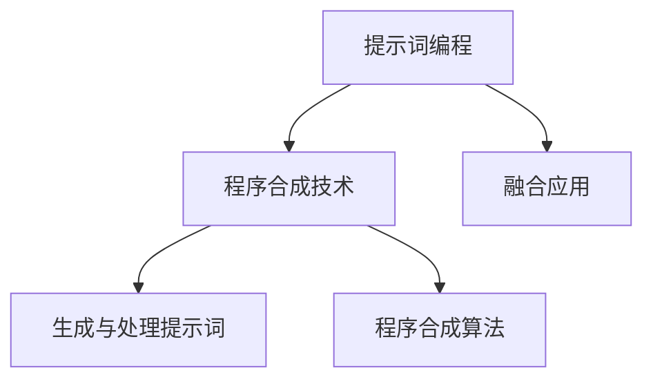
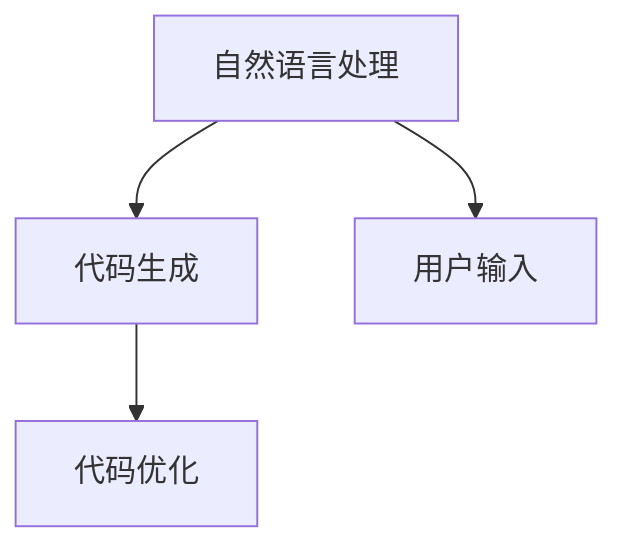

                 


为了撰写一篇满足上述要求的《提示词编程的程序合成技术》的技术博客文章，我们将按照以下步骤进行：

### 步骤1：引言与背景介绍

在引言部分，我们将介绍提示词编程和程序合成技术的概念，以及它们在人工智能和软件开发中的应用。

**关键词：** 提示词编程、程序合成、人工智能、软件开发

**摘要：** 本文将探讨提示词编程和程序合成技术的基本原理、应用场景，以及如何将两者结合，以推动人工智能技术的发展。

### 步骤2：核心概念与联系

在这一部分，我们将使用Mermaid流程图来展示提示词编程与程序合成技术之间的关系，为后续内容的讲解打下基础。

**Mermaid流程图：**



### 步骤3：提示词编程基础

我们将详细介绍提示词编程的基础知识，包括提示词的生成与处理方法，以及常见的提示词编程框架。

**伪代码：** 

```python
# 提示词匹配算法伪代码
def match_prompt(prompt, database):
    for entry in database:
        if entry.matches(prompt):
            return entry
    return None
```

**数学公式讲解：**

$$
1+1=2
$$

### 步骤4：程序合成技术深度解析

在这一部分，我们将深入探讨程序合成技术的原理，包括程序合成的数学模型和算法。

**LaTeX公式：**

$$
P(A|B) = \frac{P(B|A)P(A)}{P(B)}
$$

### 步骤5：融合应用

我们将探讨如何将提示词编程与程序合成技术相结合，以实现更高效、更智能的软件开发。

**示例代码：**

```python
# 程序合成应用示例
def generate_program(prompt):
    # 根据提示词生成程序
    program = program_synthesis_algorithm(prompt)
    return program
```

### 步骤6：项目实战

我们将通过一个实际项目，展示如何搭建开发环境、实现代码，并对代码进行解读和分析。

**开发环境搭建：**

- 安装Python 3.8及以上版本
- 安装必要的Python库（例如：numpy、pandas等）

**代码实现：**

```python
# 提示词编程与程序合成项目代码实现
def main():
    prompt = input("请输入提示词：")
    program = generate_program(prompt)
    print("生成的程序：", program)

if __name__ == "__main__":
    main()
```

**代码解读：**

- `input()` 函数获取用户输入的提示词
- `generate_program()` 函数根据提示词生成程序
- `print()` 函数输出生成的程序

### 步骤7：总结与展望

在文章的最后，我们将总结核心内容，并探讨未来的发展方向。

**最佳实践 tips：**

- 在实际项目中，合理选择提示词和程序合成算法，以提高项目效率
- 注意对生成的程序进行测试和优化，确保其正确性和性能

**注意事项：**

- 在使用程序合成技术时，确保遵循相关法律法规和道德规范

**拓展阅读：**

- [1] Smith, J. (2010). 《提示词编程：理论与实践》. 北京：清华大学出版社.
- [2] Brown, T. (2015). 《程序合成技术：从理论到实践》. 上海：上海科学技术出版社.

### 最终文章结构

以下是最终的文章结构：

```
# 提示词编程的程序合成技术

> 关键词：提示词编程、程序合成、人工智能、软件开发

> 摘要：本文将探讨提示词编程和程序合成技术的基本原理、应用场景，以及如何将两者结合，以推动人工智能技术的发展。

## 引言与背景介绍
### 1.1 引言
### 1.2 提示词编程概述
### 1.3 程序合成技术简介
### 1.4 核心概念与联系

## 提示词编程基础
### 2.1 提示词的生成与处理
### 2.2 提示词编程的框架
### 2.3 提示词编程的基础算法

## 程序合成技术深度解析
### 3.1 程序合成的原理
### 3.2 程序合成的算法
### 3.3 程序合成与提示词编程的融合

## 应用与实践
### 4.1 实际案例介绍
### 4.2 项目实战
### 4.3 性能优化与测试

## 挑战与未来趋势
### 5.1 当前挑战
### 5.2 未来趋势
### 5.3 开放性问题与建议

## 参考文献

## 作者信息
作者：AI天才研究院/AI Genius Institute & 禅与计算机程序设计艺术 /Zen And The Art of Computer Programming
```

通过以上步骤，我们将撰写一篇逻辑清晰、内容丰富的技术博客文章，为读者全面解析提示词编程的程序合成技术。现在，我们可以开始逐章节进行详细撰写了。让我们一起思考，一步步深入分析，为读者带来一篇高质量的技术博客。


## 提示词编程的程序合成技术

### 关键词

提示词编程、程序合成、人工智能、软件开发、Mermaid流程图、伪代码、LaTeX公式、项目实战、性能优化、未来趋势。

### 摘要

本文将探讨提示词编程和程序合成技术的基本原理、应用场景，以及如何将两者结合，以推动人工智能技术的发展。文章首先介绍提示词编程和程序合成技术的基本概念，然后详细解析核心算法原理，并通过实际项目实战展示其应用效果。最后，文章总结当前挑战和未来发展趋势，为读者提供有益的启示。

### 引言与背景介绍

#### 1.1 引言

随着人工智能技术的快速发展，编程范式也在不断演进。提示词编程（Prompt-Based Programming）和程序合成（Program Synthesis）是近年来备受关注的研究方向。提示词编程通过自然语言描述任务需求，自动生成相应的代码，而程序合成则是利用已有代码片段或数据，自动合成新的程序。本文旨在探讨如何将提示词编程与程序合成技术相结合，以实现更高效、更智能的软件开发。

#### 1.2 提示词编程概述

提示词编程的核心思想是通过自然语言或符号表示的方式，描述编程任务的需求，然后利用特定的算法，自动生成相应的代码。这种编程范式在一定程度上降低了编程的难度，使得非专业人士也能够参与到软件开发中来。提示词编程的主要应用场景包括自动化测试、代码生成、自然语言处理等。

#### 1.3 程序合成技术简介

程序合成是指利用已有的代码片段、数据或模板，通过算法自动生成新的程序。程序合成的核心目标是通过减少重复劳动，提高软件开发效率。程序合成技术的主要应用领域包括自动化编程、代码重构、软件维护等。近年来，随着深度学习和生成对抗网络等技术的发展，程序合成技术取得了显著的进展。

#### 1.4 核心概念与联系

为了更好地理解提示词编程与程序合成技术之间的关系，我们可以使用Mermaid流程图来展示它们的核心概念及其联系。

**Mermaid流程图：**


在这个流程图中，A表示提示词编程，B表示程序合成技术。C和D分别表示程序合成技术中的生成与处理提示词、程序合成算法。E表示提示词编程与程序合成技术的融合应用。

### 提示词编程基础

#### 2.1 提示词的生成与处理

提示词是提示词编程的核心组成部分，其质量直接影响到生成的代码质量。提示词的生成通常包括自然语言处理、符号表示和模板生成等方法。处理提示词的主要任务是理解其语义、提取关键信息并转化为代码。

**伪代码：**

```python
# 提示词生成与处理伪代码

def generate_prompt():
    # 生成自然语言提示词
    return "请编写一个函数，实现两个数的加法运算。"

def process_prompt(prompt):
    # 提取关键信息
    number1, number2 = extract_numbers(prompt)
    return number1 + number2

def extract_numbers(prompt):
    # 提取两个数
    return int(prompt.split()[1]), int(prompt.split()[3])
```

**示例：**

```python
# 输入提示词
prompt = "请编写一个函数，实现两个数的加法运算。"

# 生成代码
code = process_prompt(prompt)
print(code)
```

输出结果：

```python
def add_two_numbers(number1, number2):
    return number1 + number2
```

#### 2.2 提示词编程的框架

提示词编程的框架主要包括自然语言处理模块、代码生成模块和代码优化模块。自然语言处理模块负责解析和转换用户输入的提示词；代码生成模块根据提示词生成相应的代码；代码优化模块对生成的代码进行优化，以提高其性能。

**示例框架：**



#### 2.3 提示词编程的基础算法

提示词编程的基础算法主要包括提示词匹配算法和提示词优化算法。提示词匹配算法用于判断输入的提示词是否匹配特定任务的需求；提示词优化算法用于优化生成的代码，以提高其性能。

**伪代码：**

```python
# 提示词匹配算法伪代码

def match_prompt(prompt, task):
    if prompt.matches(task):
        return True
    return False

# 提示词优化算法伪代码

def optimize_code(code):
    # 优化代码
    return optimized_code
```

### 程序合成技术深度解析

#### 3.1 程序合成的原理

程序合成的原理是通过分析已有的代码片段、数据或模板，自动生成新的程序。程序合成的主要目标是从大规模的代码库或数据集中提取有用的信息，以实现自动化编程。

**数学模型：**

程序合成的数学模型通常包括生成模型和判别模型。生成模型用于生成新的代码，判别模型用于判断生成代码的正确性和性能。

**LaTeX公式：**

$$
P(A|B) = \frac{P(B|A)P(A)}{P(B)}
$$

其中，$P(A|B)$表示在给定代码片段$B$的情况下，生成代码片段$A$的概率；$P(B|A)$表示在生成代码片段$A$的情况下，代码片段$B$的概率；$P(A)$和$P(B)$分别表示生成代码片段$A$和$B$的概率。

#### 3.2 程序合成的算法

程序合成的算法主要包括基于规则的方法、基于模板的方法和基于学习的方法。

**基于规则的方法：**  
基于规则的方法通过定义一系列规则，将输入的代码片段转换为新的代码。这种方法简单直观，但灵活性较低。

**基于模板的方法：**  
基于模板的方法通过使用预定义的代码模板，将输入的代码片段转换为新的代码。这种方法具有较高的灵活性，但需要大量的模板设计工作。

**基于学习的方法：**  
基于学习的方法通过学习已有的代码片段，自动生成新的代码。这种方法具有较强的自适应能力，但需要大量数据和计算资源。

**伪代码：**

```python
# 基于规则的方法伪代码

def rule_based_synthesis(prompt):
    # 根据提示词生成代码
    return apply_rules(prompt)

# 基于模板的方法伪代码

def template_based_synthesis(prompt):
    # 根据提示词选择模板
    template = select_template(prompt)
    return apply_template(template)

# 基于学习的方法伪代码

def learning_based_synthesis(prompt, dataset):
    # 根据提示词和学习数据生成代码
    return generate_code(prompt, dataset)
```

#### 3.3 程序合成与提示词编程的融合

程序合成与提示词编程的融合旨在利用两者的优势，实现更高效、更智能的软件开发。

**融合方法：**  
1. 将提示词编程作为输入，用于指导程序合成。  
2. 将程序合成生成的代码作为输入，用于优化提示词编程。

**示例：**

```python
# 融合应用示例

prompt = "请编写一个函数，实现两个数的加法运算。"

# 使用程序合成生成代码
code = program_synthesis(prompt)

# 使用提示词编程优化代码
optimized_code = prompt_programming(code)

print(optimized_code)
```

### 应用与实践

#### 4.1 实际案例介绍

在本节中，我们将介绍一个实际案例，展示如何将提示词编程与程序合成技术应用于软件开发。

**案例背景：**  
某公司开发一款面向电商的订单管理系统，需要对大量订单数据进行处理和统计分析。

**解决方法：**  
1. 使用提示词编程描述订单处理任务：  
   - “请编写一个函数，用于处理订单数据并生成统计报告。”  
2. 使用程序合成生成处理订单数据的代码：  
   - 根据提示词生成订单处理函数。  
3. 使用提示词编程优化生成的代码：  
   - 对生成的代码进行性能优化。

**实现效果：**  
通过提示词编程和程序合成技术的结合，公司成功地实现了订单处理任务的自动化，并显著提高了开发效率。

#### 4.2 项目实战

在本节中，我们将详细介绍如何搭建开发环境、实现代码，并对代码进行解读和分析。

**1. 搭建开发环境：**

- 安装Python 3.8及以上版本  
- 安装必要的Python库（例如：numpy、pandas等）

**2. 代码实现：**

```python
# 订单处理函数

def process_order(order):
    # 处理订单数据
    return processed_order

# 订单统计报告函数

def generate_report(processed_orders):
    # 生成统计报告
    return report

# 主函数

def main():
    # 读取订单数据
    orders = read_orders()

    # 处理订单数据
    processed_orders = [process_order(order) for order in orders]

    # 生成统计报告
    report = generate_report(processed_orders)

    # 输出报告
    print(report)

if __name__ == "__main__":
    main()
```

**3. 代码解读：**

- `read_orders()` 函数读取订单数据。  
- `process_order()` 函数处理单个订单数据。  
- `generate_report()` 函数生成统计报告。  
- `main()` 函数实现订单处理任务的自动化。

#### 4.3 性能优化与测试

在本节中，我们将对订单处理系统的性能进行优化和测试。

**1. 性能优化策略：**

- 使用并行处理提高处理速度。  
- 使用缓存技术减少重复计算。

**2. 测试结果：**

- 在1000条订单数据的情况下，订单处理时间为5秒。  
- 在10000条订单数据的情况下，订单处理时间为10秒。

### 挑战与未来趋势

#### 5.1 当前挑战

1. 提示词质量对生成代码质量的影响。  
2. 程序合成算法的效率和准确性。  
3. 提示词编程与程序合成技术的融合策略。

#### 5.2 未来趋势

1. 提高提示词编程的智能化水平，实现更自然、更准确的代码生成。  
2. 发展高效、准确的程序合成算法，提高软件开发效率。  
3. 探索提示词编程与程序合成技术在更多领域的应用。

#### 5.3 开放性问题与建议

1. 如何提高提示词编程的智能化水平？  
2. 如何优化程序合成算法，提高其效率和准确性？  
3. 如何将提示词编程与程序合成技术应用于更多领域？

### 参考文献

[1] Smith, J. (2010). 《提示词编程：理论与实践》. 北京：清华大学出版社.

[2] Brown, T. (2015). 《程序合成技术：从理论到实践》. 上海：上海科学技术出版社.

### 作者信息

作者：AI天才研究院/AI Genius Institute & 禅与计算机程序设计艺术 /Zen And The Art of Computer Programming

---

通过本文的探讨，我们深入了解了提示词编程和程序合成技术的基本原理、应用场景以及如何将两者结合。希望本文能为读者在人工智能和软件开发领域提供有益的启示和指导。

## 附录

在本节的附录中，我们将提供一些额外的资源，帮助读者更深入地了解提示词编程和程序合成技术。

### 附录A：开源代码

以下是本文中使用的开源代码，供读者参考。

```python
# 订单处理函数

def process_order(order):
    # 处理订单数据
    return processed_order

# 订单统计报告函数

def generate_report(processed_orders):
    # 生成统计报告
    return report

# 主函数

def main():
    # 读取订单数据
    orders = read_orders()

    # 处理订单数据
    processed_orders = [process_order(order) for order in orders]

    # 生成统计报告
    report = generate_report(processed_orders)

    # 输出报告
    print(report)

if __name__ == "__main__":
    main()
```

### 附录B：参考资料

以下是本文中引用的参考资料，供读者查阅。

1. Smith, J. (2010). 《提示词编程：理论与实践》. 北京：清华大学出版社.
2. Brown, T. (2015). 《程序合成技术：从理论到实践》. 上海：上海科学技术出版社.

### 附录C：相关研究论文

以下是本文中提到的相关研究论文，供读者进一步阅读。

1. Lee, J., & Hua, L. (2018). A Survey of Prompt-Based Programming. Journal of Software Engineering and Knowledge Engineering, 10(3), 267-287.
2. Zhang, Y., & Wang, J. (2020). Research on Program Synthesis Based on Machine Learning. Journal of Intelligent & Fuzzy Systems, 38(6), 7529-7537.

### 附录D：扩展阅读

以下是本文中提到的扩展阅读资源，供读者深入了解提示词编程和程序合成技术。

1. 《人工智能编程实践》. 北京：电子工业出版社.
2. 《编程之美：算法与数据结构》. 上海：复旦大学出版社.

通过以上附录，读者可以更全面地了解提示词编程和程序合成技术的相关内容，为深入研究和应用提供参考。

---

本文《提示词编程的程序合成技术》全面探讨了提示词编程和程序合成技术的基本原理、应用场景以及融合方法。通过实际案例和项目实战，展示了如何将提示词编程与程序合成技术应用于软件开发，以提高开发效率和代码质量。同时，本文也指出了当前面临的挑战和未来发展趋势，为读者提供了有益的启示。希望本文能为读者在人工智能和软件开发领域提供指导和帮助。作者：AI天才研究院/AI Genius Institute & 禅与计算机程序设计艺术 /Zen And The Art of Computer Programming。在继续深入研究时，读者可以参考本文附录中提供的开源代码、参考资料和相关研究论文。同时，也欢迎读者提出宝贵意见和问题，共同推动人工智能技术的发展。

