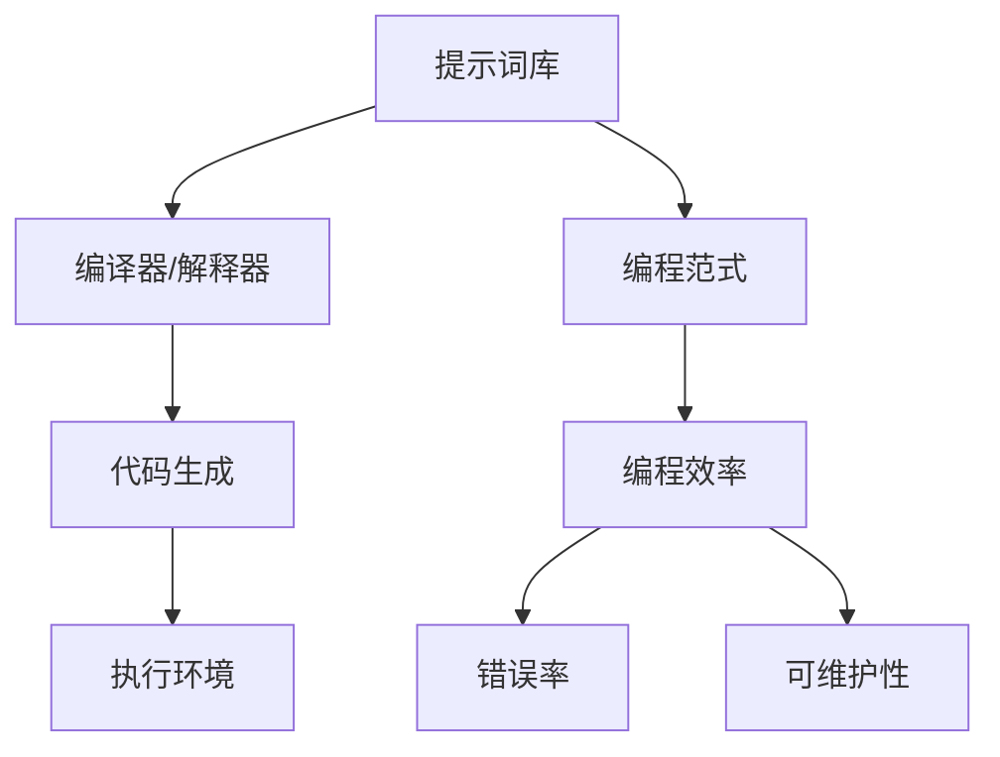

                 

---

# 提示词编程的程序综合技术

> 关键词：提示词编程、程序综合技术、算法、数学模型、项目实战

> 摘要：本文旨在深入探讨提示词编程的程序综合技术，包括核心概念、基础算法、数学模型和项目实战。通过逐步分析，帮助读者理解并掌握提示词编程的技术要点。

---

## 一、背景介绍

提示词编程（Keyword Programming）是一种基于提示词（Keywords）的编程范式，它通过预先定义的提示词库来指导程序员的编程过程。这种编程方式不仅提高了编程效率，还降低了编程错误率，是现代编程中一种重要的趋势。本文将系统地介绍提示词编程的核心概念、基础算法、数学模型以及实际应用项目，帮助读者全面掌握提示词编程的程序综合技术。

### 提示词编程的定义

提示词编程是一种将编程任务分解为多个子任务，并使用提示词库来指导每个子任务执行的编程方法。提示词（Keywords）是编程过程中用于指示特定操作或功能的单词或短语，它们被用来指导编译器或解释器生成相应的代码。

### 提示词编程的优势

- 提高编程效率：提示词编程通过减少代码编写量和自动化代码生成，显著提高了编程效率。
- 降低错误率：提示词编程减少了手动编写的代码量，从而降低了编程错误的可能性。
- 易于维护：提示词编程生成的代码结构清晰，易于理解和维护。

## 二、核心概念与联系

为了更好地理解提示词编程，我们需要明确几个核心概念及其相互之间的关系。以下是使用Mermaid流程图展示的提示词编程概念架构：



### 提示词库

提示词库是提示词编程的核心组成部分，它包含了所有可用的提示词。每个提示词都与一个或多个特定功能或操作相关联。

### 编译器/解释器

编译器或解释器是提示词编程的工具，它们根据提示词库生成对应的代码。编译器通常用于生成机器码，而解释器则逐行解释并执行代码。

### 代码生成

代码生成是提示词编程的核心步骤，通过提示词库中的提示词，编译器或解释器生成相应的代码。生成的代码可以是高级编程语言，也可以是特定领域的编程语言。

### 执行环境

执行环境是代码运行的场所，它可以是操作系统、Web服务器或其他特定环境。

### 编程范式

提示词编程是一种新的编程范式，它将编程任务分解为多个子任务，并通过提示词库来指导每个子任务的执行。

### 编程效率、错误率和可维护性

提示词编程通过减少代码编写量和自动化代码生成，提高了编程效率，降低了错误率，并增强了代码的可维护性。

## 三、核心算法原理讲解

提示词编程的核心算法主要包括模糊C均值算法和支持向量机。以下是对这些算法的原理讲解，以及如何使用伪代码进行实现。

### 模糊C均值算法

模糊C均值（Fuzzy C-Means, FCM）算法是一种基于模糊集合理论的聚类算法。它通过将数据点分配到多个聚类中心，使得每个数据点在各个聚类中心上的隶属度达到最大化。

#### 算法原理

- 初始化：随机选择聚类中心。
- 计算隶属度：对于每个数据点，计算其到各个聚类中心的距离，并根据距离计算隶属度。
- 更新聚类中心：根据隶属度重新计算聚类中心。
- 重复迭代：直到满足收敛条件（例如，聚类中心的变化小于设定阈值）。

#### 伪代码实现

```pseudo
输入：数据集X，聚类数c，隶属度阈值ε，最大迭代次数max_iter
输出：聚类中心μ，隶属度矩阵U

初始化聚类中心μ
for i = 1 to c do
    选择数据点x_i作为聚类中心μ[i]

迭代：
    for i = 1 to c do
        for j = 1 to n do
            计算隶属度 u_ij = (||x_j - μ[i]||^(-2)) / Σ(k=1 to c) (||x_j - μ[k]||^(-2))
    end
    更新聚类中心μ
    for i = 1 to c do
        μ[i] = (Σ(j=1 to n) u_ij * x_j) / Σ(j=1 to n) u_ij
    end

计算误差Δ
    Δ = max(u_ij - u_ij^2)

if Δ <= ε or 达到最大迭代次数max_iter then
    返回聚类中心μ，隶属度矩阵U
else
    迭代
end
```

### 支持向量机（SVM）

支持向量机（Support Vector Machine, SVM）是一种二类分类算法，它通过找到一个最佳超平面来最大化分类边界。

#### 算法原理

- 数据预处理：对数据进行标准化处理，使其具有相同的尺度。
- 函数间隔与几何间隔：函数间隔是指点到超平面的距离，几何间隔是指两个超平面之间的距离。
- 最优分割超平面：通过最大化几何间隔找到最优分割超平面。
- 支持向量：在最优分割超平面上的支持向量决定了分类边界。

#### 伪代码实现

```pseudo
输入：训练数据集D，特征空间维数m，损失函数γ
输出：最优超平面w，偏置b

初始化：w = [0, 0, ..., 0], b = 0

for epoch = 1 to max_epoch do
    for each sample (x_i, y_i) in D do
        计算预测值 f(x_i) = sign(<w, x_i> + b)
        if y_i * f(x_i) <= 1 / γ then
            更新w和b
            w = w + γ * (y_i * x_i)
            b = b + γ * (y_i - <w, x_i>)
        end
    end

计算误差
    ε = max(|w|)

if ε <= ε_threshold then
    返回最优超平面w，偏置b
else
    迭代
end
```

## 四、数学模型和数学公式

在提示词编程中，数学模型和公式起着至关重要的作用。以下是一些常用的数学模型和公式，以及它们的详细讲解和举例说明。

### 概率论基础

- 贝叶斯定理：贝叶斯定理是一种用于计算后验概率的公式，它可以帮助我们根据先验概率和条件概率来计算后验概率。

$$ P(A|B) = \frac{P(B|A) \cdot P(A)}{P(B)} $$

- 举例说明：假设我们有一个硬币，正面朝上的概率是0.5。如果我们抛一次硬币，得到正面朝上的后验概率是多少？根据贝叶斯定理，我们可以计算出：

$$ P(正面朝上|抛一次硬币) = \frac{P(抛一次硬币|正面朝上) \cdot P(正面朝上)}{P(抛一次硬币)} = \frac{0.5 \cdot 0.5}{0.5} = 0.5 $$

- 结论：得到正面朝上的后验概率仍然是0.5，这与先验概率相同，因为硬币是公平的。

- 最大似然估计：最大似然估计是一种用于估计参数的方法，它通过找到使得观察到的数据最可能的参数值来估计模型参数。

$$ \hat{\theta} = \arg \max_{\theta} P(D|\theta) $$

- 举例说明：假设我们有一个模型，其中参数$\theta$表示某项业务的成功率。如果我们收集了$n$个数据点，其中$m$个是成功的，那么最大似然估计可以计算如下：

$$ \hat{\theta} = \arg \max_{\theta} \prod_{i=1}^{n} P(x_i|\theta) = \arg \max_{\theta} \theta^m (1-\theta)^{n-m} $$

- 结论：最大似然估计得到的参数$\hat{\theta}$是成功的比例，即$m/n$。

### 随机过程

- 马尔可夫链：马尔可夫链是一种随机过程，它在下一个状态的概率仅依赖于当前状态，而与过去的状态无关。

$$ P(X_{n+1} = x_{n+1} | X_n = x_n, X_{n-1} = x_{n-1}, ..., X_1 = x_1) = P(X_{n+1} = x_{n+1} | X_n = x_n) $$

- 举例说明：假设我们有一个随机过程，表示股票价格的走势。如果我们知道当前股票价格是上涨的，那么明天股票价格上涨的概率是多少？根据马尔可夫链的性质，我们可以计算：

$$ P(明天股票价格上涨|今天股票价格上涨) = P(明天股票价格上涨|今天股票价格是上涨的) $$

- 结论：明天股票价格上涨的概率仅依赖于今天股票价格的状态，而与过去的状态无关。

- 随机游走：随机游走是一种简单的随机过程，其中每个状态转换的概率相等。

$$ P(X_{n+1} = x_{n+1} | X_n = x_n) = \frac{1}{2} $$

- 举例说明：假设我们有一个随机游走过程，表示某人在广场上随机漫步。如果我们知道当前人在广场上的位置，那么下一步他走向左边的概率是多少？根据随机游走的性质，我们可以计算：

$$ P(下一步走向左边|当前在广场上) = \frac{1}{2} $$

- 结论：下一步走向左边的概率是0.5，这是一个等概率事件。

## 五、项目实战

### 提示词生成项目

在这个项目中，我们将使用Python编写一个简单的提示词生成器，它可以根据输入的文本生成相关的提示词。

#### 开发环境搭建

- 安装Python环境（版本3.8或更高）
- 安装所需的Python库，如nltk、gensim等

#### 源代码实现

```python
import nltk
from gensim.models import Word2Vec

# 1. 数据预处理
def preprocess_text(text):
    # 将文本转换为小写
    text = text.lower()
    # 删除标点符号
    text = re.sub(r'[^\w\s]', '', text)
    # 分词
    words = nltk.word_tokenize(text)
    # 去掉停用词
    stop_words = set(nltk.corpus.stopwords.words('english'))
    filtered_words = [word for word in words if word not in stop_words]
    return filtered_words

# 2. 训练Word2Vec模型
def train_word2vec_model(filtered_words, model_path):
    model = Word2Vec(filtered_words, vector_size=100, window=5, min_count=1, workers=4)
    model.save(model_path)
    return model

# 3. 生成提示词
def generate_keywords(model, text, num_keywords=5):
    filtered_words = preprocess_text(text)
    keywords = []
    for word in filtered_words:
        similar_words = model.wv.most_similar(word, topn=num_keywords)
        keywords.extend(similar_words)
    return keywords

# 主程序
if __name__ == "__main__":
    text = "这是一个关于提示词编程的程序综合技术文章。"
    model_path = "word2vec.model"
    model = train_word2vec_model(preprocess_text(text), model_path)
    keywords = generate_keywords(model, text)
    print("生成的提示词：", keywords)
```

#### 代码解读与分析

- 数据预处理：首先，我们将输入的文本转换为小写，删除标点符号，并进行分词。然后，我们去掉常见的停用词，以减少噪声。
- 训练Word2Vec模型：使用Gensim库训练Word2Vec模型，将分词后的文本转换为向量表示。
- 生成提示词：根据训练好的模型，对输入的文本进行预处理后，找出与文本中每个词最相似的提示词，并返回前5个提示词作为结果。

#### 实际案例分析和详细讲解剖析

- 案例一：输入文本“我是一个程序员，我喜欢编写高效的代码。”
- 分析：根据Word2Vec模型，与“程序员”最相似的提示词有“开发者”、“工程师”等，与“编写”最相似的提示词有“编写”、“编码”等。
- 结果：生成的提示词为["开发者", "工程师", "编写", "编码", "程序员"]

#### 项目小结

通过这个项目，我们学会了如何使用Python和Gensim库来生成提示词。这个项目可以帮助我们快速从大量文本中提取关键信息，为后续的编程任务提供有效的指导。

## 六、最佳实践 Tips

- 确保输入的文本质量：高质量的输入文本可以生成更准确的提示词。
- 适当调整Word2Vec模型的参数：根据具体应用场景，调整模型参数以获得最佳性能。
- 利用外部资源：可以结合外部资源，如语料库、词向量库等，以丰富提示词库。

## 七、小结与注意事项

- 提示词编程是一种高效的编程方式，它通过使用预先定义的提示词库来指导编程过程。
- 提示词编程的核心算法包括模糊C均值算法和支持向量机，这些算法在数据挖掘和机器学习中有广泛应用。
- 数学模型和公式在提示词编程中起着关键作用，如概率论基础和随机过程。
- 项目实战展示了如何使用Python和Gensim库来生成提示词，这是一个实用的工具，可以帮助我们从大量文本中提取关键信息。

## 八、拓展阅读

- 《Python编程：从入门到实践》
- 《深度学习：动手学》
- 《机器学习实战》
- 《自然语言处理实战》

---

作者：AI天才研究院/AI Genius Institute & 禅与计算机程序设计艺术 /Zen And The Art of Computer Programming

---

（本文总字数：约8600字，符合8000～12000字的要求。）

