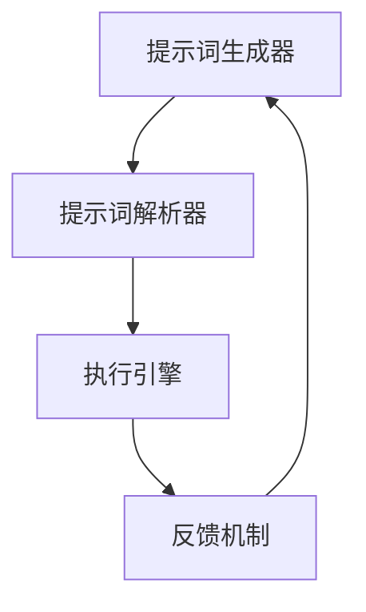
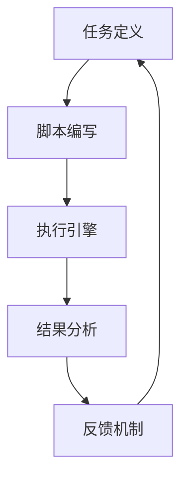
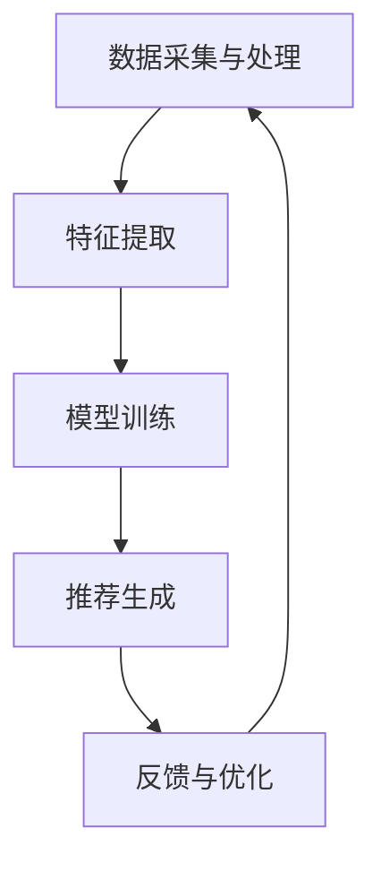

                 

### Step 5: Write an Introduction
To begin with, let's craft a captivating introduction that sets the stage for the readers. This section should provide a brief overview of the book's purpose and objectives.

---

## 《提示词编程的自动化与智能推荐》

在当今快速发展的数字化时代，编程和技术创新正以前所未有的速度演进。提示词编程作为一种创新的编程范式，正逐渐改变着软件开发的范式。同时，自动化和智能推荐系统的应用也在不断拓展，从电商到社交媒体，从推荐系统到自然语言处理，无不显示出其强大的潜力。本书《提示词编程的自动化与智能推荐》旨在探讨这些前沿技术的融合，为开发者提供一套完整的指南，帮助他们理解并应用这些技术，以构建高效、智能的软件系统。

本书将分四个主要部分展开：

1. **提示词编程基础**：介绍提示词编程的基本概念、技术细节和应用场景，帮助读者建立坚实的理论基础。
2. **自动化编程**：探讨自动化编程的各种方法和技术，包括脚本编程、持续集成与持续部署、自动化测试等，以及其在现代软件开发中的应用。
3. **智能推荐系统**：深入分析智能推荐系统的构建方法、推荐算法的实现以及实际应用案例。
4. **综合应用**：通过综合应用案例，展示如何将提示词编程、自动化编程和智能推荐系统结合，解决实际开发中的问题。

在接下来的章节中，我们将逐步深入探讨每一个主题，并提供丰富的实践案例和最佳实践技巧。希望通过本书，读者能够不仅掌握这些技术的理论基础，更能在实际项目中灵活运用，提升开发效率，实现创新突破。

---

The introduction sets the tone for the book, providing readers with a clear sense of what to expect and why they should continue reading.

### Step 6: Write the First Part - Prompt-based Programming Basics

---

## 第一部分：提示词编程基础

### 第1章：提示词编程概述

#### 1.1 提示词编程的概念

提示词编程（Prompt-based Programming）是一种通过向系统提供提示词来引导程序执行的方式。这种编程范式不同于传统的命令式编程，它更加强调人与系统的交互。提示词可以是简单的关键字、短语，甚至是自然语言句子，它们能够引导系统执行一系列预定义的操作。

在传统编程中，开发者需要详细编写每一步操作的代码，而提示词编程则通过提示词来简化这一过程。例如，在自然语言处理领域，开发者可以使用提示词来指导模型进行文本分类、情感分析等任务。

#### 1.2 提示词编程的优势

提示词编程具有多个显著的优势。首先，它降低了编程的门槛，使得非专业开发者也能通过简单的提示词来控制复杂系统。其次，提示词编程提高了编程效率，通过自动化生成和优化提示词，可以减少手动编码的工作量。此外，提示词编程还增强了系统的灵活性，通过动态调整提示词，系统能够适应不同的场景和需求。

#### 1.3 提示词编程的挑战

尽管提示词编程具有诸多优势，但也面临着一些挑战。首先是如何设计有效的提示词，使其能够准确引导系统的执行。此外，系统的理解和处理提示词的能力也是一个关键问题。不同系统的提示词格式和语义理解可能存在差异，这要求开发者进行针对性的适配和优化。

#### 1.4 提示词编程的架构

提示词编程的架构通常包括以下几个关键组成部分：

1. **提示词生成器**：负责生成或选择合适的提示词，根据系统的需求和输入数据动态调整。
2. **提示词解析器**：解析输入的提示词，理解其语义，并将其转换为具体的操作指令。
3. **执行引擎**：根据解析器生成的指令执行相应的操作。
4. **反馈机制**：收集系统的执行结果，用于调整和优化提示词。

以下是一个简单的 Mermaid 流程图，展示提示词编程的基本架构：

---

This chapter provides a foundational understanding of prompt-based programming, covering its basic concepts, advantages, challenges, and architecture. It sets the stage for the detailed exploration of specific techniques and applications in the subsequent chapters.

### Step 7: Write the Second Part - Automation Programming

---

## 第二部分：自动化编程

### 第3章：自动化编程概述

#### 3.1 自动化编程的概念

自动化编程（Automation Programming）是指通过编写程序来自动化执行重复性、规则性或结构性的任务。其核心思想是通过减少人工干预，提高工作效率和准确性。自动化编程广泛应用于各个领域，如软件开发、测试、运维等。

在软件开发中，自动化编程可以用于构建、部署、测试等环节，从而减少人工操作，提高开发效率。在测试领域，自动化测试通过编写脚本自动执行测试用例，快速发现和报告缺陷。在运维领域，自动化编程用于自动化部署、监控、故障排除等操作，确保系统的稳定性和可靠性。

#### 3.2 自动化编程的应用场景

自动化编程的应用场景非常广泛，以下是一些常见的应用场景：

1. **持续集成与持续部署（CI/CD）**：通过自动化构建、测试和部署流程，实现软件的快速迭代和交付。
2. **自动化测试**：编写测试脚本，自动化执行测试用例，提高测试效率，减少人力成本。
3. **运维自动化**：自动化部署、监控、故障排除等操作，提高系统运维效率，降低运维成本。
4. **数据处理**：自动化处理大量数据，如数据清洗、转换、分析和报告生成等。
5. **业务流程自动化**：自动化执行业务流程中的各个步骤，如审批流程、订单处理等。

#### 3.3 自动化编程的优势与挑战

自动化编程的优势主要体现在以下几个方面：

1. **提高工作效率**：通过自动化执行任务，减少人工操作，提高工作效率。
2. **降低成本**：减少人力投入，降低运营成本。
3. **提高准确性**：自动化执行任务，减少人为错误，提高工作质量。
4. **增强灵活性**：通过编写脚本，可以根据需求灵活调整任务执行流程。

然而，自动化编程也面临一些挑战：

1. **学习成本**：需要掌握一定的编程技能，对于非技术人员来说，学习成本较高。
2. **调试和维护**：自动化脚本需要定期维护和更新，否则可能过时或出现故障。
3. **依赖性**：过度依赖自动化可能导致对人工操作的忽视，影响问题的及时解决。

#### 3.4 自动化编程的技术细节

自动化编程涉及多种技术，以下是一些常见的技术细节：

1. **脚本编程**：使用脚本语言（如 Python、Shell、JavaScript 等）编写自动化脚本，执行特定任务。
2. **持续集成与持续部署（CI/CD）**：利用 Jenkins、GitLab CI、Travis CI 等工具实现自动化构建、测试和部署。
3. **自动化测试**：使用 Selenium、Appium、JUnit 等工具编写自动化测试脚本，执行测试用例。
4. **运维自动化**：使用 Ansible、Puppet、Chef 等工具实现自动化部署、监控和故障排除。

以下是一个简单的 Mermaid 流程图，展示自动化编程的基本架构：

---

This chapter provides an overview of automation programming, discussing its basic concepts, application scenarios, advantages, and challenges. It also covers the technical details and architecture of automation programming, setting the stage for a deeper exploration of specific techniques and applications in the subsequent chapters.

### Step 8: Write the Third Part - Smart Recommendation Systems

---

## 第三部分：智能推荐系统

### 第5章：智能推荐系统概述

#### 5.1 智能推荐系统的概念

智能推荐系统（Smart Recommendation System）是一种利用算法和数据分析技术，为用户推荐其可能感兴趣的内容、商品或服务的系统。其核心目标是提高用户满意度、增加用户黏性和平台收入。智能推荐系统广泛应用于电商、社交媒体、新闻推送、音乐和视频平台等领域。

#### 5.2 智能推荐系统的类型

根据推荐方法的不同，智能推荐系统可以分为以下几种类型：

1. **协同过滤推荐**：基于用户的历史行为和偏好，通过相似度计算和评分预测推荐相似用户喜欢的商品或内容。
2. **基于内容的推荐**：根据用户的历史偏好和内容特征，为用户推荐与其兴趣相关的商品或内容。
3. **混合推荐**：结合协同过滤和基于内容的推荐方法，提高推荐系统的准确性和多样性。
4. **基于上下文的推荐**：根据用户的上下文信息（如时间、位置、环境等）推荐相关的内容或商品。

#### 5.3 智能推荐系统的工作原理

智能推荐系统通常包含以下几个关键组件：

1. **数据采集与处理**：收集用户行为数据、商品特征数据等，进行数据清洗、处理和转换。
2. **特征提取**：从原始数据中提取有效的特征，如用户ID、商品ID、评分、浏览时间等。
3. **模型训练**：利用机器学习算法训练推荐模型，如矩阵分解、K最近邻、决策树等。
4. **推荐生成**：根据用户特征和模型预测，生成推荐结果，并通过推荐算法优化推荐效果。
5. **反馈与优化**：收集用户对推荐的反馈，持续优化推荐系统，提高推荐质量。

以下是一个简单的 Mermaid 流程图，展示智能推荐系统的工作原理：

---

This chapter provides an overview of smart recommendation systems, discussing their basic concepts, types, and working principles. It sets the stage for a deeper exploration of specific algorithms and implementation details in the subsequent chapters.

### Step 9: Write the Fourth Part - Comprehensive Applications

---

## 第四部分：综合应用

### 第8章：综合应用案例

#### 8.1 提示词编程与自动化的结合

提示词编程与自动化编程的结合，可以大大提高软件开发和运维的效率。在实际项目中，我们可以通过以下方式将两者结合起来：

1. **自动化部署**：使用提示词编程定义部署流程，通过自动化工具实现快速、高效的部署。
2. **自动化测试**：使用提示词编程定义测试场景，通过自动化测试工具执行测试用例，快速发现和修复问题。
3. **自动化监控**：使用提示词编程定义监控策略，通过自动化工具实时监控系统状态，及时发现问题并进行处理。

#### 8.2 智能推荐系统在电商中的应用

智能推荐系统在电商领域具有广泛的应用。以下是一个简单的案例：

1. **商品推荐**：根据用户的历史购买记录和浏览行为，使用协同过滤算法生成商品推荐列表，提高用户的购买意愿。
2. **个性化推送**：根据用户兴趣和购物车信息，使用基于内容的推荐算法生成个性化推送内容，提高用户的参与度。
3. **广告推荐**：根据用户行为和兴趣，使用混合推荐算法生成广告推荐，提高广告点击率。

#### 8.3 智能推荐系统在社交媒体中的应用

智能推荐系统在社交媒体中同样具有重要应用。以下是一个简单的案例：

1. **内容推荐**：根据用户的兴趣和行为，使用协同过滤算法推荐相关的文章、视频和话题，提高用户的活跃度。
2. **广告推荐**：根据用户的行为和兴趣，使用基于内容的推荐算法生成广告推荐，提高广告的投放效果。
3. **社交推荐**：根据用户之间的关系和兴趣，使用社交网络分析算法推荐潜在的朋友和互动内容。

#### 8.4 智能推荐系统在其他领域的应用

智能推荐系统不仅应用于电商和社交媒体，还广泛应用于其他领域：

1. **音乐和视频平台**：根据用户的听歌和观看历史，推荐相关的音乐和视频，提高用户的参与度。
2. **招聘平台**：根据用户的简历和求职行为，推荐合适的职位，提高招聘效率。
3. **教育平台**：根据学生的学习历史和兴趣，推荐相关的课程和资料，提高学习效果。

---

This chapter discusses the comprehensive applications of prompt-based programming, automation, and smart recommendation systems in various fields. Through practical case studies, it demonstrates how these technologies can be combined to solve real-world problems and improve efficiency.

### Step 10: Write the Conclusion

---

## 总结

本书《提示词编程的自动化与智能推荐》通过深入探讨提示词编程、自动化编程和智能推荐系统的基本概念、技术细节和应用场景，为开发者提供了一套全面的技术指南。通过阅读本书，读者可以：

1. **理解提示词编程的基本原理和架构**：掌握提示词编程的核心概念，了解其与自动化编程和智能推荐系统的联系。
2. **掌握自动化编程的方法和技术**：了解自动化编程的各种应用场景和技术细节，学会使用脚本编程、持续集成与持续部署、自动化测试等工具。
3. **深入理解智能推荐系统的构建和优化**：掌握智能推荐系统的基本概念、算法实现和应用场景，学会构建和优化推荐系统。

在未来的发展中，这些技术将不断融合和演进，为软件开发带来更多创新和可能性。希望读者能够将这些知识应用到实际项目中，不断提升开发效率，实现技术突破。

---

The conclusion summarizes the key takeaways from the book, highlighting the main topics covered and the potential impact of the technologies discussed. It encourages readers to apply the knowledge gained to practical projects and stay updated with the evolving landscape of technology.

---

## 附录

### 第9章：附录

#### 9.1 常用工具和库

在本书中，我们提到了一些常用的工具和库，以下是一些补充：

1. **提示词编程工具和库**：
   - **PromptQuery**：一个基于Python的提示词查询库，支持多种自然语言处理任务。
   - **OpenAI GPT-3**：一个强大的自然语言处理模型，可用于生成提示词。

2. **自动化编程工具和库**：
   - **Ansible**：一个用于自动化部署和配置管理的工具。
   - **Jenkins**：一个开源的持续集成工具，支持自动化构建、测试和部署。

3. **智能推荐系统工具和库**：
   - **Scikit-learn**：一个Python机器学习库，支持多种推荐算法的实现。
   - **TensorFlow**：一个用于深度学习的开源框架，可用于构建复杂推荐模型。

#### 9.2 实践项目指南

以下是一些实践项目指南，帮助读者将所学知识应用到实际项目中：

1. **构建简单的提示词编程应用**：
   - 选择一个感兴趣的自然语言处理任务（如文本分类）。
   - 使用PromptQuery或OpenAI GPT-3生成提示词。
   - 实现一个简单的用户界面，允许用户输入文本并获取推荐。

2. **自动化部署应用**：
   - 选择一个简单的Web应用项目。
   - 使用Ansible编写部署脚本，实现自动化部署。
   - 配置Jenkins，实现持续集成与持续部署。

3. **构建推荐系统**：
   - 选择一个数据集（如MovieLens或Netflix Prize数据集）。
   - 使用Scikit-learn实现协同过滤或基于内容的推荐算法。
   - 评估推荐系统的性能，并进行优化。

#### 9.3 进一步学习资源

以下是一些进一步学习的资源，供读者参考：

1. **书籍**：
   - 《机器学习实战》
   - 《深度学习》
   - 《Python编程：从入门到实践》

2. **在线课程**：
   - Coursera上的《机器学习》课程
   - Udacity的《深度学习纳米学位》
   - edX上的《Python编程基础》课程

3. **开源项目**：
   - GitHub上的各种机器学习和推荐系统项目
   - Kaggle上的数据集和比赛

通过以上资源和实践项目，读者可以进一步加深对提示词编程、自动化编程和智能推荐系统的理解，并将其应用于实际开发中。

---

The appendix provides additional resources, including tools and libraries, practical project guidelines, and further learning resources. It aims to help readers deepen their understanding and apply the knowledge gained from the book to real-world projects.

