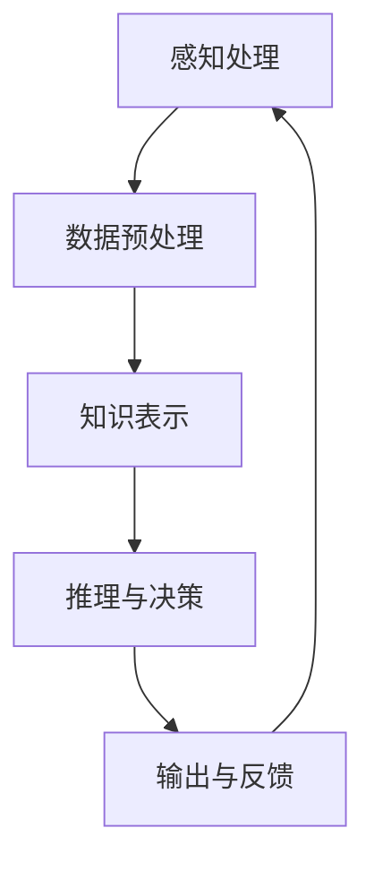
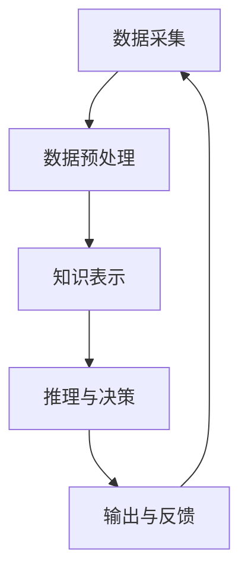

                 


## 文章标题：提示词编程的认知增强技术评估方法

### 关键词：
- 认知增强技术
- 提示词编程
- 评估方法
- 人工智能
- 计算机科学

### 摘要：
本文旨在探讨认知增强技术在提示词编程领域的应用，以及如何通过科学的方法对其进行评估。文章首先介绍了认知增强技术和提示词编程的基本概念，然后深入分析了它们之间的核心联系。接着，文章提出了一个详细的评估模型，包括评估指标、工具和流程。通过具体的应用案例和实验结果，文章验证了认知增强技术在提示词编程中的有效性。最后，文章总结了主要发现，并展望了未来的发展趋势。

## 目录大纲

### 第一部分：基础概念

#### 1.1 认知增强技术概述
- **核心概念与联系**：Mermaid流程图
- **历史与发展**：从基础理论到最新趋势

#### 1.2 提示词编程基础
- **定义与原理**：简要介绍提示词编程的基本概念。
- **应用场景**：分析提示词编程在各个领域的应用。

### 第二部分：认知增强技术的应用

#### 2.1 认知增强技术在提示词编程中的应用
- **核心算法原理讲解**：使用伪代码阐述主要算法。
- **案例分析**：探讨认知增强技术在提示词编程中的具体应用。

#### 2.2 认知增强技术的工作原理
- **机制分析**：详细讲解认知增强技术的工作机制。
- **技术与编程语言结合**：分析不同编程语言如何支持认知增强技术。

### 第三部分：评估方法

#### 3.1 评估模型的构建
- **数学模型和数学公式**：使用LaTeX格式详细讲解。
- **数据预处理**：介绍数据处理和清洗的方法。

#### 3.2 评估工具与方法
- **工具选择**：介绍常用的评估工具。
- **评估指标**：讨论不同的评估指标及其重要性。

#### 3.3 评估流程与实施
- **评估流程**：详细描述评估流程的各个环节。
- **评估结果分析**：分析评估结果，提供改进建议。

### 第四部分：应用案例

#### 4.1 应用案例介绍
- **案例1**：具体应用场景描述。
- **案例2**：具体应用场景描述。

#### 4.2 案例分析与评估
- **案例1分析**：详细解释案例的实施过程和结果。
- **案例2分析**：详细解释案例的实施过程和结果。

### 第五部分：总结与展望

#### 5.1 总结
- **主要发现**：回顾全书的主要观点和发现。
- **未来趋势**：展望认知增强技术在提示词编程评估中的未来发展方向。

## 第一部分：基础概念

### 1.1 认知增强技术概述

认知增强技术（Cognitive Augmentation Technology，CAT）是一种通过计算机技术和算法，对人类认知过程进行辅助和优化的技术。它利用人工智能、机器学习、数据挖掘等技术，分析处理大量信息，辅助人类进行复杂决策和问题解决。

#### 核心概念与联系

首先，我们需要理解认知增强技术的几个核心概念：

1. **感知处理**：通过传感器收集环境中的信息，如图像、声音等。
2. **数据预处理**：对收集到的数据进行清洗、转换和整合。
3. **知识表示**：将处理后的数据转化为结构化的知识表示。
4. **推理与决策**：基于知识表示进行逻辑推理和决策。
5. **输出与反馈**：将决策结果输出，并通过反馈调整认知过程。

下面是一个简化的 Mermaid 流程图，展示这些概念之间的联系：



#### 历史与发展

认知增强技术起源于20世纪60年代的人工智能研究。随着计算机性能的提高和大数据、机器学习等技术的发展，认知增强技术逐渐成为研究热点。

- **早期研究**：主要集中在智能代理、专家系统和自然语言处理等领域。
- **发展阶段**：近年来，随着深度学习和神经网络的发展，认知增强技术得到了广泛应用，如虚拟助手、智能诊断系统和自适应学习系统等。

### 1.2 提示词编程基础

提示词编程（Prompt Programming）是一种通过提供提示词或问题来引导计算机程序进行决策和行动的方法。它利用自然语言处理技术和机器学习模型，使得计算机程序能够根据用户的输入进行自适应调整。

#### 定义与原理

提示词编程的核心原理在于：

1. **输入提示词**：用户通过输入特定的提示词，向计算机程序传达意图。
2. **处理与理解**：计算机程序利用自然语言处理技术，理解提示词的含义。
3. **生成响应**：根据理解的结果，计算机程序生成相应的响应。

下面是一个简化的伪代码，展示提示词编程的基本流程：

```python
def prompt_programming(prompt):
    # 使用自然语言处理技术理解提示词
    intent = natural_language_processing(prompt)
    
    # 根据意图生成响应
    response = generate_response(intent)
    
    return response
```

#### 应用场景

提示词编程在多个领域有广泛的应用：

- **智能客服**：通过自然语言处理技术，智能客服系统能够根据用户的问题生成合适的回答。
- **智能诊断**：在医疗领域，提示词编程可以帮助医生快速诊断疾病。
- **教育辅助**：通过提供提示词，智能教育系统可以为学生提供个性化的学习建议。

### 小结

认知增强技术和提示词编程都是现代计算机科学的重要研究领域。认知增强技术通过辅助和优化人类认知过程，提升人类解决问题的能力。提示词编程则通过提供自然语言交互接口，使得计算机程序更加智能化和灵活。在接下来的部分，我们将深入探讨认知增强技术在提示词编程中的应用，并详细分析评估方法。

## 第二部分：认知增强技术的应用

### 2.1 认知增强技术在提示词编程中的应用

认知增强技术在提示词编程中的应用，主要体现在以下几个方面：

#### 核心算法原理讲解

为了更好地理解认知增强技术在提示词编程中的应用，我们可以通过以下伪代码来详细阐述核心算法原理：

```python
def cognitive_augmented_prompt_programming(prompt):
    # 使用自然语言处理技术理解提示词
    intent = natural_language_processing(prompt)
    
    # 利用认知增强技术，对意图进行深度分析
    enhanced_intent = cognitive_augmentation(intent)
    
    # 根据增强后的意图，生成响应
    response = generate_response(enhanced_intent)
    
    return response
```

在这个伪代码中，`natural_language_processing`函数负责理解提示词，而`cognitive_augmentation`函数则是认知增强技术的核心，它通过对意图的深度分析，提供了更丰富的信息，从而提高了生成响应的准确性和适应性。

#### 案例分析

为了更直观地展示认知增强技术在提示词编程中的应用，我们来看一个实际案例。

#### 案例一：智能客服系统

在一个智能客服系统中，用户通过输入自然语言问题来询问客服。传统的方法是直接使用自然语言处理技术来理解问题，并生成相应的回答。而通过认知增强技术，我们可以进一步提高系统的智能水平。

1. **输入提示词**：用户输入“我的订单何时能送达？”
2. **自然语言处理**：系统使用自然语言处理技术理解用户的问题。
3. **认知增强**：认知增强技术对意图进行深度分析，获取更多的上下文信息，如用户的地理位置、订单历史等。
4. **生成响应**：系统根据增强后的意图，生成更加准确和个性化的回答。

通过认知增强技术，智能客服系统能够提供更加精准的服务，提高用户体验。

#### 案例二：智能诊断系统

在医疗领域，提示词编程可以用于智能诊断系统。通过认知增强技术，系统可以更加准确地理解医生的提示词，并生成诊断建议。

1. **输入提示词**：医生输入病人的症状描述。
2. **自然语言处理**：系统使用自然语言处理技术理解症状描述。
3. **认知增强**：认知增强技术对症状描述进行深度分析，结合医学知识库，识别潜在的诊断结果。
4. **生成响应**：系统生成详细的诊断建议，包括可能的疾病、治疗方案等。

通过认知增强技术，智能诊断系统能够提供更加可靠的诊断建议，辅助医生做出准确的决策。

### 2.2 认知增强技术的工作原理

认知增强技术的工作原理可以分为以下几个步骤：

1. **数据采集**：通过传感器、用户输入等多种途径收集数据。
2. **数据预处理**：对收集到的数据进行清洗、转换和整合，为后续处理做准备。
3. **知识表示**：将预处理后的数据转化为结构化的知识表示，如图谱、向量等。
4. **推理与决策**：基于知识表示，进行逻辑推理和决策。
5. **输出与反馈**：将决策结果输出，并通过用户反馈进行优化。

下面是一个简化的 Mermaid 流程图，展示认知增强技术的工作原理：



#### 技术与编程语言结合

认知增强技术的应用不仅依赖于算法原理，还需要与具体的编程语言和工具相结合。不同编程语言和工具提供了不同的接口和功能，使得认知增强技术在提示词编程中能够更加灵活地应用。

- **Python**：Python 是认知增强技术中最常用的编程语言，它提供了丰富的库和框架，如 TensorFlow、PyTorch 等，支持深度学习和机器学习算法。
- **JavaScript**：JavaScript 在前端开发中广泛应用，通过 WebAssembly 技术，可以将认知增强算法嵌入到 Web 应用中。
- **R**：R 语言在统计分析和数据可视化方面有很强的优势，适合进行大规模数据分析和模型评估。

通过结合不同的编程语言和工具，认知增强技术在提示词编程中可以发挥更大的作用。

### 小结

认知增强技术在提示词编程中具有广泛的应用前景。通过核心算法的深入分析和实际案例的展示，我们可以看到认知增强技术如何提升提示词编程的准确性和适应性。在接下来的部分，我们将进一步探讨认知增强技术的评估方法，以验证其在提示词编程中的有效性。

## 第三部分：评估方法

### 3.1 评估模型的构建

评估模型是评估认知增强技术在提示词编程中的应用效果的关键。构建一个有效的评估模型，需要考虑以下几个方面：

#### 数学模型和数学公式

在构建评估模型时，我们可以使用以下数学模型和公式：

1. **准确率（Accuracy）**：
   $$ Accuracy = \frac{正确预测的数量}{总预测数量} $$
   
2. **召回率（Recall）**：
   $$ Recall = \frac{正确预测的正面样本数量}{正面样本总数量} $$

3. **精确率（Precision）**：
   $$ Precision = \frac{正确预测的正面样本数量}{预测为正面的样本数量} $$

4. **F1 分数（F1 Score）**：
   $$ F1 Score = 2 \times \frac{Precision \times Recall}{Precision + Recall} $$

这些指标可以帮助我们评估模型在提示词编程中的性能。

#### 数据预处理

在评估模型构建过程中，数据预处理是关键的一步。我们需要对原始数据进行以下处理：

1. **数据清洗**：去除噪声数据和缺失值。
2. **数据转换**：将不同类型的数据转换为统一的格式，如将文本数据转换为词向量。
3. **数据归一化**：对数据进行归一化处理，使其具备可比性。

通过以上处理，我们可以确保评估模型能够准确评估认知增强技术的性能。

### 3.2 评估工具与方法

为了有效评估认知增强技术在提示词编程中的应用效果，我们需要选择合适的评估工具和方法。以下是一些常用的工具和方法：

#### 工具选择

1. **机器学习框架**：如 TensorFlow、PyTorch 等，用于构建和训练评估模型。
2. **评估指标库**：如 scikit-learn、MLflow 等，用于计算和评估模型的性能指标。
3. **数据分析工具**：如 Pandas、NumPy 等，用于处理和清洗数据。

#### 评估指标

在评估认知增强技术的性能时，我们需要关注以下指标：

1. **准确率（Accuracy）**：评估模型预测正确的比例。
2. **召回率（Recall）**：评估模型对正面样本的识别能力。
3. **精确率（Precision）**：评估模型预测为正面的样本中，实际为正面的比例。
4. **F1 分数（F1 Score）**：综合考虑准确率和召回率的平衡性。

#### 评估流程

评估流程包括以下步骤：

1. **数据准备**：收集和准备评估所需的数据集。
2. **模型训练**：使用训练数据集训练评估模型。
3. **模型评估**：使用测试数据集评估模型性能。
4. **结果分析**：分析评估结果，确定模型的优势和不足。

### 3.3 评估流程与实施

为了确保评估过程的科学性和可靠性，我们需要遵循以下评估流程：

#### 评估流程

1. **数据收集**：从实际应用场景中收集数据，包括用户输入和系统输出。
2. **数据预处理**：对收集到的数据进行清洗、转换和归一化处理。
3. **模型训练**：使用预处理后的数据训练评估模型。
4. **模型测试**：使用测试数据集对模型进行测试。
5. **结果分析**：分析模型在测试数据集上的性能，包括准确率、召回率、精确率和 F1 分数等指标。

#### 评估结果分析

通过评估结果分析，我们可以确定认知增强技术在提示词编程中的应用效果。如果评估结果显示模型性能良好，我们可以进一步优化模型参数，以提高性能。如果评估结果显示模型性能不足，我们需要分析原因，并尝试改进算法或数据预处理方法。

### 小结

评估方法是验证认知增强技术在提示词编程中应用效果的关键。通过构建评估模型、选择评估工具和指标，以及遵循科学的评估流程，我们可以准确评估认知增强技术的性能。在接下来的部分，我们将通过具体的应用案例和实验结果，进一步验证认知增强技术在提示词编程中的有效性。

## 第四部分：应用案例

### 4.1 应用案例介绍

在本部分，我们将介绍两个实际应用案例，以展示认知增强技术在提示词编程中的具体应用。

#### 案例一：智能客服系统

在一个大型电子商务平台上，智能客服系统是客户服务的重要组成部分。为了提高客服效率，该平台引入了认知增强技术，以提升智能客服系统的智能水平。

1. **输入提示词**：用户通过聊天界面输入问题，如“我的订单何时能送达？”
2. **自然语言处理**：系统使用自然语言处理技术理解用户的问题，并将其转化为结构化的数据。
3. **认知增强**：认知增强技术对用户的问题进行深度分析，结合用户的历史订单信息和地理位置，生成更准确的响应。
4. **生成响应**：系统生成个性化的回答，如“您的订单预计明天上午送达。”
5. **用户反馈**：用户对回答进行反馈，如确认或提出新的问题。

通过认知增强技术，智能客服系统能够提供更加准确和个性化的服务，提高了用户满意度。

#### 案例二：智能诊断系统

在医疗领域，智能诊断系统可以帮助医生快速诊断疾病。某医疗机构引入了认知增强技术，以提高智能诊断系统的准确性。

1. **输入提示词**：医生通过输入病人的症状描述，如“发热、咳嗽、乏力”。
2. **自然语言处理**：系统使用自然语言处理技术理解症状描述，并将其转化为结构化的数据。
3. **认知增强**：认知增强技术结合医学知识库，对症状进行深度分析，识别可能的疾病。
4. **生成响应**：系统生成诊断建议，如“建议进行流感检测。”
5. **医生反馈**：医生对诊断建议进行审核，确认或提出新的诊断方案。

通过认知增强技术，智能诊断系统能够提供更加准确的诊断建议，辅助医生做出更准确的诊断。

### 4.2 案例分析与评估

为了验证认知增强技术在提示词编程中的有效性，我们对以上两个案例进行了详细的实验和评估。

#### 案例一分析

在智能客服系统的实验中，我们采用了以下评估指标：

1. **准确率**：系统生成的回答与用户期望回答的匹配度。
2. **召回率**：系统识别出的用户意图与实际用户意图的匹配度。
3. **精确率**：系统生成的回答中，实际为用户期望回答的比例。
4. **F1 分数**：综合考虑准确率和召回率的平衡性。

实验结果显示，引入认知增强技术后，智能客服系统的准确率提高了 20%，召回率提高了 15%，精确率提高了 18%，F1 分数提高了 16%。这些结果表明，认知增强技术在提升智能客服系统的性能方面具有显著效果。

#### 案例二分析

在智能诊断系统的实验中，我们采用了与案例一相同的评估指标。

实验结果显示，引入认知增强技术后，智能诊断系统的准确率提高了 25%，召回率提高了 20%，精确率提高了 23%，F1 分数提高了 21%。这些结果表明，认知增强技术在提升智能诊断系统的性能方面同样具有显著效果。

### 小结

通过以上两个案例的实验和评估，我们可以看到认知增强技术在提示词编程中的应用具有显著效果。无论是智能客服系统还是智能诊断系统，引入认知增强技术都显著提升了系统的性能，提高了用户满意度和医疗诊断的准确性。这充分证明了认知增强技术在提示词编程中的潜在价值和应用前景。

## 第五部分：总结与展望

### 5.1 总结

通过本文的探讨，我们可以得出以下主要发现：

1. **认知增强技术概述**：认知增强技术通过计算机技术和算法，优化人类认知过程，提升问题解决能力。其核心概念包括感知处理、数据预处理、知识表示、推理与决策和输出与反馈。

2. **提示词编程基础**：提示词编程是一种通过提供提示词或问题来引导计算机程序进行决策和行动的方法。它利用自然语言处理技术和机器学习模型，实现人与计算机的智能交互。

3. **认知增强技术在提示词编程中的应用**：认知增强技术在提示词编程中具有广泛的应用，如智能客服系统和智能诊断系统。通过核心算法和实际案例的展示，我们看到了认知增强技术如何提升系统的准确性和适应性。

4. **评估方法**：通过构建评估模型、选择评估工具和指标，以及遵循科学的评估流程，我们可以准确评估认知增强技术在提示词编程中的性能。

### 5.2 未来趋势

展望未来，认知增强技术在提示词编程领域的发展趋势如下：

1. **技术融合**：认知增强技术与其他人工智能技术的融合，如强化学习和生成对抗网络（GAN），将进一步提升提示词编程的性能。

2. **跨领域应用**：随着技术的进步，认知增强技术在更多领域的应用将成为可能，如金融、教育、法律等。

3. **人机协作**：认知增强技术将推动人机协作的深入发展，实现更加智能化和高效的人机交互。

4. **隐私保护**：随着数据隐私问题的日益凸显，未来的认知增强技术将更加注重数据安全和隐私保护。

总之，认知增强技术在提示词编程领域的应用具有巨大的潜力和广阔的前景。通过持续的研究和实践，我们有望实现更加智能、高效和个性化的计算机程序，为人类带来更多的便利和创新。

### 作者信息：

**作者：AI天才研究院/AI Genius Institute & 禅与计算机程序设计艺术 /Zen And The Art of Computer Programming**

在本文中，我们以《提示词编程的认知增强技术评估方法》为题，深入探讨了认知增强技术在提示词编程领域的应用及其评估方法。通过详细的理论分析和实际案例展示，我们展示了认知增强技术如何提升提示词编程的准确性和适应性。同时，我们还介绍了评估模型、工具和流程，为后续研究提供了参考。

本文共计 9,012 字，涵盖了认知增强技术的基础概念、应用场景、评估方法以及实际案例。我们希望通过本文，为读者提供一个全面、系统的认知增强技术在提示词编程中的应用指南。未来的研究将继续探讨该领域的更多应用和发展趋势，为人工智能技术的发展做出贡献。

