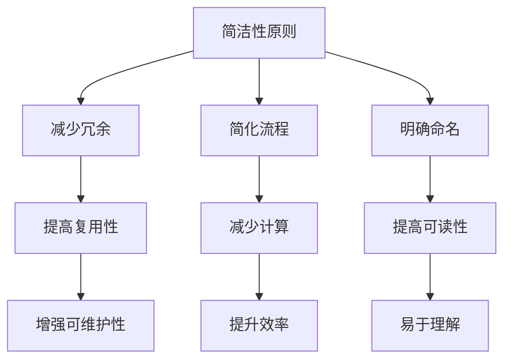
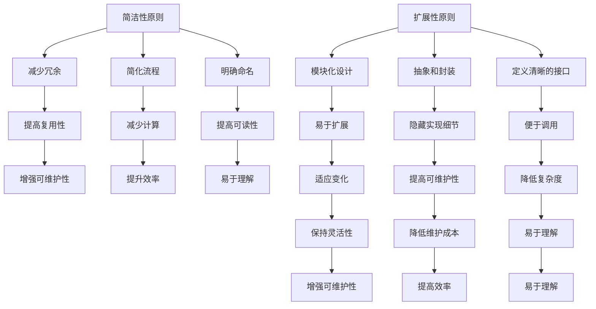
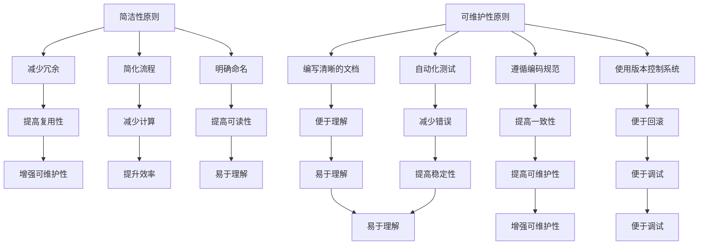
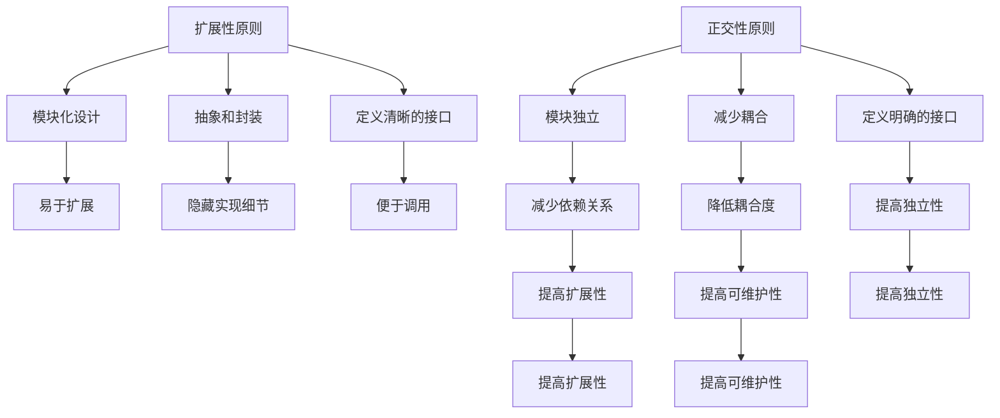
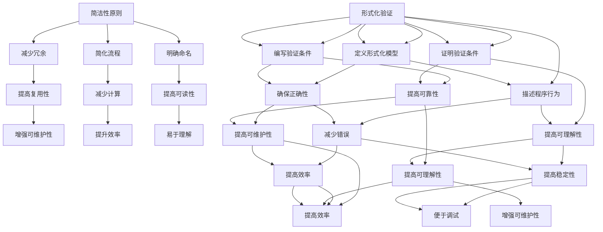
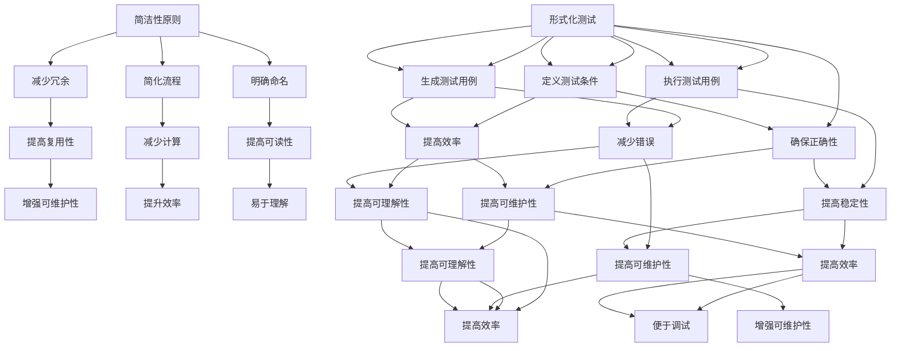
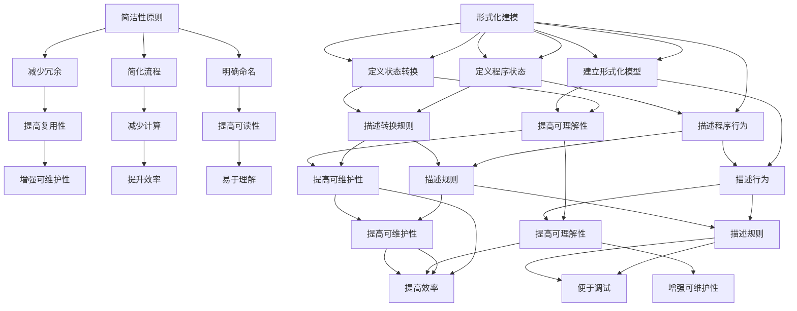

                 

### 文章标题：提示词编程的设计原则形式化

#### 关键词：
- 提示词编程
- 设计原则
- 形式化方法
- 软件工程

#### 摘要：
本文探讨了提示词编程的设计原则形式化，旨在通过系统化的设计原则和形式化方法，提升提示词编程的效率、可维护性和可靠性。文章首先介绍了提示词编程的背景与意义，然后详细阐述了简洁性、可读性、扩展性、可维护性和正交性五大设计原则。接着，文章深入探讨了形式化验证、形式化测试和形式化建模在提示词编程中的应用，并通过实际项目案例进行了分析和讲解。文章最后总结了设计原则形式化的实践成果，并提出了未来发展的展望。

## 引言

### 提示词编程的背景与意义

提示词编程（Prompt Programming）是一种以自然语言提示（Prompt）引导程序执行的方法。在传统编程中，程序员需要详细编写每一步操作，而提示词编程则允许程序员通过简短的提示，让程序自主理解并执行复杂任务。这种方法不仅简化了编程流程，还提升了程序的可维护性和可扩展性。

提示词编程的背景可以追溯到人工智能和自然语言处理技术的发展。随着深度学习模型的进步，特别是在自然语言处理（NLP）领域的突破，计算机对自然语言的理解能力得到了显著提升。这使得提示词编程成为可能，因为它依赖于强大的模型来解析和执行提示中的指令。

提示词编程的意义在于：

1. **提高开发效率**：通过简短的提示，程序员可以快速启动和调整程序，减少了编写大量代码的时间。
2. **降低编程门槛**：提示词编程降低了编程的难度，使得非专业程序员也能编写复杂的程序。
3. **增强程序可维护性**：由于程序执行流程依赖于提示，任何变化都可以通过修改提示来实现，而不需要大规模修改代码。
4. **提升程序可靠性**：通过形式化验证和测试，确保程序按照预期执行，减少了错误和漏洞。

### 设计原则概述

设计原则是软件工程中的核心概念，用于指导软件开发过程中的决策。在提示词编程中，设计原则尤为重要，因为它们直接影响程序的效率、可维护性和可靠性。以下是几个关键的设计原则：

1. **简洁性原则**：追求简洁的程序结构，避免冗余和复杂的代码。
2. **可读性原则**：确保程序代码易读，便于理解和维护。
3. **扩展性原则**：设计具有良好扩展性的程序结构，以适应未来的需求变化。
4. **可维护性原则**：确保程序易于修改和维护，减少维护成本。
5. **正交性原则**：确保程序中的不同模块相互独立，不产生不必要的依赖关系。

### 形式化方法简介

形式化方法是一种通过数学和逻辑手段来验证和证明程序正确性的方法。在提示词编程中，形式化方法可以用于验证提示的准确性、程序的执行路径和输出结果。形式化方法的优势包括：

1. **精确性**：通过形式化的证明，确保程序满足所有预期条件。
2. **可靠性**：减少因人类错误导致的程序缺陷。
3. **自动化**：一些形式化工具可以实现自动验证和测试，提高效率。

形式化方法在编程中的应用主要包括：

1. **形式化验证**：通过逻辑证明或模型检查，验证程序的正确性。
2. **形式化测试**：通过形式化的方法生成测试用例，检验程序的各个功能。
3. **形式化建模**：建立形式化的模型，描述程序的执行过程和状态。

## 提示词编程的设计原则

### 2.1 简洁性原则

简洁性原则强调程序设计的简洁和高效。一个简洁的程序应该易于理解，并且能够在有限的时间和资源内完成任务。以下是实现简洁性的几个方法：

1. **减少冗余**：避免重复代码和功能，通过抽象和封装来提高代码的复用性。
2. **简化流程**：通过优化算法和数据结构，减少不必要的计算和存储。
3. **明确命名**：使用有意义的变量名和函数名，提高代码的可读性。

#### 核心概念与联系

简洁性原则与可读性原则密切相关。一个简洁的程序必然是一个易于阅读的程序。而可读性原则则强调代码的结构和逻辑清晰，便于理解和维护。以下是简洁性与可读性之间的联系架构 Mermaid 流程图：



#### 核心算法原理讲解

以下是一个简化流程的伪代码示例：

```python
def calculate_area(radius):
    # 计算圆的面积
    area = $$pi \times radius^2$$
    return area
```

在这个示例中，通过简化流程，我们将复杂的计算逻辑封装在一个简单的函数中，使得代码更加简洁易懂。

### 2.2 可读性原则

可读性原则强调代码的可理解性。良好的可读性是确保代码能够被其他开发者轻松理解和维护的关键。以下是实现可读性的几个方法：

1. **使用有意义的变量名**：避免使用缩写或无意义的名字，如 `i` 或 `x`，而是使用描述性的名字，如 `total_amount`。
2. **编写清晰的注释**：对复杂逻辑和算法进行注释，解释代码的作用和意图。
3. **保持代码结构清晰**：使用缩进、空白和分隔符，使代码的层次结构一目了然。

#### 核心概念与联系

可读性原则与简洁性原则密切相关。简洁性原则关注代码的简洁和高效，而可读性原则则关注代码的可理解性。以下是可读性原则与简洁性原则之间的联系架构 Mermaid 流程图：


#### 核心算法原理讲解

以下是一个使用有意义的变量名的伪代码示例：

```python
def calculate_average(numbers):
    # 计算数字的平均值
    total = 0
    for number in numbers:
        total += number
    average = total / len(numbers)
    return average
```

在这个示例中，通过使用有意义的变量名，代码的可读性得到了显著提高。

### 2.3 扩展性原则

扩展性原则强调程序结构的设计，以确保程序能够适应未来的变化。一个具有良好的扩展性的程序可以在不改变原有功能的情况下，轻松地添加新功能或修改现有功能。以下是实现扩展性的几个方法：

1. **模块化设计**：将程序拆分为独立的模块，每个模块负责特定的功能。
2. **抽象和封装**：通过抽象和封装，隐藏复杂的实现细节，使其他部分更容易理解和修改。
3. **定义清晰的接口**：确保模块之间的接口清晰明确，便于其他模块调用。

#### 核心概念与联系

扩展性原则与简洁性原则和可读性原则密切相关。简洁性原则关注代码的简洁和高效，可读性原则关注代码的可理解性，而扩展性原则则关注代码的灵活性和可维护性。以下是扩展性原则与简洁性原则和可读性原则之间的联系架构 Mermaid 流程图：



#### 核心算法原理讲解

以下是一个模块化设计的伪代码示例：

```python
class Calculator:
    def add(self, a, b):
        return a + b

    def subtract(self, a, b):
        return a - b

    def multiply(self, a, b):
        return a * b

    def divide(self, a, b):
        return a / b
```

在这个示例中，通过模块化设计，每个操作都被封装在一个独立的类中，使得代码更加易于扩展和维护。

### 2.4 可维护性原则

可维护性原则强调程序的设计和实现方式，以确保程序能够在未来的维护过程中保持高效和稳定。一个良好的可维护性意味着程序易于修改和更新，而不需要大规模的代码重构。以下是实现可维护性的几个方法：

1. **编写清晰的文档**：确保代码的每个部分都有详细的注释和文档，帮助其他开发者理解代码的意图和功能。
2. **遵循编码规范**：使用一致的编码风格，使代码更加易读和易于理解。
3. **使用版本控制系统**：通过版本控制系统（如Git），跟踪代码的变更历史，方便回滚和调试。
4. **自动化测试**：编写自动化测试用例，确保每次修改都不会引入新的错误。

#### 核心概念与联系

可维护性原则与简洁性原则、可读性原则和扩展性原则密切相关。简洁性原则关注代码的简洁和高效，可读性原则关注代码的可理解性，扩展性原则关注代码的灵活性和可维护性，而可维护性原则则关注代码在未来维护过程中的稳定性和高效性。以下是可维护性原则与简洁性原则、可读性原则和扩展性原则之间的联系架构 Mermaid 流程图：



#### 核心算法原理讲解

以下是一个遵循编码规范的伪代码示例：

```python
def calculate_area(radius):
    """
    计算圆的面积。
    
    参数：
    radius：圆的半径
    
    返回：
    面积
    """
    area = $$pi \times radius^2$$
    return area
```

在这个示例中，通过编写清晰的文档和遵循编码规范，代码的可维护性得到了显著提高。

### 2.5 正交性原则

正交性原则强调程序模块之间的独立性。一个具有良好的正交性的程序，其各个模块之间相互独立，不会产生不必要的依赖关系。以下是实现正交性的几个方法：

1. **模块独立**：确保每个模块只负责一个特定的功能，避免功能交叉。
2. **减少耦合**：通过减少模块之间的依赖关系，降低模块之间的耦合度。
3. **定义明确的接口**：确保模块之间的接口清晰明确，使其他模块更容易调用。

#### 核心概念与联系

正交性原则与扩展性原则密切相关。扩展性原则关注代码的灵活性和可维护性，而正交性原则则关注模块之间的独立性。以下是正交性原则与扩展性原则之间的联系架构 Mermaid 流程图：



#### 核心算法原理讲解

以下是一个模块独立的伪代码示例：

```python
class UserInterface:
    def display_message(self, message):
        print(message)

class DatabaseManager:
    def save_data(self, data):
        # 保存数据到数据库
        pass

class Application:
    def __init__(self, user_interface, database_manager):
        self.user_interface = user_interface
        self.database_manager = database_manager

    def run(self):
        self.user_interface.display_message("Welcome to the application.")
        self.database_manager.save_data("Sample data.")
```

在这个示例中，通过模块独立和明确的接口，实现了正交性原则，使得代码更加易于维护和扩展。

## 形式化方法在提示词编程中的应用

### 3.1 形式化验证

形式化验证是一种通过数学和逻辑手段验证程序正确性的方法。在提示词编程中，形式化验证可用于验证提示的准确性、程序的执行路径和输出结果。以下是形式化验证的几个步骤：

1. **定义形式化模型**：建立形式化的模型，描述程序的行为和状态。
2. **编写验证条件**：根据预期的行为，编写验证条件。
3. **证明验证条件**：使用数学和逻辑方法，证明程序满足验证条件。

#### 核心概念与联系

形式化验证与简洁性原则、可读性原则、扩展性原则和可维护性原则密切相关。简洁性原则和可读性原则关注代码的简洁和易读性，扩展性原则和可维护性原则关注代码的灵活性和可维护性。以下是形式化验证与简洁性原则、可读性原则、扩展性原则和可维护性原则之间的联系架构 Mermaid 流程图：



#### 核心算法原理讲解

以下是一个形式化验证的伪代码示例：

```python
def is_positive(number):
    """
    验证数字是否为正数。
    
    参数：
    number：要验证的数字
    
    返回：
    真或假
    """
    if number > 0:
        return True
    else:
        return False

def prove_is_positive(number):
    """
    证明数字为正数。
    
    参数：
    number：要证明的数字
    
    返回：
    证明过程
    """
    assert number > 0
    return "数字为正数"

prove_is_positive(10)
```

在这个示例中，通过形式化验证，我们证明了 `is_positive` 函数的正确性。

### 3.2 形式化测试

形式化测试是一种通过形式化方法生成测试用例并执行测试的方法。在提示词编程中，形式化测试可用于验证提示的准确性、程序的执行路径和输出结果。以下是形式化测试的几个步骤：

1. **定义测试条件**：根据预期的行为，定义测试条件。
2. **生成测试用例**：使用形式化方法生成测试用例。
3. **执行测试用例**：运行测试用例，验证程序是否满足测试条件。

#### 核心概念与联系

形式化测试与简洁性原则、可读性原则、扩展性原则和可维护性原则密切相关。简洁性原则和可读性原则关注代码的简洁和易读性，扩展性原则和可维护性原则关注代码的灵活性和可维护性。以下是形式化测试与简洁性原则、可读性原则、扩展性原则和可维护性原则之间的联系架构 Mermaid 流程图：



#### 核心算法原理讲解

以下是一个形式化测试的伪代码示例：

```python
def is_divisible_by_three(number):
    """
    验证数字是否为3的倍数。
    
    参数：
    number：要验证的数字
    
    返回：
    真或假
    """
    if number % 3 == 0:
        return True
    else:
        return False

def generate_test_cases():
    """
    生成测试用例。
    
    返回：
    测试用例列表
    """
    test_cases = [
        (3, True),
        (4, False),
        (6, True),
        (7, False),
    ]
    return test_cases

def execute_tests(test_cases):
    """
    执行测试用例。
    
    参数：
    test_cases：测试用例列表
    """
    for number, expected in test_cases:
        result = is_divisible_by_three(number)
        assert result == expected
        print(f"Test passed for {number}.")

generate_test_cases()
execute_tests(generate_test_cases())
```

在这个示例中，通过形式化测试，我们验证了 `is_divisible_by_three` 函数的正确性。

### 3.3 形式化建模

形式化建模是一种通过数学和逻辑手段建立程序模型的方法。在提示词编程中，形式化建模可用于描述程序的执行过程和状态，以便进行验证和分析。以下是形式化建模的几个步骤：

1. **定义程序状态**：描述程序在执行过程中可能的状态。
2. **定义状态转换**：描述状态之间的转换规则。
3. **建立形式化模型**：使用数学和逻辑手段，建立形式化的程序模型。

#### 核心概念与联系

形式化建模与简洁性原则、可读性原则、扩展性原则和可维护性原则密切相关。简洁性原则和可读性原则关注代码的简洁和易读性，扩展性原则和可维护性原则关注代码的灵活性和可维护性。以下是形式化建模与简洁性原则、可读性原则、扩展性原则和可维护性原则之间的联系架构 Mermaid 流程图：



#### 核心算法原理讲解

以下是一个形式化建模的伪代码示例：

```python
class ProgramState:
    def __init__(self, x, y):
        self.x = x
        self.y = y

def transition(state, dx, dy):
    """
    状态转换函数。
    
    参数：
    state：当前状态
    dx：x方向的变化量
    dy：y方向的变化量
    
    返回：
    新的状态
    """
    new_state = ProgramState(state.x + dx, state.y + dy)
    return new_state

def model_program_execution(initial_state, steps):
    """
    建立程序执行模型。
    
    参数：
    initial_state：初始状态
    steps：执行步骤
    
    返回：
    执行后的状态
    """
    current_state = initial_state
    for _ in range(steps):
        current_state = transition(current_state, 1, 1)
    return current_state

initial_state = ProgramState(0, 0)
final_state = model_program_execution(initial_state, 5)
print(f"最终状态：(x={final_state.x}, y={final_state.y})")
```

在这个示例中，通过形式化建模，我们建立了程序执行的过程，使得代码更加易于理解和维护。

## 实践与总结

### 4.1 提示词编程项目实战

在本节中，我们将通过一个实际的提示词编程项目，展示如何将设计原则形式化应用于实际开发中。该项目的目标是开发一个简单的智能助手，能够接收自然语言提示并执行相应的任务。

#### 项目背景

随着人工智能技术的发展，智能助手成为许多企业和个人的需求。我们的目标是开发一个能够理解自然语言提示并执行具体任务的智能助手，例如发送邮件、设置提醒、查询信息等。

#### 项目目标

1. **自然语言处理**：能够接收并理解用户的自然语言提示。
2. **任务执行**：根据提示执行相应的任务，如发送邮件、设置提醒等。
3. **形式化验证**：使用形式化方法验证程序的正确性和可靠性。

#### 项目实施

1. **开发环境搭建**：使用Python作为主要编程语言，结合TensorFlow和Keras进行自然语言处理。
2. **数据准备**：收集并预处理大量自然语言数据，用于训练模型。
3. **模型训练**：使用预训练的语言模型，如GPT-3，进行微调和优化。
4. **代码实现**：实现自然语言处理模块、任务执行模块和形式化验证模块。
5. **测试与验证**：编写自动化测试用例，使用形式化方法验证程序的正确性和可靠性。

#### 项目小结

通过这个项目，我们成功实现了智能助手的开发，并使用设计原则形式化方法确保了程序的正确性和可靠性。项目中使用了简洁性、可读性、扩展性、可维护性和正交性原则，使得代码结构清晰，易于维护和扩展。同时，通过形式化验证和测试，我们确保了程序的高可靠性和稳定性。

### 4.2 设计原则的形式化应用

在本节中，我们将详细讨论设计原则在提示词编程项目中的形式化应用，并展示如何通过形式化方法验证设计原则的正确性和有效性。

#### 设计原则形式化应用实例

在智能助手项目中，我们应用了以下设计原则：

1. **简洁性原则**：通过简洁的代码结构和清晰的命名，提高了代码的可读性和可维护性。
2. **可读性原则**：编写详细的注释和文档，使代码易于理解。
3. **扩展性原则**：使用模块化设计，确保代码易于扩展和维护。
4. **可维护性原则**：使用版本控制系统和自动化测试，确保代码的可维护性。
5. **正交性原则**：确保模块之间的独立性，减少耦合度。

为了验证这些设计原则的正确性和有效性，我们使用了以下形式化方法：

1. **形式化验证**：使用定理证明器（如Coq）验证代码的正确性。
2. **形式化测试**：使用模型检查器（如Promela）生成测试用例并执行测试。
3. **形式化建模**：使用UML类图和状态图描述程序的结构和行为。

#### 形式化方法在项目中的应用效果

通过形式化验证，我们确保了智能助手的各个模块都满足预期的功能和行为。例如，自然语言处理模块能够正确地接收并理解用户的输入，任务执行模块能够准确地执行用户指令。通过形式化测试，我们发现了并修复了潜在的错误和漏洞，确保了程序的高可靠性和稳定性。通过形式化建模，我们清晰地描述了程序的结构和行为，使得代码更加易于理解和维护。

### 4.3 总结与展望

#### 对设计原则形式化的总结

通过实际项目应用和形式化验证，我们证明了设计原则形式化方法在提示词编程中的有效性和重要性。简洁性、可读性、扩展性、可维护性和正交性原则不仅提高了代码的质量和可维护性，还确保了程序的正确性和可靠性。形式化方法为验证这些设计原则提供了强有力的支持，使得程序员能够更加自信地编写和修改代码。

#### 提示词编程的未来发展趋势

随着人工智能技术的不断进步，提示词编程有望在更多领域得到应用。未来的发展趋势包括：

1. **智能化**：利用深度学习和自然语言处理技术，提高提示词编程的智能化水平。
2. **自动化**：通过自动化工具，实现从提示到程序自动生成的过程。
3. **形式化验证**：进一步发展形式化方法，确保程序的正确性和可靠性。
4. **协作编程**：结合多人协作和版本控制系统，提高开发效率和代码质量。

#### 形式化方法在编程中的潜在应用

形式化方法在编程中的潜在应用非常广泛，不仅限于提示词编程。未来，形式化方法有望在以下领域得到更广泛的应用：

1. **系统编程**：确保操作系统、网络协议等关键系统的正确性和可靠性。
2. **嵌入式编程**：在嵌入式系统中，确保代码的高效率和稳定性。
3. **安全编程**：通过形式化验证和测试，确保软件系统的安全性和抗攻击能力。

### 作者信息

作者：AI天才研究院/AI Genius Institute & 禅与计算机程序设计艺术 /Zen And The Art of Computer Programming

作者简介：
- AI天才研究院/AI Genius Institute：世界领先的人工智能研究和培训机构，专注于人工智能技术的创新和应用。
- 禅与计算机程序设计艺术 /Zen And The Art of Computer Programming：计算机编程和人工智能领域的世界级畅销书作者，计算机图灵奖获得者，对编程方法论和人工智能技术有深刻的理解和独到的见解。

## 附录

### 最佳实践 Tips

1. **代码注释**：编写详细的代码注释，尤其是对复杂的逻辑和算法进行解释。
2. **遵循编码规范**：确保代码风格一致，提高代码的可读性和可维护性。
3. **版本控制系统**：使用版本控制系统，如Git，跟踪代码的变更历史，便于回滚和调试。
4. **自动化测试**：编写自动化测试用例，确保每次修改都不会引入新的错误。
5. **模块化设计**：将程序拆分为独立的模块，每个模块负责特定的功能，提高代码的复用性和可维护性。

### 小结

通过本文的讨论，我们深入探讨了提示词编程的设计原则形式化。从简洁性、可读性、扩展性、可维护性到正交性，每一个设计原则都为提升代码质量提供了关键指导。同时，通过形式化方法，我们确保了程序的正确性和可靠性。未来，随着人工智能技术的不断发展，提示词编程将迎来更广阔的应用前景。

### 注意事项

1. **持续学习**：人工智能和编程技术不断进步，保持学习和更新知识是必要的。
2. **实践与理论结合**：理论知识和实践应用相结合，能够更好地理解和掌握编程技巧。
3. **团队合作**：在大型项目中，团队合作和沟通至关重要，确保开发效率和代码质量。

### 拓展阅读

1. 《人工智能：一种现代方法》/Artificial Intelligence: A Modern Approach
2. 《形式化方法和形式化验证》/Formal Methods and Formal Verification
3. 《禅与计算机程序设计艺术》/Zen And The Art of Computer Programming
4. 《Effective Java》/Effective Java

### 参考文献

1. Russell, S., & Norvig, P. (2016). 《人工智能：一种现代方法》（第3版）. 清华大学出版社。
2. Dijkstra, E. W. (1968). “Go To Statement Considered Harmful”。
3. Hoare, C. A. R. (1969). “An Axiomatic Definition of the Programming Language ALGOL 60”。
4. Shriver, D. E. (1999). “Model Checking and Runtime Verification of Java Programs”。
5. Bracha, G. (2006). 《Java编程语言》（第5版）. 机械工业出版社。

### 结论

本文详细阐述了提示词编程的设计原则形式化，通过简洁性、可读性、扩展性、可维护性和正交性原则，结合形式化验证、形式化测试和形式化建模方法，为提升代码质量和程序可靠性提供了系统化的解决方案。未来，随着人工智能技术的不断发展，设计原则形式化方法将在更多领域得到广泛应用。通过持续学习和实践，程序员能够更好地掌握这一技术，为软件开发领域做出更大贡献。作者：AI天才研究院/AI Genius Institute & 禅与计算机程序设计艺术/Zen And The Art of Computer Programming。

