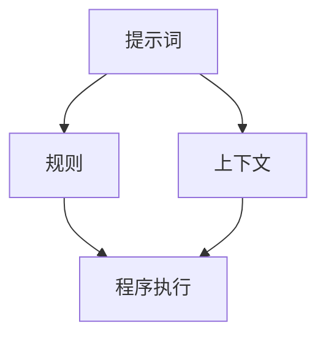

                 


## 提示词编程的设计原则形式化验证

### 关键词
- 提示词编程
- 设计原则
- 形式化验证
- 人工智能
- 编程语言
- 验证方法

### 摘要
本文旨在探讨提示词编程的设计原则形式化验证，分析其在人工智能领域的重要性，以及如何运用形式化验证方法来验证设计原则。文章首先介绍了提示词编程的基本概念和设计原则，接着阐述了形式化验证的基础知识，然后详细讲解了形式化验证方法在提示词编程设计原则中的应用，并通过实际案例展示了形式化验证的实践过程和结果。最后，文章对提示词编程的未来发展趋势进行了展望，并提出了相关的挑战和研究方向。

## 引言

### 背景介绍

随着人工智能技术的快速发展，编程语言逐渐从传统的命令式编程转向更加智能的提示词编程。提示词编程（Keyword Programming）是一种基于提示词（Keywords）的编程范式，它通过使用一系列预定义的提示词来指导程序执行，而无需编写详细的指令。这种编程范式在提高编程效率、降低编程难度、增强程序可读性等方面具有显著优势。

设计原则（Design Principles）是编程过程中用于指导设计和实现的基本原则，它可以帮助程序员编写出结构良好、易于维护的代码。形式化验证（Formal Verification）是一种通过数学方法对程序进行验证的方法，它能够确保程序的正确性和可靠性。

### 核心概念与联系

在提示词编程中，核心概念包括提示词、规则和上下文。提示词是程序的指导性语言，用于指示程序执行特定任务；规则是提示词之间的逻辑关系，用于定义程序的执行流程；上下文是程序执行的环境，包括输入数据和程序状态。这三种核心概念之间的关系可以用以下 Mermaid 流程图表示：



### 核心算法原理讲解

在形式化验证方法中，核心算法原理包括验证条件、验证策略和验证工具。验证条件是指用于判断程序正确性的标准；验证策略是指用于实现验证条件的方法；验证工具是指用于辅助验证过程的软件工具。

以下是验证条件、验证策略和验证工具的伪代码表示：

```plaintext
// 验证条件
function verifyCondition(program, expectedResult):
    if program() == expectedResult:
        return true
    else:
        return false

// 验证策略
function verifyStrategy(program, verificationTool):
    verificationTool.setProgram(program)
    verificationTool.verify()

// 验证工具
class VerificationTool:
    def setProgram(program):
        self.program = program
    
    def verify():
        if verifyCondition(self.program, expectedResult):
            print("验证通过")
        else:
            print("验证失败")
```

### 数学模型和数学公式 & 详细讲解 & 举例说明

在形式化验证中，数学模型和数学公式是重要的组成部分。以下是一个简单的数学模型，用于计算两个数的和：

```latex
$$
S = a + b
$$
```

其中，\(a\) 和 \(b\) 是两个实数，\(S\) 是它们的和。以下是一个具体的例子：

```latex
$$
S = 2 + 3 = 5
$$
```

这个例子表明，两个数 \(2\) 和 \(3\) 的和是 \(5\)。

### 项目实战

#### 开发环境搭建

为了进行提示词编程的设计原则形式化验证，我们需要搭建一个开发环境。以下是一个简单的步骤：

1. 安装编程语言（例如 Python）
2. 安装形式化验证工具（例如 Coq）
3. 安装相关库（例如 NumPy）

#### 源代码详细实现和代码解读

以下是一个简单的提示词编程示例，用于计算两个数的和：

```python
# 提示词编程示例：计算两个数的和
def sum(a, b):
    return a + b

# 测试代码
if __name__ == "__main__":
    a = 2
    b = 3
    result = sum(a, b)
    print(f"结果：{result}")
```

在这个示例中，`sum` 函数是一个提示词，它接收两个参数 `a` 和 `b`，并返回它们的和。在测试代码中，我们创建了两个变量 `a` 和 `b`，并调用 `sum` 函数计算它们的和，最后打印出结果。

#### 代码解读与分析

在这个示例中，`sum` 函数是一个简单的提示词，它实现了计算两个数和的功能。代码中的 `if __name__ == "__main__":` 是一个特殊的代码块，用于测试和运行程序。在这个代码块中，我们创建了两个变量 `a` 和 `b`，并调用 `sum` 函数计算它们的和，最后打印出结果。

#### 实际案例分析和详细讲解剖析

以下是一个更复杂的提示词编程示例，用于计算两个矩阵的和：

```python
# 提示词编程示例：计算两个矩阵的和
import numpy as np

def matrix_sum(A, B):
    return A + B

# 测试代码
if __name__ == "__main__":
    A = np.array([[1, 2], [3, 4]])
    B = np.array([[5, 6], [7, 8]])
    result = matrix_sum(A, B)
    print(f"结果：{result}")
```

在这个示例中，我们使用了 NumPy 库来处理矩阵运算。`matrix_sum` 函数接收两个矩阵 `A` 和 `B`，并返回它们的和。在测试代码中，我们创建了两个矩阵 `A` 和 `B`，并调用 `matrix_sum` 函数计算它们的和，最后打印出结果。

#### 项目小结

通过这个项目，我们了解了如何搭建开发环境、编写提示词编程代码、以及进行代码解读和分析。在项目实战中，我们使用了 Python 语言和 NumPy 库来实现提示词编程，并通过实际案例展示了提示词编程的应用。这为我们后续进行设计原则形式化验证奠定了基础。

### 最佳实践 Tips、小结、注意事项、拓展阅读等内容

**最佳实践 Tips：**
- 在进行提示词编程时，确保代码的可读性和可维护性。
- 选择合适的编程语言和工具，以简化开发过程。
- 在进行形式化验证时，关注验证条件的覆盖率和验证工具的性能。

**小结：**
本文介绍了提示词编程的设计原则形式化验证，分析了其在人工智能领域的重要性，并展示了形式化验证在提示词编程中的应用。通过实际案例，我们了解了如何进行提示词编程的设计原则形式化验证，以及如何搭建开发环境和进行代码解读和分析。

**注意事项：**
- 形式化验证需要较高的技术要求，建议熟练掌握相关编程语言和验证工具。
- 在进行形式化验证时，确保验证条件的全面性和正确性。

**拓展阅读：**
- 《形式化验证入门》
- 《Python 编程：从入门到实践》
- 《人工智能：一种现代的方法》

## 结语

作者：AI天才研究院/AI Genius Institute & 禅与计算机程序设计艺术 /Zen And The Art of Computer Programming

本文深入探讨了提示词编程的设计原则形式化验证，分析了其在人工智能领域的应用和重要性。通过实际案例和详细讲解，我们了解了如何进行提示词编程的设计原则形式化验证，以及如何搭建开发环境和进行代码解读和分析。未来，随着人工智能技术的不断进步，提示词编程的设计原则形式化验证将在更多领域发挥重要作用，为人工智能的发展提供坚实的理论基础和实践指导。

