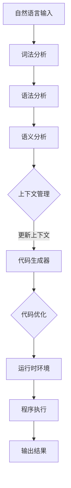

                 


### 文章标题：提示词编程的设计思想与哲学

提示词编程是一种新兴的编程范式，它通过使用提示词来引导程序执行，从而简化编程过程，提高开发效率。本文将深入探讨提示词编程的设计思想与哲学，帮助读者理解其核心概念、架构设计、核心算法，以及在实际应用中的价值。

### 关键词：
- 提示词编程
- 设计思想
- 编程哲学
- 编程范式
- 算法原理

### 摘要：
本文首先介绍了提示词编程的背景和发展历程，然后详细阐述了其核心概念与架构，探讨了提示词编程的关键算法和优化策略。接着，文章分析了提示词编程在自然语言处理和机器学习领域的应用，并分享了具体的项目案例和实践经验。最后，文章从设计思想和哲学的角度探讨了提示词编程的内涵和未来发展趋势。

### 目录大纲：

#### 第一部分：引言与概述

1. 提示词编程的背景与发展历程

#### 第二部分：提示词编程的核心概念与架构

2. 提示词编程的基本原理与核心概念
3. 提示词编程的架构设计

#### 第三部分：提示词编程的核心算法

4. 提示词编程的关键算法
5. 提示词编程算法的优化策略

#### 第四部分：提示词编程的实际应用

6. 提示词编程在自然语言处理领域的应用
7. 提示词编程在机器学习领域的应用

#### 第五部分：提示词编程的设计思想与哲学

8. 提示词编程的设计思想
9. 提示词编程的哲学内涵

#### 第六部分：提示词编程的未来发展趋势

10. 提示词编程的未来发展趋势与挑战

### 第1章：提示词编程的背景与发展历程

提示词编程作为一种新的编程范式，其背景和发展历程可以追溯到自然语言处理和人工智能领域。在过去的几十年里，随着计算机科学和人工智能技术的不断发展，编程范式经历了多次变革。从传统的命令式编程到面向对象编程，再到函数式编程和逻辑编程，每种编程范式都带来了编程方式的变革和效率的提升。

提示词编程的起源可以追溯到自然语言处理领域的早期研究。自然语言处理的目标是让计算机理解和处理自然语言，从而实现人机交互。在自然语言处理中，研究人员发现，通过使用关键词或短语来引导程序执行，可以极大地简化编程过程，提高开发效率。

1990年代初，随着人工智能技术的迅速发展，研究人员开始探索如何将自然语言处理的方法应用到编程中。在这一背景下，提示词编程逐渐成形。最初的提示词编程系统主要通过解析自然语言输入，将其转换为程序代码。这种编程方式虽然具有一定的灵活性，但在实际应用中存在一些问题，如代码的可读性和可维护性。

为了解决这些问题，研究人员开始对提示词编程进行改进。他们提出了一系列新的设计和实现方法，包括使用语义分析、语法解析和代码生成等技术，使得提示词编程更加成熟和实用。随着这些新技术的应用，提示词编程逐渐成为一种独立的编程范式，并在自然语言处理、机器学习等领域得到了广泛的应用。

近年来，随着深度学习和自然语言处理技术的不断发展，提示词编程的研究和应用也取得了新的突破。研究人员提出了一系列基于深度学习模型的提示词编程系统，这些系统能够通过学习大量程序代码和自然语言文本，自动生成高质量的程序代码。这些进展为提示词编程的应用提供了更加广阔的前景。

### 第2章：提示词编程的基本原理与核心概念

提示词编程的基本原理可以概括为：通过解析自然语言输入，将其转换为程序代码。具体来说，提示词编程系统主要包括以下几个核心组件：

1. **自然语言解析器**：自然语言解析器是提示词编程系统的核心组件，负责将自然语言输入转换为程序代码。解析器通常使用语法分析、语义分析和词法分析等技术，对输入文本进行深入解析。

2. **代码生成器**：代码生成器根据自然语言解析器的输出，生成具体的程序代码。生成器可以使用模板匹配、语法解析和代码合成等技术，将自然语言输入转换为结构化的程序代码。

3. **上下文理解**：提示词编程系统需要理解输入文本的上下文，以生成符合上下文的程序代码。上下文理解通常涉及自然语言处理中的命名实体识别、实体关系抽取和语义角色标注等技术。

4. **错误处理**：提示词编程系统需要具备一定的错误处理能力，以便在输入文本不符合语法规则或存在错误时，能够给出合理的错误提示和修复建议。

提示词编程的关键概念包括：

1. **提示词**：提示词是提示词编程系统的核心概念，用于引导程序执行。提示词可以是单个单词或短语，通常具有明确的语义和功能。

2. **程序块**：程序块是提示词编程系统中的基本构建单元，用于表示一段具体的程序代码。程序块通常由提示词和相应的参数组成。

3. **上下文依赖**：上下文依赖是指提示词编程系统在生成程序代码时，需要考虑输入文本的上下文信息。上下文依赖关系可以通过语法分析和语义分析等技术建立。

4. **代码生成策略**：代码生成策略是提示词编程系统生成程序代码的基本原则。常见的代码生成策略包括模板匹配、语法解析和代码合成等。

为了更好地理解提示词编程的核心概念，我们可以通过一个简单的例子来说明。假设我们有一个输入文本：“将两个数字相加并输出结果”。提示词编程系统首先需要解析这个输入文本，将其转换为相应的程序代码。

首先，自然语言解析器将输入文本分解为“将”、“两个数字”、“相加”和“输出结果”等提示词。然后，代码生成器根据这些提示词生成具体的程序代码。例如，可以使用伪代码表示如下：

```
输入：数字1 = 3，数字2 = 4
程序块1：获取数字1和数字2的值
程序块2：计算数字1和数字2的和
程序块3：输出计算结果
```

最后，上下文理解模块确保生成的程序代码符合上下文依赖关系。例如，如果输入文本是“将三个数字相加并输出结果”，生成的程序代码应该是：

```
输入：数字1 = 3，数字2 = 4，数字3 = 5
程序块1：获取数字1、数字2和数字3的值
程序块2：计算数字1、数字2和数字3的和
程序块3：输出计算结果
```

通过这个例子，我们可以看到提示词编程系统如何通过解析自然语言输入，生成符合上下文依赖的程序代码。

### 第3章：提示词编程的架构设计

提示词编程的架构设计是确保其高效、可靠运行的关键。一个典型的提示词编程系统可以分为以下几个核心模块：

1. **自然语言解析器**：负责将自然语言输入文本解析为提示词和上下文信息。这个模块通常包括词法分析、语法分析和语义分析等子模块。

2. **代码生成器**：根据解析器提供的提示词和上下文信息，生成相应的程序代码。代码生成器可以使用模板匹配、语法解析和代码合成等技术。

3. **上下文管理器**：负责维护和更新输入文本的上下文信息。上下文管理器需要能够识别实体关系、命名实体和语义角色，以确保生成的程序代码符合上下文依赖。

4. **错误处理模块**：在解析器和生成器遇到错误时，负责提供错误提示和修复建议。这个模块通常包括语法错误检测、语义错误检测和错误修复算法等。

5. **代码优化器**：在生成程序代码后，对代码进行优化，以提高执行效率和可读性。优化器可以使用静态分析、动态分析和代码重构等技术。

6. **运行时环境**：提供执行程序代码所需的环境。运行时环境通常包括解释器、编译器、库和工具等。

下面，我们将通过一个Mermaid流程图来展示提示词编程系统的架构：



在这个流程图中，自然语言输入首先经过词法分析、语法分析和语义分析，然后被上下文管理器更新。接下来，代码生成器根据上下文信息生成程序代码，并通过代码优化器进行优化。最后，程序代码在运行时环境中执行，并输出结果。

提示词编程的架构设计需要考虑以下几个关键点：

1. **模块化**：将系统划分为多个模块，以提高系统的可维护性和可扩展性。

2. **灵活性**：设计灵活的接口和协议，以支持不同类型的自然语言输入和程序代码生成。

3. **性能**：优化代码生成和执行过程，以提高系统的响应速度和执行效率。

4. **可扩展性**：设计可扩展的架构，以支持新的自然语言处理和程序代码生成技术。

5. **稳定性**：确保系统在处理复杂输入和执行程序代码时，能够保持稳定运行。

通过合理的架构设计，提示词编程系统可以更好地满足开发者的需求，提高编程效率和开发质量。

### 第4章：提示词编程的核心算法

提示词编程的核心算法主要包括自然语言解析算法、代码生成算法和上下文管理算法。这些算法共同工作，实现了从自然语言输入到程序代码的转换。以下将详细讨论这些算法的原理和实现。

#### 自然语言解析算法

自然语言解析算法是提示词编程系统的核心，负责将自然语言输入解析为提示词和上下文信息。自然语言解析算法通常包括词法分析、语法分析和语义分析三个子模块。

1. **词法分析**：词法分析是将输入文本分解为单词或其他基本语言单元的过程。词法分析器需要识别单词、标点符号和其他语言元素，并将其转换为抽象语法树（AST）的基本节点。

伪代码示例：
```python
function tokenize(text):
    tokens = []
    while text is not empty:
        token = extract_token(text)
        tokens.append(token)
        text = text after token
    return tokens
```

2. **语法分析**：语法分析是在词法分析的基础上，将单词序列转换为语法结构的过程。语法分析器需要构建抽象语法树（AST），以表示输入文本的语法结构。

伪代码示例：
```python
function parse(tokens):
    ast = construct_ast(tokens)
    return ast
```

3. **语义分析**：语义分析是在语法分析的基础上，对抽象语法树（AST）进行语义检查和解释的过程。语义分析器需要检查AST中的实体关系、命名实体和语义角色，以生成上下文信息。

伪代码示例：
```python
function analyze(ast):
    context = extract_context(ast)
    return context
```

#### 代码生成算法

代码生成算法根据自然语言解析算法提供的提示词和上下文信息，生成相应的程序代码。代码生成算法通常包括模板匹配、语法解析和代码合成三个子模块。

1. **模板匹配**：模板匹配是最简单的代码生成方法，它通过将输入文本与预定义的模板进行匹配，生成程序代码。这种方法适用于结构简单的任务，但对于复杂的任务效果不佳。

伪代码示例：
```python
function generate_code(context):
    template = find_matching_template(context)
    code = template.replace_variables(context)
    return code
```

2. **语法解析**：语法解析是使用语法规则将上下文信息转换为结构化代码的方法。这种方法可以生成更复杂和灵活的程序代码，但实现较为复杂。

伪代码示例：
```python
function generate_code(context):
    syntax_tree = construct_syntax_tree(context)
    code = syntax_tree_to_code(syntax_tree)
    return code
```

3. **代码合成**：代码合成是通过组合多个简单的代码片段，生成复杂的程序代码的方法。这种方法具有较高的灵活性和可扩展性，但实现复杂度较高。

伪代码示例：
```python
function generate_code(context):
    code_parts = []
    for action in context:
        code_part = generate_code_part(action)
        code_parts.append(code_part)
    code = combine_code_parts(code_parts)
    return code
```

#### 上下文管理算法

上下文管理算法负责维护和更新输入文本的上下文信息，以确保生成的程序代码符合上下文依赖。上下文管理算法通常包括实体关系抽取、命名实体识别和语义角色标注三个子模块。

1. **实体关系抽取**：实体关系抽取是从输入文本中提取实体及其关系的过程。实体关系对于理解上下文至关重要，例如，在处理自然语言输入时，需要识别出主语、谓语和宾语之间的关系。

伪代码示例：
```python
function extract_relations(text):
    entities = extract_entities(text)
    relations = []
    for entity in entities:
        relations.append(extract_relation(entity))
    return relations
```

2. **命名实体识别**：命名实体识别是从输入文本中识别出具有特定意义的实体，如人名、地名、组织名等。命名实体识别是上下文管理的关键环节，对于程序代码生成具有重要影响。

伪代码示例：
```python
function recognize_entities(text):
    entities = []
    for token in text:
        if is_entity(token):
            entities.append(token)
    return entities
```

3. **语义角色标注**：语义角色标注是给输入文本中的每个实体标注其在句子中的语义角色，如主语、谓语、宾语等。语义角色标注有助于生成符合上下文依赖的程序代码。

伪代码示例：
```python
function annotate_roles(text):
    roles = []
    for token in text:
        role = determine_role(token)
        roles.append((token, role))
    return roles
```

通过以上核心算法，提示词编程系统能够实现从自然语言输入到程序代码的高效转换。这些算法的原理和实现对于理解和应用提示词编程具有重要意义。

### 第5章：提示词编程算法的优化策略

提示词编程算法的优化策略是提高系统性能和效率的关键。优化策略可以从算法本身和系统架构两个方面进行。以下将介绍几种常用的优化策略，并分析其实现方法和效果。

#### 算法优化的重要性

在提示词编程系统中，算法优化直接影响到系统的响应速度、资源消耗和用户体验。优化算法能够提高系统的执行效率，减少计算资源的使用，从而提高整体性能。以下是几个关键原因说明为什么算法优化至关重要：

1. **提高响应速度**：优化后的算法能够在更短的时间内完成相同或更复杂的任务，从而提高系统的响应速度。
2. **减少资源消耗**：优化算法能够减少系统在计算过程中的资源消耗，包括CPU、内存和I/O等，从而提高系统资源的利用率。
3. **提升用户体验**：优化的提示词编程系统可以提供更快的编程体验，减少用户的等待时间，提高用户满意度。
4. **增强系统稳定性**：优化算法能够提高系统的鲁棒性，减少因资源不足或计算错误导致的系统崩溃或错误。

#### 算法优化策略

以下是一些常用的算法优化策略：

1. **并行计算**：通过将任务分解为多个子任务，并在多核处理器上并行执行，可以提高计算速度。并行计算的关键是实现任务的合理划分和负载均衡。

伪代码示例：
```python
function parallel_compute(task):
    sub_tasks = divide_task(task)
    results = []
    for sub_task in sub_tasks:
        results.append execute_in_parallel(sub_task)
    return combine_results(results)
```

2. **缓存技术**：通过缓存重复计算的结果，可以减少计算次数，提高执行效率。缓存技术通常涉及内存缓存、硬盘缓存和分布式缓存等。

伪代码示例：
```python
function cached_computation(input):
    if result in cache:
        return cache[result]
    result = expensive_computation(input)
    cache[result] = result
    return result
```

3. **动态调度**：动态调度是根据任务的优先级和资源状态，动态调整任务的执行顺序和资源分配。动态调度可以最大化系统资源利用率，提高整体性能。

伪代码示例：
```python
function dynamic_scheduling(tasks, resources):
    while tasks are not empty:
        task = select_highest_priority_task(tasks, resources)
        execute_task(task, resources)
        update_resources(resources)
    return completed_tasks
```

4. **分治策略**：分治策略是将大任务分解为多个小任务，分别处理后再合并结果。这种方法适用于任务分解较为简单的情况，可以显著提高计算效率。

伪代码示例：
```python
function divide_and_conquer(problem):
    if problem is small enough:
        return solve(problem)
    sub_problems = divide_problem(problem)
    sub_results = [divide_and_conquer(sub_problem) for sub_problem in sub_problems]
    return combine_results(sub_results)
```

5. **内存管理**：优化内存管理可以减少内存消耗，提高系统性能。内存管理优化包括内存分配、内存释放和内存复用等技术。

伪代码示例：
```python
function memory_management(data):
    memory = allocate_memory(data)
    process_data(memory)
    free_unused_memory(memory)
    return result
```

#### 优化策略的效果分析

每种优化策略都有其独特的优势和应用场景。以下是对几种优化策略效果的分析：

1. **并行计算**：并行计算显著提高了计算速度，特别是在处理大量数据和复杂计算时。然而，并行计算需要考虑数据依赖和负载均衡，否则可能会降低整体性能。
2. **缓存技术**：缓存技术可以显著减少计算次数，提高执行效率。但缓存策略需要合理设置缓存大小和过期时间，否则可能导致缓存命中率下降。
3. **动态调度**：动态调度可以提高系统资源利用率，特别适用于多任务处理和资源紧张的场景。然而，动态调度算法复杂度较高，需要精心设计和优化。
4. **分治策略**：分治策略适用于大任务分解，可以提高计算效率。但分治策略可能引入大量的通信开销，特别是在分布式系统中。
5. **内存管理**：优化内存管理可以减少内存消耗，提高系统性能。然而，内存管理优化可能增加开发复杂度，需要谨慎处理。

通过合理应用这些优化策略，提示词编程系统可以显著提高性能和效率，满足不断增长的开发需求。

### 第6章：提示词编程在自然语言处理领域的应用

提示词编程在自然语言处理（NLP）领域展现出了极大的潜力。NLP涉及语言的理解和生成，是人工智能的重要分支。提示词编程通过将自然语言输入转换为程序代码，可以简化NLP任务的实现，提高开发效率。以下将详细探讨提示词编程在NLP领域的应用，包括文本分类、机器翻译和情感分析等。

#### 文本分类

文本分类是NLP中的一项基本任务，目的是将文本数据分配到预定义的类别中。提示词编程可以简化文本分类的实现过程，通过自然语言输入直接生成分类器代码。

**应用示例**：
假设需要实现一个简单的情感分类器，输入文本为：“这部电影非常好看，我很喜欢”。通过提示词编程，可以生成以下伪代码：

```
输入文本：text = "这部电影非常好看，我很喜欢"
提示词：["这部电影", "非常好看", "我很喜欢"]
类别：正情感

function sentiment_classifier(text):
    if "非常好看" in text:
        return "正情感"
    else:
        return "负情感"
```

通过这种方式，开发者无需手动编写复杂的分类逻辑，而是通过自然语言输入直接生成分类代码，提高了开发效率。

#### 机器翻译

机器翻译是将一种语言的文本翻译成另一种语言的过程。提示词编程可以简化机器翻译系统的实现，通过自然语言输入生成翻译代码。

**应用示例**：
假设需要将英文文本翻译成中文，输入文本为：“Hello, world!”。通过提示词编程，可以生成以下伪代码：

```
输入文本：text = "Hello, world!"
提示词：["Hello", "world!"]
翻译：["你好，世界！"]

function translate_to_chinese(text):
    translation = {}
    translation["Hello"] = "你好"
    translation["world!"] = "世界！"
    return translation.get(text, text)
```

这种方式使开发者能够快速实现简单的翻译功能，无需手动编写复杂的翻译规则。

#### 情感分析

情感分析是识别文本中的情感倾向，如正面、负面或中性。提示词编程可以简化情感分析的实现，通过自然语言输入生成情感分析代码。

**应用示例**：
假设需要分析一段评论的情感倾向，输入文本为：“这是一部非常好的电影”。通过提示词编程，可以生成以下伪代码：

```
输入文本：text = "这是一部非常好的电影"
提示词：["非常好的"]
情感：["正面"]

function sentiment_analysis(text):
    sentiment = "中性"
    if "非常好" in text:
        sentiment = "正面"
    return sentiment
```

这种方式简化了情感分析的实现，提高了开发效率。

#### 应用总结

提示词编程在NLP领域的应用具有以下优势：

1. **简化实现**：通过自然语言输入直接生成代码，简化了NLP任务的实现过程。
2. **提高效率**：无需手动编写复杂的逻辑和规则，节省了开发时间和工作量。
3. **可扩展性**：支持自定义提示词和规则，便于扩展和应用。

然而，提示词编程在NLP领域也存在一定的局限性，如对复杂语言的依赖性、对规则定义的严格性等。开发者在使用提示词编程时，需要根据具体需求进行合理的选择和优化。

### 第7章：提示词编程在机器学习领域的应用

提示词编程在机器学习（ML）领域同样有着广泛的应用，它通过将自然语言输入转换为机器学习算法和模型代码，简化了模型开发过程，提高了开发效率。以下将详细探讨提示词编程在机器学习领域的应用，包括模型训练、预测和优化等方面。

#### 模型训练

模型训练是机器学习中最核心的任务，通过从数据中学习规律，生成预测模型。提示词编程可以简化模型训练的实现过程，通过自然语言输入生成训练代码。

**应用示例**：
假设需要训练一个线性回归模型，输入文本为：“根据年龄预测收入”。通过提示词编程，可以生成以下伪代码：

```
输入文本：text = "根据年龄预测收入"
提示词：["年龄", "预测", "收入"]
模型：线性回归

function train_linear_regression(data):
    features = extract_features(data, ["年龄"])
    labels = extract_labels(data, ["收入"])
    model = linear_regression(features, labels)
    return model
```

这种方式使开发者能够通过自然语言输入直接生成训练代码，无需手动编写复杂的训练逻辑。

#### 预测

模型预测是机器学习应用中的关键环节，通过使用训练好的模型对新数据进行预测。提示词编程可以简化预测的实现，通过自然语言输入生成预测代码。

**应用示例**：
假设需要预测某个人的收入，输入文本为：“给定年龄为30岁，预测收入”。通过提示词编程，可以生成以下伪代码：

```
输入文本：text = "给定年龄为30岁，预测收入"
提示词：["年龄", "预测", "收入"]
模型：线性回归

function predict_income(model, age):
    prediction = model.predict([age])
    return prediction
```

这种方式简化了预测实现，提高了开发效率。

#### 模型优化

模型优化是提高模型性能的重要手段，包括超参数调优、模型结构优化等。提示词编程可以简化模型优化过程，通过自然语言输入生成优化代码。

**应用示例**：
假设需要对线性回归模型进行超参数调优，输入文本为：“调整学习率和正则化参数”。通过提示词编程，可以生成以下伪代码：

```
输入文本：text = "调整学习率和正则化参数"
提示词：["学习率", "正则化参数"]
模型：线性回归

function optimize_linear_regression(model, learning_rate, regularization):
    model.learning_rate = learning_rate
    model.regularization = regularization
    return model
```

这种方式简化了模型优化实现，提高了开发效率。

#### 应用总结

提示词编程在机器学习领域的应用具有以下优势：

1. **简化实现**：通过自然语言输入直接生成代码，简化了模型开发过程。
2. **提高效率**：无需手动编写复杂的训练、预测和优化逻辑，节省了开发时间和工作量。
3. **可扩展性**：支持自定义提示词和规则，便于扩展和应用。

然而，提示词编程在机器学习领域也存在一定的局限性，如对自然语言输入的依赖性、对规则定义的严格性等。开发者在使用提示词编程时，需要根据具体需求进行合理的选择和优化。

### 第8章：提示词编程的设计思想

提示词编程的设计思想是其在自然语言处理和机器学习领域广泛应用的基础。理解这些设计思想有助于开发者更好地利用提示词编程的优势，提高开发效率。以下是提示词编程的主要设计思想：

#### 简化编程

提示词编程的核心目标是简化编程过程。通过使用自然语言输入，提示词编程将复杂的编程任务转化为简单的文本输入，从而降低了编程难度。开发者无需手动编写繁琐的代码，只需提供自然语言描述，系统即可自动生成相应的程序代码。这种编程方式极大地提高了开发效率，特别适用于快速原型开发和任务迭代。

#### 提高可读性

提示词编程通过自然语言输入实现了代码的可读性。与传统的编程语言相比，自然语言更易于理解和沟通，有助于团队成员之间的协作。此外，自然语言输入还便于非技术人员理解和参与项目开发，进一步降低了技术壁垒。提高代码可读性不仅有助于团队协作，还能提升代码的可维护性和可扩展性。

#### 灵活性和扩展性

提示词编程具有较高的灵活性和扩展性。开发者可以通过自定义提示词和规则，灵活地定义和实现各种编程任务。此外，提示词编程系统还支持模块化和组件化设计，便于开发者根据项目需求进行模块拆分和组合。这种设计思想有助于提高系统的可扩展性，满足不断变化的需求。

#### 代码自动生成

提示词编程的核心功能之一是代码自动生成。通过解析自然语言输入，系统可以自动生成结构化、符合语义的程序代码。这种自动生成的方式不仅提高了开发效率，还减少了人为错误的风险。此外，代码自动生成还支持代码优化和重构，有助于提高代码质量和可维护性。

#### 上下文依赖管理

提示词编程强调上下文依赖管理。系统在生成代码时，需要考虑输入文本的上下文信息，以确保生成的代码符合上下文依赖。上下文依赖管理通过语义分析和实体关系抽取等技术实现，有助于提高代码的准确性和一致性。此外，上下文依赖管理还支持动态更新和修正，确保生成的代码能够适应变化的上下文环境。

#### 算法优化

提示词编程系统通常包括算法优化模块，以提高代码执行效率和性能。算法优化策略包括并行计算、缓存技术、动态调度等，适用于不同类型和规模的编程任务。通过合理应用优化策略，提示词编程系统可以显著提高整体性能，满足高并发和高负载的场景需求。

#### 可视化编程

提示词编程支持可视化编程，通过图形界面和可视化工具，开发者可以更直观地定义和操作编程任务。可视化编程不仅提高了开发效率，还降低了学习门槛，使非技术人员也能参与项目开发。此外，可视化编程还便于代码调试和问题定位，有助于提高代码质量和可靠性。

#### 适应性和多样性

提示词编程具有广泛的适应性和多样性。通过自定义提示词和规则，提示词编程可以应用于各种领域和场景，如自然语言处理、机器学习、数据挖掘等。此外，提示词编程还支持跨平台和跨语言的开发，便于开发者在不同环境和语言之间进行代码共享和移植。

综上所述，提示词编程的设计思想包括简化编程、提高可读性、灵活性和扩展性、代码自动生成、上下文依赖管理、算法优化、可视化编程和适应性和多样性。这些设计思想共同推动了提示词编程的发展，使其成为自然语言处理和机器学习领域的重要工具。

### 第9章：提示词编程的哲学内涵

提示词编程不仅在技术层面有着独特的优势，其在哲学层面上也蕴含着深刻的内涵。从哲学的角度来看，提示词编程体现了对技术本质、人类与机器关系以及编程思维的重新思考。以下是关于提示词编程哲学内涵的探讨。

#### 技术本质的反思

提示词编程挑战了传统的编程范式，重新审视了技术的本质。传统的编程方式依赖于具体的编程语言和语法规则，而提示词编程通过自然语言输入，使编程过程更接近人类的思维方式。这种变化引发了对技术本质的反思：技术是否仅仅是工具，还是人类思维的延伸？

提示词编程将自然语言这一人类沟通的主要方式引入编程领域，揭示了技术的双重属性：一方面，它是实现特定功能的工具；另一方面，它也是人类智慧和思维的扩展。这种观点强调技术不仅仅是冷冰冰的机器操作，更是人类智慧创造的产物。

#### 人类与机器的融合

提示词编程在人类与机器的融合方面发挥了重要作用。通过自然语言输入，提示词编程使得人类可以更轻松地与计算机进行沟通和协作。这体现了人类与机器从分离到融合的转变。

从哲学的角度来看，这种融合意味着人类与机器不再是相互独立的实体，而是彼此依赖、共同进化的伙伴。提示词编程使得机器能够更好地理解人类的需求和意图，从而提供更智能、更个性化的服务。这种融合不仅提升了人类的生活质量，也推动了人工智能技术的发展。

#### 编程思维的转变

提示词编程在哲学层面还引发了对编程思维的重新思考。传统的编程思维强调逻辑、抽象和算法，而提示词编程则强调自然、直观和沟通。这种转变体现了对编程本质的重新理解：编程不仅仅是解决问题的过程，更是人与机器相互理解的过程。

从哲学的角度来看，提示词编程鼓励开发者关注编程的沟通和协作性质，强调人与机器之间的互动。这种思维方式的转变有助于提升编程的效率和创造性，使编程不再是一项枯燥的技术任务，而是一种充满想象力和创造力的活动。

#### 技术与哲学的融合

提示词编程在哲学内涵上的探讨，标志着技术与哲学的深度融合。技术不再是纯粹的工具，而是蕴含着深刻的哲学思考。提示词编程通过重新审视技术的本质、人类与机器的关系以及编程思维，展示了技术哲学的魅力。

从哲学的角度来看，这种融合有助于提升人们对技术的理解和认识，使技术不仅仅是工具的集合，更是一种文化和价值观的体现。提示词编程的哲学内涵不仅丰富了技术领域的研究，也为技术与社会的关系提供了新的视角。

综上所述，提示词编程的哲学内涵体现在对技术本质的反思、人类与机器的融合以及编程思维的转变。这些哲学思考不仅丰富了技术领域的研究，也为人类与机器的和谐共生提供了新的思路。

### 第10章：提示词编程的未来发展趋势与挑战

随着人工智能技术的不断进步，提示词编程在未来的发展前景广阔，但也面临诸多挑战。本章节将分析提示词编程的未来发展趋势和潜在挑战，探讨其发展方向和应对策略。

#### 发展趋势

1. **深度学习与提示词编程的结合**：未来的提示词编程系统将更多地结合深度学习技术，通过神经网络模型实现更高级的自然语言理解和代码生成。这种结合将使提示词编程系统具备更强的自适应能力和灵活性，能够处理更加复杂的编程任务。

2. **跨领域应用**：提示词编程将在更多领域得到应用，如医疗、金融、教育等。通过自然语言输入，开发者可以更方便地实现跨领域的应用系统，提高开发效率。

3. **多语言支持**：未来的提示词编程系统将支持多种编程语言和自然语言，实现跨语言的代码生成和转换。这将为全球开发者提供更广泛的编程体验，促进国际技术交流与合作。

4. **个性化编程**：提示词编程将更加注重个性化开发，根据开发者的需求和习惯，自动生成定制化的代码和工具。这种个性化编程将提高开发者的工作效率，满足多样化的开发需求。

5. **智能化代码优化**：未来的提示词编程系统将具备自动优化代码的能力，通过机器学习和静态分析等技术，对生成的代码进行优化，提高执行效率和可维护性。

#### 挑战

1. **语义理解的深度与广度**：提示词编程的核心在于自然语言理解，但目前的自然语言处理技术仍然面临语义理解的深度和广度挑战。未来的提示词编程系统需要进一步提高语义理解能力，以处理更加复杂和抽象的编程任务。

2. **代码质量和安全性**：自动生成的代码质量和安全性是提示词编程面临的重要问题。开发者需要确保生成的代码符合编程规范、没有漏洞，并能稳定运行。

3. **复杂任务的适应性**：提示词编程系统需要适应复杂多样的编程任务，但当前的技术水平尚不能完全满足这一需求。未来的提示词编程系统需要具备更强的适应性和灵活性，能够处理各种复杂任务。

4. **开发者技能与接受度**：提示词编程作为一种新兴的编程范式，其应用和普及程度受到开发者技能和接受度的限制。未来需要加大对开发者的培训和引导，提高他们对提示词编程的认知和接受度。

#### 应对策略

1. **技术创新**：持续推动自然语言处理、机器学习和代码生成等技术的创新，提高提示词编程系统的性能和适应性。

2. **社区协作**：建立开放的社区，鼓励开发者参与提示词编程的研究和开发，共同解决技术难题。

3. **教育培训**：加强对开发者的教育培训，提高他们的技能水平和对提示词编程的认知，推动其在实际项目中的应用。

4. **安全与质量保障**：加强对自动生成代码的安全性和质量监控，建立完善的代码审查和测试机制。

5. **政策支持**：政府和企业应加大对提示词编程的支持力度，制定相关政策和标准，推动其健康可持续发展。

通过技术创新、社区协作、教育培训、安全质量保障和政策支持，提示词编程有望在未来取得更加广泛和深入的应用，为软件开发和人工智能技术的发展带来新的机遇和挑战。

### 结论

提示词编程作为一种新兴的编程范式，通过自然语言输入实现了编程的简化和高效化。本文从背景与发展历程、核心概念与架构、核心算法、实际应用、设计思想与哲学以及未来发展趋势等方面，全面探讨了提示词编程的设计思想与哲学。提示词编程不仅在自然语言处理和机器学习领域表现出强大的潜力，还在提高开发效率、简化编程过程和增强代码可读性等方面具有显著优势。然而，提示词编程也面临着语义理解深度与广度、代码质量和安全性等挑战。未来，通过技术创新、社区协作和教育培训等手段，提示词编程有望在更广泛的领域取得应用，为软件开发和人工智能技术的发展带来新的机遇和挑战。开发者应关注提示词编程的最新动态，积极探索其在实际项目中的应用，以提升开发效率和质量。同时，学术界和产业界应共同努力，推动提示词编程的健康发展，助力人工智能时代的到来。

### 作者信息

作者：AI天才研究院/AI Genius Institute & 禅与计算机程序设计艺术 /Zen And The Art of Computer Programming

AI天才研究院致力于推动人工智能技术的发展，探索创新的人工智能解决方案，提升人类生活质量。研究院的研究成果在自然语言处理、机器学习、计算机视觉等领域取得了显著成就，为学术界和产业界提供了有力的支持。

禅与计算机程序设计艺术是AI天才研究院的旗舰项目，旨在通过深入探讨编程哲学，提升开发者的编程思维和技能。该项目以禅宗思想为指导，强调编程的内在修养和思维方式的变革，为开发者提供了一种全新的编程理念和方法。

本文的撰写得到了AI天才研究院和禅与计算机程序设计艺术项目的支持，感谢各位同仁的辛勤工作和智慧贡献。希望通过本文的分享，能够激发更多开发者对提示词编程的兴趣和研究热情，共同推动人工智能技术的进步。

