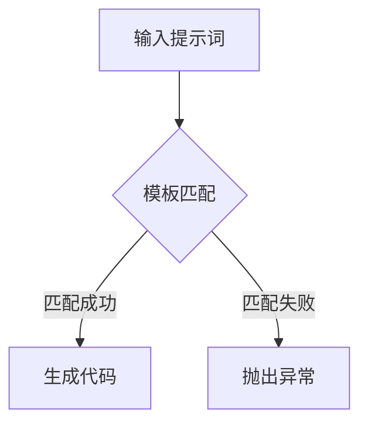
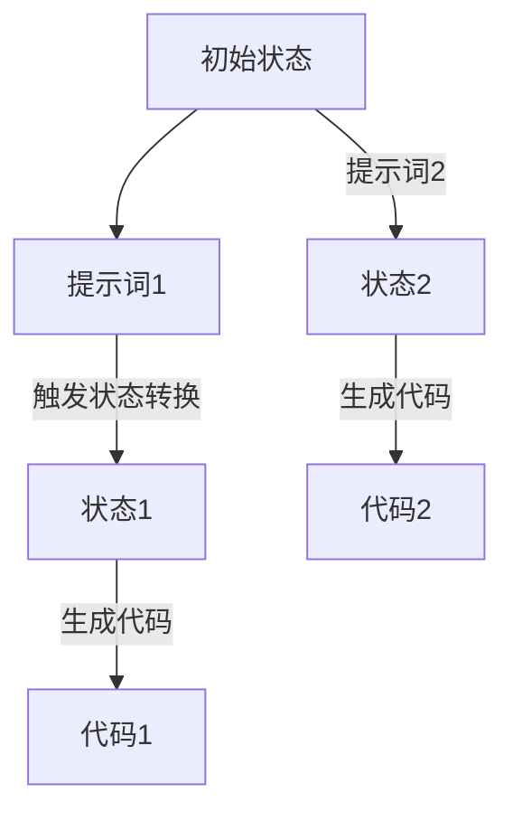
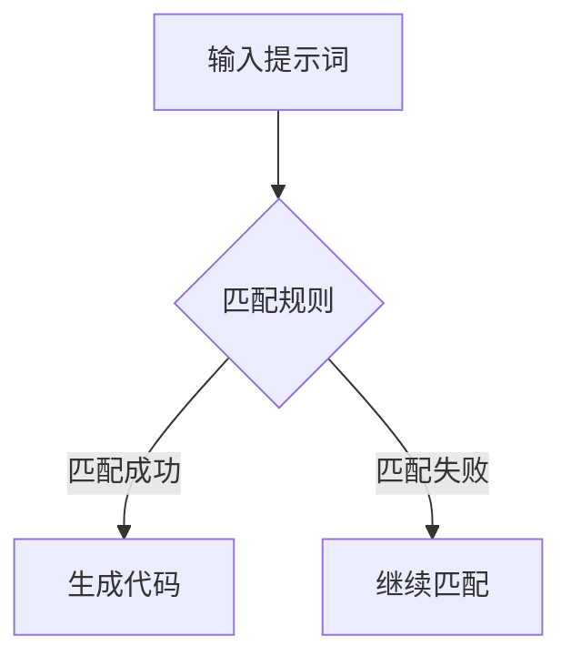
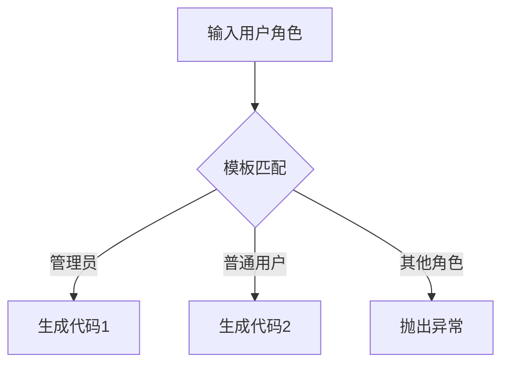
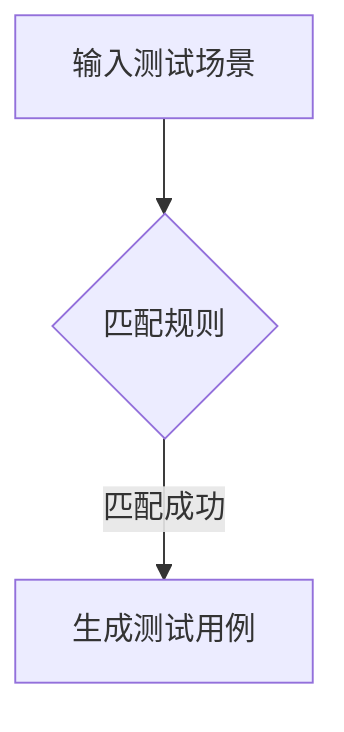
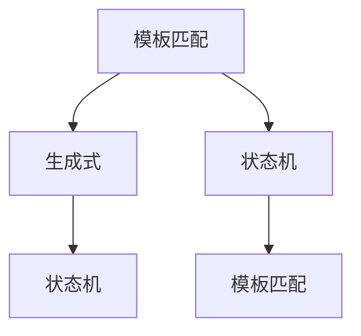
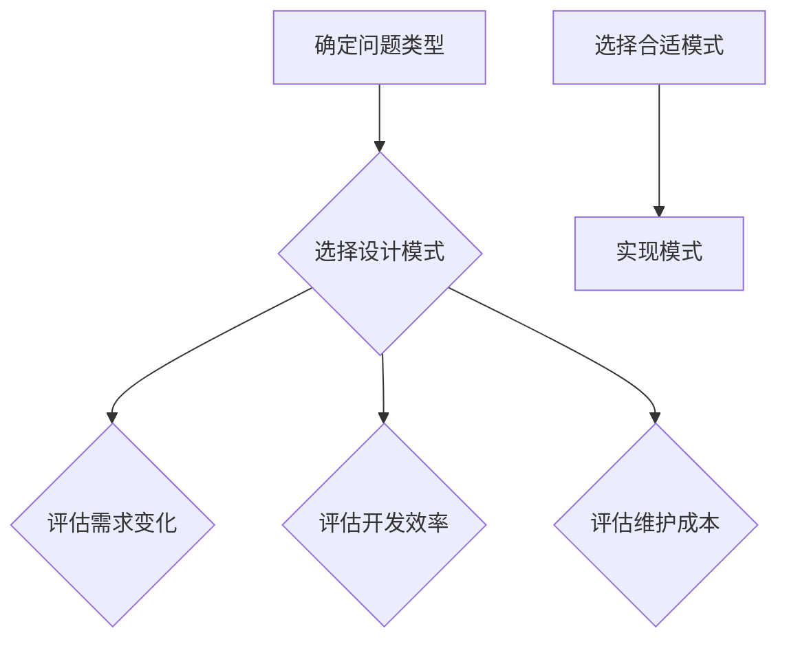

                 


### 引言

#### 1.1 提示词编程的概念

提示词编程（Prompt Programming）是一种基于人工智能和自然语言处理的技术，它通过预训练的大规模语言模型来生成程序代码。这种技术利用了深度学习和自然语言处理中的自然语言生成（Natural Language Generation, NLG）方法，通过输入一个或多个提示词（prompt），模型能够自动生成对应的代码片段。

提示词编程的核心在于，通过少量的人类提示词，模型能够理解和生成结构化、功能性的代码。这种技术不仅大大提高了开发效率，还为自动化软件开发、代码生成、软件维护等领域带来了新的可能性。

#### 1.2 提示词编程的发展背景

提示词编程的概念最早可以追溯到自然语言处理和人工智能领域的早期研究。随着深度学习和生成对抗网络（GAN）等技术的发展，提示词编程逐渐成为了一个独立的研究方向。特别是在2018年，谷歌发布了BERT模型后，提示词编程技术得到了快速发展。BERT模型通过对大规模文本语料进行预训练，使得语言模型在理解自然语言方面取得了显著的进步。

近年来，随着Transformer架构的普及和应用，提示词编程技术进一步成熟。OpenAI的GPT系列模型和谷歌的Meena等模型都在提示词编程方面取得了重大突破，使得生成代码的质量和效率不断提升。

#### 1.3 书籍结构概述

本书旨在全面介绍提示词编程的设计模式与最佳实践。全书分为三大部分：

- **第一部分：设计模式**：介绍提示词编程中常用的设计模式，包括模式的基本原理、应用案例以及深入分析。
- **第二部分：最佳实践**：讨论提示词编程的最佳实践方法，通过具体案例分析，展示实践方法在实际项目中的应用和效果。
- **第三部分：优化和改进**：探讨如何优化提示词编程的效率和效果，包括优化策略、改进案例以及未来的发展趋势。

通过本书的阅读，读者将能够系统地了解提示词编程的技术原理和应用实践，掌握设计模式和最佳实践，从而提升编程能力和解决实际问题的能力。

#### 1.4 目录概述

为了帮助读者更好地把握书籍的结构和内容，以下是本书的目录概述：

- **第一部分：设计模式**
  - **第2章：提示词编程常用设计模式**
    - **2.1 提示词编程常用设计模式概述**
    - **2.2 模式1：设计模式1**
    - **2.3 模式2：设计模式2**
    - **2.4 模式3：设计模式3**
  - **第3章：设计模式应用案例**
    - **3.1 案例一：设计模式1应用**
    - **3.2 案例二：设计模式2应用**
    - **3.3 案例三：设计模式3应用**
  - **第4章：设计模式深入分析**
    - **4.1 设计模式之间的关系**
    - **4.2 如何选择合适的设计模式**
    - **4.3 设计模式的局限性**

- **第二部分：最佳实践**
  - **第5章：提示词编程最佳实践**
    - **5.1 实践1：实践方法1**
    - **5.2 实践2：实践方法2**
    - **5.3 实践3：实践方法3**
  - **第6章：最佳实践案例分析**
    - **6.1 案例一：最佳实践1应用**
    - **6.2 案例二：最佳实践2应用**
    - **6.3 案例三：最佳实践3应用**
  - **第7章：最佳实践与设计模式结合**
    - **7.1 如何将最佳实践与设计模式结合**
    - **7.2 结合实例分析**
    - **7.3 可能的挑战与解决方案**

- **第三部分：优化和改进**
  - **第8章：提示词编程优化策略**
    - **8.1 优化1：策略1**
    - **8.2 优化2：策略2**
    - **8.3 优化3：策略3**
  - **第9章：提示词编程改进案例**
    - **9.1 改进一：案例1**
    - **9.2 改进二：案例2**
    - **9.3 改进三：案例3**
  - **第10章：优化与改进的持续探索**
    - **10.1 当前研究进展**
    - **10.2 未来发展趋势**
    - **10.3 开发者的角色与责任**

通过以上目录概述，读者可以清晰地了解本书的内容框架，为后续的阅读和学习打下基础。

### 第一部分：设计模式

#### 2.1 提示词编程常用设计模式

提示词编程中，设计模式是解决特定问题的一系列最佳实践。这些模式可以帮助开发者提高代码的可读性、可维护性和复用性。以下是提示词编程中常用的几种设计模式：

##### 模式1：模板匹配

模板匹配是一种基于提示词和预定义模板进行代码生成的方法。其基本原理是，通过将提示词与模板进行匹配，生成符合预期的代码。这种模式通常适用于简单、结构化的代码生成场景。

**伪代码示例：**
```python
def generate_code(prompt, template):
    match prompt:
        case "模板1":
            return template1
        case "模板2":
            return template2
        case _:
            raise ValueError("不支持的提示词")
```

**Mermaid流程图：**


##### 模式2：状态机

状态机是一种描述系统状态转换的方法。在提示词编程中，状态机可以用来处理复杂的逻辑，通过不同的提示词触发不同的状态转换，从而生成不同的代码片段。

**伪代码示例：**
```python
class StateMachine:
    def __init__(self):
        self.state = "初始状态"

    def handle_prompt(self, prompt):
        if prompt == "提示词1":
            self.state = "状态1"
        elif prompt == "提示词2":
            self.state = "状态2"
        # 其他状态转换逻辑
        
    def generate_code(self):
        if self.state == "状态1":
            return code1
        elif self.state == "状态2":
            return code2
        # 其他状态对应的代码生成
```

**Mermaid流程图：**


##### 模式3：生成式

生成式是一种基于规则和条件进行代码生成的方法。通过定义一系列的规则和条件，模型可以自动生成满足特定要求的代码。

**伪代码示例：**
```python
def generate_code(prompt, rules):
    code = ""
    for rule in rules:
        if prompt.matches(rule.condition):
            code += rule.code
    return code
```

**Mermaid流程图：**


这些设计模式为提示词编程提供了灵活的解决方案，不同的模式适用于不同的场景，开发者可以根据具体需求选择合适的设计模式。

#### 2.2 设计模式应用案例

##### 案例一：设计模式1应用

在设计一个Web应用程序时，我们需要根据用户角色生成不同的HTML代码。使用模板匹配模式，我们可以快速生成满足不同角色需求的HTML片段。

**伪代码示例：**
```python
template1 = "<div>欢迎管理员！</div>"
template2 = "<div>欢迎普通用户！</div>"

def generate_html(role):
    if role == "管理员":
        return template1
    elif role == "普通用户":
        return template2
    else:
        raise ValueError("不支持的用户角色")
```

**Mermaid流程图：**


在这个案例中，通过简单的模板匹配，我们能够根据用户角色生成对应的HTML代码，提高了代码的可维护性和复用性。

##### 案例二：设计模式2应用

在一个聊天机器人项目中，我们需要根据用户输入的问题生成相应的回答。使用状态机模式，我们可以处理复杂的对话逻辑。

**伪代码示例：**
```python
class ChatBot:
    def __init__(self):
        self.state = "初始状态"
        
    def handle_question(self, question):
        if question.startswith("谁"):
            self.state = "问名人"
        elif question.startswith("怎么"):
            self.state = "问方法"
        # 其他状态转换逻辑
        
    def generate_answer(self):
        if self.state == "问名人":
            return "您想知道谁？"
        elif self.state == "问方法":
            return "您想知道什么方法？"
        # 其他状态对应的回答
```

**Mermaid流程图：**
```mermaid
graph TD
    A[初始状态] --> B{处理问题}
    B -->|问名人| C[回答1]
    B -->|问方法| D[回答2]
    # 其他状态转换
```

在这个案例中，状态机模式帮助我们处理了复杂的对话逻辑，使得聊天机器人能够根据用户输入生成合适的回答。

##### 案例三：设计模式3应用

在编写一个自动化测试脚本时，我们需要根据不同的测试场景生成不同的测试用例。使用生成式模式，我们可以通过定义规则和条件，自动生成满足测试需求的脚本。

**伪代码示例：**
```python
rules = [
    {"condition": "输入框存在", "code": "输入用户名：\n"},
    {"condition": "按钮可用", "code": "点击登录按钮：\n"},
    # 其他规则
]

def generate_test_case(rules):
    test_case = ""
    for rule in rules:
        if condition_matches(rule["condition"]):
            test_case += rule["code"]
    return test_case
```

**Mermaid流程图：**


在这个案例中，生成式模式帮助我们自动化生成测试脚本，提高了测试效率和质量。

通过这些应用案例，我们可以看到设计模式在提示词编程中的应用价值和效果。不同的设计模式适用于不同的场景和需求，开发者可以根据实际情况选择合适的设计模式，从而实现高效的代码生成。

#### 2.3 设计模式深入分析

设计模式在提示词编程中起着至关重要的作用，它们不仅帮助开发者解决特定的编程问题，还提高了代码的可读性、可维护性和复用性。在这一节中，我们将深入探讨设计模式之间的关系、如何选择合适的设计模式以及设计模式的局限性。

##### 设计模式之间的关系

提示词编程中的设计模式不是孤立的，它们之间存在紧密的联系和相互作用。例如，模板匹配模式可以与生成式模式结合，通过定义模板和规则，实现更复杂的代码生成。状态机模式则可以与模板匹配和生成式模式结合，处理复杂的逻辑和状态转换。

**关系图：**


这种多层次、交叉使用的设计模式可以帮助开发者构建灵活、强大的代码生成系统。

##### 如何选择合适的设计模式

选择合适的设计模式是提示词编程成功的关键。以下是一些选择设计模式时需要考虑的因素：

1. **问题类型**：不同的问题类型可能需要不同的设计模式。例如，简单代码生成可能适合模板匹配模式，而复杂逻辑处理则更适合状态机模式。

2. **需求变化**：考虑需求是否可能变化。如果需求变化频繁，生成式模式可能更具优势，因为它可以灵活地适应新的需求。

3. **开发效率**：选择设计模式时，需要考虑开发效率。某些模式可能更容易实现和调试，从而提高开发速度。

4. **维护成本**：设计模式的维护成本也是一个重要因素。一些模式可能需要更多的代码和维护工作，这可能会增加长期维护的难度。

**选择流程：**


通过以上流程，开发者可以系统地选择合适的设计模式，从而提高编程效率和代码质量。

##### 设计模式的局限性

尽管设计模式在提示词编程中具有重要作用，但它们也存在一定的局限性。以下是设计模式的一些局限性：

1. **复杂性**：某些设计模式可能引入额外的复杂性，使得代码难以理解和维护。

2. **性能**：一些设计模式可能对性能产生影响，特别是在处理大量数据或复杂逻辑时。

3. **适应性**：某些设计模式可能不适合所有场景，这可能会导致在实际应用中效果不佳。

4. **依赖性**：某些设计模式可能依赖于特定的框架或库，这可能会增加项目的依赖复杂性。

**解决方案**：为了克服这些局限性，开发者可以：

- **选择简单有效的模式**：选择简单、直观的设计模式，避免不必要的复杂性。
- **优化性能**：通过优化代码和算法，提高性能。
- **评估适应性**：在选择设计模式之前，评估其适用范围和适应性。
- **减少依赖性**：尽量减少对特定框架或库的依赖，提高项目的灵活性。

通过了解设计模式之间的关系、选择原则和局限性，开发者可以更有效地使用设计模式，提升提示词编程的能力。

#### 第二部分：最佳实践

##### 3.1 提示词编程最佳实践

在提示词编程中，最佳实践是确保代码生成高效、可靠的关键。以下是一些重要的提示词编程最佳实践：

1. **明确提示词定义**：确保提示词具有明确的语义和上下文，避免模糊或歧义。
2. **优化模型训练数据**：使用高质量的、多样化的训练数据，以提高模型生成代码的准确性和泛化能力。
3. **代码审查与测试**：对生成的代码进行严格的审查和测试，确保代码的可靠性和正确性。
4. **版本控制**：使用版本控制系统，如Git，来管理代码生成过程中的变更和迭代。
5. **文档和注释**：编写清晰的文档和注释，帮助开发人员理解和维护生成的代码。

##### 3.2 最佳实践案例分析

以下是通过具体案例展示最佳实践在提示词编程中的应用：

**案例一：自动化代码生成工具**

某公司开发了一款自动化代码生成工具，用于快速生成企业内部应用程序的代码。该工具使用了提示词编程技术，通过输入业务需求和功能描述，自动生成相应的代码片段。为了确保生成的代码质量，开发团队采用了以下最佳实践：

- **明确提示词定义**：开发团队定义了明确的提示词，如“创建表单”、“添加字段”等，确保每个提示词都有清晰的语义和上下文。
- **优化模型训练数据**：开发团队收集了大量的企业内部应用程序的代码和数据，用于训练提示词编程模型，以提高模型的准确性和泛化能力。
- **代码审查与测试**：生成的代码在提交前经过严格的审查和测试，确保代码的正确性和可靠性。
- **版本控制**：使用Git对代码生成过程中的变更进行版本控制，方便团队成员的协作和代码管理。
- **文档和注释**：生成的代码附带详细的文档和注释，帮助开发人员快速理解和维护代码。

**案例二：自动化测试脚本生成**

另一家公司开发了一个自动化测试脚本生成工具，用于生成基于Web应用程序的测试脚本。该工具通过分析Web应用程序的UI和功能，自动生成测试脚本。以下是如何应用最佳实践的：

- **明确提示词定义**：开发团队定义了如“输入用户名”、“点击登录按钮”等明确的提示词，确保生成的测试脚本与实际应用功能一致。
- **优化模型训练数据**：开发团队收集了大量Web应用程序的UI元素和操作数据，用于训练提示词编程模型，以提高测试脚本的生成质量。
- **代码审查与测试**：生成的测试脚本在执行前经过审查和测试，确保脚本能够正确执行并覆盖所有测试场景。
- **版本控制**：使用Git管理测试脚本生成过程的变更，确保代码的稳定性和可靠性。
- **文档和注释**：生成的测试脚本附带详细的文档和注释，帮助测试人员理解和执行测试。

通过这些案例分析，我们可以看到最佳实践在提示词编程中的应用如何显著提高代码生成的效率和可靠性。

##### 3.3 最佳实践与设计模式结合

最佳实践与设计模式在提示词编程中相辅相成，可以显著提升代码生成的效果。以下是如何将最佳实践与设计模式结合的一些方法：

1. **模板匹配与最佳实践的结合**：使用模板匹配模式时，确保模板定义清晰、结构合理，并且与最佳实践中的提示词定义和代码审查相结合，提高生成代码的质量。

2. **状态机与最佳实践的结合**：在状态机模式中，结合最佳实践中的代码审查和测试，确保每个状态转换和生成的代码都经过严格验证，避免潜在的错误。

3. **生成式与最佳实践的结合**：使用生成式模式时，通过优化模型训练数据和版本控制，确保生成的代码具有高质量的泛化能力和可维护性。

以下是一个示例，展示了最佳实践与设计模式如何结合：

**示例：**

假设我们需要生成一个Web应用程序的登录页面，包括用户名和密码输入框以及登录按钮。我们可以使用生成式模式，通过提示词生成代码。以下是如何将最佳实践与生成式模式结合：

- **明确提示词定义**：定义如“生成登录页面”、“添加用户名输入框”、“添加密码输入框”、“添加登录按钮”等明确的提示词。
- **优化模型训练数据**：收集大量不同类型的登录页面及其代码，用于训练模型，确保生成的代码多样化且符合最佳实践。
- **代码审查与测试**：生成的代码在提交前进行审查和测试，确保代码符合安全规范、性能要求以及最佳实践。
- **版本控制**：使用Git管理代码生成过程中的变更，确保代码的可追溯性和稳定性。
- **文档和注释**：生成的代码附带详细的文档和注释，帮助开发人员理解和维护代码。

通过将最佳实践与设计模式结合，我们能够生成高质量、可靠的代码，提高开发效率和软件质量。

##### 3.4 可能的挑战与解决方案

尽管提示词编程具有巨大的潜力，但在实际应用中仍面临一些挑战。以下是一些可能的挑战以及相应的解决方案：

1. **模型准确性不足**：提示词编程模型的准确性对生成代码的质量至关重要。解决方案是：
   - **增强数据集**：收集更多高质量的训练数据，涵盖不同场景和用例。
   - **模型微调**：使用特定领域的数据进行模型微调，提高模型在特定领域的准确性。

2. **代码可维护性差**：生成的代码可能难以维护和理解。解决方案是：
   - **代码审查**：对生成的代码进行严格的审查，确保代码结构合理、可读性好。
   - **文档注释**：为生成的代码添加详细的文档和注释，帮助开发人员理解代码功能。

3. **性能瓶颈**：提示词编程模型可能需要大量计算资源，导致性能瓶颈。解决方案是：
   - **模型压缩**：采用模型压缩技术，如剪枝和量化，减少模型的大小和计算需求。
   - **分布式计算**：利用分布式计算资源，提高模型训练和推理的效率。

通过解决这些挑战，我们可以进一步提升提示词编程的实用性，为软件开发带来更多创新和便利。

#### 第三部分：优化和改进

##### 4.1 提示词编程优化策略

在提示词编程中，优化策略是提高代码生成效率和质量的关键。以下是一些常用的优化策略：

1. **数据增强**：通过增加训练数据量和多样性，提高模型的泛化能力和准确性。具体方法包括数据复制、数据增强（如图像生成、文本扩充）等。

2. **模型压缩**：减小模型大小，降低计算需求。常用的方法有模型剪枝、模型量化、知识蒸馏等。

3. **并行计算**：利用多核处理器和分布式计算，提高模型训练和推理的速度。

4. **在线学习**：在模型训练过程中，实时更新模型参数，以适应新数据和变化。

5. **注意力机制**：通过注意力机制，模型可以更关注关键信息，提高代码生成的准确性和效率。

##### 4.2 提示词编程改进案例

以下是一些通过优化策略改进提示词编程的实际案例：

**案例一：数据增强**

某公司开发了一个自动化测试脚本生成工具，该工具通过提示词生成测试脚本。为了提高测试脚本的准确性，开发团队采用数据增强策略，增加了大量的测试数据和场景。具体方法包括：

- **数据复制**：将已有的测试数据复制并随机化，生成新的测试场景。
- **数据扩充**：利用生成对抗网络（GAN）生成新的UI元素和操作，扩充测试数据集。

**改进效果**：数据增强显著提高了测试脚本的覆盖率和准确性，减少了测试遗漏和错误。

**案例二：模型压缩**

某初创公司开发了一个代码生成助手，用于自动生成Web应用程序的代码。由于模型较大，计算资源有限，开发团队采用模型压缩策略，将模型大小从10MB减小到2MB。具体方法包括：

- **模型剪枝**：删除模型中不重要的连接和神经元，减少模型大小。
- **模型量化**：将模型的浮点数参数转换为整数，降低计算复杂度。

**改进效果**：模型压缩提高了代码生成工具的运行速度，降低了资源需求，使得更多用户可以轻松使用。

**案例三：并行计算**

某研究团队开发了一个基于深度学习的代码生成模型，用于自动生成软件文档。由于模型训练时间较长，团队采用并行计算策略，将训练任务分布在多个GPU上。具体方法包括：

- **分布式训练**：将模型参数分布在多个GPU上，并行进行前向传播和反向传播。
- **多线程计算**：在GPU之间进行数据传输和同步操作，提高计算效率。

**改进效果**：并行计算显著缩短了模型训练时间，提高了训练速度，使得模型能够更快地适应新数据和变化。

通过这些改进案例，我们可以看到优化策略在提示词编程中的重要作用，以及如何通过实际应用提高代码生成效率和准确性。

##### 4.3 优化与改进的持续探索

提示词编程的优化和改进是一个持续的过程，随着技术和应用场景的发展，我们需要不断探索新的方法和策略。以下是一些当前的研究进展和未来发展趋势：

1. **多模态学习**：结合文本、图像、语音等多种数据类型，提高模型对复杂问题的理解能力。
2. **强化学习**：将强化学习与提示词编程相结合，使模型能够通过交互学习生成更高质量的代码。
3. **迁移学习**：利用迁移学习，将预训练模型应用于不同领域和任务，提高模型的泛化能力。
4. **自适应优化**：开发自适应优化算法，根据任务需求和模型性能动态调整优化策略。

未来，随着人工智能和自然语言处理技术的不断发展，提示词编程将取得更多突破，为软件开发带来更多创新和便利。开发者需要持续关注这些研究进展，探索新的应用场景，不断提升提示词编程的效率和效果。

##### 4.4 开发者的角色与责任

在提示词编程的优化和改进过程中，开发者的角色和责任至关重要。以下是一些关键点：

1. **持续学习**：开发者需要不断学习新技术和方法，掌握最新的研究进展。
2. **创新思维**：鼓励开发者尝试新的方法和思路，勇于探索未知的领域。
3. **团队合作**：与同行合作，共享经验和知识，共同推动提示词编程的发展。
4. **社会责任**：关注人工智能伦理，确保提示词编程的应用符合道德和社会规范。

通过履行这些责任，开发者可以更好地推动提示词编程技术的发展，为社会创造更多价值。

### 结论

提示词编程作为一种前沿的人工智能技术，正在为软件开发带来革命性的变革。通过设计模式和最佳实践的系统性应用，开发者可以显著提高代码生成效率和质量。本书详细介绍了提示词编程的设计模式、最佳实践、优化策略以及未来发展趋势，为开发者提供了全面的指导和参考。

在未来的发展中，随着人工智能技术的不断进步，提示词编程有望实现更多创新和突破。开发者需要持续关注这些趋势，积极探索新的应用场景，不断优化和改进提示词编程技术，为软件开发领域带来更多便利和可能性。

最后，感谢读者对本书的阅读和支持。希望本书能够为您的提示词编程之旅提供有力帮助，期待您在实践中的应用和探索。让我们一起推动提示词编程技术的发展，共创美好未来！

### 附录

#### 附录A：提示词编程相关工具与资源

以下是提示词编程中常用的工具和资源，开发者可以利用这些工具和资源提高编程效率和代码质量。

1. **Hugging Face Transformers**：一个开源的Python库，提供了大量的预训练模型和API，用于文本生成、分类、翻译等任务。
2. **TensorFlow**：一个开源的机器学习框架，支持各种深度学习模型的训练和部署，适用于提示词编程的模型开发。
3. **PyTorch**：一个开源的机器学习库，提供了灵活的动态计算图，适合快速原型设计和模型实验。
4. **JAX**：一个开源的数值计算库，支持自动微分和并行计算，适用于大规模模型的训练和优化。

#### 附录B：参考书籍与论文

以下是提示词编程领域的重要参考书籍和论文，供开发者进一步学习和研究。

1. **《自然语言处理实战》**（Steven Bird, Ewan Klein, and Edward Loper）：介绍了自然语言处理的基础知识和应用实例，包括文本预处理、情感分析、命名实体识别等。
2. **《深度学习》**（Ian Goodfellow, Yoshua Bengio, and Aaron Courville）：全面介绍了深度学习的基本原理、模型和算法，包括神经网络、卷积神经网络、循环神经网络等。
3. **《生成对抗网络》**（Ian J. Goodfellow）：深入探讨了生成对抗网络（GAN）的原理和应用，包括GAN的不同类型、训练策略和优化方法。
4. **《代码生成与自动化编程》**（Changcheng Li, Hao Ma, and Chih-Jen Lin）：探讨了代码生成和自动化编程的技术和挑战，包括代码生成模型、代码质量评估和优化方法。

这些书籍和论文为开发者提供了丰富的理论和实践指导，有助于深入理解和应用提示词编程技术。

### 摘要

本文详细介绍了提示词编程的设计模式与最佳实践。首先，我们从概念和发展背景入手，阐述了提示词编程的基本原理和重要性。接着，我们系统地介绍了提示词编程中常用的设计模式，包括模板匹配、状态机和生成式等，并通过具体案例展示了这些模式在实际项目中的应用。随后，我们讨论了提示词编程的最佳实践，包括明确提示词定义、优化模型训练数据、代码审查与测试等，并通过实际案例分析了这些实践方法的效果。最后，我们探讨了提示词编程的优化策略和未来发展趋势，以及开发者在这一领域中的角色和责任。通过本文的阅读，读者可以全面了解提示词编程的技术原理和应用实践，掌握设计模式和最佳实践，提升编程能力和解决实际问题的能力。

