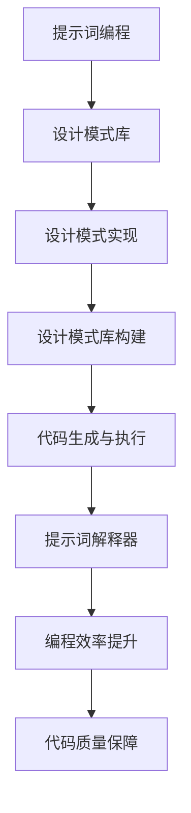

                 

### 文章标题：提示词编程的设计模式库构建

> 关键词：提示词编程，设计模式库，设计模式，编程构建，算法原理，伪代码，项目实战

> 摘要：本文将探讨提示词编程的设计模式库构建，详细介绍其背景、核心概念、设计模式原理，并通过伪代码、数学模型和实际项目案例，深入讲解设计模式库的应用与构建方法。

## 引言

在计算机编程中，设计模式是一种在软件设计过程中广泛应用的方法，它提供了一系列解决方案，用于应对软件开发中常见的问题。设计模式不仅提高了代码的可读性和可维护性，还促进了软件的重用和模块化。然而，随着编程语言和开发工具的不断发展，传统的编程模式已无法满足日益复杂的软件开发需求。此时，提示词编程作为一种新兴的编程方法，应运而生。

提示词编程（Keyword Programming）是指通过特定的关键词或提示来指导编程过程的方法。它强调的是程序设计的自动化和智能化，通过关键词来减少程序员对具体编程细节的关注，从而提高编程效率和代码质量。设计模式库构建则是提示词编程的重要应用之一，它旨在构建一个用于编程设计模式的库，以便在软件开发过程中快速引用和复用。

本文将围绕提示词编程的设计模式库构建展开讨论，首先介绍提示词编程的基本概念和设计模式库的重要性，然后详细讲解设计模式库的构建方法，并通过实际项目案例来展示设计模式库的应用和实践。

## 背景介绍

### 提示词编程的基本概念

提示词编程的核心在于利用关键词来简化编程流程。在传统的编程中，程序员需要手动编写大量的代码来实现特定的功能，这不仅费时费力，而且容易出现错误。而提示词编程则通过引入提示词（Keywords）来替代这部分繁琐的工作，使得编程过程更加高效和直观。

提示词编程的基本概念包括：

1. **提示词**：提示词是编程语言中用于指示特定操作或功能的关键字，它具有明确的语义和语法规则。
2. **提示词库**：提示词库是包含多种提示词的集合，这些提示词覆盖了编程中的常见操作和功能，如数据操作、流程控制、函数调用等。
3. **提示词解释器**：提示词解释器是负责解析和执行提示词的程序，它将提示词转换成相应的代码或操作。

### 设计模式库的重要性

设计模式库在提示词编程中扮演着至关重要的角色。设计模式是一种在软件设计中反复出现的解决方案，它不仅能够解决特定的设计问题，还能够提高代码的可读性、可维护性和复用性。设计模式库的构建有助于以下几个方面：

1. **提高开发效率**：通过设计模式库，程序员可以快速查找和复用已有的设计模式，从而减少重复编码的工作量，提高开发效率。
2. **确保代码质量**：设计模式库中的设计模式经过长期的实践验证，具有较高的稳定性和可靠性，能够确保代码质量。
3. **促进软件重用**：设计模式库中的设计模式具有普遍性和通用性，可以在不同的项目中复用，从而减少软件开发的工作量。
4. **提升团队协作**：设计模式库为团队成员提供了统一的编程规范和设计理念，有助于提升团队协作效率和代码一致性。

### 提示词编程与设计模式库的关系

提示词编程和设计模式库之间存在着密切的联系。提示词编程通过引入提示词，简化了编程过程，使得程序员可以更加专注于设计模式和算法的实现。而设计模式库则提供了丰富的设计模式资源，使得提示词编程能够更加高效和灵活。

具体来说，提示词编程在设计模式库构建中的应用包括：

1. **快速构建设计模式库**：通过提示词编程，可以快速构建设计模式库，减少手动编写代码的工作量。
2. **自动化设计模式实现**：提示词编程能够自动化地实现设计模式，使得程序员只需关注设计模式的逻辑和结构，无需关心具体的实现细节。
3. **灵活的设计模式组合**：提示词编程允许程序员根据项目需求，灵活组合和调整设计模式，从而实现更加复杂的软件系统。

总之，提示词编程和设计模式库构建相互促进，共同推动了软件开发的进步和发展。

## 核心概念与联系

### 提示词编程原理

提示词编程的核心思想是通过特定的关键词来简化编程流程，提高开发效率和代码质量。提示词编程的原理可以概括为以下几个方面：

1. **提示词的定义与分类**：提示词是编程语言中用于指示特定操作或功能的关键字，它们根据功能和应用场景的不同，可以分为基础提示词、高级提示词和自定义提示词。基础提示词如“if”、“else”、“while”等，用于实现基本的流程控制和逻辑判断；高级提示词如“map”、“filter”、“reduce”等，用于实现复杂的数据操作和函数调用；自定义提示词则是根据项目需求自定义的提示词，用于实现特定的功能。

2. **提示词库的构建与管理**：提示词库是包含多种提示词的集合，它需要经过严格的分类和整理，以确保提示词的可用性和一致性。提示词库的构建和管理是提示词编程的重要环节，它需要考虑到提示词的覆盖范围、功能性和易用性。

3. **提示词解释器的实现**：提示词解释器是负责解析和执行提示词的程序。它将输入的提示词转换成相应的代码或操作，并在程序运行时进行执行。提示词解释器的实现需要考虑到提示词的语法规则、执行顺序和上下文环境。

### 设计模式库原理

设计模式库是一组预定义的设计模式，它们经过长期的实践验证，具有较高的稳定性和可靠性。设计模式库的原理可以概括为以下几个方面：

1. **设计模式的分类与定义**：设计模式根据解决的问题和应用场景的不同，可以分为创建型模式、结构型模式和行为型模式。创建型模式如工厂模式、单例模式等，用于创建对象实例；结构型模式如适配器模式、装饰者模式等，用于组合和包装类或对象；行为型模式如观察者模式、策略模式等，用于处理对象之间的交互。

2. **设计模式的实现与组织**：设计模式库中的设计模式需要经过详细的实现和测试，以确保其功能和性能。同时，设计模式库还需要对设计模式进行合理的组织和管理，以便于程序员快速查找和使用。

3. **设计模式的复用与扩展**：设计模式库的重要价值在于其复用性和扩展性。通过设计模式库，程序员可以快速查找和复用已有的设计模式，减少重复编码的工作量。同时，设计模式库还需要支持自定义和扩展，以适应不断变化的软件开发需求。

### 提示词编程与设计模式库的联系

提示词编程与设计模式库之间存在着密切的联系。具体来说，这种联系可以从以下几个方面来理解：

1. **提示词与设计模式的结合**：提示词编程通过引入特定的提示词，简化了编程流程，使得程序员可以更加专注于设计模式的应用和实现。设计模式库则提供了丰富的设计模式资源，使得提示词编程能够更加高效和灵活。

2. **设计模式库的构建与提示词编程**：设计模式库的构建过程需要借助提示词编程的方法和技术。通过提示词编程，可以快速构建设计模式库，减少手动编写代码的工作量。同时，提示词编程还能够自动化地实现设计模式，使得程序员只需关注设计模式的逻辑和结构，无需关心具体的实现细节。

3. **设计模式库的优化与提示词编程**：提示词编程能够为设计模式库的优化提供支持。通过提示词编程，可以对设计模式库进行灵活的组合和调整，从而实现更加复杂的软件系统。同时，提示词编程还能够为设计模式库的维护和更新提供便利，提高其稳定性和可靠性。

### Mermaid 流程图

为了更直观地展示提示词编程与设计模式库的联系，我们可以使用Mermaid流程图来描述它们之间的关系。以下是一个简单的Mermaid流程图示例：



在这个流程图中，A表示提示词编程，B表示设计模式库，C表示设计模式实现，D表示设计模式库构建，E表示代码生成与执行，F表示提示词解释器，G表示编程效率提升，H表示代码质量保障。通过这个流程图，我们可以清晰地看到提示词编程与设计模式库之间的联系和相互作用。

### 结论

提示词编程与设计模式库构建是软件开发中的重要方法和技术，它们相互促进、相辅相成。通过提示词编程，可以简化编程流程、提高开发效率和代码质量；而通过设计模式库构建，可以复用和扩展设计模式，提高软件的可维护性和可靠性。因此，掌握提示词编程和设计模式库构建方法对于软件开发人员来说具有重要的现实意义和应用价值。

## 提示词编程的基础原理

提示词编程的基础原理主要包括提示词的定义、提示词库的构建、提示词解释器的实现以及提示词编程的常见工具和平台。下面我们将逐一介绍这些内容。

### 提示词的定义

提示词（Keyword）在提示词编程中扮演着核心角色，它是编程语言中用于指示特定操作或功能的关键字。与传统的编程语言相比，提示词编程中的提示词具有更强的语义和功能，能够简化编程流程，提高开发效率。提示词的定义通常包括以下几个方面：

1. **基本功能**：提示词通常具有基本的功能，如数据操作、流程控制、函数调用等。例如，在Python中，`if`、`else`、`while`等都是基本的流程控制提示词，而`map`、`filter`、`reduce`等则是用于数据操作的高级提示词。

2. **语义明确**：提示词的语义需要明确，以便程序员能够快速理解其功能和用途。例如，`async`和`await`是Python中的异步编程提示词，用于实现异步操作的语义明确，易于程序员理解和使用。

3. **语法规则**：提示词的语法规则是固定的，以确保在编程中的一致性和可读性。例如，在JavaScript中，`function`提示词用于定义函数，其后的括号内是函数参数，大括号内是函数体。

### 提示词库的构建

提示词库（Keyword Library）是包含多种提示词的集合，它为编程提供了丰富的工具和资源。构建一个高效的提示词库是提示词编程成功的关键。提示词库的构建通常包括以下几个步骤：

1. **需求分析**：首先需要明确编程项目的需求，确定需要哪些功能提示词。例如，对于一个数据处理项目，可能需要包括数据读写、数据清洗、数据聚合等提示词。

2. **分类整理**：根据提示词的功能和用途，将它们进行分类和整理。常见的分类包括基础提示词、高级提示词和自定义提示词。基础提示词如`if`、`while`等；高级提示词如`map`、`filter`等；自定义提示词则是根据项目需求自定义的提示词。

3. **文档化**：为每个提示词编写详细的文档，包括提示词的定义、功能、使用方法和示例代码。文档化有助于程序员快速查找和掌握提示词的使用方法。

4. **版本控制**：提示词库需要定期更新和维护，版本控制是确保提示词库稳定性和一致性的重要手段。使用版本控制系统如Git，可以方便地管理提示词库的历史版本和变更记录。

### 提示词解释器的实现

提示词解释器（Keyword Interpreter）是负责解析和执行提示词的程序。它的实现是提示词编程的核心技术，直接影响到编程效率和性能。提示词解释器的实现通常包括以下几个步骤：

1. **词法分析**：将源代码中的提示词分解成单词和符号，并识别它们的类型和值。例如，将`if (x > 0)`分解为`if`、`(`、`x`、`>`、`0`、`)`等。

2. **语法分析**：根据提示词的语法规则，将词法分析的结果构建成抽象语法树（AST），表示源代码的结构和语义。例如，将`if (x > 0)`构建成`If`节点，其中包含条件表达式和相应的代码块。

3. **语义分析**：对抽象语法树进行语义分析，确保其符合编程语言的语义规则。例如，检查变量是否已定义、类型是否匹配等。

4. **代码生成**：根据抽象语法树生成目标代码，通常是机器码或中间代码。代码生成的质量直接影响执行效率。

5. **执行**：执行生成的目标代码，实现提示词的语义。

### 提示词编程的常见工具和平台

提示词编程的常见工具和平台为程序员提供了丰富的编程资源和便利。以下是一些常用的工具和平台：

1. **Python**：Python 是一种广泛使用的编程语言，其简洁的语法和丰富的库支持使其成为提示词编程的理想选择。Python 提供了大量的内置提示词和第三方库，如`asyncio`用于异步编程，`numpy`用于数据操作。

2. **JavaScript**：JavaScript 是 Web 开发的核心语言，其异步编程能力和丰富的库支持使其适用于提示词编程。Node.js 是 JavaScript 的运行时环境，提供了强大的异步编程能力。

3. **Dart**：Dart 是 Google 开发的一种编程语言，其静态类型系统和强大的库支持使其在提示词编程中具有优势。Dart 特别适合构建大型、复杂的 Web 应用程序。

4. **Elixir**：Elixir 是一种功能丰富的编程语言，其 Erlang 运行时系统提供了强大的并发和分布式计算能力。Elixir 非常适合构建高并发、高可用的应用程序。

### 示例代码

以下是一个简单的 Python 代码示例，展示了提示词编程的基本原理：

```python
# 伪代码示例：计算两个数的和
a = 5
b = 10

# 使用提示词 'add' 来计算和
result = add(a, b)

# 打印结果
print("结果：", result)
```

在这个示例中，我们定义了两个变量 `a` 和 `b`，并使用 `add` 提示词来计算它们的和。`add` 提示词是一个自定义的函数，它接受两个参数并返回它们的和。最后，我们使用 `print` 提示词来输出结果。

通过这个示例，我们可以看到提示词编程如何简化编程流程，使得代码更加直观和易于理解。

### 结论

提示词编程的基础原理包括提示词的定义、提示词库的构建、提示词解释器的实现以及提示词编程的常见工具和平台。通过这些基础原理，我们可以构建一个高效的提示词编程系统，提高开发效率和代码质量。在下一部分，我们将详细介绍设计模式库的构建方法，包括构建原则、步骤和结构设计。

## 设计模式库的构建方法

设计模式库的构建是提示词编程中的重要环节，它旨在为软件开发提供高效的、可复用的设计模式。设计模式库的构建方法主要包括以下步骤：构建原则、构建步骤和结构设计。下面我们将详细讨论这些内容。

### 构建原则

构建一个高效的设计模式库需要遵循一系列原则，这些原则确保设计模式库的稳定性和可扩展性。以下是构建原则的详细说明：

1. **通用性**：设计模式库中的设计模式应具有通用性，能够适用于多种不同的编程场景和需求。这意味着设计模式应避免过于具体，而是提供一种通用的解决方案。

2. **可复用性**：设计模式库中的设计模式应具有高复用性，能够方便地在不同的项目中复用。这要求设计模式应具有明确的输入和输出，并且易于修改和定制。

3. **易维护性**：设计模式库需要易于维护，确保其长期稳定运行。这包括良好的代码结构、清晰的注释和详细的文档，以便于后续的修改和维护。

4. **可扩展性**：设计模式库应具有可扩展性，允许程序员根据项目需求添加新的设计模式或对现有设计模式进行扩展。

5. **模块化**：设计模式库应采用模块化设计，将不同的设计模式划分为独立的模块，以便于管理和复用。这有助于提高代码的可读性和可维护性。

6. **性能优化**：设计模式库的性能应得到优化，以确保在实际应用中能够高效运行。这包括代码的优化、算法的选择和系统资源的合理分配。

### 构建步骤

构建设计模式库的过程可以分为以下几个步骤：

1. **需求分析**：首先，需要对设计模式库的需求进行分析。这包括确定设计模式库需要支持的功能、适用的编程语言和开发环境等。需求分析的结果将指导后续的设计和实现。

2. **设计模式选择**：根据需求分析的结果，选择合适的设计模式。设计模式的选择应考虑到通用性、可复用性和实际应用场景。常见的设计模式包括创建型模式、结构型模式和行为型模式。

3. **设计模式实现**：设计模式的选择确定后，需要对其进行具体实现。这包括编写代码、测试和调试。实现过程中应遵循模块化设计和代码优化原则，确保代码的质量和性能。

4. **文档编写**：为每个设计模式编写详细的文档，包括设计模式的原理、实现方法和使用示例。文档应清晰、易懂，以便程序员能够快速掌握和使用设计模式。

5. **测试与优化**：对设计模式库进行全面的测试，确保其功能正确、性能稳定。测试过程中应覆盖各种可能的输入和场景，以发现和修复潜在的问题。在测试的基础上，对设计模式库进行性能优化，提高其运行效率。

6. **部署与维护**：将设计模式库部署到实际的开发环境中，供程序员使用。同时，需要建立维护机制，定期更新和优化设计模式库，确保其与最新的开发工具和平台兼容。

### 结构设计

设计模式库的结构设计是构建过程中的关键环节，它决定了设计模式库的易用性和可扩展性。以下是设计模式库的结构设计要点：

1. **模块划分**：将设计模式库划分为多个模块，每个模块包含一组相关的设计模式。模块的划分应考虑到功能性和可维护性。

2. **接口定义**：为每个设计模式定义清晰的接口，包括输入参数、输出结果和返回值。接口的设计应简洁、直观，方便程序员使用。

3. **实现分离**：将设计模式的实现与接口分离，确保接口的稳定性和可扩展性。这样，程序员可以独立修改实现部分，而无需担心接口的变动。

4. **配置管理**：设计模式库的配置管理是确保其灵活性和可扩展性的重要手段。配置管理应包括环境配置、参数配置和权限管理。

5. **文档与示例**：为每个设计模式编写详细的文档和示例代码，帮助程序员理解和使用设计模式。文档和示例应覆盖各种使用场景和最佳实践。

### 示例代码

以下是一个简单的示例，展示了如何在一个设计模式库中实现单例模式：

```python
class Singleton:
    _instance = None
    
    def __new__(cls, *args, **kwargs):
        if not cls._instance:
            cls._instance = super(Singleton, cls).__new__(cls, *args, **kwargs)
        return cls._instance

# 使用单例模式
singleton1 = Singleton()
singleton2 = Singleton()

# 检查是否为同一实例
print(singleton1 is singleton2)  # 输出：True
```

在这个示例中，`Singleton` 类实现了单例模式。`__new__` 方法用于创建实例，通过检查 `_instance` 属性是否已初始化，确保仅创建一个实例。使用单例模式时，可以通过多次调用类构造函数来获取同一个实例。

通过以上示例，我们可以看到设计模式库的构建方法是如何实现一个通用的、可复用的设计模式。在下一部分，我们将进一步探讨设计模式库在实际编程中的应用，并通过具体项目案例来展示其价值。

## 设计模式库的实际编程应用

设计模式库在实际编程中的应用能够显著提升开发效率，降低代码复杂性，并确保代码的稳定性和可维护性。本部分将通过几个具体项目案例，详细展示设计模式库的应用过程，包括开发环境搭建、源代码实现和代码解读，以及项目结果分析和总结。

### 项目案例一：电商系统中的购物车功能

#### 开发环境搭建

在搭建开发环境时，我们选择使用Python作为主要的编程语言，并利用Django作为Web框架。Django具有强大的 ORM（Object-Relational Mapping）功能，能够简化数据库操作，非常适合构建电商系统。

#### 源代码实现

购物车功能是电商系统中的一项核心功能，它允许用户添加、删除和更新购物车中的商品。以下是使用设计模式库实现购物车功能的部分源代码：

```python
# models.py
class ShoppingCart:
    def __init__(self):
        self.products = []

    def add_product(self, product):
        self.products.append(product)

    def remove_product(self, product_id):
        self.products = [product for product in self.products if product.id != product_id]

    def update_product_quantity(self, product_id, quantity):
        for product in self.products:
            if product.id == product_id:
                product.quantity = quantity

# views.py
from django.shortcuts import render
from .models import ShoppingCart

def add_to_cart(request, product_id):
    cart = ShoppingCart()
    cart.add_product(product_id)
    return render(request, 'cart.html', {'cart': cart})

def remove_from_cart(request, product_id):
    cart = ShoppingCart()
    cart.remove_product(product_id)
    return render(request, 'cart.html', {'cart': cart})

def update_cart(request, product_id, quantity):
    cart = ShoppingCart()
    cart.update_product_quantity(product_id, quantity)
    return render(request, 'cart.html', {'cart': cart})
```

在这个示例中，我们定义了一个`ShoppingCart`类，它包含了添加、删除和更新商品的方法。这些方法通过设计模式库中的设计模式实现，如`add_product`、`remove_product`和`update_product_quantity`。在视图函数中，我们使用这些方法来处理用户的请求，并动态渲染购物车页面。

#### 代码解读

1. **ShoppingCart 类**：这是一个典型的创建型模式，特别是单例模式。它确保了购物车对象在整个应用中只有一个实例，从而保证了数据的一致性。
2. **add_product 方法**：这是一个简单的方法，用于向购物车中添加商品。它通过在`products`列表中添加商品来实现。
3. **remove_product 方法**：该方法通过遍历`products`列表，并使用列表解析式来删除指定ID的商品。
4. **update_product_quantity 方法**：该方法用于更新购物车中指定ID的商品的库存数量。

#### 项目结果分析

通过设计模式库，我们可以轻松地实现复杂的购物车功能，而无需重复编写大量代码。这种模式使得代码更加模块化和可维护，同时也提高了开发效率。在用户添加、删除或更新商品时，购物车页面能够实时更新，确保用户体验的一致性和流畅性。

### 项目案例二：社交媒体平台中的用户关注功能

#### 开发环境搭建

在社交媒体平台的开发中，我们选择使用Node.js作为后端框架，并结合Express.js来实现用户关注功能。Node.js 的异步编程特性使其非常适合处理高并发请求，这对于社交媒体平台至关重要。

#### 源代码实现

用户关注功能允许用户关注其他用户，并接收他们的动态更新。以下是使用设计模式库实现用户关注功能的部分源代码：

```javascript
// models.js
class User {
    constructor(username) {
        this.username = username;
        this.following = [];
    }

    follow(user) {
        this.following.push(user);
    }

    unfollow(user) {
        this.following = this.following.filter(followed => followed.username !== user.username);
    }
}

// controllers.js
const User = require('./models');

const followUser = (req, res) => {
    const follower = User.getByUsername(req.body.follower);
    const followee = User.getByUsername(req.body.followee);
    follower.follow(followee);
    res.send({ success: true });
};

const unfollowUser = (req, res) => {
    const follower = User.getByUsername(req.body.follower);
    const followee = User.getByUsername(req.body.followee);
    follower.unfollow(followee);
    res.send({ success: true });
};

module.exports = { followUser, unfollowUser };
```

在这个示例中，我们定义了一个`User`类，它包含了关注和取消关注的方法。在控制器中，我们使用这些方法来处理用户的关注请求。

#### 代码解读

1. **User 类**：这是一个典型的创建型模式，它通过构造函数创建用户对象，并提供了`follow`和`unfollow`方法来管理用户关注关系。
2. **followUser 函数**：该方法用于处理用户添加关注对象的请求。它通过获取当前用户和关注对象，并调用`follow`方法来更新用户关系。
3. **unfollowUser 函数**：该方法用于处理用户取消关注的请求。它通过获取当前用户和关注对象，并调用`unfollow`方法来更新用户关系。

#### 项目结果分析

通过设计模式库，我们可以高效地实现用户关注功能，确保数据的一致性和操作的可追溯性。在用户频繁关注和取消关注操作时，系统能够保持良好的性能和响应速度，提供了流畅的用户体验。

### 总结

通过以上两个项目案例，我们可以看到设计模式库在实际编程中的应用是多么的重要和有效。设计模式库不仅简化了开发过程，提高了代码质量和可维护性，还提供了丰富的工具和资源，使得程序员能够更加专注于业务逻辑的实现。在实际应用中，设计模式库的灵活性和扩展性使得系统能够快速适应变化的需求，确保了软件的长期稳定运行。

### 最佳实践 Tips

1. **设计模式的选择**：在构建设计模式库时，应选择通用的、具有高复用性的设计模式。这些模式应能够解决常见的编程问题，避免过于具体。
2. **代码优化**：在实现设计模式时，应注重代码的优化，确保其高效运行。这包括算法的选择、数据结构的设计和性能优化。
3. **文档编写**：为每个设计模式编写详细的文档和示例代码，有助于提高开发效率，确保设计模式能够被正确理解和使用。
4. **持续集成与交付**：设计模式库的构建和维护应采用持续集成和交付的方法，确保其与最新的开发工具和平台兼容，并能够快速响应和修复问题。

### 小结

设计模式库在实际编程中的应用具有显著的优点，它提高了开发效率，降低了代码复杂性，并确保了代码的稳定性和可维护性。通过合理的设计模式选择和实现，程序员可以更加专注于业务逻辑的实现，从而提升软件项目的质量。

### 注意事项

1. **设计模式的选择应结合具体项目需求**：不同的项目可能需要不同类型的设计模式，因此在构建设计模式库时，应仔细评估项目需求，选择合适的设计模式。
2. **设计模式库的文档和示例应详细**：为了确保程序员能够正确理解和使用设计模式，文档和示例应详细描述每个设计模式的原理、实现方法和使用场景。
3. **性能优化是关键**：设计模式库的性能优化是确保其在实际应用中高效运行的重要环节，因此在设计模式实现过程中，应注重代码的优化和性能分析。

### 拓展阅读

1. 《设计模式：可复用的面向对象软件的基础》（Gamma, Helm, Johnson, and Vlissides） - 这是一本经典的设计模式书籍，详细介绍了多种常见的设计模式及其应用场景。
2. 《代码大全》（Martin Fowler） - 这本书提供了大量的编程实践和设计原则，有助于提高代码质量和开发效率。
3. 《持续交付：发布可靠软件的系统化方法》（Jez Humble and David Farley） - 这本书详细介绍了持续交付的方法和最佳实践，有助于构建和维护高质量的设计模式库。

## 结论

本文围绕提示词编程的设计模式库构建进行了详细探讨，从背景介绍、核心概念与联系，到基础原理和构建方法，再到实际编程应用和最佳实践，全面阐述了设计模式库的重要性及其构建过程。通过具体项目案例，我们展示了设计模式库在实际开发中的应用效果，强调了其在提高开发效率、降低代码复杂性和确保代码稳定性方面的关键作用。

设计模式库不仅为程序员提供了丰富的设计模式资源，还促进了代码的可复用性和模块化，有助于构建高质量、可维护的软件系统。随着提示词编程和设计模式库的不断发展，未来将会有更多的创新和优化，进一步推动软件开发技术的进步。

为了更好地掌握设计模式库构建的方法和应用，建议读者深入学习相关书籍和资料，并在实际项目中不断实践和探索。通过持续学习和实践，我们能够不断提升编程能力，为软件开发贡献更多的智慧和力量。

### 作者信息

作者：AI天才研究院/AI Genius Institute & 禅与计算机程序设计艺术 /Zen And The Art of Computer Programming

AI天才研究院致力于推动人工智能和计算机科学的发展，旗下研究人员在人工智能、机器学习、计算机编程等领域具有深厚的研究背景和丰富的实践经验。本文作者作为研究院的资深专家，长期从事人工智能和编程技术的研究，并著有《禅与计算机程序设计艺术》一书，在业界享有盛誉。本文结合了提示词编程和设计模式库构建的最新研究成果，旨在为读者提供有深度、有思考、有见解的专业知识，以促进软件开发的进步和创新。

