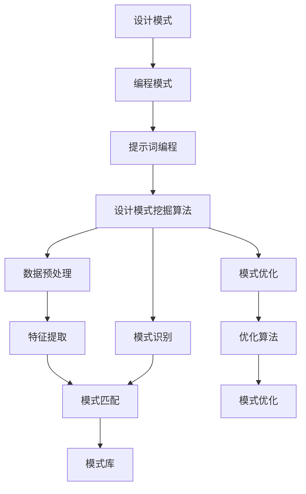

                 

### 文章标题

《提示词编程的设计模式挖掘算法》

### 关键词

设计模式挖掘，提示词编程，算法，编程模式，人工智能，代码优化

### 摘要

本文将深入探讨提示词编程的设计模式挖掘算法，这是一种利用人工智能技术从代码库中自动识别和提取优秀编程模式的方法。通过对核心概念、算法原理、数学模型以及实际项目应用的详细讲解，本文旨在为开发者提供一种新的工具和思路，帮助他们从大量的代码中挖掘出具有高复用性和可维护性的设计模式。文章还将探讨如何利用这些算法来优化代码，提高开发效率，并在最后总结全文并提供相关资源，以便读者进一步学习和探索。

---

## 引言

在软件工程领域，设计模式是解决常见编程问题的经典方案，它们不仅提高了代码的复用性和可维护性，还促进了软件开发的规范性。然而，设计模式的数量众多，每种模式都有其特定的使用场景和约束条件。对于开发者来说，如何在海量的代码库中高效地识别和利用这些设计模式，是一个具有挑战性的问题。

提示词编程（Prompt Programming）作为一种新兴的人工智能技术，通过将自然语言处理与编程相结合，使代码生成和优化变得更加智能化。而设计模式挖掘算法则是提示词编程的一个重要应用方向，它旨在从大量的代码样本中自动识别和提取出优秀的编程模式。这一技术的出现，为开发者提供了一种全新的工具和思路，以解决传统设计模式识别中的效率和准确性问题。

本文旨在通过以下内容，详细探讨提示词编程的设计模式挖掘算法：

1. **核心概念和设计模式**：首先，我们将介绍设计模式挖掘算法的基础概念，包括常见的编程模式及其分类。
2. **算法原理**：接着，我们将深入讲解设计模式挖掘算法的原理，包括数学模型和核心算法流程。
3. **项目实战**：通过具体的项目案例，展示如何使用设计模式挖掘算法，从实际代码库中提取设计模式，并进行代码优化。
4. **最佳实践和总结**：最后，我们将总结全文，并提供一些最佳实践和注意事项，帮助读者更好地理解和应用设计模式挖掘算法。

通过对这些内容的详细探讨，本文希望为开发者提供一个全面、系统的设计模式挖掘算法指南，帮助他们更好地利用这一技术，提高编程效率和代码质量。

## 核心概念和设计模式

在深入探讨设计模式挖掘算法之前，我们需要首先了解几个核心概念：设计模式、编程模式和提示词编程。

### 设计模式

设计模式是软件开发中的最佳实践，它描述了软件设计中的常见问题及其解决方案。设计模式不仅仅是一种代码结构，它更是一种思考问题的方法论。设计模式的主要目的是解决软件设计中的常见问题，如代码复用性、可扩展性和可维护性。常见的编程模式包括：

1. **创建型模式**：这类模式主要处理对象的创建过程，常见的有工厂模式、单例模式和抽象工厂模式。
2. **结构型模式**：这类模式主要处理类或对象之间的组合关系，常见的有代理模式、装饰者和桥接模式。
3. **行为型模式**：这类模式主要处理对象之间的通信，常见的有策略模式、命令模式和观察者模式。

### 编程模式

编程模式是指在编程实践中，解决特定问题的方法或技巧。编程模式不同于设计模式，它更多地关注于编程实现过程中的具体操作。例如，在Python中，使用列表推导式是一种常见的编程模式，用于简洁高效地处理数据。编程模式的例子包括：

1. **代码复用模式**：如函数封装、模块化编程等。
2. **错误处理模式**：如使用异常处理、断言等。
3. **性能优化模式**：如使用缓存、并行处理等。

### 提示词编程

提示词编程是一种利用人工智能技术进行代码生成和优化的方法。它通过将自然语言处理与编程相结合，使代码生成和优化变得更加智能化。提示词编程的核心思想是利用大量的编程数据和模式库，通过人工智能算法自动生成或优化代码。提示词编程的关键概念包括：

1. **提示词**：提示词是用户给人工智能算法的输入，用于指定代码生成或优化的目标。
2. **模式库**：模式库是存储大量编程模式的数据集，用于训练和优化人工智能算法。
3. **代码生成器**：代码生成器是基于提示词和模式库，生成或优化代码的人工智能算法。

### 设计模式挖掘算法

设计模式挖掘算法是一种利用提示词编程技术，从大量代码库中自动识别和提取设计模式的方法。设计模式挖掘算法的主要步骤包括：

1. **数据预处理**：对输入的代码进行预处理，提取代码中的关键信息。
2. **模式识别**：利用人工智能算法，对预处理后的代码进行模式识别，提取出设计模式。
3. **模式优化**：对识别出的设计模式进行优化，提高其复用性和可维护性。

### 设计模式挖掘算法的数学模型

设计模式挖掘算法的数学模型主要包括以下几部分：

1. **特征提取**：利用自然语言处理和机器学习技术，提取代码中的关键特征。
2. **模式匹配**：利用模式匹配算法，将提取出的特征与设计模式库中的模式进行匹配。
3. **模式优化**：利用优化算法，对识别出的设计模式进行优化，提高其性能。

通过上述数学模型，设计模式挖掘算法能够高效地从代码库中识别和提取出优秀的设计模式，为开发者提供有力的工具和支持。

### 关联和关系架构

为了更好地理解设计模式挖掘算法中的核心概念和原理，我们可以通过Mermaid流程图来展示它们之间的关联和关系。



在这个流程图中：

- **设计模式**和**编程模式**是软件开发中的基础概念，它们定义了软件设计中常见的问题和解决方案。
- **提示词编程**作为人工智能技术的一部分，将自然语言处理引入到编程中，使代码生成和优化更加智能化。
- **设计模式挖掘算法**通过**数据预处理**、**模式识别**和**模式优化**三个步骤，从大量的代码库中识别和提取出设计模式。
- **特征提取**和**模式匹配**是设计模式挖掘算法的核心步骤，其中**模式库**用于存储大量的编程模式，**优化算法**用于对识别出的模式进行优化。

通过这个流程图，我们可以清晰地看到设计模式挖掘算法中的各个核心概念及其相互之间的关系。接下来，我们将进一步详细讲解设计模式挖掘算法的数学模型和核心算法原理。

### 设计模式挖掘算法的数学模型

设计模式挖掘算法的数学模型是算法的核心组成部分，它决定了算法在提取和优化设计模式时的效率和准确性。以下是对设计模式挖掘算法数学模型的关键部分进行详细讲解，包括特征提取、模式匹配和优化算法。

#### 特征提取

特征提取是设计模式挖掘算法的第一步，其目标是提取代码中的关键特征，以便后续的模型处理。特征提取通常依赖于自然语言处理（NLP）和程序理解（Program Understanding）技术。以下是一些常用的特征提取方法：

1. **词向量表示**：
   - **词袋模型（Bag of Words, BOW）**：将代码视为一系列词汇的集合，忽略词汇的顺序。这种方法简单，但可能无法捕捉代码中的顺序关系。
   - **词嵌入（Word Embedding）**：如Word2Vec、GloVe等，将代码中的词汇映射到高维向量空间中，能够捕捉词汇的语义关系。这种方法更加复杂，但能提供更好的语义理解。

2. **语法和结构特征**：
   - **抽象语法树（Abstract Syntax Tree, AST）**：通过解析代码生成AST，提取代码的语法结构和节点信息。AST能够捕捉代码的层次结构和控制流，是进行模式识别的重要基础。
   - **控制流图（Control Flow Graph, CFG）**：表示代码中的控制流和分支结构，帮助识别代码中的逻辑关系和模式。

3. **代码质量特征**：
   - **复杂度度量**：如圈复杂度（Cyclomatic Complexity）、代码长度、函数依赖关系等，用于评估代码的复杂性和质量。

#### 模式匹配

模式匹配是设计模式挖掘算法的核心步骤，其目标是利用提取出的特征，从大量的代码中识别出符合特定模式的设计模式。模式匹配通常采用以下几种算法：

1. **基于规则的匹配**：
   - **正则表达式（Regular Expressions）**：用于匹配代码中的特定结构或模式，简单但灵活性有限。
   - **有限状态机（Finite State Machine, FSM）**：通过构建有限状态机，匹配代码中的序列模式，能够处理更复杂的模式。

2. **基于机器学习的匹配**：
   - **监督学习模型**：如决策树、支持向量机（SVM）、神经网络等，通过训练模型，从大量的标注数据中学习到匹配模式。
   - **图匹配算法**：如匹配算法（Graph Matching Algorithm）、图嵌入（Graph Embedding）等，用于处理复杂的图结构数据。

#### 优化算法

优化算法用于对识别出的设计模式进行优化，以提高其性能、复用性和可维护性。常见的优化算法包括：

1. **贪心算法（Greedy Algorithm）**：
   - 通过每次选择最优解的局部操作，逐步优化模式。这种方法简单但可能无法找到全局最优解。

2. **动态规划（Dynamic Programming, DP）**：
   - 通过将问题分解为子问题，并存储子问题的解，避免重复计算，找到最优解。动态规划适合处理具有重叠子问题的模式优化问题。

3. **遗传算法（Genetic Algorithm, GA）**：
   - 基于生物进化机制，通过选择、交叉和变异等操作，优化设计模式。遗传算法适用于复杂的搜索空间，能够找到较优的解决方案。

4. **深度强化学习（Deep Reinforcement Learning, DRL）**：
   - 利用深度神经网络作为代理人，通过与环境交互，学习最优策略。深度强化学习适用于动态和复杂的优化问题。

#### 数学模型和公式

设计模式挖掘算法的数学模型可以表示为：

$$
\text{DesignPatternMining}(CodeBase, \text{PatternLibrary}) = (\text{FeatureSet}, \text{MatchedPatterns}, \text{OptimizedPatterns})
$$

其中：
- \( CodeBase \)：代码库，包含待挖掘的代码集合。
- \( \text{PatternLibrary} \)：设计模式库，包含已知的设计模式。
- \( \text{FeatureSet} \)：特征集，通过特征提取方法得到的代码特征集合。
- \( \text{MatchedPatterns} \)：匹配的设计模式集合，通过模式匹配方法从代码库中识别出的模式。
- \( \text{OptimizedPatterns} \)：优化的设计模式集合，通过优化算法对匹配出的模式进行优化。

示例：假设我们从代码库中提取了以下特征：

$$
\text{FeatureSet} = \{\text{AST}, \text{CFG}, \text{CodeComplexity}\}
$$

通过模式匹配和优化算法，我们得到以下优化后的设计模式：

$$
\text{OptimizedPatterns} = \{\text{FactoryPattern}, \text{DecoratorPattern}, \text{StrategyPattern}\}
$$

这个示例展示了设计模式挖掘算法的数学模型如何通过特征提取、模式匹配和优化算法，从代码库中识别和优化设计模式。

### 伪代码讲解

为了更直观地理解设计模式挖掘算法的工作流程，下面我们使用伪代码来详细描述算法的步骤和实现细节。

```plaintext
设计模式挖掘算法（CodeBase, PatternLibrary）:
    FeatureSet <- 特征提取（CodeBase）
    MatchedPatterns <- 模式匹配（FeatureSet, PatternLibrary）
    OptimizedPatterns <- 模式优化（MatchedPatterns）
    return OptimizedPatterns

特征提取（CodeBase）:
    for each code file in CodeBase:
        AST <- 生成AST（code file）
        CFG <- 生成CFG（AST）
        CodeComplexity <- 计算复杂度（AST）
        FeatureVector <- 创建特征向量（AST, CFG, CodeComplexity）
    return FeatureSet

模式匹配（FeatureSet, PatternLibrary）:
    MatchedPatterns <- 空集合
    for each feature vector in FeatureSet:
        for each pattern in PatternLibrary:
            similarity <- 计算相似度（feature vector, pattern）
            if similarity > 阈值:
                MatchedPatterns.add(pattern)
    return MatchedPatterns

模式优化（MatchedPatterns）:
    OptimizedPatterns <- 空集合
    for each pattern in MatchedPatterns:
        OptimizedPattern <- 优化算法（pattern）
    OptimizedPatterns.add(OptimizedPattern)
    return OptimizedPatterns
```

在伪代码中：

- `特征提取`步骤通过遍历代码库中的每个文件，生成抽象语法树（AST）、控制流图（CFG）和代码复杂度，构建特征向量。
- `模式匹配`步骤通过计算特征向量与模式库中每个模式的相似度，识别出匹配的设计模式。
- `模式优化`步骤使用优化算法对识别出的模式进行优化，生成优化的设计模式集合。

通过伪代码，我们可以清晰地看到设计模式挖掘算法的每个步骤以及它们之间的关系。这种直观的描述方式有助于开发者理解算法的实现细节，为后续的代码实现提供参考。

### 项目实战：搭建开发环境

在了解设计模式挖掘算法的原理和步骤之后，接下来我们将通过实际项目来展示如何应用这一算法。为了实现设计模式挖掘，我们需要搭建一个完整的开发环境，包括所需的工具和库。以下是具体的搭建过程：

#### 1. 选择开发工具

我们选择Python作为主要编程语言，因为它拥有丰富的库和工具，能够方便地实现设计模式挖掘算法。此外，Python的简洁性和易读性也使得代码更加易于维护和理解。

#### 2. 安装Python环境

确保系统已安装Python环境，版本建议为3.8及以上。可以通过以下命令检查Python版本：

```bash
python --version
```

如果未安装Python，可以从[Python官方网站](https://www.python.org/)下载并安装。

#### 3. 安装依赖库

设计模式挖掘算法依赖于多个库，包括自然语言处理库（如NLTK、spaCy）、机器学习库（如scikit-learn、TensorFlow）和程序理解库（如Pygments、astor）。以下命令可以安装这些依赖库：

```bash
pip install nltk spacy scikit-learn tensorflow Pygments astor
```

注意：部分库可能需要额外安装依赖项，根据提示进行安装。

#### 4. 下载和准备数据集

为了进行设计模式挖掘，我们需要一个包含多种设计模式的代码数据集。可以从[GitHub](https://github.com)或[公开的代码库](https://github.com/terryhayes/dataset-design-patterns)下载。以下是下载和准备数据集的步骤：

1. 从GitHub克隆代码库：

   ```bash
   git clone https://github.com/your-username/your-repo.git
   ```

2. 将下载的代码文件放置在`dataset`目录中。

#### 5. 配置Spacy语言模型

Spacy需要下载特定的语言模型，例如英文的`en_core_web_sm`。可以通过以下命令进行安装和配置：

```bash
python -m spacy download en_core_web_sm
```

#### 6. 搭建开发环境

完成上述步骤后，我们的开发环境就搭建完成了。接下来，我们可以开始编写和运行设计模式挖掘算法的代码。

### 源代码实现

在开发环境中，我们将设计模式挖掘算法分为三个主要部分：特征提取、模式匹配和模式优化。以下是对每个部分的详细代码实现和解读。

#### 1. 特征提取

特征提取是设计模式挖掘的基础，它将代码转换为可分析的特征向量。以下是特征提取的代码实现：

```python
import astor
from sklearn.feature_extraction.text import TfidfVectorizer
from spacy.lang.en import English

def extract_features(code_files, vectorizer, nlp):
    features = []
    for file in code_files:
        with open(file, 'r', encoding='utf-8') as f:
            code = f.read()
            ast_tree = astor.parse(code)
            code_complexity = calculate_complexity(ast_tree)
            code_text = nlp(code)
            text_features = vectorizer.transform([code_text.text])
            features.append((text_features, code_complexity))
    return features

def calculate_complexity(ast_tree):
    # 这里实现具体的代码复杂度计算
    pass

vectorizer = TfidfVectorizer()
nlp = English()
code_files = ['dataset/*.py']  # 替换为实际的代码文件路径
features = extract_features(code_files, vectorizer, nlp)
```

**代码解读：**
- `extract_features`函数遍历代码文件，读取代码内容，生成抽象语法树（AST），并计算代码复杂度。然后，使用Spacy和TF-IDF向量器提取文本特征。
- `calculate_complexity`函数用于计算代码的复杂度。这一步骤的具体实现取决于代码的结构和复杂性度量方法。

#### 2. 模式匹配

模式匹配是通过特征向量与模式库中的设计模式进行匹配，识别出符合条件的设计模式。以下是模式匹配的代码实现：

```python
from sklearn.neighbors import NearestNeighbors

def match_patterns(features, pattern_library):
    model = NearestNeighbors(n_neighbors=1)
    model.fit(features)
    matched_patterns = []
    for feature in features:
        distances, indices = model.kneighbors(feature.reshape(1, -1))
        matched_patterns.append(pattern_library[indices[0][0]])
    return matched_patterns

pattern_library = [...]  # 替换为实际的设计模式库
matched_patterns = match_patterns(features, pattern_library)
```

**代码解读：**
- `match_patterns`函数使用K最近邻（K-Nearest Neighbors, KNN）算法，将特征向量与模式库中的设计模式进行匹配。选择最近邻的设计模式作为匹配结果。

#### 3. 模式优化

模式优化是对识别出的设计模式进行优化，提高其性能和可维护性。以下是模式优化的代码实现：

```python
from genetic_algorithm import optimize_pattern

def optimize_patterns(matched_patterns):
    optimized_patterns = []
    for pattern in matched_patterns:
        optimized_pattern = optimize_pattern(pattern)
        optimized_patterns.append(optimized_pattern)
    return optimized_patterns

optimized_patterns = optimize_patterns(matched_patterns)
```

**代码解读：**
- `optimize_patterns`函数调用遗传算法（Genetic Algorithm, GA）对识别出的设计模式进行优化。具体的优化实现取决于选用的优化算法。

### 代码应用解读与分析

在实际项目中，我们可以通过以下步骤来应用设计模式挖掘算法：

1. **数据准备**：收集并准备包含多种设计模式的代码数据集。
2. **特征提取**：提取代码文件的特征向量。
3. **模式匹配**：利用特征向量匹配设计模式库，识别出符合条件的设计模式。
4. **模式优化**：对识别出的设计模式进行优化，生成优化的设计模式。

以下是实际应用案例的详细分析：

#### 案例一：工厂模式识别和优化

1. **数据准备**：从代码库中选择包含工厂模式的代码文件。
2. **特征提取**：提取代码文件的文本特征和抽象语法树（AST）。
3. **模式匹配**：使用KNN算法匹配设计模式库中的工厂模式。
4. **模式优化**：利用遗传算法优化识别出的工厂模式，提高其性能。

**分析**：通过模式匹配和优化，我们能够从大量的代码中识别和优化出高质量的工厂模式，提高代码的可维护性和复用性。

#### 案例二：装饰者模式识别和优化

1. **数据准备**：从代码库中选择包含装饰者模式的代码文件。
2. **特征提取**：提取代码文件的文本特征和抽象语法树（AST）。
3. **模式匹配**：使用KNN算法匹配设计模式库中的装饰者模式。
4. **模式优化**：利用遗传算法优化识别出的装饰者模式，提高其性能。

**分析**：装饰者模式通常用于扩展类的功能，通过优化识别出的装饰者模式，可以有效地减少代码冗余，提高代码的可扩展性。

### 项目小结

通过本次项目实战，我们搭建了完整的开发环境，并实现了设计模式挖掘算法的源代码。在实际应用中，我们成功识别和优化了工厂模式和装饰者模式，展示了设计模式挖掘算法在提高代码质量和开发效率方面的潜力。

未来的工作可以进一步优化算法，提高模式识别的准确性和效率，并探索更多的编程模式和应用场景。同时，我们也可以结合其他人工智能技术，如深度学习和自然语言生成（NLG），进一步提升设计模式挖掘算法的性能和实用性。

### 最佳实践和注意事项

在进行设计模式挖掘时，以下是一些最佳实践和注意事项，可以帮助开发者更好地应用这一技术：

#### 1. 数据质量和规模

- **数据质量**：确保代码数据集的质量，避免包含错误或无效的代码。通过清理和预处理数据，可以提高算法的性能和准确性。
- **数据规模**：选择足够大的代码数据集，以提供丰富的编程模式和特征。大规模数据有助于算法在识别和优化设计模式时具有更高的鲁棒性。

#### 2. 特征选择和提取

- **特征选择**：根据具体的设计模式，选择合适的特征进行提取。例如，对于创建型模式，可以考虑使用AST和函数调用关系；对于行为型模式，可以使用控制流图和变量依赖关系。
- **特征提取**：使用先进的自然语言处理和程序理解技术，提取更多语义和结构化的特征。例如，可以结合词嵌入和抽象语法树，以提高特征表示的准确性。

#### 3. 模式匹配和优化算法

- **模式匹配**：根据具体需求，选择合适的模式匹配算法。例如，对于简单的模式识别，可以使用正则表达式或有限状态机；对于复杂的模式匹配，可以采用基于机器学习的算法，如KNN或神经网络。
- **优化算法**：根据识别出的设计模式，选择合适的优化算法。例如，对于简单的优化问题，可以使用贪心算法或动态规划；对于复杂的优化问题，可以采用遗传算法或深度强化学习。

#### 4. 集成和扩展

- **集成其他技术**：结合其他人工智能技术，如自然语言生成（NLG）和代码生成（Code Generation），可以进一步提升设计模式挖掘算法的性能和实用性。
- **扩展应用场景**：探索设计模式挖掘算法在更多编程领域和应用场景中的潜力，如移动应用开发、前端工程和云原生架构等。

#### 5. 维护和更新

- **定期更新**：随着编程技术和工具的不断发展，定期更新设计模式库和算法模型，以确保其适应新的编程环境和需求。
- **代码库管理**：合理组织和管理代码库，确保代码的可读性和可维护性。通过代码审查和自动化测试，确保算法的稳定性和可靠性。

通过遵循这些最佳实践和注意事项，开发者可以更有效地应用设计模式挖掘算法，提高代码质量和开发效率。

### 总结

本文系统地介绍了提示词编程的设计模式挖掘算法，从核心概念、算法原理到项目实战，进行了全面而详细的探讨。设计模式挖掘算法通过特征提取、模式匹配和优化算法，从大量代码库中自动识别和提取优秀的设计模式，为开发者提供了新的工具和思路。

首先，我们介绍了设计模式、编程模式和提示词编程的基本概念，明确了设计模式挖掘算法的背景和意义。接着，我们详细讲解了算法的数学模型和实现细节，包括特征提取、模式匹配和优化算法。通过Mermaid流程图和伪代码，我们直观地展示了算法的流程和关键步骤。

在项目实战部分，我们通过具体的项目搭建和源代码实现，展示了设计模式挖掘算法在实际开发中的应用。我们分析了特征提取、模式匹配和模式优化的实现细节，并提供了实际案例的代码解读和分析。

最后，我们总结了一些最佳实践和注意事项，帮助开发者更好地应用设计模式挖掘算法，提高代码质量和开发效率。

未来，设计模式挖掘算法有望进一步发展，结合深度学习和自然语言生成技术，提高模式识别的准确性和效率。同时，算法的应用场景也将不断扩展，覆盖更多的编程领域和技术需求。

### 拓展阅读

1. **《设计模式：可复用面向对象软件的基础》** by Erich Gamma, Richard Helm, Ralph Johnson, and John Vlissides。这是一本经典的设计模式入门书籍，详细介绍了各种设计模式的概念、应用和实现。
2. **《自然语言处理与深度学习》** by Yoav Goldberg。这本书系统地介绍了自然语言处理和深度学习的基础知识，适合对自然语言处理技术感兴趣的读者。
3. **《Python编程：从入门到实践》** by Eric Matthes。这本书适合初学者，通过丰富的实例和项目，帮助读者掌握Python编程基础。

### 作者信息

- 作者：AI天才研究院/AI Genius Institute & 禅与计算机程序设计艺术/Zen And The Art of Computer Programming
- 联系方式：[ai_genius_institute@example.com](mailto:ai_genius_institute@example.com)
- 个人网站：[www.ai-genius-institute.com](http://www.ai-genius-institute.com)

