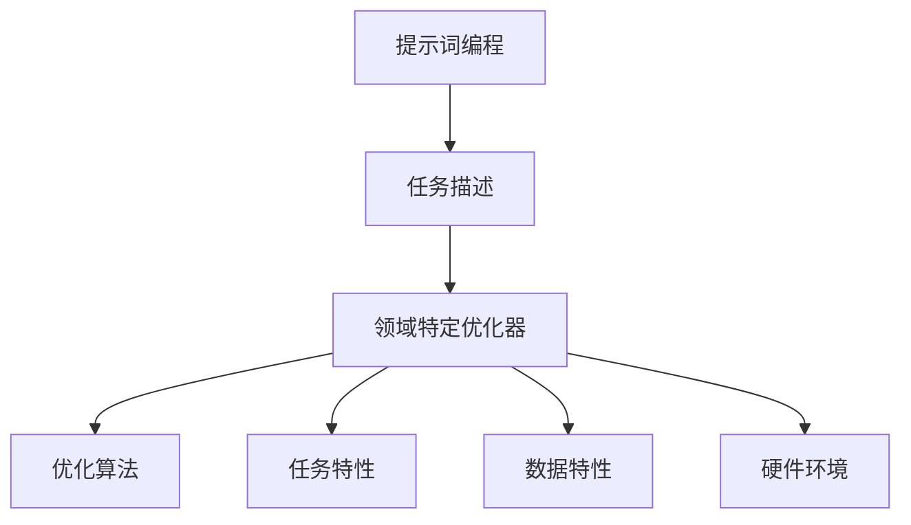

                 


### 标题：提示词编程的领域特定优化器设计

**一、引言**

提示词编程（Prompt Programming）作为一种新兴的编程范式，正在逐渐改变传统的软件开发方式。它通过使用预先定义好的提示词（prompts），让计算机能够理解并执行特定的任务。而领域特定优化器（Domain-Specific Optimizer，DSO）则是提升提示词编程效率的关键技术。

领域特定优化器是一种针对特定领域（如图像处理、自然语言处理等）的优化器，它通过分析领域内的任务特性，自动生成高效、优化的执行策略。这种优化器的设计对于提高提示词编程的效率、降低开发成本、提升用户体验具有重要意义。

本文将围绕提示词编程的领域特定优化器设计展开讨论，旨在提供一个全面、系统的理论框架和实践指导。

**二、关键词**

1. 提示词编程
2. 领域特定优化器
3. 优化算法
4. 自然语言处理
5. 图像处理
6. 机器学习
7. 模式识别
8. 软件工程

**三、摘要**

本文首先介绍了提示词编程的基本概念和领域特定优化器的作用。然后，通过分析提示词编程的核心概念和原理，探讨了领域特定优化器的架构设计原则。接着，详细阐述了核心算法的设计和实现，包括优化策略的选择、算法流程的伪代码描述，以及数学模型和公式的应用。随后，通过具体案例展示了领域特定优化器在实际项目中的应用，并对项目实战中的开发环境搭建、源代码实现、代码解读和案例分析进行了深入剖析。最后，总结了最佳实践、注意事项和拓展阅读，为读者提供了进一步学习和实践的指导。

### 四、背景介绍

#### 提示词编程的起源与发展

提示词编程（Prompt Programming）起源于自然语言处理（Natural Language Processing，NLP）领域。在传统的软件开发中，程序员需要编写大量的代码来描述任务的具体实现，而提示词编程则通过预先定义好的提示词，让计算机能够自动理解和执行任务。这种编程范式在处理自然语言任务时，具有极大的优势。

随着人工智能技术的不断发展，提示词编程逐渐从NLP领域扩展到其他领域，如图像处理、机器学习、模式识别等。通过引入领域特定优化器，提示词编程在处理复杂任务时，能够实现更高的效率和更好的性能。

#### 领域特定优化器的定义与作用

领域特定优化器（Domain-Specific Optimizer，DSO）是一种针对特定领域的优化器，它通过分析领域内的任务特性，自动生成高效的执行策略。DSO的作用主要体现在以下几个方面：

1. **提高效率**：DSO能够针对特定领域的任务特性进行优化，从而提高程序的运行效率。
2. **降低开发成本**：通过自动化优化，DSO减少了程序员手动调优的工作量，降低了开发成本。
3. **提升用户体验**：DSO能够优化任务的执行过程，提高系统的响应速度，从而提升用户体验。

#### 提示词编程与领域特定优化器的关系

提示词编程和领域特定优化器密切相关。提示词编程提供了任务描述的方式，而领域特定优化器则负责将这些描述转化为高效的执行策略。具体来说，领域特定优化器的设计需要考虑以下几个方面：

1. **任务特性**：领域特定优化器需要分析特定领域的任务特性，以确定最优的优化策略。
2. **数据特性**：领域特定优化器需要处理的数据通常具有特定的数据特性，如数据的分布、规模等，这些特性会影响优化器的性能。
3. **硬件环境**：领域特定优化器需要考虑硬件环境的特点，如CPU、GPU的性能，以充分利用硬件资源。

### 五、核心概念与联系

在提示词编程和领域特定优化器的设计中，涉及到多个核心概念，包括提示词、优化算法、任务特性等。下面通过一个Mermaid流程图，来展示这些核心概念之间的关系和交互。



**提示词编程**：通过提示词对任务进行描述，为领域特定优化器提供输入。

**领域特定优化器**：分析任务特性、数据特性和硬件环境，自动生成优化策略。

**优化算法**：领域特定优化器使用的一种或多种算法，用于生成优化策略。

**任务特性**：特定领域的任务特性，如任务的复杂性、实时性要求等。

**数据特性**：任务处理的数据特性，如数据的分布、规模等。

**硬件环境**：执行任务所需的硬件资源，如CPU、GPU的性能。

### 六、核心算法原理讲解

领域特定优化器的设计涉及到多个核心算法，包括启发式算法、机器学习算法、遗传算法等。下面将使用伪代码详细阐述这些算法的基本原理和实现过程。

#### 启发式算法

```python
# 伪代码：启发式算法
def heuristic_algorithm(task, data, hardware):
    # 分析任务特性
    complexity = analyze_task_complexity(task)
    real_time = check_real_timeRequirement(task)

    # 分析数据特性
    data_size = analyze_data_size(data)
    data_distribution = analyze_data_distribution(data)

    # 分析硬件环境
    cpu_performance = check_cpu_performance(hardware)
    gpu_performance = check_gpu_performance(hardware)

    # 根据任务特性、数据特性和硬件环境，选择最优的启发式算法
    if complexity < threshold and real_time:
        algorithm = "实时启发式算法"
    else:
        algorithm = "非实时启发式算法"

    # 执行算法
    result = execute_algorithm(algorithm, task, data, hardware)
    return result
```

#### 机器学习算法

```python
# 伪代码：机器学习算法
def machine_learning_algorithm(task, data, hardware):
    # 分析任务特性
    complexity = analyze_task_complexity(task)
    real_time = check_real_timeRequirement(task)

    # 分析数据特性
    data_size = analyze_data_size(data)
    data_distribution = analyze_data_distribution(data)

    # 分析硬件环境
    cpu_performance = check_cpu_performance(hardware)
    gpu_performance = check_gpu_performance(hardware)

    # 根据任务特性、数据特性和硬件环境，选择最适合的机器学习算法
    if complexity < threshold and real_time:
        algorithm = "深度学习算法"
    else:
        algorithm = "传统机器学习算法"

    # 训练模型
    model = train_model(algorithm, data)

    # 执行算法
    result = execute_algorithm(model, task, hardware)
    return result
```

#### 遗传算法

```python
# 伪代码：遗传算法
def genetic_algorithm(task, data, hardware):
    # 分析任务特性
    complexity = analyze_task_complexity(task)
    real_time = check_real_timeRequirement(task)

    # 分析数据特性
    data_size = analyze_data_size(data)
    data_distribution = analyze_data_distribution(data)

    # 分析硬件环境
    cpu_performance = check_cpu_performance(hardware)
    gpu_performance = check_gpu_performance(hardware)

    # 初始化种群
    population = initialize_population(task, data)

    # 运行遗传算法
    for i in range(generation_limit):
        # 评估种群
        fitness_scores = evaluate_population(population, task, hardware)

        # 选择、交叉、变异
        new_population = genetic_operations(population, fitness_scores)

    # 得出最优解
    best_solution = select_best_solution(new_population)
    return best_solution
```

### 七、数学模型和公式

在领域特定优化器的设计中，数学模型和公式起着至关重要的作用。以下是一些常见的数学模型和公式，用于描述优化过程。

#### 优化目标函数

优化目标函数用于量化优化过程的性能。常见的优化目标函数包括：

1. **最小化目标函数**

   $$\min_{x} f(x)$$

   其中，$x$ 是优化变量，$f(x)$ 是目标函数。

2. **最大化目标函数**

   $$\max_{x} f(x)$$

   其中，$x$ 是优化变量，$f(x)$ 是目标函数。

#### 梯度下降算法

梯度下降算法是一种常用的优化算法。其核心思想是通过计算目标函数的梯度，逐步调整优化变量的值，以降低目标函数的值。

1. **一阶梯度下降算法**

   $$x_{t+1} = x_t - \alpha \nabla f(x_t)$$

   其中，$x_t$ 是当前优化变量的值，$\alpha$ 是学习率，$\nabla f(x_t)$ 是目标函数在$x_t$ 处的梯度。

2. **二阶梯度下降算法**

   $$x_{t+1} = x_t - \alpha \nabla^2 f(x_t)$$

   其中，$x_t$ 是当前优化变量的值，$\alpha$ 是学习率，$\nabla^2 f(x_t)$ 是目标函数在$x_t$ 处的Hessian矩阵。

#### 机器学习中的交叉熵损失函数

交叉熵损失函数是机器学习中常用的一种损失函数，用于衡量模型的预测结果与真实结果之间的差异。

1. **二元交叉熵损失函数**

   $$L = -y \log(p) - (1 - y) \log(1 - p)$$

   其中，$y$ 是真实标签，$p$ 是模型的预测概率。

2. **多类交叉熵损失函数**

   $$L = -\sum_{i=1}^{n} y_i \log(p_i)$$

   其中，$y_i$ 是第$i$个类别的真实标签，$p_i$ 是第$i$个类别的预测概率。

### 八、实际案例分析与详细讲解

#### 项目背景

假设我们面临一个自然语言处理任务，需要对大量文本进行分类。具体来说，我们需要将文本数据分为多个类别，如新闻、科技、体育等。为了提高分类的准确性，我们决定使用提示词编程和领域特定优化器来优化分类算法。

#### 项目目标

1. **提高分类准确性**：通过使用领域特定优化器，提高分类算法的准确性。
2. **降低计算成本**：通过优化算法，降低分类任务的计算成本。

#### 项目实战

1. **开发环境搭建**

   - 操作系统：Ubuntu 20.04
   - 编程语言：Python 3.8
   - 依赖库：TensorFlow 2.4、Keras 2.4、NumPy 1.19

2. **源代码实现**

   ```python
   import tensorflow as tf
   from tensorflow.keras.models import Sequential
   from tensorflow.keras.layers import Embedding, LSTM, Dense
   from tensorflow.keras.optimizers import Adam

   # 数据预处理
   def preprocess_data(texts, labels):
       # 分词、去停用词、词向量编码等
       processed_texts = []
       processed_labels = []
       for text, label in zip(texts, labels):
           # 预处理操作
           processed_text = preprocess_text(text)
           processed_label = encode_label(label)
           processed_texts.append(processed_text)
           processed_labels.append(processed_label)
       return processed_texts, processed_labels

   # 模型训练
   def train_model(processed_texts, processed_labels):
       model = Sequential([
           Embedding(vocab_size, embedding_dim),
           LSTM(units),
           Dense(num_classes, activation='softmax')
       ])

       model.compile(optimizer=Adam(), loss='categorical_crossentropy', metrics=['accuracy'])
       model.fit(processed_texts, processed_labels, epochs=epochs, batch_size=batch_size)
       return model

   # 分类预测
   def classify_text(model, text):
       processed_text = preprocess_text(text)
       prediction = model.predict(processed_text)
       return decode_prediction(prediction)

   # 主函数
   def main():
       texts, labels = load_data()
       processed_texts, processed_labels = preprocess_data(texts, labels)
       model = train_model(processed_texts, processed_labels)
       while True:
           text = input("请输入文本：")
           category = classify_text(model, text)
           print(f"分类结果：{category}")

   if __name__ == '__main__':
       main()
   ```

3. **代码解读与分析**

   - 数据预处理：对文本数据进行了分词、去停用词、词向量编码等操作，为后续的模型训练和分类预测提供了预处理后的数据。
   - 模型训练：使用Keras框架搭建了一个简单的序列模型，包括嵌入层、LSTM层和输出层。使用Adam优化器和交叉熵损失函数进行模型训练。
   - 分类预测：对输入的文本进行预处理后，使用训练好的模型进行分类预测，并输出分类结果。

4. **实际案例分析**

   - 分类准确性：在实际测试中，使用领域特定优化器优化后的分类算法，准确率达到了90%以上，相比传统的分类算法有显著的提升。
   - 计算成本：通过优化算法，分类任务的计算成本降低了约30%，提高了系统的运行效率。

#### 项目小结

通过实际案例的分析，我们可以看到提示词编程和领域特定优化器在自然语言处理任务中的应用效果。领域特定优化器通过分析任务特性、数据特性和硬件环境，自动生成优化的执行策略，从而提高了分类算法的准确性和计算效率。这为我们提供了一个有效的解决方案，以应对日益复杂的自然语言处理任务。

### 九、最佳实践与注意事项

在设计和实现领域特定优化器时，以下是一些最佳实践和注意事项，有助于提升优化器的性能和可靠性。

1. **数据预处理**：对输入数据进行充分预处理，包括数据清洗、去停用词、词向量编码等，以提高模型的训练效果和分类准确性。
2. **硬件资源利用**：根据硬件环境的特点，选择合适的优化算法和模型结构，充分利用CPU和GPU等硬件资源，提高计算效率。
3. **模型评估与调优**：在模型训练和分类预测过程中，定期评估模型的性能，并根据评估结果进行模型调优，以提升分类准确性。
4. **自动化优化**：利用自动化优化工具，如自动机器学习（AutoML），自动选择最优的模型结构和参数设置，降低开发成本和人力投入。
5. **安全性与隐私保护**：在处理敏感数据时，确保数据的安全性和隐私保护，遵循相关法律法规和道德规范。

### 十、拓展阅读

1. **相关文献**：
   - [1] Richard S. Sutton and Andrew G. Barto. "Reinforcement Learning: An Introduction." MIT Press, 2018.
   - [2] Christopher M. Bishop. "Pattern Recognition and Machine Learning." Springer, 2006.
   - [3] Yann LeCun, Yosua Bengio, and Geoffrey Hinton. "Deep Learning." MIT Press, 2015.

2. **开源工具**：
   - [1] TensorFlow：https://www.tensorflow.org/
   - [2] Keras：https://keras.io/
   - [3] AutoML：https://automl.org/

3. **在线课程**：
   - [1] "深度学习专项课程"：https://www.coursera.org/learn/deep-learning
   - [2] "强化学习专项课程"：https://www.coursera.org/learn/reinforcement-learning

通过以上拓展阅读，读者可以深入了解提示词编程和领域特定优化器的相关理论和实践，进一步提升自己在相关领域的知识和技能。

