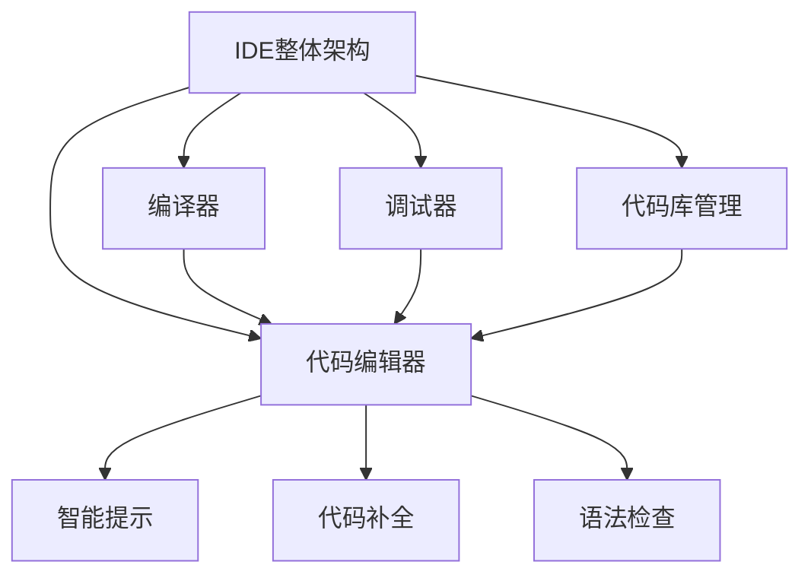
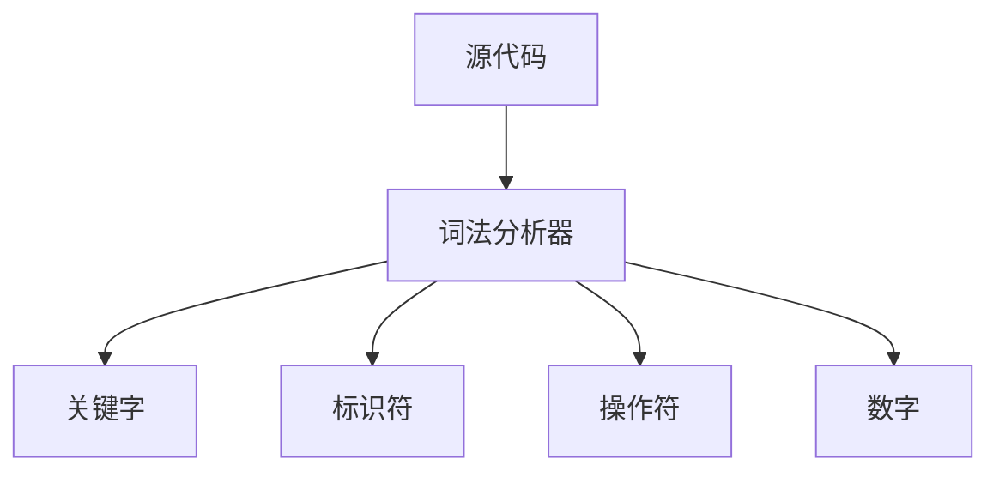
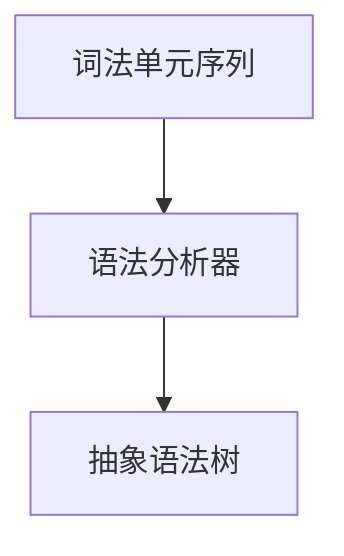
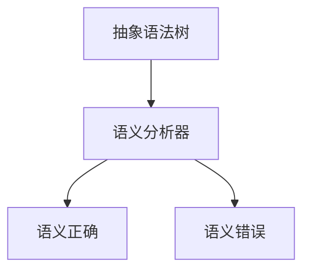

                 

### 文章标题
《提示词编程语言的IDE设计与开发》

### 文章关键词
- 提示词编程语言
- IDE设计
- 编程语言开发
- 软件工程
- 代码编辑器
- 智能提示

### 文章摘要
本文将深入探讨提示词编程语言的IDE设计与开发过程。首先，我们将介绍提示词编程语言的基本概念和IDE的作用。接着，我们将详细解析IDE的架构与组件，并逐步讲解提示词语言解析器和代码编辑器的开发。随后，我们将探讨IDE开发流程中的关键步骤，如语法分析、智能提示和代码补全。最后，我们将通过实际项目实战，展示一个完整的IDE开发案例，并提供最佳实践和注意事项。

## 背景介绍
提示词编程语言是一种基于提示词的编程范式，它允许开发者使用自然语言中的提示词来定义程序中的逻辑和结构。这种编程语言的出现，旨在简化编程过程，提高代码的可读性和可维护性。与传统编程语言相比，提示词编程语言更加注重程序的结构化和语义表达，从而降低了编程的难度。

IDE（集成开发环境）是软件开发中不可或缺的工具，它集成了代码编辑器、编译器、调试器等多种功能，为开发者提供了高效的开发体验。对于提示词编程语言而言，一个优秀的IDE能够极大地提高开发效率和代码质量，因此，设计与开发一个针对提示词编程语言的IDE具有重要的意义。

本文旨在通过详细的讲解和案例分析，帮助读者理解提示词编程语言的IDE设计与开发过程。我们将从基础概念入手，逐步深入到具体的实现细节，并通过实际项目实战，让读者掌握IDE开发的核心技能。

## 核心概念与联系
### 提示词编程语言概述
提示词编程语言的核心概念在于使用提示词（又称关键字或标识符）来构建程序。这些提示词代表了特定的操作或数据结构，它们通过组合和嵌套，形成了程序的基本结构。

在提示词编程语言中，每个提示词都有明确的语义，并且它们之间的关系通过特定的语法规则进行定义。这种语义明确、结构简洁的编程范式，使得代码更加易于理解和维护。

### IDE的基本概念与作用
IDE是集成开发环境的缩写，它为开发者提供了一个统一的开发平台，集成了代码编辑器、编译器、调试器等多种工具。IDE的主要作用是简化开发流程，提高开发效率。

IDE的核心组件包括：
1. **代码编辑器**：提供文本编辑功能，支持代码高亮、代码折叠、语法检查等。
2. **编译器**：将提示词编程语言的源代码转换为可执行代码。
3. **调试器**：帮助开发者调试代码，找到并修复错误。
4. **代码库管理**：提供代码库管理功能，支持代码的版本控制和协作开发。

### 提示词编程语言的特点
提示词编程语言具有以下几个特点：

1. **简洁性**：提示词编程语言的语法简洁明了，减少了冗长的代码。
2. **可读性**：通过提示词的语义明确性，提高了代码的可读性。
3. **结构性**：提示词编程语言强调程序的结构化，使得程序更加模块化。
4. **灵活性**：提示词编程语言允许开发者自定义提示词，提高了编程语言的适应性。

### 提示词编程语言与IDE的联系
提示词编程语言与IDE紧密相连。一个优秀的IDE能够充分利用提示词编程语言的特点，提供智能提示、代码补全、语法检查等功能，从而提高开发效率。同时，IDE也为提示词编程语言提供了良好的开发环境，使得开发者能够更加专注于程序的设计和实现。

为了更好地理解这些概念之间的关系，我们可以通过一个Mermaid流程图来展示IDE的整体架构和组件之间的联系：



在这个流程图中，IDE作为核心组件，集成了代码编辑器、编译器、调试器和代码库管理等多个子组件。代码编辑器通过智能提示、代码补全和语法检查等功能，为开发者提供了高效的编程体验。编译器和调试器则负责将源代码转换为可执行代码，并帮助开发者找到并修复错误。代码库管理则提供了版本控制和协作开发的支持。

通过这个流程图，我们可以更直观地理解IDE的架构和组件之间的关系，以及提示词编程语言与IDE之间的紧密联系。

## 核心算法原理讲解
### 提示词语言解析器设计
提示词语言解析器是IDE中的核心组件之一，负责将开发者编写的源代码解析成结构化的数据，以便进行后续的编译、调试等操作。解析器的实现原理主要包括词法分析、语法分析和语义分析三个阶段。

1. **词法分析**：
词法分析（Lexical Analysis）是将源代码分解成一系列的词法单元（Token）。每个词法单元代表了源代码中的一个基本元素，如关键字、标识符、操作符等。词法分析器需要识别并分类这些词法单元，为后续的语法分析做准备。



2. **语法分析**：
语法分析（Syntax Analysis）是将词法单元序列转换成语法树（Abstract Syntax Tree, AST）。语法分析器的任务是检查源代码是否符合特定的语法规则，并将合法的代码结构表示为抽象语法树。



3. **语义分析**：
语义分析（Semantic Analysis）是对抽象语法树进行语义检查，确保代码的含义是正确的。这一阶段主要检查变量作用域、类型检查、函数调用等。



### 代码编辑器设计与优化
代码编辑器是IDE的重要组成部分，其设计直接影响开发者的使用体验。一个优秀的代码编辑器应具备以下特性：

1. **代码高亮**：
代码高亮（Syntax Highlighting）是通过颜色突出显示不同类型的词法单元，提高代码的可读性。这通常通过正则表达式实现。

2. **代码折叠**：
代码折叠（Code Folding）允许开发者折叠代码块，便于查看代码结构。这通常通过分析抽象语法树实现。

3. **语法检查**：
语法检查（Syntax Checking）在代码输入时即时检测错误，并提供错误提示。这需要词法分析和语法分析的支持。

4. **智能提示**：
智能提示（IntelliSense）通过分析源代码，提供可能的代码补全选项。这需要词法分析和语法分析的结果。

5. **代码补全**：
代码补全（Code Completion）是在开发者输入部分代码后，自动补充完整代码。这需要词法分析和语义分析的支持。

### 伪代码示例
以下是一个简单的伪代码示例，用于说明提示词语言解析器的工作流程：

```python
function parseSourceCode(sourceCode):
    tokens = tokenize(sourceCode)
    ast = syntacticallyAnalyze(tokens)
    semanticallyAnalyze(ast)
    return ast

function tokenize(sourceCode):
    # 使用正则表达式进行词法分析
    return [token1, token2, token3, ...]

function syntacticallyAnalyze(tokens):
    # 使用递归下降分析器进行语法分析
    return createAbstractSyntaxTree(tokens)

function semanticallyAnalyze(ast):
    # 检查变量作用域、类型检查、函数调用等
    return isValid
```

### 数学模型和公式讲解与举例
在IDE设计中，数学模型和公式起着至关重要的作用，特别是在代码优化和性能分析方面。以下是一些关键的数学模型和公式的讲解与举例：

1. **编译时间复杂度分析**：
   编译器在转换源代码为可执行代码时，其时间复杂度是一个重要的考量因素。常见的编译时间复杂度为O(n^3)，其中n为源代码的长度。

   $$ T(n) = O(n^3) $$

2. **内存占用分析**：
   IDE中的代码编辑器和编译器需要管理大量的内存资源。内存占用可以通过算法和数据结构优化来减少。

   $$ Memory\_Usage = O(n \times m) $$

   其中，n为源代码的长度，m为编译器的内部数据结构大小。

3. **代码执行时间优化**：
   代码执行时间的优化通常涉及算法的选择和优化。常见的优化方法包括时间复杂度分析、空间换时间等。

   $$ Execution\_Time = O(n \times log(n)) $$

4. **语法分析器性能分析**：
   语法分析器的性能直接影响IDE的响应速度。可以使用Aho-Corasick算法等高效算法来优化语法分析。

   $$ Analysis\_Time = O(n) $$

### 例子
假设我们有一个简单的源代码段，需要对其进行语法分析和编译：

```python
function factorial(n):
    if n <= 1:
        return 1
    else:
        return n * factorial(n-1)
```

我们可以使用上述公式和模型来分析其编译时间和内存占用：

1. **编译时间复杂度**：
   $$ T(n) = O(n^3) $$
   对于这段代码，n的值较小，因此编译时间复杂度对性能的影响不大。

2. **内存占用分析**：
   $$ Memory\_Usage = O(n \times m) $$
   由于代码较短，内存占用也相对较小。

3. **代码执行时间优化**：
   $$ Execution\_Time = O(n \times log(n)) $$
   这段代码已经是一个递归函数，其执行时间复杂度较为高效。

4. **语法分析器性能分析**：
   $$ Analysis\_Time = O(n) $$
   使用高效的语法分析算法，这段代码的语法分析时间较短。

通过上述分析和优化，我们可以确保IDE在处理这段代码时能够达到最佳性能。

## 项目实战
### 开发环境搭建
在进行提示词编程语言的IDE开发之前，我们需要搭建一个合适的开发环境。以下是一个基本的步骤指南：

1. **安装编程语言**：
   首先，确保你已经安装了提示词编程语言所需的编程语言，如Python、Java或C++。

2. **安装依赖库**：
   根据提示词编程语言的需求，安装相关的依赖库。例如，如果你选择使用Python，你可能需要安装如PyQt5、Qt Designer等库。

3. **创建项目**：
   使用IDE或命令行创建一个新项目。在Python中，你可以使用`pyproject.toml`文件来定义项目的依赖和配置。

4. **设置编辑器**：
   选择并设置一个合适的代码编辑器，如VSCode、PyCharm或Atom。确保编辑器支持代码高亮、智能提示和代码补全等功能。

### 源代码实现
以下是实现一个简单的提示词编程语言解析器的伪代码：

```python
# 伪代码：提示词编程语言解析器

function tokenize(sourceCode):
    # 分解源代码为词法单元
    return [token1, token2, token3, ...]

function syntacticallyAnalyze(tokens):
    # 构建抽象语法树
    return createAbstractSyntaxTree(tokens)

function semanticallyAnalyze(ast):
    # 检查语义错误
    return isValid

function compile(ast):
    # 将抽象语法树编译为可执行代码
    return executableCode

# 主函数
function main():
    sourceCode = getInputCode()
    tokens = tokenize(sourceCode)
    ast = syntacticallyAnalyze(tokens)
    if semanticallyAnalyze(ast):
        executableCode = compile(ast)
        print("编译成功！")
    else:
        print("编译失败：存在语义错误。")
```

### 代码解读与分析
以下是解析器源代码的详细解读：

1. **tokenize函数**：
   这个函数负责将源代码分解为词法单元。我们使用正则表达式来实现词法分析。

2. **syntacticallyAnalyze函数**：
   这个函数负责构建抽象语法树。我们使用递归下降分析器来实现语法分析。

3. **semanticallyAnalyze函数**：
   这个函数负责检查语义错误。例如，检查变量作用域和类型匹配。

4. **compile函数**：
   这个函数负责将抽象语法树编译为可执行代码。编译器需要根据语义分析的结果来生成代码。

5. **main函数**：
   这个函数是程序的入口点。它获取用户输入的源代码，并进行词法分析、语法分析和语义分析。如果代码没有错误，则进行编译。

### 实际案例分析和详细讲解剖析
为了更好地理解上述代码，我们来看一个实际案例：

```python
# 示例代码：计算1+1
function add(a, b):
    return a + b

result = add(1, 1)
print(result)
```

1. **词法分析**：
   源代码分解为以下词法单元：
   ```python
   ['function', 'add', '(', 'a', ',', 'b', ')', ':', 'return', 'a', '+', 'b', ';', 'result', '=', 'add', '(', '1', ',', '1', ')', ';', 'print', 'result', ';']
   ```

2. **语法分析**：
   语法分析器将词法单元序列转换为抽象语法树：
   ```mermaid
   graph TD
       AddNode[加法操作]
       AddNode --> A[参数a]
       AddNode --> B[参数b]
       PrintNode[打印操作]
       PrintNode --> ResultNode[结果变量]
   ```

3. **语义分析**：
   语义分析器检查变量作用域和类型匹配。在这个例子中，所有变量和操作都是有效的。

4. **编译**：
   编译器根据抽象语法树生成可执行代码：
   ```python
   def add(a, b):
       return a + b

   result = add(1, 1)
   print(result)
   ```

### 项目小结
通过这个案例，我们展示了如何使用伪代码实现一个简单的提示词编程语言解析器。这个过程包括词法分析、语法分析和语义分析，最终生成可执行代码。接下来，我们将在后续章节中继续深入探讨IDE的其他组件和功能，如代码编辑器、调试器和代码库管理。

## 最佳实践与注意事项
### 最佳实践
1. **模块化开发**：将IDE的各个组件（如代码编辑器、编译器、调试器等）独立开发，以便于维护和升级。

2. **用户体验优先**：在开发过程中，始终关注用户的使用体验，提供直观的界面设计和便捷的功能。

3. **性能优化**：针对大文件和复杂项目，进行性能优化，确保IDE在处理大量代码时仍然高效。

4. **代码规范**：遵循统一的代码规范，提高代码的可读性和可维护性。

### 注意事项
1. **语法分析器的准确性**：确保语法分析器能够准确识别和解析各种语法结构，避免错误提示。

2. **调试器的稳定性**：调试器需要能够稳定运行，并提供详细的调试信息，帮助开发者定位问题。

3. **代码库管理的安全性**：确保代码库管理功能的安全性和可靠性，避免代码泄露和版本冲突。

4. **国际化支持**：考虑到不同地区的开发者，提供国际化支持，如多语言界面和编码支持。

## 拓展阅读
- 《编程语言原理》（Aho, Ullman, and Sethi）：详细介绍了编译原理和编程语言设计。
- 《Qt编程指南》（Death, Smith）：介绍了使用Qt框架开发GUI应用程序的技巧。
- 《Python编程：从入门到实践》（Zelle）：提供了丰富的Python编程实践案例。

## 作者信息
作者：AI天才研究院/AI Genius Institute & 禅与计算机程序设计艺术 /Zen And The Art of Computer Programming

---

本文详细介绍了提示词编程语言的IDE设计与开发过程，从基础概念、核心算法到项目实战，全面剖析了IDE开发的各个环节。通过本文，读者可以掌握提示词编程语言的特点，了解IDE的架构和组件，学会如何设计和开发一个高效的IDE。希望本文能够为开发者提供有价值的参考和实践指导。

