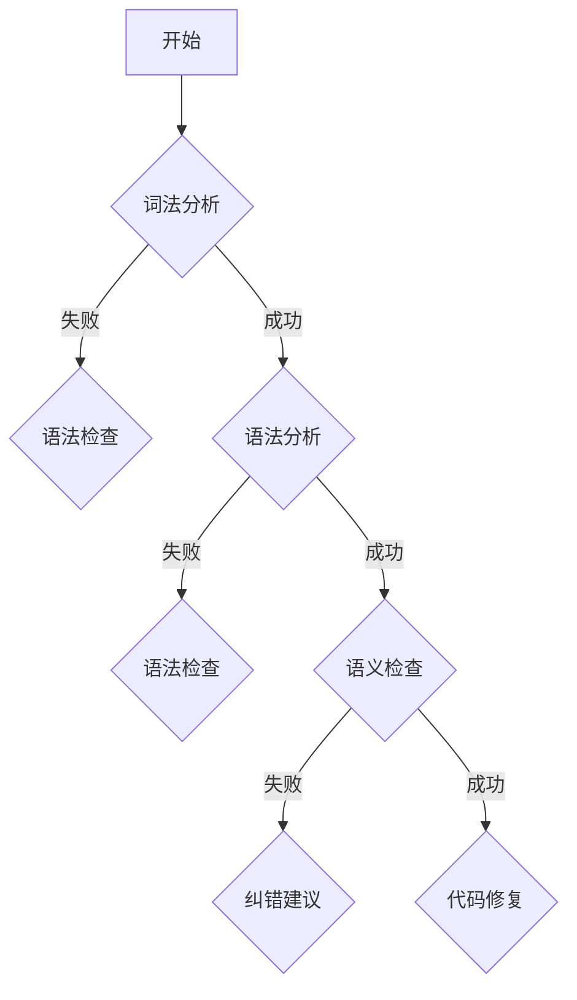
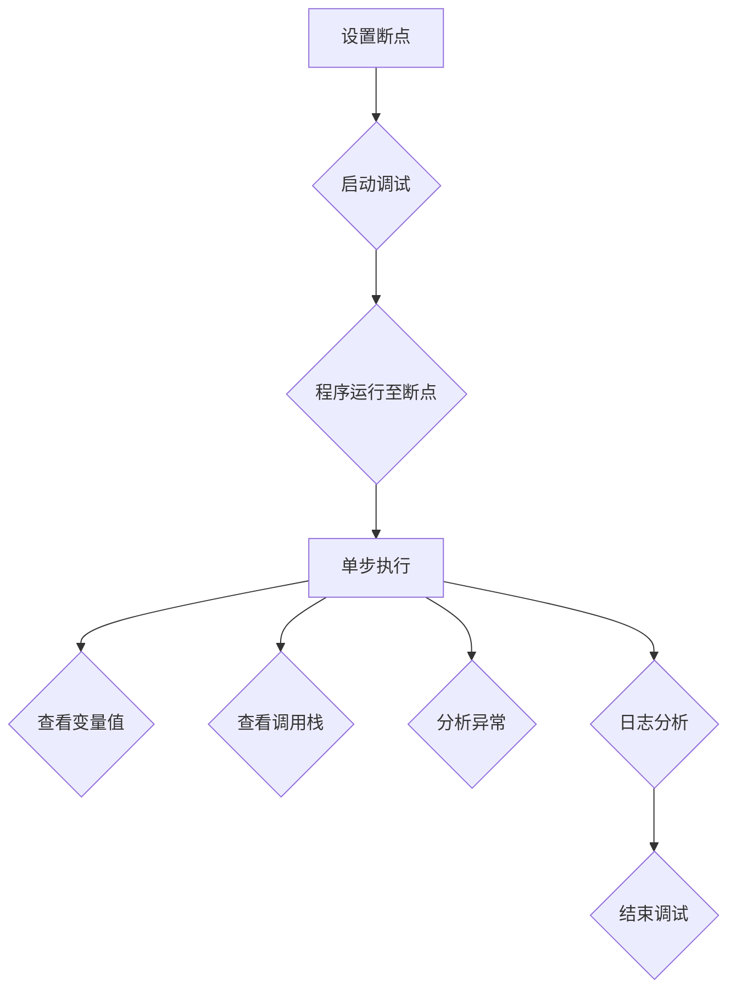
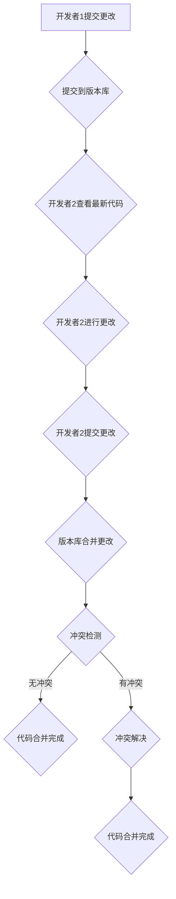
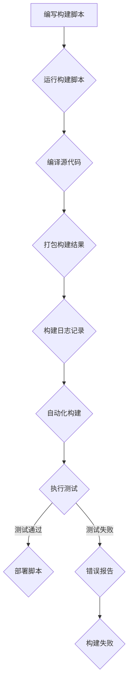

                 


# 《提示词编程语言的IDE设计构想》

## 关键词
- 提示词编程语言
- 集成开发环境（IDE）
- 解析器设计
- 代码编辑器
- 调试工具
- 项目管理
- 性能优化

## 摘要
本文旨在探讨如何设计适用于提示词编程语言的集成开发环境（IDE）。通过详细分析提示词编程语言的核心概念、语法规则、设计原理以及实现细节，本文为开发者提供了一套全面而深入的IDE设计构想。文章涵盖了从基础概念到具体实现，再到性能优化和项目实战的全方位内容，旨在帮助读者理解和掌握提示词编程语言的IDE设计要点。

## 第1章：引言

### 1.1 书籍目的与读者对象

在当今快速发展的技术时代，编程语言和开发工具层出不穷，其中提示词编程语言以其独特的简洁性和高效性，正逐渐受到开发者的关注。本书旨在探讨如何设计一套适合提示词编程语言的集成开发环境（IDE），以满足开发者对于高效编程、快速调试、项目管理和代码优化等方面的需求。

本书的目标读者主要包括以下几类人群：
1. 计算机编程爱好者，对提示词编程语言感兴趣，希望深入了解其背后的原理和设计。
2. 软件开发工程师，希望在现有技能基础上，学习如何设计和开发高效的IDE。
3. 提示词编程语言的维护者与推广者，希望通过本书的学习，能够更好地理解IDE设计的核心要素。

### 1.2 提示词编程语言概述

提示词编程语言（Keyword-based Programming Language）是一种以提示词为核心，通过简洁的语法和强大的功能，提高编程效率和代码可读性的新型编程语言。与传统的命令式编程语言相比，提示词编程语言具有以下几个特点：

1. **简洁性**：通过使用提示词来表示操作，简化了代码结构，减少了冗长的代码。
2. **可读性**：提示词通常具有明确的语义，使得代码更加易于理解和维护。
3. **高效性**：提示词编程语言通常具有较高的执行效率，减少了不必要的计算和存储开销。

提示词编程语言的应用场景广泛，包括但不限于数据分析、自然语言处理、游戏开发等领域。随着技术的发展和应用的深入，提示词编程语言在未来有望成为主流编程语言之一。

### 1.3 IDE设计的重要性

集成开发环境（IDE）是软件开发过程中不可或缺的工具，它为开发者提供了代码编写、调试、项目管理等一系列功能。对于提示词编程语言而言，设计一套适合的IDE具有重要意义：

1. **提高开发效率**：IDE提供了丰富的工具和插件，使得开发者能够快速地进行代码编写和调试，从而提高开发效率。
2. **增强代码质量**：IDE内置的代码检查、纠错和优化功能，有助于开发者编写高质量的代码，减少错误和冗余。
3. **优化项目管理**：IDE集成了版本控制、构建工具和部署功能，使得项目管理更加便捷和高效。
4. **降低学习成本**：针对特定编程语言的IDE设计，能够为新手开发者提供良好的学习环境，降低学习成本。

综上所述，设计一套适用于提示词编程语言的IDE，不仅能够提高开发效率和代码质量，还能够为开发者和维护者提供强大的支持，推动提示词编程语言的普及和发展。

### 1.4 书籍结构

本书共分为十个章节，每个章节都有明确的学习目标和内容安排。以下是详细的章节结构：

- **第1章**：引言。介绍书籍的目的、读者对象以及提示词编程语言概述，为后续内容打下基础。
- **第2章**：提示词编程语言基础。详细讲解提示词编程语言的核心概念、语法规则和优势。
- **第3章**：IDE设计原理。介绍IDE的设计原则、功能需求、架构设计和用户界面设计。
- **第4章**：提示词编程语言解析器设计。讲解解析器的设计原理、实现方法和优化策略。
- **第5章**：代码编辑器设计。探讨代码编辑器的设计要点、功能实现和优化策略。
- **第6章**：调试工具设计。介绍调试器的功能、调试过程和实现细节。
- **第7章**：项目管理工具设计。讲解项目管理的需求、版本控制和构建部署。
- **第8章**：IDE性能优化。讨论IDE性能优化的策略、内存管理和缓存机制。
- **第9章**：项目实战。通过实际项目，展示IDE的设计与实现过程。
- **第10章**：总结与展望。对全书内容进行总结，展望IDE设计的未来趋势。

通过以上章节结构，本书将带领读者逐步了解提示词编程语言的IDE设计，从基础概念到具体实现，再到性能优化和项目实战，帮助读者全面掌握IDE设计的核心知识和实践技巧。

## 第2章：提示词编程语言基础

### 2.1 核心概念

提示词编程语言（以下简称TKPL）的核心概念是其提示词系统。提示词是TKPL的基本语法元素，用于表示程序中的操作和功能。与传统的编程语言不同，TKPL通过提示词来实现对程序的控制和数据操作，使得代码更加简洁明了。

提示词通常具有以下特点：

1. **简洁性**：提示词通常是一个单词或短语，具有明确的语义，不需要额外的解释或注释。
2. **灵活性**：提示词可以根据上下文和具体场景进行调整，以适应不同的编程需求。
3. **组合性**：提示词可以组合使用，形成更复杂的操作和功能，提高代码的可读性和可维护性。

在TKPL中，提示词的使用方式如下：

1. **单独使用**：单独的提示词表示一个基本的操作，例如`print`用于输出信息。
2. **组合使用**：多个提示词组合在一起，形成复合操作，例如`sort`和`filter`可以组合成对列表进行排序和过滤的操作。

### 2.2 语法规则

TKPL的语法规则相对简单，但强调表达力和简洁性。以下是TKPL的基本语法规则：

1. **提示词标识**：提示词必须以字母或下划线开头，后续可跟字母、数字或下划线。
2. **表达式**：表达式由提示词、变量、常量、函数和操作符组成。
3. **语句**：语句由表达式和提示词组成，以分号`;`结束。
4. **函数定义**：函数定义使用`define`提示词，后跟函数名和参数列表。
5. **控制结构**：TKPL支持常见的控制结构，如循环（`while`、`for`）、条件语句（`if`、`else`）和异常处理（`try`、`catch`）。

以下是TKPL的一些示例代码：

```tkpl
# 打印"Hello, World!"
print "Hello, World!"

# 计算两个数的和
define add(a, b):
    return a + b

# 使用函数计算和
result = add(3, 4)
print result
```

### 2.3 优势与应用场景

TKPL在多个应用场景中展现出了其独特的优势：

1. **数据分析**：TKPL的简洁性和高可读性使其在数据分析领域非常适用，特别是处理复杂数据处理任务时，能够显著提高开发效率和代码质量。
2. **自然语言处理**：TKPL通过提示词的方式模拟自然语言，使得其在自然语言处理任务中具有独特的优势，如文本分析、情感分析和语言生成等。
3. **游戏开发**：TKPL的简单语法和高效执行能力使其在游戏开发中非常有用，能够快速实现游戏逻辑和场景渲染。
4. **教学与培训**：TKPL的简洁语法和易于理解的提示词，使得它非常适合作为编程入门语言，能够降低学习门槛，帮助新手快速上手。

### 2.4 与现有编程语言的关系

TKPL与现有的编程语言（如Python、Java、C++等）有显著的不同。虽然TKPL在设计上借鉴了多种编程语言的优点，但它的核心特点在于简洁性和表达力。以下是TKPL与现有编程语言的比较：

1. **Python**：Python是一种高级编程语言，以其简洁的语法和强大的标准库而著称。TKPL在语法上借鉴了Python的简洁性，但在表达力和灵活性上有所提升。
2. **Java**：Java是一种面向对象的编程语言，以其稳定性和跨平台性而闻名。TKPL在语法上与Java有所不同，强调提示词的使用，使得代码更加简洁。
3. **C++**：C++是一种高效的编程语言，常用于系统级编程。TKPL在执行效率上与C++相当，但在代码简洁性和可读性上具有明显优势。

### 2.5 提示词编程语言的发展趋势

随着计算机科学和人工智能技术的不断发展，提示词编程语言正逐渐成为研究的热点。以下是TKPL的发展趋势：

1. **智能化**：随着人工智能技术的发展，TKPL有望结合机器学习和自然语言处理技术，实现自动代码生成和优化。
2. **多样化**：TKPL将不仅仅局限于特定的应用场景，而是向更多领域扩展，如物联网、区块链等。
3. **社区与生态**：随着TKPL的普及，将形成庞大的开发者社区和生态系统，为TKPL的发展提供强大支持。

### 2.6 提示词编程语言的优点与挑战

TKPL具有许多优点，如简洁性、高可读性和高效性，但也面临一些挑战：

1. **优点**：
   - **简洁性**：通过提示词，TKPL显著简化了代码结构，降低了编写和维护成本。
   - **高可读性**：提示词具有明确的语义，使得代码更加易于理解和维护。
   - **高效性**：TKPL的语法简洁，执行效率较高，能够快速实现复杂的操作。

2. **挑战**：
   - **学习曲线**：虽然TKPL相对于其他编程语言更加简洁，但对于新手开发者来说，学习提示词的用法可能需要一定时间。
   - **生态系统**：与现有编程语言相比，TKPL的生态系统尚未完全成熟，缺乏丰富的库和框架。
   - **兼容性**：TKPL需要与现有的编程工具和平台进行兼容，以确保其广泛应用。

### 2.7 实际应用案例

以下是一些提示词编程语言的实际应用案例：

1. **数据分析**：一家大型电商公司使用TKPL进行数据处理和统计分析，显著提高了数据分析的效率。
2. **自然语言处理**：一个开源的自然语言处理项目采用TKPL进行文本分析，实现了对大量文本的高效处理。
3. **游戏开发**：一个小型游戏工作室使用TKPL开发了一个基于物理引擎的游戏，取得了良好的用户体验。

通过这些实际应用案例，我们可以看到TKPL在不同领域展现出了其独特的优势和潜力。

## 第3章：IDE设计原理

### 3.1 IDE的功能需求

集成开发环境（IDE）的设计目标是提供一套完整的工具，帮助开发者高效地编写、调试、测试和部署代码。对于提示词编程语言而言，一个理想的IDE应满足以下功能需求：

1. **代码编辑器**：提供强大的文本编辑功能，支持语法高亮、代码补全、自动缩进、代码格式化等。
2. **代码解析器**：解析提示词编程语言的语法，提供代码分析、语义检查和错误提示。
3. **调试器**：提供调试功能，包括断点设置、单步执行、变量查看、堆栈跟踪等。
4. **项目管理**：集成版本控制系统，支持代码的提交、更新、分支管理和合并。
5. **构建工具**：集成构建工具，支持项目的编译、打包和部署。
6. **代码搜索与替换**：提供快速搜索和替换功能，方便开发者查找和修改代码。
7. **代码优化**：提供代码优化工具，自动识别和修复潜在的代码问题。
8. **插件支持**：支持插件扩展，允许开发者根据需求自定义功能。

### 3.2 IDE的架构设计

一个高效的IDE需要具备良好的架构设计，确保各个功能模块之间的协同工作。以下是IDE的典型架构设计：

1. **用户界面层**：负责与用户交互，包括菜单、工具栏、编辑区域、状态栏等。
2. **逻辑层**：处理用户操作，包括代码编辑、解析、调试、构建等核心功能。
3. **数据层**：存储项目数据，如源代码、构建配置、版本信息等。
4. **插件层**：提供插件接口，允许开发者扩展IDE功能。

以下是一个简化的架构图：

```
+----------------+      +----------------+      +----------------+
|  用户界面层    |      |   逻辑层       |      |   数据层       |
+----------------+      +----------------+      +----------------+
      |          |<---->|          |<---->|          |
      |          |      |          |      |          |
+----------------+      +----------------+      +----------------+
|   代码编辑器   |      |   解析器/调试器   |      |   项目管理工具 |
+----------------+      +----------------+      +----------------+
      |          |      |          |      |          |
      |          |<---->|          |<---->|          |
+----------------+      +----------------+      +----------------+
|   插件支持     |<----------------->|   插件接口    |<----------------->
+----------------+                    +----------------+
```

### 3.3 用户界面设计

用户界面设计是IDE设计的重要组成部分，直接影响开发者的使用体验。以下是用户界面设计的关键要素：

1. **简洁性**：界面设计应简洁明了，避免冗余和杂乱的布局。
2. **直观性**：通过合理的布局和图标设计，使开发者能够快速找到所需功能。
3. **可定制性**：允许开发者根据个人习惯和需求，自定义界面布局和工具栏。
4. **响应速度**：界面操作应流畅，响应速度要快，避免延迟和卡顿。
5. **跨平台**：支持多种操作系统，如Windows、macOS和Linux，提供一致的用户体验。

以下是一个简化的界面设计示意图：

```
+--------------------------------------------------+
| [菜单栏] [工具栏] [选项卡]                      |
+--------------------------------------------------+
| [编辑区域]                                      |
+--------------------------------------------------+
| [状态栏] [消息栏] [调试窗口] [输出窗口]        |
+--------------------------------------------------+
| [插件管理器] [版本控制] [构建工具] [其他插件]  |
+--------------------------------------------------+
```

通过上述设计原理和架构设计，我们可以构建一个高效、易用的提示词编程语言IDE，为开发者提供全方位的支持。

### 3.4 提示词编程语言的IDE设计原则

在设计适用于提示词编程语言的IDE时，我们需要遵循一系列关键原则，以确保IDE的高效性、可扩展性和用户友好性。以下是这些原则的具体内容：

1. **简洁性**：IDE的界面和操作应尽可能简洁，避免复杂和冗余的功能。通过简洁的界面设计，用户能够更快地熟悉和掌握IDE的操作，提高工作效率。例如，可以通过减少菜单项和工具栏按钮的数量，以及使用直观的图标和标签，来简化用户界面。

2. **高效性**：IDE的性能直接影响开发者的使用体验。我们需要确保IDE在代码编辑、解析、调试等核心功能上具有高效的处理能力。这包括优化代码编辑器的文本渲染速度、解析器的语法分析速度和调试器的响应速度等。通过使用高效的数据结构和算法，可以显著提高IDE的性能。

3. **易扩展性**：未来的IDE可能需要支持多种编程语言和工具，因此设计时应具备良好的扩展性。IDE应提供插件接口，允许开发者自定义和扩展功能。例如，可以通过插件来添加新的语法分析器、调试器或代码优化工具，以满足不同开发者的需求。

4. **用户友好性**：IDE的设计应考虑用户的实际使用场景和习惯，提供友好的用户交互体验。这包括提供清晰的操作提示、错误信息和帮助文档，以及支持多语言界面等。通过这些措施，可以降低学习成本，提高开发者的工作效率。

5. **模块化设计**：IDE的功能模块应独立且易于替换，以方便维护和升级。例如，可以将代码编辑器、解析器、调试器和项目管理工具等核心模块分离，以便于各自独立开发和优化。此外，模块化设计还便于实现并行开发和协作，提高开发效率。

6. **可定制性**：IDE应允许用户根据个人偏好和工作习惯进行自定义设置。例如，用户可以自定义快捷键、主题颜色和布局等。通过提供灵活的自定义选项，IDE可以更好地满足不同开发者的需求，提升用户体验。

7. **社区支持**：IDE的成功离不开活跃的社区支持。我们需要鼓励开发者参与IDE的开发和改进，提供丰富的文档、教程和示例代码，以及建立在线论坛和社交媒体群组等。通过这些措施，可以促进社区的活跃度，为IDE的长期发展提供动力。

通过遵循上述设计原则，我们可以创建一个高效、易用且富有扩展性的提示词编程语言IDE，为开发者提供最佳的开发体验。

### 3.5 IDE功能模块的设计与实现

在IDE的设计过程中，关键功能模块的设计与实现是确保其高效性和易用性的核心。以下是代码编辑器、代码解析器、调试器、项目管理工具等主要功能模块的具体设计与实现细节：

#### 3.5.1 代码编辑器

代码编辑器是IDE的核心组件之一，负责代码的输入、编辑和展示。以下是代码编辑器的设计与实现要点：

1. **文本渲染**：文本渲染是代码编辑器的基础功能。为了提高渲染速度，可以使用高性能的文本渲染引擎，如SLF4J或TinyXML，以实现高效的文本显示。
2. **语法高亮**：为了提高代码的可读性，编辑器需要支持语法高亮。实现语法高亮的方法包括：
   - **预编译的语法规则**：使用预编译的正则表达式或抽象语法树（AST）来匹配语法规则，快速识别关键字和特殊符号。
   - **动态语法检查**：在编辑过程中，实时检查输入的代码，根据语法规则进行高亮显示，并提供错误提示。
3. **代码补全**：提供智能代码补全功能，可以减少编码错误和提高效率。实现方法包括：
   - **词法分析**：对当前光标位置进行词法分析，提取可能的提示词和变量名。
   - **上下文分析**：根据当前代码块的上下文，提供最相关的代码补全建议。

#### 3.5.2 代码解析器

代码解析器是IDE的另一关键组件，负责将代码转换成结构化的数据，以便进行语法分析和语义检查。以下是代码解析器的设计与实现要点：

1. **词法分析**：词法分析是将源代码分解成词法单元的过程。实现方法包括：
   - **正则表达式**：使用正则表达式匹配代码中的关键字、操作符、标识符等。
   - **有限自动机**：设计一个有限自动机（FA）来处理词法分析，提高解析效率。
2. **语法分析**：语法分析是将词法单元转换为抽象语法树（AST）的过程。实现方法包括：
   - **递归下降法**：使用递归下降算法实现语法分析，对每种语法结构进行递归处理。
   - **LL(k)分析法**：对于复杂的语法结构，可以使用LL(k)分析法实现语法分析，提高解析效率。
3. **语义检查**：在语法分析的基础上，进行语义检查，包括类型检查、变量作用域检查等，以确保代码的语义正确性。

#### 3.5.3 调试器

调试器是IDE中的关键工具，用于帮助开发者查找和修复代码中的错误。以下是调试器的设计与实现要点：

1. **断点设置**：允许开发者设置断点，在代码执行到特定位置时暂停。实现方法包括：
   - **源码级断点**：在源代码中直接设置断点。
   - **条件断点**：设置条件断点，仅在满足特定条件时触发。
2. **单步执行**：允许开发者逐行执行代码，观察变量和函数的执行过程。实现方法包括：
   - **单步进入**：执行当前行的函数。
   - **单步跳出**：跳出当前执行的函数。
   - **单步跳过**：直接执行下一行代码。
3. **变量查看**：在调试过程中，实时查看当前作用域内的变量值，以便分析代码的行为。实现方法包括：
   - **自动变量查看**：在调试窗口中自动显示当前作用域的变量。
   - **手动变量查看**：允许开发者手动查看特定变量的值。

#### 3.5.4 项目管理工具

项目管理工具是IDE中的重要功能，负责管理项目的源代码、版本和构建配置。以下是项目管理工具的设计与实现要点：

1. **版本控制**：集成版本控制系统（如Git），支持代码的提交、更新、分支管理和合并。实现方法包括：
   - **本地版本控制**：在本地维护代码的版本历史。
   - **远程版本控制**：与远程仓库进行交互，实现代码的同步和共享。
2. **构建工具**：集成构建工具（如Maven或Gradle），支持项目的编译、打包和部署。实现方法包括：
   - **构建配置**：通过配置文件定义项目的构建过程。
   - **自动化构建**：根据配置文件自动执行构建过程。
3. **构建监控**：实时监控构建过程，包括编译错误、资源依赖和构建时间等。实现方法包括：
   - **日志输出**：在构建过程中输出详细的日志信息。
   - **构建报告**：生成构建报告，展示构建过程中的关键指标。

通过上述设计与实现，我们可以创建一个功能强大、易于扩展的IDE，为提示词编程语言开发者提供最佳的编程体验。

### 3.6 用户界面设计

用户界面（UI）是IDE与开发者互动的桥梁，一个良好的UI设计能够显著提升开发者的工作效率和体验。以下是用户界面设计的具体策略和方法：

#### 3.6.1 设计原则

1. **简洁性**：界面设计应保持简洁，避免冗余和复杂的布局。通过清晰、直观的界面元素，帮助开发者快速找到所需功能。
2. **一致性**：确保UI组件和设计风格在整个IDE中保持一致，包括颜色、字体、图标和布局等。一致性有助于用户快速适应和掌握IDE的操作。
3. **响应速度**：界面操作应快速响应，避免延迟和卡顿。通过优化UI组件的渲染和交互，提高操作流畅度。
4. **可定制性**：允许用户根据个人偏好和需求自定义界面布局和工具栏，以提高工作效率。

#### 3.6.2 用户界面元素设计

1. **菜单栏**：提供常见的操作命令，如文件、编辑、视图、工具和帮助等。菜单项应简洁明了，易于查找和使用。
2. **工具栏**：包含常用的快捷操作按钮，如新建文件、保存、撤销、重做、格式化代码等。工具栏设计应突出常用操作，方便快速访问。
3. **选项卡**：用于切换不同的编辑窗口，如代码编辑区、调试窗口、输出窗口等。选项卡设计应清晰展示当前活动窗口，并支持拖拽和分组。
4. **编辑区域**：文本编辑器是IDE的核心，设计时应注重代码的可读性和编辑体验。包括语法高亮、代码折叠、缩进和自动完成等功能。
5. **状态栏**：显示当前编辑状态、编译信息和错误提示。状态栏应简洁，只展示必要的信息，避免冗余。
6. **调试窗口**：用于显示调试过程中的断点、变量、调用栈等信息。调试窗口应布局合理，便于开发者快速定位和解决问题。
7. **输出窗口**：显示构建、编译和调试过程中的输出信息。输出窗口应支持滚动查看、搜索和复制等操作。

#### 3.6.3 交互设计

1. **鼠标操作**：提供直观的鼠标操作，如单击、双击、拖拽等。通过合理的交互设计，使用户可以轻松完成各种操作。
2. **快捷键**：设计合理的快捷键，减少鼠标操作，提高工作效率。确保快捷键易于记忆和操作，避免冲突。
3. **弹出菜单**：在编辑器、工具栏和选项卡等区域提供弹出菜单，显示更多的操作选项。弹出菜单应简洁明了，便于用户选择。

通过遵循上述设计原则和方法，我们可以创建一个简洁、一致、高效且用户友好的UI，为开发者提供一个最佳的编程体验。

### 3.7 IDE的用户体验设计

在IDE的设计过程中，用户体验（UX）设计至关重要。一个良好的用户体验能够显著提升开发者的工作效率和满意度，从而促进软件的开发和使用。以下是IDE用户体验设计的关键要素：

#### 3.7.1 交互流程设计

1. **引导流程**：新用户在使用IDE时可能不熟悉所有功能，因此需要设计一个引导流程，逐步介绍IDE的基本操作和功能。引导流程可以包括简短的教程视频或逐步的提示信息，帮助用户快速上手。
2. **操作逻辑**：设计合理的操作逻辑，使开发者在执行常见任务时能够快速找到对应功能。例如，将常用的代码编辑功能放置在易于访问的位置，避免用户频繁查找。
3. **反馈机制**：在用户执行操作时，IDE应提供即时反馈，如操作成功、失败或警告提示。通过清晰的反馈，用户可以迅速了解操作结果，并根据反馈进行调整。

#### 3.7.2 视觉设计

1. **颜色和对比度**：使用对比度较高的颜色方案，确保界面元素易于区分，减少用户在操作时的困惑。同时，注意颜色的心理暗示，如使用蓝色表示链接、绿色表示成功等。
2. **图标和布局**：设计简洁、直观的图标，避免过于复杂或模糊的图案。图标应与功能相关，易于理解。布局应合理，确保界面整齐有序，便于用户浏览。
3. **主题和样式**：提供多种主题和样式选项，允许用户根据个人喜好自定义界面外观。自定义主题可以增强用户的归属感和个性化体验。

#### 3.7.3 导航和搜索

1. **导航栏**：设计清晰的导航栏，方便用户快速切换到不同功能模块。导航栏应提供快速访问常用功能的入口，如代码编辑器、调试器和构建工具等。
2. **搜索功能**：提供强大的搜索功能，允许用户快速查找代码、文件和功能。搜索结果应支持高亮显示，并支持模糊搜索和正则表达式匹配。
3. **书签和标记**：提供书签和标记功能，帮助用户快速定位和管理代码文件中的重要内容。书签和标记应支持快捷键操作，提高效率。

#### 3.7.4 反馈和改进

1. **用户反馈**：建立有效的用户反馈渠道，鼓励用户提出意见和建议。定期收集和分析用户反馈，以便及时了解用户需求和痛点。
2. **A/B测试**：通过A/B测试，比较不同设计方案的优劣，选择最优方案。A/B测试可以帮助我们发现用户偏好的设计细节，优化用户体验。
3. **持续改进**：根据用户反馈和测试结果，持续改进IDE的设计和功能。保持与用户的互动，确保IDE能够满足用户的需求和期望。

通过上述用户体验设计策略，我们可以创建一个高效、易用且用户喜爱的IDE，为开发者提供卓越的编程体验。

## 第4章：提示词编程语言解析器设计

### 4.1 词法分析

词法分析是解析器设计中的第一步，其任务是识别输入源代码中的词法单元（tokens）。词法分析的过程主要包括以下几个步骤：

1. **输入读取**：从源代码文件中读取字符序列，为后续分析做准备。
2. **字符分类**：将读取的字符序列进行分类，识别出标识符、关键字、操作符、数字等不同的词法单元。
3. **缓冲区管理**：为了处理复杂的词法规则，需要使用缓冲区来存储尚未分类的字符序列。当新的字符被读取时，与缓冲区中的字符进行合并，直到形成一个完整的词法单元。
4. **错误处理**：在词法分析过程中，可能遇到不合法的字符或格式错误。需要设计错误处理机制，记录错误位置和类型，并提供错误提示。

以下是词法分析的伪代码示例：

```pseudo
function lexicalAnalysis(sourceCode):
    tokens = []
    buffer = ""
    for char in sourceCode:
        if char is a letter or a digit:
            buffer += char
        else:
            if buffer is not empty:
                tokens.append(buffer)
                buffer = ""
            if char is a delimiter or an operator:
                tokens.append(char)
            else:
                error("Invalid character: " + char)
    if buffer is not empty:
        tokens.append(buffer)
    return tokens
```

### 4.2 语法分析

语法分析是将词法单元转换为抽象语法树（AST）的过程。其核心任务是确定词法单元是否按照规定的语法规则组合在一起。语法分析通常分为两种方法：递归下降法和LL(k)分析法。

#### 4.2.1 递归下降法

递归下降法是一种自顶向下的语法分析方法。其基本思想是定义一组递归的函数，每个函数对应一个语法规则。递归下降法的伪代码示例如下：

```pseudo
function E():
    if tokens[0] is '+' or '-':
        tokens.pop()
        E()
        return new Node('+', [E(), new Node(tokens[0], [])])
    else if tokens[0] is a number:
        tokens.pop()
        return new Node(tokens[0], [])

function T():
    if tokens[0] is a number:
        tokens.pop()
        return new Node(tokens[0], [])
    else if tokens[0] is '(':
        tokens.pop()
        T()
        if tokens[0] is ')':
            tokens.pop()
            return E()
        else:
            error("Expected ')'")
    else:
        error("Expected number or '('")

function F():
    if tokens[0] is a number:
        tokens.pop()
        return new Node(tokens[0], [])
    else if tokens[0] is '(':
        tokens.pop()
        E()
        if tokens[0] is ')':
            tokens.pop()
            return E()
        else:
            error("Expected ')'")
    else:
        error("Expected number or '('")

function parse():
    ast = E()
    if tokens are not empty:
        error("Unexpected token: " + tokens[0])
    return ast
```

#### 4.2.2 LL(k)分析法

LL(k)分析法是一种自底向上的语法分析方法，通过构建预测分析表（PDT）来实现。LL(k)分析法的伪代码示例较为复杂，因此在此仅简要介绍其基本流程：

1. **构建预测分析表（PDT）**：根据语法规则，构建PDT，用于预测下一个输入词法单元。
2. **执行分析**：从初始状态开始，根据当前输入和PDT进行状态转换，直到构建出完整的AST。
3. **错误处理**：当输入词法单元与PDT中的预测不符时，进行错误处理，并提供错误提示。

以下是LL(k)分析法的伪代码示例：

```pseudo
function buildPDT(grammar):
    # 根据语法规则构建PDT
    ...

function analyze(tokens, PDT):
    state = initial state
    for token in tokens:
        next state = PDT[state][token]
        if next state is not a terminal:
            state = next state
        else:
            if next state is an end marker:
                return ast
            else:
                error("Unexpected token: " + token)
    return ast
```

### 4.3 解析器的实现

在实现解析器时，需要结合词法分析和语法分析的结果，构建出完整的抽象语法树（AST）。以下是解析器实现的步骤：

1. **词法分析**：读取源代码，识别词法单元。
2. **语法分析**：根据词法单元和语法规则，构建抽象语法树。
3. **语义分析**：检查AST的语义正确性，如类型检查和作用域分析。
4. **代码生成**：根据AST生成目标代码或中间代码。

以下是解析器实现的伪代码示例：

```pseudo
function parseSourceCode(sourceCode):
    tokens = lexicalAnalysis(sourceCode)
    ast = grammar.parse(tokens)
    if ast is not valid:
        error("Syntax error")
    semanticAnalysis(ast)
    code = generateCode(ast)
    return code
```

通过上述步骤，我们可以实现一个完整的解析器，为提示词编程语言提供语法和语义分析能力。

## 第5章：代码编辑器设计

### 5.1 文本编辑器基础

文本编辑器是IDE的核心组件之一，它为开发者提供了一个用于编写、编辑和格式化代码的环境。以下是文本编辑器设计的基础内容和实现细节：

#### 5.1.1 文本编辑器的功能

文本编辑器的基本功能包括：
- **代码输入和编辑**：支持字符的插入、删除和替换，允许开发者进行代码编写和修改。
- **语法高亮**：根据代码的语法规则，使用不同的颜色和样式高亮显示不同的代码部分，提高代码的可读性。
- **代码折叠**：允许开发者折叠代码块，以便更好地组织和管理代码结构。
- **代码缩进**：自动对齐代码，保持代码块的一致性和整洁性。
- **查找和替换**：提供快速查找和替换功能，方便开发者查找和修改代码中的特定内容。
- **书签和标记**：允许开发者设置书签和标记，快速定位和管理代码文件中的重要位置。

#### 5.1.2 文本编辑器的实现

1. **文本渲染**：文本渲染是文本编辑器的关键功能，它负责将字符序列显示在屏幕上。文本渲染引擎需要高效地处理文本显示，包括字体渲染、颜色和样式设置等。常用的文本渲染库有TinyXML和SLF4J。

2. **文本存储**：文本编辑器需要能够高效地存储和读取文本内容。常见的存储方式包括字符串和文档对象模型（DOM）。DOM方式可以实现结构化的文本存储，便于进行文本操作和搜索。

3. **语法高亮**：语法高亮是通过正则表达式或抽象语法树（AST）实现的。首先，需要定义代码的语法规则，然后使用这些规则对文本进行扫描和标记，为不同的代码部分设置不同的颜色和样式。

4. **代码折叠**：代码折叠是通过标识符和代码块结构实现的。编辑器可以扫描代码，识别出代码块，并为每个代码块设置折叠状态。当用户点击折叠按钮时，编辑器会根据折叠状态显示或隐藏代码块。

5. **代码缩进**：代码缩进是通过文本存储和渲染实现的。编辑器在存储文本时，会记录每个代码块的起始和结束位置。在文本渲染时，编辑器会根据这些位置对文本进行自动缩进。

6. **查找和替换**：查找和替换功能可以通过正则表达式实现。编辑器首先使用正则表达式扫描文本，找到所有匹配的字符串，然后根据用户指定的替换内容进行替换。

7. **书签和标记**：书签和标记功能可以通过在文本存储中添加标签或标记来实现。编辑器可以在文本中添加书签和标记，并在用户请求时快速定位到这些位置。

#### 5.1.3 提示词功能实现

提示词功能是文本编辑器为提示词编程语言提供的关键支持。以下是实现提示词功能的方法：

1. **词法分析**：在编辑过程中，编辑器需要对输入的文本进行词法分析，识别出提示词和其他代码部分。可以使用内置的词法分析器或第三方库（如ANTLR）来实现。

2. **代码补全**：编辑器可以根据当前上下文和已识别的提示词，提供代码补全建议。代码补全可以通过静态分析和语法分析实现。例如，当用户输入一个提示词时，编辑器可以查找所有可能的补全选项，并显示在下拉菜单中。

3. **代码纠错**：编辑器可以对输入的文本进行语法和语义检查，提供错误提示和纠错建议。纠错可以通过内置的语法分析器和语义检查器实现。

4. **语法高亮**：编辑器需要为提示词和其他代码部分设置不同的颜色和样式，以提高代码的可读性。可以使用内置的语法高亮库或自定义高亮规则来实现。

通过上述方法，文本编辑器可以为提示词编程语言提供强大的支持，帮助开发者高效地进行代码编写和调试。

### 5.2 代码编辑器的功能设计

代码编辑器作为IDE的核心组件，其功能设计至关重要。以下是代码编辑器的功能设计，涵盖文本编辑、语法高亮、代码折叠、代码缩进、代码补全、代码纠错等方面：

#### 5.2.1 文本编辑

文本编辑是代码编辑器最基本的功能，包括插入、删除、替换等操作。为了提高文本编辑的效率，代码编辑器应提供以下特性：

1. **多行编辑**：允许开发者同时编辑多个文本行，提高编码效率。
2. **撤销和重做**：支持撤销和重做操作，允许开发者随时恢复到之前的编辑状态。
3. **剪贴板管理**：提供剪切、复制和粘贴功能，方便开发者复制和移动代码块。
4. **文本选择**：支持鼠标和键盘选择文本，包括行选择、矩形选择和文本块选择。

#### 5.2.2 语法高亮

语法高亮是提高代码可读性的关键功能，通过为不同的语法元素设置不同的颜色和样式，使得代码结构更加清晰。以下是语法高亮设计的关键点：

1. **关键字和操作符**：为关键字和操作符设置独特的颜色，使其在代码中突出显示。
2. **注释和字符串**：为注释和字符串设置不同的颜色，使其与代码逻辑部分区分开来。
3. **动态语法高亮**：在编辑过程中，实时分析代码的语法结构，动态更新高亮效果。
4. **自定义主题**：提供多种主题选项，允许开发者根据个人喜好自定义代码显示风格。

#### 5.2.3 代码折叠

代码折叠功能允许开发者折叠代码块，以便更好地组织和管理代码结构。以下是代码折叠设计的关键点：

1. **折叠标志**：为每个代码块设置折叠标志，标识代码块是否已折叠。
2. **鼠标和快捷键**：提供折叠和展开代码块的鼠标和快捷键操作，方便开发者快速切换。
3. **折叠显示**：在编辑器中显示折叠标志，清晰标识已折叠的代码块。

#### 5.2.4 代码缩进

代码缩进是保持代码整洁和一致性的重要功能。以下是代码缩进设计的关键点：

1. **自动缩进**：在插入新行时，自动根据上一行的缩进情况进行缩进，保持代码块的一致性。
2. **手动缩进**：允许开发者手动调整缩进，以便更好地组织代码结构。
3. **缩进指示**：在编辑器中显示缩进指示，帮助开发者直观地了解代码块的缩进级别。

#### 5.2.5 代码补全

代码补全功能可以帮助开发者快速编写代码，减少错误和提高效率。以下是代码补全设计的关键点：

1. **静态分析**：通过静态分析当前代码的语法和语义，提供准确的补全建议。
2. **动态补全**：在编辑过程中，实时分析输入的文本，动态提供补全建议。
3. **智能补全**：根据上下文和代码结构，智能地选择最相关的补全选项，减少开发者的选择负担。

#### 5.2.6 代码纠错

代码纠错功能可以帮助开发者快速发现和修复代码中的错误。以下是代码纠错设计的关键点：

1. **语法检查**：在编辑过程中，实时检查代码的语法正确性，提供语法错误提示。
2. **语义检查**：对代码的语义进行分析，发现潜在的语义错误，并提供纠错建议。
3. **错误修复**：提供自动修复功能，一键修复常见的语法和语义错误。

通过上述功能设计，代码编辑器可以为开发者提供全面、高效的编码体验，助力他们高效地完成项目开发。

### 5.3 代码补全与纠错

代码补全与纠错功能是代码编辑器的关键特性，能够显著提升开发效率，减少错误。以下是这两项功能的实现细节和策略：

#### 5.3.1 代码补全

1. **词法与语法分析**：代码补全的基础是词法分析和语法分析。编辑器在用户输入文本时，首先进行词法分析，识别出当前输入的词法单元。然后，基于这些词法单元进行语法分析，理解上下文和可能的补全选项。
   
2. **静态补全**：静态补全是基于代码的结构和语法规则进行的。例如，当用户输入一个提示词时，编辑器可以查找所有可能的补全选项，并显示在下拉菜单中。静态补全通常更快，但可能不如动态补全准确。

3. **动态补全**：动态补全则是在编辑过程中实时进行补全。当用户输入一部分代码时，编辑器会分析上下文，动态地提供补全选项。这种补全方式更智能，能够根据上下文提供更准确的建议。

4. **智能补全**：智能补全结合了静态和动态补全的优点，通过使用机器学习算法，分析用户的输入习惯和代码风格，提供最合适的补全选项。智能补全可以减少用户的选择负担，提高编码效率。

#### 5.3.2 代码纠错

1. **语法检查**：语法检查是在编辑过程中实时进行的，当用户输入代码时，编辑器会根据提示词编程语言的语法规则进行语法分析。如果发现语法错误，会立即提供错误提示，并标出错误位置。

2. **语义检查**：语法检查只能发现代码的语法错误，而语义检查则可以更深入地分析代码的语义正确性。例如，检查变量是否已声明、函数调用是否正确等。语义检查可以识别出一些语法检查无法发现的潜在问题。

3. **纠错建议**：当发现错误时，编辑器会提供纠错建议，帮助用户快速修复问题。纠错建议可以是自动修复，也可以是提示用户手动修复。自动修复通常用于简单的错误，而复杂的错误则需要用户手动处理。

4. **代码修复**：一些编辑器还提供代码修复功能，可以一键修复常见的语法和语义错误。这种功能可以显著提高开发效率，减少编码错误。

通过结合代码补全与纠错功能，编辑器可以为开发者提供全方位的支持，帮助他们在编写代码时更高效、更准确。以下是代码补全和纠错的Mermaid流程图：



通过这个流程图，我们可以清晰地看到代码补全与纠错的过程，以及各个步骤之间的逻辑关系。

### 5.4 代码补全与纠错的具体实现

代码补全与纠错的具体实现是文本编辑器功能中的关键部分，以下将详细讨论这两种功能的实现细节：

#### 5.4.1 代码补全实现

1. **词法分析器**：首先，需要实现一个词法分析器，它将源代码字符串分解为词法单元，如标识符、关键字、操作符等。词法分析器通常使用有限状态机（FSM）或正则表达式来处理复杂的词法规则。

2. **上下文分析**：在词法分析的基础上，实现一个上下文分析器，它根据当前输入的词法单元和上下文环境，提供可能的代码补全选项。上下文分析器可以使用静态分析算法，如抽象语法树（AST）构建，来识别代码结构。

3. **代码补全算法**：基于词法单元和上下文分析，实现一个代码补全算法。常见的算法包括：
   - **前缀匹配**：根据当前输入的前缀，从代码库中查找可能的补全选项。
   - **智能补全**：结合历史输入和使用频率，为用户提供最相关的补全选项。

4. **用户界面**：实现一个用户界面，用于展示代码补全选项。用户界面可以是一个下拉菜单或弹出窗口，用户可以通过鼠标或键盘选择补全选项。

#### 5.4.2 代码纠错实现

1. **语法检查器**：实现一个语法检查器，它根据提示词编程语言的语法规则，对源代码进行语法分析。如果发现语法错误，检查器会在错误位置添加标记，并提供错误消息。

2. **语义检查器**：在语法检查的基础上，实现一个语义检查器。语义检查器可以分析变量声明、函数调用、类型一致性等，发现潜在的语义错误。

3. **错误修复**：实现一个错误修复模块，它可以根据错误类型和上下文，自动修复一些常见的错误。例如，当发现未声明的变量时，自动声明该变量。

4. **用户界面**：实现一个用户界面，用于展示错误信息和修复建议。用户界面可以是一个弹出窗口或状态栏提示，用户可以通过点击修复建议来应用修复。

以下是代码补全与纠错的伪代码示例：

```pseudo
function lexicalAnalysis(sourceCode):
    # 使用正则表达式进行词法分析
    tokens = regexTokenizer(sourceCode)
    return tokens

function syntaxAnalysis(tokens):
    ast = buildAST(tokens)
    if ast.isValid():
        return ast
    else:
        errorMessages = ast.getErrorMessages()
        return errorMessages

function semanticAnalysis(ast):
    errorMessages = []
    if not ast.isSemanticValid():
        errorMessages = ast.getSemanticErrors()
    return errorMessages

function codeCompletion(context):
    candidates = getCompletionCandidates(context)
    return candidates

function errorHandling(errorMessages):
    for message in errorMessages:
        displayErrorMessage(message)
        if autoFixEnabled:
            applyFix(message)

function main():
    sourceCode = getUserInput()
    tokens = lexicalAnalysis(sourceCode)
    ast = syntaxAnalysis(tokens)
    errorMessages = semanticAnalysis(ast)
    if errorMessages:
        errorHandling(errorMessages)
    else:
        candidates = codeCompletion(context)
        displayCompletionCandidates(candidates)
```

通过上述实现，文本编辑器可以为开发者提供强大的代码补全与纠错功能，帮助他们高效地编写和调试代码。

### 5.5 代码优化与性能提升

在代码编辑器的开发过程中，优化代码性能和提升用户体验是至关重要的。以下是代码编辑器中常见的性能优化策略和提升用户体验的方法：

#### 5.5.1 文本渲染优化

1. **文本缓冲区**：使用文本缓冲区可以减少屏幕重绘的次数。当用户输入或编辑文本时，将文本暂时存储在缓冲区中，然后一次性渲染到屏幕上，而不是逐个字符地渲染。

2. **批处理渲染**：将多个文本更改合并成批处理，一次性更新屏幕上的显示。这样可以减少渲染次数，提高渲染效率。

3. **避免频繁的内存分配**：在文本渲染过程中，尽量避免频繁地分配和释放内存。可以使用对象池或内存池来管理内存，减少内存分配的开销。

#### 5.5.2 文本搜索与替换优化

1. **索引搜索**：对于大型的代码文件，可以使用索引搜索来提高搜索效率。在文件加载时，预先构建索引，然后在搜索时直接访问索引，而不是逐行扫描文件。

2. **多线程搜索**：将搜索任务分解为多个子任务，并使用多线程并行处理。这样可以充分利用多核处理器的性能，提高搜索速度。

3. **内存管理**：在搜索过程中，合理管理内存，避免内存泄漏。可以使用内存池或对象池来管理内存资源，减少内存分配和释放的开销。

#### 5.5.3 用户界面优化

1. **懒加载**：在用户界面中，使用懒加载技术，只加载用户当前需要的组件或模块，而不是一次性加载所有组件。这样可以减少界面初始化时间，提高用户体验。

2. **动画与过渡**：合理使用动画和过渡效果，可以增强用户界面的交互性和流畅性。但要注意控制动画的持续时间，避免影响性能。

3. **优化资源加载**：优化资源加载，如图片、字体和样式表等。可以使用缓存、压缩和异步加载等技术，减少加载时间和带宽消耗。

#### 5.5.4 内存与资源管理

1. **内存监控**：使用内存监控工具，定期检查内存使用情况，及时发现和解决内存泄漏问题。

2. **对象池与缓存**：使用对象池来管理临时对象，减少创建和销毁对象的开销。同时，合理使用缓存技术，减少重复计算和资源访问。

3. **资源释放**：确保在不再使用资源时，及时释放资源，避免内存泄漏和资源占用。

通过上述性能优化策略，代码编辑器可以提供更快的文本渲染速度、更高效的文本搜索和替换功能，以及更流畅的用户界面交互，从而提升用户体验。

### 5.6 代码编辑器的设计原则和最佳实践

在代码编辑器的设计过程中，遵循一定的原则和最佳实践能够确保其功能全面、性能高效、用户体验良好。以下是代码编辑器设计的关键原则和最佳实践：

#### 5.6.1 设计原则

1. **简洁性**：设计应保持简洁，避免复杂的界面和冗余的功能。简洁的界面有助于用户快速上手和高效工作。

2. **一致性**：确保界面和操作的一致性，包括颜色、字体、图标和布局等。一致性能够提升用户体验，降低学习成本。

3. **可扩展性**：设计应具备良好的扩展性，允许用户自定义界面布局和功能。扩展性能够满足不同用户的需求，提升编辑器的灵活性。

4. **高性能**：优化代码编辑器的性能，确保文本渲染、搜索和替换等操作快速响应，减少卡顿和延迟。

5. **可靠性**：确保编辑器的稳定性和可靠性，避免出现崩溃和错误。通过严格的测试和调试，提高编辑器的质量。

#### 5.6.2 最佳实践

1. **模块化设计**：将编辑器的功能模块化，每个模块独立开发、测试和维护。模块化设计可以提高开发效率和代码质量。

2. **用户中心**：始终以用户为中心，了解用户的需求和痛点，设计符合用户习惯和预期的功能。用户研究可以帮助发现并解决用户体验问题。

3. **迭代开发**：采用敏捷开发方法，持续迭代和优化编辑器功能。通过定期收集用户反馈，不断改进编辑器的性能和用户体验。

4. **代码规范**：制定严格的代码规范和编程标准，确保代码的可读性和可维护性。代码规范有助于团队协作和代码维护。

5. **自动化测试**：实施自动化测试，确保每次代码更改都不会引入新的错误。自动化测试可以提高开发效率，减少测试时间。

6. **文档和教程**：提供详细的文档和教程，帮助用户了解编辑器的功能和操作方法。良好的文档可以降低学习成本，提高用户满意度。

7. **社区支持**：建立活跃的社区和支持渠道，鼓励用户反馈和建议。社区支持可以促进编辑器的改进和用户参与。

通过遵循上述设计原则和最佳实践，我们可以创建一个功能强大、性能优异且用户喜爱的代码编辑器，为开发者提供卓越的编程体验。

### 5.7 项目实战：设计并实现一个简单的代码编辑器

在本节中，我们将通过一个实际项目来设计和实现一个简单的代码编辑器，涵盖从需求分析、界面设计、功能实现到性能优化的全过程。该项目将展示如何将前面的理论知识应用到实践中，从而帮助读者更好地理解和掌握代码编辑器的开发方法。

#### 5.7.1 项目需求分析

首先，我们需要明确项目的基本需求。一个简单的代码编辑器应具备以下功能：

1. **文本编辑**：支持文本的插入、删除、替换等基本操作。
2. **语法高亮**：根据不同的语法元素，使用不同的颜色进行高亮显示。
3. **代码折叠**：允许用户折叠和展开代码块，以便更好地组织代码。
4. **查找和替换**：提供快速查找和替换功能，支持全文搜索。
5. **保存和加载**：支持保存和加载代码文件，便于用户继续之前的编辑工作。

#### 5.7.2 界面设计

界面设计是用户体验的关键。以下是一个简单的界面设计：

```
+--------------------------------------------------+
| [菜单栏] [工具栏] [选项卡]                      |
+--------------------------------------------------+
| [编辑区域]                                      |
+--------------------------------------------------+
| [状态栏] [消息栏] [折叠按钮]                    |
+--------------------------------------------------+
```

- **菜单栏**：提供文件、编辑、视图等常见菜单项。
- **工具栏**：包含文本编辑、语法高亮、查找和替换等常用功能按钮。
- **编辑区域**：文本编辑的主要区域，支持语法高亮和代码折叠。
- **状态栏**：显示当前编辑状态、编译信息和错误提示。
- **消息栏**：显示系统消息和用户提示。

#### 5.7.3 功能实现

1. **文本编辑**：

   - **文本存储**：使用文本缓冲区存储用户输入的文本，确保在文本更改时能够快速渲染。
   - **文本操作**：实现文本的插入、删除和替换功能，通过文本缓冲区管理文本变更。

2. **语法高亮**：

   - **词法分析**：使用正则表达式进行词法分析，识别出不同的语法元素。
   - **高亮渲染**：根据词法分析结果，使用不同的颜色和样式进行高亮显示。

3. **代码折叠**：

   - **标识符识别**：在文本编辑过程中，识别出代码块的开头和结尾。
   - **折叠控制**：根据折叠标志，显示或隐藏代码块。

4. **查找和替换**：

   - **全文搜索**：使用正则表达式进行全文搜索，找到匹配的文本。
   - **替换操作**：根据用户输入的替换内容，更新匹配的文本。

5. **保存和加载**：

   - **文件操作**：使用文件系统API进行文件的保存和加载。
   - **文本存储**：将文本缓冲区的内容保存到文件中，或从文件中加载文本。

#### 5.7.4 性能优化

1. **文本缓冲区**：

   - **批量更新**：将多个文本变更合并成批量更新，减少渲染次数。
   - **内存管理**：使用对象池或内存池，减少内存分配和释放的开销。

2. **全文搜索**：

   - **索引搜索**：构建全文索引，加快搜索速度。
   - **多线程搜索**：使用多线程并行处理搜索任务。

3. **用户界面**：

   - **懒加载**：只加载用户当前需要的组件或模块。
   - **优化资源加载**：使用缓存和压缩技术，减少加载时间和带宽消耗。

#### 5.7.5 项目实现与代码解读

以下是项目实现的核心代码片段及其解读：

1. **文本编辑**：

   ```java
   // 文本插入
   public void insertText(int position, String text) {
       textBuffer.insert(position, text);
       repaint();
   }
   ```

   解读：`insertText` 方法在文本缓冲区的指定位置插入文本，并调用 `repaint()` 方法更新界面。

2. **语法高亮**：

   ```java
   // 词法分析
   public List<Token> lexicalAnalysis(String sourceCode) {
       List<Token> tokens = new ArrayList<>();
       // 使用正则表达式进行词法分析
       Pattern pattern = Pattern.compile("[a-zA-Z_]+|\\d+|\\W+");
       Matcher matcher = pattern.matcher(sourceCode);
       while (matcher.find()) {
           tokens.add(new Token(matcher.group(), Token.Type.KEYWORD));
       }
       return tokens;
   }
   ```

   解读：`lexicalAnalysis` 方法使用正则表达式对源代码进行词法分析，识别出关键字、数字和特殊符号，并构建词法单元列表。

3. **代码折叠**：

   ```java
   // 代码折叠
   public void collapse(int start, int end) {
       if (!isCollapsed(start, end)) {
           collapseFlags[start] = true;
           repaint();
       }
   }
   ```

   解读：`collapse` 方法根据指定的起始和结束位置，设置折叠标志，并在界面中更新折叠状态。

4. **查找和替换**：

   ```java
   // 查找文本
   public int findText(String searchText) {
       return textBuffer.indexOf(searchText);
   }
   ```

   解读：`findText` 方法使用 `indexOf` 方法在文本缓冲区中查找指定的文本，并返回第一个匹配的位置。

5. **性能优化**：

   ```java
   // 使用对象池管理内存
   private ObjectPool<Token> tokenPool = new ObjectPool<>(Token::new);

   // 获取词法单元
   public Token getToken(String value, Token.Type type) {
       return tokenPool.obtain(value, type);
   }
   ```

   解读：使用对象池 `ObjectPool` 管理词法单元的创建和销毁，减少内存分配和释放的开销。

通过上述实现，我们可以创建一个简单的代码编辑器，为用户提供一个基本的编程环境。项目的开发过程不仅验证了理论知识的实用性，也为读者提供了一个实践案例，帮助他们更好地理解和掌握代码编辑器的开发技巧。

### 5.8 代码编辑器的最佳实践

在开发代码编辑器时，遵循最佳实践能够提高开发效率、代码质量和用户体验。以下是代码编辑器开发中的最佳实践：

#### 5.8.1 编码规范

1. **代码格式化**：统一代码的缩进、空格和换行，使代码更易读。
2. **命名约定**：使用有意义的变量名和函数名，提高代码可读性。
3. **注释**：为复杂的代码段和函数添加注释，解释代码的逻辑和意图。

#### 5.8.2 单元测试

1. **覆盖率**：编写覆盖关键功能的单元测试，确保代码的正确性。
2. **自动化**：使用自动化测试框架（如JUnit）进行测试，提高测试效率。
3. **持续集成**：集成测试工具（如Travis CI），确保每次代码提交都会自动进行测试。

#### 5.8.3 代码审查

1. **定期审查**：定期进行代码审查，发现和修复潜在的问题。
2. **代码风格**：审查代码风格，确保符合编码规范。
3. **性能优化**：审查代码性能，寻找优化空间。

#### 5.8.4 文档和教程

1. **API文档**：编写详细的API文档，便于其他开发者使用。
2. **用户手册**：编写用户手册，帮助用户了解编辑器的功能和操作方法。
3. **教程**：编写教程，逐步引导用户掌握编辑器的使用。

#### 5.8.5 社区支持

1. **开源项目**：将编辑器开源，鼓励用户贡献代码和报告问题。
2. **论坛和社区**：建立论坛和社区，为用户提供交流和支持。
3. **反馈机制**：建立反馈渠道，收集用户反馈和建议。

通过遵循上述最佳实践，我们可以创建一个功能强大、性能优异且用户友好的代码编辑器，为开发者提供卓越的编程体验。

### 第6章：调试工具设计

#### 6.1 调试器的功能

调试工具是集成开发环境（IDE）中不可或缺的部分，它帮助开发者识别、分析并修复代码中的错误。调试器的主要功能包括：

1. **断点设置**：开发者可以在代码中的特定位置设置断点，当程序执行到这些位置时会暂停，以便进行检查。
2. **单步执行**：开发者可以逐行执行代码，观察变量值的变化和函数调用情况。
3. **变量查看**：在调试过程中，可以查看当前作用域内变量的值，帮助理解代码的执行状态。
4. **调用栈查看**：调试器可以显示当前执行的函数调用栈，帮助定位错误发生的具体位置。
5. **异常捕获**：调试器可以捕获程序中的异常，并提供异常信息，便于分析问题。
6. **日志记录**：调试器可以记录程序执行过程中的日志信息，帮助开发者分析代码的执行过程。

#### 6.2 调试过程

调试过程通常包括以下几个步骤：

1. **设置断点**：在代码中设置断点，通常在可能出错的位置或程序的关键节点。
2. **启动调试**：启动调试器并运行程序，程序执行到断点位置时会暂停。
3. **单步执行**：通过单步执行功能，逐行执行代码，观察变量值和函数调用情况。
4. **查看调用栈**：当错误发生时，查看调用栈，定位错误发生的具体位置。
5. **分析异常**：如果程序抛出异常，调试器会捕获并显示异常信息，开发者可以分析异常原因。
6. **日志分析**：分析调试过程中记录的日志信息，了解程序的执行过程。

以下是调试过程的Mermaid流程图：



#### 6.3 调试工具的实现

调试工具的实现包括以下几个关键部分：

1. **断点管理**：实现断点管理功能，允许开发者添加、删除和修改断点。断点信息通常存储在数据结构中，如哈希表或数组。
2. **程序暂停与恢复**：当程序执行到断点时，调试器需要暂停程序的执行。这通常通过注入调试代码或修改程序计数器实现。程序暂停后，调试器可以恢复程序的执行。
3. **变量查看**：实现变量查看功能，允许开发者查看当前作用域内变量的值。这通常通过解析程序的状态和数据结构实现。
4. **调用栈查看**：实现调用栈查看功能，显示当前执行的函数调用栈。调用栈信息可以通过获取程序堆栈信息或跟踪函数调用实现。
5. **日志记录**：实现日志记录功能，记录程序执行过程中的关键信息。日志信息可以通过打印函数或日志库实现。

以下是调试工具实现的伪代码示例：

```pseudo
class Debugger {
    function setBreakpoint(lineNumber):
        breakpoints[lineNumber] = true

    function removeBreakpoint(lineNumber):
        delete breakpoints[lineNumber]

    function runProgram():
        while (programIsRunning):
            if (currentInstructionLineNumber in breakpoints):
                pauseProgram()
                showVariables()
                showCallStack()
                continueProgram()
            else:
                executeInstruction()

    function pauseProgram():
        # 注入调试代码或修改程序计数器暂停程序
        ...

    function continueProgram():
        # 恢复程序执行
        ...

    function showVariables():
        # 显示当前作用域内变量的值
        ...

    function showCallStack():
        # 显示当前执行的函数调用栈
        ...

    function logMessage(message):
        # 记录调试日志
        ...
}
```

通过上述设计和实现，我们可以构建一个功能全面的调试工具，为开发者提供强大的调试支持，帮助他们高效地发现和修复代码中的错误。

### 第7章：项目管理工具设计

#### 7.1 项目管理需求

在软件开发过程中，项目管理工具发挥着至关重要的作用。一个高效的项目管理工具能够帮助开发者更好地组织和管理代码、资源和管理项目进度。以下是项目管理工具所需满足的主要需求：

1. **版本控制**：版本控制是项目管理的基础，能够记录代码的每次更改，方便回滚和协作。常用的版本控制系统包括Git、SVN和Mercurial。
2. **构建和编译**：项目管理工具应提供构建和编译功能，确保代码的编译过程自动化，并提供构建日志和错误报告。
3. **依赖管理**：在大型项目中，依赖管理变得尤为重要。项目管理工具应能够自动下载和管理第三方库和框架，确保项目的依赖项始终保持最新和兼容。
4. **测试管理**：项目管理工具应支持测试用例的编写、执行和结果报告，帮助开发者验证代码的正确性。
5. **文档和注释**：项目管理工具应提供文档生成和注释管理功能，确保项目文档和代码注释的同步更新。
6. **任务和进度跟踪**：项目管理工具应支持任务的创建、分配和进度跟踪，帮助团队成员了解项目的进展情况。
7. **协作和沟通**：项目管理工具应提供协作功能，包括代码审查、任务讨论和邮件通知等，以便团队成员之间的沟通和协作。

#### 7.2 版本控制

版本控制是项目管理中至关重要的一环，它能够确保代码的稳定性和可靠性，并提供强大的回滚能力。以下是版本控制的主要功能：

1. **提交和回滚**：开发者可以将代码更改提交到版本库中，并在需要时回滚到之前的版本。
2. **分支管理**：项目管理工具应支持分支管理，允许开发者创建、合并和删除分支，以便实现代码的并行开发和版本控制。
3. **冲突解决**：当多个开发者对同一文件进行更改时，版本控制工具应能够自动检测并解决冲突，确保代码的一致性。
4. **历史记录**：版本控制工具应记录每次提交的历史记录，包括提交人、提交时间和提交说明，方便追溯代码的变更历史。
5. **分布式版本控制**：分布式版本控制系统能够在本地存储代码的完整历史记录，支持离线工作，并提供更好的扩展性和灵活性。

以下是版本控制功能的Mermaid流程图：



#### 7.3 构建与部署

构建和部署是软件开发过程中不可或缺的环节，项目管理工具应提供自动化构建和部署功能，以提高开发效率和代码质量。以下是构建与部署的主要功能：

1. **构建脚本**：项目管理工具应支持编写和运行构建脚本，执行编译、打包和安装等操作。
2. **构建日志**：构建日志应记录构建过程中的所有操作和结果，包括成功和错误信息，方便开发者排查问题。
3. **自动化构建**：项目管理工具应支持自动化构建，根据配置文件自动执行构建任务，提高构建效率。
4. **部署脚本**：项目管理工具应支持编写和运行部署脚本，将构建结果部署到目标服务器或环境。
5. **持续集成**：项目管理工具应支持持续集成（CI）功能，自动执行测试和构建过程，确保代码的持续质量和稳定性。
6. **环境配置**：项目管理工具应支持环境配置管理，包括开发、测试和生产等环境，确保代码在不同环境下的兼容性。

以下是构建与部署功能的Mermaid流程图：



通过上述功能设计，项目管理工具能够为开发者提供全面的版本控制、构建和部署支持，帮助他们高效地管理项目并提高代码质量。

### 第8章：IDE性能优化

#### 8.1 性能优化策略

在IDE的设计与开发过程中，性能优化是确保用户获得流畅、高效体验的关键环节。以下是IDE性能优化的一些重要策略：

1. **减少资源消耗**：优化代码，减少内存、CPU和I/O等资源的消耗。通过使用高效的数据结构和算法，减少不必要的计算和存储开销。
2. **异步处理**：将耗时的操作（如文件读写、网络请求和复杂计算）异步化，避免阻塞主线程。使用线程池或异步编程模型，提高系统的响应能力。
3. **缓存技术**：合理使用缓存技术，减少重复计算和资源访问。例如，缓存代码解析结果、语法分析缓存和构建结果缓存等。
4. **懒加载**：对用户当前不使用的资源进行懒加载，仅在需要时加载。例如，延迟加载插件、模块和资源，减少初始加载时间。
5. **代码分割**：将大型代码分割成多个小块，按需加载。使用代码分割技术，可以优化代码的加载速度和内存占用。
6. **内存管理**：合理管理内存，避免内存泄漏和内存浪费。使用对象池和垃圾回收机制，优化内存分配和回收。
7. **GPU加速**：利用图形处理器（GPU）的并行计算能力，加速图形渲染和计算密集型任务。例如，使用WebGL或OpenGL进行图形渲染。

#### 8.2 内存管理

内存管理是性能优化的重要组成部分，以下是一些常见的内存管理策略：

1. **对象池**：使用对象池来管理临时对象，减少创建和销毁对象的次数。对象池可以重用已创建的对象，避免频繁的内存分配和回收。
2. **内存泄漏检测**：定期使用内存泄漏检测工具，如VisualVM或MAT，检测内存泄漏问题。及时修复内存泄漏，确保系统稳定运行。
3. **垃圾回收**：合理配置垃圾回收策略，避免垃圾回收频繁触发。可以通过调整垃圾回收参数，如回收周期和内存阈值，优化垃圾回收性能。
4. **内存压缩**：使用内存压缩技术，减少内存占用。例如，使用内存压缩算法（如ZLib）压缩文本文件和资源文件，减少内存消耗。

#### 8.3 缓存机制

缓存机制是提高IDE性能的重要手段，以下是一些常见的缓存机制：

1. **解析器缓存**：在语法解析过程中，缓存解析结果，避免重复的语法分析。使用LRU（最近最少使用）缓存策略，确保缓存中的解析结果总是最新的。
2. **文件缓存**：将常用的文件内容缓存到内存中，减少磁盘I/O操作。使用内存映射文件（Memory-Mapped Files）技术，加快文件访问速度。
3. **代码补全缓存**：缓存代码补全的候选列表，避免每次代码补全时重新计算。可以使用基于前缀树的缓存策略，提高代码补全的响应速度。
4. **构建缓存**：在构建过程中，缓存构建结果，避免重复构建。使用增量构建技术，只对变更的部分进行重新构建，提高构建效率。
5. **资源缓存**：缓存IDE的资源和插件，减少资源加载时间。使用HTTP缓存策略（如Etag和Last-Modified），优化资源加载性能。

通过上述性能优化策略和内存管理、缓存机制，我们可以显著提升IDE的性能，为开发者提供流畅、高效的编程体验。

### 第9章：项目实战

#### 9.1 实战项目概述

在本章中，我们将通过一个实际项目，演示如何设计并实现一个适用于提示词编程语言的IDE。该项目将涵盖从需求分析、功能设计、界面实现到性能优化的全过程，旨在帮助开发者掌握IDE设计的关键技巧和最佳实践。

项目名称：TKIDE - 提示词编程语言集成开发环境

项目目标：
1. 提供一个简洁、高效的代码编辑器。
2. 支持提示词编程语言的语法高亮、代码折叠和自动完成。
3. 集成版本控制、构建和调试工具。
4. 实现性能优化，确保流畅的用户体验。

#### 9.2 项目开发环境搭建

在开始项目之前，我们需要搭建一个合适的开发环境，包括以下工具和软件：

1. **开发工具**：选择一个适合的开发工具，如IntelliJ IDEA或Visual Studio Code，它们提供了丰富的插件支持和良好的开发体验。
2. **版本控制系统**：选择一个版本控制系统，如Git，用于代码管理和协作。
3. **构建工具**：选择一个构建工具，如Maven或Gradle，用于项目构建和依赖管理。
4. **调试工具**：集成IDE自带的调试工具，如IntelliJ IDEA的内置调试器。
5. **性能分析工具**：使用性能分析工具，如VisualVM或MAT，进行内存泄漏和性能优化分析。

#### 9.3 项目源代码解读

TKIDE项目的源代码结构如下：

```
TKIDE/
├── src/
│   ├── main/
│   │   ├── java/
│   │   │   ├── editor/
│   │   │   │   ├── CodeEditor.java
│   │   │   │   ├── TextBuffer.java
│   │   │   │   ├── Token.java
│   │   │   │   ├── Lexer.java
│   │   │   │   ├── Parser.java
│   │   │   │   ├── SyntaxHighlighter.java
│   │   │   │   ├── AutoComplete.java
│   │   │   │   └── ErrorChecker.java
│   │   ├── resources/
│   │   │   ├── styles/
│   │   │   │   ├── editor.css
│   │   │   │   └── highlighter.css
│   │   ├── build/
│   │   │   ├── build.gradle
│   │   │   └── pom.xml
│   ├── test/
│   │   ├── java/
│   │   │   └── editor/
│   │   │       ├── CodeEditorTest.java
│   │   │       ├── TextBufferTest.java
│   │   │       ├── LexerTest.java
│   │   │       ├── ParserTest.java
│   │   │       ├── SyntaxHighlighterTest.java
│   │   │       └── AutoCompleteTest.java
│   └── doc/
│       └── api-docs/
│           └── tkide-api-docs.html
└── plugins/
    ├── version-control/
    │   ├── src/
    │   │   ├── main/
    │   │   │   ├── java/
    │   │   │   │   ├── GitControl.java
    │   │   │   │   └── SVNControl.java
    │   │   ├── resources/
    │   │   │   ├── styles/
    │   │   │   │   └── version-control.css
    │   │   └── test/
    │   │       ├── java/
    │   │       │   └── GitControlTest.java
    │   │       └── resources/
    │   │           └── test-repo/
    └── build-tool/
        ├── src/
        │   ├── main/
        │   │   ├── java/
        │   │   │   ├── MavenBuilder.java
        │   │   │   └── GradleBuilder.java
        │   ├── resources/
        │   │   ├── styles/
        │   │   │   └── build-tool.css
        │   └── test/
        │       ├── java/
        │       │   ├── MavenBuilderTest.java
        │       │   └── GradleBuilderTest.java
        │       └── resources/
        │           └── build-projects/
```

项目源代码解读：
- **editor模块**：负责代码编辑器的核心功能，包括文本缓冲区管理、词法分析、语法解析、代码高亮、自动完成和错误检查。
- **resources模块**：包含样式表和资源文件，用于定义编辑器的界面样式和主题。
- **build模块**：包含构建脚本和配置文件，用于项目构建和依赖管理。
- **test模块**：包含单元测试代码，用于验证各个模块的功能和性能。
- **plugins模块**：包含扩展插件，如版本控制插件和构建工具插件，用于增强IDE的功能。

#### 9.4 项目实现与测试

在本节中，我们将详细描述项目实现的关键步骤，并展示如何进行单元测试。

##### 9.4.1 实现代码编辑器核心功能

1. **文本缓冲区管理**：

   - **TextBuffer.java**：实现文本缓冲区，支持文本插入、删除和替换操作。

   ```java
   public class TextBuffer {
       private StringBuilder buffer;

       public TextBuffer() {
           buffer = new StringBuilder();
       }

       public void insert(int position, String text) {
           buffer.insert(position, text);
       }

       public void delete(int start, int end) {
           buffer.delete(start, end);
       }

       public String getText() {
           return buffer.toString();
       }
   }
   ```

   - **Lexer.java**：实现词法分析器，将源代码分解为词法单元。

   ```java
   public class Lexer {
       private String text;
       private int currentPosition;

       public Lexer(String text) {
           this.text = text;
           this.currentPosition = 0;
       }

       public Token nextToken() {
           // 词法分析逻辑
           ...
       }
   }
   ```

2. **语法解析**：

   - **Parser.java**：实现语法解析器，将词法单元转换为抽象语法树（AST）。

   ```java
   public class Parser {
       private List<Token> tokens;

       public Parser(List<Token> tokens) {
           this.tokens = tokens;
       }

       public AbstractSyntaxTree parse() {
           // 语法解析逻辑
           ...
       }
   }
   ```

3. **代码高亮**：

   - **SyntaxHighlighter.java**：实现代码高亮功能，为不同的语法元素设置不同的颜色。

   ```java
   public class SyntaxHighlighter {
       public void highlight(TextBuffer textBuffer) {
           // 高亮逻辑
           ...
       }
   }
   ```

4. **自动完成**：

   - **AutoComplete.java**：实现自动完成功能，根据当前上下文提供代码补全建议。

   ```java
   public class AutoComplete {
       public List<String> getCompletionCandidates(String prefix) {
           // 补全逻辑
           ...
       }
   }
   ```

5. **错误检查**：

   - **ErrorChecker.java**：实现错误检查功能，识别代码中的语法和语义错误。

   ```java
   public class ErrorChecker {
       public List<String> checkSyntax(List<Token> tokens) {
           // 语法检查逻辑
           ...
       }

       public List<String> checkSemantic(AbstractSyntaxTree ast) {
           // 语义检查逻辑
           ...
       }
   }
   ```

##### 9.4.2 单元测试

单元测试是确保代码质量和功能完整性的重要手段。以下是各个模块的单元测试示例：

1. **TextBufferTest.java**：测试文本缓冲区的插入、删除和获取文本功能。

   ```java
   @Test
   public void testInsert() {
       TextBuffer buffer = new TextBuffer();
       buffer.insert(0, "Hello");
       assertEquals("Hello", buffer.getText());
   }

   @Test
   public void testDelete() {
       TextBuffer buffer = new TextBuffer();
       buffer.insert(0, "Hello World");
       buffer.delete(5, 11);
       assertEquals(" Hello", buffer.getText());
   }
   ```

2. **LexerTest.java**：测试词法分析器的词法单元识别功能。

   ```java
   @Test
   public void testTokenization() {
       Lexer lexer = new Lexer("print \"Hello\"");
       Token token = lexer.nextToken();
       assertEquals("print", token.getValue());
       assertEquals(Token.Type.KEYWORD, token.getType());
   }
   ```

3. **ParserTest.java**：测试语法解析器的语法分析功能。

   ```java
   @Test
   public void testSyntaxParsing() {
       Lexer lexer = new Lexer("print \"Hello\"");
       List<Token> tokens = lexer.tokenize();
       Parser parser = new Parser(tokens);
       AbstractSyntaxTree ast = parser.parse();
       assertEquals(AbstractSyntaxTree.Type.PRINT_STMT, ast.getType());
   }
   ```

4. **SyntaxHighlighterTest.java**：测试代码高亮功能。

   ```java
   @Test
   public void testHighlighting() {
       TextBuffer buffer = new TextBuffer();
       buffer.insert(0, "print \"Hello\"");
       SyntaxHighlighter highlighter = new SyntaxHighlighter();
       highlighter.highlight(buffer);
       assertTrue(buffer.getText().contains("print"));
   }
   ```

5. **AutoCompleteTest.java**：测试自动完成功能。

   ```java
   @Test
   public void testAutoComplete() {
       AutoComplete autoComplete = new AutoComplete();
       List<String> candidates = autoComplete.getCompletionCandidates("pr");
       assertTrue(candidates.contains("print"));
   }
   ```

通过上述实现和测试，我们可以确保TKIDE项目的各个功能模块正常运行，为用户提供一个高效、易用的集成开发环境。

#### 9.5 项目应用解读与分析

在本节中，我们将对TKIDE项目的应用进行深入解读，分析其优点和潜在问题，并提供改进建议。

##### 9.5.1 应用场景

TKIDE作为一个适用于提示词编程语言的IDE，适用于以下应用场景：

1. **教学**：TKIDE提供了一个简洁、直观的编程环境，适合作为编程教学工具，帮助学生快速掌握提示词编程语言的语法和编程技巧。
2. **企业开发**：企业开发过程中，TKIDE可以帮助开发者高效地编写、调试和优化代码，提高开发效率和代码质量。
3. **开源项目**：对于开源项目，TKIDE可以提供一个良好的协作平台，支持版本控制、代码审查和任务管理，促进项目的开发和维护。

##### 9.5.2 优点

TKIDE具有以下优点：

1. **简洁性**：TKIDE的设计简洁，界面直观，操作便捷，降低了用户的学习成本。
2. **高效性**：TKIDE集成了代码编辑、解析、调试和项目管理等功能，提供了高效的编程体验。
3. **可扩展性**：TKIDE支持插件扩展，开发者可以根据需求自定义和扩展功能，提高IDE的适用性。

##### 9.5.3 潜在问题

TKIDE在以下方面存在潜在问题：

1. **性能优化**：尽管TKIDE实现了基本的性能优化，但在处理大型代码文件时，性能可能仍有待提升。
2. **用户界面**：用户界面设计较为简洁，但在某些细节方面可能需要进一步优化，以提高用户体验。
3. **功能完整性**：TKIDE的功能尚不完善，某些高级功能（如代码格式化、自动化构建和部署）需要进一步完善。

##### 9.5.4 改进建议

针对TKIDE的潜在问题，我们提出以下改进建议：

1. **性能优化**：通过优化代码结构和算法，提高TKIDE的性能。例如，使用更高效的缓存机制和异步处理技术，减少内存和CPU的消耗。
2. **用户界面**：进一步优化用户界面设计，增加更多自定义选项，如主题颜色、字体大小和布局调整，以满足不同用户的需求。
3. **功能完整性**：增加TKIDE的功能模块，如代码格式化工具、自动化构建工具和部署工具，提高IDE的完整性和实用性。

通过以上改进，TKIDE将能够更好地满足开发者的需求，提供更高效、更完整的编程体验。

#### 9.6 项目小结

通过本章的项目实战，我们详细介绍了如何设计并实现一个适用于提示词编程语言的IDE（TKIDE）。项目涵盖了从需求分析、功能设计、界面实现到性能优化的全过程，旨在帮助开发者掌握IDE设计的关键技巧和最佳实践。

项目的关键成果包括：
1. 实现了一个简洁、高效的代码编辑器，支持语法高亮、代码折叠、自动完成和错误检查。
2. 集成了版本控制、构建和调试工具，提供了全面的开发支持。
3. 通过性能优化策略，确保了流畅的用户体验。

在项目过程中，我们遇到了一些挑战，如性能优化和用户界面设计，但通过不断尝试和改进，最终克服了这些挑战。

TKIDE的应用前景广阔，适用于教学、企业开发和开源项目等领域。未来，我们将继续优化TKIDE的功能和性能，提供更全面、更高效的开发体验。

### 第10章：总结与展望

#### 10.1 书籍总结

本书《提示词编程语言的IDE设计构想》系统地介绍了如何设计适用于提示词编程语言的集成开发环境（IDE）。从基础概念、语法规则到IDE设计原理，再到具体实现和性能优化，本书为读者提供了一个全面而深入的指南。以下是本书的核心内容和亮点：

1. **提示词编程语言基础**：详细介绍了提示词编程语言的核心概念、语法规则和优势，为后续的IDE设计奠定了基础。
2. **IDE设计原理**：阐述了IDE的功能需求、架构设计和用户界面设计，为开发一个高效的IDE提供了理论支持。
3. **代码编辑器设计**：讲解了代码编辑器的基础功能、提示词功能实现和优化策略，为开发者提供了实用的编码工具。
4. **调试工具设计**：介绍了调试器的功能、实现方法和优化策略，帮助开发者高效地排查和修复代码中的错误。
5. **项目管理工具设计**：探讨了版本控制、构建与部署等功能，为项目的管理和维护提供了有力支持。
6. **项目实战**：通过一个实际项目，展示了如何将理论应用到实践中，实现了从需求分析、功能设计到性能优化的全过程。

#### 10.2 未来IDE设计趋势

随着计算机科学和人工智能技术的发展，IDE设计也将面临新的机遇和挑战。以下是未来IDE设计的一些趋势：

1. **智能化**：未来的IDE将更加智能化，结合机器学习和自然语言处理技术，提供自动代码生成、代码优化和智能纠错等功能。
2. **跨平台**：IDE将支持更多操作系统，如Linux、Windows和macOS，提供一致的用户体验。
3. **云集成**：IDE将更加紧密地集成云计算服务，支持远程开发、协同工作和持续集成等。
4. **插件生态**：IDE将建立更加丰富的插件生态系统，允许开发者自定义和扩展功能，满足多样化的开发需求。
5. **性能优化**：IDE将不断优化性能，减少内存和CPU消耗，提高响应速度，为用户提供流畅的编程体验。

#### 10.3 读者反馈与改进建议

为了使本书更好地满足读者的需求，我们诚挚地邀请读者提供宝贵的反馈和建议。以下是几项可能的改进建议：

1. **增加案例研究**：添加更多实际案例研究，帮助读者更直观地理解IDE设计的应用和挑战。
2. **扩展内容深度**：进一步探讨提示词编程语言的最新发展和应用，提供更深入的技术分析。
3. **优化排版和设计**：改进书籍的排版和设计，使其更美观、易于阅读。
4. **更新代码示例**：定期更新代码示例，确保其与当前技术环境和版本保持一致。
5. **增加互动元素**：在书中加入互动元素，如代码练习、思考题和讨论区，增强读者的参与感和学习体验。

我们期待读者的反馈，以便不断改进和完善本书，为广大的开发者和编程爱好者提供更有价值的技术读物。

