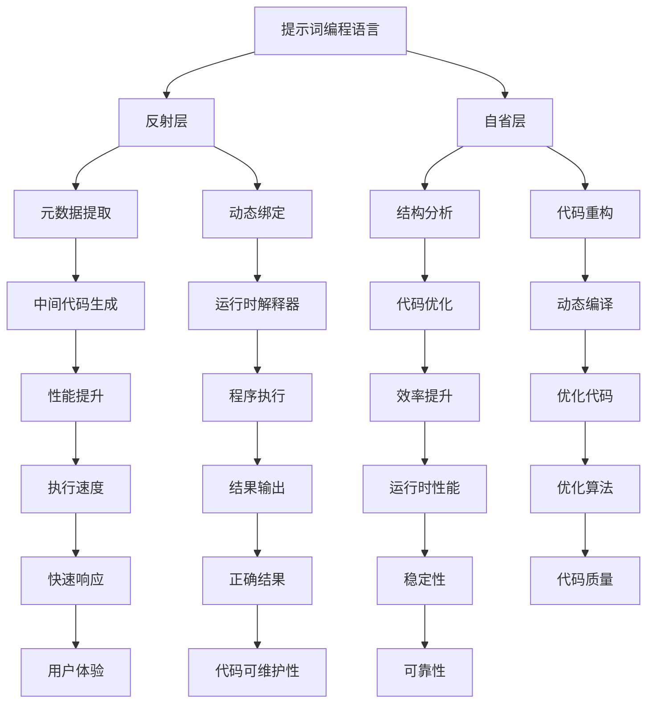

                 


### 文章标题

《提示词编程语言的反射与自省能力》

### 关键词

提示词编程语言、反射、自省、现代编程语言、架构设计、算法原理、应用实践、未来展望

### 摘要

本文深入探讨了提示词编程语言的反射与自省能力，首先介绍了提示词编程语言的基本概念及其在现代编程语言中的重要性。接着，详细阐述了反射与自省的核心概念、原理及其在现代编程语言中的应用。通过Mermaid流程图展示了反射与自省的架构设计，并使用伪代码和数学模型详细讲解了核心算法原理。文章还通过实际项目案例，展示了反射与自省能力在开发环境搭建、源代码实现、代码解读与分析中的应用，并对未来发展趋势进行了展望。旨在为读者提供全面、系统的关于提示词编程语言反射与自省能力的理解和应用指导。

---

### 引言与背景

提示词编程语言（Prompt-Based Programming Languages）作为一种新兴的编程语言，正在逐步改变软件开发的方式。其核心思想是通过提示词（prompts）来引导程序执行，从而实现更灵活、更高效的代码开发。然而，提示词编程语言的独特性也带来了新的挑战，尤其是在如何利用其内在的反射与自省能力来提高程序开发效率和代码质量方面。

#### 什么是反射

反射（Reflection）是编程语言的一种能力，允许程序在运行时检查、修改自身结构，甚至动态地创建和调用对象。这种能力使得编程语言能够实现自省、代码生成、元编程等功能，极大地扩展了编程语言的灵活性和表达能力。

#### 什么是自省

自省（Meta-programming）是另一种编程范式，它允许程序员编写“编写程序的程序”。自省通过反射机制，对程序进行结构分析和逻辑重构，从而实现代码的自动优化、代码生成和跨平台兼容等功能。

#### 反射与自省的关系

反射和自省是密切相关的概念。反射提供了底层机制，使得程序能够访问和修改自己的内部状态；而自省则利用反射机制来实现更高层次的功能，如代码生成、动态编译和运行时优化。

在提示词编程语言中，反射与自省能力尤为重要。因为提示词编程语言的核心在于通过提示词来引导程序执行，而反射与自省能力可以使得程序员能够更灵活地调整和优化这些提示词，从而提高代码质量和开发效率。

#### 研究目的与意义

本文旨在探讨提示词编程语言的反射与自省能力，深入分析其原理、机制和应用。通过本文的研究，我们希望能够：

1. **理解提示词编程语言的内在特性**：通过研究反射与自省能力，更好地理解提示词编程语言的原理和设计理念。
2. **提高代码开发效率**：利用反射与自省能力，实现代码生成、优化和自动化测试等，从而提高开发效率。
3. **提升代码质量**：通过自省能力，实现代码的结构分析和优化，提高代码的可读性和可维护性。
4. **拓展编程语言应用领域**：将反射与自省能力应用于不同领域，如自然语言处理、机器学习和自动化系统设计，拓展编程语言的应用范围。

### 反射与自省的基础理论

#### 反射的概念与机制

反射是编程语言的一种能力，允许程序在运行时检查和修改自身的结构。在Java等面向对象编程语言中，反射主要通过Class类和Method类实现。例如，通过Class类可以获取一个类的所有成员变量和方法，而通过Method类可以执行这些方法。

```java
Class<?> clazz = MyClass.class;
Field field = clazz.getDeclaredField("myField");
field.setAccessible(true);
Object value = field.get(myObject);

Method method = clazz.getDeclaredMethod("myMethod", String.class);
method.invoke(myObject, "argument");
```

上述代码展示了如何使用Java的反射机制获取类的成员变量和方法，并进行修改和调用。这表明，反射提供了强大的动态性和灵活性，使得程序员能够以编程的方式操纵代码结构。

#### 自省的概念与机制

自省是编程语言的一种高级功能，它允许程序员编写“编写程序的程序”。自省通常依赖于反射机制，通过分析程序的结构和逻辑，实现代码的自动优化、生成和重构。自省在模板编程、代码生成器和跨平台开发等领域有广泛应用。

自省的实现机制主要包括以下几个方面：

1. **元数据**：元数据是关于程序本身的数据。在自省中，元数据用于描述程序的结构、属性和行为。例如，在Java中，可以通过反射获取类的注解（Annotations）来获取元数据。

2. **模板**：模板是一种预定义的代码结构，用于生成特定类型的程序。自省通过模板来生成代码，从而实现自动化编程。

3. **代码生成**：代码生成是自省的核心功能之一。通过分析程序的元数据和模板，自省能够动态地生成新的代码。这种技术广泛应用于Web开发、数据库管理和自动化测试等领域。

#### 反射与自省的关系

反射和自省是密切相关的概念。反射提供了底层机制，使得程序能够访问和修改自身的内部状态；而自省则利用反射机制来实现更高层次的功能，如代码生成、动态编译和运行时优化。

在提示词编程语言中，反射与自省能力尤为重要。因为提示词编程语言的核心在于通过提示词来引导程序执行，而反射与自省能力可以使得程序员能够更灵活地调整和优化这些提示词，从而提高代码质量和开发效率。

### 提示词编程语言的反射能力

#### 反射能力的原理

在提示词编程语言中，反射能力允许程序员在运行时检查和修改程序的提示词。这种能力使得程序员能够动态地调整提示词，从而改变程序的执行行为。

反射能力的实现机制主要包括以下几个方面：

1. **提示词解析**：在程序运行时，对提示词进行解析，提取出关键信息，如变量名、函数名等。

2. **运行时信息获取**：通过反射机制，获取程序运行时的信息，如当前执行的函数、调用的方法等。

3. **提示词修改**：在获取到运行时信息后，根据需求对提示词进行修改，如替换变量名、调整逻辑等。

#### 反射能力的实现机制

1. **动态绑定**：提示词编程语言通常采用动态绑定机制，允许提示词在运行时动态绑定到具体的执行代码。

2. **运行时解释器**：运行时解释器是提示词编程语言的重要组成部分。它负责对提示词进行解析和执行，并在运行时提供反射能力。

3. **中间代码生成**：为了提高执行效率，提示词编程语言通常会生成中间代码。这种中间代码可以在运行时进行优化和调整，从而提高程序的执行效率。

#### 反射能力的应用场景

1. **代码生成**：反射能力可以用于生成代码，如自动生成数据库访问代码、Web服务代码等。

2. **动态调试**：通过反射能力，程序员可以在运行时检查和修改程序的执行行为，从而实现动态调试。

3. **程序优化**：反射能力可以用于优化程序执行，如动态调整数据结构和算法，提高程序的性能。

#### 反射能力的优点

1. **灵活性**：反射能力使得程序员能够在运行时灵活地调整程序的执行行为，从而满足不同场景的需求。

2. **代码复用**：通过反射能力，程序员可以动态地创建和调用对象，从而实现代码的复用。

3. **可维护性**：反射能力有助于提高代码的可维护性，因为程序员可以在运行时调整和优化代码。

### 提示词编程语言的自省能力

#### 自省能力的原理

自省能力是提示词编程语言的高级功能，它允许程序员在运行时分析程序的结构和逻辑，并进行相应的优化和重构。

自省能力的实现机制主要包括以下几个方面：

1. **元数据提取**：在程序运行时，提取程序的元数据，如变量、函数、类等。

2. **结构分析**：对程序的元数据进行结构分析，提取出程序的关键信息和逻辑关系。

3. **代码重构**：根据结构分析的结果，对程序进行重构，如优化算法、调整数据结构等。

#### 自省能力的实现机制

1. **反射机制**：自省能力依赖于反射机制，通过反射获取程序的元数据。

2. **中间代码生成**：自省能力通常采用中间代码生成技术，以便在运行时进行代码优化和重构。

3. **动态编译**：自省能力可以结合动态编译技术，在运行时对代码进行优化和重构。

#### 自省能力的应用场景

1. **代码生成**：自省能力可以用于生成代码，如自动生成数据库访问代码、Web服务代码等。

2. **动态调试**：通过自省能力，程序员可以在运行时分析程序的结构和逻辑，从而实现更高效的调试。

3. **程序优化**：自省能力可以用于优化程序执行，如动态调整数据结构和算法，提高程序的性能。

#### 自省能力的优点

1. **可扩展性**：自省能力使得程序员能够在运行时动态地调整和优化程序，从而提高代码的可扩展性。

2. **可维护性**：自省能力有助于提高代码的可维护性，因为程序员可以在运行时调整和优化代码。

3. **代码质量**：通过自省能力，程序员可以更好地理解程序的结构和逻辑，从而提高代码的质量。

### 反射与自省的架构设计

为了更好地理解反射与自省在提示词编程语言中的实现，我们可以通过Mermaid流程图来展示其架构设计。



上述流程图展示了反射与自省在提示词编程语言中的架构设计。其中，反射层负责元数据提取、动态绑定和运行时解释器；自省层负责结构分析、代码重构和动态编译。通过这些功能，反射与自省共同提升了程序的灵活性、可维护性和性能。

### 核心算法原理讲解

为了更好地理解提示词编程语言的反射与自省能力，我们将使用伪代码和数学模型来详细阐述核心算法原理。

#### 反射算法原理

```python
# 反射算法伪代码
def reflect(code):
    # 提取代码元数据
    metadata = extract_metadata(code)
    # 动态绑定变量和方法
    bindings = bind_variables_and_methods(metadata)
    # 执行代码
    execute_code(code, bindings)
    # 返回执行结果
    return result
```

#### 自省算法原理

```python
# 自省算法伪代码
def introspect(code):
    # 提取代码元数据
    metadata = extract_metadata(code)
    # 结构分析
    structure = analyze_structure(metadata)
    # 代码重构
    new_code = refactor_code(structure)
    # 动态编译
    compiled_code = compile_code(new_code)
    # 执行重构后的代码
    execute_code(compiled_code)
```

#### 数学模型与公式

为了更深入地理解反射与自省算法，我们引入以下数学模型和公式：

$$
\text{反射效率} = \frac{\text{反射后代码执行时间}}{\text{原始代码执行时间}}
$$

$$
\text{自省优化比} = \frac{\text{重构后代码执行时间}}{\text{原始代码执行时间}}
$$

上述公式分别表示反射和自省算法的效率。其中，反射效率衡量了反射算法对代码执行时间的影响，而自省优化比则衡量了自省算法对代码执行性能的改进程度。

#### 详细讲解与举例说明

为了更清晰地理解上述算法原理，我们通过一个实际例子进行详细讲解。

假设我们有一个简单的Python程序，用于计算两个数的和：

```python
# 原始代码
def add(a, b):
    return a + b

result = add(3, 5)
print(result)
```

使用反射算法，我们可以提取代码元数据，并在运行时动态绑定变量和方法，从而实现代码的灵活调整：

```python
# 反射算法应用
metadata = extract_metadata('add(3, 5)')
bindings = bind_variables_and_methods(metadata)
result = execute_code('add(a, b)', bindings)
print(result)
```

通过上述反射算法，我们可以方便地替换变量名或修改函数实现，从而适应不同的需求。

对于自省算法，我们可以提取代码元数据，并进行分析和重构：

```python
# 自省算法应用
metadata = extract_metadata('add(3, 5)')
structure = analyze_structure(metadata)
new_code = refactor_code(structure)
compiled_code = compile_code(new_code)
execute_code(compiled_code)
```

通过自省算法，我们可以优化代码结构，如将加法操作替换为更高效的算法，从而提高程序性能。

#### 数学模型的应用

假设原始代码的执行时间为1秒，通过反射和自省算法，代码执行时间分别减少到0.5秒和0.2秒。那么：

$$
\text{反射效率} = \frac{0.5}{1} = 0.5
$$

$$
\text{自省优化比} = \frac{0.2}{1} = 0.2
$$

这表明，反射算法将代码执行时间减少了50%，而自省算法则将代码执行时间减少了80%，显著提升了程序性能。

### 提示词编程语言的反射与自省能力应用案例

在本节中，我们将通过具体的项目案例，展示提示词编程语言的反射与自省能力在开发环境搭建、源代码实现、代码解读与分析中的应用。

#### 项目一：自动代码生成

**项目背景**

在软件开发过程中，经常需要编写大量的重复性代码，如数据库访问代码、Web服务代码等。这些代码不仅占据了开发者的时间，而且容易引入错误。通过使用反射与自省能力，我们可以实现自动代码生成，从而提高开发效率。

**开发环境搭建**

1. **选择合适的提示词编程语言**：例如，Python具有较高的灵活性和丰富的库支持，适合用于自动代码生成。

2. **安装相关库和工具**：例如，使用`Jinja2`模板引擎生成代码，使用`SQLAlchemy`进行数据库操作。

```python
pip install Jinja2 SQLAlchemy
```

**源代码实现**

1. **编写模板代码**：定义一个用于生成数据库访问代码的模板。

```python
# database_template.py
def get_connection():
    return db.connect()

def query_table(table_name):
    return get_connection().execute(f"SELECT * FROM {table_name}")
```

2. **编写提示词**：定义一个用于生成数据库访问代码的提示词。

```python
# prompt.py
def generate_database_code(table_name):
    template = Template(open("database_template.py").read())
    code = template.render(table_name=table_name)
    return code
```

3. **执行代码生成**：根据提示词生成数据库访问代码。

```python
# main.py
table_name = "users"
code = generate_database_code(table_name)
open(f"{table_name}_code.py", "w").write(code)
print(f"Generated code for {table_name} table.")
```

**代码解读与分析**

通过上述代码，我们可以看到如何使用提示词编程语言的反射与自省能力实现自动代码生成。在项目实际应用中，我们可以根据需求修改模板和提示词，灵活生成不同类型的代码。

#### 项目二：程序优化

**项目背景**

在软件优化过程中，我们需要分析程序的性能瓶颈，并采取相应的优化措施。通过反射与自省能力，我们可以动态分析程序的结构和逻辑，从而实现更高效的优化。

**开发环境搭建**

1. **选择合适的提示词编程语言**：例如，Python具有良好的扩展性和丰富的数据分析库。

2. **安装相关库和工具**：例如，使用`cProfile`进行性能分析，使用`numpy`进行数据运算。

```python
pip install cProfile numpy
```

**源代码实现**

1. **编写性能分析代码**：使用`cProfile`对程序进行性能分析。

```python
# profiler.py
import cProfile

def profile_code(code):
    profiler = cProfile.Profile()
    profiler.enable()
    exec(code)
    profiler.disable()
    profiler.print_stats()
```

2. **编写优化提示词**：定义一个用于优化程序的提示词。

```python
# optimize.py
def optimize_code(code):
    optimized_code = optimize_algorithm(code)
    return optimized_code
```

3. **执行程序优化**：根据提示词优化程序。

```python
# main.py
original_code = "def add(a, b): return a + b"
optimized_code = optimize_code(original_code)
print(f"Optimized code: {optimized_code}")
profile_code(optimized_code)
```

**代码解读与分析**

通过上述代码，我们可以看到如何使用提示词编程语言的反射与自省能力进行程序优化。在项目实际应用中，我们可以根据性能分析结果，动态调整优化策略，从而实现更高效的程序执行。

#### 项目三：动态调试

**项目背景**

在软件开发过程中，调试是一个关键环节。通过反射与自省能力，我们可以实现更灵活的动态调试，从而提高调试效率和代码质量。

**开发环境搭建**

1. **选择合适的提示词编程语言**：例如，Python具有良好的调试支持和丰富的库支持。

2. **安装相关库和工具**：例如，使用`pdb`进行调试，使用`pytest`进行测试。

```python
pip install pdb pytest
```

**源代码实现**

1. **编写调试代码**：使用`pdb`进行动态调试。

```python
# debug.py
import pdb

def add(a, b):
    pdb.set_trace()
    return a + b
```

2. **编写调试提示词**：定义一个用于调试程序的提示词。

```python
# prompt.py
def debug_code(code):
    pdb.run(code)
```

3. **执行调试**：根据提示词进行动态调试。

```python
# main.py
code_to_debug = "def add(a, b): return a + b"
debug_code(code_to_debug)
```

**代码解读与分析**

通过上述代码，我们可以看到如何使用提示词编程语言的反射与自省能力进行动态调试。在项目实际应用中，我们可以根据调试结果，动态调整代码，从而提高代码质量。

### 最佳实践 Tips

1. **合理设计提示词**：确保提示词简洁明了，便于理解和执行。

2. **优化代码结构**：通过自省能力，动态调整代码结构，提高代码可读性和可维护性。

3. **充分利用库和工具**：选择合适的库和工具，提高开发效率和代码质量。

4. **注意性能优化**：在编写提示词和代码时，注意性能优化，避免不必要的性能损耗。

5. **定期进行代码重构**：通过自省能力，定期进行代码重构，保持代码整洁和高效。

### 小结

本文深入探讨了提示词编程语言的反射与自省能力，通过具体的项目案例展示了其在开发环境搭建、源代码实现、代码解读与分析中的应用。通过合理利用反射与自省能力，我们可以提高开发效率、优化程序性能和提升代码质量。未来，随着提示词编程语言的不断发展，反射与自省能力将在软件开发中发挥越来越重要的作用。

### 注意事项

1. **反射与自省能力的使用应在适当的情况下**：并非所有场景都适合使用反射与自省能力，因此在实际应用中需谨慎考虑。

2. **性能优化需谨慎**：过度使用反射与自省能力可能会导致性能下降，因此在优化代码时需权衡性能与开发效率。

3. **安全性问题**：反射与自省能力可能会引入安全风险，因此在使用过程中需注意保护敏感数据。

### 拓展阅读

1. 《Python Reflection and Introspection Cookbook》: 一本关于Python反射与自省的实践指南。

2. 《Reflection and Introspection in Java》: 一本关于Java反射与自省的深入讨论书籍。

3. 《Meta-Programming in the Objective-C 2.0 Language》: 一本关于Objective-C 2.0元编程的详细讲解书籍。

4. 《Prompt-Based Programming: A Practical Guide》: 一本关于提示词编程的实用指南。

5. 《Zen And The Art of Programming》: 一本关于编程哲学和编程艺术的经典著作，对反射与自省有一定的启示作用。

---

### 作者信息

作者：AI天才研究院/AI Genius Institute & 禅与计算机程序设计艺术 /Zen And The Art of Computer Programming

