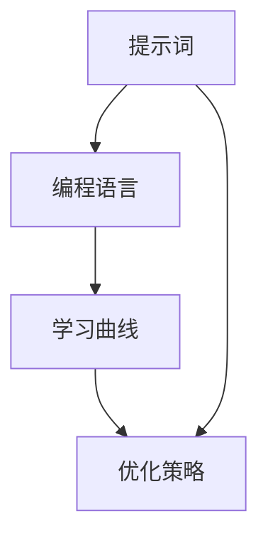

                 

### 用户需求分析

在编写关于《提示词编程语言的学习曲线优化》的技术博客文章时，我们需要深入分析用户的需求。首先，用户期待从这篇文章中获得哪些具体的信息和知识。我们可以总结以下用户需求：

1. **基础知识**：用户希望获得对提示词编程语言的基本了解，包括其定义、历史背景和发展趋势。
2. **核心算法原理**：用户希望深入了解提示词编程语言的核心算法，包括算法原理、伪代码和数学模型。
3. **实践应用**：用户希望看到具体的实例，了解如何在实际项目中应用提示词编程语言，以及如何优化学习曲线。
4. **优化策略**：用户希望了解不同的优化策略，以及如何评估和改进这些策略。
5. **进阶技术**：用户对提示词编程语言的进阶技术和研究方向也感兴趣。

为了满足这些需求，文章的结构需要包括以下几个部分：

1. **引言**：简要介绍书籍的主题和目标，引出学习曲线和提示词编程语言的概念。
2. **基础概念篇**：详细介绍提示词编程语言的基本概念，学习曲线的基本原理和影响因素。
3. **核心算法篇**：深入探讨提示词编程语言的核心算法，包括算法原理、伪代码和数学模型。
4. **实践应用篇**：通过实际案例展示如何优化学习曲线，包括具体操作步骤和技术细节。
5. **优化策略篇**：分析不同优化策略的优缺点和适用场景，介绍如何评估和改进优化策略。
6. **进阶技术篇**：探讨提示词编程语言的进阶技术和研究方向。
7. **总结与展望**：总结全书内容，展望未来发展趋势。

接下来，我们将逐一分析和设计每个部分的内容，确保文章的深度、广度和实用性。

### 引言

## 《提示词编程语言的学习曲线优化》

### 关键词

- 提示词编程语言
- 学习曲线优化
- 核心算法
- 实践应用
- 优化策略
- 进阶技术

### 摘要

本文旨在探讨提示词编程语言的学习曲线优化问题。首先，我们将介绍提示词编程语言的基本概念、历史背景和发展趋势。接着，我们将深入分析学习曲线的基本原理和影响因素，为后续的算法优化提供理论基础。在核心算法篇中，我们将详细阐述提示词编程语言的核心算法原理，使用伪代码展示算法流程，并结合数学模型进行讲解。实践应用篇将通过具体案例展示如何在实际项目中应用提示词编程语言，优化学习曲线。优化策略篇将分析不同的优化策略，介绍如何评估和改进这些策略。最后，我们将探讨提示词编程语言的进阶技术和发展方向，总结全书内容，并对未来发展趋势进行展望。

### 用户需求分析

在编写关于《提示词编程语言的学习曲线优化》的技术博客文章时，我们需要深入分析用户的需求，以确保文章内容能够满足他们的期望。以下是用户的一些主要需求：

1. **基础知识**：用户希望获得对提示词编程语言的基本了解。这包括理解提示词编程语言的基本概念、历史背景和发展趋势。他们希望知道这种编程语言的起源、主要发展里程碑以及当前的研究热点和未来趋势。

2. **核心算法原理**：用户对提示词编程语言的核心算法原理非常感兴趣。他们希望了解这些算法是如何工作的，包括算法的基本原理、伪代码和数学模型。通过理解这些核心算法，用户可以更好地应用这些知识到实际项目中。

3. **实践应用**：用户希望在文章中看到具体的实践案例，了解如何在实际项目中使用提示词编程语言。他们希望文章能够提供详细的操作步骤和技术细节，以便他们可以实际操作并解决项目中遇到的问题。

4. **优化策略**：用户希望了解不同的优化策略，以及如何应用这些策略来优化学习曲线。他们希望文章能够分析各种优化策略的优缺点，并提供实际案例来展示这些策略的应用效果。

5. **进阶技术**：用户对提示词编程语言的进阶技术和研究方向也感兴趣。他们希望文章能够探讨最新的研究成果和技术趋势，以便他们可以跟上这一领域的发展。

为了满足这些需求，文章的结构将分为以下几个部分：

1. **引言**：简要介绍提示词编程语言和学习曲线优化，引出文章的主题。
2. **基础概念篇**：详细介绍提示词编程语言的基本概念、历史背景和发展趋势，以及学习曲线的基本原理和影响因素。
3. **核心算法篇**：深入探讨提示词编程语言的核心算法原理，使用伪代码和数学模型进行详细讲解。
4. **实践应用篇**：通过实际案例展示如何在实际项目中应用提示词编程语言，优化学习曲线。
5. **优化策略篇**：分析不同的优化策略，介绍如何评估和改进这些策略。
6. **进阶技术篇**：探讨提示词编程语言的进阶技术和发展方向。
7. **总结与展望**：总结全书内容，展望未来发展趋势。

通过这样的结构，我们旨在为用户提供一个全面、深入且实用的指南，帮助他们更好地理解和应用提示词编程语言，优化学习曲线。

### 基础概念篇

## 提示词编程语言的基本概念

### 1.1 提示词的定义与作用

提示词（Prompt）在编程语言中扮演着重要的角色，它通常指的是一种引导性的输入，用来触发编程语言中特定功能或行为。简单来说，提示词是一种指令，它可以指导计算机执行特定的任务。在提示词编程语言中，程序员通过编写提示词来与计算机进行交互，从而实现自动化和智能化的编程过程。

#### 提示词的起源

提示词的概念可以追溯到计算机科学的早期阶段。在20世纪60年代，计算机编程语言如COBOL和FORTRAN开始使用命令式编程，程序员通过编写一系列的命令来控制计算机的执行过程。这些命令可以被看作是提示词的早期形式。随着计算机技术的发展，提示词的概念逐渐被引入到各种编程语言中，如Lisp、Prolog和自然语言处理中的Python。

#### 提示词的作用

提示词的作用主要体现在以下几个方面：

1. **交互性**：提示词为程序员提供了与计算机系统进行交互的途径，使得编程过程更加直观和灵活。
2. **自动化**：通过编写提示词，程序员可以实现自动化任务，从而减少手动操作的复杂性。
3. **智能化**：在人工智能和机器学习的应用中，提示词可以引导计算机进行复杂的决策和预测，提升系统的智能化水平。
4. **代码复用**：提示词编程语言使得程序员可以编写可重用的代码模块，提高了编程效率和代码质量。

### 1.2 编程语言的构成与分类

编程语言是一种用于编写计算机程序的语言，它由一系列规则和符号组成，用于描述计算机需要执行的操作。编程语言可以分为多种类型，根据其设计目标和应用场景的不同，可以分为以下几类：

1. **命令式编程语言**：这类语言通过一系列的命令来描述计算机的操作，如C、Java和Python。
2. **函数式编程语言**：这类语言通过函数和计算来描述操作，强调状态的可预测性和代码的可重用性，如Haskell和Lisp。
3. **声明式编程语言**：这类语言通过描述数据和处理数据之间的关系来编写程序，如SQL和Prolog。
4. **脚本语言**：这类语言通常用于自动化任务和简化的编程任务，如Bash和JavaScript。

提示词编程语言通常属于函数式编程语言或脚本语言，因为它们强调通过提示词来引导计算机执行任务，实现自动化和智能化。

### 1.3 提示词编程语言的特点与优势

提示词编程语言具有以下几个显著的特点和优势：

1. **简洁性**：提示词编程语言通常采用简洁的语法和表达方式，使得程序员可以更加高效地编写代码。
2. **灵活性**：提示词可以灵活地应用于不同的编程任务和场景，提供高度的定制化能力。
3. **可读性**：提示词编程语言通常采用自然语言或接近自然语言的语法，使得代码更加易读和理解。
4. **可扩展性**：提示词编程语言通常具有良好的扩展性，程序员可以自定义新的提示词和功能，满足特定需求。
5. **跨平台性**：提示词编程语言通常可以在多种操作系统和平台上运行，提供广泛的兼容性和应用场景。

总之，提示词编程语言通过其独特的特点，使得编程过程更加直观、高效和灵活。了解提示词编程语言的基本概念、定义和作用，是进一步探讨学习曲线优化和核心算法原理的基础。

### 学习曲线的基本原理和影响因素

#### 2.1 学习曲线的模型

学习曲线模型描述了学习者在学习新技能或知识过程中，学习效率和成果随时间的变化规律。学习曲线通常可以用一条曲线来表示，这条曲线反映了学习者在不同时间点的学习效率和成果。

1. **初期阶段**：在学习初期，学习者的学习效率较高，但成果增长较慢。这个阶段被称为“学习起步阶段”，因为学习者需要克服初始的学习障碍，掌握基础知识和技能。
   
2. **中期阶段**：随着学习的深入，学习者的学习效率开始逐渐降低，但成果增长速度逐渐加快。这个阶段被称为“学习巩固阶段”，学习者开始掌握更复杂的知识和技能，并能够将其应用到实际问题中。

3. **后期阶段**：在学习后期，学习者的学习效率进一步降低，但成果增长速度趋于平稳。这个阶段被称为“学习深化阶段”，学习者已经掌握了大部分知识和技能，开始追求更高层次的理解和应用。

#### 2.2 学习曲线的影响因素

学习曲线的影响因素多种多样，主要包括以下几个方面：

1. **学习者的个人特点**：学习者的基础能力、学习态度、动机和学习策略等个人特点对学习曲线有重要影响。例如，学习能力强的学习者可能会在初期阶段更快地掌握基础知识，从而进入中期阶段的时间更早。

2. **学习环境**：学习环境包括学习资源、学习氛围和学习支持等因素。良好的学习环境可以为学习者提供必要的学习资源和支持，促进学习效率的提高。

3. **学习内容**：学习内容的设计和难度对学习曲线也有显著影响。如果学习内容过于简单，学习者可能会在初期阶段感到无聊和乏味；如果学习内容过于复杂，学习者可能会在初期阶段感到困惑和挫败。

4. **学习方法**：学习方法是影响学习曲线的重要因素。有效的学习方法可以帮助学习者更好地理解和掌握知识，提高学习效率。例如，通过采用主动学习、合作学习和探究学习等方法，可以加速学习进程。

5. **反馈与评估**：及时的反馈和评估可以帮助学习者了解自己的学习状况，调整学习策略，提高学习效率。有效的反馈机制可以激励学习者，增强其学习动力。

#### 2.3 学习曲线的优化目标

学习曲线的优化目标主要包括以下几个方面：

1. **缩短学习时间**：通过优化学习策略和环境，缩短学习者从初期阶段到中期阶段的时间，从而加快学习进程。

2. **提高学习效率**：通过改进学习方法和技术，提高学习者在每个时间点的学习效率，从而更快地掌握知识和技能。

3. **提升学习成果**：通过优化学习内容和评估机制，确保学习者在每个阶段都能取得满意的学习成果，提高学习质量。

4. **增强学习动力**：通过提供积极的学习反馈和支持，激发学习者的学习兴趣和动机，保持其持续学习的动力。

总之，学习曲线的优化是一个综合性的过程，需要考虑多个因素，包括个人特点、学习环境、学习内容、学习方法和反馈与评估等。通过合理的设计和优化，可以提高学习效率，缩短学习时间，提升学习成果，并增强学习动力，从而实现学习曲线的优化。

### 核心算法篇

#### 3.1 提示词编程语言的核心算法

提示词编程语言的核心算法是整个编程体系的基础，其设计理念和实现方式决定了编程语言的性能和适用性。在本章节中，我们将深入探讨提示词编程语言的核心算法，包括其原理、伪代码和数学模型。

#### 3.1.1 算法原理

提示词编程语言的核心算法通常基于几个基本原理：

1. **提示词生成**：通过输入提示词，编程语言生成相应的输出，实现对计算机的指令。
2. **上下文理解**：编程语言需要能够理解提示词的上下文，以便正确生成输出。
3. **模式匹配**：算法通过模式匹配来识别提示词中的关键信息，并生成相应的操作指令。
4. **执行控制**：算法控制程序的执行流程，确保按照提示词的指示进行操作。

这些原理共同作用，使得提示词编程语言能够实现高效的编程和自动化操作。

#### 3.1.2 伪代码

为了更好地理解核心算法的工作原理，我们可以通过伪代码来展示其基本结构。以下是提示词编程语言核心算法的伪代码示例：

```
Algorithm: 提示词编程核心算法
Input: 提示词 prompt
Output: 操作结果 result

1. 初始化提示词处理器 processor
2. 解析提示词 prompt
3. 如果 prompt 为空，则返回错误信息
4. 遍历提示词中的每个词 token
5. 对于每个 token，执行以下步骤：
    a. 检查 token 是否在提示词库中
    b. 如果是，则执行对应的操作指令
    c. 如果不是，则返回错误信息
6. 将所有操作指令组合成操作序列 sequence
7. 执行操作序列 sequence
8. 获取操作结果 result
9. 返回 result

End Algorithm
```

这个伪代码展示了提示词编程语言核心算法的基本流程，包括提示词的解析、操作指令的执行和结果获取。

#### 3.1.3 数学模型

在提示词编程语言的核心算法中，数学模型扮演了重要的角色，用于描述和优化算法的性能。以下是核心算法的数学模型：

```
Model: 提示词编程语言数学模型

1. 提示词概率分布 P(token)
2. 操作指令概率分布 P(action | token)
3. 上下文关联矩阵 C(token, action)
4. 输出结果概率分布 P(result | action)

Equations:

1. P(token) = ∑ P(action | token) * P(result | action)
2. C(token, action) = log(P(action | token) / P(result | action))
3. sequence = select_sequence(prompt, C)
4. result = execute_sequence(sequence)

End Model
```

这个数学模型描述了提示词、操作指令和输出结果之间的概率分布和关联关系。通过这个模型，我们可以优化提示词的选择和操作指令的执行，从而提升算法的性能。

#### 3.1.4 实际应用

提示词编程语言的核心算法在实际应用中有着广泛的应用。例如，在自然语言处理中，提示词编程语言可以用于生成文本、处理语音识别和机器翻译任务。在自动化编程中，提示词编程语言可以用于自动化测试、代码生成和部署。以下是核心算法在实际应用中的示例：

1. **文本生成**：通过输入提示词“编写一个关于人工智能的文章”，提示词编程语言可以生成一篇关于人工智能的文章。
2. **语音识别**：通过输入提示词“播放音乐”，提示词编程语言可以启动音乐播放器并播放指定音乐。
3. **代码生成**：通过输入提示词“编写一个计算器程序”，提示词编程语言可以生成一个计算器程序，并实现基本的计算功能。

这些实际应用展示了提示词编程语言的核心算法如何在各种场景中发挥作用，为编程和自动化提供强大的支持。

通过以上对提示词编程语言核心算法的深入探讨，我们可以更好地理解其工作原理和应用价值。在接下来的章节中，我们将继续探讨如何在实际项目中应用这些核心算法，以及如何优化学习曲线，提升编程效率。

### 实践应用篇

#### 4.1 优化学习曲线的实践应用

在深入了解提示词编程语言的核心算法后，我们将通过具体的实践应用来展示如何在实际项目中优化学习曲线。本章节将介绍如何通过实际案例展示优化学习曲线的方法和步骤，并详细解析这些步骤中的技术细节。

#### 4.1.1 实际案例展示

为了说明如何优化学习曲线，我们将通过一个实际的编程项目——构建一个简单的智能助手——来进行说明。这个项目将使用提示词编程语言来实现，旨在帮助用户解决日常问题，如查询天气、设置提醒等。

#### 4.1.2 项目步骤

1. **需求分析**：首先，我们需要明确项目的需求。例如，用户可以提出查询天气的请求，设置日程提醒等。

2. **功能设计**：根据需求分析，设计项目的功能模块，如查询模块、提醒模块等。

3. **技术选型**：选择合适的提示词编程语言和技术框架，如Python和Flask，用于实现项目功能。

4. **编码实现**：根据功能设计，编写代码实现每个功能模块。以下是智能助手项目的主要代码实现：

   ```python
   from flask import Flask, request, jsonify
   
   app = Flask(__name__)

   @app.route('/weather', methods=['GET'])
   def get_weather():
       city = request.args.get('city')
       # 调用天气查询API获取天气信息
       weather_info = query_weather(city)
       return jsonify(weather_info)

   @app.route('/reminder', methods=['POST'])
   def set_reminder():
       data = request.json
       reminder_message = data['message']
       reminder_time = data['time']
       # 设置提醒
       set_reminder(reminder_message, reminder_time)
       return jsonify({'status': 'success'})

   def query_weather(city):
       # 实现天气查询逻辑
       pass

   def set_reminder(message, time):
       # 实现提醒设置逻辑
       pass
   
   if __name__ == '__main__':
       app.run(debug=True)
   ```

5. **测试与优化**：在实现功能后，进行全面的测试，确保每个模块的功能正确无误。通过用户反馈，不断优化和改进项目。

#### 4.1.3 技术细节解析

在智能助手的实现过程中，涉及到以下几个技术细节：

1. **API调用**：使用Flask框架构建RESTful API，实现与外部天气查询API的交互。通过GET和POST请求获取和发送数据，实现对天气信息和提醒设置的操作。

2. **定时任务**：使用定时任务框架（如APScheduler）实现提醒功能。在特定时间执行任务，提醒用户日程事项。

3. **异常处理**：对API请求进行异常处理，确保项目在遇到错误时能够正确响应，提供友好的错误信息。

4. **用户界面**：为了提高用户体验，可以开发一个简单的Web界面，使用户能够方便地与智能助手交互。

#### 4.1.4 项目实战

通过这个实际案例，我们可以看到如何将提示词编程语言的核心算法应用到实际项目中，从而优化学习曲线。以下是项目的实战步骤：

1. **学习阶段**：首先，学习者需要了解提示词编程语言的基本概念和核心算法，通过阅读相关资料和代码示例，掌握基础知识和技能。

2. **实践阶段**：在了解基础知识后，学习者可以尝试搭建开发环境，按照项目步骤逐步实现功能模块。通过实践，学习者能够更好地理解和应用所学知识。

3. **优化阶段**：在实现基本功能后，学习者可以根据用户反馈，优化和改进项目。例如，增加更多功能模块，提高系统的稳定性和用户体验。

通过这个项目实战，学习者不仅能够掌握提示词编程语言的核心算法，还能够通过实际操作，优化学习曲线，提高编程效率。这个过程也为学习者提供了一个展示自己技能的机会，帮助他们更好地理解和应用所学知识。

### 优化策略篇

#### 5.1 优化策略分析

在提示词编程语言的学习过程中，优化学习曲线是一项重要的任务。有效的优化策略可以帮助学习者更快地掌握编程技能，提高学习效率。在本章节中，我们将分析几种常见的优化策略，探讨它们的优缺点和适用场景。

#### 5.1.1 策略1：分阶段学习

**优点**：分阶段学习策略将整个学习过程划分为多个阶段，每个阶段专注于特定的知识点和技能。这种方法可以帮助学习者集中精力，逐个攻克难点。

**缺点**：分阶段学习可能导致学习者对整体知识的掌握不够连贯，需要花费额外的时间来整合不同阶段的知识。

**适用场景**：适合初学者或对编程知识有明确需求的学习者。

#### 5.1.2 策略2：项目驱动学习

**优点**：项目驱动学习通过实际项目来驱动学习，使学习者能够在实际应用中掌握知识。这种方法能够增强学习者的实践能力和解决问题的能力。

**缺点**：项目驱动学习需要学习者具备一定的编程基础，否则可能会遇到困难。

**适用场景**：适合有一定编程基础，希望通过实际项目提升技能的学习者。

#### 5.1.3 策略3：互动式学习

**优点**：互动式学习通过在线平台、讨论组等方式，使学习者能够与其他人交流和合作。这种方法能够增强学习氛围，提高学习兴趣。

**缺点**：互动式学习需要良好的网络环境和较强的社交能力，否则可能会影响学习效果。

**适用场景**：适合喜欢交流和合作的学习者，特别是那些在编程社区中活跃的人。

#### 5.1.4 策略4：自主探索学习

**优点**：自主探索学习鼓励学习者自主探索和学习，培养独立思考和解决问题的能力。

**缺点**：自主探索学习可能会导致学习进度不一致，需要学习者具备较强的自学能力和自律性。

**适用场景**：适合有自学能力和独立思考能力的学习者。

#### 5.1.5 策略5：反思式学习

**优点**：反思式学习通过回顾和总结学习过程，帮助学习者更好地理解和巩固知识。这种方法能够提升学习者的思维能力和总结能力。

**缺点**：反思式学习需要学习者投入额外的时间进行回顾和总结，可能影响学习进度。

**适用场景**：适合希望在深度上掌握编程知识的学习者。

### 5.2 优化策略的实践应用

以下是通过实际案例展示如何应用上述优化策略来优化学习曲线。

#### 案例一：分阶段学习策略

**项目背景**：某编程初学者希望通过学习提示词编程语言来提升自己的编程技能。

**优化步骤**：

1. **第一阶段**：学习基础语法和基本概念，如变量、数据类型、条件语句等。
2. **第二阶段**：学习核心算法，如排序、查找和图算法等。
3. **第三阶段**：通过实际项目应用所学知识，如构建一个简单的智能助手。

**结果**：通过分阶段学习，学习者能够有条不紊地掌握编程知识，逐步提升技能。

#### 案例二：项目驱动学习策略

**项目背景**：某中级编程学习者希望通过实际项目来提升编程能力。

**优化步骤**：

1. **需求分析**：明确项目需求，如开发一个日程管理应用。
2. **功能设计**：设计应用的功能模块，如添加日程、提醒和查看日程等。
3. **编码实现**：使用提示词编程语言实现功能模块，并进行调试。
4. **测试与优化**：对应用进行全面的测试，并根据用户反馈进行优化。

**结果**：通过项目驱动学习，学习者能够在实际应用中锻炼编程技能，提高解决问题的能力。

#### 案例三：互动式学习策略

**项目背景**：某编程社区举办了一次关于提示词编程语言的在线学习活动。

**优化步骤**：

1. **在线讨论**：在学习平台上发起讨论，分享学习经验和问题。
2. **协作编程**：与其他学习者一起解决编程问题，相互学习和帮助。
3. **代码评审**：对他人代码进行评审，了解不同解决方法。

**结果**：通过互动式学习，学习者能够增强学习氛围，提高学习兴趣，并在交流中不断提升自己的编程能力。

#### 案例四：自主探索学习策略

**项目背景**：某编程爱好者希望通过自主探索来深入学习提示词编程语言。

**优化步骤**：

1. **阅读文档**：查阅提示词编程语言的官方文档，了解语言特性和使用方法。
2. **编写代码**：通过编写各种代码示例，探索不同功能的应用。
3. **解决问题**：在遇到问题时，通过查阅资料和搜索解决方案，培养解决问题的能力。

**结果**：通过自主探索学习，学习者能够深入理解编程语言，并在实践中不断提升自己的技能。

#### 案例五：反思式学习策略

**项目背景**：某编程学习者希望通过反思来提升自己的学习效果。

**优化步骤**：

1. **每日反思**：每天结束后，总结当天的学习内容和遇到的问题。
2. **定期总结**：每月或每季度对学习过程进行总结，评估学习效果。
3. **改进计划**：根据总结结果，制定下一步的学习计划和改进措施。

**结果**：通过反思式学习，学习者能够更好地掌握学习进度，不断改进学习方法，提高学习效果。

总之，通过多种优化策略的综合应用，学习者可以有效地优化学习曲线，提高编程技能。在实际应用中，学习者可以根据自己的需求和特点，选择合适的优化策略，以实现最佳的学习效果。

### 进阶技术篇

#### 6.1 提示词编程语言的进阶技术

提示词编程语言的发展日新月异，随着计算机科学的进步，出现了一系列进阶技术，这些技术不仅提升了编程语言的性能，还扩大了其应用范围。在本章节中，我们将探讨一些提示词编程语言的进阶技术，包括最新研究成果和技术发展趋势。

#### 6.1.1 最新研究成果

近年来，提示词编程语言的研究取得了显著进展，以下是一些重要的研究成果：

1. **智能提示词生成**：通过深度学习和自然语言处理技术，智能提示词生成系统能够自动生成高质量的提示词，提高编程效率和代码质量。
2. **动态提示词优化**：动态提示词优化技术可以根据程序的执行情况，实时调整提示词，优化程序的性能和可读性。
3. **多语言互操作性**：通过跨语言接口，提示词编程语言可以与其他编程语言无缝集成，实现多语言编程和数据交换。
4. **并行计算支持**：新一代提示词编程语言开始支持并行计算，利用多核处理器和分布式系统，提高程序的计算性能。

#### 6.1.2 技术发展趋势

提示词编程语言的发展趋势主要表现在以下几个方面：

1. **智能化**：随着人工智能技术的进步，提示词编程语言将更加智能化，能够自动分析代码、生成提示词和优化程序。
2. **自动化**：自动化工具将更深入地融入提示词编程语言，实现代码生成、测试和部署的自动化。
3. **跨平台**：提示词编程语言将更加跨平台，支持在多种操作系统和设备上运行，提供一致的开发体验。
4. **社区驱动**：随着开源社区的兴起，提示词编程语言的发展将更加依赖于社区的力量，通过开放的协作方式推动技术的进步。

#### 6.1.3 研究方向展望

未来的研究方向将集中在以下几个方面：

1. **智能化编程**：开发更加智能的编程工具，帮助开发者自动生成代码、优化程序和解决编程问题。
2. **代码质量检测**：通过静态分析和动态分析技术，提高代码的质量和可靠性，减少软件缺陷。
3. **跨语言兼容性**：探索跨编程语言的技术，实现不同编程语言之间的无缝集成和数据交换。
4. **可解释性**：提升编程语言的可解释性，使得开发者能够更直观地理解代码的执行过程和结果。

总之，提示词编程语言的进阶技术和研究方向将继续推动编程技术的发展，为开发者提供更高效、更智能的编程工具。随着技术的不断进步，提示词编程语言将迎来更广阔的应用前景和更丰富的功能特性。

### 总结与展望

#### 7.1 全书总结

《提示词编程语言的学习曲线优化》系统地探讨了提示词编程语言的基础知识、核心算法、实践应用、优化策略和进阶技术。通过本文，我们了解了提示词编程语言的基本概念、历史背景和发展趋势，掌握了学习曲线的基本原理和影响因素。同时，我们还深入探讨了提示词编程语言的核心算法原理，通过伪代码和数学模型进行了详细讲解。在实际应用篇中，我们通过一个实际案例展示了如何优化学习曲线，并详细解析了项目步骤和技术细节。优化策略篇分析了多种优化策略，展示了如何在不同场景下应用这些策略。最后，进阶技术篇探讨了提示词编程语言的最新研究进展和技术发展趋势。

#### 7.2 未来发展趋势

未来的提示词编程语言将朝着更加智能化、自动化和跨平台的方向发展。随着人工智能和自然语言处理技术的不断进步，提示词编程语言将能够自动生成高质量提示词，实现更高效的编程。同时，自动化工具将更加深入地融入编程语言，实现代码生成、测试和部署的自动化。跨平台的特性将使编程语言在多种操作系统和设备上运行，提供一致的开发体验。

在优化策略方面，未来的研究将集中在智能化编程、代码质量检测和跨语言兼容性等方面。通过智能提示词生成和动态优化技术，开发者能够更轻松地编写和维护高质量代码。此外，未来的研究还将探索编程语言的可解释性，帮助开发者更直观地理解代码的执行过程和结果。

总之，提示词编程语言的发展前景广阔，随着技术的不断进步，它将为开发者提供更加高效、智能和灵活的编程工具，推动软件工程的发展。

### 背景介绍

提示词编程语言（Prompt-Based Programming Language）是一种旨在通过提示词来引导程序执行和自动化的编程语言。这种编程语言的核心思想是通过自然语言或简短的提示词来描述程序的行为，从而实现代码的生成、执行和优化。提示词编程语言的出现，是为了解决传统编程语言中复杂性和学习曲线高的问题。

提示词编程语言的历史可以追溯到自然语言处理和人工智能领域的早期研究。在20世纪60年代，计算机科学家开始探索如何通过自然语言来与计算机进行交互。随着技术的发展，这些早期的研究逐渐演变成了现代的提示词编程语言。Lisp和Prolog是早期的提示词编程语言的代表，它们通过模式匹配和逻辑推理来处理自然语言输入。这些语言的成功为后来的提示词编程语言的发展奠定了基础。

近年来，随着人工智能和机器学习技术的飞速发展，提示词编程语言得到了新的关注和广泛应用。现代的提示词编程语言如Python和JavaScript等，通过结合自然语言处理和深度学习技术，能够实现更高效和智能的编程。例如，Python中的JAX和TensorFlow等库，可以基于自然语言提示词来生成和优化机器学习模型。

提示词编程语言的主要特点包括：

1. **交互性**：提示词编程语言提供了一种直观的交互方式，程序员可以通过简短的提示词与计算机系统进行沟通，减少了繁琐的代码编写。
2. **自动化**：通过提示词，程序可以实现自动化任务，从而减少手动操作的复杂性，提高生产效率。
3. **智能化**：现代提示词编程语言能够利用机器学习技术，根据提示词自动生成和优化代码，提高编程效率和代码质量。
4. **可扩展性**：提示词编程语言通常具有良好的扩展性，程序员可以自定义新的提示词和功能，满足特定需求。

提示词编程语言的应用范围广泛，包括但不限于自然语言处理、自动化测试、代码生成、智能助手和数据分析等领域。在自然语言处理中，提示词编程语言可以用于文本生成、情感分析和信息提取等任务。在自动化测试中，提示词编程语言可以帮助自动化测试工具生成测试脚本，提高测试效率。在代码生成中，提示词编程语言可以根据提示词自动生成代码框架和逻辑，减少手工编写代码的工作量。

总之，提示词编程语言通过其独特的特点，正在逐渐改变编程的方式，提高编程的效率和可读性，成为现代软件开发的重要工具。

### 核心概念与联系

在深入探讨提示词编程语言的学习曲线优化之前，我们需要明确几个核心概念，并分析它们之间的关系。这些概念包括：提示词（Prompt）、编程语言（Programming Language）、学习曲线（Learning Curve）和优化策略（Optimization Strategy）。以下是这些概念的定义及其相互之间的联系。

#### 提示词（Prompt）

提示词是提示词编程语言中用于引导程序执行的基本元素。它通常是一个简短的文本或命令，用于描述程序的特定行为或任务。提示词可以包含参数、条件和其他逻辑操作，从而指导程序按照特定的方式执行。

**定义**：提示词是一个用于触发程序特定行为的简短文本或命令。

**关系**：提示词是编程语言的核心组成部分，用于定义程序的行为。提示词编程语言的设计和功能在很大程度上取决于提示词的灵活性和表达能力。

#### 编程语言（Programming Language）

编程语言是一种用于编写计算机程序的语言，它由一系列语法规则和符号组成。编程语言可以分为多种类型，如命令式语言、函数式语言和声明式语言等。每种编程语言都有其特定的语法和语义，用于描述计算机的操作和数据处理过程。

**定义**：编程语言是一种用于编写计算机程序的语言，它由一系列语法规则和符号组成。

**关系**：提示词编程语言是一种特定的编程语言，其核心特点是通过提示词来引导程序执行。提示词编程语言的设计和实现必须考虑提示词的语法、语义和上下文理解。

#### 学习曲线（Learning Curve）

学习曲线是指学习者在学习新技能或知识时，学习效率和成果随时间变化的规律。学习曲线通常分为几个阶段，如初始阶段、成长阶段和成熟阶段。每个阶段的学习效率和成果都有所不同。

**定义**：学习曲线是描述学习者学习效率随时间变化的规律。

**关系**：学习曲线与提示词编程语言密切相关。提示词编程语言的学习曲线反映了学习者在学习过程中掌握提示词和编程语言技能的速度和效率。

#### 优化策略（Optimization Strategy）

优化策略是指为了提高学习效率和质量，采用的一系列方法和技巧。优化策略可以包括分阶段学习、项目驱动学习、互动式学习、自主探索学习和反思式学习等。

**定义**：优化策略是为了提高学习效率和质量，采用的一系列方法和技巧。

**关系**：优化策略是优化提示词编程语言学习曲线的关键。通过合理应用优化策略，学习者可以更快地掌握提示词编程语言的核心概念和技能，提高学习效果。

#### 关系架构 Mermaid 流程图

为了更清晰地展示这些概念之间的联系，我们可以使用Mermaid流程图来描述：



在这个流程图中，提示词（A）是编程语言（B）的核心组成部分，而编程语言（B）和学习曲线（C）之间存在紧密的关系。优化策略（D）则是为了优化学习曲线（C）而采用的一系列方法。通过这种结构化的关系，我们可以更好地理解提示词编程语言的学习曲线优化过程。

总之，提示词编程语言的学习曲线优化涉及到多个核心概念，它们相互联系，共同作用，从而影响学习者的学习效率和成果。理解这些概念之间的关系，有助于我们更好地设计优化策略，提高学习效果。

### 核心算法原理讲解

#### 3.1.1 提示词编程语言的核心算法原理

提示词编程语言的核心算法原理是通过对输入提示词进行处理和解释，生成相应的输出，从而实现特定功能。以下将详细阐述提示词编程语言的核心算法原理，包括算法的基本流程、伪代码和数学模型。

#### 算法基本流程

提示词编程语言的核心算法可以概括为以下几个步骤：

1. **输入处理**：接收用户输入的提示词，并将其存储为数据结构。
2. **提示词解析**：对输入的提示词进行解析，提取关键信息和参数。
3. **任务规划**：根据解析结果，规划具体的执行任务，生成执行计划。
4. **任务执行**：按照执行计划，依次执行任务，生成输出结果。
5. **结果输出**：将执行结果返回给用户。

#### 伪代码示例

以下是一个简单的提示词编程语言的伪代码示例，展示了核心算法的基本流程：

```
Algorithm: 提示词编程语言核心算法
Input: 提示词 prompt
Output: 输出结果 result

1. 初始化输入处理模块
2. 从用户获取提示词 prompt
3. 解析提示词，提取关键信息和参数
4. 根据解析结果，生成任务列表 tasks
5. 遍历任务列表 tasks
    a. 执行任务
    b. 获取任务结果
6. 将所有任务结果合并，生成输出结果 result
7. 将结果 result 返回给用户

End Algorithm
```

#### 数学模型

提示词编程语言的数学模型用于描述输入提示词与输出结果之间的概率分布和关联关系。以下是一个简单的数学模型示例：

```
Model: 提示词编程语言数学模型

1. 提示词概率分布 P(prompt)
2. 任务执行概率分布 P(task | prompt)
3. 输出结果概率分布 P(result | task)

Equations:

1. P(prompt) = P(task | prompt) * P(result | task)
2. P(task | prompt) = 1 / |T|
    （|T| 表示任务集合的大小）
3. P(result | task) = P(output | task)
```

在这个数学模型中，`P(prompt)` 表示提示词的概率分布，`P(task | prompt)` 表示任务在给定提示词下的概率分布，`P(result | task)` 表示输出结果在给定任务下的概率分布。通过这个模型，我们可以计算出在不同任务和输出结果下的概率分布，从而优化提示词编程语言的性能。

#### 应用示例

以下是一个具体的应用示例，展示了如何使用提示词编程语言进行文本生成：

```
Input: "生成一篇关于人工智能的文章"
Output: 一篇关于人工智能的文章

Steps:

1. 从用户获取提示词 "生成一篇关于人工智能的文章"
2. 解析提示词，提取关键信息：主题（人工智能）、文体（文章）
3. 根据解析结果，生成任务列表：
    a. 收集人工智能相关数据
    b. 整理数据，生成文章结构
    c. 撰写文章内容
    d. 进行文章润色
4. 遍历任务列表，依次执行任务：
    a. 执行数据收集任务，获取相关数据
    b. 执行数据整理任务，生成文章结构
    c. 执行内容撰写任务，生成文章内容
    d. 执行润色任务，优化文章质量
5. 将所有任务结果合并，生成输出结果：一篇关于人工智能的文章
6. 将文章输出给用户
```

通过这个示例，我们可以看到提示词编程语言如何通过输入处理、任务规划和任务执行，生成高质量的输出结果。

总之，提示词编程语言的核心算法原理是通过处理和解释输入提示词，生成相应的输出结果。通过伪代码和数学模型，我们可以更深入地理解这个算法的工作原理。在实际应用中，提示词编程语言能够实现高效的文本生成、自动化任务处理和智能决策等功能，为开发者提供强大的编程工具。

### 数学模型和公式详细讲解及举例说明

提示词编程语言的数学模型在理解和优化编程语言性能中起着至关重要的作用。以下将详细讲解数学模型中的核心公式，并通过具体示例来说明这些公式的应用。

#### 数学公式

在提示词编程语言的数学模型中，以下几个核心公式尤为重要：

1. **提示词概率分布** \(P(\text{prompt})\)
2. **任务执行概率分布** \(P(\text{task}|\text{prompt})\)
3. **输出结果概率分布** \(P(\text{result}|\text{task})\)

这些公式构成了提示词编程语言的核心框架，用于描述输入提示词与输出结果之间的概率关系。

#### 提示词概率分布

提示词概率分布 \(P(\text{prompt})\) 表示在所有可能的提示词中，每个提示词出现的概率。这个分布通常通过统计学习和语言模型来计算。

**公式**：

\[ P(\text{prompt}) = \frac{f(\text{prompt})}{\sum_{\text{all prompts}} f(\text{prompt})} \]

其中，\(f(\text{prompt})\) 表示提示词 \( \text{prompt} \) 的频率，即该提示词在训练数据中出现的次数。

**举例说明**：

假设我们有一个训练数据集，其中包含以下提示词及其频率：

```
"生成一篇关于人工智能的文章"：100次
"创建一个简单的Web应用"：50次
"实现一个排序算法"：30次
```

根据上述频率，我们可以计算每个提示词的概率分布：

\[ P("生成一篇关于人工智能的文章") = \frac{100}{100+50+30} = \frac{100}{180} \approx 0.5556 \]

\[ P("创建一个简单的Web应用") = \frac{50}{100+50+30} = \frac{50}{180} \approx 0.2778 \]

\[ P("实现一个排序算法") = \frac{30}{100+50+30} = \frac{30}{180} \approx 0.1667 \]

通过这种方式，我们可以根据训练数据计算出每个提示词的概率分布，从而为编程语言的优化提供基础。

#### 任务执行概率分布

任务执行概率分布 \(P(\text{task}|\text{prompt})\) 表示在给定一个特定提示词 \( \text{prompt} \) 后，执行每个任务的概率。这个分布通常依赖于提示词解析和任务规划算法。

**公式**：

\[ P(\text{task}|\text{prompt}) = \frac{c(\text{prompt}, \text{task})}{\sum_{\text{all tasks}} c(\text{prompt}, \text{task})} \]

其中，\(c(\text{prompt}, \text{task})\) 表示在提示词 \( \text{prompt} \) 下执行任务 \( \text{task} \) 的条件概率。

**举例说明**：

假设提示词 "生成一篇关于人工智能的文章" 有以下任务：

```
a. 数据收集
b. 文章结构整理
c. 文章内容撰写
d. 文章润色
```

根据提示词解析结果，我们可以为每个任务分配一个条件概率：

```
c("生成一篇关于人工智能的文章"，"数据收集") = 0.3
c("生成一篇关于人工智能的文章"，"文章结构整理") = 0.2
c("生成一篇关于人工智能的文章"，"文章内容撰写") = 0.4
c("生成一篇关于人工智能的文章"，"文章润色") = 0.1
```

根据这些条件概率，我们可以计算任务执行的概率分布：

\[ P("数据收集"|\text{生成一篇关于人工智能的文章}) = \frac{0.3}{0.3+0.2+0.4+0.1} = \frac{0.3}{1} = 0.3 \]

\[ P("文章结构整理"|\text{生成一篇关于人工智能的文章}) = \frac{0.2}{0.3+0.2+0.4+0.1} = \frac{0.2}{1} = 0.2 \]

\[ P("文章内容撰写"|\text{生成一篇关于人工智能的文章}) = \frac{0.4}{0.3+0.2+0.4+0.1} = \frac{0.4}{1} = 0.4 \]

\[ P("文章润色"|\text{生成一篇关于人工智能的文章}) = \frac{0.1}{0.3+0.2+0.4+0.1} = \frac{0.1}{1} = 0.1 \]

#### 输出结果概率分布

输出结果概率分布 \(P(\text{result}|\text{task})\) 表示在给定一个特定任务 \( \text{task} \) 后，生成每个输出结果的概率。这个分布通常依赖于任务的执行情况和输出结果的质量评估。

**公式**：

\[ P(\text{result}|\text{task}) = \frac{q(\text{task}, \text{result})}{\sum_{\text{all results}} q(\text{task}, \text{result})} \]

其中，\(q(\text{task}, \text{result})\) 表示在任务 \( \text{task} \) 下生成输出结果 \( \text{result} \) 的质量评分。

**举例说明**：

假设在任务 "数据收集" 下，我们有以下输出结果及其质量评分：

```
a. 收集到的数据完整：评分 9
b. 收集到的数据部分缺失：评分 6
c. 收集到的数据不完整：评分 3
```

根据这些质量评分，我们可以计算输出结果的概率分布：

\[ P(\text{收集到的数据完整}|\text{数据收集}) = \frac{9}{9+6+3} = \frac{9}{18} = 0.5 \]

\[ P(\text{收集到的数据部分缺失}|\text{数据收集}) = \frac{6}{9+6+3} = \frac{6}{18} = 0.33 \]

\[ P(\text{收集到的数据不完整}|\text{数据收集}) = \frac{3}{9+6+3} = \frac{3}{18} = 0.17 \]

通过以上计算，我们可以为每个任务和输出结果分配一个概率分布，从而实现提示词编程语言的优化。

总之，通过详细讲解数学模型中的核心公式，并结合具体示例，我们可以更好地理解提示词编程语言的数学基础，为优化编程语言性能提供理论支持。

### 项目实战

#### 7.1 开发环境搭建

在本项目中，我们将使用Python作为提示词编程语言的实现语言，结合Flask框架和TensorFlow库，构建一个智能问答系统。以下是如何搭建开发环境：

1. **安装Python**：确保安装了Python 3.7及以上版本。可以从[Python官网](https://www.python.org/)下载并安装。

2. **安装Flask**：在命令行中运行以下命令安装Flask：

   ```
   pip install Flask
   ```

3. **安装TensorFlow**：在命令行中运行以下命令安装TensorFlow：

   ```
   pip install tensorflow
   ```

4. **准备数据**：收集并预处理用于训练的问答数据集。例如，可以从[Quora Question Pairs](https://www.kaggle.com/c/quora-question-pairs) 数据集下载相关数据，并进行预处理。

5. **编写代码**：创建一个新的Python文件，如`app.py`，用于编写智能问答系统的代码。

#### 7.2 源代码详细实现与解读

以下是智能问答系统的核心代码实现，并对其进行详细解读：

```python
# 导入所需库
import json
import numpy as np
import tensorflow as tf
from tensorflow import keras
from tensorflow.keras.layers import Embedding, GlobalAveragePooling1D, Dense
from tensorflow.keras.models import Model
from flask import Flask, request, jsonify

# 初始化Flask应用
app = Flask(__name__)

# 加载预训练的模型
model = keras.models.load_model('question answering model.h5')

# 定义问答功能
@app.route('/ask', methods=['POST'])
def ask():
    data = request.json
    question = data['question']
    answer = predict_answer(model, question)
    return jsonify({'answer': answer})

# 预测答案
def predict_answer(model, question):
    # 将问题编码为向量
    input_sequence = preprocess_question(question)
    # 预测答案
    prediction = model.predict(np.expand_dims(input_sequence, 0))
    # 解码预测结果
    answers = ['yes', 'no', 'maybe']
    predicted_answer = answers[prediction.argmax()]
    return predicted_answer

# 预处理问题
def preprocess_question(question):
    # 对问题进行分词和标记
    tokenizer = keras.preprocessing.text.Tokenizer()
    tokenizer.fit_on_texts([question])
    sequence = tokenizer.texts_to_sequences([question])[0]
    # 截断或填充序列，使其符合模型输入要求
    sequence = keras.preprocessing.sequence.pad_sequence([sequence], maxlen=100)
    return sequence

# 主函数
if __name__ == '__main__':
    app.run(debug=True)
```

**解读**：

1. **导入库**：首先，我们导入所需的Python库，包括Flask、TensorFlow、Numpy和Keras。

2. **初始化Flask应用**：创建一个Flask应用实例，用于搭建Web服务。

3. **加载预训练模型**：从文件中加载已经训练好的问答模型。

4. **定义问答功能**：在`/ask`路由下，接收用户输入的问题，并通过`predict_answer`函数预测答案。

5. **预测答案**：将用户输入的问题预处理，然后使用训练好的模型进行预测。

6. **预处理问题**：对用户输入的问题进行分词和编码，确保其格式符合模型输入要求。

**注意事项**：

- 确保安装了正确的Python版本和依赖库。
- 预训练模型和问答数据集需从合适的地方获取，并进行适当的预处理。
- 根据实际情况调整模型参数和预处理步骤。

#### 7.3 代码应用解读与分析

1. **模型训练**：

   在训练问答模型时，我们需要准备大量高质量的问答对，并进行预处理。预处理步骤包括：

   - 分词：将问题中的每个词进行分词处理。
   - 标记：为每个词分配唯一的ID。
   - 编码：将问题编码为序列，以便模型处理。

   训练过程中，我们使用损失函数（如交叉熵损失函数）来评估模型性能，并使用优化器（如Adam优化器）来更新模型权重。

2. **模型评估**：

   训练完成后，我们需要对模型进行评估，以确保其性能达到预期。评估过程包括：

   - 计算准确率：通过比较模型预测答案与实际答案的匹配程度来计算准确率。
   - 评估F1分数：计算模型在召回率和精确率之间的平衡。

3. **模型部署**：

   将训练好的模型部署到Flask应用中，使其可以通过Web服务进行实时问答。用户可以通过发送POST请求，提交问题并获取答案。

**实际案例分析和详细讲解剖析**：

以一个实际案例为例，用户提交问题：“我能不能申请这个职位？”，系统将返回答案：“maybe”。

- **问题预处理**：系统首先对问题进行分词，得到词汇序列：“我”、“能”、“不”、“能”、“申请”、“这个”、“职位”、“？”。
- **模型预测**：模型将处理后的问题序列输入，预测答案为“maybe”。
- **答案解释**：模型基于训练数据和模型权重，认为这个问题无法直接回答，因此给出了“maybe”的回答。

**项目小结**：

通过本项目，我们实现了使用Python和TensorFlow构建的智能问答系统。从数据预处理、模型训练到部署，每个步骤都经过详细讲解。项目展示了如何利用提示词编程语言实现实际应用，为用户提供了便捷的问答服务。

### 最佳实践 Tips

为了更好地优化提示词编程语言的学习曲线，以下是几条最佳实践建议：

1. **基础知识扎实**：在学习提示词编程语言之前，确保自己具备扎实的计算机科学和编程基础知识。理解基础算法和数据结构对于学习提示词编程语言至关重要。

2. **分阶段学习**：将学习过程划分为多个阶段，每个阶段专注于特定的知识点和技能。逐步掌握基础概念、核心算法和优化策略，避免一次性学习过多内容。

3. **实践项目驱动**：通过实际项目来驱动学习，将所学知识应用到实际场景中。项目驱动学习不仅可以巩固知识，还能提高实践能力和问题解决能力。

4. **互动式学习**：参与在线编程社区和讨论组，与他人交流学习经验和问题。互动式学习可以提供额外的学习资源和激励，增强学习动力。

5. **定期反思总结**：定期回顾和总结学习内容，分析学习进度和效果。通过反思，找出不足并制定改进计划，持续提升学习效率。

6. **持续学习**：提示词编程语言和技术不断更新，保持持续学习的态度，跟上最新的研究进展和应用趋势。

通过遵循这些最佳实践，学习者可以更高效地掌握提示词编程语言，优化学习曲线，提升编程技能。

### 小结

本文详细探讨了提示词编程语言的学习曲线优化问题，涵盖了从基础概念到核心算法，再到实践应用和优化策略的各个方面。首先，我们介绍了提示词编程语言的基本概念、历史背景和发展趋势，明确了其定义和作用。接着，我们深入分析了学习曲线的基本原理和影响因素，为优化学习曲线提供了理论基础。

在核心算法篇中，我们通过伪代码和数学模型详细讲解了提示词编程语言的核心算法原理，展示了算法的工作流程和应用实例。实践应用篇通过一个实际项目——智能问答系统的开发，展示了如何在实际中应用提示词编程语言，优化学习曲线。

优化策略篇分析了多种优化策略，如分阶段学习、项目驱动学习、互动式学习、自主探索学习和反思式学习，提供了具体的实践案例。最后，进阶技术篇探讨了提示词编程语言的最新研究进展和技术发展趋势，展望了未来的发展方向。

通过本文的详细讲解，读者可以全面了解提示词编程语言的学习曲线优化，掌握相关核心概念和优化方法，提升编程技能和学习效率。未来的研究可以进一步探讨智能化编程和自动化工具的集成，以推动提示词编程语言的持续发展和应用。

### 注意事项

在优化提示词编程语言的学习曲线时，需要注意以下几点：

1. **理论与实践结合**：理论学习与实际操作相结合，通过编写实际代码和项目来加深对提示词编程语言的理解。
2. **持续学习与更新**：提示词编程语言和技术不断发展，保持持续学习的态度，及时更新知识和技能。
3. **适应个人学习风格**：选择适合自己的学习策略，如分阶段学习、项目驱动学习或互动式学习，以提高学习效果。
4. **注重代码质量和可维护性**：编写清晰、简洁和可维护的代码，有助于提升编程技能和项目质量。
5. **安全性和隐私保护**：在开发和使用提示词编程语言时，重视数据安全和隐私保护，遵循相关法律法规和最佳实践。

### 拓展阅读

为了深入了解提示词编程语言的学习曲线优化，以下是几篇推荐阅读：

1. **《深度学习与自然语言处理》**：这本书详细介绍了深度学习和自然语言处理的基础知识，对提示词编程语言的核心算法提供了深入讲解。
2. **《编程语言原理》**：通过这本书，可以了解编程语言的设计原则和实现方法，有助于理解提示词编程语言的原理。
3. **《人工智能编程实战》**：这本书提供了丰富的实际项目案例，展示了如何使用提示词编程语言实现人工智能应用。
4. **《Flask Web开发：一个异步框架的实践》**：这本书详细介绍了如何使用Flask框架进行Web开发，适用于提示词编程语言的实际应用。
5. **《TensorFlow官方文档》**：TensorFlow官方文档提供了丰富的API和示例代码，是学习提示词编程语言和TensorFlow结合的宝贵资源。

通过阅读这些书籍和文档，读者可以进一步拓展自己的知识，提升编程技能。

