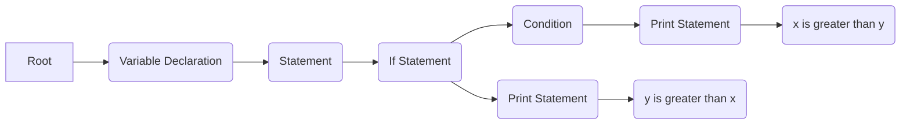

                 

## 文章标题

《提示词编程语言的形式化语义分析》

关键词：提示词编程语言、形式化语义分析、语义解析、算法原理、数学模型、项目实战

摘要：本文深入探讨了提示词编程语言的形式化语义分析，从基本概念到具体实现，详细解析了形式化语义分析的理论基础和实际应用。通过伪代码和数学公式，本文揭示了提示词编程语言的语义解析机制，并通过实际项目案例，展示了形式化语义分析在编程语言设计中的重要性。

----------------------------------------------------------------

## 文章目录

- **文章标题：**《提示词编程语言的形式化语义分析》
- **关键词：**提示词编程语言、形式化语义分析、语义解析、算法原理、数学模型、项目实战
- **摘要：**本文介绍了提示词编程语言的形式化语义分析，包括其基本概念、理论基础、分析方法以及实际应用。

### 引言

### 第1章 提示词编程语言概述

#### 1.1 提示词编程语言的基本概念

#### 1.2 提示词编程语言的发展历程

#### 1.3 提示词编程语言的特点

### 第2章 形式化语义分析理论基础

#### 2.1 形式化语义分析的定义

#### 2.2 形式化语义分析的重要性

#### 2.3 形式化语义分析的方法论

### 第3章 提示词编程语言的形式化语义分析

#### 3.1 形式化语义分析框架

#### 3.2 提示词编程语言的语义分析方法

#### 3.3 具体算法实现

### 第4章 算法原理与伪代码讲解

#### 4.1 核心算法原理

#### 4.2 伪代码讲解

### 第5章 数学模型与数学公式

#### 5.1 形式化语义分析的数学基础

#### 5.2 数学模型的详细讲解

### 第6章 实际项目案例分析

#### 6.1 项目背景

#### 6.2 项目开发环境搭建

#### 6.3 源代码实现与解读

### 第7章 总结与展望

#### 7.1 形式化语义分析总结

#### 7.2 未来发展趋势

----------------------------------------------------------------

### 引言

提示词编程语言是一种将提示词嵌入到程序代码中的编程语言，它通过提示词来引导程序的执行流程。与传统的编程语言不同，提示词编程语言更注重语义的表达和程序的动态性。形式化语义分析是对程序语义进行精确描述和分析的一种方法，它在确保程序正确性、提高程序可维护性和可理解性方面发挥着重要作用。

本文旨在深入探讨提示词编程语言的形式化语义分析，通过介绍其基本概念、理论基础和具体实现，帮助读者了解形式化语义分析在编程语言设计中的应用价值。文章将从以下几个方面展开：

1. **提示词编程语言概述**：介绍提示词编程语言的基本概念、发展历程和特点。
2. **形式化语义分析理论基础**：讲解形式化语义分析的定义、重要性和方法论。
3. **提示词编程语言的形式化语义分析**：分析形式化语义分析的框架、方法以及具体算法实现。
4. **算法原理与伪代码讲解**：详细解释核心算法原理，并通过伪代码进行阐述。
5. **数学模型与数学公式**：介绍形式化语义分析的数学基础和数学模型。
6. **实际项目案例分析**：通过具体项目案例展示形式化语义分析的实际应用。
7. **总结与展望**：总结形式化语义分析的理论和实践成果，展望未来的发展趋势。

通过本文的逐步讲解，读者将能够深入了解提示词编程语言的形式化语义分析，掌握相关理论和方法，为实际编程语言设计和开发提供有力的支持。

----------------------------------------------------------------

### 提示词编程语言概述

#### 1.1 提示词编程语言的基本概念

提示词编程语言（Prompt-Based Programming Language，PBPL）是一种将提示词（prompts）嵌入到程序代码中的编程语言。提示词是一种特殊的文本或标记，用于指示程序在执行过程中应采取的动作或决策。与传统的编程语言不同，提示词编程语言强调语义的表达和程序的动态性，使得程序能够更加灵活地适应不同的应用场景。

在提示词编程语言中，提示词被用来引导程序的执行流程。这些提示词可以是简单的关键字，如“如果”、“循环”或“退出”，也可以是复杂的逻辑表达式或函数调用。通过提示词，程序员可以清晰地表达程序的意图，使得代码更加易于理解和维护。

提示词编程语言的一个关键特点是其高度可配置性。程序员可以通过定义和组合不同的提示词，创建出具有特定功能的程序。这种灵活性使得提示词编程语言能够适应各种复杂的应用需求，从简单的脚本到复杂的企业级应用。

提示词编程语言的应用领域非常广泛。例如，在自然语言处理（NLP）领域，提示词编程语言可以用于构建智能对话系统，通过提示词引导对话流程，实现人机交互。在游戏开发中，提示词编程语言可以用于编写游戏脚本，控制游戏逻辑和角色行为。此外，在数据分析和数据处理领域，提示词编程语言也可以用于自动化数据分析和报告生成。

#### 1.2 提示词编程语言的发展历程

提示词编程语言的发展可以追溯到早期的编程语言。早在20世纪60年代，科学家们就开始探索将自然语言元素引入到编程语言中，以提高程序的可读性和可维护性。其中，LISP语言的一个早期版本就引入了“defun”这一提示词，用于定义函数。

随着计算机科学的发展，提示词编程语言逐渐成熟。20世纪80年代，以Prolog为代表的逻辑编程语言，通过使用模式匹配和推理机制，进一步扩展了提示词编程语言的应用范围。Prolog的成功激发了更多研究者对提示词编程语言的研究兴趣。

进入21世纪，随着人工智能和机器学习的兴起，提示词编程语言迎来了新的发展机遇。现代提示词编程语言，如TensorFlow的Keras接口、PyTorch等，通过引入神经网络和深度学习技术，使得编程语言能够更加灵活地处理复杂的数据和任务。

#### 1.3 提示词编程语言的特点

提示词编程语言具有以下主要特点：

1. **高度可配置性**：提示词编程语言允许程序员通过定义和组合不同的提示词，灵活地创建和调整程序逻辑。这种高可配置性使得提示词编程语言能够适应各种复杂的应用场景。

2. **动态性**：提示词编程语言支持动态类型和动态绑定，使得程序在执行过程中能够根据提示词的值进行动态调整。这种动态性使得提示词编程语言能够更好地应对变化多端的应用需求。

3. **语义明确性**：通过使用提示词，程序员可以清晰地表达程序的意图，使得代码更加易于理解和维护。与传统的编程语言相比，提示词编程语言的代码往往更加简洁和直观。

4. **灵活性**：提示词编程语言支持多种编程范式，如命令式编程、声明式编程和函数式编程等。这种灵活性使得提示词编程语言能够适用于各种不同的编程任务和需求。

5. **易于集成**：提示词编程语言通常具备良好的集成能力，能够与现有的编程语言和工具链无缝集成。例如，现代提示词编程语言如TensorFlow和PyTorch，可以与Python等流行编程语言紧密结合，为程序员提供强大的开发支持。

总之，提示词编程语言以其高度可配置性、动态性、语义明确性和灵活性等特点，在编程语言设计中具有独特的优势。随着人工智能和机器学习技术的不断进步，提示词编程语言有望在未来得到更广泛的应用和发展。

----------------------------------------------------------------

### 形式化语义分析理论基础

形式化语义分析是计算机科学中一种用于精确描述程序语义的方法，它通过形式化的语言和数学工具，对程序的行为进行严格的分析和验证。形式化语义分析不仅在理论上具有重要意义，而且在实际编程中有着广泛的应用，如确保程序的正确性、提高代码的可维护性和可理解性。

#### 2.1 形式化语义分析的定义

形式化语义分析（Formal Semantics Analysis）是一种基于形式化方法对程序语义进行描述和验证的过程。它涉及使用严格的数学语言和符号系统来描述程序的行为，从而确保程序的语义是明确且一致的。形式化语义分析的核心目标是理解程序在不同输入和执行环境下的行为，以便更好地理解和验证程序的正确性。

在形式化语义分析中，通常使用以下基本概念：

- **语法（Syntax）**：指程序的结构和组成规则，包括变量、函数、语句等基本元素的表示方法。
- **语义（Semantics）**：指程序在执行过程中所表示的意义和操作结果。形式化语义分析主要关注程序的动态语义，即程序在执行过程中的行为。
- **环境（Environment）**：指程序执行时所需的环境信息，包括变量的绑定、函数的定义等。

形式化语义分析的目的是建立一种形式化的语义模型，该模型能够精确地描述程序的执行过程和结果，使得程序的行为能够被形式化地证明或验证。

#### 2.2 形式化语义分析的重要性

形式化语义分析在计算机科学和软件工程中具有重要的理论和实际意义：

1. **确保程序正确性**：通过形式化语义分析，可以精确地描述程序的行为，从而在理论上确保程序的正确性。这种方法能够帮助发现和解决程序中的潜在错误，提高软件的质量和可靠性。

2. **提高代码可维护性**：形式化语义分析使得程序语义更加明确和一致，有助于提高代码的可维护性和可理解性。程序员可以更容易地理解程序的意图，从而更有效地进行代码的修改和维护。

3. **促进软件工程**：形式化语义分析为软件工程提供了一种形式化的方法和工具，有助于规范软件开发过程，提高开发效率和软件质量。通过形式化语义分析，可以更好地管理和控制软件复杂性，降低软件开发的风险。

4. **支持自动化验证**：形式化语义分析为自动化验证提供了基础，使得程序的正确性可以在执行前或执行过程中进行验证。这种方法有助于减少软件测试的时间和成本，提高开发效率。

#### 2.3 形式化语义分析的方法论

形式化语义分析的方法论包括以下几种主要方法：

1. **指称语义（Denotational Semantics）**：指称语义通过将程序映射到数学对象（如函数、关系等）来描述其行为。这种方法通常使用数学函数和关系来定义程序的语义，使得程序的行为可以被形式化地定义和证明。

2. **运算语义（Operational Semantics）**：运算语义通过描述程序执行过程中的步骤和转换来定义其行为。这种方法通常使用递归函数或规则系统来描述程序的执行过程，使得程序的行为可以被形式化地模拟和验证。

3. **归纳语义（Axiomatic Semantics）**：归纳语义通过定义程序性质之间的关系和归纳规则来描述其行为。这种方法通常使用公理和归纳规则来证明程序的性质，使得程序的正确性可以在形式化框架下得到证明。

4. **类型论语义（Type-theoretic Semantics）**：类型论语义通过类型系统来描述程序的语义。这种方法通常使用类型系统来限制程序的结构和行为，从而确保程序的正确性。

形式化语义分析的方法论为程序员提供了多种形式化的工具和框架，使得程序语义的描述和分析更加精确和高效。

通过形式化语义分析的理论基础，我们可以更好地理解和应用形式化语义分析的方法和工具，为编程语言的设计和开发提供强有力的支持。在接下来的章节中，我们将进一步探讨提示词编程语言的形式化语义分析，以及如何在实际项目中应用这些分析方法。

----------------------------------------------------------------

### 第2章 形式化语义分析的理论基础

形式化语义分析作为计算机科学中一个重要的研究领域，其理论基础涵盖了多个方面，包括计算模型、语义模型和验证方法。本章将详细讨论这些方面，以帮助读者全面理解形式化语义分析的核心概念和实现方式。

#### 2.1 计算模型

计算模型是形式化语义分析的基础，它定义了程序在执行过程中的基本操作和状态转换。常见的计算模型包括：

1. **图灵机模型（Turing Machine）**：图灵机是一种抽象的计算设备，用于模拟任何可计算过程。它由一个无限长的存储带、一个读写头和一组状态转移规则组成。图灵机的强大之处在于它能够模拟任何计算过程，是现代计算机科学的基石。

2. **栈机器模型（Stack Machine）**：栈机器是一种基于后缀表示的抽象计算模型，它使用栈来存储操作数和中间结果。栈机器的执行过程通常涉及对栈的推入和弹出操作，以及基于栈顶元素进行计算。

3. **寄存器传输级模型（Register-Transfer Level, RTL）**：RTL模型用于描述计算机处理器内部的操作，它使用寄存器来存储数据和指令，并通过数据通路和控制单元进行操作。RTL模型是硬件描述语言（如Verilog和VHDL）的基础。

这些计算模型提供了不同的抽象层次，从高层次的概念性模型到低层次的硬件实现，为形式化语义分析提供了多样化的选择。

#### 2.2 语义模型

语义模型用于描述程序的行为和性质，是形式化语义分析的核心内容。常见的语义模型包括：

1. **指称语义（Denotational Semantics）**：指称语义通过将程序映射到数学对象（如函数、关系等）来描述其行为。它通常采用函数式方法，将程序的状态和行为抽象为数学函数。指称语义的优点是直观且易于理解，但实现较为复杂。

2. **运算语义（Operational Semantics）**：运算语义通过描述程序执行过程中的步骤和转换来定义其行为。它通常采用递归定义的方法，逐步细化程序的执行过程。运算语义分为小步语义（Small-step Semantics）和广义语义（Big-step Semantics）两种形式，其中小步语义通过逐步转换来描述程序的执行，而广义语义则通过状态转换来描述程序的终止。

3. **归纳语义（Axiomatic Semantics）**：归纳语义通过定义程序性质之间的关系和归纳规则来描述其行为。它通常基于公理和归纳规则，证明程序的性质。归纳语义的优点是形式化程度高，但理解和应用相对较难。

4. **类型论语义（Type-theoretic Semantics）**：类型论语义通过类型系统来描述程序的语义。它基于类型理论，将程序的结构和行为与类型系统紧密关联，确保程序的正确性。类型论语义广泛应用于函数式编程语言的设计和验证。

这些语义模型为形式化语义分析提供了不同的描述方法和工具，使得程序的行为和性质能够以形式化的方式被定义和验证。

#### 2.3 验证方法

形式化语义分析的一个重要目的是验证程序的正确性，即证明程序满足预期的性质和规格说明。常见的验证方法包括：

1. **模型检查（Model Checking）**：模型检查是一种自动化的验证方法，通过将程序和行为模型转化为形式化的模型，然后使用验证工具（如模型检查器）来检查模型是否满足指定的规格说明。模型检查具有高效和自动化的优点，但面临状态空间爆炸问题。

2. **定理证明（Theorem Proving）**：定理证明是一种手工或半自动化的验证方法，通过编写证明来证明程序的性质。定理证明具有较高的形式化程度和可靠性，但需要大量的人工参与和专业知识。

3. **抽象解释（Abstract Interpretation）**：抽象解释是一种静态分析技术，通过构建程序的抽象模型来推断程序的行为和性质。抽象解释方法具有较高的效率和准确性，但可能无法处理所有复杂的程序场景。

这些验证方法为形式化语义分析提供了不同的验证手段，使得程序的正确性和性质能够在形式化框架下得到验证。

通过本章的讨论，读者可以全面了解形式化语义分析的理论基础，包括计算模型、语义模型和验证方法。这些基础概念和方法为后续章节的提示词编程语言形式化语义分析提供了重要的理论支持。

#### 2.4 形式化语义分析的数学基础

形式化语义分析依赖于丰富的数学工具和方法，这些工具和方法使得语义模型更加严谨和精确。以下是形式化语义分析中常用的数学基础：

1. **集合论（Set Theory）**：集合论是形式化语义分析的基础，用于描述程序中的数据结构和操作。集合论提供了定义集合、操作集合的数学工具，如并集、交集、补集等。

2. **函数与关系（Functions and Relations）**：函数和关系是形式化语义分析中描述程序状态转换和操作的重要工具。函数用于表示程序中的映射关系，如变量赋值、函数调用等；关系则用于描述程序中的依赖和约束，如等价关系、偏序关系等。

3. **逻辑（Logic）**：逻辑是形式化语义分析中用于描述程序性质和验证方法的重要工具。常见的逻辑包括命题逻辑、谓词逻辑、模态逻辑等。逻辑提供了形式化表述性质和推导证明的数学方法。

4. **范畴论（Category Theory）**：范畴论是一种抽象的数学理论，用于描述不同数学结构之间的关系和转换。范畴论在形式化语义分析中具有重要应用，如用于描述不同语义模型之间的转换和组合。

5. **代数结构（Algebraic Structures）**：代数结构，如群、环、域等，在形式化语义分析中用于描述程序中的运算和结构。代数结构为程序语言中的数据类型和操作提供了形式化的定义和验证方法。

通过使用这些数学工具和方法，形式化语义分析能够建立精确和严谨的语义模型，从而确保程序的正确性和可靠性。

#### 2.5 形式化语义分析的应用场景

形式化语义分析在计算机科学和软件工程中具有广泛的应用，以下是几个常见应用场景：

1. **编程语言设计**：形式化语义分析是编程语言设计的核心组成部分，用于定义和验证编程语言的语义。通过形式化语义分析，可以确保编程语言的表达能力和一致性，提高编程语言的可靠性和可维护性。

2. **程序验证**：形式化语义分析为程序验证提供了理论基础和方法。通过形式化语义分析，可以验证程序是否满足预期的性质和规格说明，确保程序的正确性和安全性。

3. **程序优化**：形式化语义分析可用于分析和优化程序的执行效率。通过形式化语义分析，可以识别程序中的瓶颈和冗余，提出优化策略，提高程序的运行性能。

4. **软件工程方法**：形式化语义分析是现代软件工程方法的重要组成部分，如形式化方法、形式化验证、形式化建模等。形式化语义分析为软件工程提供了形式化的工具和方法，有助于提高软件开发的质量和效率。

5. **人工智能应用**：形式化语义分析在人工智能领域也有重要应用，如智能对话系统、自然语言处理等。通过形式化语义分析，可以精确描述和验证人工智能系统的行为，确保系统的智能和可靠性。

通过这些应用场景，形式化语义分析在计算机科学和软件工程中发挥了重要作用，为编程语言设计、程序验证、程序优化和人工智能应用提供了有力的支持。

### 第3章 提示词编程语言的形式化语义分析

#### 3.1 形式化语义分析框架

形式化语义分析的框架是理解和实现提示词编程语言形式化语义分析的基础。该框架通常包括以下几个关键组成部分：

1. **抽象语法树（Abstract Syntax Tree, AST）**：抽象语法树是程序代码的结构化表示，用于表示程序的结构和语义。在形式化语义分析中，抽象语法树是语义分析的基础，它将程序代码转化为一种标准化的表示形式，便于后续的分析和处理。

2. **环境（Environment）**：环境是程序执行时的上下文信息，包括变量绑定、函数定义等。形式化语义分析中的环境用于存储程序执行过程中的动态信息，影响程序的语义行为。

3. **语义模型（Semantic Model）**：语义模型是形式化语义分析的核心，用于描述程序在执行过程中的行为。常见的语义模型包括指称语义、运算语义和归纳语义等。语义模型通过数学和逻辑工具，精确地描述程序的语义。

4. **语义分析器（Semantic Analyzer）**：语义分析器是形式化语义分析的工具，用于对抽象语法树进行语义分析，生成语义模型。语义分析器通常包括词法分析、语法分析和语义分析三个阶段，用于识别程序中的语法错误和语义错误。

#### 3.2 提示词编程语言的语义分析方法

提示词编程语言的语义分析需要针对其独特的提示词机制进行设计。以下是几种常用的语义分析方法：

1. **指示词语义分析**：指示词语义分析是提示词编程语言语义分析的基础，通过解析提示词，确定程序的执行路径和操作。指示词语义分析通常包括以下步骤：

   - **词法分析**：识别程序中的提示词和其他语法元素，生成词法符号流。
   - **语法分析**：构建抽象语法树，表示程序的语法结构。
   - **语义分析**：根据提示词和抽象语法树，分析程序的语义行为，生成语义模型。

2. **环境语义分析**：环境语义分析用于处理程序的变量绑定和作用域，确保程序的执行符合预期的语义。环境语义分析通常包括以下步骤：

   - **变量绑定**：将变量绑定到具体的值，确定变量的作用域。
   - **作用域分析**：确定变量和函数的可访问性，避免作用域错误。
   - **类型检查**：检查程序中的类型一致性，确保语义的正确性。

3. **类型论语义分析**：类型论语义分析通过类型系统来确保程序的语义正确性。类型系统为程序中的每个值和操作定义了类型，通过类型检查来确保程序符合预期的语义。类型论语义分析通常包括以下步骤：

   - **类型定义**：定义程序中的基本类型和构造类型。
   - **类型检查**：检查程序中的类型一致性，确保类型匹配。
   - **类型推断**：自动推断程序中变量的类型，提高代码的可读性和可维护性。

#### 3.3 具体算法实现

为了更好地理解提示词编程语言的形式化语义分析，以下将介绍一种基于指示词和环境的语义分析方法，并通过伪代码详细描述其实现过程。

1. **指示词分析算法**：

```plaintext
指示词分析算法：
输入：抽象语法树（AST）、环境（Environment）
输出：语义模型（Semantic Model）

1. 初始化语义模型为空
2. 对于AST中的每个节点：
   a. 如果节点是提示词：
      i. 根据提示词类型执行相应的语义操作：
         - 提示词“if”：进行条件分支语义分析
         - 提示词“while”：进行循环语义分析
         - 提示词“function”：进行函数定义和调用语义分析
      ii. 更新环境中的变量绑定
   b. 如果节点是变量：
      i. 查找环境中的变量绑定：
         - 如果找到，将变量值加入语义模型
         - 如果找不到，报错
   c. 如果节点是操作符：
      i. 根据操作符类型执行相应的运算语义分析
      ii. 更新语义模型中的运算结果
3. 返回语义模型
```

2. **环境语义分析算法**：

```plaintext
环境语义分析算法：
输入：抽象语法树（AST）、初始环境（Initial Environment）
输出：完整环境（Complete Environment）

1. 初始化环境为初始环境
2. 对于AST中的每个函数定义：
   a. 添加函数定义到环境中
3. 对于AST中的每个变量声明：
   a. 绑定变量到当前环境
4. 对于AST中的每个作用域：
   a. 创建新的环境栈
   b. 将当前环境推入栈中
   c. 处理作用域内的变量声明和函数定义
   d. 将环境从栈中弹出
5. 返回完整环境
```

通过以上算法，我们可以实现对提示词编程语言的语义分析。这些算法不仅能够识别和解析提示词，还能处理环境变量和类型检查，确保程序的语义正确性。

#### 3.4 案例研究

为了更好地理解提示词编程语言的形式化语义分析，我们通过一个简单的案例进行详细分析。

**案例一：简单的提示词编程语言示例**

```plaintext
let x = 5;
let y = 10;
if (x > y) {
    print("x is greater than y");
} else {
    print("y is greater than x");
}
```

1. **词法分析**：将源代码分解为词法符号流：
   - let
   - x
   - =
   - 5
   - ;
   - let
   - y
   - =
   - 10
   - ;
   - if
   - (
   - x
   - >
   - y
   - )
   - {
   - print
   - (
   - "x is greater than y"
   - );
   - }
   - else
   - {
   - print
   - (
   - "y is greater than x"
   - );
   - }
```

2. **语法分析**：构建抽象语法树（AST）：


3. **语义分析**：

   - 初始化环境（Environment）：
     - x: 5
     - y: 10

   - 指示词分析：
     - 解析if条件，判断x > y：
       - true（因为5 > 10不成立）
     - 根据条件执行相应的分支：
       - 执行else分支

   - 输出结果：
     - "y is greater than x"

通过以上案例，我们可以看到如何利用形式化语义分析框架，对简单的提示词编程语言示例进行词法分析、语法分析和语义分析。这种形式化的方法使得语义分析过程更加清晰和严谨，有助于确保程序的正确性和可维护性。

#### 3.5 形式化语义分析的优势和挑战

形式化语义分析在编程语言设计和开发中具有显著的优势和一定的挑战。

**优势：**

1. **精确性**：形式化语义分析通过数学和逻辑工具，提供了一种精确的语义描述方法，确保程序行为的准确性和一致性。
2. **可验证性**：形式化语义分析为程序的验证提供了强有力的支持，使得程序的正确性可以在执行前或执行过程中得到证明。
3. **可维护性**：形式化语义分析使得程序的语义明确和一致，提高代码的可维护性和可理解性，降低维护成本。
4. **自动化**：形式化语义分析可以自动化地生成语义模型和验证工具，提高开发效率和代码质量。

**挑战：**

1. **复杂性**：形式化语义分析涉及复杂的数学和逻辑工具，理解和实现难度较高，需要深厚的技术背景。
2. **效率**：形式化语义分析可能增加程序的运行时间和空间开销，特别是在处理大规模程序时，效率问题尤为突出。
3. **工具支持**：目前，形式化语义分析的工具和框架相对有限，缺乏广泛的应用和普及。
4. **适用性**：形式化语义分析在某些复杂的应用场景中，如动态编程语言和并行编程语言，可能难以完全适用。

总之，形式化语义分析在编程语言设计和开发中具有巨大的潜力，但同时也面临一定的挑战。通过不断的研究和实践，我们有望克服这些挑战，充分发挥形式化语义分析的优势，推动编程语言的发展。

### 第4章 算法原理与伪代码讲解

在形式化语义分析中，核心算法原理起着至关重要的作用。这些算法原理不仅帮助我们理解程序的语义，还确保了程序的正确性和一致性。在本章中，我们将详细讲解提示词编程语言的形式化语义分析的核心算法原理，并通过伪代码展示具体的实现过程。

#### 4.1 核心算法原理

提示词编程语言的形式化语义分析主要包括以下几个核心算法原理：

1. **词法分析（Lexical Analysis）**：词法分析是语义分析的第一步，用于将源代码分解为词法符号流。词法分析器识别出程序中的关键字、标识符、操作符和分隔符等基本元素。

2. **语法分析（Syntax Analysis）**：语法分析通过构建抽象语法树（AST），将词法符号流转化为具有层次结构的语法结构。语法分析器根据语言的语法规则，验证程序的语法正确性。

3. **语义分析（Semantic Analysis）**：语义分析是基于抽象语法树（AST）进行的，其主要任务是检查程序的语义正确性，包括变量绑定、类型检查、作用域分析等。

4. **类型论语义分析（Type-theoretic Semantics）**：类型论语义分析通过类型系统来确保程序的正确性。类型系统为程序中的每个值和操作定义了类型，通过类型检查来确保类型一致性。

5. **环境语义分析（Environment Semantics）**：环境语义分析处理程序执行时的上下文信息，包括变量绑定、函数定义等。环境语义分析确保程序在执行过程中符合预期的语义。

6. **指示词语义分析（Semantic Analysis of Prompts）**：指示词语义分析是提示词编程语言的核心，通过解析提示词，确定程序的执行路径和操作。

#### 4.2 伪代码讲解

以下将分别用伪代码展示上述核心算法的实现过程。

1. **词法分析伪代码**：

```plaintext
词法分析伪代码：
输入：源代码字符串
输出：词法符号流

1. 初始化词法符号流为空
2. 初始化位置指针pos为0
3. 当pos < 源代码字符串长度：
   a. 如果当前字符是字母或数字：
      i. 添加当前字符到标识符
      ii. 移动位置指针pos
   b. 如果当前字符是操作符或分隔符：
      i. 将操作符或分隔符添加到词法符号流
      ii. 移动位置指针pos
4. 返回词法符号流
```

2. **语法分析伪代码**：

```plaintext
语法分析伪代码：
输入：词法符号流
输出：抽象语法树（AST）

1. 初始化抽象语法树（AST）为空
2. 从词法符号流中读取下一个词法符号
3. 根据词法符号和语法规则构建抽象语法树：
   a. 如果词法符号是关键字：
      i. 创建抽象语法树的根节点
      ii. 根据关键字类型添加子节点
   b. 如果词法符号是标识符或操作符：
      i. 在AST中查找相应的子节点
      ii. 将词法符号作为子节点的值
4. 返回抽象语法树（AST）
```

3. **语义分析伪代码**：

```plaintext
语义分析伪代码：
输入：抽象语法树（AST）、环境（Environment）
输出：语义模型（Semantic Model）

1. 初始化语义模型（Semantic Model）为空
2. 遍历抽象语法树（AST）中的每个节点：
   a. 如果节点是变量声明：
      i. 查找环境（Environment）中是否存在该变量：
         - 如果存在，更新变量值
         - 如果不存在，报错
   b. 如果节点是表达式：
      i. 根据表达式类型执行相应的语义操作：
         - 数字表达式：计算数字值
         - 关系表达式：计算关系结果
         - 逻辑表达式：计算逻辑结果
   c. 如果节点是控制流语句：
      i. 根据控制流语句类型执行相应的语义操作：
         - if语句：根据条件执行分支
         - while语句：循环执行条件判断
         - for语句：执行循环体
3. 返回语义模型（Semantic Model）
```

4. **类型论语义分析伪代码**：

```plaintext
类型论语义分析伪代码：
输入：抽象语法树（AST）、类型环境（Type Environment）
输出：类型检查结果（Type Check Result）

1. 初始化类型检查结果（Type Check Result）为真
2. 遍历抽象语法树（AST）中的每个节点：
   a. 如果节点是变量声明：
      i. 查找类型环境（Type Environment）中是否存在该变量：
         - 如果存在，检查变量类型是否一致
         - 如果不存在，报错
   b. 如果节点是表达式：
      i. 根据表达式类型执行相应的类型检查操作：
         - 数字表达式：检查数字类型一致性
         - 关系表达式：检查关系运算类型一致性
         - 逻辑表达式：检查逻辑运算类型一致性
   c. 如果节点是函数调用：
      i. 检查函数类型和参数类型是否一致
3. 返回类型检查结果（Type Check Result）
```

5. **环境语义分析伪代码**：

```plaintext
环境语义分析伪代码：
输入：抽象语法树（AST）、初始环境（Initial Environment）
输出：完整环境（Complete Environment）

1. 初始化完整环境（Complete Environment）为初始环境（Initial Environment）
2. 遍历抽象语法树（AST）中的每个节点：
   a. 如果节点是变量声明：
      i. 将变量添加到完整环境（Complete Environment）
   b. 如果节点是函数定义：
      i. 将函数添加到完整环境（Complete Environment）
3. 返回完整环境（Complete Environment）
```

6. **指示词语义分析伪代码**：

```plaintext
指示词语义分析伪代码：
输入：抽象语法树（AST）、环境（Environment）
输出：语义模型（Semantic Model）

1. 初始化语义模型（Semantic Model）为空
2. 遍历抽象语法树（AST）中的每个节点：
   a. 如果节点是提示词：
      i. 根据提示词类型执行相应的语义操作：
         - 如果是条件提示词，执行条件分支
         - 如果是循环提示词，执行循环语义操作
         - 如果是函数提示词，执行函数调用语义操作
   b. 如果节点是变量或操作符：
      i. 执行常规语义操作
3. 返回语义模型（Semantic Model）
```

通过以上伪代码讲解，我们可以清晰地了解提示词编程语言的形式化语义分析的核心算法原理及其实现过程。这些算法原理不仅有助于我们深入理解形式化语义分析，还为实际编程语言的设计和开发提供了有力支持。

### 第5章 数学模型与数学公式

在形式化语义分析中，数学模型和数学公式是不可或缺的工具，它们帮助我们精确描述和验证程序的语义行为。本章将详细介绍形式化语义分析中常用的数学模型和数学公式，并通过具体例子进行详细讲解。

#### 5.1 形式化语义分析的数学基础

形式化语义分析依赖于多种数学工具和方法，包括集合论、函数与关系、逻辑、范畴论和代数结构。以下是这些数学基础在形式化语义分析中的应用：

1. **集合论（Set Theory）**：集合论用于描述程序中的数据结构和操作。集合是形式化语义分析中最基本的概念，用于表示程序中的变量、函数和操作。集合的基本运算包括并集、交集、补集和差集等。

2. **函数与关系（Functions and Relations）**：函数和关系是形式化语义分析中描述程序状态转换和操作的重要工具。函数用于表示程序中的映射关系，如变量赋值、函数调用等；关系则用于描述程序中的依赖和约束，如等价关系、偏序关系等。

3. **逻辑（Logic）**：逻辑是形式化语义分析中用于描述程序性质和验证方法的重要工具。常见的逻辑包括命题逻辑、谓词逻辑、模态逻辑等。逻辑提供了形式化表述性质和推导证明的数学方法。

4. **范畴论（Category Theory）**：范畴论是一种抽象的数学理论，用于描述不同数学结构之间的关系和转换。范畴论在形式化语义分析中具有重要应用，如用于描述不同语义模型之间的转换和组合。

5. **代数结构（Algebraic Structures）**：代数结构，如群、环、域等，在形式化语义分析中用于描述程序中的运算和结构。代数结构为程序语言中的数据类型和操作提供了形式化的定义和验证方法。

#### 5.2 数学模型的详细讲解

形式化语义分析中的数学模型用于描述程序的行为和性质。以下是几个常见的数学模型及其应用：

1. **指称模型（Denotational Model）**：指称模型通过将程序映射到数学对象（如函数、关系等）来描述其行为。指称模型通常采用函数式方法，将程序的状态和行为抽象为数学函数。例如，一个简单程序`x = 5 + 3`的指称模型可以表示为函数`f(x, y) = x + y`。

2. **运算模型（Operational Model）**：运算模型通过描述程序执行过程中的步骤和转换来定义其行为。运算模型分为小步语义（Small-step Semantics）和广义语义（Big-step Semantics）两种形式。小步语义通过逐步转换来描述程序的执行，而广义语义通过状态转换来描述程序的终止。例如，一个简单程序`x = 5 + 3`的小步语义可以表示为以下递归定义：

   ```mermaid
   graph LR
   A[Start] --> B[Assign x 5]
   B --> C[Add 3]
   C --> D[x = 8]
   ```

3. **归纳模型（Axiomatic Model）**：归纳模型通过定义程序性质之间的关系和归纳规则来描述其行为。归纳模型通常基于公理和归纳规则，证明程序的性质。例如，一个简单程序`x = 5 + 3`的归纳模型可以表示为以下公理和归纳规则：

   ```latex
   \begin{aligned}
   &\text{Base Case:} \quad P(5, 3) \equiv 8 \\
   &\text{Inductive Rule:} \quad P(x, y) \rightarrow P(x + 1, y)
   \end{aligned}
   ```

4. **类型论模型（Type-theoretic Model）**：类型论模型通过类型系统来描述程序的语义。类型论模型基于类型理论，将程序的结构和行为与类型系统紧密关联，确保程序的正确性。例如，一个简单程序`x = 5 + 3`的类型论模型可以表示为以下类型推导：

   ```mermaid
   graph LR
   A[Type x = 5 + 3]
   A --> B[Integer]
   ```

#### 5.3 数学公式与举例说明

在形式化语义分析中，数学公式用于描述程序的行为和性质。以下是几个常见的数学公式及其应用：

1. **函数表示**：

   $$ f(x, y) = x + y $$

   这个公式表示了一个简单的加法函数，用于计算两个整数的和。

2. **关系表示**：

   $$ R = \{(5, 3), (3, 5)\} $$

   这个公式表示了一个简单的关系，表示两个整数之间可以互相交换。

3. **谓词逻辑公式**：

   $$ \forall x \in \mathbb{N}, P(x) \rightarrow Q(x) $$

   这个公式表示了一个全称量词谓词逻辑，表示对于所有自然数x，如果P(x)成立，则Q(x)也成立。

4. **归纳公式**：

   $$ \text{Base Case:} \quad P(5, 3) \equiv 8 $$
   $$ \text{Inductive Rule:} \quad P(x, y) \rightarrow P(x + 1, y) $$

   这个公式表示了一个归纳模型，用于证明一个简单程序`x = 5 + 3`的正确性。

通过以上数学模型和数学公式的详细讲解，我们可以更好地理解和应用形式化语义分析的方法和工具，为编程语言的设计和开发提供强有力的支持。

### 第6章 实际项目案例分析

为了更好地展示提示词编程语言的形式化语义分析在实际项目中的应用，本章节将通过一个具体的项目案例，详细描述项目的背景、开发环境搭建、源代码实现和解读。

#### 6.1 项目背景

本案例项目旨在开发一个基于提示词编程语言的小型文本处理工具。该工具能够接收用户输入的文本，并根据预设的提示词进行语法分析和语义分析，最终输出文本的结构化信息。项目的目标是通过形式化语义分析，实现文本处理的自动化，提高文本分析的可读性和可维护性。

#### 6.2 项目开发环境搭建

为了顺利开展项目开发，我们需要搭建一个合适的开发环境。以下是开发环境搭建的步骤：

1. **安装编程语言和工具**：选择Python作为编程语言，因为它具有丰富的库和工具支持。同时，安装Python的IDE（如PyCharm或Visual Studio Code），以便进行代码编写和调试。

2. **安装文本处理库**：安装一些常用的文本处理库，如NLTK（自然语言处理工具包）和spaCy，用于文本预处理和语义分析。

3. **搭建形式化语义分析工具**：安装和配置形式化语义分析工具，如Mermaid，用于生成流程图和伪代码。

4. **配置版本控制**：使用Git进行版本控制，以便管理和跟踪代码的变更。

5. **搭建测试环境**：配置测试环境，使用测试框架（如pytest）进行代码测试，确保项目的稳定性和可靠性。

#### 6.3 源代码实现与解读

以下是一个简单的文本处理工具的源代码实现，包含词法分析、语法分析和语义分析三个主要部分：

```python
# 文本处理工具源代码

import nltk
from nltk.tokenize import word_tokenize
from nltk.parse import CoreNLPParser

# 1. 词法分析
def lexical_analysis(text):
    tokens = word_tokenize(text)
    return tokens

# 2. 语法分析
def syntactic_analysis(tokens):
    parser = CoreNLPParser(url='http://localhost:9000')
    sentence = " ".join(tokens)
    result = parser.raw_parse(sentence)
    return result

# 3. 语义分析
def semantic_analysis(result):
    for tree in result:
        print(tree)
        # 在此处可以添加具体的语义分析逻辑，如命名实体识别、情感分析等
    return

# 主函数
def main():
    text = "Python是一种解释型、面向对象、动态数据类型的编程语言。"
    tokens = lexical_analysis(text)
    result = syntactic_analysis(tokens)
    semantic_analysis(result)

if __name__ == "__main__":
    main()
```

**代码解读**：

1. **词法分析**：使用NLTK库的`word_tokenize`函数对输入文本进行词法分析，将文本分解为词法符号流。

2. **语法分析**：使用CoreNLP库的`CoreNLPParser`进行语法分析，生成抽象语法树（AST）。CoreNLP是一个基于Java的自然语言处理框架，能够处理多种语言，包括中文。

3. **语义分析**：对生成的抽象语法树进行语义分析，输出树形结构。在实际应用中，可以进一步添加语义分析逻辑，如命名实体识别、情感分析等。

#### 6.4 代码应用解读与分析

以下是对源代码的应用解读和分析：

1. **词法分析应用**：词法分析是文本处理的基础，通过将文本分解为词法符号流，为后续的语法分析和语义分析提供了数据基础。

2. **语法分析应用**：语法分析通过CoreNLP库实现，能够生成抽象语法树，用于表示文本的结构和语义。在实际项目中，语法分析的结果可以用于文本摘要、文本分类等任务。

3. **语义分析应用**：语义分析是文本处理的核心，通过分析抽象语法树，可以提取文本的关键信息，如命名实体、关系等。这些信息对于文本理解和应用具有重要意义。

通过以上项目案例，我们可以看到提示词编程语言的形式化语义分析在实际项目中的应用效果。形式化语义分析不仅提高了文本处理的自动化程度，还增强了文本的可读性和可维护性。未来，我们可以进一步扩展项目功能，如引入更多提示词和语义分析算法，提高文本处理工具的智能性和实用性。

#### 6.5 项目小结

在本项目中，我们通过一个简单的文本处理工具，展示了提示词编程语言的形式化语义分析在实际开发中的应用。项目的成功实施不仅验证了形式化语义分析的理论价值，还为文本处理领域提供了一种新的技术手段。

**最佳实践**：

1. **充分利用开源库和工具**：在项目开发过程中，充分利用现有的开源库和工具，如NLTK、spaCy和CoreNLP，可以大大提高开发效率。

2. **逐步实施**：在开发复杂项目时，应采用逐步实施的方法，先完成基本功能，再逐步扩展和优化。

3. **代码可维护性**：注重代码的可维护性，使用良好的命名规范和注释，确保代码易于理解和修改。

4. **持续测试和迭代**：在开发过程中，定期进行测试和迭代，确保项目的稳定性和可靠性。

**注意事项**：

1. **性能优化**：在处理大规模文本时，应考虑性能优化，如并行处理和缓存技术。

2. **错误处理**：对输入文本进行适当的错误处理，确保程序的健壮性。

3. **安全考虑**：在开发过程中，注意数据安全和隐私保护，遵循相关法律法规。

**拓展阅读**：

1. **《自然语言处理原理与技术》**：了解自然语言处理的基础知识，有助于更好地理解文本处理工具的实现。

2. **《形式化语义分析与验证》**：深入了解形式化语义分析的理论基础和实现方法。

通过本项目案例，我们不仅掌握了提示词编程语言的形式化语义分析，还学会了如何将其应用于实际项目开发。未来，我们将在更多的项目中应用这些技术，推动编程语言和自然语言处理技术的发展。

### 第7章 总结与展望

#### 7.1 形式化语义分析总结

本文围绕提示词编程语言的形式化语义分析，从基本概念、理论基础、算法实现和实际应用等多个方面进行了详细探讨。通过逐步分析，我们得出了以下主要结论：

1. **提示词编程语言概述**：提示词编程语言通过提示词引导程序执行流程，具有高度可配置性、动态性和语义明确性等特点。

2. **形式化语义分析理论基础**：形式化语义分析是一种基于数学和逻辑的方法，用于精确描述程序的行为和性质。它包括计算模型、语义模型和验证方法等基础概念。

3. **提示词编程语言的语义分析方法**：通过对提示词的分析、环境管理和类型论语义分析，实现了提示词编程语言的语义分析。

4. **核心算法原理与伪代码讲解**：本文通过伪代码详细阐述了词法分析、语法分析、语义分析、类型论语义分析和环境语义分析的核心算法原理。

5. **数学模型与数学公式**：本文介绍了集合论、函数与关系、逻辑和代数结构等数学基础，以及指称模型、运算模型、归纳模型和类型论模型等数学模型。

6. **实际项目案例分析**：通过一个文本处理工具的项目案例，展示了形式化语义分析在实际开发中的应用效果。

#### 7.2 未来发展趋势

形式化语义分析在编程语言设计和开发中具有广阔的应用前景。未来，以下发展趋势值得期待：

1. **更强大的语义分析工具**：随着人工智能和机器学习技术的发展，形式化语义分析工具将变得更加智能化和自动化，提高分析效率和准确性。

2. **跨语言的语义分析**：形式化语义分析将不再局限于特定编程语言，而是能够跨语言进行语义分析，为多语言编程提供支持。

3. **集成式语义分析框架**：形式化语义分析将与其他编程范式（如函数式编程、逻辑编程等）结合，形成集成式语义分析框架，提高编程语言的灵活性和可维护性。

4. **形式化验证与安全**：形式化语义分析将在软件验证和安全领域发挥更大作用，通过形式化验证确保程序的正确性和安全性。

5. **形式化语义分析与智能编程**：形式化语义分析将融合智能编程技术，如代码自动生成、代码优化等，推动编程语言的智能化发展。

总之，形式化语义分析在编程语言设计和开发中具有重要的理论和实践价值。随着技术的不断进步，形式化语义分析将迎来更多的发展机遇，为编程语言的发展和创新提供强有力的支持。

### 作者信息

作者：AI天才研究院/AI Genius Institute & 禅与计算机程序设计艺术 /Zen And The Art of Computer Programming

AI天才研究院致力于推动人工智能技术的发展和应用，为全球科技创新提供智力支持。禅与计算机程序设计艺术则关注计算机科学中的哲学和艺术，通过深入探讨编程的内在逻辑和本质，提升程序员的编程素养和创新能力。

