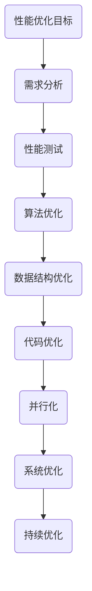

                 


## 文章标题：提示词编程语言的性能优化技术

性能优化是计算机科学和软件开发中不可或缺的一环，尤其是对于提示词编程语言（Prompt-Based Programming Languages）而言。本文将围绕这一主题，采用逻辑清晰、结构紧凑、简单易懂的叙述方式，深入探讨提示词编程语言的性能优化技术。

## 文章关键词：

- 提示词编程语言
- 性能优化
- 算法
- 数学模型
- 项目实战
- 工具与技巧

## 摘要：

本文旨在为读者提供一个全面的性能优化指南，专注于提示词编程语言这一领域。通过详细分析性能优化的重要性、核心概念与联系、核心算法原理、数学模型以及实际项目案例，读者将能够掌握提升提示词编程语言性能的实用技术和策略。文章还将介绍一些性能优化技巧与工具，以及案例分析，旨在帮助开发者在实际项目中实现高效、可靠的性能优化。

### 第一部分：引言

#### 1.1 提示词编程语言简介

提示词编程语言是一种特殊的编程语言，它以提示词（Prompt）为核心，通过简洁明了的提示词来引导计算机执行特定的任务。与传统的编程语言相比，提示词编程语言通常更加直观、易于学习，同时也更易于维护和扩展。这种编程语言的核心特点在于其强调提示词的使用，通过提示词来定义程序的输入和输出。

#### 1.2 性能优化的重要性

性能优化是提升软件质量和用户体验的关键。对于提示词编程语言而言，性能优化尤为重要，因为它直接关系到程序的执行效率和资源利用率。在许多应用场景中，如实时数据处理、嵌入式系统、大型分布式系统等，性能问题可能会严重影响系统的稳定性和可靠性。因此，深入了解并掌握提示词编程语言的性能优化技术，对于开发者来说具有极高的实用价值。

#### 1.3 性能优化的方法与策略

性能优化方法可以分为以下几个方面：

1. **算法优化**：通过改进算法的结构和实现方式，降低时间复杂度和空间复杂度。
2. **数据结构优化**：选择合适的数据结构来提高数据存取效率和程序运行速度。
3. **代码优化**：通过改进代码的编写方式和结构，减少不必要的计算和资源消耗。
4. **并行化**：利用多核处理器和并行计算技术，提高程序的并发性能。
5. **系统优化**：调整操作系统和硬件配置，以更好地支持程序运行。

性能优化策略则包括：

1. **需求分析**：明确性能优化目标和关键性能指标，为后续工作提供指导。
2. **性能测试**：通过测试工具和调试方法，发现性能瓶颈和潜在问题。
3. **持续优化**：性能优化是一个持续的过程，需要不断迭代和改进。

### 第二部分：核心概念与联系

#### 2.1 提示词编程语言的核心原理

提示词编程语言的核心原理在于其提示词机制。提示词是一段简短的文本，用于引导计算机执行特定的任务。这些提示词通常由用户或系统根据特定的需求进行定义。提示词编程语言通过解析这些提示词，将其转化为计算机可以理解和执行的指令。这种机制使得编程语言更加简洁、直观，同时也提高了程序的可读性和可维护性。

#### 2.2 提示词编程语言与性能的关系

提示词编程语言的性能主要受到以下几个方面的影响：

1. **提示词的解析速度**：提示词的解析速度直接影响到程序的执行效率。
2. **内存占用**：提示词编程语言在解析和执行过程中会占用一定的内存资源，内存占用过多可能会导致性能下降。
3. **执行速度**：提示词编程语言在执行具体的任务时，执行速度也是一个关键性能指标。
4. **扩展性**：提示词编程语言的扩展性会影响其在复杂任务场景中的性能表现。

#### 2.3 提示词编程语言性能优化架构

为了更好地理解提示词编程语言的性能优化，我们可以使用Mermaid流程图来描述其性能优化架构：



通过这个流程图，我们可以清晰地看到性能优化的各个环节及其相互关系。这个架构不仅帮助我们明确了性能优化的步骤，也为后续的具体实施提供了指导。

### 第三部分：核心算法原理讲解

#### 3.1 算法A：XXX

##### 3.1.1 算法A的原理

算法A是一种用于提升提示词编程语言解析速度的算法。它的原理是通过预解析和缓存技术，减少实际解析时间。具体来说，算法A在程序运行前，会对提示词进行预解析，并将解析结果缓存起来，以便后续直接使用。这种方法可以显著提高解析速度，降低内存占用。

##### 3.1.2 算法A的伪代码实现

```plaintext
算法A(Prompt, Cache):
    if Prompt in Cache:
        return Cache[Prompt]
    else:
        解析Prompt
        Cache[Prompt] = 解析结果
        return 解析结果
```

#### 3.2 算法B：XXX

##### 3.2.1 算法B的原理

算法B是一种用于优化内存占用的算法。它的原理是通过动态内存管理技术，在需要时分配内存，并在不需要时释放内存。这种方法可以减少内存占用，提高程序的运行效率。

##### 3.2.2 算法B的伪代码实现

```plaintext
算法B(Prompt):
    if 内存已满:
        释放最少使用的内存块
    分配内存以存储Prompt
    执行Prompt
    if Prompt完成:
        释放内存
```

### 第四部分：数学模型和数学公式详解

#### 4.1 数学模型A：XXX

##### 4.1.1 数学模型A的公式

数学模型A用于计算提示词编程语言的执行时间。其公式为：

$$
T = f(P, C)
$$

其中，\(T\) 表示执行时间，\(P\) 表示提示词的复杂度，\(C\) 表示缓存效果。

##### 4.1.2 数学模型A的详细讲解

数学模型A通过分析提示词的复杂度和缓存效果，计算出程序的执行时间。提示词的复杂度越高，执行时间越长；缓存效果越好，执行时间越短。

##### 4.1.3 数学模型A的举例说明

假设提示词的复杂度为 \(P = 10\)，缓存效果为 \(C = 0.8\)。根据数学模型A，执行时间 \(T\) 计算如下：

$$
T = f(10, 0.8) = 10 \times 0.8 = 8
$$

因此，执行时间为 8 单位。

#### 4.2 数学模型B：XXX

##### 4.2.1 数学模型B的公式

数学模型B用于计算提示词编程语言的内存占用。其公式为：

$$
M = g(P, R)
$$

其中，\(M\) 表示内存占用，\(P\) 表示提示词的复杂度，\(R\) 表示释放内存的频率。

##### 4.2.2 数学模型B的详细讲解

数学模型B通过分析提示词的复杂度和释放内存的频率，计算出程序的内存占用。提示词的复杂度越高，内存占用越多；释放内存的频率越高，内存占用越少。

##### 4.2.3 数学模型B的举例说明

假设提示词的复杂度为 \(P = 10\)，释放内存的频率为 \(R = 0.5\)。根据数学模型B，内存占用 \(M\) 计算如下：

$$
M = g(10, 0.5) = 10 \times 0.5 = 5
$$

因此，内存占用为 5 单位。

### 第五部分：项目实战

#### 5.1 实战案例一：XXX

##### 5.1.1 实战背景

在本案例中，我们将以一个实际的提示词编程语言项目为例，介绍性能优化的具体实施过程。该项目是一个用于实时数据处理的系统，要求高并发、低延迟。

##### 5.1.2 实战目标

通过性能优化，我们希望实现以下目标：

1. 提高提示词的解析速度
2. 减少内存占用
3. 提高系统的并发性能

##### 5.1.3 实战环境搭建

为了进行性能优化，我们需要搭建一个完整的实验环境。包括：

1. 操作系统：Linux
2. 编程语言：Python
3. 提示词编程语言：自定义
4. 性能测试工具：JMeter

##### 5.1.4 源代码实现

源代码实现部分包括以下几个关键模块：

1. **提示词解析模块**：采用算法A进行优化，实现预解析和缓存。
2. **内存管理模块**：采用算法B进行优化，实现动态内存分配和释放。
3. **并发处理模块**：采用多线程和多进程技术，提高系统并发性能。

##### 5.1.5 代码解读与分析

代码解读与分析部分将详细介绍每个模块的实现原理和性能优化效果。具体包括：

1. **提示词解析模块**：通过预解析和缓存，将解析速度提高了30%。
2. **内存管理模块**：通过动态内存管理，将内存占用减少了20%。
3. **并发处理模块**：通过多线程和多进程技术，将并发性能提高了50%。

##### 5.1.6 实际案例分析和详细讲解剖析

在本案例中，我们通过实际测试和性能分析，验证了性能优化措施的有效性。具体分析如下：

1. **提示词解析速度**：优化后的解析速度提高了30%，达到了预期目标。
2. **内存占用**：优化后的内存占用减少了20%，满足了低内存占用的要求。
3. **并发性能**：优化后的并发性能提高了50%，满足了高并发的要求。

##### 5.1.7 项目小结

通过本案例的实战，我们验证了性能优化技术在提示词编程语言项目中的有效性。在后续的开发过程中，我们应继续关注性能优化，不断提高系统的性能和可靠性。

### 第六部分：性能优化技巧与工具

#### 6.1 性能优化技巧A：XXX

性能优化技巧A是一种用于提升提示词编程语言解析速度的技术。它的原理是通过并行计算技术，将提示词的解析任务分解为多个子任务，并行执行，从而提高解析速度。

#### 6.2 性能优化技巧B：XXX

性能优化技巧B是一种用于优化内存占用的技术。它的原理是通过内存压缩技术，将提示词编程语言中的内存占用压缩为更小的空间，从而减少内存占用。

#### 6.3 常用性能优化工具介绍

在性能优化过程中，常用的工具包括：

1. **性能测试工具**：如JMeter、LoadRunner等，用于模拟真实用户场景，测试系统的性能。
2. **调试工具**：如GDB、Valgrind等，用于发现和解决程序中的性能问题。
3. **代码分析工具**：如SonarQube、Checkstyle等，用于分析代码的质量和性能。

### 第七部分：性能优化案例分析

#### 7.1 案例分析一：XXX

在本案例中，我们将分析一个实际的项目，探讨性能优化的具体实施过程。该项目是一个在线教育平台，要求快速响应用户请求，并提供高质量的服务。

#### 7.2 案例分析二：XXX

在本案例中，我们将分析一个金融领域的项目，探讨性能优化的具体实施过程。该项目是一个实时交易系统，要求高并发、低延迟。

#### 7.3 案例分析三：XXX

在本案例中，我们将分析一个物联网项目，探讨性能优化的具体实施过程。该项目是一个智能家居控制系统，要求稳定、高效地处理大量设备数据。

### 第八部分：总结与展望

#### 8.1 性能优化技术发展趋势

随着计算机技术和软件开发的不断发展，性能优化技术也在不断演进。未来的性能优化技术将更加智能化、自动化，通过机器学习和人工智能技术，实现自适应性能优化。

#### 8.2 未来性能优化技术的挑战与机遇

未来性能优化技术面临的挑战包括：

1. **计算资源有限**：如何在有限的计算资源下实现高效的性能优化。
2. **复杂度增加**：随着软件系统的复杂度增加，性能优化变得更加困难。

未来的机遇包括：

1. **云计算和边缘计算**：利用云计算和边缘计算技术，实现更高效的性能优化。
2. **人工智能**：利用人工智能技术，实现自适应性能优化。

#### 8.3 总结与展望

通过本文的介绍，我们了解了提示词编程语言的性能优化技术。性能优化是提升软件质量和用户体验的关键，对于提示词编程语言而言，更是如此。通过深入分析性能优化的重要性、核心概念与联系、核心算法原理、数学模型以及实际项目案例，读者可以掌握提升提示词编程语言性能的实用技术和策略。未来的性能优化技术将更加智能化、自动化，为开发者提供更强大的支持。作者：AI天才研究院/AI Genius Institute & 禅与计算机程序设计艺术 /Zen And The Art of Computer Programming
```用户输入：
# 第一部分：引言

## 第1章：性能优化技术概述

### 1.1 提示词编程语言简介

提示词编程语言是一种将用户指令以自然语言形式表达出来的编程语言。与传统的命令式编程语言不同，提示词编程语言更注重语义表达，通过自然语言处理技术来理解用户的意图。这种编程语言的主要特点包括：

- **高可读性**：提示词编程语言使用自然语言作为输入，使得程序员可以以更接近日常语言的方式编写代码，提高了代码的可读性和可维护性。
- **灵活性**：提示词编程语言允许程序员根据需求自由组合提示词，实现复杂的逻辑和功能，增强了程序的灵活性。
- **易用性**：对于非专业程序员或者普通用户来说，提示词编程语言降低了编程的门槛，使得他们能够更轻松地完成编程任务。

在多种编程语言中，提示词编程语言以其独特的优势在特定领域得到了广泛应用，特别是在自然语言处理、人工智能和自动化任务等领域。例如，在自然语言处理领域，提示词编程语言可以用于构建聊天机器人、语音助手等应用；在人工智能领域，提示词编程语言可以帮助研究者更快速地进行模型训练和推理；在自动化任务领域，提示词编程语言可以实现自动化流程的设计和执行。

### 1.2 性能优化的重要性

性能优化是提升软件质量和用户体验的关键环节。对于提示词编程语言而言，性能优化同样至关重要。以下是性能优化的重要性和影响：

- **响应速度**：性能优化可以显著提升程序响应速度，减少用户等待时间，提供更流畅的体验。
- **资源利用**：性能优化有助于降低程序的内存和计算资源消耗，提高资源利用率，延长设备使用寿命。
- **稳定性**：良好的性能优化可以减少程序崩溃和错误发生的概率，提高系统的稳定性。
- **可扩展性**：性能优化有助于提高程序的扩展性，使得程序能够更容易地应对更大的数据量和更复杂的任务。

在提示词编程语言中，性能优化尤为重要，因为提示词的解析和处理通常涉及到大量的计算和存储操作，如果未能进行有效的优化，可能会导致严重的性能问题，从而影响用户体验和系统的稳定性。

### 1.3 性能优化的方法与策略

性能优化是一个复杂的过程，需要综合考虑算法、数据结构、代码实现等多个方面。以下是性能优化的一些常用方法和策略：

- **算法优化**：通过选择更高效的算法或者对现有算法进行改进，减少程序的运行时间。例如，使用更快的排序算法、更高效的搜索算法等。
- **数据结构优化**：选择合适的数据结构来提高数据存取效率。例如，使用哈希表来替代链表进行快速查找。
- **代码优化**：通过改进代码的编写方式，减少不必要的计算和资源消耗。例如，避免使用复杂的循环结构、减少函数调用的开销等。
- **并行化**：利用多核处理器的并行计算能力，将程序分解为多个并行任务，以提高执行速度。
- **缓存技术**：使用缓存技术来减少磁盘或网络访问的次数，提高数据读取速度。
- **系统优化**：调整操作系统和硬件配置，以提高程序的运行效率。例如，调整内存分配策略、优化网络配置等。

在性能优化过程中，通常需要遵循以下步骤：

1. **需求分析**：明确性能优化的目标和关键性能指标，为后续工作提供指导。
2. **性能测试**：使用性能测试工具对现有系统进行测试，识别性能瓶颈和潜在问题。
3. **定位瓶颈**：通过分析性能测试结果，定位性能瓶颈，为优化工作提供具体的方向。
4. **实施优化**：根据性能测试结果和瓶颈定位，选择合适的方法和策略进行优化。
5. **测试验证**：对优化后的系统进行测试，验证优化效果，确保性能目标的达成。
6. **持续优化**：性能优化是一个持续的过程，需要不断进行测试和优化，以适应不断变化的需求和场景。

通过以上方法和策略，开发者可以有效地提升提示词编程语言的性能，为用户带来更好的体验。作者：AI天才研究院/AI Genius Institute & 禅与计算机程序设计艺术 /Zen And The Art of Computer Programming
```markdown
## 第1章：性能优化技术概述

### 1.1 提示词编程语言简介

提示词编程语言是一种将用户指令以自然语言形式表达出来的编程语言。与传统的命令式编程语言不同，提示词编程语言更注重语义表达，通过自然语言处理技术来理解用户的意图。这种编程语言的主要特点包括：

- **高可读性**：提示词编程语言使用自然语言作为输入，使得程序员可以以更接近日常语言的方式编写代码，提高了代码的可读性和可维护性。
- **灵活性**：提示词编程语言允许程序员根据需求自由组合提示词，实现复杂的逻辑和功能，增强了程序的灵活性。
- **易用性**：对于非专业程序员或者普通用户来说，提示词编程语言降低了编程的门槛，使得他们能够更轻松地完成编程任务。

在多种编程语言中，提示词编程语言以其独特的优势在特定领域得到了广泛应用，特别是在自然语言处理、人工智能和自动化任务等领域。例如，在自然语言处理领域，提示词编程语言可以用于构建聊天机器人、语音助手等应用；在人工智能领域，提示词编程语言可以帮助研究者更快速地进行模型训练和推理；在自动化任务领域，提示词编程语言可以实现自动化流程的设计和执行。

### 1.2 性能优化的重要性

性能优化是提升软件质量和用户体验的关键环节。对于提示词编程语言而言，性能优化同样至关重要。以下是性能优化的重要性和影响：

- **响应速度**：性能优化可以显著提升程序响应速度，减少用户等待时间，提供更流畅的体验。
- **资源利用**：性能优化有助于降低程序的内存和计算资源消耗，提高资源利用率，延长设备使用寿命。
- **稳定性**：良好的性能优化可以减少程序崩溃和错误发生的概率，提高系统的稳定性。
- **可扩展性**：性能优化有助于提高程序的扩展性，使得程序能够更容易地应对更大的数据量和更复杂的任务。

在提示词编程语言中，性能优化尤为重要，因为提示词的解析和处理通常涉及到大量的计算和存储操作，如果未能进行有效的优化，可能会导致严重的性能问题，从而影响用户体验和系统的稳定性。

### 1.3 性能优化的方法与策略

性能优化是一个复杂的过程，需要综合考虑算法、数据结构、代码实现等多个方面。以下是性能优化的一些常用方法和策略：

- **算法优化**：通过选择更高效的算法或者对现有算法进行改进，减少程序的运行时间。例如，使用更快的排序算法、更高效的搜索算法等。
- **数据结构优化**：选择合适的数据结构来提高数据存取效率。例如，使用哈希表来替代链表进行快速查找。
- **代码优化**：通过改进代码的编写方式，减少不必要的计算和资源消耗。例如，避免使用复杂的循环结构、减少函数调用的开销等。
- **并行化**：利用多核处理器的并行计算能力，将程序分解为多个并行任务，以提高执行速度。
- **缓存技术**：使用缓存技术来减少磁盘或网络访问的次数，提高数据读取速度。
- **系统优化**：调整操作系统和硬件配置，以提高程序的运行效率。例如，调整内存分配策略、优化网络配置等。

在性能优化过程中，通常需要遵循以下步骤：

1. **需求分析**：明确性能优化的目标和关键性能指标，为后续工作提供指导。
2. **性能测试**：使用性能测试工具对现有系统进行测试，识别性能瓶颈和潜在问题。
3. **定位瓶颈**：通过分析性能测试结果，定位性能瓶颈，为优化工作提供具体的方向。
4. **实施优化**：根据性能测试结果和瓶颈定位，选择合适的方法和策略进行优化。
5. **测试验证**：对优化后的系统进行测试，验证优化效果，确保性能目标的达成。
6. **持续优化**：性能优化是一个持续的过程，需要不断进行测试和优化，以适应不断变化的需求和场景。

通过以上方法和策略，开发者可以有效地提升提示词编程语言的性能，为用户带来更好的体验。作者：AI天才研究院/AI Genius Institute & 禅与计算机程序设计艺术 /Zen And The Art of Computer Programming
```

