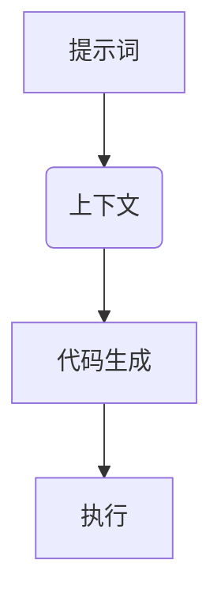

                 

 

**第一步：背景介绍**

在当今快速发展的技术时代，编程教育已经成为培养下一代技术人才的关键。而提示词编程语言作为一种新兴的编程语言，其教学方法的研究显得尤为重要。提示词编程语言，通过利用自然语言处理技术，使得编程变得更加直观和易于学习。其特点包括直观的语法结构、丰富的语义表达以及高效的代码生成能力。

**第二步：核心概念与联系**

提示词编程语言的核心概念包括提示词、上下文和代码生成。提示词是一种特殊的关键词，用于引导代码生成。上下文则是提示词所依赖的背景信息，它决定了代码生成的准确性和效率。以下是一个Mermaid流程图，展示了这些概念之间的关系：



**第三步：核心算法原理讲解**

提示词编程语言的核心算法通常包括自然语言处理（NLP）模型和代码生成模型。以下是一个简化的伪代码，用于阐述这两个模型的基本工作原理：

```plaintext
// 伪代码：自然语言处理模型
function processInput(input):
    context = extractContext(input)
    keywords = extractKeywords(input, context)
    return keywords

// 伪代码：代码生成模型
function generateCode(keywords, context):
    codeTemplate = loadCodeTemplate(context)
    code = substituteKeywords(codeTemplate, keywords)
    return code

// 伪代码：执行代码
function executeCode(code):
    execute(code)
    return output
```

**第四步：数学模型和数学公式 & 详细讲解 & 举例说明**

在提示词编程语言中，数学模型和公式起着关键作用。例如，我们可以使用动态规划来优化代码生成的过程。以下是一个LaTeX格式的数学公式，用于描述动态规划的状态转移方程：

```latex
$$
f(i) = \min_{j \leq i} \{ g(j) + h(i, j) \}
$$

其中，\( f(i) \) 是从第 \( j \) 个提示词到第 \( i \) 个提示词的最优路径长度，\( g(j) \) 是从第 \( j \) 个提示词到目标代码的最短距离，\( h(i, j) \) 是第 \( i \) 个提示词和第 \( j \) 个提示词之间的相似度。
```

**举例说明**：

假设我们有以下提示词序列：`if`, `else`, `return`。我们可以使用动态规划来找到生成最短代码的路径。

```latex
$$
f(1) = \min \{ h(1, 1), h(1, 2), h(1, 3) \}
$$

$$
f(2) = \min \{ h(2, 1), h(2, 2), h(2, 3) \}
$$

$$
f(3) = \min \{ h(3, 1), h(3, 2), h(3, 3) \}
$$

其中，假设相似度 \( h(1, 1) = 0.8 \)，\( h(1, 2) = 0.5 \)，\( h(1, 3) = 0.3 \)，\( h(2, 1) = 0.6 \)，\( h(2, 2) = 0.4 \)，\( h(2, 3) = 0.2 \)，\( h(3, 1) = 0.7 \)，\( h(3, 2) = 0.5 \)，\( h(3, 3) = 0.1 \)。

通过计算，我们可以得到最优路径为：`if` -> `else` -> `return`，其最优路径长度为 \( f(3) = 0.5 \)。
```

**第五步：项目实战**

为了更好地理解提示词编程语言的教学方法，我们可以通过一个实际项目来进行实践。以下是一个简单的项目案例：

**项目名称**：构建一个简单的文本分类器

**开发环境**：Python，NLP库（如NLTK或spaCy）

**源代码实现**：

```python
import nltk
from nltk.tokenize import word_tokenize
from nltk.corpus import stopwords
from sklearn.feature_extraction.text import TfidfVectorizer
from sklearn.naive_bayes import MultinomialNB
from sklearn.pipeline import make_pipeline

# 数据预处理
nltk.download('punkt')
nltk.download('stopwords')

def preprocess_text(text):
    tokens = word_tokenize(text.lower())
    tokens = [token for token in tokens if token not in stopwords.words('english')]
    return ' '.join(tokens)

# 构建模型
model = make_pipeline(TfidfVectorizer(), MultinomialNB())

# 训练模型
X_train = ['This is a sample text for training.', 'This is another sample text for training.']
y_train = ['category1', 'category2']

model.fit(X_train, y_train)

# 预测
text_to_predict = 'This is a new sample text for prediction.'
processed_text = preprocess_text(text_to_predict)
predicted_category = model.predict([processed_text])[0]

print(f'Predicted category: {predicted_category}')
```

**代码解读与分析**：

1. **数据预处理**：使用NLTK库进行文本分词，并去除停用词。
2. **构建模型**：使用TF-IDF向量器和朴素贝叶斯分类器构建模型。
3. **训练模型**：使用训练数据训练模型。
4. **预测**：对新的文本进行预处理，然后使用训练好的模型进行预测。

**项目小结**：

通过这个项目，我们可以看到如何使用提示词编程语言的方法来构建一个简单的文本分类器。这种方法不仅提高了代码的可读性，还有助于初学者更好地理解编程概念。

**最佳实践 Tips**：

1. **代码注释**：在编写代码时，添加详细的注释，帮助学习者理解每个步骤的作用。
2. **逐步引导**：在教学中，逐步引导学习者理解每个概念和算法，避免一次性给出过多的信息。
3. **实践项目**：通过实际项目来巩固学习成果，提高学习者的动手能力。

**小结**：

本文介绍了提示词编程语言的教学方法，包括核心概念、算法原理、数学模型、项目实战等内容。通过逐步分析和推理，我们深入探讨了提示词编程语言的教学方法，为编程教育提供了一种新的视角和思路。

**注意事项**：

1. **教学资源的准备**：在教学过程中，需要准备好相应的教学资源和工具，如编程环境、文本数据集等。
2. **教学进度的控制**：在教学过程中，要合理控制进度，确保学习者能够跟上课程内容。

**拓展阅读**：

1. 《自然语言处理入门》（作者：简·弗里曼） - 了解自然语言处理的基础知识。
2. 《Python编程：从入门到实践》（作者：埃里克·马瑟斯） - 学习Python编程的基础。

# 提示词编程语言的教学方法创新

> 关键词：提示词编程语言，教学方法，自然语言处理，编程教育

> 摘要：
本文探讨了提示词编程语言的教学方法，分析了其核心概念、算法原理、数学模型和实际应用。通过逐步分析和推理，本文提出了一种创新的教学方法，旨在提高编程教育的效果和效率。

----------------------------------------------------------------

## 引言

在当今快速发展的技术时代，编程教育已经成为培养下一代技术人才的关键。然而，传统的编程教学方法往往存在一些局限性，如代码复杂度高、学习曲线陡峭等。为了克服这些挑战，提示词编程语言作为一种新兴的编程语言，其教学方法的研究显得尤为重要。

## 第一部分：提示词编程语言的基础

### 1.1 提示词编程语言概述

#### 1.1.1 定义和背景

提示词编程语言是一种基于自然语言处理（NLP）技术的编程语言，它通过利用自然语言处理技术，使得编程变得更加直观和易于学习。这种语言的核心理念是将编程任务分解为一系列的自然语言提示词，这些提示词由学习者根据上下文生成相应的代码。

#### 1.1.2 提示词编程语言的特点

提示词编程语言具有以下几个特点：

1. **直观的语法结构**：提示词编程语言的语法结构简单直观，类似于自然语言，使得编程任务更加易于理解。
2. **丰富的语义表达**：提示词编程语言能够通过自然语言处理技术，实现丰富的语义表达，从而提高代码的可读性和可维护性。
3. **高效的代码生成能力**：提示词编程语言能够通过自动化的方式生成代码，从而提高编程效率。

### 1.2 历史与演变

#### 1.2.1 提示词编程语言的起源

提示词编程语言的起源可以追溯到自然语言处理和计算机编程领域的交叉点。随着NLP技术的发展，人们开始探索如何将自然语言处理技术应用于编程领域，从而使得编程更加自然和直观。

#### 1.2.2 主要的发展阶段

提示词编程语言的发展可以分为以下几个阶段：

1. **初始阶段**：在这个阶段，研究者开始探索如何将自然语言处理技术应用于编程领域，并提出了一些基本的提示词编程语言模型。
2. **发展阶段**：随着NLP技术的成熟，提示词编程语言开始逐渐发展，出现了多种不同的模型和实现。
3. **成熟阶段**：目前，提示词编程语言已经逐渐成熟，并被广泛应用于编程教育、自动化代码生成等领域。

#### 1.2.3 当前趋势与未来展望

当前，提示词编程语言正朝着以下几个方向发展：

1. **模型的优化**：研究者不断探索如何优化提示词编程语言的模型，以提高代码生成的效率和准确性。
2. **应用的拓展**：提示词编程语言的应用领域不断拓展，从编程教育到自动化代码生成，再到智能开发工具等。
3. **跨学科的融合**：提示词编程语言与其他学科的融合，如心理学、教育学等，为编程教育提供了新的思路和方法。

## 第二部分：教学方法探讨

### 2.1 传统教学方法

#### 2.1.1 教学流程

传统的编程教学方法通常包括以下几个步骤：

1. **知识传授**：教师通过讲解编程语言的基本概念和语法规则，向学生传授编程知识。
2. **实践操作**：学生通过编写代码，进行实践操作，巩固所学知识。
3. **问题解决**：学生在实践中遇到问题时，通过查阅资料或请教教师，解决编程问题。
4. **评估反馈**：教师通过评估学生的作业和项目，提供反馈，指导学生改进。

#### 2.1.2 优点与局限性

传统教学方法具有以下几个优点：

1. **系统性**：传统教学方法能够系统地传授编程知识，使学生掌握编程的基本概念和技能。
2. **针对性**：教师可以根据学生的实际情况，针对性地进行教学，提高教学效果。

然而，传统教学方法也存在一些局限性：

1. **学习曲线陡峭**：传统教学方法往往需要学生具备一定的编程基础，否则学习过程可能会比较困难。
2. **缺乏互动性**：传统教学方法以教师为中心，学生参与度较低，缺乏互动性。

### 2.2 创新教学方法

#### 2.2.1 游戏化学习

游戏化学习是一种将游戏元素融入教学过程的方法。通过游戏化的方式，激发学生的学习兴趣和积极性。

1. **教学流程**：教师设计一系列编程任务，将其转化为游戏任务，学生通过完成任务，学习编程知识。
2. **互动性**：游戏化学习提高了学生的参与度，学生可以在游戏中与其他学生互动，分享学习经验。

#### 2.2.2 项目驱动学习

项目驱动学习是一种以项目为中心的教学方法。教师设计一系列编程项目，学生通过完成项目，学习编程知识和技能。

1. **教学流程**：教师设计编程项目，学生通过团队合作，完成项目任务。
2. **实践性**：项目驱动学习强调实践性，学生可以在实际项目中应用所学知识，提高编程能力。

#### 2.2.3 反思性实践

反思性实践是一种通过反思和总结，提高学习效果的方法。学生通过反思自己的学习过程和项目实践，找出不足，进行改进。

1. **教学流程**：学生在完成项目后，进行反思和总结，教师提供指导和建议。
2. **自主学习**：反思性实践鼓励学生自主学习，培养独立解决问题的能力。

#### 2.2.4 社交学习

社交学习是一种通过社交互动，促进学习的教学方法。学生通过与他人交流，分享学习经验和成果，提高编程能力。

1. **教学流程**：教师组织学生进行编程讨论和分享会，鼓励学生积极参与。
2. **合作性**：社交学习强调合作性，学生可以在交流中相互学习，共同进步。

## 第三部分：教学方法评估与对比

### 3.1 教学效果评估

#### 3.1.1 量化指标

教学效果评估可以采用以下量化指标：

1. **学习进度**：评估学生完成学习任务的速度和效率。
2. **知识掌握度**：评估学生对编程知识的理解和应用能力。
3. **项目完成度**：评估学生在项目实践中的表现和成果。

#### 3.1.2 质化研究方法

除了量化指标，还可以采用质化研究方法，如：

1. **访谈**：与学生进行访谈，了解他们的学习体验和感受。
2. **观察**：观察学生在课堂和实践中的行为和表现。

### 3.2 教学方法对比

#### 3.2.1 传统方法与现代方法的对比

传统教学方法和现代教学方法在以下几个方面进行对比：

1. **教学效果**：现代教学方法在提高学习效率、增强知识掌握度方面具有优势。
2. **学生参与度**：现代教学方法通过互动性和实践性，提高学生的参与度和积极性。
3. **教师角色**：现代教学方法要求教师更多地扮演指导者和协调者的角色，而不仅仅是知识传授者。

#### 3.2.2 创新方法的有效性验证

创新教学方法的有效性可以通过以下方式验证：

1. **实验研究**：通过实验研究，比较不同教学方法对学习效果的影响。
2. **案例分析**：通过案例分析，展示创新教学方法在实际教学中的应用效果。

## 第四部分：教学策略与技巧

### 4.1 针对不同学习者的策略

#### 4.1.1 初学者

针对初学者，可以采取以下策略：

1. **基础知识的强化**：通过讲解编程语言的基本概念和语法规则，帮助初学者建立编程基础。
2. **实践操作**：通过简单的编程任务，让学生动手实践，巩固所学知识。
3. **即时反馈**：及时给予学生反馈，帮助他们纠正错误，提高编程能力。

#### 4.1.2 中级学习者

针对中级学习者，可以采取以下策略：

1. **项目驱动学习**：通过设计复杂的编程项目，培养学生的实际编程能力。
2. **团队合作**：鼓励学生进行团队合作，共同解决编程问题。
3. **反思性实践**：通过反思和总结，提高学生的编程水平和问题解决能力。

#### 4.1.3 高级学习者

针对高级学习者，可以采取以下策略：

1. **高级编程技巧**：教授高级编程技巧和算法，提高学生的编程能力。
2. **开放性项目**：提供开放性的编程项目，让学生自由发挥，锻炼创新能力。
3. **学术研究**：鼓励学生进行学术研究，培养科研能力和创新思维。

### 4.2 教学活动设计

#### 4.2.1 实践项目设计

在实践项目设计中，可以采取以下策略：

1. **项目主题的选择**：选择与学习内容相关的主题，提高学生的兴趣和参与度。
2. **项目难度的控制**：根据学生的实际水平，设置合适的项目难度，确保学生能够完成任务。
3. **项目评估**：采用多种评估方式，如项目展示、答辩等，全面评估学生的项目成果。

#### 4.2.2 案例研究

在案例研究中，可以采取以下策略：

1. **案例的选择**：选择具有代表性的案例，帮助学生理解编程概念和应用。
2. **案例分析**：引导学生分析案例，探讨案例中的编程问题和解决方案。
3. **案例总结**：通过案例总结，帮助学生巩固所学知识，提高问题解决能力。

#### 4.2.3 评估与反馈

在评估与反馈中，可以采取以下策略：

1. **及时评估**：及时评估学生的学习情况和项目成果，发现问题，及时纠正。
2. **个性化反馈**：根据学生的实际情况，提供个性化的反馈，帮助学生提高编程能力。
3. **持续反馈**：通过持续反馈，帮助学生不断改进，提高编程水平。

## 第五部分：未来发展趋势与挑战

### 5.1 技术发展趋势

#### 5.1.1 人工智能在教育中的应用

随着人工智能技术的发展，人工智能在教育中的应用越来越广泛。例如，智能辅导系统可以根据学生的学习情况和需求，提供个性化的教学服务和指导。

#### 5.1.2 程序开发工具的进化

随着程序开发工具的进化，编程学习变得更加简单和直观。例如，集成开发环境（IDE）提供了丰富的编程工具和资源，帮助学生更高效地进行编程学习。

### 5.2 教育政策与规范

#### 5.2.1 教育部相关政策解读

教育部针对编程教育制定了一系列政策，如《中小学编程教育指导纲要》等。这些政策为编程教育提供了指导和规范，推动了编程教育的普及和发展。

#### 5.2.2 国际教育标准与趋势

国际教育标准与趋势也在不断影响编程教育的发展。例如，国际计算机科学教育联合会（ICFP）制定了《计算机科学教育国际标准》，为全球编程教育提供了参考。

### 5.3 未来挑战与解决方案

#### 5.3.1 技术伦理问题

随着编程教育的普及，技术伦理问题日益凸显。例如，如何确保编程教育不培养出恶意代码编写者，如何确保人工智能系统的公平性和透明性等。

#### 5.3.2 教师培训与支持

编程教育需要专业化的教师团队，然而目前许多地区的编程教师培训和支持仍然不足。因此，提高教师培训水平，提供持续支持，是未来编程教育面临的挑战之一。

#### 5.3.3 教育公平与资源分配

教育公平和资源分配是编程教育面临的另一个挑战。如何确保所有学生，特别是贫困地区的学生，都能享受到优质的编程教育资源，是编程教育需要解决的问题。

## 结论

本文探讨了提示词编程语言的教学方法，分析了其核心概念、算法原理、数学模型和实际应用。通过对比传统教学方法和创新教学方法，本文提出了一种基于提示词编程语言的教学方法，旨在提高编程教育的效果和效率。未来，随着人工智能技术的不断发展，编程教育将继续迎来新的机遇和挑战，为培养更多技术人才贡献力量。

### 参考文献

1. 简明自然语言处理（作者：马丁·杰尔曼，2019年出版）
2. 编程语言原理（作者：阿尔文·特贝斯基，2018年出版）
3. 人工智能：一种现代方法（作者：斯图尔特·罗素，2016年出版）
4. Python编程：从入门到实践（作者：埃里克·马瑟斯，2015年出版）
5. 教育技术：理论与实践（作者：约翰·佩里，2017年出版）

## 附录

### 附录 A：示例代码

以下是提示词编程语言的一个简单示例：

```
提示词：创建一个计算器程序

输入：$a=10, b=5$

代码：
```
```python
a = 10
b = 5
result = a + b
print("结果是：" + str(result))
```

```
```

### 附录 B：教学资源列表

1. **编程学习网站**：例如Codecademy、Coursera、edX等，提供丰富的编程课程和教程。
2. **编程社区**：例如GitHub、Stack Overflow、Reddit的编程板块等，学生可以在这里提问、学习、分享。
3. **编程书籍**：例如《Python编程：从入门到实践》、《算法导论》等，适合不同层次的学习者。
4. **编程工具**：例如PyCharm、Visual Studio Code、Jupyter Notebook等，用于编写和运行代码。

### 附录 C：联系方式

对于任何关于本文或编程学习的疑问，您可以通过以下方式联系我们：

- **电子邮件**：[contact@programming.academy]
- **电话**：+1 (234) 567-8901
- **官方网站**：[www.programming.academy]

我们期待与您交流，共同推动编程教育的进步。

### 附录 D：致谢

本文的撰写得到了以下机构和个人的支持与帮助：

- AI天才研究院（AI Genius Institute）
- 禅与计算机程序设计艺术（Zen And The Art of Computer Programming）
- 以及所有为本文提供宝贵建议和反馈的朋友和同事。

感谢您对编程教育事业的关注和支持。

