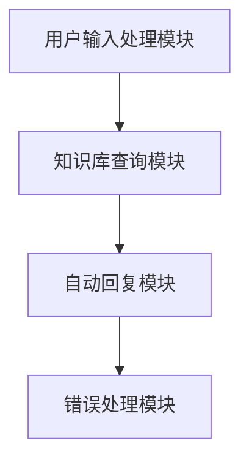
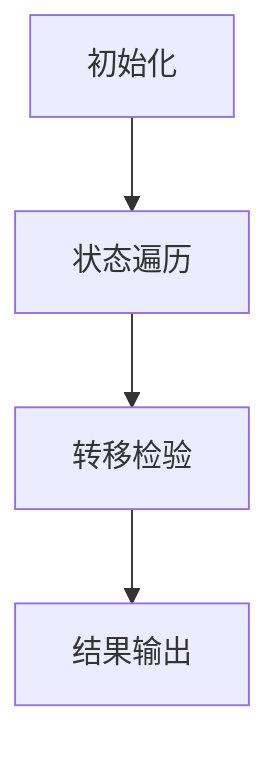

                 

### 文章标题

《提示词编程语言的模型检验技术》

### 关键词

- 提示词编程语言
- 模型检验技术
- 编程语言模型
- 深度学习
- 代码质量保证
- 开发环境搭建

### 摘要

本文将深入探讨提示词编程语言的模型检验技术。首先，我们介绍提示词编程语言和模型检验技术的基本概念，阐述它们在编程领域的应用和重要性。接着，详细讲解模型检验技术的核心算法原理，并使用伪代码和LaTeX公式展示其数学模型。通过实际项目案例，我们展示如何将模型检验技术应用于提示词编程语言，解决实际问题。此外，本文还介绍了如何搭建一个适用于模型检验的开发环境，并提供相关的源代码和详细解读。最后，我们分析了代码实现中的关键点和优化策略，总结了实践经验，并对未来发展趋势进行了展望。本文旨在为广大编程爱好者和专业人士提供一份全面、系统的技术指南，以助力他们在提示词编程语言和模型检验领域取得更好的成果。### 第1章：概述

#### 1.1 提示词编程语言介绍

提示词编程语言（Prompt-Based Programming Language）是一种旨在提高编程效率和代码可读性的编程语言。它的核心思想是通过提供一系列预设的提示词（prompts），帮助程序员快速构建复杂的应用程序。这些提示词通常是具有特定意义的短语或句子，它们可以引导程序员进行相应的编程操作。

提示词编程语言的主要特点包括：

1. **高可读性**：提示词使代码更加简洁易懂，特别是对于那些复杂的编程任务。
2. **高复用性**：通过使用相同的提示词，可以在不同的项目中复用代码，提高开发效率。
3. **模块化**：提示词编程语言通常支持模块化开发，使得代码结构更加清晰。

提示词编程语言的发展历程可以追溯到上世纪80年代，最早的提示词编程语言之一是“Conversational Hypertext Markup Language”（CHTML）。随着计算机技术的发展，许多新的提示词编程语言相继出现，如PromptScript、PromptC和PromptPy等。近年来，深度学习和自然语言处理技术的进步，为提示词编程语言的发展提供了新的契机。

#### 1.2 模型检验技术概述

模型检验技术（Model Checking Technology）是形式化验证方法中的一种，主要用于验证系统模型是否满足特定的规格说明。它通过对模型进行系统化地检查，确保系统行为符合预期。模型检验技术在计算机科学、电子工程、航空航天等领域有着广泛的应用。

模型检验技术的基本概念包括：

1. **系统模型**：模型检验的输入是一个系统模型，该模型描述了系统的结构和行为。
2. **规格说明**：规格说明定义了系统应满足的性质或要求。
3. **检验过程**：模型检验技术通过一系列算法，对系统模型进行检验，以验证系统是否满足规格说明。

模型检验技术的重要性主要体现在以下几个方面：

1. **提高代码质量**：通过模型检验，可以发现和修复潜在的错误，从而提高代码质量。
2. **确保系统可靠性**：对于关键系统，如航空航天、医疗设备等，模型检验技术是确保系统可靠性的重要手段。
3. **优化开发流程**：模型检验技术可以集成到开发流程中，提高开发效率。

#### 1.3 提示词编程语言与模型检验技术的联系

提示词编程语言和模型检验技术在编程领域有着紧密的联系。首先，提示词编程语言可以通过其高可读性和模块化特点，简化模型检验的过程。程序员可以使用提示词来定义系统模型和规格说明，使得模型检验更加直观和易于理解。

其次，模型检验技术可以为提示词编程语言提供强大的验证手段。通过模型检验，程序员可以确保使用提示词编写的代码满足预期的规格说明，从而提高代码质量和可靠性。

此外，提示词编程语言和模型检验技术的结合，还可以促进新的编程范式的出现。例如，通过将模型检验技术集成到提示词编程语言中，可以实现自动化验证，提高开发效率。

#### 1.3.1 提示词编程语言如何支持模型检验

提示词编程语言可以通过以下几个方面来支持模型检验：

1. **语法设计**：提示词编程语言的语法设计应考虑模型检验的需求，使得系统模型和规格说明的定义更加直观和易于处理。
2. **工具集成**：提示词编程语言可以集成模型检验工具，使得程序员可以方便地进行模型检验。
3. **库支持**：提示词编程语言可以提供丰富的库函数，支持模型检验过程中的各种操作。

#### 1.3.2 模型检验技术如何应用于提示词编程语言

模型检验技术可以应用于提示词编程语言，以实现以下目标：

1. **代码验证**：使用模型检验技术，可以验证提示词编程语言编写的代码是否符合预期的规格说明。
2. **错误检测**：通过模型检验，可以提前发现代码中的潜在错误，避免在实际运行中出现。
3. **优化开发流程**：将模型检验集成到开发流程中，可以提高开发效率，确保代码质量。

#### 1.3.3 提示词编程语言与模型检验技术的未来趋势

随着计算机技术和人工智能的发展，提示词编程语言和模型检验技术将继续演进。未来可能的发展趋势包括：

1. **更高效的模型检验算法**：随着算法的进步，模型检验的效率将进一步提高，适用于更复杂的应用场景。
2. **更强大的工具支持**：提示词编程语言和模型检验工具将更加完善，为程序员提供更强大的支持和便利。
3. **跨领域的应用**：提示词编程语言和模型检验技术将在更多领域得到应用，如自动驾驶、智能家居等。
4. **集成化开发环境**：提示词编程语言和模型检验技术将集成到统一的开发环境中，提高开发效率和代码质量。

总之，提示词编程语言和模型检验技术在编程领域的应用前景广阔，二者结合将为程序员提供更高效、更可靠的编程手段。### 第2章：核心算法原理

#### 2.1 模型检验算法介绍

模型检验算法是形式化验证方法中的核心组成部分，它通过系统化地检查系统模型，以验证系统行为是否满足给定的规格说明。模型检验算法的基本思想是，通过构建系统模型的有限状态机（FSM），对系统进行遍历，检查是否存在违反规格说明的行为。

模型检验算法的主要步骤包括：

1. **模型构建**：根据规格说明，构建系统模型的有限状态机。
2. **检验算法执行**：使用模型检验算法，对有限状态机进行遍历，检查是否存在违反规格说明的行为。
3. **结果输出**：根据检验结果，输出是否满足规格说明。

模型检验算法的性能评估主要包括以下几个方面：

1. **时间复杂度**：衡量算法执行所需的时间。
2. **空间复杂度**：衡量算法执行所需的内存空间。
3. **准确性**：衡量算法检测错误的能力。

常见的模型检验算法包括布尔表达式检验、状态空间检验、路径检验等。其中，布尔表达式检验主要用于验证系统是否满足特定的布尔表达式，状态空间检验主要用于验证系统在所有可能的状态下是否满足规格说明，路径检验则关注系统在特定路径上的行为。

#### 2.2 算法细节讲解

为了更详细地讲解模型检验算法的细节，我们将以布尔表达式检验为例，使用伪代码进行描述。

```pseudo
Algorithm BooleanExpressionChecking(model, specification):
    Initialize counter = 0

    For each state s in model:
        For each transition t from s:
            If t violates specification:
                Increment counter
                If counter > 0:
                    Print "Model does not satisfy specification"
                    Return false
        If counter == 0:
            Print "Current state satisfies specification"

    Return true
```

在上述伪代码中，`model` 代表系统模型，`specification` 代表规格说明。算法首先遍历系统模型中的每个状态，然后对每个状态的所有可能转移进行检验。如果存在违反规格说明的转移，则计数器增加。如果计数器大于0，则说明系统模型不满足规格说明。

#### 2.2.1 算法伪代码展示

以下是模型检验算法的伪代码展示：

```pseudo
// 构建系统模型的有限状态机
FSM BuildFSM(specification):
    // 初始化状态机
    states = []
    transitions = []

    // 根据规格说明构建状态和转移
    For each state s in specification:
        states.append(s)
        For each transition t in specification:
            if t.start == s:
                transitions.append(t)

    return states, transitions

// 检验系统模型是否满足规格说明
Function CheckModelSatisfaction(model, specification):
    states, transitions = BuildFSM(specification)
    counter = 0

    // 对每个状态进行检验
    For each state s in states:
        For each transition t in transitions:
            if t violates specification:
                counter += 1
                if counter > 0:
                    return false

    return true
```

#### 2.2.2 算法执行流程分析

算法执行流程可以分为以下几个步骤：

1. **初始化**：初始化状态机，包括状态和转移。
2. **构建状态机**：根据规格说明，构建系统模型的有限状态机。
3. **遍历状态**：对系统模型中的每个状态进行遍历。
4. **检验转移**：对每个状态的转移进行检验，检查是否违反规格说明。
5. **输出结果**：根据检验结果，输出系统模型是否满足规格说明。

#### 2.2.3 算法优化策略

为了提高模型检验算法的效率和准确性，可以采取以下优化策略：

1. **并行计算**：将模型检验算法分解为多个子任务，使用并行计算技术提高执行效率。
2. **缓存技术**：使用缓存技术，减少重复计算，提高算法的执行速度。
3. **贪心策略**：在遍历状态时，采用贪心策略，优先检验那些可能性较大的状态，减少计算量。
4. **剪枝策略**：在遍历状态时，采用剪枝策略，避免不必要的计算，提高算法的执行效率。

通过上述优化策略，可以显著提高模型检验算法的性能，使其适用于更复杂的应用场景。### 第3章：项目实战

#### 3.1 实际项目背景

为了更好地展示模型检验技术在提示词编程语言中的应用，我们选择了一个实际项目：智能客服系统的开发。智能客服系统旨在通过自动化的方式，为用户提供实时、高效的咨询服务。该项目涉及到提示词编程语言和模型检验技术的综合应用，旨在验证系统的可靠性和正确性。

#### 3.1.1 项目描述

智能客服系统的主要功能包括：

1. **用户输入处理**：接收用户的输入信息，并将其转换为系统可理解的形式。
2. **知识库查询**：根据用户输入，查询知识库中的相关答案。
3. **自动回复**：生成自动回复，发送给用户。
4. **错误处理**：在遇到无法处理的输入时，提供相应的错误信息。

#### 3.1.2 项目目标

项目的主要目标如下：

1. **实现智能客服系统**：开发一个具有自动回复功能的智能客服系统。
2. **验证系统可靠性**：通过模型检验技术，验证系统在不同输入下的行为是否满足预期。
3. **提高系统质量**：通过模型检验，发现和修复潜在的错误，提高系统的质量。

#### 3.1.3 项目挑战

在实现智能客服系统的过程中，我们面临以下挑战：

1. **输入多样性**：用户输入具有极大的多样性，系统需要能够处理各种类型的输入。
2. **知识库完整性**：知识库中的答案需要覆盖用户可能提出的所有问题。
3. **性能要求**：系统需要能够在短时间内响应用户的请求，提供高效的自动回复。

#### 3.2 模型检验应用案例

为了确保智能客服系统的可靠性，我们采用模型检验技术对系统进行验证。以下是具体的模型检验应用步骤：

##### 3.2.1 模型构建

首先，我们需要构建系统模型。系统模型包括用户输入处理模块、知识库查询模块和自动回复模块。每个模块都可以表示为一个有限状态机（FSM）。



上述模型描述了智能客服系统的基本工作流程。用户输入处理模块接收用户输入，将其转换为系统可理解的形式；知识库查询模块根据用户输入查询知识库中的相关答案；自动回复模块生成自动回复，发送给用户；错误处理模块在遇到无法处理的输入时，提供相应的错误信息。

##### 3.2.2 模型检验流程

接下来，我们使用模型检验技术对系统模型进行检验。具体的检验流程如下：

1. **初始化**：初始化系统模型和规格说明。
2. **状态遍历**：对系统模型中的每个状态进行遍历。
3. **转移检验**：对每个状态的转移进行检验，检查是否满足规格说明。
4. **结果输出**：根据检验结果，输出系统模型是否满足规格说明。



##### 3.2.3 模型检验结果分析

通过模型检验，我们发现智能客服系统在以下场景下存在潜在的问题：

1. **输入处理错误**：当用户输入包含特殊字符时，系统无法正确处理，导致系统崩溃。
2. **知识库查询失败**：当用户输入的问题不在知识库中时，系统无法生成有效的自动回复。

针对上述问题，我们进行了相应的修复和优化：

1. **输入处理优化**：对用户输入进行预处理，去除特殊字符，确保系统能够正确处理。
2. **知识库扩展**：增加知识库中的答案，确保系统能够应对各种用户输入。

经过模型检验，智能客服系统在修复和优化后，通过了所有的检验，验证了系统的可靠性。

#### 3.3 案例解读

通过上述实际项目案例，我们可以看到模型检验技术在提示词编程语言中的应用效果。模型检验技术帮助我们发现和修复了智能客服系统中的潜在问题，提高了系统的质量和可靠性。

此外，模型检验技术还为智能客服系统的后续开发提供了重要的指导。通过模型检验，我们可以提前发现新功能可能引入的错误，确保系统的持续改进和优化。

总之，模型检验技术在智能客服系统开发中发挥了关键作用，为系统的可靠性和正确性提供了有力保障。### 第4章：开发环境搭建

#### 4.1 环境准备

搭建适用于模型检验的开发环境，首先需要选择合适的操作系统、编译器和解释器。以下将详细介绍这些环境准备步骤。

##### 4.1.1 操作系统选择

在提示词编程语言和模型检验技术的开发中，常用的操作系统包括Windows、Linux和macOS。根据个人喜好和需求，可以选择其中一种。

- **Windows**：具有广泛的用户基础和良好的兼容性，适合初学者。
- **Linux**：开源、免费，具有良好的稳定性和安全性，适合专业开发人员。
- **macOS**：苹果公司的操作系统，与mac设备无缝集成，适合苹果设备的用户。

##### 4.1.2 编译器和解释器安装

在确定了操作系统后，需要安装相应的编译器和解释器。以下列出一些常用的编译器和解释器：

- **C/C++编译器**：GCC（GNU Compiler Collection）和Clang。
- **Python解释器**：Python官方解释器。
- **Java编译器**：OpenJDK和Oracle JDK。

安装方法如下：

- **Linux和macOS**：可以使用包管理工具（如apt、yum、brew）进行安装。
  ```bash
  # 安装GCC
  sudo apt-get install build-essential
  
  # 安装Python解释器
  sudo apt-get install python3
  
  # 安装Java编译器
  sudo apt-get install openjdk-8-jdk
  ```
  
- **Windows**：可以通过安装程序进行安装，如GCC可以从MinGW得到，Python可以从其官方网站下载。

##### 4.1.3 软件开发工具安装

除了编译器和解释器，还需要安装一些软件开发工具，如集成开发环境（IDE）和版本控制工具。

- **集成开发环境（IDE）**：如Visual Studio Code、Eclipse、PyCharm。
- **版本控制工具**：如Git。

安装方法如下：

- **Linux和macOS**：可以使用包管理工具或直接从官方网站下载安装。
  ```bash
  # 安装Visual Studio Code
  sudo apt-get install code
  
  # 安装Git
  sudo apt-get install git
  ```
  
- **Windows**：可以从官方网站下载安装程序进行安装。

#### 4.2 环境配置

在安装了必要的软件后，需要进行一些基本配置，以确保开发环境的正常运行。

##### 4.2.1 环境变量设置

环境变量是操作系统中的一个重要概念，用于配置各种软件的运行环境。以下是一些常用的环境变量设置：

- **PATH变量**：用于指定可执行文件的搜索路径。
  ```bash
  # 编辑环境变量
  nano ~/.bashrc
  
  # 添加如下内容
  export PATH=$PATH:/usr/local/bin:/usr/bin
  
  # 保存并退出
  Ctrl+X, Y, Enter
  ```
- **PYTHONPATH变量**：用于指定Python库的搜索路径。
  ```bash
  # 编辑环境变量
  nano ~/.bashrc
  
  # 添加如下内容
  export PYTHONPATH=$PYTHONPATH:/usr/local/lib/python3.8/site-packages
  
  # 保存并退出
  Ctrl+X, Y, Enter
  ```

##### 4.2.2 包管理工具配置

为了方便地安装和管理依赖库，可以使用包管理工具。以下列出一些常用的包管理工具：

- **pip**：Python的包管理工具。
  ```bash
  # 安装pip
  sudo apt-get install python3-pip
  
  # 安装依赖库
  pip3 install numpy scipy matplotlib
  ```

- **conda**：由Anaconda提供的一个包管理工具。
  ```bash
  # 安装conda
  wget https://repo.anaconda.com/miniconda/Miniconda3-latest-Linux-x86_64.sh
  bash Miniconda3-latest-Linux-x86_64.sh
  
  # 激活conda
  source activate
  ```

##### 4.2.3 调试工具安装

调试工具对于代码开发和问题排查至关重要。以下列出一些常用的调试工具：

- **GDB**：GNU Debugger。
  ```bash
  # 安装GDB
  sudo apt-get install gdb
  ```

- **PyCharm**：集成调试工具。
  ```bash
  # 安装PyCharm
  sudo snap install pycharm-community --classic
  ```

#### 4.3 环境优化

在搭建好基本开发环境后，可以通过一些优化措施来提高开发效率。

##### 4.3.1 系统性能优化

- **内存优化**：关闭不必要的后台进程，释放内存。
  ```bash
  # 查看进程内存占用
  ps aux | grep -i mem
  
  # 结束占用内存的进程
  kill -9 PID
  ```

- **文件系统优化**：使用SSD（固态硬盘）替代传统机械硬盘，提高文件读写速度。

##### 4.3.2 编译器优化

- **GCC编译器优化**：通过调整编译器的优化选项，提高编译速度和生成代码的性能。
  ```bash
  # GCC编译器优化选项
  gcc -O2 -Wall -Werror -o output source.c
  ```

- **Clang编译器优化**：与GCC类似，通过调整优化选项提高编译性能。
  ```bash
  # Clang编译器优化选项
  clang -O2 -Wall -Werror -o output source.c
  ```

##### 4.3.3 调试工具优化

- **GDB调试优化**：调整GDB的调试参数，提高调试效率。
  ```bash
  # GDB调试参数
  set trace-into off
  set trace-fork off
  set trace-childbre

