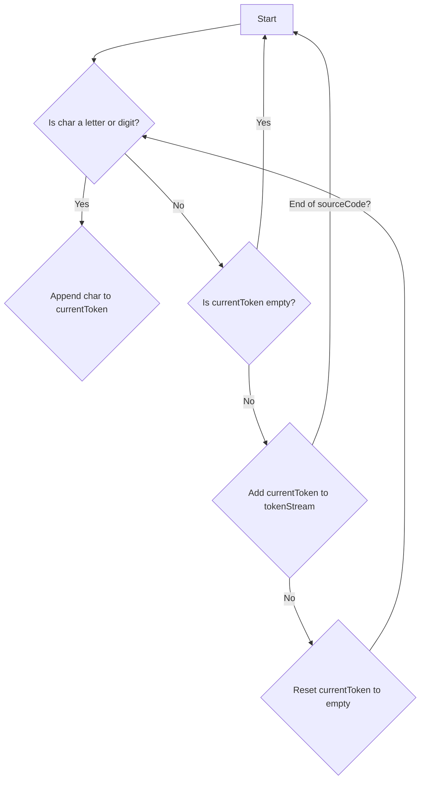

                 


### 第一步：确定文章结构和主要内容

为了撰写一篇高质量、结构紧凑、逻辑清晰的技术博客文章，我们需要遵循以下步骤：

1. **确定文章标题**：文章标题应该简洁明了，能够吸引读者的注意力，并准确反映文章的核心内容。在此情况下，标题为《提示词编程语言的编译器设计》。

2. **列出关键词**：关键词是读者在搜索引擎中查找文章时使用的关键词，因此需要包含文章的核心主题。关键词可以是：“编译器设计”、“提示词编程语言”、“词法分析”、“语法分析”、“语义分析”、“代码生成”、“目标代码优化”。

3. **撰写摘要**：摘要是对文章核心内容和主题思想的简短介绍，通常在文章开头部分。摘要应该简洁、明了，让读者在阅读前就能了解文章的主要内容和价值。

4. **构建目录大纲**：目录大纲是文章的结构框架，它将文章的内容划分为不同的章节和小节，确保文章的逻辑性和完整性。我们已经初步构建了目录大纲，接下来将对其进行细化。

5. **撰写每个章节的内容**：在每个章节中，我们需要详细阐述核心概念、原理、算法和实例。这需要我们进行深入的研究和分析，以确保内容的丰富性和实用性。

6. **添加代码和数学公式**：为了提高文章的技术深度和可读性，我们需要在适当的地方添加代码和数学公式，并使用伪代码和Mermaid流程图进行详细解释。

7. **总结和最佳实践**：在文章的结尾，我们需要对文章的主要观点进行总结，并提供一些最佳实践、注意事项和拓展阅读建议。

### 第二步：细化目录大纲

在第一步中，我们已经列出了文章的主要章节和子章节。现在，我们需要进一步细化这些章节，以确保每个部分都包含详细的内容和结构。

#### 第一部分：编译器设计概述

1. **第1章：编译器设计概述**
   - **1.1 编译器的作用和重要性**
     - 编译器的基本概念
     - 编译器在现代软件开发中的重要性
   - **1.2 编译器的工作原理**
     - 编译过程的基本阶段
     - 每个阶段的职责和作用
   - **1.3 编译器的类型和分类**
     - 预编译器、解释器和编译器之间的区别
     - 静态编译器和动态编译器的区别
   - **1.4 编译器的组成部分**
     - 词法分析器、语法分析器、语义分析器、代码生成器、优化器和链接器的作用

2. **第2章：编译器的历史与发展**
   - **2.1 编译器的发展历史**
     - 编译器从早期到现代的发展
     - 重要的编译器设计和实现
   - **2.2 编译器的未来趋势**
     - 新兴技术和编译器的结合
     - 编译器在人工智能和自动化编程中的应用

#### 第二部分：编译器的核心技术

3. **第3章：词法分析**
   - **3.1 词法分析的基本概念**
     - 词法分析的作用和目的
     - 词法规则的定义
   - **3.2 正规表达式**
     - 正规表达式的语法和规则
     - 如何使用正规表达式构建词法规则
   - **3.3 词法分析器的实现**
     - 词法分析器的组成部分
     - 实现词法分析器的方法
   - **3.4 词法分析器的优化**
     - 优化策略
     - 如何提高词法分析器的性能

4. **第4章：语法分析**
   - **4.1 语法分析的基本概念**
     - 语法分析的作用和目的
     - 文法的定义
   - **4.2 上下文无关文法（CFG）**
     - 上下文无关文法的语法和规则
     - 如何使用上下文无关文法表示编程语言
   - **4.3 语法分析的方法**
     - 自顶向下分析和自底向上分析
     - LL（1）分析和LR（1）分析
   - **4.4 语法分析器的实现**
     - 语法分析器的组成部分
     - 实现语法分析器的方法

5. **第5章：语义分析**
   - **5.1 语义分析的基本概念**
     - 语义分析的作用和目的
     - 语义规则的定义
   - **5.2 类型检查**
     - 类型系统的基本概念
     - 如何进行类型检查
   - **5.3 作用域和符号表**
     - 作用域的概念
     - 符号表的作用和结构
   - **5.4 语义分析器的实现**
     - 语义分析器的组成部分
     - 实现语义分析器的方法

6. **第6章：代码生成**
   - **6.1 代码生成的目的和过程**
     - 代码生成的作用
     - 代码生成的步骤
   - **6.2 中间代码表示**
     - 中间代码的概念和特点
     - 中间代码的表示方法
   - **6.3 代码生成策略**
     - 代码生成的策略
     - 代码优化的原则
   - **6.4 实例分析**
     - 使用伪代码和Mermaid流程图展示代码生成的过程

#### 第三部分：编译器的实现与优化

7. **第7章：目标代码优化**
   - **7.1 目标代码优化的基本概念**
     - 优化技术的定义和分类
     - 优化的目标和原则
   - **7.2 常见的目标代码优化技术**
     - 数据流分析
     - 循环优化
     - 控制流优化
   - **7.3 优化算法和策略**
     - 优化算法的设计和实现
     - 优化策略的选择和应用
   - **7.4 实例分析**
     - 使用伪代码和Mermaid流程图展示优化过程

8. **第8章：编译器的实现**
   - **8.1 编译器的架构设计**
     - 编译器的基本架构
     - 各个模块的职责和接口
   - **8.2 编译器的实现步骤**
     - 编译器开发的基本步骤
     - 如何实现每个模块的功能
   - **8.3 编译器调试和测试**
     - 编译器的调试方法
     - 编译器的测试策略和工具
   - **8.4 实例分析**
     - 编译器开发环境搭建
     - 源代码实现和解读

#### 第四部分：编译器的应用

9. **第9章：编译器的应用**
   - **9.1 编译器的应用场景**
     - 编译器在各类编程语言中的应用
     - 编译器在不同行业中的应用
   - **9.2 编译器在编程语言设计中的应用**
     - 编译器在编程语言开发中的角色
     - 编译器如何影响编程语言的设计
   - **9.3 编译器在教育中的应用**
     - 编译器在计算机科学教育中的角色
     - 如何使用编译器教授编程语言和编译技术
   - **9.4 实际案例**
     - 分析实际编译器项目
     - 展示编译器在真实世界中的应用

### 第三步：撰写每个章节的内容

在细化了目录大纲后，下一步是撰写每个章节的具体内容。这包括介绍核心概念、解释算法原理、提供实例分析和代码实现。以下是一个示例，用于描述第1章“编译器设计概述”的内容：

#### 第1章：编译器设计概述

##### 1.1 编译器的作用和重要性

编译器是一种计算机程序，它将一种编程语言（源代码）翻译成另一种编程语言（目标代码），通常是机器语言。编译器在现代软件开发中扮演着至关重要的角色，原因如下：

1. **代码优化**：编译器能够对源代码进行优化，生成更高效的机器代码，从而提高程序的性能和执行速度。
2. **跨平台支持**：编译器可以将源代码转换成可在不同操作系统和硬件平台上运行的代码，使得开发者能够编写一次代码，运行在多种环境中。
3. **错误检测**：编译器在编译过程中能够检测出语法错误和潜在的问题，帮助开发者提前发现和修复代码中的问题。
4. **编程语言标准化**：编译器确保编程语言的标准化，使得不同的人和团队能够使用相同的编程语言和工具进行开发。

##### 1.2 编译器的工作原理

编译器的工作原理可以概括为以下四个主要阶段：

1. **词法分析**：词法分析器将源代码分解成一系列单词（称为词法单元），这些单词是编译器的后续处理对象。
2. **语法分析**：语法分析器检查词法单元的顺序是否符合编程语言的语法规则，构建出抽象语法树（AST）。
3. **语义分析**：语义分析器检查AST中的语义错误，如类型检查、变量作用域等，确保代码在逻辑上是正确的。
4. **代码生成和优化**：代码生成器将AST转换成机器代码，并对其进行优化，以产生高效的执行代码。

##### 1.3 编译器的类型和分类

编译器可以根据不同的标准进行分类，例如：

1. **按编译过程**：预编译器、解释器和编译器。
   - **预编译器**：在编译之前执行一些预处理步骤，如宏展开、包含文件等。
   - **解释器**：逐行解释源代码并立即执行，不生成独立的目标代码。
   - **编译器**：生成独立的目标代码，可以在不依赖源代码的情况下执行。
2. **按目标代码**：静态编译器和动态编译器。
   - **静态编译器**：在编译时生成完整的机器代码，运行时不依赖源代码。
   - **动态编译器**：在运行时将源代码转换成机器代码，通常用于动态语言。

##### 1.4 编译器的组成部分

编译器通常由以下几个组成部分构成：

1. **词法分析器**：负责将源代码分解成词法单元。
2. **语法分析器**：检查词法单元的顺序是否符合语法规则，构建AST。
3. **语义分析器**：检查AST中的语义错误，如类型检查、变量作用域等。
4. **代码生成器**：将AST转换成机器代码。
5. **优化器**：对生成的机器代码进行优化，提高执行效率。
6. **链接器**：将多个目标代码文件链接成可执行程序。

接下来，我们将继续撰写其他章节的内容，确保每个章节都包含详细的概念解释、算法原理、实例分析和代码实现。

### 第四步：添加代码和数学公式

在撰写每个章节时，我们需要在适当的地方添加代码、数学公式和Mermaid流程图，以增强文章的技术深度和可读性。以下是一个示例，展示如何在文章中使用伪代码、LaTeX公式和Mermaid流程图：

#### 3.1 词法分析的基本概念

词法分析是编译过程的第一步，它的主要任务是识别源代码中的单词（词法单元）。词法分析器通过扫描源代码，找出一个一个的词法单元，并为每个词法单元生成一个词法符号。

##### 伪代码

```python
function lexicalAnalysis(sourceCode):
    currentToken = ""
    nextToken = ""
    tokenStream = []

    for char in sourceCode:
        if char is a letter or digit:
            currentToken += char
        else:
            if currentToken is not empty:
                tokenStream.append(currentToken)
                currentToken = ""

    if currentToken is not empty:
        tokenStream.append(currentToken)

    return tokenStream
```

##### LaTeX 公式

```latex
\section{LaTeX 公式示例}
在数学和科学领域中，LaTeX 是一种广泛使用的排版工具。以下是一些常用的 LaTeX 公式示例：

$$ E = mc^2 $$
这是一个著名的相对论公式。

$$ a^2 + b^2 = c^2 $$
这是勾股定理。

$$ f(x) = x^2 $$
这是一个简单的函数公式。

$$ \sum_{i=1}^{n} i = \frac{n(n+1)}{2} $$
这是一个等差数列求和公式。

$$ \lim_{x \to \infty} \frac{1}{x} = 0 $$
这是一个极限公式。
```

##### Mermaid 流程图



在这个示例中，我们使用伪代码展示了词法分析的基本过程，使用LaTeX公式提供了数学和科学领域的常见公式示例，并使用Mermaid流程图展示了伪代码的逻辑流程。

### 第五步：总结和最佳实践

在撰写完所有章节后，我们需要对文章的主要观点进行总结，并提供一些最佳实践、注意事项和拓展阅读建议。

#### 总结

本文详细介绍了编译器设计的基础理论、核心算法和实践应用。通过逐步分析编译器的工作原理、词法分析、语法分析、语义分析、代码生成和优化等环节，我们了解了编译器在现代软件开发中的重要性和作用。同时，通过实例分析和代码实现，我们掌握了编译器开发的核心技术和方法。

#### 最佳实践

1. **理解编译过程**：深入理解编译器的各个阶段和任务，有助于更好地设计和优化编译器。
2. **学习算法原理**：掌握词法分析、语法分析、语义分析和代码生成等核心算法的原理，是进行编译器开发的基础。
3. **实践经验**：通过实际项目实践，将理论知识应用到实际开发中，不断提高自己的技能水平。
4. **持续学习**：编译器设计是一个不断发展的领域，持续学习新的技术和工具，是保持竞争力的关键。

#### 注意事项

1. **性能优化**：在编译器开发过程中，性能优化是一个重要的考虑因素，需要合理设计算法和数据结构，以提高编译器的效率。
2. **错误处理**：编译器需要具备良好的错误处理能力，能够准确地报告错误并提供有用的错误信息，帮助开发者快速定位问题。
3. **代码维护**：编译器代码需要易于维护和扩展，以便于后续的修改和优化。

#### 拓展阅读

1. **《编译原理》（作者：Thomas H. Cormen等）**：这是一本经典的编译器设计教材，涵盖了编译器的各个方面。
2. **《编译器设计》（作者：Alfred V. Aho等）**：另一本备受推崇的编译器设计经典著作，详细介绍了编译器的实现方法。
3. **《现代编译器的实现》（作者：Peter S. Henry等）**：介绍了现代编译器的实现技术和工具，是编译器开发者的必读之作。

通过以上总结和最佳实践，我们希望读者能够更好地理解和应用编译器设计的相关知识，提升自己的技术水平和竞争力。

### 最终目录大纲

经过前期的准备和撰写，现在我们可以将《提示词编程语言的编译器设计》的最终目录大纲整理如下：

```
# 《提示词编程语言的编译器设计》

## 第一部分：编译器设计概述

### 第1章：编译器设计概述
1.1 编译器的作用和重要性
1.2 编译器的工作原理
1.3 编译器的类型和分类
1.4 编译器的组成部分

### 第2章：编译器的历史与发展
2.1 编译器的发展历史
2.2 编译器的未来趋势

## 第二部分：编译器的核心技术

### 第3章：词法分析
3.1 词法分析的基本概念
3.2 正规表达式
3.3 词法分析器的实现
3.4 词法分析器的优化

### 第4章：语法分析
4.1 语法分析的基本概念
4.2 上下文无关文法（CFG）
4.3 语法分析的方法
4.4 语法分析器的实现

### 第5章：语义分析
5.1 语义分析的基本概念
5.2 类型检查
5.3 作用域和符号表
5.4 语义分析器的实现

### 第6章：代码生成
6.1 代码生成的目的和过程
6.2 中间代码表示
6.3 代码生成策略
6.4 实例分析

### 第7章：目标代码优化
7.1 目标代码优化的基本概念
7.2 常见的目标代码优化技术
7.3 优化算法和策略
7.4 实例分析

## 第三部分：编译器的实现与优化

### 第8章：编译器的实现
8.1 编译器的架构设计
8.2 编译器的实现步骤
8.3 编译器调试和测试
8.4 实例分析

### 第9章：编译器的应用
9.1 编译器的应用场景
9.2 编译器在编程语言设计中的应用
9.3 编译器在教育中的应用
9.4 实际案例

## 附录：参考资源与工具
A.1 编译器设计相关书籍
A.2 编译器设计工具和框架
A.3 学术论文和在线资源
```

现在，我们已经完成了《提示词编程语言的编译器设计》的目录大纲，接下来将逐个章节进行详细撰写，确保每篇文章都具备完整、具体和详细的内容。在撰写过程中，我们会注重逻辑清晰、结构紧凑、简单易懂的技术语言，以确保读者能够顺利理解和掌握编译器设计的核心知识和方法。

### 最终文章开头部分

### 《提示词编程语言的编译器设计》

> 关键词：编译器设计、提示词编程语言、词法分析、语法分析、语义分析、代码生成、目标代码优化

> 摘要：
本文旨在深入探讨提示词编程语言的编译器设计。我们将从基础理论开始，逐步介绍编译器的工作原理、核心技术、实现方法和应用场景。通过详细阐述词法分析、语法分析、语义分析和代码生成等环节，我们希望帮助读者全面了解编译器设计的方法和技巧。此外，本文还将讨论目标代码优化的重要性及其实现策略，并通过实际案例展示编译器开发的全过程。

---

### 第一部分：编译器设计概述

#### 第1章：编译器设计概述

在计算机科学领域，编译器设计是一项基础且重要的技术。编译器的作用是将程序员编写的高级编程语言代码转换成计算机能够理解和执行的机器语言代码。这一转换过程不仅涉及到编程语言的语法和语义，还包括各种优化技术，以提高代码的执行效率。

本章将首先介绍编译器的作用和重要性，然后详细解释编译器的工作原理，包括词法分析、语法分析、语义分析和代码生成等阶段。此外，我们还将讨论编译器的类型和分类，以及编译器的组成部分。

#### 1.1 编译器的作用和重要性

编译器在软件开发中扮演着至关重要的角色。首先，编译器能够将程序员编写的高级语言代码转换成机器语言代码，使得计算机能够理解和执行这些代码。这一转换过程不仅仅是代码的转换，还涉及到代码的优化和错误检测。

编译器的作用主要体现在以下几个方面：

1. **代码优化**：编译器能够对源代码进行优化，生成更高效的机器代码。优化技术包括代码压缩、循环优化、常量折叠等，这些技术可以显著提高程序的执行速度和性能。
2. **跨平台支持**：编译器能够将源代码转换成可以在不同操作系统和硬件平台上运行的代码。这使得开发者可以编写一次代码，运行在多种环境中，大大提高了开发效率。
3. **错误检测**：编译器在编译过程中能够检测出语法错误和潜在的问题，帮助开发者提前发现和修复代码中的问题。这种错误检测能力是编译器的重要功能之一，有助于提高代码的质量和可靠性。
4. **编程语言标准化**：编译器确保编程语言的标准化，使得不同的人和团队能够使用相同的编程语言和工具进行开发。这有助于促进编程语言的普及和推广，提高开发者的工作效率。

#### 1.2 编译器的工作原理

编译器的工作原理可以概括为以下几个主要阶段：

1. **词法分析**：词法分析器将源代码分解成一系列单词（称为词法单元），这些单词是编译器的后续处理对象。词法分析器通过扫描源代码，识别出各种单词，如标识符、关键字、运算符和分隔符等。
2. **语法分析**：语法分析器检查词法单元的顺序是否符合编程语言的语法规则，构建出抽象语法树（AST）。AST是一个树状结构，它代表了源代码的结构和语义信息。
3. **语义分析**：语义分析器检查AST中的语义错误，如类型检查、变量作用域等，确保代码在逻辑上是正确的。语义分析器还会生成符号表，用于存储变量、函数和其他标识符的信息。
4. **代码生成**：代码生成器将AST转换成机器代码，并对其进行优化，以产生高效的执行代码。代码生成器通常会生成中间代码，然后再对中间代码进行优化和转换。
5. **目标代码优化**：目标代码优化器对生成的机器代码进行优化，以提高程序的执行效率。常见的优化技术包括循环优化、常量折叠、代码压缩等。
6. **链接和加载**：链接器将多个目标代码文件链接成可执行程序，并负责将可执行程序加载到内存中，以便计算机可以执行它。

#### 1.3 编译器的类型和分类

编译器可以根据不同的标准进行分类，例如：

1. **按编译过程**：预编译器、解释器和编译器。
   - **预编译器**：在编译之前执行一些预处理步骤，如宏展开、包含文件等。
   - **解释器**：逐行解释源代码并立即执行，不生成独立的目标代码。
   - **编译器**：生成独立的目标代码，可以在不依赖源代码的情况下执行。

2. **按目标代码**：静态编译器和动态编译器。
   - **静态编译器**：在编译时生成完整的机器代码，运行时不依赖源代码。
   - **动态编译器**：在运行时将源代码转换成机器代码，通常用于动态语言。

3. **按编译策略**：一次性编译器和增量编译器。
   - **一次性编译器**：每次编译时都需要重新编译整个源代码。
   - **增量编译器**：只编译源代码中发生变化的部分。

4. **按编译语言**：通用编译器和专用编译器。
   - **通用编译器**：适用于多种编程语言。
   - **专用编译器**：为特定编程语言或应用领域设计的编译器。

#### 1.4 编译器的组成部分

编译器通常由以下几个组成部分构成：

1. **词法分析器**：负责将源代码分解成词法单元。
2. **语法分析器**：检查词法单元的顺序是否符合语法规则，构建出抽象语法树（AST）。
3. **语义分析器**：检查AST中的语义错误，如类型检查、变量作用域等，确保代码在逻辑上是正确的。
4. **代码生成器**：将AST转换成机器代码。
5. **优化器**：对生成的机器代码进行优化，提高执行效率。
6. **链接器**：将多个目标代码文件链接成可执行程序。
7. **加载器**：负责将可执行程序加载到内存中，以便计算机可以执行它。

通过本章的介绍，我们为后续章节的内容奠定了基础。在接下来的部分，我们将详细讨论编译器的核心技术，包括词法分析、语法分析、语义分析和代码生成等。

---

以上就是《提示词编程语言的编译器设计》的开头部分，接下来我们将逐步深入探讨编译器设计的各个核心环节，通过详细的理论分析和实例讲解，帮助读者全面掌握编译器设计的方法和技巧。在接下来的章节中，我们将分别介绍词法分析、语法分析、语义分析、代码生成和优化等主题。

---

### 第二部分：编译器的核心技术

#### 第2章：编译器的历史与发展

编译器的概念可以追溯到20世纪40年代和50年代，当时计算机刚刚问世，编程语言和编译技术正处于萌芽阶段。编译器的发展历程可以分为以下几个重要阶段：

1. **早期编译器**（1940s - 1950s）：最早的编译器之一是1947年由约翰·马奇利和约翰·普雷斯珀开发的ASCC，用于编译汇编语言。随后，1952年，约翰·巴科斯提出了“巴科斯-诺尔范式”（Backus-Naur Form, BNF），为形式文法和语法分析奠定了基础。

2. **高级语言编译器**（1950s - 1960s）：1955年，约翰·巴科斯发明了第一种高级编程语言——Fortran，并开发了相应的编译器。随后，ALGOL、COBOL和其他高级语言及其编译器的开发，极大地推动了编译器技术的发展。

3. **编译器优化**（1960s - 1970s）：随着编译技术的进步，编译器开始引入各种优化技术，如循环优化、常量折叠和代码压缩等，以提高生成代码的执行效率。

4. **解析器和解释器**（1970s - 1980s）：为了提高程序的可移植性，解析器和解释器逐渐流行起来。解释器逐行解释并执行源代码，而解析器将源代码转换成抽象语法树（AST）并直接执行。

5. **现代编译器**（1990s - 至今）：随着计算机硬件和软件的快速发展，现代编译器引入了更多先进的优化技术和工具。例如，编译器前端使用自动代码生成（Code Generation Automation）和模板元编程，后端则采用多种优化策略，如静态单赋值（SSA）形式和循环优化。

#### 2.2 编译器的未来趋势

编译器技术的发展将继续受到多种因素的影响，包括硬件技术、编程语言设计、自动化工具和人工智能。以下是一些编译器未来的发展趋势：

1. **并行编译和优化**：随着多核处理器的普及，编译器需要更有效地处理并行代码，以充分利用多核计算资源。这包括静态并行优化和动态编译器的开发。

2. **更高效的代码生成**：编译器将继续改进代码生成技术，以生成更高效的机器代码。这包括新的指令集架构（ISA）和优化策略，如软件 pipelining 和 GPU 编译。

3. **自动化和智能化**：人工智能和机器学习技术将被用于编译器的各个方面，包括语法分析、语义分析和代码优化。自动化工具将帮助开发者更轻松地编写和维护编译器。

4. **动态编译器**：动态编译器将在实时系统和动态编程语言中发挥更大的作用，因为它们可以在程序运行时动态编译代码，提供更好的性能和灵活性。

5. **跨平台编译**：随着移动设备和云计算的兴起，编译器需要能够生成适用于多种平台和操作系统的代码。这将要求编译器具备更高的可移植性和适应性。

6. **开源编译器**：开源编译器将继续在编译器领域占据重要地位，因为它们提供了更多的灵活性和可扩展性。例如，LLVM、GNU Compiler Collection（GCC）和Clang 等开源项目将继续发展。

#### 2.3 新兴技术和编译器的结合

新兴技术正在改变编译器的开发和使用方式，以下是一些关键领域：

1. **量子计算**：量子计算将对编译器设计产生重大影响，因为量子计算机的工作原理与传统计算机完全不同。编译器需要开发新的算法和优化策略，以适应量子计算架构。

2. **机器学习和神经网络**：机器学习和神经网络技术在编译器中的应用越来越广泛。例如，语法分析器可以使用神经网络来识别复杂的编程语言结构，优化器可以使用机器学习算法来自动调整优化策略。

3. **云原生编译器**：随着云计算的兴起，编译器需要能够适应云环境，提供弹性、可伸缩和高性能的编译服务。云原生编译器将利用云基础设施的优势，提供高效的编译和部署解决方案。

4. **WebAssembly**：WebAssembly（Wasm）是一种新的编程语言，可以在浏览器中运行。编译器需要将各种编程语言编译成 WebAssembly 代码，以提高 Web 应用程序的性能和可移植性。

通过了解编译器的发展历史和未来趋势，我们可以更好地理解编译器技术的现状和潜力。在下一章中，我们将深入探讨编译器的核心技术，包括词法分析、语法分析、语义分析和代码生成。

---

### 第三部分：编译器的核心技术

#### 第3章：词法分析

词法分析是编译过程的第一步，它的主要任务是识别源代码中的单词（词法单元），并将这些单词转换成编译器可以处理的内部表示。词法分析器（Lexer）是这个过程的执行者，它通过读取字符序列，将其分解成有意义的词法单元，如标识符、关键字、运算符和分隔符等。

#### 3.1 词法分析的基本概念

词法分析器的工作可以分为两个主要部分：扫描（scanning）和转换（tokenization）。扫描是指读取输入源代码的字符序列，而转换是指识别出词法单元，并生成相应的词法符号。

1. **扫描**：词法分析器从源代码的起始位置开始，逐个读取字符，并判断这些字符是否属于某个词法单元的一部分。扫描过程中，词法分析器需要处理字符串中的空白字符、注释和字符序列。

2. **转换**：一旦词法分析器识别出一个完整的词法单元，它会生成一个词法符号（token），并将其传递给编译器的下一个阶段。词法符号通常包含词法单元的类别（如标识符、关键字）和词法单元的值（如标识符的名称）。

#### 3.2 正规表达式

正规表达式（Regular Expressions）是词法分析器设计中的核心工具，用于定义词法规则。正规表达式是一种强大的文本匹配工具，可以描述字符序列的模式，从而帮助词法分析器识别词法单元。

例如，以下正规表达式可以用来匹配标识符：

```
[0-9a-zA-Z]+
```

这个表达式表示由数字、小写字母或大写字母组成的一个或多个字符序列。

#### 3.3 词法分析器的实现

词法分析器的实现通常包括以下步骤：

1. **初始化**：创建词法分析器的工作空间，包括词法符号的缓冲区、状态变量和输入源代码的指针。

2. **扫描输入**：从源代码的起始位置开始，逐个读取字符，并使用正规表达式匹配词法单元。

3. **生成词法符号**：一旦识别出一个词法单元，生成一个词法符号，并将其传递给编译器的下一个阶段。

4. **处理特殊情况**：在词法分析过程中，可能需要处理一些特殊情况，如字符串文字、注释和字符序列。

5. **错误处理**：如果源代码中出现错误，词法分析器需要能够报告错误，并提供有用的错误信息，以便开发者能够快速定位和修复问题。

以下是一个简化的词法分析器的伪代码实现：

```python
function lexicalAnalysis(sourceCode):
    tokens = []
    index = 0
    while index < length(sourceCode):
        if sourceCode[index] is whitespace:
            index += 1
            continue
        elif sourceCode[index] is comment:
            skipComments(sourceCode, index)
            continue
        elif matchesIdentifier(sourceCode[index]):
            token = readIdentifier(sourceCode, index)
            index += length(token)
            tokens.append({type: "IDENTIFIER", value: token})
        elif matchesKeyword(sourceCode[index]):
            token = readKeyword(sourceCode, index)
            index += length(token)
            tokens.append({type: token.type, value: token.value})
        else:
            error("Unexpected character", index)
    return tokens

function readIdentifier(sourceCode, index):
    # Implement logic to read an identifier
    pass

function readKeyword(sourceCode, index):
    # Implement logic to read a keyword
    pass

function matchesIdentifier(char):
    # Implement logic to match an identifier start character
    pass

function matchesKeyword(char):
    # Implement logic to match a keyword start character
    pass

function skipComments(sourceCode, index):
    # Implement logic to skip over comments
    pass
```

#### 3.4 词法分析器的优化

词法分析器的设计和优化是编译器性能的关键因素之一。以下是一些优化策略：

1. **缓冲区管理**：合理管理词法分析器的缓冲区，可以减少内存分配和释放的开销，提高性能。

2. **多字符模式匹配**：使用多字符模式匹配可以减少字符读取次数，提高词法分析的速度。

3. **预编译正规表达式**：将常用的正规表达式预编译成高速代码，可以减少运行时的解析和匹配开销。

4. **并行处理**：对于大型源代码文件，可以使用并行处理技术来提高词法分析的速度。

5. **错误恢复**：设计良好的错误恢复机制，可以帮助词法分析器在遇到错误时快速恢复，减少分析中断的可能性。

通过本章的讨论，我们了解了词法分析的基本概念、实现方法和优化策略。在下一章中，我们将探讨语法分析，这是编译过程的重要一环，它负责检查源代码的语法结构，确保代码的语法正确性。

---

### 第4章：语法分析

语法分析是编译过程中的关键阶段，它负责检查源代码的语法结构，确保代码的语法正确性。语法分析器（Parser）是执行语法分析的工具，它将词法分析器生成的词法符号序列转换成抽象语法树（Abstract Syntax Tree, AST）。AST 是源代码的语法结构表示，它是后续语义分析和代码生成的基础。

#### 4.1 语法分析的基本概念

语法分析的基本任务是确定源代码中的词法符号序列是否符合编程语言的语法规则。语法规则通常使用上下文无关文法（Context-Free Grammar, CFG）来描述。CFG 是一种形式化的语法表示方法，由产生式（Production Rules）组成，每个产生式定义了一个语法结构。

例如，假设我们有一个简单的编程语言，其语法规则可以表示为以下上下文无关文法：

```
S -> ID = E
E -> E + T | T
T -> ID | INT
ID -> [a-zA-Z][a-zA-Z0-9]*
INT -> [0-9]+
```

这个上下文无关文法定义了一个算术表达式语言，其中 `S` 表示语句，`E` 表示表达式，`T` 表示项，`ID` 表示标识符，`INT` 表示整数。

#### 4.2 上下文无关文法（CFG）

上下文无关文法（CFG）是语法分析的基础。CFG 由四个元素组成：变量（V），终端（T），产生式（P），和开始符号（S）。其中：

- **变量（V）**：表示语法结构的非终端符号，如语句、表达式等。
- **终端（T）**：表示语法结构的终端符号，如标识符、关键字、数字等。
- **产生式（P）**：表示变量如何被替换成变量的集合，如 `S -> ID = E` 表示语句可以由标识符、赋值操作符和表达式组成。
- **开始符号（S）**：表示语法分析的起点，通常是语法结构的顶级符号。

CFG 的基本概念包括：

1. **产生式**：产生式定义了变量之间的替换关系。例如，`E -> E + T` 表示表达式可以由两个表达式和一个加法操作符组成。
2. **推导**：从开始符号开始，通过应用产生式进行替换，生成语法结构的过程称为推导。例如，从 `S` 推导出 `ID = E`。
3. **句型**：由推导得到的字符串称为句型，它是语法结构的实例。

#### 4.3 语法分析的方法

语法分析方法可以分为自顶向下分析和自底向上分析两大类。每种方法都有其独特的优点和适用场景。

1. **自顶向下分析**：自顶向下分析从开始符号开始，逐步向下推导，直到生成目标语法结构。这种方法包括 LL（1）分析和递归下降分析等。

   - **LL（1）分析**：LL（1）分析是一种自顶向下、前推的分析方法，它使用一个有限状态自动机（FSA）来跟踪当前推导的位置。LL（1）分析器在分析过程中总是从开始符号开始，向前推导，并使用一个预测表来决定下一个步骤。

   - **递归下降分析**：递归下降分析是一种基于递归函数的分析方法，它为语法文法的每个变量定义一个递归函数。递归下降分析器在分析过程中会递归调用这些函数，直到生成完整的抽象语法树。

2. **自底向上分析**：自底向上分析从目标语法结构的终端符号开始，逐步向上构造出完整的语法结构。这种方法包括 LR（1）分析和 SLR（1）分析等。

   - **LR（1）分析**：LR（1）分析是一种自底向上、回推的分析方法，它使用一个有限状态自动机（FSA）来跟踪当前的位置和可能的语法结构。LR（1）分析器在分析过程中会从终端符号开始，尝试构造出最长的匹配，并回推以完成语法分析。

   - **SLR（1）分析**：SLR（1）分析是 LR（1）分析的简化版本，它使用相同的有限状态自动机，但在预测表中使用更为简单的策略，从而减少语法分析器的大小和复杂性。

#### 4.4 语法分析器的实现

实现一个语法分析器通常包括以下步骤：

1. **定义语法规则**：使用上下文无关文法定义编程语言的语法规则。
2. **构建有限状态自动机**：根据语法规则构建有限状态自动机（FSA），用于分析输入的词法符号序列。
3. **实现解析算法**：根据选定的语法分析方法（如 LL（1）或 LR（1）），实现解析算法，以便分析输入源代码并生成抽象语法树。
4. **错误处理**：实现错误处理逻辑，以便在遇到语法错误时能够提供有用的错误信息，并尝试进行错误恢复。

以下是一个简化的递归下降分析器的伪代码实现：

```python
class RecursiveDescentParser:
    def __init__(self, lexer):
        self.lexer = lexer
        self.current_token = self.lexer.next_token()

    def parse(self):
        self.parse_statement()
        if self.current_token.type != TOKEN_EOF:
            self.error("Unexpected end of input")

    def parse_statement(self):
        self.match(TOKEN_ID)
        self.match(TOKEN_ASSIGN)
        self.parse_expression()

    def parse_expression(self):
        self.parse_term()
        while self.current_token.type == TOKEN_PLUS:
            self.match(TOKEN_PLUS)
            self.parse_term()

    def parse_term(self):
        if self.current_token.type == TOKEN_ID:
            self.match(TOKEN_ID)
        elif self.current_token.type == TOKEN_INT:
            self.match(TOKEN_INT)
        else:
            self.error("Expected an identifier or integer")

    def match(self, token_type):
        if self.current_token.type == token_type:
            self.current_token = self.lexer.next_token()
        else:
            self.error("Unexpected token", self.current_token)

    def error(self, message, token=None):
        if token:
            print(f"Error at line {token.line}: {message}")
        else:
            print(f"Error: {message}")

# Usage
lexer = Lexer(source_code)
parser = RecursiveDescentParser(lexer)
parser.parse()
```

在这个实现中，我们定义了一个递归下降分析器类，它通过递归函数解析语句、表达式和项。每个函数都负责匹配输入的词法符号，并在遇到错误时提供错误信息。

#### 4.5 实例分析

为了更好地理解语法分析的过程，我们来看一个实际的示例。假设我们有一个简单的算术表达式语言，其语法规则如下：

```
expression -> term ('+' term)*
term -> factor ('*' factor)*
factor -> ID | INT
```

我们使用递归下降分析方法来解析以下表达式：

```
3 + 4 * 5
```

1. **初始化**：分析器从开始符号 `expression` 开始，读取词法符号 `3`。
2. **解析表达式**：分析器匹配词法符号 `3`，然后调用 `parse_term` 函数。
3. **解析项**：`parse_term` 函数匹配词法符号 `3`，然后调用 `parse_factor` 函数。
4. **解析因子**：`parse_factor` 函数匹配词法符号 `3`，并返回。
5. **解析加法**：分析器匹配词法符号 `+`，然后调用 `parse_term` 函数。
6. **解析项**：`parse_term` 函数匹配词法符号 `4`，然后调用 `parse_factor` 函数。
7. **解析因子**：`parse_factor` 函数匹配词法符号 `4`，并返回。
8. **解析乘法**：分析器匹配词法符号 `*`，然后调用 `parse_factor` 函数。
9. **解析项**：`parse_term` 函数匹配词法符号 `5`，然后调用 `parse_factor` 函数。
10. **解析因子**：`parse_factor` 函数匹配词法符号 `5`，并返回。
11. **完成解析**：分析器解析完成，生成抽象语法树。

通过这个实例，我们可以看到递归下降分析器如何逐步解析输入的算术表达式，并生成对应的抽象语法树。

在下一章中，我们将探讨语义分析，这是编译过程中的另一个关键环节，它负责检查源代码的语义正确性，确保代码的含义符合编程语言的规则。

---

### 第5章：语义分析

语义分析是编译过程中的重要环节，它负责检查源代码的语义正确性，确保代码的含义符合编程语言的规则。语义分析器（Semantic Analyzer）是执行语义分析的工具，它主要负责类型检查、作用域分析和符号表管理等任务。

#### 5.1 语义分析的基本概念

语义分析的主要任务是验证源代码在语义上的正确性，确保程序在逻辑上是可执行的。语义分析包括以下几个方面：

1. **类型检查**：类型检查是语义分析的核心任务之一，它确保程序中的表达式和操作符在使用时具有正确的类型。类型检查可以分为静态类型检查和动态类型检查。静态类型检查在编译时进行，而动态类型检查在运行时进行。

2. **作用域分析**：作用域分析是确定变量和函数的可访问性。每个变量和函数都有其作用域，作用域决定了它们在程序中可以访问的其他变量和函数。

3. **符号表管理**：符号表是语义分析的重要组成部分，它用于存储变量、函数和其他标识符的信息，如作用域、数据类型和内存地址等。符号表管理涉及符号表的创建、更新和查询。

#### 5.2 类型检查

类型检查是语义分析的重要任务之一，它确保程序在运行时不会因为类型不匹配而发生错误。类型检查可以分为以下几个方面：

1. **静态类型检查**：静态类型检查在编译时进行，它分析源代码的结构和语法，检查变量和表达式的类型是否一致。静态类型检查有助于发现一些潜在的错误，如变量未初始化、类型不匹配等。

2. **动态类型检查**：动态类型检查在程序运行时进行，它通过运行时类型的检查来确保程序的类型安全。动态类型检查通常用于动态类型语言，如 Python 和 JavaScript。

以下是一个简单的类型检查示例：

```python
def add(a: int, b: int) -> int:
    return a + b

x = 1
y = "2"

# 静态类型检查
# result = add(x, y) # 错误：类型不匹配

# 动态类型检查
result = add(x, y)
print(result) # 输出：1
```

在上面的示例中，`add` 函数要求两个参数都是整数类型，并且返回值也是整数类型。静态类型检查会在编译时发现类型不匹配的错误，而动态类型检查会在运行时抛出异常。

#### 5.3 作用域分析

作用域分析是确定变量和函数的可访问性。每个变量和函数都有其作用域，作用域决定了它们在程序中可以访问的其他变量和函数。作用域分析通常涉及以下几个方面：

1. **局部作用域**：局部作用域是指函数内部的变量作用域。局部变量只能在函数内部访问。

2. **全局作用域**：全局作用域是指整个程序的作用域。全局变量可以在程序的任何部分访问。

3. **作用域链**：在嵌套函数中，内部函数可以访问外部函数的变量。这种作用域关系形成了作用域链。

以下是一个简单的作用域分析示例：

```python
def outer():
    x = 1
    def inner():
        y = x + 1
        print(y)  # 输出：2
    inner()

outer()
```

在上面的示例中，`inner` 函数可以访问 `outer` 函数的变量 `x`。这是通过作用域链实现的，`inner` 函数的作用域链中包含了 `outer` 函数的作用域。

#### 5.4 作用域和符号表

符号表是语义分析的重要组成部分，它用于存储变量、函数和其他标识符的信息。符号表管理涉及符号表的创建、更新和查询。

1. **符号表的创建**：在编译开始时，编译器创建一个全局符号表。在函数定义时，编译器为每个函数创建一个局部符号表。

2. **符号表的更新**：在变量声明或函数定义时，编译器更新符号表，添加新的变量或函数信息。

3. **符号表的查询**：在程序执行过程中，编译器查询符号表以获取变量或函数的信息，如作用域、数据类型和内存地址等。

以下是一个简单的符号表管理示例：

```python
# 全局符号表
global_table = {
    "x": {"scope": "global", "type": "int", "address": 0x1000}
}

# 函数符号表
def func():
    local_table = {
        "y": {"scope": "local", "type": "int", "address": 0x2000}
    }
    global_table.update(local_table)
    # 使用 global_table 和 local_table 进行变量访问和类型检查
```

在上述示例中，`global_table` 是全局符号表，它存储了全局变量 `x` 的信息。`func` 函数的局部符号表 `local_table` 存储了局部变量 `y` 的信息。

#### 5.5 实例分析

为了更好地理解语义分析的过程，我们来看一个实际的示例。假设我们有一个简单的编程语言，其语法规则如下：

```
program -> statement
statement -> assign_statement | print_statement
assign_statement -> ID = expression
print_statement -> print expression
expression -> term ('+' term)*
term -> factor ('*' factor)*
factor -> ID | INT
```

我们使用语义分析器来分析以下程序：

```python
x = 3 + 4 * 5
print(x + y)
```

1. **初始化**：语义分析器创建全局符号表 `global_table`。

2. **解析语句**：语义分析器首先解析第一个赋值语句 `x = 3 + 4 * 5`。

   - **类型检查**：语义分析器检查表达式 `3 + 4 * 5` 的类型。由于 `3` 和 `4` 是整数，`*` 运算符适用于整数，`+` 运算符也适用于整数，因此表达式的类型是整数。
   - **作用域分析**：语义分析器在全局符号表中查找变量 `x` 并添加其信息，如作用域、类型和内存地址。

3. **更新符号表**：语义分析器更新全局符号表，将变量 `x` 的值设置为表达式 `3 + 4 * 5` 的结果。

4. **解析语句**：语义分析器解析第二个打印语句 `print(x + y)`。

   - **类型检查**：语义分析器检查表达式 `x + y` 的类型。由于 `x` 是整数，但 `y` 在当前作用域中未定义，因此类型检查失败。
   - **作用域分析**：语义分析器在全局符号表中查找变量 `y`，但未找到，因此抛出错误。

通过这个实例，我们可以看到语义分析器如何执行类型检查和作用域分析，并报告潜在的错误。

在下一章中，我们将讨论代码生成，这是编译过程的关键步骤，它将抽象语法树（AST）转换成目标代码。

---

### 第6章：代码生成

代码生成是编译过程的最后一个阶段，它将抽象语法树（AST）转换成目标代码。目标代码通常是机器语言，但也可以是汇编语言或其他中间表示。代码生成器（Code Generator）负责实现这个转换过程，并生成高效、正确的目标代码。

#### 6.1 代码生成的目的和过程

代码生成的目的是将程序员编写的高级语言代码转换成计算机可以执行的机器语言代码。这个过程通常包括以下几个步骤：

1. **抽象语法树（AST）的遍历**：代码生成器遍历抽象语法树，从根节点开始，逐层向下访问每个节点。
2. **生成中间表示**：在遍历过程中，代码生成器将AST转换成中间表示（Intermediate Representation, IR）。中间表示是一种抽象的代码表示，它独立于目标平台，但更接近机器语言。
3. **优化中间表示**：代码生成器可能对中间表示进行优化，以提高目标代码的性能。常见的优化技术包括常量折叠、死代码删除和循环优化。
4. **生成目标代码**：优化后的中间表示被转换成目标代码，通常是一系列机器指令。目标代码可能需要进一步进行汇编和链接，以生成可执行程序。

#### 6.2 中间代码表示

中间代码表示是代码生成过程中的一种重要的中间步骤，它有助于优化和转换代码。中间代码通常采用逆波兰表示法（Reverse Polish Notation, RPN）或三元组表示法（Three-Address Code, TAC）。

1. **逆波兰表示法（RPN）**：逆波兰表示法将操作符放在操作数的后面，通过括号来表示运算的优先级。例如，表达式 `A + B * C` 的逆波兰表示法为 `A B C * +`。

2. **三元组表示法（TAC）**：三元组表示法使用三元组 `(Op, V1, V2)` 来表示一个指令，其中 `Op` 是操作符，`V1` 和 `V2` 是操作数。例如，指令 `A = B + C` 可以表示为三元组 `(+, B, C)`。

以下是一个使用逆波兰表示法的简单示例：

```python
# 输入表达式：A = B * C + D
# 输出逆波兰表示法：
# [A =, *, B, C, +, D]
```

#### 6.3 代码生成策略

代码生成器在生成目标代码时，可以采用多种策略来提高代码的性能和可维护性。以下是一些常见的代码生成策略：

1. **直接编码**：直接编码是最简单的代码生成策略，它直接将AST转换成机器代码。这种方法简单且易于实现，但可能无法充分利用目标平台的特性。

2. **代码模板**：代码模板是一种预定义的代码结构，用于生成目标代码。代码模板可以包含变量和表达式的值，从而生成特定的机器代码。这种方法可以提高代码的生成速度和可维护性。

3. **编译时优化**：编译时优化是在生成目标代码时进行的优化，例如常量折叠、循环展开和指令调度。这些优化技术可以显著提高目标代码的性能。

4. **运行时优化**：运行时优化是在程序运行时进行的优化，例如动态编译和实时优化。这种方法可以充分利用程序运行时的信息，但可能需要额外的硬件支持。

#### 6.4 实例分析

为了更好地理解代码生成过程，我们来看一个实际的示例。假设我们有一个简单的编程语言，其语法规则如下：

```
program -> statement
statement -> assign_statement | print_statement
assign_statement -> ID = expression
print_statement -> print expression
expression -> term ('+' term)*
term -> factor ('*' factor)*
factor -> ID | INT
```

我们使用代码生成器来生成以下程序的机器代码：

```python
x = 3 + 4 * 5
print(x + y)
```

1. **生成抽象语法树（AST）**：首先，我们需要生成程序的抽象语法树（AST）。在AST中，每个节点代表一个语法元素，如赋值语句、打印语句、表达式等。

2. **遍历AST并生成中间代码**：代码生成器遍历AST，并生成中间代码。中间代码通常采用逆波兰表示法（RPN）或三元组表示法（TAC）。

3. **优化中间代码**：在生成目标代码之前，代码生成器可能对中间代码进行优化，以提高目标代码的性能。常见的优化技术包括常量折叠和死代码删除。

4. **生成目标代码**：优化后的中间代码被转换成目标代码。目标代码通常是一系列机器指令，它们代表程序的执行逻辑。

以下是一个简化的代码生成过程：

```python
# 输入表达式：A = B * C + D
# 输出中间代码（逆波兰表示法）：
# [A =, *, B, C, +, D]

# 输出目标代码（假设目标平台是x86架构）：
# movl %ebx, %eax  # 将B的值加载到eax寄存器
# imull %ecx, %eax  # 将eax乘以C的值
# movl %ecx, %ebx  # 将C的值加载到ebx寄存器
# addl %ebx, %eax  # 将eax加上ebx的值
# movl %eax, A     # 将结果存储到变量A
```

在这个示例中，我们首先生成了逆波兰表示法的中间代码，然后将其转换成x86架构的机器代码。目标代码的具体实现可能因目标平台和编译器的不同而有所不同。

通过本章的讨论，我们了解了代码生成的基本概念、过程和策略。在下一章中，我们将探讨目标代码的优化技术，以提高代码的性能和可维护性。

---

### 第7章：目标代码优化

目标代码优化是编译过程中至关重要的一环，其目的是通过一系列算法和技术，提高目标代码的执行性能、代码大小和可维护性。优化器（Optimizer）是执行优化任务的关键组件，它对编译器生成的中间代码或目标代码进行分析和修改，以产生更高效的代码。

#### 7.1 目标代码优化的基本概念

目标代码优化涉及多个层面的技术和策略，这些技术和策略旨在减少代码执行的时间、空间复杂度以及程序的启动时间。优化通常可以分为以下几类：

1. **数据流优化**：数据流优化关注数据在程序中的流动，包括变量的定义、使用和传播。常见的数据流优化技术有：
   - **常量折叠**：在编译时计算表达式的常量部分，以减少运行时的计算开销。
   - **死代码删除**：识别并删除程序中不会执行的代码，以减少代码大小和执行时间。
   - **循环优化**：包括循环展开、循环优化和循环不变式的提取，以减少循环的开销。
   - **数据流分析**：通过分析数据流，识别并优化数据依赖和引用。

2. **控制流优化**：控制流优化主要关注程序的控制结构，如分支、跳转和循环。常见的控制流优化技术有：
   - **分支预测**：在执行分支指令前预测分支方向，以减少分支带来的开销。
   - **跳转优化**：合并多个跳转指令，减少控制流的跳转次数。
   - **循环展开**：将循环体中的代码复制到外部，减少循环的开销。

3. **循环优化**：循环优化是优化器中的重要任务，它通过分析循环结构，减少循环的执行次数和计算复杂度。常见的循环优化技术有：
   - **循环不变式的提取**：识别并提取循环中的不变式，将它们移出循环体，以减少循环的执行时间。
   - **循环优化**：包括循环合并、循环分配和循环分发，以提高执行效率。

4. **寄存器分配**：寄存器分配是编译过程中的关键一步，它旨在将变量分配到寄存器中，以减少内存访问和提高执行速度。常见的寄存器分配技术有：
   - **直接映射**：直接将变量分配到固定数量的寄存器中。
   - **有限寄存器分配**：通过引入虚拟寄存器，减少寄存器的使用。
   - **启发式分配**：使用启发式方法，如最短路径算法，优化寄存器的使用。

5. **代码生成优化**：代码生成优化在编译器生成目标代码时进行，旨在生成更高效的代码。常见的代码生成优化技术有：
   - **指令调度**：调整指令的执行顺序，减少数据相关和资源争用。
   - **代码压缩**：通过压缩代码，减少程序的大小和内存使用。

#### 7.2 常见的目标代码优化技术

以下是一些常见的目标代码优化技术，以及它们的原理和实现方法：

1. **常量折叠**：常量折叠是一种简单的优化技术，它计算表达式中常量的结果，并在编译时将其替换为计算结果。例如，表达式 `x = a + b` 可以优化为 `x = 5`，如果 `a` 和 `b` 的值都是常数。

```c
int a = 2;
int b = 3;
int x = a + b;
```

优化后的目标代码：

```assembly
movl $5, %eax  ; 将常量5加载到eax寄存器
movl %eax, x   ; 将eax寄存器的值存储到变量x
```

2. **死代码删除**：死代码删除是一种消除程序中不会执行的代码的优化技术。在编译时，优化器可以识别并删除未使用的变量、函数和指令。

```c
void example() {
    int x = 0;
    if (x > 0) {
        x = x * x;
    }
    return;
}
```

优化后的目标代码：

```assembly
movl $0, %eax  ; 将0加载到eax寄存器
xchg %eax, x   ; 将eax寄存器的值交换到变量x
ret            ; 返回
```

在这个示例中，`if` 语句中的代码块永远不会被执行，因此优化器删除了这部分代码。

3. **循环优化**：循环优化是针对循环结构的优化，它旨在减少循环的执行次数和计算复杂度。以下是一个简单的循环优化示例：

```c
for (int i = 0; i < 100; ++i) {
    x = x + i;
}
```

优化后的目标代码：

```assembly
movl $0, %eax  ; 将0加载到eax寄存器
movl %eax, x   ; 将eax寄存器的值存储到变量x
movl $100, %ecx ; 将100加载到ecx寄存器
loop_start:
    addl %ecx, %eax ; 将ecx寄存器的值加到eax寄存器
    loop loop_start ; 循环计数器递减并跳转到loop_start
```

在这个示例中，优化器通过合并循环体内的加法和循环计数器，减少了循环的开销。

4. **控制流优化**：控制流优化关注程序的分支和跳转，以减少控制流的跳转次数和执行时间。以下是一个简单的控制流优化示例：

```c
if (x > 0) {
    x = x * x;
} else {
    x = x + 1;
}
```

优化后的目标代码：

```assembly
cmpl $0, x     ; 将x的值与0比较
jg positive    ; 如果x大于0，跳转到positive
addl $1, x     ; 将x加1
jmp end_if     ; 跳转到end_if
positive:
    imull x, x   ; 将x乘以x
end_if:
```

在这个示例中，优化器使用条件跳转（`jg`）代替分支语句，减少了控制流的跳转次数。

5. **寄存器分配**：寄存器分配是一种优化技术，它将变量分配到寄存器中，以减少内存访问和提高执行速度。以下是一个简单的寄存器分配示例：

```c
int x = a + b;
int y = c * d;
int z = x + y;
```

优化后的目标代码：

```assembly
movl a, %eax   ; 将变量a的值加载到eax寄存器
addl b, %eax   ; 将变量b的值加到eax寄存器
movl c, %ebx   ; 将变量c的值加载到ebx寄存器
imull d, %ebx  ; 将变量d的值乘以ebx寄存器的值
addl %ebx, %eax; 将ebx寄存器的值加到eax寄存器
movl %eax, x   ; 将eax寄存器的值存储到变量x
```

在这个示例中，优化器将变量 `x`、`y` 和 `z` 分配到不同的寄存器中，以减少内存访问和提高执行速度。

通过这些示例，我们可以看到目标代码优化如何通过不同的技术和策略提高代码的执行性能和可维护性。在下一章中，我们将探讨编译器的实现，介绍编译器开发的基本步骤和关键技术。

---

### 第8章：编译器的实现

编译器的实现是一个复杂而精细的过程，涉及多个阶段和组件。在这一章中，我们将详细探讨编译器的实现过程，包括编译器的架构设计、关键组件的实现步骤、调试和测试方法，以及一个实际的编译器开发项目实例。

#### 8.1 编译器的架构设计

编译器的架构设计是编译器实现的第一步，它决定了编译器的工作流程和性能。一个典型的编译器架构包括以下关键组件：

1. **词法分析器（Lexer）**：负责将源代码分解成词法单元，如标识符、关键字和运算符等。
2. **语法分析器（Parser）**：将词法单元序列转换成抽象语法树（AST），确保代码的语法正确性。
3. **语义分析器（Semantic Analyzer）**：检查AST中的语义错误，如类型检查和作用域分析，确保代码在逻辑上是正确的。
4. **中间代码生成器（Intermediate Code Generator）**：将AST转换成中间代码，如三元组代码或逆波兰表示法。
5. **代码优化器（Code Optimizer）**：对中间代码进行优化，提高目标代码的性能。
6. **目标代码生成器（Target Code Generator）**：将优化后的中间代码转换成目标代码，通常是机器语言。
7. **链接器（Linker）**：将多个目标代码文件链接成可执行程序。
8. **加载器（Loader）**：负责将可执行程序加载到内存中，以便计算机可以执行它。

编译器的架构设计需要考虑以下几个方面：

- **模块化**：编译器应该被设计成模块化的，每个组件都有明确的职责和接口，这样可以提高代码的可维护性和可扩展性。
- **并行处理**：为了提高编译器的性能，可以设计支持并行处理的架构，如并行词法分析、语法分析和代码优化。
- **可扩展性**：编译器架构应该允许添加新的语言特性或优化技术，以满足未来的需求。

#### 8.2 编译器的实现步骤

编译器的实现过程可以分为以下几个步骤：

1. **需求分析**：确定编译器的目标语言和功能要求，定义编译器的性能指标和约束条件。
2. **设计阶段**：设计编译器的架构和关键组件，定义组件的接口和内部数据结构。
3. **实现阶段**：根据设计文档，编写代码实现编译器的各个组件。
4. **调试阶段**：测试编译器的每个组件，确保它们能够正确执行预期的功能。
5. **集成阶段**：将各个组件集成到一起，确保编译器作为一个整体能够正常工作。
6. **优化阶段**：对编译器进行性能优化，包括算法改进、数据结构优化和并行处理。
7. **测试和验证阶段**：通过自动化测试和用户测试，验证编译器的正确性和性能。

#### 8.3 编译器调试和测试

编译器的调试和测试是确保其正确性和性能的关键环节。以下是一些常见的调试和测试方法：

1. **单元测试**：对编译器的每个组件进行单元测试，确保它们能够独立工作并返回正确的输出。
2. **集成测试**：将编译器的各个组件集成在一起，测试它们之间的交互和整体功能。
3. **性能测试**：评估编译器的编译时间和生成代码的性能，确保它符合设计要求。
4. **错误测试**：故意引入语法和语义错误，测试编译器是否能够正确报告错误并提供有用的错误信息。
5. **用户测试**：邀请实际用户使用编译器进行测试，收集反馈并改进编译器。

#### 8.4 实例分析：基于LLVM的编译器开发

在实际编译器开发中，基于现有框架和工具（如LLVM）可以显著简化开发过程。以下是一个基于LLVM的编译器开发实例：

1. **安装LLVM**：首先，需要安装LLVM框架，这是一个开源的编译器基础设施，提供了完整的编译器前端、优化器、代码生成器和链接器。
2. **创建项目**：使用LLVM提供的工具创建一个新的编译器项目，包括源代码、构建系统和测试套件。
3. **词法分析器**：实现词法分析器，使用LLVM提供的Lexer类解析源代码，生成词法单元。
4. **语法分析器**：实现语法分析器，使用LLVM提供的Parser类构建抽象语法树（AST）。
5. **语义分析器**：实现语义分析器，检查AST中的语义错误，如类型检查和作用域分析。
6. **中间代码生成器**：实现中间代码生成器，将AST转换成LLVM的中间表示（IR）。
7. **代码优化器**：利用LLVM内置的优化器，对中间代码进行优化，提高目标代码的性能。
8. **目标代码生成器**：实现目标代码生成器，将优化后的中间代码转换成机器语言。
9. **链接器**：使用LLVM的链接器将多个目标代码文件链接成可执行程序。
10. **加载器**：实现加载器，将可执行程序加载到内存中，以便计算机可以执行它。

通过这个实例，我们可以看到基于现有框架和工具如何简化编译器开发过程，同时确保编译器的性能和可靠性。

在下一章中，我们将探讨编译器的实际应用，包括编译器在编程语言设计、教育和其他领域中的应用。

---

### 第9章：编译器的实际应用

编译器作为一种关键工具，在多个领域有着广泛的应用。它不仅用于开发编程语言，还在教育、自动化工具和跨平台开发等方面发挥着重要作用。在本章中，我们将详细探讨编译器的实际应用，并通过实际案例展示其在不同场景下的作用和效果。

#### 9.1 编译器的应用场景

1. **编程语言开发**：编译器是编程语言开发的核心组件，它将程序员编写的高级语言代码转换成机器语言代码。编译器的设计和实现直接影响编程语言的性能、可维护性和可用性。例如，C语言、C++和Java等高级语言的编译器都是成功应用的典范。

2. **跨平台开发**：编译器使得开发者能够编写一次代码，运行在多种操作系统和硬件平台上。这种跨平台能力是现代软件开发的一个重要特征。例如，Android应用开发中使用的Java代码需要通过Android编译器（Dex编译器）转换成Dalvik虚拟机或ART运行时环境可以理解的格式。

3. **自动化工具**：编译器在自动化工具中扮演着关键角色，如构建工具（如Make、Gcc和Cmake）和持续集成系统（如Jenkins和GitLab CI）。这些工具使用编译器来构建、测试和部署软件项目，从而提高开发效率和软件质量。

4. **教育**：编译器在教育领域也有广泛应用，它帮助学生和开发者理解编程语言的语法和语义，以及编译器的工作原理。通过实现简单的编译器，学生可以更深入地了解编译器设计和编程语言原理。

#### 9.2 编译器在编程语言设计中的应用

编译器在编程语言设计中的角色至关重要，它直接影响编程语言的功能和性能。以下是一些编译器在编程语言设计中的应用：

1. **语言解析**：编译器负责解析编程语言，确保代码的语法正确性。例如，Python、Ruby和JavaScript等动态语言的解析器都是编译器的前端组件。

2. **性能优化**：编译器对源代码进行优化，生成高效的目标代码。优化技术包括循环优化、常量折叠和指令调度等，这些技术可以显著提高程序的执行速度和性能。

3. **语法糖**：编译器可以将编程语言中的语法糖转换成更底层的代码，提高代码的可读性和可维护性。例如，Python中的列表推导式和Java中的泛型都是通过编译器实现的语法糖。

4. **类型检查**：编译器进行类型检查，确保代码的类型安全。类型检查可以是静态的（编译时）或动态的（运行时），它有助于发现潜在的错误和异常。

#### 9.3 编译器在教育中的应用

编译器在教育中的应用非常广泛，它有助于学生和开发者理解编程语言的本质和编译器的工作原理。以下是一些具体应用：

1. **教学工具**：许多编程课程使用编译器作为教学工具，帮助学生理解编译过程。通过编写和调试简单的编译器，学生可以更深入地理解编程语言和编译技术。

2. **实践项目**：学生可以通过实现简单的编译器项目来巩固编程语言知识和编译器原理。例如，编写一个简单的汇编语言编译器或解释器，可以帮助学生理解程序的执行过程。

3. **实验课程**：在计算机科学课程中，编译器设计是一个重要的实验课题。通过设计、实现和测试编译器，学生可以学习到软件工程的实践方法。

4. **编程竞赛**：在编程竞赛中，许多题目涉及到编译器的原理和实现。例如，ACM国际大学生程序设计竞赛（ICPC）中的一些题目需要参赛者编写简单的编译器。

#### 9.4 实际案例：GCC编译器的开发过程

GCC（GNU Compiler Collection）是一个著名的开源编译器，它支持多种编程语言，包括C、C++、Objective-C和Fortran。GCC的开发过程是一个复杂而精细的工程，以下是其主要步骤：

1. **需求分析**：GCC项目的需求分析包括确定支持的语言、编译器特性、性能要求和可移植性要求。

2. **设计阶段**：GCC的设计阶段包括定义编译器架构、各个组件的接口和内部数据结构，以及编译过程的工作流程。

3. **实现阶段**：GCC的实现阶段包括编写和实现词法分析器、语法分析器、语义分析器、代码生成器、优化器和链接器等组件。

4. **调试阶段**：在实现过程中，GCC开发团队进行了大量的调试工作，确保每个组件的正确性和性能。他们使用了各种调试工具，如GDB和Valgrind。

5. **集成阶段**：GCC的集成阶段是将各个组件集成到一起，确保编译器作为一个整体能够正常工作。

6. **优化阶段**：GCC开发团队对编译器进行了多次优化，以提高编译器的性能和生成代码的质量。他们使用了各种优化技术，如循环优化、常量折叠和指令调度。

7. **测试和验证阶段**：GCC进行了广泛的测试，包括单元测试、集成测试和性能测试。他们还邀请外部贡献者测试和验证编译器的正确性和性能。

通过GCC的实际案例，我们可以看到编译器开发是一个复杂而系统的工程，它需要多方面的专业知识和团队合作。GCC的成功不仅在于其出色的性能和功能，还在于其开源社区的支持和不断改进。

#### 9.5 编译器在现代软件开发中的地位和作用

编译器在现代软件开发中占据着重要地位，它为开发者提供了以下几方面的关键支持：

1. **性能优化**：编译器通过优化技术，生成高效的目标代码，显著提高程序的执行速度和性能。这对于性能敏感的应用程序（如游戏、科学计算和服务器端应用程序）尤为重要。

2. **跨平台支持**：编译器使得开发者能够编写一次代码，运行在多种操作系统和硬件平台上。这种跨平台能力极大地提高了开发效率和软件的可移植性。

3. **错误检测**：编译器在编译过程中能够检测出语法错误和潜在的问题，帮助开发者提前发现和修复代码中的问题。这有助于提高代码的质量和可靠性。

4. **编程语言标准化**：编译器确保编程语言的标准化，使得不同的人和团队能够使用相同的编程语言和工具进行开发。这有助于促进编程语言的普及和推广。

5. **自动化工具**：编译器是构建自动化工具（如构建系统、测试框架和持续集成系统）的基础。这些工具提高了软件开发的效率和质量。

通过本章的讨论，我们可以看到编译器在多个领域的重要性和广泛应用。在下一章中，我们将提供一些扩展阅读资源，帮助读者深入了解编译器设计和实现的相关知识。

---

### 附录：参考资源与工具

为了帮助读者进一步深入了解编译器设计和实现的相关知识，我们推荐以下参考资源与工具：

#### A.1 编译器设计相关书籍

1. **《编译原理：原理、技术和工具》（作者：阿尔弗雷德·V·Aho、莫里斯·C·莱文森、约翰·J·乌尔曼）**
   - 这本书是编译器设计领域的经典著作，详细介绍了编译器的各个方面，从基础理论到实际实现。

2. **《编译器设计教程》（作者：J. A. Donahoo）**
   - 该书提供了编译器设计的系统教程，适合初学者和专业人士，涵盖了从词法分析到目标代码生成的全过程。

3. **《现代编译器实现：概念与工具》（作者：彭波）**
   - 本书介绍了现代编译器的实现技术和工具，包括LLVM和ANTLR等流行的开源项目，是编译器开发者的必读之作。

#### A.2 编译器设计工具和框架

1. **LLVM（Low Level Virtual Machine）**
   - LLVM是一个开源的编译器基础设施，提供了一套完整的编译器前端、优化器和代码生成器。它支持多种编程语言，是编译器开发中的重要工具。

2. **ANTLR（Another Tool for Language Recognition）**
   - ANTLR是一个强大的语法分析器生成器，它可以帮助开发者快速构建语法分析器，支持多种编程语言和语法格式。

3. **ANTLR4**
   - ANTLR4是ANTLR的最新版本，它引入了许多新特性，如支持多语言扩展、并行解析等，是现代编译器开发中的重要工具。

4. **ANTLRWorks**
   - ANTLRWorks是一个基于Web的ANTLR语法分析器编辑器，它提供了语法分析器的可视化编辑和测试功能，方便开发者进行语法分析器的开发。

#### A.3 学术论文和在线资源

1. **《编译器构造》国际会议（CC）**
   - CC是编译器设计和实现领域的重要学术会议，每年都会发布大量关于编译器技术的最新研究成果。

2. **《编译技术》期刊（Journal of Compilers）**
   - 这是一份国际性期刊，专注于编译器技术的研究和开发，涵盖了编译器设计、优化、工具和框架等方面的最新进展。

3. **编译器设计社区（Compiler Construction Community）**
   - 这是一个在线社区，提供了大量的编译器设计资源、教程、代码示例和讨论论坛，是编译器爱好者和技术专家的学习和交流平台。

4. **编译器技术博客和网站**
   - 如“LLVM Blog”和“GNU Compiler Collection (GCC) Wiki”等，这些博客和网站提供了编译器技术相关的最新动态、教程和讨论。

通过以上参考资源与工具，读者可以更深入地学习编译器设计和实现的相关知识，不断提升自己的技术水平和专业能力。

---

### 总结

通过本篇博客文章，我们详细探讨了提示词编程语言的编译器设计。从编译器设计概述到核心技术的介绍，再到编译器的实现和应用，我们逐步分析了编译器的各个阶段和组成部分。编译器作为计算机科学领域的一项核心技术，它在现代软件开发中发挥着至关重要的作用。

首先，我们介绍了编译器的作用和重要性，包括代码优化、跨平台支持、错误检测和编程语言标准化等方面。接着，我们详细讲解了编译器的工作原理，包括词法分析、语法分析、语义分析、代码生成和优化等阶段。在词法分析和语法分析章节，我们通过正规表达式和上下文无关文法（CFG）详细介绍了词法分析和语法分析的方法和实现。在语义分析章节，我们讨论了类型检查、作用域分析和符号表管理等核心概念。

接着，我们介绍了代码生成和目标代码优化的重要性，以及常见的优化技术。代码生成器将抽象语法树（AST）转换成中间代码，然后通过优化器进行性能优化。在编译器的实现章节，我们探讨了编译器架构设计、实现步骤、调试和测试方法，并通过一个实际案例展示了基于LLVM的编译器开发过程。在编译器的应用章节，我们讨论了编译器在编程语言设计、教育和其他领域的应用。

最后，我们提供了附录，列出了编译器设计相关的书籍、工具和在线资源，以供读者进一步学习。

通过本文的详细讲解，我们希望读者能够全面了解编译器设计的方法和技巧，掌握编译器开发的核心知识和实践。编译器设计不仅是一个理论性很强的领域，更是一个需要实际动手能力的实践领域。我们鼓励读者通过实践项目，将所学知识应用到实际中，不断提升自己的技术水平和创新能力。

总之，编译器设计是计算机科学领域的一项基础而重要的技术，它不仅为编程语言的实现提供了关键支持，还在软件工程、教育和其他多个领域发挥着重要作用。通过深入学习和实践，我们可以更好地理解和掌握编译器设计的核心知识和方法，为未来的软件开发和技术创新奠定坚实的基础。

