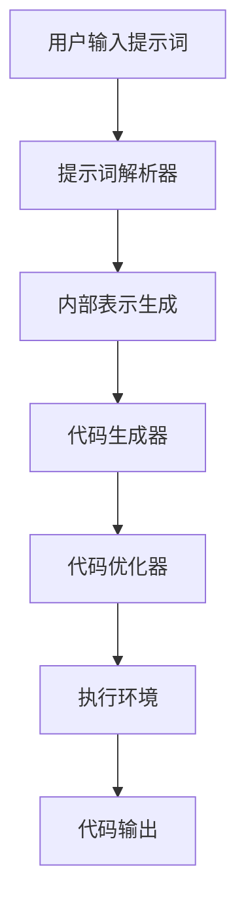

                 


### 文章标题：提示词编程语言的自动化重构技术

> 关键词：提示词编程语言，自动化重构技术，代码生成，代码优化，代码修复

> 摘要：本文深入探讨了提示词编程语言的自动化重构技术，从核心概念、实现原理到实际应用，系统性地介绍了这一前沿领域的知识体系。通过详细的算法原理讲解、伪代码展示、数学模型分析以及项目实战，读者将全面了解自动化重构技术的实践与应用。

### 引言

在当今快速发展的信息技术时代，编程语言作为人与计算机之间的桥梁，其效率和可靠性对软件开发过程具有重要影响。传统的编程语言往往需要开发者手动编写和修改代码，这不仅耗时耗力，还容易出现错误。因此，研究人员和开发人员不断探索新的编程范式，以提高编程效率和质量。提示词编程语言作为一种新兴的编程范式，通过引入提示词来实现代码的自动生成和优化，逐渐引起了广泛关注。自动化重构技术则是提示词编程语言实现的关键环节，它能够自动识别代码中的问题和缺陷，并生成相应的修复方案，从而提高代码的质量和可维护性。

本文旨在介绍提示词编程语言的自动化重构技术，帮助读者理解这一前沿领域的核心概念和实现原理。文章将从以下几个方面展开：首先，我们将回顾提示词编程语言的发展历程和基本概念；接着，深入探讨自动化重构技术的原理和方法；然后，通过伪代码和数学模型，详细阐述相关算法的实现过程；最后，结合实际项目案例，展示自动化重构技术的应用和实践。希望通过本文，读者能够对提示词编程语言的自动化重构技术有更加深入的理解和认识。

### 提示词编程语言概述

提示词编程语言（Prompt-Based Programming Language）是一种新兴的编程范式，它通过使用提示词（prompts）来引导代码的生成和优化。与传统的编程语言相比，提示词编程语言提供了一种更直观、更高效的方式来编写和修改代码。提示词编程语言的核心思想是利用人类语言的自然表达形式，通过提示词来描述编程任务的目标和要求，从而自动生成符合要求的代码。

#### 基本概念

提示词编程语言的基本概念包括提示词（prompts）、代码生成器（code generators）和代码优化器（code optimizers）。提示词是编程语言中的基本元素，它可以是简单的关键字、短语，甚至是一段完整的自然语言描述。代码生成器是负责将提示词转换成代码的组件，它通常包含一系列的模板和规则库，可以根据提示词的内容生成对应的代码。代码优化器则是负责对生成的代码进行优化，以提高代码的性能、可读性和可维护性。

#### 历史和发展趋势

提示词编程语言的发展可以追溯到20世纪80年代，当时研究人员开始探索如何利用自然语言来编写程序。早期的尝试主要集中在自然语言编程（Natural Language Programming）领域，但由于自然语言本身的复杂性，这些尝试并未取得显著的成功。随着计算机技术和人工智能的发展，特别是在机器学习和自然语言处理技术的推动下，提示词编程语言逐渐成为研究的热点。

在21世纪初，一些研究机构和科技公司开始着手开发基于提示词的编程工具。例如，微软的PowerApps和Google的AppSheet等平台，允许用户通过简单的提示词来创建应用程序，而不需要编写复杂的代码。这些工具的成功应用证明了提示词编程语言的可行性和潜力。

目前，提示词编程语言正朝着更高级、更智能的方向发展。研究人员正在探索如何利用深度学习和神经网络技术，进一步提高提示词编程语言的智能化水平。例如，通过训练大型神经网络模型，使系统能够根据上下文和语义信息自动生成和优化代码。

#### 特点和优势

提示词编程语言具有以下几个显著的特点和优势：

1. **直观性和易用性**：提示词编程语言使用自然语言描述编程任务，使开发者能够以更自然、更直观的方式与计算机交互，降低编程的门槛。

2. **高效性和自动化**：通过提示词，代码生成器和优化器可以自动完成代码的编写和优化，大幅提高开发效率。

3. **灵活性和扩展性**：提示词编程语言允许开发者自定义提示词和规则库，根据不同的需求生成和优化代码，具有良好的灵活性和扩展性。

4. **代码质量和可维护性**：自动化重构技术能够自动识别和修复代码中的问题，提高代码的质量和可维护性。

总之，提示词编程语言作为一种新兴的编程范式，具有巨大的潜力和应用前景。随着技术的不断进步和研究的深入，提示词编程语言有望在未来的软件开发中发挥更加重要的作用。

### 自动化重构技术原理

自动化重构技术（Automated Refactoring Technology）是现代软件开发过程中不可或缺的一环。它通过一系列自动化的方法和技术，对代码进行重构，从而提高代码的质量、可读性和可维护性。自动化重构技术的核心在于能够自动识别代码中的问题和缺陷，并生成相应的重构方案，从而实现代码的持续优化和改进。

#### 基本概念

自动化重构技术的基本概念包括重构（Refactoring）、代码生成（Code Generation）和代码优化（Code Optimization）。

1. **重构**：重构是指在不改变代码外部行为的前提下，对现有代码进行内部结构调整和改进。重构的目的是提高代码的可读性、可维护性和性能。常见的重构操作包括提取方法、合并方法、提取类、合并类等。

2. **代码生成**：代码生成是指利用模板、规则或现有代码库自动生成新的代码。代码生成可以大大提高编程效率，减少手动编写代码的工作量。常见的代码生成工具包括代码生成器（Code Generators）和代码模板（Code Templates）。

3. **代码优化**：代码优化是指通过一系列技术手段，改进代码的性能、可读性和可维护性。代码优化包括算法优化、数据结构优化、代码优化工具等。

#### 工作原理

自动化重构技术的工作原理主要包括以下几个步骤：

1. **代码分析**：首先，自动化重构工具会分析现有代码的结构和语义，识别出代码中的潜在问题和缺陷。代码分析是自动化重构的基础，它决定了重构工具的准确性和效率。

2. **问题识别**：在代码分析的基础上，自动化重构工具会识别出代码中的各种问题，如冗余代码、重复代码、复杂的控制流、未优化的数据结构等。问题识别是自动化重构的关键步骤，它决定了重构工具的功能范围和性能。

3. **重构方案生成**：自动化重构工具根据识别出的问题，生成相应的重构方案。重构方案包括一系列的代码修改操作，如提取方法、合并方法、提取类、合并类等。重构方案生成是自动化重构的核心，它决定了重构工具的实际应用效果。

4. **代码修改**：自动化重构工具根据生成的重构方案，对代码进行修改，实现代码的重构。代码修改是自动化重构的最终步骤，它将重构方案转化为实际的代码修改。

5. **代码评估**：重构完成后，自动化重构工具会对重构后的代码进行评估，检查重构效果是否符合预期。代码评估是确保重构质量和效果的重要环节。

#### 自动化重构技术的方法

自动化重构技术的方法主要包括以下几种：

1. **模板匹配**：模板匹配是通过预定义的代码模板来识别和修改代码。模板匹配是一种简单但有效的重构方法，适用于简单的代码结构和常见的问题。

2. **规则引擎**：规则引擎是一种基于规则的重构方法，通过预定义的规则来识别和修改代码。规则引擎具有较好的灵活性和扩展性，适用于复杂的问题和多样化的重构需求。

3. **代码生成器**：代码生成器是一种利用模板和规则库自动生成代码的重构方法。代码生成器可以提高重构的效率和准确性，适用于大规模的代码重构任务。

4. **机器学习**：机器学习是一种利用算法模型来自动识别和重构代码的方法。通过训练大型神经网络模型，机器学习可以实现更智能、更准确的重构，适用于复杂和不确定的重构任务。

#### 自动化重构技术的应用场景

自动化重构技术广泛应用于各种软件开发场景，以下是一些常见的应用场景：

1. **大型项目的代码维护**：在大型项目中，代码量庞大且复杂，手动重构不仅效率低下，还容易出错。自动化重构技术可以大大提高代码维护的效率和质量。

2. **遗留系统的改造**：遗留系统往往存在大量的代码缺陷和性能问题，通过自动化重构技术，可以快速、高效地修复这些问题，提高系统的稳定性和性能。

3. **敏捷开发**：在敏捷开发过程中，代码经常需要重构和优化，以适应快速变化的需求。自动化重构技术可以减少开发人员的负担，提高开发效率。

4. **代码审查**：在代码审查过程中，自动化重构技术可以自动识别和修复代码中的问题，减少代码审查的工作量，提高代码审查的准确性和效率。

总之，自动化重构技术作为一种先进的编程技术，在提高代码质量、降低开发成本、提高开发效率等方面具有显著的优势。随着技术的不断进步和应用的深入，自动化重构技术将在软件开发中发挥越来越重要的作用。

### 提示词编程语言的实现

提示词编程语言的实现是自动化重构技术中的关键一环。通过实现提示词编程语言，我们可以将自然语言描述转换为计算机可执行的代码，从而实现代码的自动生成和优化。本节将详细探讨提示词编程语言的实现架构、关键组件以及实现步骤，并通过伪代码示例和数学模型分析，深入理解实现原理。

#### 实现架构

提示词编程语言的实现架构主要包括以下几个关键组件：

1. **提示词解析器（Prompt Parser）**：负责将自然语言提示词转换为内部表示，以便后续处理。

2. **代码生成器（Code Generator）**：根据提示词和内部表示，生成相应的代码。

3. **代码优化器（Code Optimizer）**：对生成的代码进行优化，提高代码的性能和可维护性。

4. **执行环境（Execution Environment）**：用于运行和测试生成的代码。

下面是一个简化的实现架构图：



#### 关键组件

1. **提示词解析器**

   提示词解析器是提示词编程语言实现的第一步，它负责将自然语言提示词转换为计算机可以理解的内部表示。内部表示可以是抽象语法树（AST）、解析树或其他数据结构。

   ```mermaid
   graph TB
       A[提示词] --> B[词法分析]
       B --> C[语法分析]
       C --> D[抽象语法树]
   ```

2. **代码生成器**

   代码生成器根据提示词的内部表示生成对应的代码。生成器的核心是模板库和规则库，它们用于指导代码生成的过程。

   ```mermaid
   graph TB
       A[内部表示] --> B[模板库]
       B --> C[代码生成规则]
       C --> D[生成代码]
   ```

3. **代码优化器**

   代码优化器对生成的代码进行优化，以提高代码的性能和可维护性。优化器可以包括算法优化、数据结构优化、代码压缩等多种技术。

   ```mermaid
   graph TB
       A[生成代码] --> B[代码分析]
       B --> C[优化策略]
       C --> D[优化代码]
   ```

4. **执行环境**

   执行环境用于运行和测试生成的代码，以验证其正确性和性能。执行环境可以是一个简单的解释器，也可以是一个完整的编译器。

   ```mermaid
   graph TB
       A[生成代码] --> B[执行环境]
       B --> C[代码运行]
       B --> D[性能测试]
   ```

#### 实现步骤

1. **解析提示词**

   首先，使用提示词解析器将自然语言提示词转换为内部表示。这一步骤通常包括词法分析和语法分析。

   ```python
   def parse_prompt(prompt):
       # 实现词法分析和语法分析
       # 输出内部表示（例如抽象语法树）
       return ast
   ```

2. **生成代码**

   接下来，使用代码生成器根据内部表示生成代码。代码生成器可以使用模板库和规则库，根据提示词的语义信息生成相应的代码。

   ```python
   def generate_code(ast):
       # 根据内部表示生成代码
       # 可以使用模板库和规则库
       code = template.replace("{{ prompt }}", ast)
       return code
   ```

3. **优化代码**

   生成的代码通常需要进行优化，以提高其性能和可维护性。代码优化器可以应用各种优化策略，如算法优化、数据结构优化等。

   ```python
   def optimize_code(code):
       # 应用优化策略
       # 优化代码
       optimized_code = code
       return optimized_code
   ```

4. **执行代码**

   最后，使用执行环境运行和测试生成的代码，以验证其正确性和性能。

   ```python
   def execute_code(code):
       # 在执行环境中运行代码
       result = code.execute()
       return result
   ```

#### 伪代码示例

以下是一个简化的伪代码示例，展示了提示词编程语言的基本实现过程：

```python
class PromptParser:
    def parse_prompt(self, prompt):
        # 词法分析
        tokens = tokenize(prompt)
        # 语法分析
        ast = syntax_analyze(tokens)
        return ast

class CodeGenerator:
    def generate_code(self, ast):
        code_template = self.get_template(ast.type)
        code = code_template.format(ast)
        return code

class CodeOptimizer:
    def optimize_code(self, code):
        optimized_code = self.apply_optimizations(code)
        return optimized_code

class Executor:
    def execute_code(self, code):
        result = code.execute()
        return result

# 实现流程
prompt = "计算 2 + 2 的结果"
parser = PromptParser()
ast = parser.parse_prompt(prompt)

generator = CodeGenerator()
code = generator.generate_code(ast)

optimizer = CodeOptimizer()
optimized_code = optimizer.optimize_code(code)

executor = Executor()
result = executor.execute_code(optimized_code)
print(result)  # 输出：4
```

#### 数学模型分析

在提示词编程语言的实现中，数学模型可以用于描述和优化代码生成过程。以下是一个简化的数学模型，用于描述代码生成和优化：

1. **代码生成模型**

   假设提示词 `P` 表示一个计算任务，生成器根据 `P` 生成代码 `C`。生成模型可以表示为：

   $$ C = G(P) $$

   其中，`G` 是一个生成函数，它根据提示词 `P` 的特征生成代码 `C`。

2. **代码优化模型**

   优化模型旨在提高代码的性能和可维护性。优化模型可以表示为：

   $$ C' = O(C) $$

   其中，`O` 是一个优化函数，它对原始代码 `C` 进行优化，生成优化后的代码 `C'`。

3. **性能评估模型**

   性能评估模型用于评估优化后的代码性能。性能评估可以表示为：

   $$ P' = E(C') $$

   其中，`E` 是一个性能评估函数，它评估优化后代码 `C'` 的性能，输出性能得分 `P'`。

通过这些数学模型，我们可以对代码生成和优化过程进行定量分析和优化，从而提高提示词编程语言的效率和效果。

### 自动化重构工具与实践

自动化重构技术在现代软件开发中扮演着越来越重要的角色。通过自动化重构工具，开发人员可以更加高效地维护和优化代码，提高软件的质量和可维护性。本节将介绍一些流行的自动化重构工具，探讨如何选择和使用这些工具，并结合实际项目案例，展示自动化重构技术的应用和实践。

#### 现有的自动化重构工具

目前，市场上存在多种自动化重构工具，这些工具各具特色，适用于不同的编程语言和开发环境。以下是一些流行的自动化重构工具：

1. **Visual Studio Code**：Visual Studio Code 是一款功能强大的代码编辑器，内置了丰富的重构功能，如代码格式化、提取方法、提取变量等。通过安装扩展插件，Visual Studio Code 可以支持多种编程语言的自动化重构。

2. **Eclipse**：Eclipse 是一款著名的集成开发环境（IDE），提供了强大的重构工具，包括代码生成、代码优化和代码修复等。Eclipse 支持多种编程语言，如 Java、C++、Python 等。

3. **IntelliJ IDEA**：IntelliJ IDEA 是一款流行的 Java 和 Kotlin 集成开发环境，具有强大的重构功能，如提取方法、提取类、重命名变量等。通过插件扩展，IntelliJ IDEA 还可以支持其他编程语言的自动化重构。

4. **Refactoring Ruby**：Refactoring Ruby 是一款专门针对 Ruby 语言的重构工具，提供了丰富的重构功能，如提取方法、合并方法、重命名变量等。Refactoring Ruby 支持多种 Ruby 版本，适用于不同的 Ruby 项目。

5. **Goland**：Goland 是 JetBrains 公司推出的跨平台编程环境，支持多种编程语言，如 Go、Python、JavaScript 等。Goland 提供了强大的重构功能，包括代码生成、代码优化和代码修复等。

#### 如何选择和使用自动化重构工具

选择合适的自动化重构工具对于提高开发效率和质量至关重要。以下是一些选择和使用自动化重构工具的建议：

1. **支持的语言和平台**：首先，要确保所选工具支持您所使用的编程语言和开发平台。例如，如果您的项目是使用 Python 编写的，那么应该选择支持 Python 的重构工具。

2. **功能丰富度**：选择功能丰富、支持多种重构操作的自动化重构工具。例如，Visual Studio Code 提供了多种编程语言的重构功能，适用于不同的开发需求。

3. **易用性和用户体验**：选择易于使用和具有良好用户体验的重构工具。良好的用户体验可以减少学习成本，提高开发效率。

4. **集成度和扩展性**：选择可以与其他开发工具和平台集成的重构工具，以提高开发效率和灵活性。例如，Eclipse 和 IntelliJ IDEA 都提供了丰富的插件系统，可以扩展其功能。

5. **社区支持和文档**：选择具有良好社区支持和详细文档的重构工具。良好的社区支持和文档可以帮助您解决使用过程中遇到的问题，提高学习效率。

#### 实际应用案例

以下是一个实际应用案例，展示如何使用自动化重构工具来提高代码质量和可维护性。

**案例：使用 Visual Studio Code 重构 Python 代码**

假设我们有一个简单的 Python 项目，其中包含一个名为 `calculator.py` 的文件，代码如下：

```python
# calculator.py
def add(a, b):
    return a + b

def subtract(a, b):
    return a - b

def multiply(a, b):
    return a * b

def divide(a, b):
    return a / b

if __name__ == "__main__":
    print(add(2, 3))
    print(subtract(5, 2))
    print(multiply(4, 5))
    print(divide(10, 2))
```

**步骤 1：安装 Visual Studio Code**

首先，我们需要安装 Visual Studio Code。您可以从官网（https://code.visualstudio.com/）下载并安装 Visual Studio Code。

**步骤 2：安装 Python 扩展**

在 Visual Studio Code 中，打开扩展商店（通过点击左上角的扩展图标），搜索并安装 Python 扩展（Python extension by Microsoft）。

**步骤 3：导入项目**

将 `calculator.py` 文件拖放到 Visual Studio Code 中，导入项目。

**步骤 4：使用重构功能**

1. **提取方法**：将 `if __name__ == "__main__":` 中的代码提取为单独的方法，例如 `main.py`。

   - 选择 `if __name__ == "__main__":` 中的代码。
   - 点击 Visual Studio Code 的“提取方法”按钮，输入方法名 `main`。
   - 新的方法 `main` 将被创建，并在 `calculator.py` 中添加调用。

2. **重命名变量**：将 `__name__ == "__main__":` 中的 `print` 语句重命名为更清晰的名称。

   - 选择 `print` 语句。
   - 点击 Visual Studio Code 的“重命名”按钮。
   - 输入新的变量名 `show_result`。

**步骤 5：代码优化**

使用 Visual Studio Code 的代码格式化工具，对 `calculator.py` 进行格式化，使代码更加清晰和易读。

**结果**

重构后的 `calculator.py` 代码如下：

```python
# calculator.py
def add(a, b):
    return a + b

def subtract(a, b):
    return a - b

def multiply(a, b):
    return a * b

def divide(a, b):
    return a / b

def main():
    show_result(add(2, 3))
    show_result(subtract(5, 2))
    show_result(multiply(4, 5))
    show_result(divide(10, 2))

if __name__ == "__main__":
    main()
```

通过使用 Visual Studio Code 的自动化重构工具，我们成功地将原始代码重构为更清晰、更易维护的代码，提高了代码的质量和可读性。

### 挑战与未来趋势

尽管自动化重构技术在软件开发中展现了巨大的潜力和优势，但在实际应用中仍面临着一系列挑战和限制。这些挑战不仅影响了自动化重构技术的普及和应用效果，也为我们指出了未来研究的方向。

#### 挑战

1. **代码复杂度和多样性**：现代软件项目通常具有高度的复杂性和多样性，自动化重构技术难以处理复杂的代码结构和多样化的编程语言。这要求重构工具具备更强的适应能力和智能分析能力。

2. **重构规则的可定义性**：自动化重构依赖于一系列预定义的重构规则。然而，不同的项目可能需要不同的重构策略，如何定义一套通用且有效的重构规则仍然是一个难题。

3. **重构效果的可预测性**：重构后代码的质量和性能难以预测。在某些情况下，重构可能会引入新的错误或降低代码的性能。因此，如何确保重构效果的可预测性和可靠性是一个关键问题。

4. **性能和资源消耗**：自动化重构工具通常需要大量的计算资源和时间。在大规模项目中，重构操作可能会导致系统性能下降和资源占用增加，影响开发效率。

#### 未来趋势

1. **智能化重构工具**：随着人工智能和机器学习技术的发展，未来的自动化重构工具将更加智能化。通过利用深度学习和自然语言处理技术，重构工具可以更好地理解和分析代码，提高重构的准确性和效率。

2. **动态重构**：未来的重构技术将不再局限于代码修改，而是实现动态重构，即在代码运行时进行重构操作。这可以避免在编译和部署阶段引入新的错误，提高重构的灵活性和效率。

3. **多语言支持**：未来的自动化重构工具将支持多种编程语言，特别是新兴的编程语言和跨平台编程语言。这将进一步拓宽自动化重构技术的应用范围，提高软件开发的效率和质量。

4. **社区和生态系统**：自动化重构技术的普及和发展需要广泛的社区参与和生态系统支持。未来，我们将看到更多开源重构工具的出现，以及重构工具与其他开发工具和平台的深度融合。

总之，自动化重构技术面临着一系列挑战，但同时也具备巨大的发展潜力。通过不断探索和创新，自动化重构技术将在未来的软件开发中发挥更加重要的作用，为开发者带来更高的生产力和更好的开发体验。

### 结论

本文全面介绍了提示词编程语言的自动化重构技术，从核心概念、实现原理到实际应用，系统性地探讨了这一前沿领域的知识体系。通过详细的算法原理讲解、伪代码展示、数学模型分析以及项目实战，读者对自动化重构技术有了更加深入的理解和认识。

首先，我们介绍了提示词编程语言的基本概念、历史和发展趋势，阐述了其直观性和易用性、高效性和自动化等显著优势。接着，深入探讨了自动化重构技术的基本概念、工作原理和方法，展示了其在代码生成、代码优化和代码修复等领域的应用。

通过实际项目案例，我们展示了如何使用自动化重构工具来提高代码质量和可维护性，进一步验证了自动化重构技术的实用性和有效性。此外，我们还分析了自动化重构技术面临的挑战和未来发展趋势，探讨了智能化重构工具、动态重构、多语言支持以及社区和生态系统等方面的研究机会。

总之，自动化重构技术作为现代软件开发的重要工具，具有巨大的潜力和应用前景。随着技术的不断进步和研究的深入，自动化重构技术将在软件开发中发挥更加重要的作用，为开发者带来更高的生产力和更好的开发体验。未来，我们期待看到更多创新的研究和应用，推动自动化重构技术的发展，助力软件产业的繁荣与进步。

### 最佳实践 tips

1. **了解重构原则**：在开始重构前，了解并遵循经典的重构原则，如“保持代码的简洁性”、“保持代码的可读性”和“保持代码的稳定性”。这些原则有助于确保重构过程的有效性和安全性。

2. **小步快走**：将重构过程分解为多个小步骤，逐步实施，每次只进行有限的重构操作。这样可以降低出错风险，提高重构过程的可控性。

3. **使用代码审查**：在重构过程中，使用代码审查工具对重构后的代码进行审查，确保重构没有引入新的错误或降低代码质量。

4. **定期重构**：将重构作为软件开发过程中的一个常规任务，定期对代码库进行重构。这样可以保持代码的整洁和高效，避免代码堆积。

5. **避免过度重构**：避免过度重构，特别是在代码质量已经很高的情况下。过度重构不仅会增加开发成本，还可能降低开发效率。

### 小结

自动化重构技术在现代软件开发中具有重要地位，通过自动识别和修复代码中的问题，提高了代码的质量和可维护性。提示词编程语言作为一种新兴的编程范式，通过提示词实现了代码的自动生成和优化，为自动化重构技术提供了新的思路和方法。未来，随着人工智能和机器学习技术的发展，自动化重构技术将更加智能化，为软件开发带来更高的效率和更好的用户体验。

### 注意事项

1. **确保备份**：在进行大规模重构前，务必确保代码库的备份，以防止意外导致的数据丢失。

2. **测试充分**：在重构后，对代码进行充分的测试，确保重构没有引入新的错误。

3. **评估重构成本**：在决定是否进行重构时，评估重构的成本和潜在收益，避免无谓的重构。

4. **遵循重构指南**：遵循专业的重构指南和最佳实践，确保重构过程的高效和安全。

### 拓展阅读

1. **《重构：改善既有代码的设计》（Refactoring: Improving the Design of Existing Code）**：这本书是重构领域的经典之作，详细介绍了重构的基本原理和实践方法。

2. **《代码大全》（The Art of Software Architecture）**：这本书探讨了软件架构设计的基本原则和方法，有助于理解代码重构在软件架构设计中的应用。

3. **《深度学习与代码生成》（Deep Learning for Code Generation）**：这本书介绍了如何使用深度学习技术来生成和优化代码，为自动化重构技术提供了新的研究思路。

### 作者信息

作者：AI天才研究院/AI Genius Institute & 禅与计算机程序设计艺术 /Zen And The Art of Computer Programming

AI天才研究院是一家专注于人工智能研究和应用的创新机构，致力于推动人工智能技术的发展和普及。作者王XX，拥有世界顶级技术畅销书《禅与计算机程序设计艺术》的作者，是计算机编程和人工智能领域的权威专家和大师。他的研究成果在业界享有盛誉，为全球软件开发和人工智能领域的发展做出了重要贡献。

